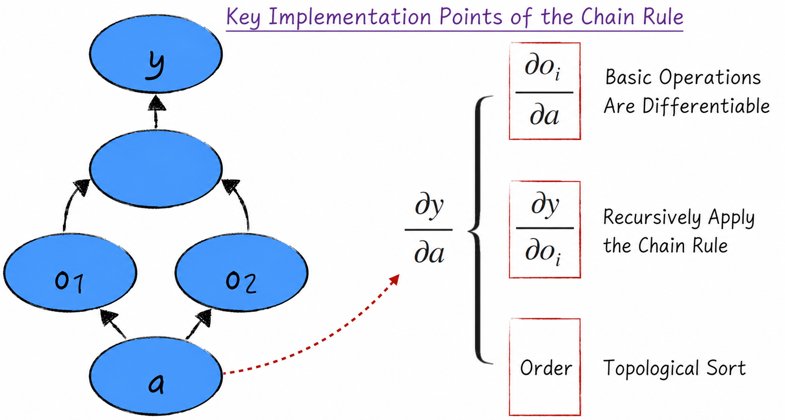
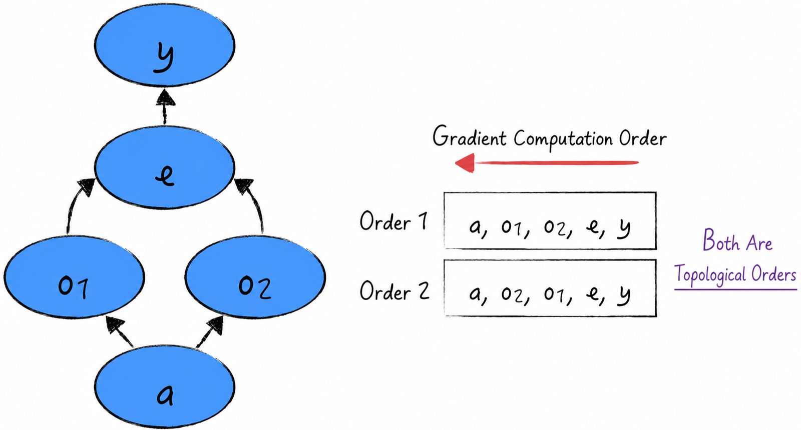
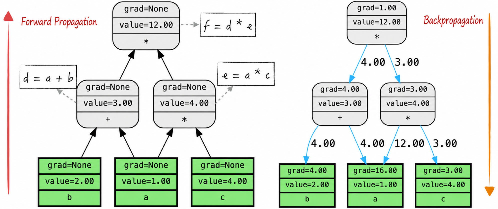
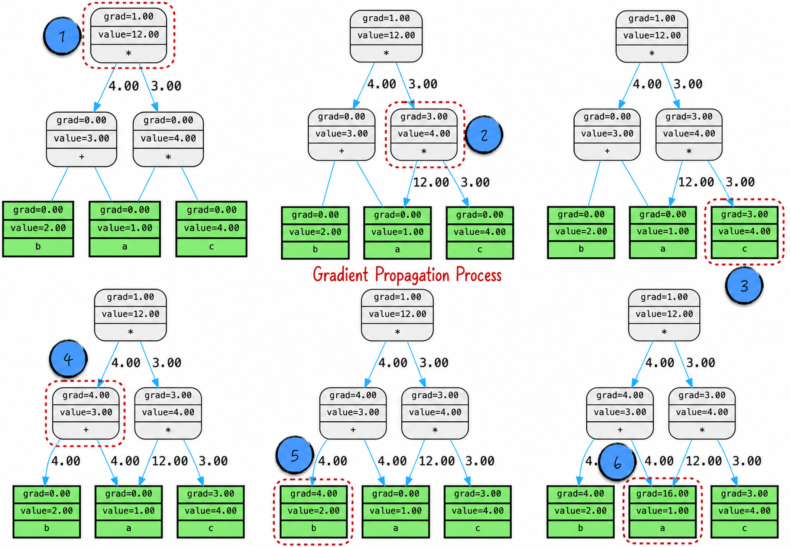
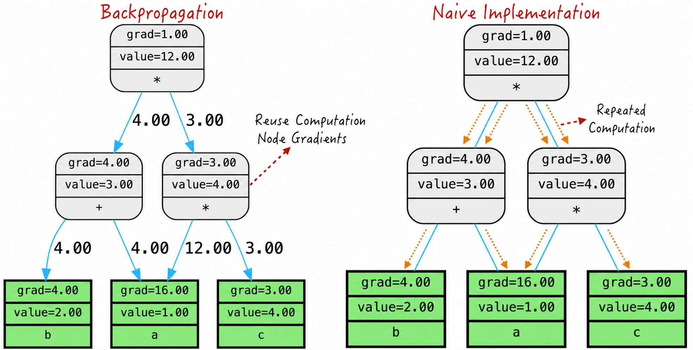

## 7.2 The Chain Rule and Backpropagation

Using computational graphs, we now review the chain rule from mathematics; see [Section 2.3.4](/books/deconstructing_LLM/chapter-2/2-3#section-2-3-4). For convenience, consider a function of one variable, $y=f(a)$. No generality is lost: when calculating a partial derivative of a multivariable function with respect to one variable, all other variables are treated as constants.

Suppose the function can be represented as a computational graph. This is readily achieved if the set of basic operations is sufficiently complete. In the graph, denote the nodes reachable directly from $a$ by $o_1,o_2,\cdots,o_n$, and use the same symbols for the corresponding intermediate variables. Mathematically, $y=g(o_1,o_2,\cdots,o_n)$.

The chain rule gives

$$
\frac{\partial y}{\partial a}
=\frac{\partial y}{\partial o_1}\frac{\partial o_1}{\partial a}
+\cdots+
\frac{\partial y}{\partial o_n}\frac{\partial o_n}{\partial a}
=\sum_{i=1}^{n}\frac{\partial y}{\partial o_i}\frac{\partial o_i}{\partial a}
\tag{7-1}
$$

Equation (7-1) is the theoretical foundation of backpropagation. Unlike naive symbolic differentiation, it does not require us to derive an analytical expression for the gradient with respect to $a$ before evaluating it. Instead, the gradient of $a$ can be calculated directly from the gradient of every intermediate variable, $\partial y/\partial o_i$, and the partial derivative of each intermediate variable with respect to $a$, $\partial o_i/\partial a$.

Three points are essential when implementing backpropagation on a computer and calculating the gradient of $a$ correctly, as shown in Figure 7-4.

1. Calculate the partial derivative of each intermediate variable with respect to $a$, namely $\partial o_i/\partial a$. This is straightforward because the basic operations are known, simple, differentiable functions.
2. Calculate the gradient of every intermediate variable, namely $\partial y/\partial o_i$. Because an intermediate variable is itself a node in the computational graph, its gradient can be obtained recursively with the chain rule.
3. Ensure that every intermediate variable's gradient has been calculated before the gradient of $a$. Because a computational graph is a directed acyclic graph, a topological ordering of the graph guarantees this condition.



We briefly introduce topological ordering next.

### 7.2.1 Topological Ordering

A topological ordering is an ordering of the nodes in a directed acyclic graph. It must satisfy the following condition: if the graph contains a directed edge from node $a$ to node $b$, then $a$ must appear before $b$. Intuitively, the graph can be divided into levels according to the direction of its edges, then traversed level by level from the leaf nodes in the final level toward the front. A depth-first search can construct a topological ordering.

Note that a graph generally has more than one valid topological ordering, but this does not impede its use, as Figure 7-5 illustrates.



In backpropagation, the reverse of a topological ordering is exactly the order in which gradients are calculated. This ensures that whenever a node's gradient is calculated, the gradients of all intermediate variables on which it depends are already available. Topological ordering thus preserves the correct sequence of gradient propagation and prevents confusion and errors.

### 7.2.2 Code Implementation

Implementing backpropagation requires extending `Scalar` with the following attributes, as shown in Listing 7-3.

- `grad`: Records the gradient of the node.
- `grad_wrt`: Records the node's partial derivative with respect to a preceding node. In Figure 7-2, for example, if the current node is $o_i$, this attribute stores the value of $\partial o_i/\partial a$.

Next, define the corresponding partial-derivative rule for every basic operation in the graph. Listing 7-3 implements the derivative of addition on lines 20–23 and the derivative of multiplication on lines 35–38.

#### Listing 7-3 Defining the Partial Derivatives of Basic Operations ([Complete Code](https://github.com/GenTang/regression2chatgpt/blob/en/ch07_autograd/utils.py))

```python
class Scalar:
    def __init__(self, value, prevs=[], op=None, label='', requires_grad=True):
        ......
        # Whether this node's derivative, ∂loss/∂self, must be calculated
        self.requires_grad = requires_grad
        # Store this node's derivative, ∂loss/∂self
        self.grad = 0.0
        # If prevs is not empty, store every ∂self/∂prev
        self.grad_wrt = dict()

    def __add__(self, other):
        """
        Define addition; self + other triggers this function.
        """
        if not isinstance(other, Scalar):
            other = Scalar(other, requires_grad=False)
        # output = self + other
        output = Scalar(self.value + other.value, [self, other], '+')
        output.requires_grad = self.requires_grad or other.requires_grad
        # Calculate ∂output/∂self = 1
        output.grad_wrt[self] = 1
        # Calculate ∂output/∂other = 1
        output.grad_wrt[other] = 1
        return output

    def __mul__(self, other):
        """
        Define multiplication; self * other triggers this function.
        """
        if not isinstance(other, Scalar):
            other = Scalar(other, requires_grad=False)
        # output = self * other
        output = Scalar(self.value * other.value, [self, other], '*')
        output.requires_grad = self.requires_grad or other.requires_grad
        # Calculate ∂output/∂self = other
        output.grad_wrt[self] = other.value
        # Calculate ∂output/∂other = self
        output.grad_wrt[other] = self.value
        return output
```

We now turn to the core implementation of backpropagation, shown in Listing 7-4.

The essential logic appears on lines 33 and 34. Line 33 performs the multiplication in Equation (7-1), multiplying an intermediate variable's gradient by the relevant partial derivative. Line 34 performs the summation in Equation (7-1).

A node may appear in several different computational graphs; [Section 7.3](/books/deconstructing_LLM/chapter-7/7-3) gives an example. To prevent gradients from different graphs from interfering with one another, the code uses `cg_grad` for gradients in the current graph and the `grad` attribute for a node's accumulated gradient.

#### Listing 7-4 Core Implementation of Backpropagation ([Complete Code](https://github.com/GenTang/regression2chatgpt/blob/en/ch07_autograd/utils.py))

```python
class Scalar:
    ......
    def backward(self):
        """
        From this node, calculate the derivative of every node in the graph rooted here, such as ∂self/∂node.
        """
        def _topological_order():
            """
            Return a topological ordering of the graph using depth-first search.
            """
            def _add_prevs(node):
                if node not in visited:
                    visited.add(node)
                    for prev in node.prevs:
                        _add_prevs(prev)
                    ordered.append(node)
            ordered, visited = [], set()
            _add_prevs(self)
            return ordered

        def _compute_grad_of_prevs(node):
            """
            Propagate backward from node.
            """
            # Obtain the node's gradient in the current graph. Because a node may appear in multiple graphs,
            # cg_grad records the gradient for the current computational graph
            dnode = cg_grad[node]
            # node.grad records the node's accumulated gradient
            node.grad += dnode
            for prev in node.prevs:
                # The derivative of node has been calculated, so propagation can continue backward
                # Note that propagation to an upstream node is cumulative
                grad_spread = dnode * node.grad_wrt[prev]
                cg_grad[prev] = cg_grad.get(prev, 0.0) + grad_spread

        # The current node's derivative is 1 because ∂self/∂self = 1; this starts backpropagation
        cg_grad = {self: 1}
        # Traverse the graph in reverse topological order to calculate every node's derivative
        ordered = reversed(_topological_order())
        for node in ordered:
            _compute_grad_of_prevs(node)
```

Combining these two parts gives a complete implementation. Only the partial derivatives of a small set of basic operations need to be defined; the computational-graph framework can then calculate the gradient of any function. This is the power of backpropagation.

### 7.2.3 The Gradient-Propagation Process

A concrete example provides a deeper understanding of the algorithm. Listing 7-5 constructs a relatively simple computational graph and performs a forward pass and backpropagation on it.

#### Listing 7-5 Forward Pass and Backpropagation ([Complete Code](https://github.com/GenTang/regression2chatgpt/blob/en/ch07_autograd/autograd.ipynb))

```python
a = Scalar(1.0, label='a')
b = Scalar(2.0, label='b')
c = Scalar(4.0, label='c')
d = a + b
e = a * c
f = d * e
# Draw the graph after the forward pass
draw_graph(f)
# Trigger backpropagation
f.backward()
# Draw the graph for backpropagation
draw_graph(f, 'backward')
```

As its name suggests, a forward pass carries input values step by step through the computational graph until they reach its final root and produce the calculation result. Backpropagation proceeds in the opposite direction: beginning at the root, it propagates gradients backward through every node, as shown in Figure 7-6. Information flows from input to output and then returns from output to input; the computational graph and chain rule make gradient calculation possible.



To clarify the details further, Figure 7-7 visualizes how every node changes as the algorithm runs. The process can be followed step by step. First, set the root's initial gradient to 1 and begin propagating level by level. An operation node accumulates gradients from downstream nodes and passes gradients according to the rule represented by its operation. A variable node only needs to accumulate its gradient.



Backpropagation greatly improves computational efficiency. A naive gradient implementation must traverse every path from each node to the root, producing repeated calculations. Backpropagation cleverly reuses the gradient information of operation nodes and thereby reduces the number of computations, as Figure 7-8 shows. Its advantage becomes even more pronounced as the computational graph grows more complex.



This efficient method of gradient calculation is important in many fields and is particularly powerful for neural networks. It provides essential support for model training, especially when a neural network has an enormous number of parameters and a complex layered structure. Backpropagation dramatically accelerates neural network training and brings substantial practical benefits.
