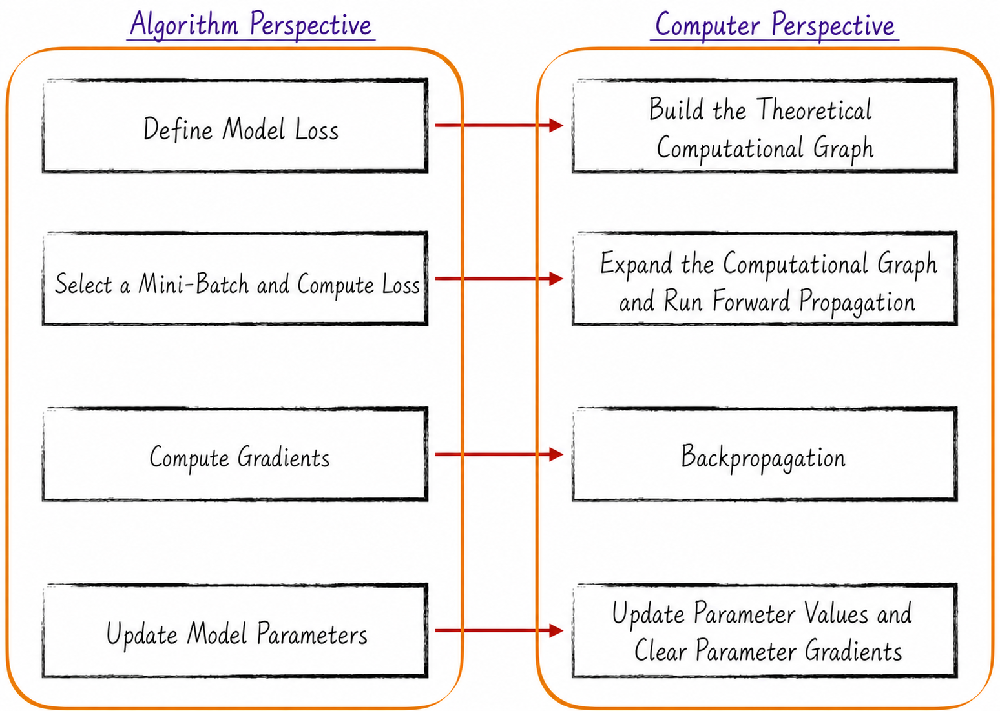
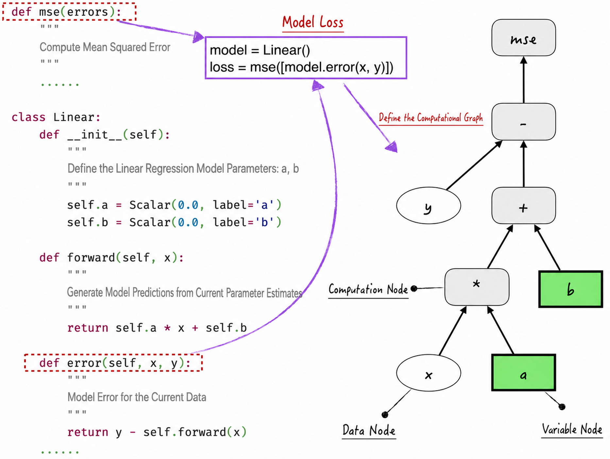
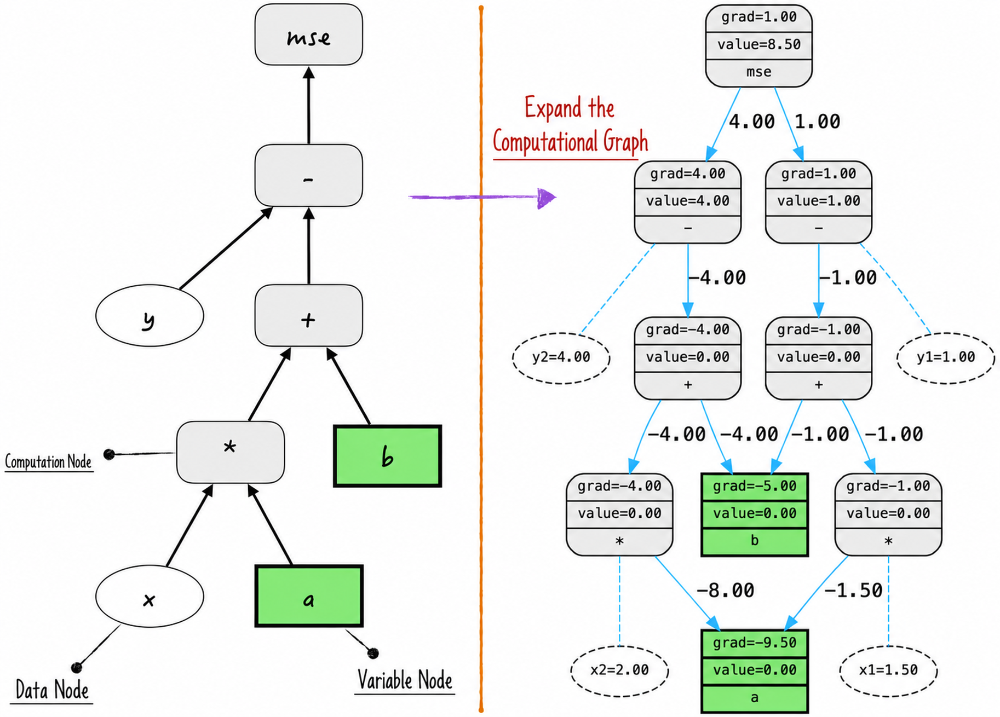
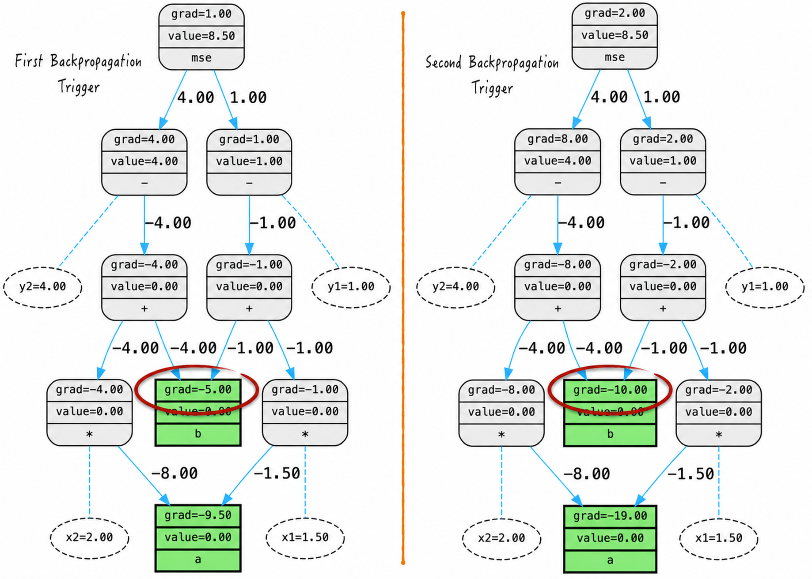
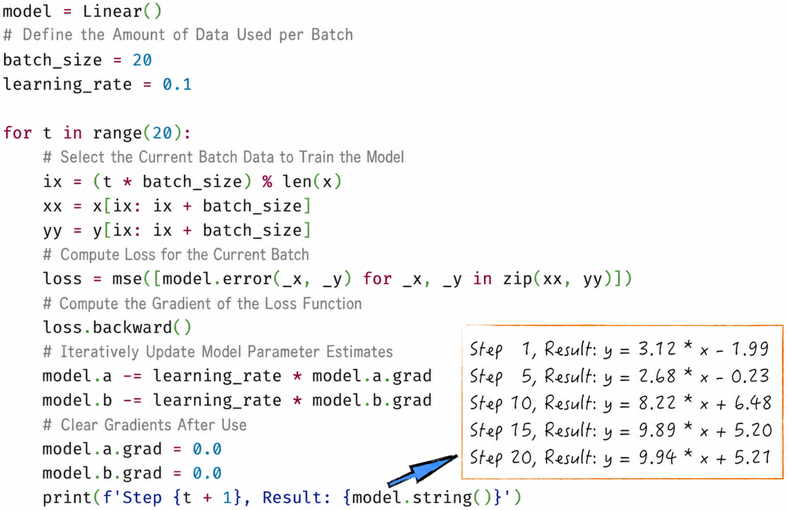

## 7.3 The Complete Parameter-Estimation Process

The preceding sections constructed a computational graph and implemented backpropagation, making the calculation process visible. This section uses those tools to explore how the optimization algorithms introduced in [Chapter 6](/books/deconstructing_LLM/chapter-6) operate. For simplicity, it considers only vanilla stochastic gradient descent.

We will see how the two key subprocesses, the forward and backward passes, work together; how the computational graph changes with the training data; how gradients move through the graph; and how this process gradually improves the model. This clear, intuitive account reveals the essence of model training and prepares us for more advanced optimization techniques.

### 7.3.1 Review of Stochastic Gradient Descent

In vanilla stochastic gradient descent, one parameter-update iteration can be summarized as follows: define the model's loss function from its predetermined prediction formula; select a batch of training data and calculate the prediction loss; calculate the gradient of the loss with respect to the model parameters; and update those parameters to reduce the loss.

From a computational perspective, Figure 7-9 presents the process in four steps.

1. Generate the model's theoretical computational graph.
2. Expand the graph using the selected training data and perform a forward pass.
3. Perform backpropagation to calculate the gradients.
4. Update the model parameters and clear the gradient information stored in them.



The “computational-graph expansion” in step 2 may seem abstract. A simple linear regression example makes the process intuitive.

### 7.3.2 Computational-Graph Expansion

First, define a linear regression model, illustrated by the code in Figure 7-10 ([Complete Code](https://github.com/GenTang/regression2chatgpt/blob/en/ch07_autograd/linear_model.py)). Not every node in a computational graph requires a gradient. Input-data nodes such as $x$ and $y$, for example, do not require gradient calculation during backpropagation.

To make this distinction explicit, we introduce **data nodes**, which identify nodes whose gradients need not be calculated. The graph now contains three types of nodes: data nodes, variable nodes, and operation nodes. This classification clarifies the roles of the nodes during gradient calculation and makes the diagram easier to understand.



We now examine the key phenomenon of computational-graph expansion. Listing 7-6 contains two training observations, denoted $(x_1,y_1)$ and $(x_2,y_2)$. When these observations are passed into the model to calculate the loss, the graph expands as shown in Figure 7-11. The expansion factor is approximately equal to the amount of data used. If the model is already complex and a large quantity of data is processed at once, the resulting graph may become enormous—possibly exceeding the computer hardware's capacity and preventing execution.

#### Listing 7-6 Computational-Graph Expansion ([Complete Code](https://github.com/GenTang/regression2chatgpt/blob/en/ch07_autograd/optim_process.ipynb))

```python
# Computational-graph expansion
model = Linear()
x1 = Scalar(1.5, label='x1', requires_grad=False)
y1 = Scalar(1.0, label='y1', requires_grad=False)
x2 = Scalar(2.0, label='x2', requires_grad=False)
y2 = Scalar(4.0, label='y2', requires_grad=False)
loss = mse([model.error(x1, y1), model.error(x2, y2)])
draw_graph(loss)
```



This phenomenon reveals an important limitation of backpropagation: complex models must be designed with computational-resource constraints in mind, and large quantities of data cannot be processed all at once. In vanilla stochastic gradient descent, for example, the batch size may have to remain small. Fortunately, practical methods can mitigate this limitation; see [Section 7.4.1](/books/deconstructing_LLM/chapter-7/7-4#section-7-4-1).

When backpropagation is triggered, gradients pass in reverse through the expanded graph until the gradients of the model parameters are obtained, as shown in Figure 7-12. Each invocation causes variable nodes to accumulate the gradient from the current, expanded graph. Once those gradients have been used, they must be cleared promptly to prevent unexpected errors.



Combining the ideas discussed above makes it possible to estimate model parameters without relying on a third-party algorithm library. Figure 7-13 shows the code and its result. In practice, these steps rarely need to be implemented manually because frameworks such as PyTorch provide mature abstractions. Writing the code ourselves, however, reveals the core process behind each framework call and establishes a foundation for deeper study and research.


