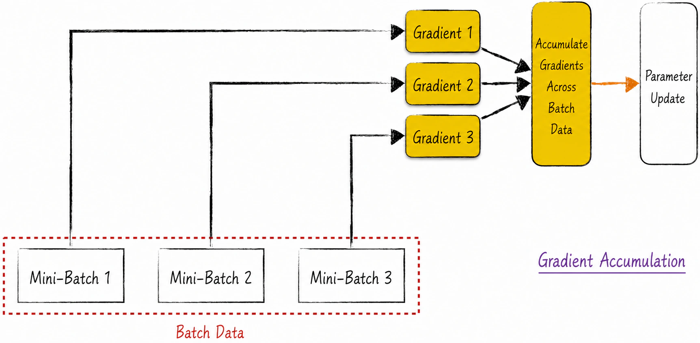
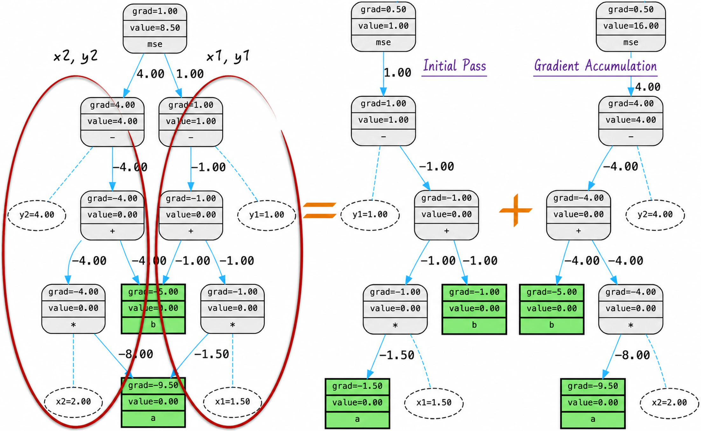
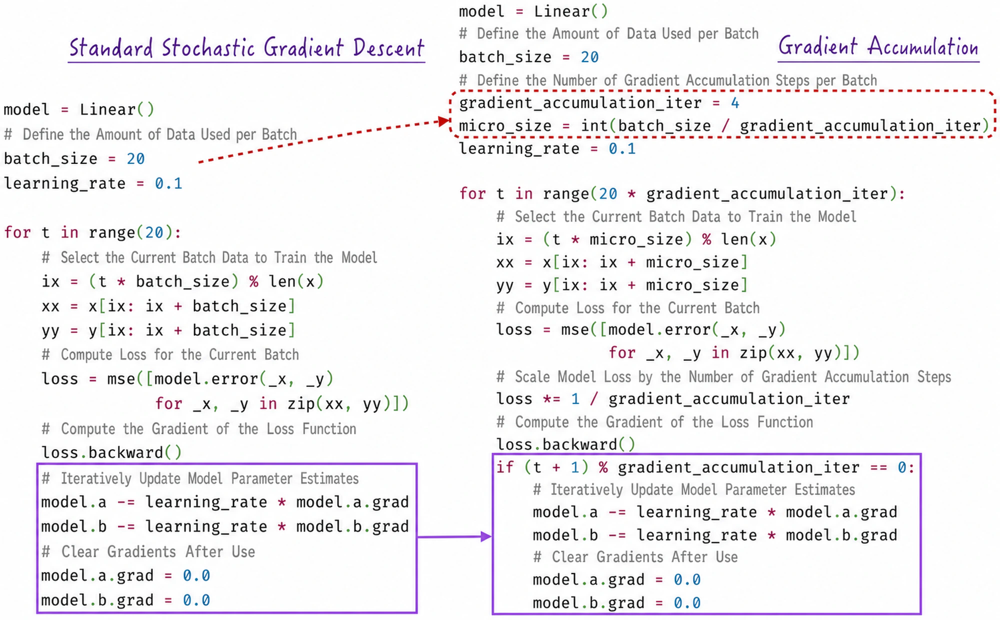
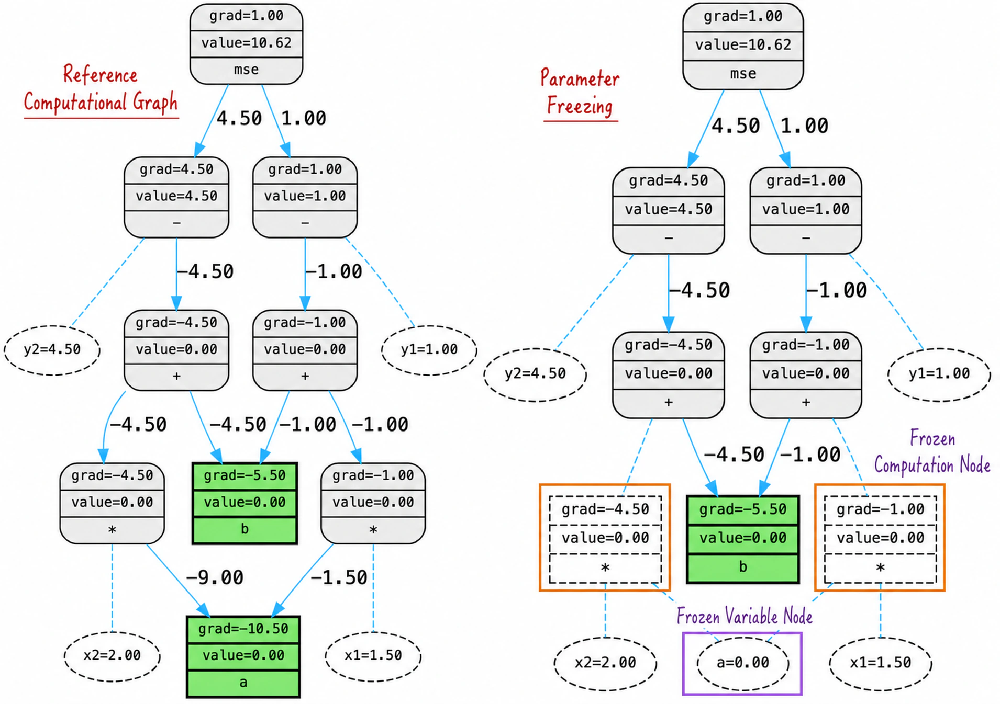
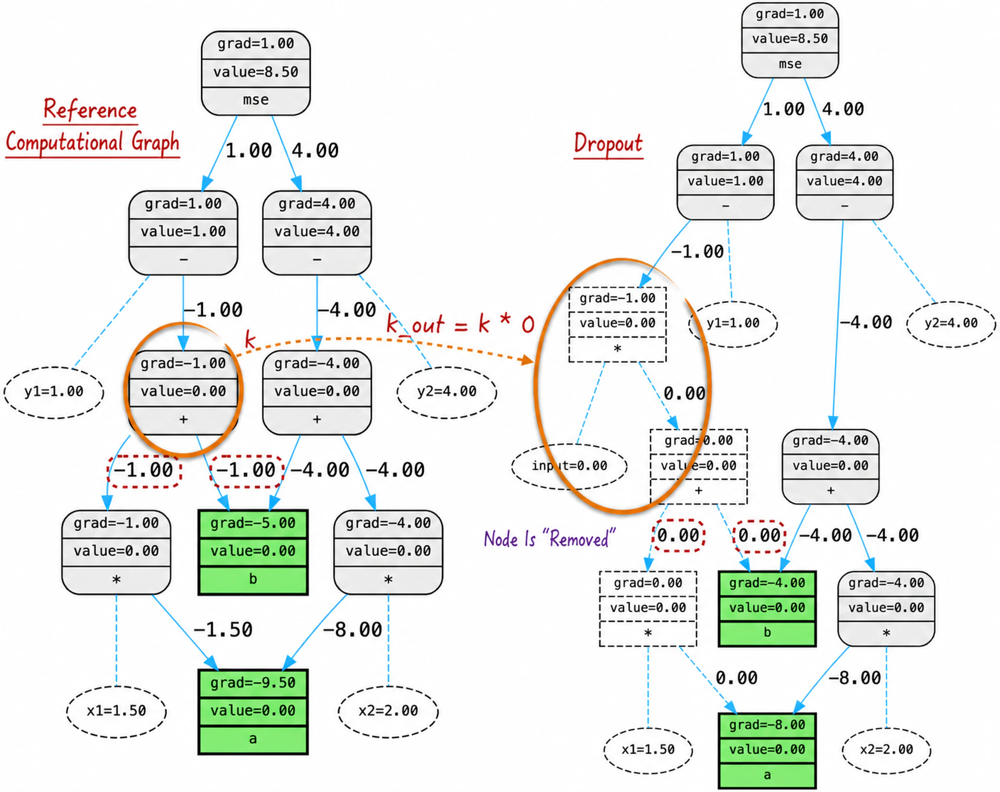
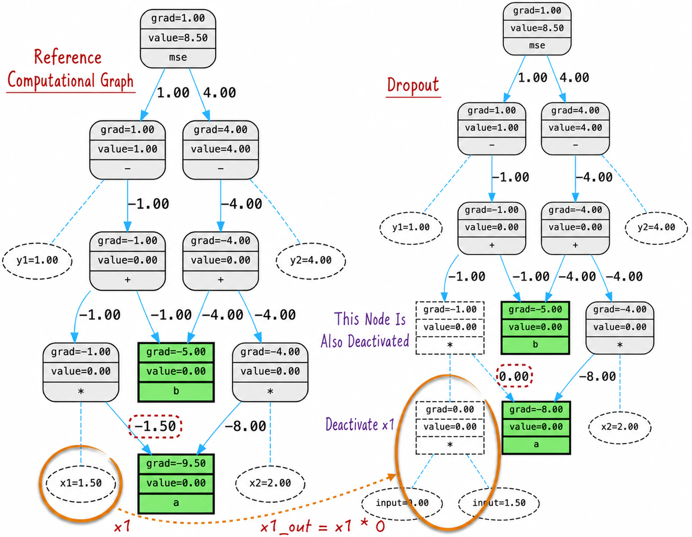

## 7.4 Dynamic Optimization

The preceding section revealed an important phenomenon: during model training, the computational graph for the data is generated dynamically. This generated graph is called the **baseline computational graph**. The forward pass and backpropagation run on it, after which the graph is destroyed. This is the standard process of constructing and clearing a computational graph.

Before propagation, the baseline graph can be optimized further for particular requirements. A substantial body of research proposes many such methods. Given the limits of space, this section examines three widely used techniques: gradient accumulation, parameter freezing, and dropout.

All methods discussed here are based on computational graphs and therefore apply to any model trained with stochastic gradient descent. In production, however, they are usually applied to neural networks, particularly in deep learning. The problems they address typically arise when models are large, evolving, and structurally complex—conditions most often met by neural networks.

Readers familiar with neural networks may imagine the computational graphs below as neural network architectures. Those less familiar need not worry: begin by understanding the graphs, then return after studying neural networks in later chapters for a deeper appreciation of the methods.

### 7.4.1 Gradient Accumulation

[Chapter 6](/books/deconstructing_LLM/chapter-6) noted that the batch used for each iteration of stochastic gradient descent should not be too small, because an excessively noisy gradient estimate may destabilize training. Computational-graph expansion, however, shows that a suitable batch may exceed the hardware's capacity and prevent backpropagation from running. Gradient accumulation addresses this conflict.

Gradient accumulation optimizes backpropagation so that a larger batch can update model parameters without increasing memory usage. As Figure 7-14 shows, it divides one complete backpropagation process into several independent subprocesses.



Specifically, divide the batch for one iteration into several mini-batches. Calculate the gradient for each mini-batch and add it to a shared accumulator instead of immediately updating the model parameters. After all mini-batches have been processed, update the parameters using the accumulated gradient.

This approach offers two benefits. On a single machine, the division trades additional time for lower memory usage, making otherwise impossible calculations feasible. With multiple machines, as is common in practice, the subprocesses can be assigned to different machines and run in parallel. This enables distributed backpropagation and greatly reduces execution time.

The idea is particularly intuitive from the perspective of a computational graph. An expanded graph can be decomposed into independent subgraphs for individual observations. These subgraphs remain independent during gradient propagation, which is also clear mathematically because the losses of different observations are independent. An expanded graph can therefore be divided into smaller graphs for propagation, as shown in Figure 7-15.



Listing 7-7 demonstrates how to divide the graph. Because a loss function is usually an average over samples, as is true for most models, the loss coefficients must be adjusted when the graph is divided, as shown on lines 14 and 17.

#### Listing 7-7 Gradient Accumulation ([Complete Code](https://github.com/GenTang/regression2chatgpt/blob/en/ch07_autograd/gradient_accumulation.ipynb))

```python
x1 = Scalar(1.5, label='x1', requires_grad=False)
y1 = Scalar(1.0, label='y1', requires_grad=False)
x2 = Scalar(2.0, label='x2', requires_grad=False)
y2 = Scalar(4.0, label='y2', requires_grad=False)
# Backpropagation
model = Linear()
loss = mse([model.error(x1, y1), model.error(x2, y2)])
loss.backward() # model.a.grad = -9.5, model.b.grad = -5

# Gradient accumulation
model = Linear()
# Propagate once with x1 and y1
# The coefficient 0.5 adjusts the weight in the average
loss = 0.5 * mse([model.error(x1, y1)])
loss.backward()
# Propagate once with x2 and y2
loss = 0.5 * mse([model.error(x2, y2)])
loss.backward() # model.a.grad = -9.5, model.b.grad = -5
```

Adding gradient accumulation to vanilla stochastic gradient descent requires only minor changes; Figure 7-16 shows the difference. With gradient accumulation, every step performs backpropagation, but not every step updates parameters and clears gradients. Those actions occur only after a specified number of backpropagation steps have accumulated—much as a person chews several times before swallowing once.

This is why the beginning of the chapter emphasized the strict distinction between backpropagation and the backward pass. As defined in this book, backpropagation means only calculating gradients; the backward pass includes both calculating gradients and using them to update model parameters. Their relationship may become complex in some settings, and confusing them creates many misunderstandings.



### 7.4.2 Parameter Freezing

Normally, training calculates gradients for every model parameter and updates all parameters accordingly. The baseline computational graph is well suited to this process because backpropagation passes gradients to every node and therefore calculates every node's gradient.

In some situations, however, only a subset of the model should be updated while the remainder stays fixed. This approach is increasingly common in neural networks, particularly large language models. Training an LLM from scratch is extremely expensive, often requiring hundreds of specialized servers and an investment of millions of dollars.

In practice, we often make small structural changes to a pretrained LLM and fine-tune it with domain-specific data so that it better serves a particular application. Only some parameters should change; the rest should remain fixed. Imagine the model as a building whose overall structure is satisfactory and too expensive to alter. We merely want to renovate one room.

Partial updating is straightforward: at each iteration, force the gradients of parameters that should not change to 0. The traditional baseline graph then becomes inefficient because many of its nodes require no gradient propagation.

We therefore need a way to remove nodes whose gradients need not be calculated and prevent unnecessary propagation. Minimizing computation requires removing not only unneeded variable nodes but also their associated operation nodes—specifically, operation nodes whose rooted subgraphs contain no descendant that requires a gradient, as shown in Figure 7-17.

This process is called parameter freezing. Its implementation is simple: set the `requires_grad` attribute of the relevant parameters to `False`, exactly as in PyTorch. Parameter freezing affects only backpropagation during model training; it has no effect on the forward pass. Conceptually, the computational graph has different structures for the forward pass and backpropagation.

Parameter freezing provides flexible control over which parameters are updated and which remain fixed. It is especially useful when resources are limited or a model must be fine-tuned for a particular domain. Freezing part of a model makes better use of existing models and data and enables more efficient training and optimization. See the [companion code](https://github.com/GenTang/regression2chatgpt/blob/en/ch07_autograd/parameter_freezing.ipynb) for a complete implementation.



### 7.4.3 Dropout

Before discussing dropout, we must understand what it means to **deactivate a variable**. Put simply, multiply a variable by 0 to produce a new variable, then use that new variable in subsequent calculations. We now examine how this operation affects the computational graph.

After defining `k`, Listing 7-8 defines `k_out = k * 0` and uses this new variable in place of `k` in the subsequent calculation, as shown on lines 6–8.

#### Listing 7-8 Node/Variable Deactivation ([Complete Code](https://github.com/GenTang/regression2chatgpt/blob/en/ch07_autograd/dropout.ipynb))

```python
x1 = Scalar(1.5, label='x1', requires_grad=False)
y1 = Scalar(1.0, label='y1', requires_grad=False)
x2 = Scalar(2.0, label='x2', requires_grad=False)
y2 = Scalar(4.0, label='y2', requires_grad=False)
model = Linear()
k = model.forward(x1)
# Deactivate k
k_out = k * 0
l = y1 - k_out
loss = mse([l, model.error(x2, y2)])
......
```

Figure 7-18 shows the resulting change, from the graph on the left to the one on the right. The gradients propagated backward through these nodes all become 0, and the nodes for `k` and `k_out` appear to have been removed entirely. Removing node `k` from the original graph produces exactly the same result. We can therefore say figuratively that node, or variable, `k` has been deactivated.



Deactivating a node can affect not only the node itself but also directly connected nodes, as Figure 7-19 shows. If node $x_1$ is deactivated, for example, the operation node directly connected to it is also deactivated. This depends on the operation: the node in the figure represents multiplication and is therefore affected, whereas addition or subtraction would not be.

We can now examine the motivation and details of dropout. An optimization algorithm is intended to calculate an accurate gradient and use it to update model parameters iteratively. Stochastic gradient descent, however, shows that introducing randomness into the gradient can improve training. This raises an interesting question: can still more randomness in gradient calculation improve the model further?

From the perspective of the computational graph, the randomness in stochastic gradient descent comes from the graph not expanding fully because only a subset of the training data is used. Its structure nevertheless remains similar to the theoretical graph originally defined; in that sense, backpropagation still produces an “accurate” gradient.

Introducing more randomness requires pruning the computational graph randomly. Each backpropagation step then produces not an “accurate” gradient but a randomly perturbed value near it. If the pruned portion is also chosen randomly for every pass, the gradient becomes still more random.



Dropout implements this idea. At the start of every training iteration, randomly select and deactivate some nodes in the graph. More precisely, while constructing the graph, randomly select variables, multiply them by 0 to create new variables, and use those variables in subsequent calculations.

Next, perform backpropagation to obtain gradients and use them to update the model parameters. Dropout operates only during model training. When the trained model makes predictions, all nodes remain active and dropout no longer applies.

In practice, dropout is applied not directly to an arbitrary computational graph but to a neural network, selectively deactivating certain network nodes. Later chapters explain that a neural network is ultimately represented as a computational graph. Neural network dropout therefore deactivates nodes in specific layers of that graph; the two operations are fundamentally the same.

Like stochastic gradient descent, dropout helps avoid local optima. It also effectively reduces overfitting in neural networks and improves model robustness and generalization, helping the model generalize to new, unseen data. [Section 9.1.4](/books/deconstructing_LLM/chapter-9/9-1#section-9-1-4) discusses the details.
