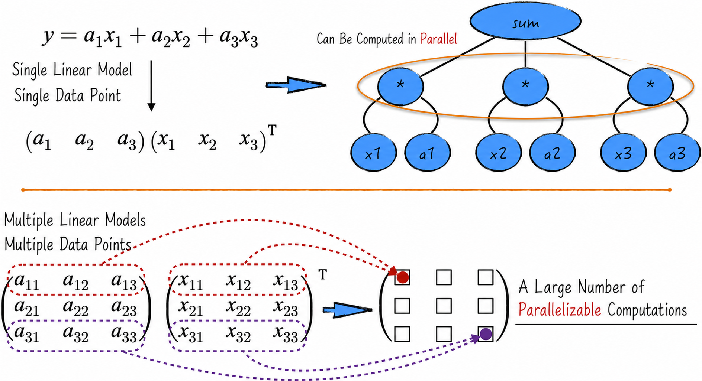
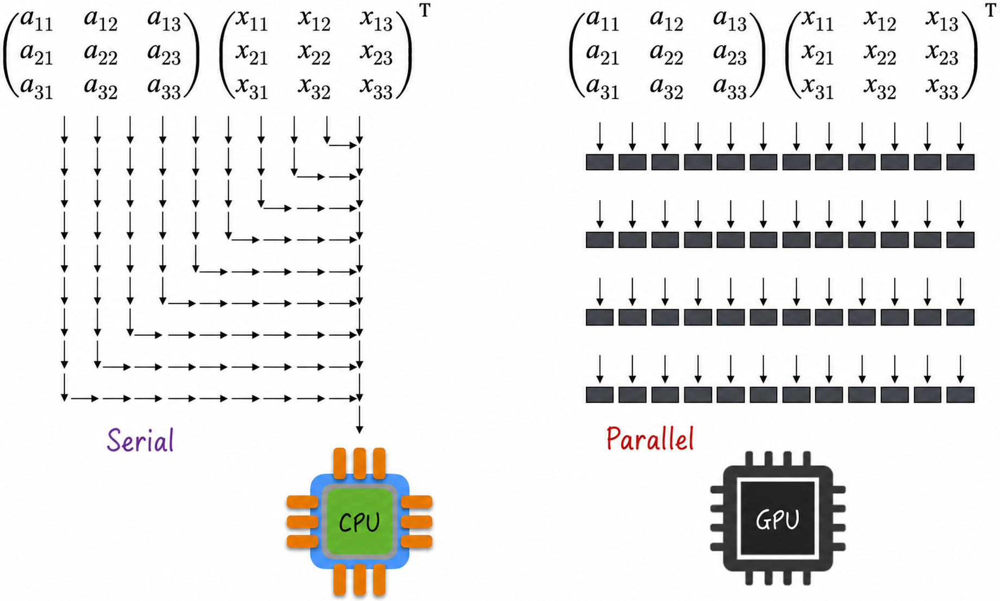
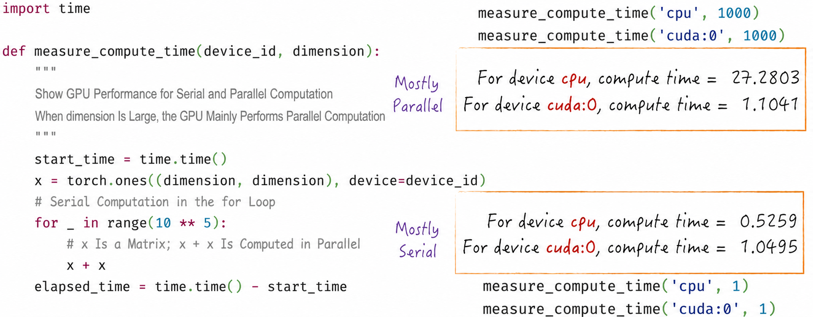
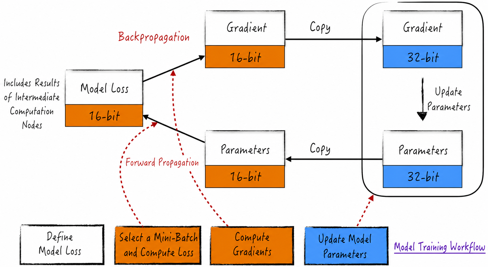
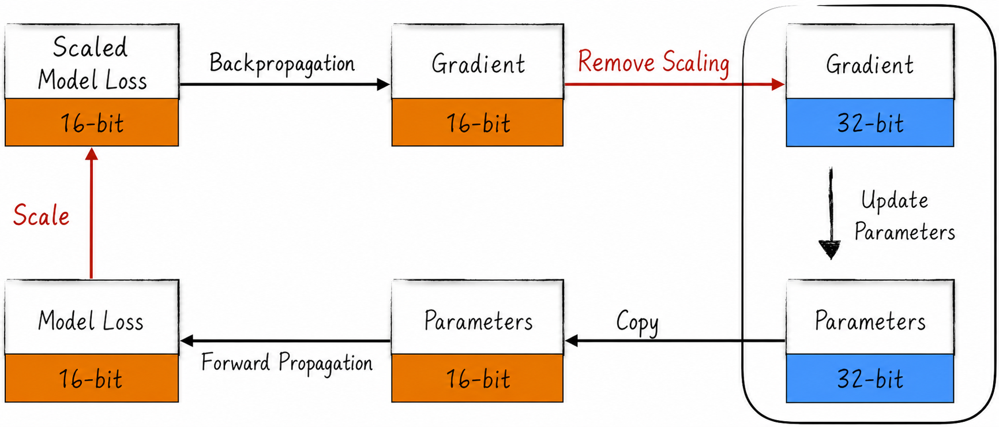
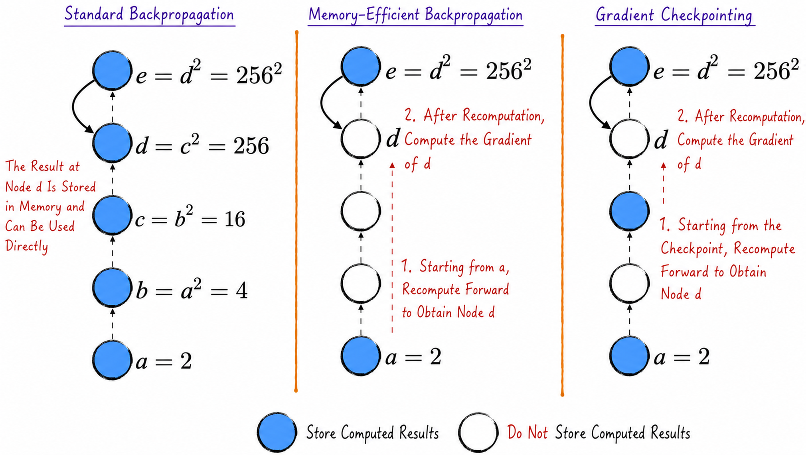
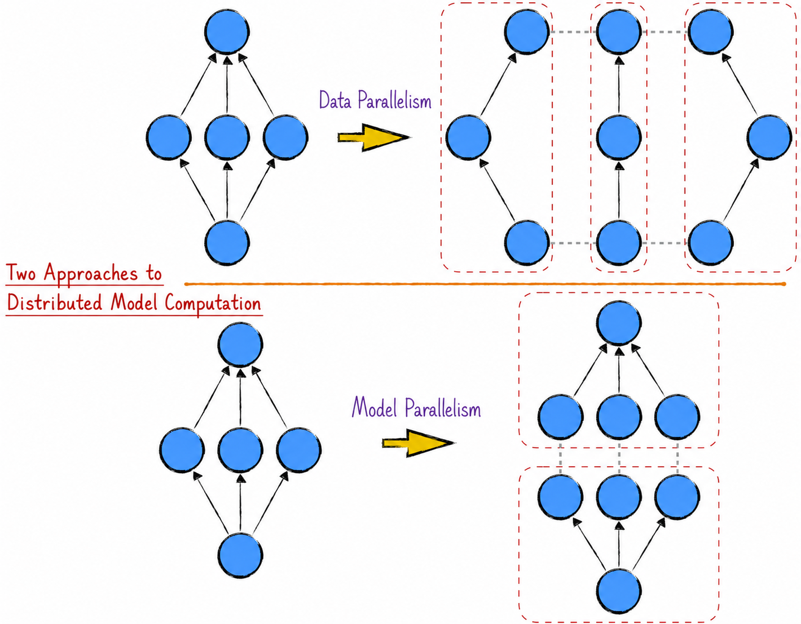
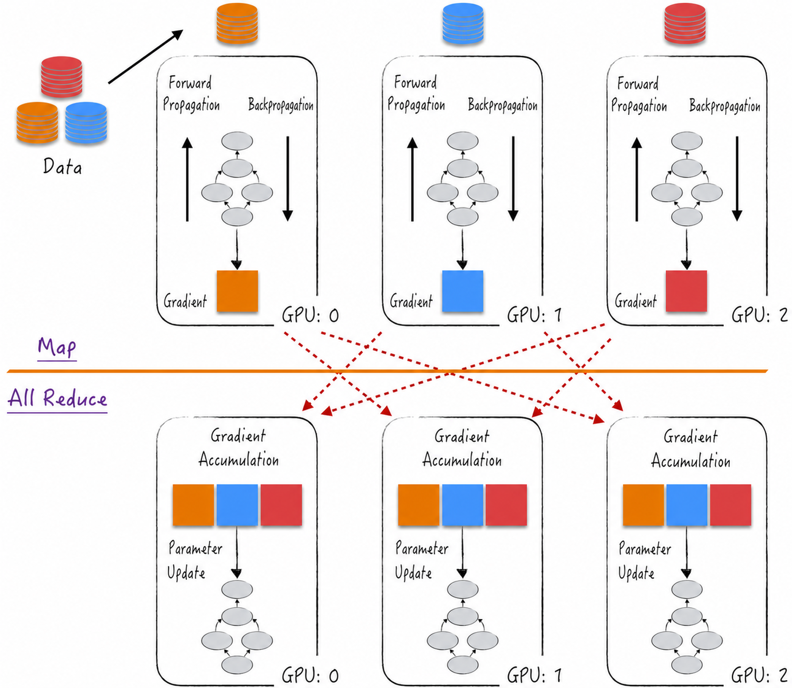
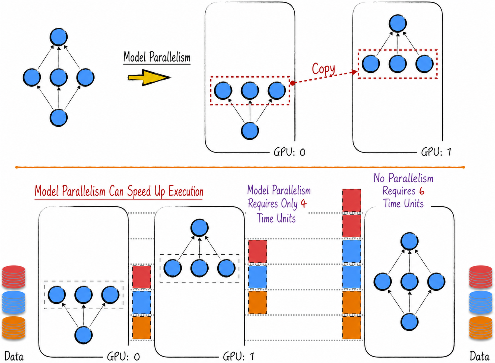

## 7.5 The Real World: Optimization Techniques for Large-Scale Models

To deepen our understanding of backpropagation, the complete parameter-estimation process, and related optimization methods, the preceding sections implemented a simplified computational graph and used it to perform forward passes and backpropagation. This closely connected abstract theory with practical code.

Real applications normally rely on existing third-party algorithm libraries. Their principles resemble the computational graph developed here, but their implementations are more efficient and comprehensive and provide optimizations for large-scale models. We now move beyond the preceding discussion to examine techniques commonly used for model-parameter estimation in production.

### 7.5.1 GPU Computing

Artificial intelligence models commonly involve many operations that can run in parallel. Consider the simple linear regression model in Figure 7-20. For a single data point, the corresponding operation nodes have no dependencies on one another, so every multiplication can run in parallel. Mathematically, the calculation can be expressed as tensor matrix multiplication that produces a single numerical output.



Any matrix multiplication with a single output can be accelerated through parallel computation. With multiple models and multiple data points, the matrix multiplication instead produces a tensor whose elements are mutually independent, making parallel execution even more practical. Other tensor operations, including addition and subtraction, can likewise be parallelized.

This is particularly important for neural networks, which contain multiple linear models and perform enormous numbers of tensor operations. Accelerating these operations effectively is the foremost engineering concern in the field.

By default, computer computation refers to tasks executed by the central processing unit (CPU). The CPU's design, however, is not well suited to parallel computation. For the matrix multiplication in Figure 7-21, for example, a CPU multiplies the elements sequentially, making the operation slow. Multicore CPUs can accelerate the task in parallel, but they are expensive and difficult to deploy widely in practice.



Unlike a CPU, a graphics processing unit (GPU) was originally designed for graphics and is an auxiliary computing component. It generally contains a large number of computing cores—sometimes thousands—that can execute many simple tasks in parallel. GPU tensor operations can therefore reduce computation time dramatically. For neural networks, this makes larger and more complex models possible: GPU training can reduce a task that would take years to only days.

The widespread adoption of GPUs is one reason neural networks, and deep learning in particular, have developed so rapidly. Practical neural network applications consequently prioritize GPUs as their computing core, a major programming paradigm shift. As neural networks advance, the industry is even considering redesigning computer architectures to give GPUs a more prominent hardware role.

Thanks to PyTorch's excellent support for GPU computing through CUDA[^cuda], the code is straightforward. As Listing 7-9 shows, data need only be moved to the appropriate GPU. Unlike a CPU, a GPU cannot directly read data from system memory (RAM), so the data must be copied into dedicated GPU memory.

A GPU likewise cannot perform an operation across computing cores. This includes operations spanning a CPU and GPU, where the data resides partly in system memory and partly in GPU memory, as well as operations spanning different GPUs, where the data is distributed across their dedicated memories. Before such a calculation, the relevant data must be moved to the same computing core.

#### Listing 7-9 GPU Computing ([Complete Code](https://github.com/GenTang/regression2chatgpt/blob/en/ch07_autograd/gpu.ipynb))

```python
# Check whether a GPU is available
torch.cuda.is_available()       # True
# Number of GPUs
torch.cuda.device_count()       # 1
# By default, newly created tensors reside in system memory and use the CPU
x = torch.randn(2, 3)
print(x.is_cuda)                # False
# Use a tensor method to move the data to a GPU
# With n GPUs, the corresponding device IDs are cuda:0, cuda:1, ..., cuda:n-1
print(x.to('cuda:0').is_cuda)   # True
# Move a tensor to the GPU at creation time by specifying device
y = torch.randn(2, 3, device='cuda:0')
print(y.is_cuda)                # True
print(y.to('cpu').is_cuda)      # False
# Operations across computing cores are not supported
x + y                           # error
```

Unlike the other examples, Listing 7-9 requires a machine equipped with a GPU and will not run correctly without one.

Using a GPU correctly means exploiting its parallel-computing capabilities rather than merely running serial calculations. Figure 7-22 illustrates this point. A CPU often has the advantage when a task is primarily serial; a GPU's strengths become fully apparent only when the task can be parallelized effectively.



### 7.5.2 Mixed-Precision Training

As discussed above, backpropagation requires the expanded computational graph to remain in memory—or in dedicated GPU memory when a GPU is used. The graph can require enormous storage, with numerical values occupying the largest share. These values include the output calculated at every node during the forward pass and the corresponding gradients produced during backpropagation.

Gradient accumulation can reduce memory use by dividing the graph and limiting its expansion. With an enormous model, however, even the graph for a single data point may require vast memory. A large language model, for example, may contain billions or tens of billions of parameters.

Additional optimization is needed to reduce memory use. First, we examine how a computer stores numbers. Numerical results are generally stored as 32-bit floating-point values, requiring 4 bytes each and representing the value with 32 binary bits. This format is called single-precision floating point. What happens if a value is instead represented with 16 bits?

One immediate benefit is lower storage use and faster computation. The obvious drawback is a smaller representable range. Consider the smallest positive value: a 16-bit floating-point number can represent values down to $2^{-24}$, whereas a 32-bit number reaches $2^{-149}$. If the true value is smaller than the relevant threshold, the computer incorrectly treats it as 0. This is floating-point underflow.

Mixed-precision training reduces the incidence of such errors. As its name suggests, it uses different numerical precisions for different parts of model training. The algorithm has two main components.

1. **Layered precision**: The model itself—its parameters—continues to be stored in 32-bit floating point, and parameter updates also use 32-bit values. The forward pass and backpropagation instead use 16-bit floating-point calculations, as shown in Figure 7-23.

   

2. **Introducing a scale factor**: Preventing floating-point underflow is mathematically straightforward. Multiply the model loss by a large constant $n$, called the scale factor. By the chain rule, this enlarges every node's gradient by a factor of $n$, keeping the gradients within the range representable by 16-bit floating point. Before using the gradients to update parameters, remove the scaling by dividing them by $n$. Figure 7-24 combines this process with layered precision.

   

Mixed-precision training substantially reduces memory overhead while preserving appropriate model representational capacity. Combining high-precision 32-bit storage with 16-bit calculations reduces memory requirements without sacrificing model performance, enabling computers to process larger models and datasets.

PyTorch provides the corresponding high-level tools: `torch.cuda.amp.autocast` implements layered precision, while `torch.cuda.amp.GradScaler` introduces the scale factor. Together they make mixed-precision training easy to use in optimization algorithms. Specific code details lie beyond this chapter; see [Section 11.5.1](/books/deconstructing_LLM/chapter-11/11-5#section-11-5-1).

### 7.5.3 Gradient Checkpointing

By definition, a variable's gradient is closely related to the variable's value. Calculating the gradient therefore requires knowing that value first. This is why the computational graph must undergo a forward pass before backpropagation and why every node's result is recorded, as shown on the left side of Figure 7-25. When a node's gradient is later calculated, the cached result is immediately available for backpropagation, as with node $d$ in the figure.

This method is also called standard backpropagation and is the approach used by the examples in this chapter. It makes gradient calculation as efficient as possible, but incurs substantial memory overhead.

A time-for-space tradeoff can minimize memory use. After the forward pass, retain only the result at the root and clear the results of intermediate nodes; values at leaf nodes remain. When backpropagation reaches an intermediate node without a cached value, trigger another forward pass to recompute the required results. This is memory-minimal backpropagation.

To calculate the gradient of node $d$, for example, begin at node $a$ and rerun the forward pass through $d$, caching the results. Then use the cached value and the gradient of node $e$ to calculate the gradient of $d$. Apply similar steps to the other nodes. In Figure 7-25, the memory-minimal algorithm requires only three storage locations, whereas the standard algorithm requires five.



Although memory-minimal backpropagation reduces memory overhead substantially, it performs many repeated calculations and runs relatively slowly. Gradient checkpointing balances memory use against execution time. It selects certain intermediate nodes as storage points so that a repeated forward pass can begin at a checkpoint rather than recomputing from the start. This reduces repeated calculation and improves efficiency, at the cost of modest additional memory for the stored intermediate results.

PyTorch provides a convenient high-level function for gradient checkpointing: `torch.utils.checkpoint`. It helps balance memory overhead and execution time. Specific usage details are omitted because of space limitations.

### 7.5.4 Distributed Computing

We now consider how multiple machines can be used to improve model-training and application speed. Neural networks commonly use GPUs for efficient computation. As [Section 7.5.1](/books/deconstructing_LLM/chapter-7/7-5#section-7-5-1) explained, however, even GPUs in the same machine cannot operate directly on data distributed across them.

Coordination among multiple machines in distributed computing is therefore equivalent to coordination among different GPUs, whether or not those GPUs are in the same machine. For simplicity, the remainder of this section discusses only distributed computation across multiple GPUs.

Model computation is based on a computational graph, so distributed model computation is fundamentally distributed computation at the graph level. The industry has developed two very different approaches: data parallelism and model parallelism.

Data parallelism is the gradient accumulation introduced in [Section 7.4.1](/books/deconstructing_LLM/chapter-7/7-4#section-7-4-1): it partitions the computational graph vertically according to the data and computes the pieces in parallel. Model parallelism instead places different layers of the graph on different GPUs. Figuratively, data parallelism cuts the graph vertically, while model parallelism cuts it horizontally, as shown in Figure 7-26.



Traditionally, distributed model computation has meant processing data in parallel. Its central idea follows the well-known Map/Reduce framework[^map-reduce], as shown in Figure 7-27. First, distribute the data intelligently across the GPUs. Next, copy the complete model onto every GPU. Each GPU then performs a forward pass and backpropagation on its own data, corresponding to the Map operation.

The Reduce operation follows—more precisely, an All-Reduce operation[^all-reduce]. Each GPU's gradients are transmitted to all the others. Every GPU consequently accumulates the gradient information calculated by all GPUs, sums the gradients independently, and performs the subsequent parameter update.

Because every GPU accumulates the same gradient, they also obtain the same model after updating their parameters. The cycle continues until the final model is produced, ensuring parallel training and parameter synchronization.

From the perspective of one GPU, each iteration processes only part of the batch. During Reduce, however, gradient transmission makes the parameter update reflect all data in the batch. The stage gathers the wisdom of the entire batch. It resembles a class whose students divide the questions on an exam among themselves and then exchange answers: each student solves only some questions but obtains every answer.

Even without upgrading the hardware, each GPU therefore learns faster and the entire model trains more quickly. This ingenious form of distributed computation combines individual effort to accelerate model training.



As models have continued to grow, the computation for a single data point has sometimes exceeded the capacity of one GPU, making the calculation impossible. The industry has responded with a new approach: model parallelism.

As Figure 7-28 shows, distribute different layers of the computational graph across different GPUs. For a neural network, assign different network layers to different GPUs. Each GPU then handles only one portion of the model; connecting them in the correct order forms the complete model. During computation, one GPU's output becomes the input to the graph on the next, and multiple GPUs cooperate to evaluate the graph. This makes models too large for one GPU computationally feasible.

Model parallelism also increases computation speed. The process resembles a pipeline in which each GPU is one stage. In Figure 7-28, while GPU:1 processes the first observation, GPU:0 has already begun processing the second. Fully exploiting pipeline parallelism substantially accelerates the overall model.

Data and model parallelism are not mutually exclusive and can be combined. Within a data-parallel framework, for example, a machine with multiple GPUs can distribute the model across those GPUs using model parallelism and improve speed still further.

Distributed computing is complex. Beyond algorithm-level code, it requires cluster construction and maintenance, including communication between machines and error recovery. PyTorch provides excellent support for both aspects. For code, it offers three high-level tools[^distributed-tools]—`torch.distributed`, `torch.multiprocessing`, and `torch.nn.parallel.DistributedDataParallel`—that help construct distributed models quickly. For cluster setup[^cluster-tools], `torchrun` simplifies environment configuration. Specific usage details are omitted because of space limitations.



[^cuda]: CUDA, the Compute Unified Device Architecture, is a parallel-computing platform and programming model developed by NVIDIA. It lets developers use NVIDIA GPUs for general-purpose parallel computation in fields such as scientific computing, machine learning, and deep learning. CUDA transformed the GPU from a graphics-rendering accelerator into a powerful general-purpose processor. Developers can assign tasks to a GPU and use its many cores for parallel processing, greatly increasing computation speed.
    Using CUDA requires GPU kernel code written for CUDA and compiled with the appropriate tools alongside the CPU code. Many deep learning frameworks, including TensorFlow and PyTorch, support CUDA and make GPU-based model training and inference easier.
[^map-reduce]: Map/Reduce is a classical distributed-computing pattern with two key stages: Map and Reduce. Originally proposed by Google, it achieved great success in large-scale data processing. The framework decomposes a complex task into simple subtasks that run in parallel across multiple machines during Map, then combines their results during Reduce to obtain the final result.
[^all-reduce]: In the classical Map/Reduce framework, Reduce runs on one selected machine rather than on every machine. The operation here is therefore called All-Reduce.
[^distributed-tools]: These three tools all support data parallelism. Model parallelism requires custom code. Fortunately, the implementation is not complicated; its core process is the data copying discussed in [Section 7.5.1](/books/deconstructing_LLM/chapter-7/7-5#section-7-5-1).
[^cluster-tools]: Specialized machine learning clusters, usually GPU clusters, can be built and managed with more specialized tools such as NVIDIA Bright Cluster Manager and Slurm. These tools optimize cluster performance and help maximize the use of computing resources.
