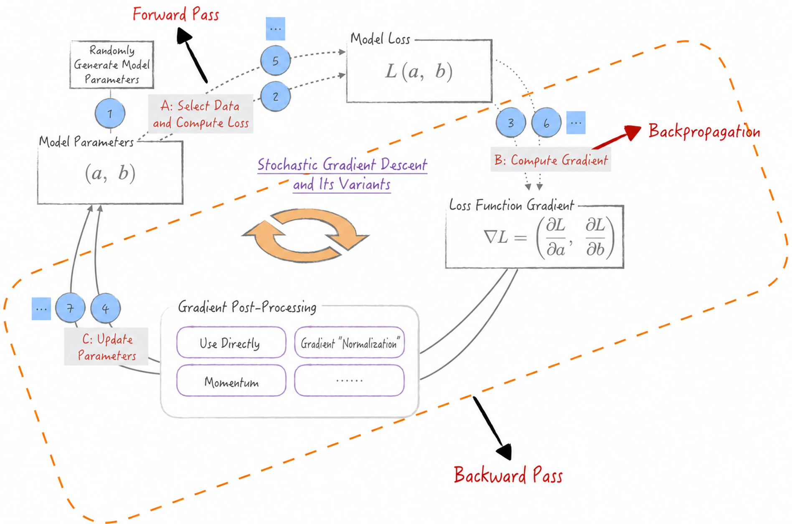

# Chapter 7: Backpropagation—The Engineering Foundation of Neural Networks

> In theory, theory and practice are the same. In practice, they are not.
>
> — Albert Einstein

Backpropagation (BP) is an indispensable technique in neural networks. It works closely with the optimization algorithms discussed in [Chapter 6](/books/deconstructing_LLM/chapter-6). Yet this close relationship often causes three terms—backpropagation, forward pass, and backward pass—to be used inconsistently, which can impede understanding. Moreover, different sources assign different scopes to these terms, creating further confusion for readers.

This chapter therefore begins by defining the terms clearly. Figure 6-8 in [Chapter 6](/books/deconstructing_LLM/chapter-6) presents the complete optimization process. Building on that figure, Figure 7-1 introduces new labels to clarify the meanings of forward pass, backpropagation, and backward pass. The figure makes both their meanings and their relationships readily apparent.

- Strictly speaking, **backpropagation** refers only to the algorithm for calculating gradients, not to how those gradients are used. In practice, however, the term is often used more broadly for the entire learning algorithm, including the use of gradients by optimization algorithms such as stochastic gradient descent.
- **Forward pass** means computing a model's predictions from its current parameter estimates and input data. The model is usually a neural network.
- **Backward pass**, as defined in this book, comprises two key steps: calculating the gradient of the loss function, then using an optimization algorithm to update the model parameters.

This book adheres strictly to these definitions as it examines the backpropagation algorithm and, in later chapters, neural network architectures and training processes.
