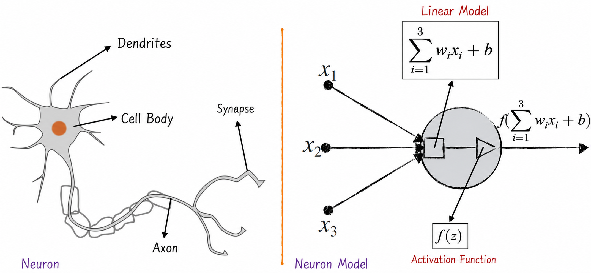
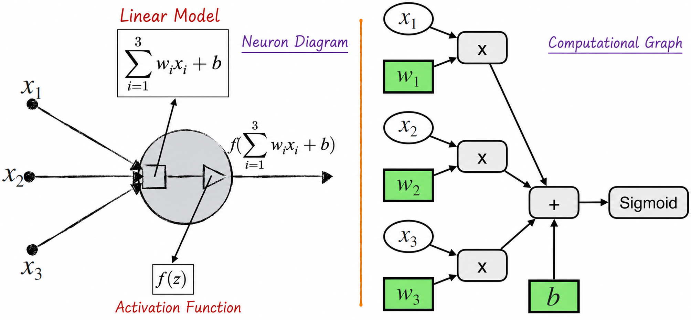
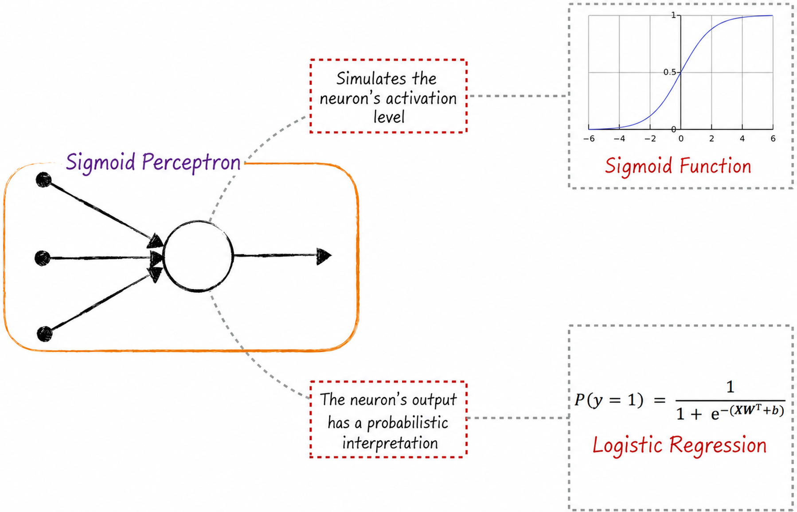
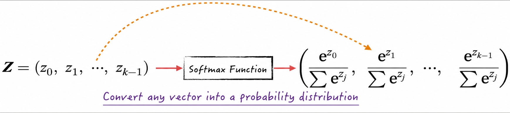
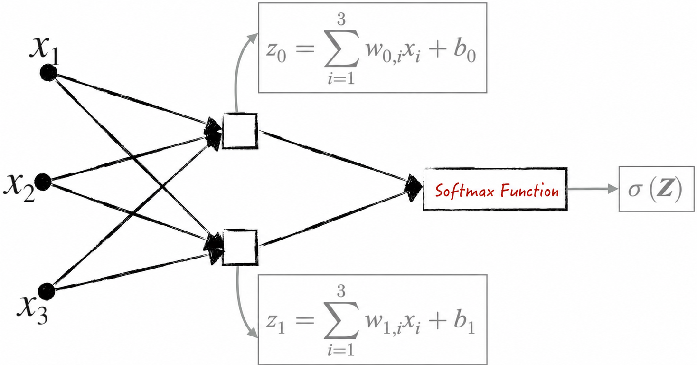

## 8.1 The Perceptron Model

Because neural networks are intended to simulate the human nervous system, we begin by examining its basic biological characteristics.

Biology identifies the neuron as the nervous system's fundamental computational unit. A neuron responds to changes in its environment and transmits information to other neurons. The human brain contains approximately 86 billion interconnected neurons, which together form an extraordinarily complex neural network. This network provides the biological foundation of human intelligence. To simulate the biological structure of the brain, therefore, our first task is to build a model that imitates the behavior of a neuron.

### 8.1.1 A Digital Twin of the Neuron

The left side of Figure 8-1 shows the structure of a typical neuron. It consists of four basic parts, each with a specific function.

- **Dendrites**: A neuron has multiple dendrites. They receive signals from other neurons and transmit them to the cell body.
- **Cell body**: The cell body is the neuron's core. It aggregates signals from the dendrites into a combined stimulus.
- **Axon**: When the accumulated stimulus in the cell body exceeds a threshold, the neuron's axon emits a signal.
- **Synapses**: The signal emitted by the neuron, if any, travels through synapses to other neurons or to other tissues in the body that respond to neural signals. A neuron usually has multiple synapses, but they all transmit the same signal.

These components work together to give a neuron its information-processing capability, and they also provide the foundation for neural-network models. Abstracting this neuronal structure into mathematical concepts produces the neuron model shown on the right side of Figure 8-1.

- The model's inputs are variables, or features, in the data, such as $x_1,x_2,x_3$ in the figure. They are represented by dots and correspond to the neuron's dendrites.
- A linear model computes a weighted sum of the input variables. This component, represented by a square, corresponds to the cell body. In the neuron's linear model, the weights and bias are shown separately: $w$ denotes the weights and $b$ the bias (intercept)[^1].
- A nonlinear activation function $f$, represented by a triangle, then determines whether to emit a signal. It corresponds to the neuron's axon. In neural-network diagrams, a circle conventionally represents the linear model and activation function together as one unit. This book uses the same notation in its discussions of neural networks.
- Connecting these components produces the final output $f(\sum_i w_i x_i+b)$. This value is passed to the next neuron model, represented by an arrow corresponding to a synapse. Like a biological neuron, a model neuron may have multiple outgoing connections, but every connection carries the same value.

The nonlinearity of the activation function $f$ is crucial to the neuron model. The earliest neuron model[^2] defined $f$ intuitively: it outputs 1 when its input exceeds a threshold and 0 otherwise. More precisely,

$$
f(x)=
\begin{cases}
1,&x>0\\
0,&x\le 0
\end{cases}
\tag{8-1}
$$

This model is also called a **perceptron** and is used primarily for binary classification. Although the perceptron imitates the behavior of a neuron's axon to some extent, its mechanism is relatively simple. Biological neurons produce continuous rather than discrete outputs, which limits the perceptron's performance. To improve it, researchers introduced the Sigmoid function (also called the S-function) from [Chapter 4](/books/deconstructing_LLM/chapter-4) as the neuron's activation function. This function is continuous and nonlinear:

$$
S(z)=\frac{1}{1+e^{-z}}
\tag{8-2}
$$

With a Sigmoid activation function, the model's output becomes smooth and continuous. It varies gradually between 0 and 1, providing a richer representation of information and more closely resembling the behavior of a biological neuron. The improved model is called a **Sigmoid perceptron**. Besides giving the model greater expressive power, this change makes it differentiable. Backpropagation can therefore calculate gradients of the model parameters, enabling the optimization algorithms discussed earlier to improve the model iteratively. This was an important milestone in the development of neural networks[^3].

### 8.1.2 Diagrams and Computational Graphs

Model diagrams are both common and essential in neural networks. They present a model's structure clearly and simply, helping us understand and construct it. The computational graph introduced in [Chapter 7](/books/deconstructing_LLM/chapter-7), meanwhile, is a framework that computers use to store the relationships among model operations. A neural network can plainly be represented as a computational graph—and this is how it is represented inside a computer. Using the basic perceptron as an example, this section examines the connections and differences between neural-network diagrams and computational graphs.

As Figure 8-2 shows[^4], a neural-network structure can be viewed as a simplified computational graph. Removing unnecessary details makes its overall logic clearer and easier to understand. A neuron diagram omits the variable nodes that represent model parameters and hides the directly related parts of the linear model. These nodes are invisible in the diagram, but they remain essential to backpropagation. When considering backpropagation through a neural network, we can reconstruct the hidden nodes mentally to better understand the algorithm's core ideas. Most of the time, however, only the simplified overall picture matters. In more complex situations—such as the dead-neuron problem discussed in [Section 8.4.1](/books/deconstructing_LLM/chapter-8/8-4#section-8-4-1) and backpropagation through time in [Section 10.3.7](/books/deconstructing_LLM/chapter-10/10-3#section-10-3-7)—we will enlarge the computational graph again to examine its details.

The right side of Figure 8-2 is a theoretical computational graph. After data are supplied, the actual graph may become so complex that it is nearly impossible to inspect visually. This is why neural-network diagrams are normally used to represent a model's structure and process.

### 8.1.3 Sigmoid Perceptrons and Logistic Regression

Theoretically, the Sigmoid function models competition between two effects. Suppose that both a positive effect and a negative effect are approximately linear in the independent variables $\boldsymbol X=(x_1,x_2,\cdots,x_k)$. The relationships are shown below, where $Y^*$ denotes the positive effect; $\widetilde Y$ denotes the negative effect; $\boldsymbol W_1=(w_{1,1},w_{1,2},\cdots,w_{1,k})$, $\boldsymbol W_0=(w_{0,1},w_{0,2},\cdots,w_{0,k})$, and $b_1,b_0$ are model parameters; and $\theta$ and $\tau$ are normally distributed random disturbances:

$$
\begin{aligned}
Y^*&=\boldsymbol X\boldsymbol W_1^{\mathrm T}+b_1+\theta\\
\widetilde Y&=\boldsymbol X\boldsymbol W_0^{\mathrm T}+b_0+\tau
\end{aligned}
\tag{8-3}
$$

As discussed in [Chapter 4](/books/deconstructing_LLM/chapter-4), the probability that the positive effect exceeds the negative effect can be approximated by a Sigmoid function. Specifically, with $\boldsymbol W=\boldsymbol W_1-\boldsymbol W_0$ and $b=b_1-b_0$,

$$
P(Y^*-\widetilde Y>0)\approx S(\boldsymbol X\boldsymbol W^{\mathrm T}+b)
\tag{8-4}
$$

Using the Sigmoid function in a perceptron thus gives the model's output a probabilistic interpretation. This provides the model with a firmer theoretical foundation and makes it suitable for binary classification. For example, the model predicts class 1 when its output exceeds 0.5 and class 0 otherwise. In this setting, a Sigmoid perceptron is equivalent to a binary logistic regression model, as Figure 8-3 illustrates.

Early neural-network research focused on finding a solid theoretical foundation for the models being constructed and therefore borrowed as much as possible from established classical models. Over time, the field's research paradigm changed dramatically: the focus shifted from understanding models in depth to simulating and training them more efficiently, while model interpretability became less central. Practical requirements nevertheless remain—for example, the public or regulators may demand explanations of how a model works. Even when explaining an entire model is no longer the goal, researchers still seek clear meanings and reasonable interpretations for its outputs. Analogies to and lessons from traditional models, like those discussed in this section, become particularly important in such cases. This line of thinking will recur throughout the remainder of the book.

### 8.1.4 The Softmax Function

Before exploring neural networks in depth, we introduce one of the field's essential functions: Softmax. In neural-network classification, the Softmax function is often used to define the loss function.

Recall from [Chapter 4](/books/deconstructing_LLM/chapter-4) that binary logistic regression has the following form:

$$
P(y=1)=\frac{1}{1+e^{-\boldsymbol X\boldsymbol W^{\mathrm T}-b}}
\tag{8-5}
$$

Multiplying both the numerator and denominator in Equation (8-5) by the exponential term produces Equation (8-6), where $\boldsymbol W=\boldsymbol W_1-\boldsymbol W_0$ and $b=b_1-b_0$:

$$
\begin{aligned}
P(y=1)&=\frac{e^{\boldsymbol X\boldsymbol W_1^{\mathrm T}+b_1}}{e^{\boldsymbol X\boldsymbol W_1^{\mathrm T}+b_1}+e^{\boldsymbol X\boldsymbol W_0^{\mathrm T}+b_0}}\\
P(y=0)&=\frac{e^{\boldsymbol X\boldsymbol W_0^{\mathrm T}+b_0}}{e^{\boldsymbol X\boldsymbol W_1^{\mathrm T}+b_1}+e^{\boldsymbol X\boldsymbol W_0^{\mathrm T}+b_0}}
\end{aligned}
\tag{8-6}
$$

Multinomial logistic regression can be written in a similar form. Based on the discussion in [Chapter 4](/books/deconstructing_LLM/chapter-4), suppose a classification problem has $k$ classes labeled $0,1,\cdots,k-1$. The multinomial logistic regression model[^5] can then be written as

$$
\begin{cases}
P(y=1)=\dfrac{e^{\boldsymbol X\boldsymbol\beta_1^{\mathrm T}+c_1}}{1+\sum_{j=1}^{k-1}e^{\boldsymbol X\boldsymbol\beta_j^{\mathrm T}+c_j}}\\[4pt]
P(y=2)=\dfrac{e^{\boldsymbol X\boldsymbol\beta_2^{\mathrm T}+c_2}}{1+\sum_{j=1}^{k-1}e^{\boldsymbol X\boldsymbol\beta_j^{\mathrm T}+c_j}}\\
\quad\vdots\\
P(y=0)=\dfrac{1}{1+\sum_{j=1}^{k-1}e^{\boldsymbol X\boldsymbol\beta_j^{\mathrm T}+c_j}}
\end{cases}
\tag{8-7}
$$

Let $\boldsymbol W_j=\boldsymbol W_0+\boldsymbol\beta_j$ and $b_j=b_0+c_j$. Multiplying the numerator and denominator in Equation (8-7) by $e^{\boldsymbol X\boldsymbol W_0^{\mathrm T}+b_0}$ gives Equation (8-8):

$$
P(y=l)=\frac{e^{\boldsymbol X\boldsymbol W_l^{\mathrm T}+b_l}}{\sum_{j=0}^{k-1}e^{\boldsymbol X\boldsymbol W_j^{\mathrm T}+b_j}}
\tag{8-8}
$$

The function in Equations (8-6) and (8-8) is the Softmax function, commonly denoted by $\sigma(\boldsymbol Z)$. Its input is a $k$-dimensional row vector, and its output is another $k$-dimensional row vector. Every component of the output lies in $(0,1)$, and the components sum exactly to 1. The output therefore forms a probability distribution, as Figure 8-4 shows. This property makes Softmax crucial to classification: it converts a set of raw prediction scores into estimated probabilities for every class, thereby forming a classification model. Neural networks consequently apply Softmax frequently at the final layer and use it to define the model's loss function.

Having established the importance of Softmax in classification, we can now apply it more intuitively within a neural network. Binary logistic regression, for example, can be transformed into the diagram shown in Figure 8-5.

Each square in Figure 8-5 represents a linear model, just as it does in Figure 8-1. Treat the diagram as a one-layer neural network containing two perceptrons with linear outputs. A Softmax transformer at the top processes those outputs. The model in Figure 8-5 is equivalent to the Sigmoid-perceptron model in Figure 8-3, but the former follows neural-network conventions more closely. It also extends readily to multiclass classification: simply add more squares. This representation creates a more natural bridge from logistic regression to neural networks and makes it easier to identify logistic regression within an existing neural-network structure. In practical applications, this facilitates the use of logistic regression's interpretability and analytical tools.

Using the Softmax function, the loss of a logistic regression model at data point $i$ can be expressed more compactly as

$$
L_i=-\sum_{l=0}^{k-1}\mathbf 1\{y_i=l\}\ln\left(\frac{e^{\boldsymbol X_i\boldsymbol W_l^{\mathrm T}+b_l}}{\sum_{j=0}^{k-1}e^{\boldsymbol X_i\boldsymbol W_j^{\mathrm T}+b_j}}\right)
\tag{8-9}
$$

For a $k$-class classification problem, suppose that data point $i$ belongs to class $t$. Represent its class with a $k$-dimensional row vector $\boldsymbol\theta_i=(\theta_{i,0},\theta_{i,1},\ldots,\theta_{i,k-1})$[^6]. The $t$th component equals 1, so $\theta_{i,t}=1$, while every other component equals 0, so $\theta_{i,j}=0,j\ne t$.

Under these definitions, the loss at this data point can be written as a matrix product of the Softmax function and the row vector $\boldsymbol\theta_i$. As noted earlier, this is also called cross-entropy. Equation (8-10) gives the result, where $\boldsymbol Z_i=(\boldsymbol X_i\boldsymbol W_0^{\mathrm T}+b_0,\ldots,\boldsymbol X_i\boldsymbol W_{k-1}^{\mathrm T}+b_{k-1})$ is a row vector of $k$ elements. Each element is a linear model's prediction for one class—its “score”—and is commonly called a **logit** in neural networks[^7].

$$
L_i=-\boldsymbol\theta_i\ln\sigma(\boldsymbol Z_i)^{\mathrm T}
\tag{8-10}
$$

Similarly, because $L=\sum_iL_i$, the loss function for the entire model can also be written as a matrix product. This form is highly useful when engineering neural networks and will appear frequently in later chapters.

[^1]: In a neural network, the bias term in a linear model has a special biological meaning: it usually corresponds to the neuron's activation threshold and must therefore be handled separately.
[^2]: Frank Rosenblatt designed the first artificial neural network at the Cornell Aeronautical Laboratory in 1957. This earliest neural network was a physical machine: because computers were still primitive, a dedicated machine was built to implement the model.
[^3]: [Section 8.4](/books/deconstructing_LLM/chapter-8/8-4) explains that although the Sigmoid function played a pivotal role historically, it is now rarely used as the principal activation function in production for several reasons.
[^4]: For clarity, Figure 8-2 omits some details of the computational graph. See the companion notebook [`ch08_mlp/perceptron.ipynb`](https://github.com/GenTang/regression2chatgpt/blob/en/ch08_mlp/perceptron.ipynb) for the complete graph.
[^5]: Equation (8-7) differs slightly from Equation (4-33). It displays the bias term separately to remain consistent with other neural-network literature.
[^6]: This representation is called one-hot encoding; see [Section 10.1.1](/books/deconstructing_LLM/chapter-10/10-1#section-10-1-1).
[^7]: *Logits* is a common term in statistics, mathematics, and machine learning. It generally refers to unnormalized model outputs, or raw predictions. In classification, logits are the model's scores for the possible classes. Functions such as Softmax normalize them into a probability distribution used for the final classification.
