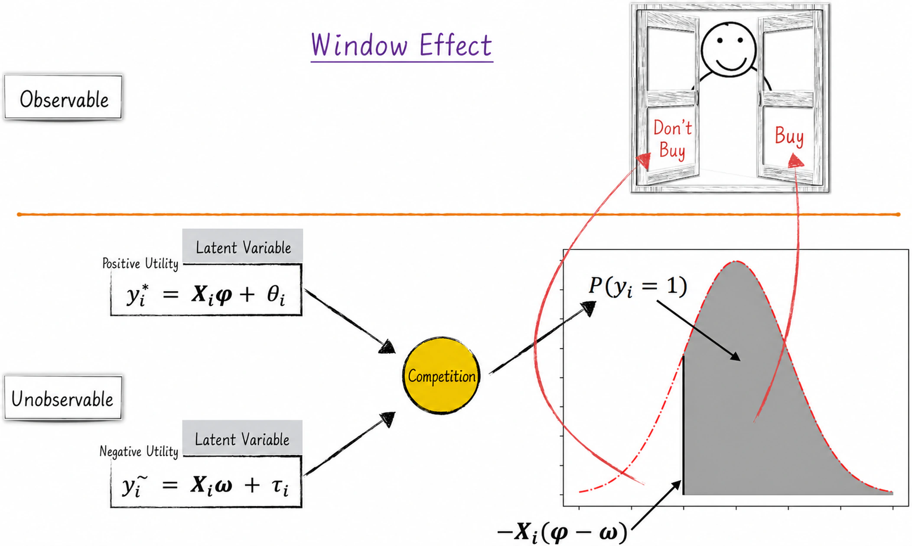
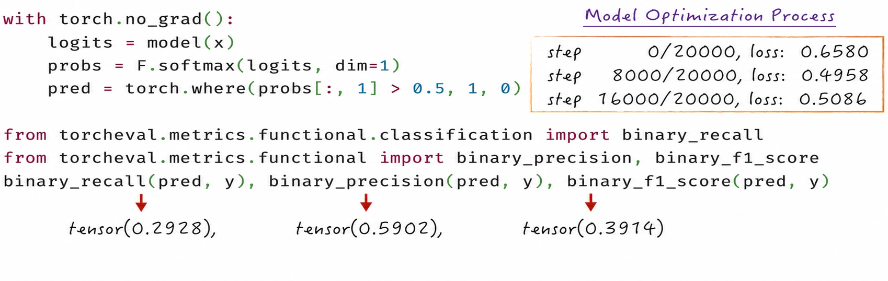
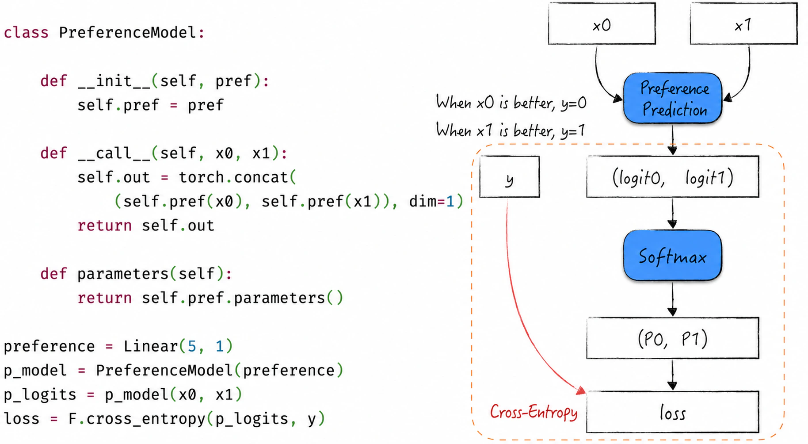

## 8.2 Revisiting Logistic Regression from a Neural-Network Perspective

[Sections 8.1.3](/books/deconstructing_LLM/chapter-8/8-1#section-8-1-3) and [8.1.4](/books/deconstructing_LLM/chapter-8/8-1#section-8-1-4) noted that the classical Sigmoid perceptron is equivalent to logistic regression and that logistic regression can be represented as a more general one-layer neural network. Let us temporarily set aside [Chapter 4](/books/deconstructing_LLM/chapter-4) and, from a neural-network perspective, build a logistic regression model for binary classification from scratch in code.

### 8.2.1 Revisiting the Window Effect

Consider the purchase of a product and revisit the window effect. What we observe is whether a customer bought a particular product, but this outcome is actually a decision made after internal deliberation. The customer first evaluates the positive utility of buying the product, which can be viewed as a score for the propensity to purchase. The customer then evaluates the possible negative utility, which can be viewed as a score for the propensity not to purchase. These two utilities compete with each other—utility determines the probability of the corresponding action—and ultimately influence the observed purchase decision, as Figure 8-6 shows.

This way of reasoning from utility to probability applies broadly to classification problems. We begin by studying the preference for each class, use those preferences to construct a probability distribution, and finally choose a specific class from that distribution.



We can now translate the window effect into a model.

1. Although the exact form of the utility functions is not yet known, we need not worry. Begin by assuming that linear models can predict both positive and negative utility.
2. For a classification problem, the model should output a two-dimensional probability distribution. The two models just constructed plainly fail to meet this requirement because their outputs are unrestricted real numbers. The solution is simple: following [Section 8.1.4](/books/deconstructing_LLM/chapter-8/8-1#section-8-1-4), attach a Softmax transformer to their outputs.

After these components are combined, the model takes the features $x$ as input and produces a two-dimensional probability distribution. Without any complex mathematical derivation, this relatively mechanical procedure has given us a model that can solve a binary classification problem. On closer inspection, however, it strongly resembles the logistic regression model discussed earlier. The only difference is that logistic regression has one linear component, whereas this model has two.

### 8.2.2 Code Implementation

This section uses exactly the same data as [Chapter 4](/books/deconstructing_LLM/chapter-4) to demonstrate the model-building process. See [Section 4.2](/books/deconstructing_LLM/chapter-4/4-2) for details of the data and its fields. To keep the focus on model construction, this example does not divide the data into training and test sets.

#### Listing 8-1 Reconstructing a Logistic Regression Model ([Complete Code](https://github.com/GenTang/regression2chatgpt/blob/en/ch08_mlp/logit_regression.ipynb))

```python
class Linear:

    def __init__(self, in_features, out_features, bias=True):
        """
        Initialize the model parameters.
        Note that parameter initialization is not optimized here.
        """
        self.weight = torch.randn((in_features, out_features))
        self.bias = torch.randn(out_features) if bias else None

    def __call__(self, x):
        self.out = x @ self.weight
        if self.bias is not None:
            self.out += self.bias
        return self.out

    def parameters(self):
        """
        Return the linear model's parameters, mainly for iterative updates.
        Because PyTorch uses tensors as its computational units,
        the parameters only need to be combined into a list.
        """
        if self.bias is not None:
            return [self.weight, self.bias]
        return [self.weight]

class LogitRegression:

    def __init__(self, neg, pos):
        self.pos = pos
        self.neg = neg

    def __call__(self, x):
        self.out = torch.concat((self.neg(x), self.pos(x)), dim=1)
        return self.out

    def parameters(self):
        return self.neg.parameters() + self.pos.parameters()

# Define the model
pos = Linear(5, 1)
neg = Linear(5, 1)
model = LogitRegression(neg, pos)

# Use the model
## The model input must have shape (n, 2)
logits = model(x[[1]])           # (1, 2)
probs = F.softmax(logits, dim=1) # (1, 2)
pred = torch.where(probs[:, 1] > 0.5, 1, 0)
logits, probs, pred
(tensor([[ 1.2665, -1.7305]]), tensor([[0.9524, 0.0476]]), tensor([0]))

# Calculate the model's loss at a single point
loss = F.cross_entropy(logits, y[[1]])
# The implementation of cross_entropy
-probs[torch.arange(1), y[[1]]].log().mean(), loss
(tensor(0.0487), tensor(0.0487))
```

The implementation follows exactly the steps described in the preceding section, as Listing 8-1 shows.

1. Lines 41 and 42 define two linear models representing positive and negative utility, respectively. The linear model itself is defined on lines 1–25. Although PyTorch provides a ready-made implementation, we reimplement it here to expose its details. The parameters are initialized randomly, without any initialization optimization. [Section 8.5](/books/deconstructing_LLM/chapter-8/8-5) focuses on how to improve parameter initialization.
2. Adding a Softmax transformer to these two linear models produces the model we need. In the code, lines 33–35 calculate the logits, while lines 47 and 48 implement the Softmax transformation. This separation follows neural-network coding conventions and also makes it easier to use PyTorch's packaged loss functions, such as `cross_entropy` on line 54.
3. The model can in fact make predictions even before training, as lines 45–51 show. Supplying a data point and applying a simple transformation yields predicted probabilities for the two classes. The predictions are poor at this stage, of course, because the randomly generated parameters have not yet been learned and optimized.

The neural network can be trained with the optimization algorithms introduced in [Chapter 6](/books/deconstructing_LLM/chapter-6), as Listing 8-2 demonstrates. Because this process is almost identical to the examples in [Chapter 6](/books/deconstructing_LLM/chapter-6), we omit the repeated details.

#### Listing 8-2 Training the Model ([Complete Code](https://github.com/GenTang/regression2chatgpt/blob/en/ch08_mlp/logit_regression.ipynb))

```python
# Hyperparameters for vanilla stochastic gradient descent
max_steps = 20000
batch_size = 3000

for i in range(max_steps):
    # Construct a batch of training data
    ix = torch.randint(0, x.shape[0], (batch_size,))
    xb = x[ix]
    yb = y[ix]

    # Forward pass
    logits = model(xb)
    loss = F.cross_entropy(logits, yb)
    # Backpropagation
    loss.backward()

    # Update the model parameters
    ## Learning-rate decay
    learning_rate = 0.1 if i < 10000 else 0.01
    with torch.no_grad():
        for p in model.parameters():
            p -= learning_rate * p.grad
            p.grad = None
```

Figure 8-7 shows the trained model's results, which resemble those in [Chapter 4](/books/deconstructing_LLM/chapter-4). Training gradually adjusts the model parameters so that the model fits the data more closely and classifies them more accurately.



### 8.2.3 The Loss Function Gives the Model a Soul

The two linear submodels built in [Section 8.2.2](/books/deconstructing_LLM/chapter-8/8-2#section-8-2-2) predict the positive and negative utility of the data. This approach is suitable when comparing different choices concerning the same object, such as the shopping scenario in Figure 8-6. Another common situation, however, compares different objects. A question may have several answers, for example, and those answers must be ranked to identify the best one. The preceding model no longer applies. How can it be adjusted slightly to achieve this new modeling objective?

The adjustment is simple. Build one linear model that predicts a score for each answer. Because we can observe only that one answer is preferred over another, apply the model to score any pair of answers, combine the scores into a two-dimensional vector, and then use a Softmax transformer to convert that vector into a probability distribution. This defines the model's loss function, as Figure 8-8 shows. Training can then proceed, gradually improving performance on the prediction task.



This model structure closely resembles the model in [Section 8.2.1](/books/deconstructing_LLM/chapter-8/8-2#section-8-2-1). Because the model in [Section 8.2.1](/books/deconstructing_LLM/chapter-8/8-2#section-8-2-1) is equivalent to logistic regression, the model in Figure 8-8 can be interpreted as competition between two answers: its output is the probability that the current answer receives the higher score.

Softmax plays a crucial role in this structure. Applying it and using real data to define the loss function gives the model an intrinsic meaning. If the Softmax transformation from input to output—from preferences or scores to a probability distribution—is viewed as the forward direction, then in the reverse direction Softmax “translates” observed classifications from the real world into latent preferences or scores and passes that information to the preceding layer for learning. This transformation gives meaning to the previously under-theorized linear models that predict answer scores: they truly are modeling scores.

With this concise and ingenious adjustment, we have transformed classical logistic regression into a new model for preference estimation. Large language models such as ChatGPT also use this approach. Optimizing ChatGPT requires evaluating each answer generated by the model so that its performance can improve continuously. Exact scores for individual answers are often difficult to obtain; what we observe instead is a preference ordering over a set of answers. A similar architecture can estimate the user's score for each answer. [Section 11.5.3](/books/deconstructing_LLM/chapter-11/11-5#section-11-5-3) discusses the model in greater detail. Production systems do not merely use a linear regression model to predict scores, of course, but employ more complex neural networks. The central modeling idea is nevertheless the same. This again demonstrates the importance of understanding classical models: they may rarely be used directly in production, but their influence is everywhere.

### 8.2.4 The Modeling Culture of Neural Networks: Building with Blocks

The discussion in this section reveals a marked difference between neural-network construction and the construction of the classical models introduced earlier. Classical modeling usually begins with a deep understanding of the data. Insights about the data suggest an initial model framework, followed by mathematical derivations and calculations that ultimately yield a concise, elegant mathematical form. The model is then fixed in that form, as in the progression from the window effect to classical logistic regression.

Neural networks use a very different way of thinking. First, become familiar with the fundamental model components, such as linear models, activation functions, and Softmax transformers. Next, determine the output required by the modeling scenario—for example, classification requires an output representing a probability distribution. Constructing a neural network is like building with blocks: the model's output need only have the required “shape.” The precise form of the model is highly flexible. With suitable components, the model can achieve the desired predictive performance, and both its final and intermediate outputs can acquire practical meaning.

The process is almost magical, as though the computer were performing the mathematical derivations and calculations of traditional modeling on our behalf. Because the intermediate layers also acquire meaning, we can use not only the whole model but also detach part of it and use that part independently, just as we might separate a structure made of blocks.

For many classical models, the complete training process requires relatively little attention. In neural networks, however, model training is central. We must monitor training closely and take suitable measures to accelerate convergence. [Sections 8.4](/books/deconstructing_LLM/chapter-8/8-4) and [8.5](/books/deconstructing_LLM/chapter-8/8-5) examine these details in depth.
