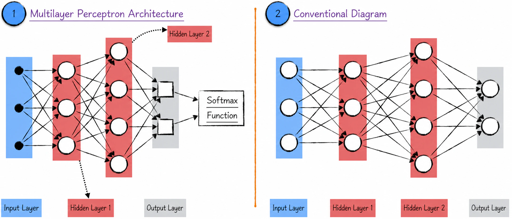
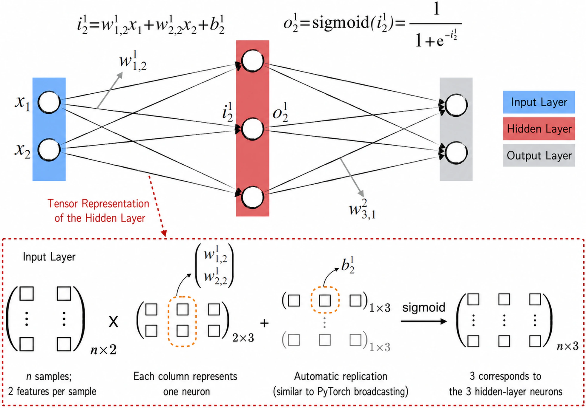
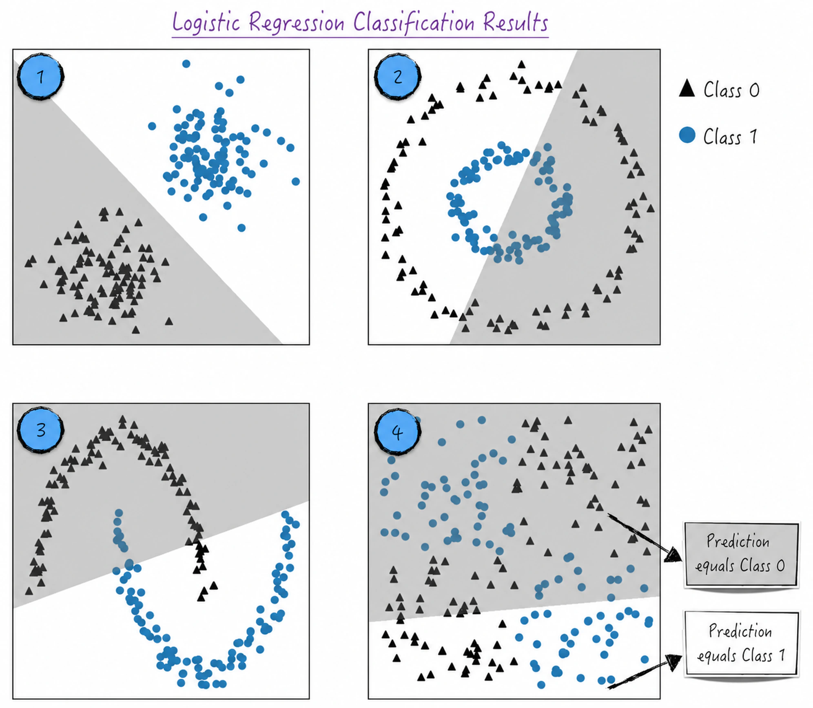
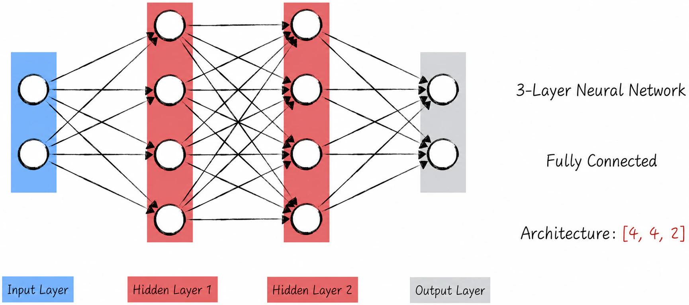
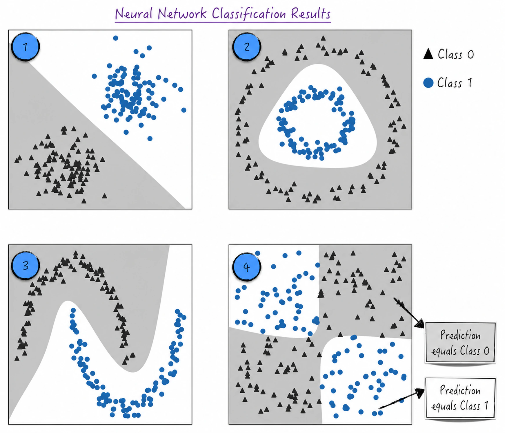
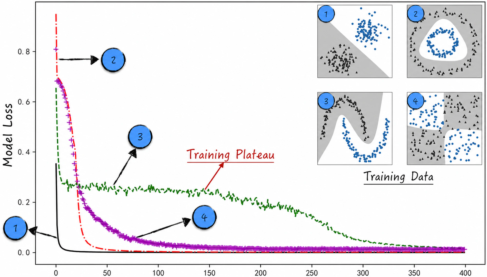
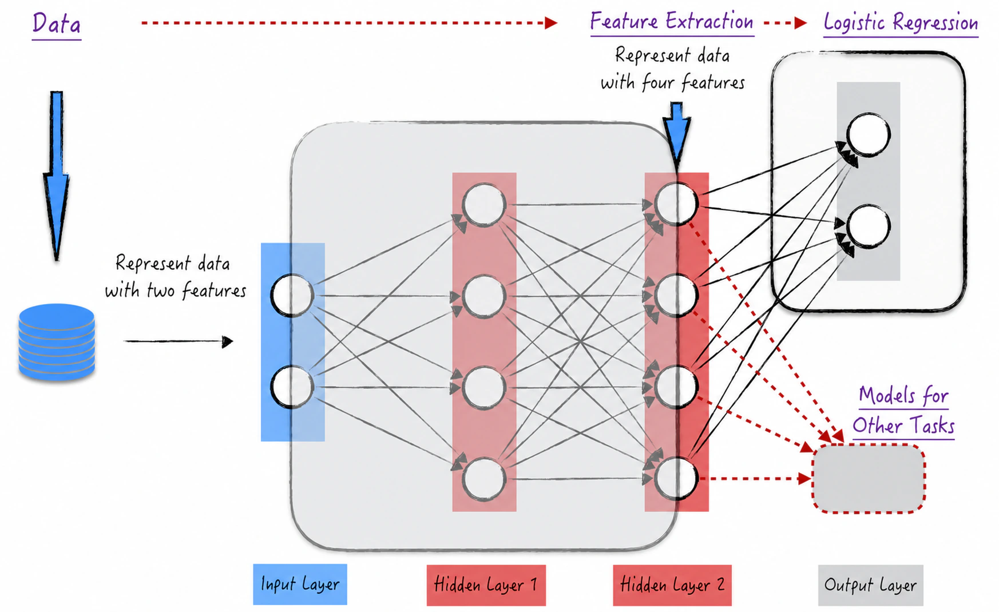

## 8.3 Multilayer Perceptrons

Building a model from a single neuron is not difficult, but such models offer limited flexibility. Using the Sigmoid function as the activation function, for example, produces a perceptron model similar to logistic regression.

Improving the model once again requires inspiration from bionics. A single neuron in the human body has relatively limited capabilities, but vast numbers of interconnected neurons form the powerful human nervous system. This suggests connecting multiple neuron models to construct complex and diverse neural-network structures—the subject of this section.

### 8.3.1 Graphical Representation

A simple and intuitive way to connect multiple neurons is to organize them in layers, forming a network with no closed loops—an acyclic graph. The output of each layer becomes the input to the next. This type of neural network is known as a **multilayer perceptron**; Figure 8-9 shows its topology.

This layered architecture allows information to flow in an orderly fashion and gives the model strong expressive power. The connections between layers and the number of neurons in each layer can be adjusted for different problems to optimize the multilayer perceptron's performance. The multilayer perceptron is a classic neural-network architecture. Without exaggeration, it is the foundation of every neural network: subsequent, more complex networks either evolved from it or contain multilayer perceptrons within their structures.



In a multilayer perceptron, neurons are organized into layers. Each layer contains several mutually independent neurons, meaning that neurons within a layer are not connected to one another. Adjacent layers, however, are fully connected: every pair of neurons across the two layers has a direct connection.

The neural network's hierarchy is divided by function into three kinds of layers: the input layer, hidden layers, and the output layer. The input layer receives data, the hidden layers perform calculations and extract features, and the output layer produces the model's predictions.

1. A neural network has exactly one input layer. The black dots in label 1 of Figure 8-9 represent this layer. Each black dot represents one model input—that is, one feature in the training data. If the training data have $k$ features, the input layer contains $k$ black dots. The input layer does not process the data; its principal responsibility is to pass information to the subsequent hidden layer. If the network has no hidden layer, it passes the information directly to the output layer, making the neural network resemble the logistic regression model in Figure 8-5.
2. A neural network may have multiple hidden layers; label 2 in Figure 8-9 shows two. Each element in a hidden layer is a perceptron, such as a Sigmoid perceptron, represented by a circle. Each circle combines a linear model and an activation function. In a multilayer perceptron, hidden layers transmit and analyze data in order to extract features and transform the data.
3. A neural network has exactly one output layer. Its elements differ from those in a hidden layer: each contains only a linear model and is represented by a square. Despite its name, the output layer may not produce the model's final result. For a classification problem, its values must pass through a Softmax function to become the final predictions, just as in the logistic regression model in Figure 8-5.

As noted earlier, different layers play different roles, and the precise models represented by their “elements” vary widely. Neural-network diagrams conventionally use circles for all these elements and call them neurons collectively, which can be confusing to beginners. Although a Softmax function often adjusts the values at the final stage, diagrams commonly omit this step, as label 2 in Figure 8-9 does.

Labels 1 and 2 in Figure 8-9 depict the same neural network. The notation in label 2 is widely accepted in the field and will be used in later chapters. Neural networks are normally named by their number of layers, excluding the input layer. The model in Figure 8-9 is therefore called a three-layer neural network. This name does not uniquely identify a network: expanding hidden layer 1 in Figure 8-9 to ten neurons, for example, would still produce a three-layer network.

This section has introduced the naming conventions and graphical representations widely accepted in neural networks. A common notation makes network structures easier to communicate, whether we are constructing models or reading the literature.

### 8.3.2 Mathematical Foundations

Neural-network diagrams are intuitive, but the mathematics they contain can be complex. We now examine the mathematical foundations behind the diagrams.

For convenience, consider the simple two-layer neural network for classification in Figure 8-10. Its input layer contains two circles representing the two model features, denoted by $x_1$ and $x_2$.

The circles in the hidden layer represent perceptrons, each with two main components: a linear model and an activation function. The linear model multiplies the input features by their corresponding weights and sums the results. The activation function then applies a nonlinear transformation, introducing complex nonlinear relationships into the neural network.

1. For neuron $m$ in layer $l$, where layers are numbered from left to right and neurons from top to bottom, let $i_m^{(l)}$ denote the output of the linear model—the first transformation performed on the input inside the circle. Let $o_m^{(l)}$ denote the output of the activation function, which is also the output of the circle. Because this network uses Sigmoid perceptrons[^1], their relationship is

$$
o_m^{(l)}=\frac{1}{1+e^{-i_m^{(l)}}}
\tag{8-11}
$$

2. In Figure 8-10, the arrows between circles represent weights in the linear models. As in [Section 8.1.2](/books/deconstructing_LLM/chapter-8/8-1#section-8-1-2), the variable nodes representing model parameters are hidden. Let $w_{n,m}^{(l)}$ denote the arrow from circle $m$ in layer $l-1$ to circle $n$ in layer $l$. For notational convenience, the input layer is layer 0.
3. In addition to weights, a linear model has a bias, another important neural-network parameter. Let $b_n^{(l)}$ denote the bias associated with circle $n$ in layer $l$. Using the preceding notation, the output of the linear model inside the circle is given below. Note that $o_m^{(0)}$ denotes feature $m$ in the input layer—that is, $x_m$ in Figure 8-10.

$$
i_n^{(l)}=\sum_m w_{n,m}^{(l)}o_m^{(l-1)}+b_n^{(l)}
\tag{8-12}
$$

4. The mathematical representation of a hidden layer involves many symbols, and without careful organization it is easy to lose one's bearings. Practical implementations remain concise and clear by using the operations shown in the lower half of Figure 8-10. First, they use tensor operations, an extension of matrix operations; see [Section 2.1](/books/deconstructing_LLM/chapter-2/2-1) and [Section 6.3.1](/books/deconstructing_LLM/chapter-6/6-3#section-6-3-1). They also use automatic tensor expansion, similar to PyTorch's broadcasting mechanism, to handle tensors of different dimensions conveniently. This shifts attention from individual parameter values to tensor shapes and ensures that those shapes match the network structure.



The circles in the output layer represent only linear models. Although they contain no activation function, Figure 8-10 still uses the symbol $o$ for simplicity.

1. Unlike a hidden layer, the output layer has $i_m^{(l)}=o_m^{(l)}$. The formula for $i_m^{(l)}$ is identical to that for a hidden layer and need not be repeated.
2. For a classification problem, the loss function is given by Equation (8-13). Here $\sigma$ is the Softmax function discussed in [Section 8.1.4](/books/deconstructing_LLM/chapter-8/8-1#section-8-1-4), $\boldsymbol Z_i$ is the neural network's output for observation $i$, and $\boldsymbol\theta_i$ represents that observation's class.

$$
L=\sum_iL_i=-\sum_i\boldsymbol\theta_i\ln\sigma(\boldsymbol Z_i)^{\mathrm T}
\tag{8-13}
$$

3. As with hidden layers, practical implementations organize the output-layer calculations with tensors.

In summary, neural-network parameters fall into two categories: the weights and biases of the linear models. Even this simple example begins to reveal the mathematical complexity of neural networks. First, such a model has an enormous number of parameters, particularly when the network structure is complex. Second, the model expression constructed from those parameters is itself exceptionally complicated.

Unlike other models, moreover, a neural network has no fixed mathematical expression. Its expression changes flexibly with its structure, and parameters in different layers depend closely on one another. These characteristics make deriving analytical gradient expressions extremely difficult—nearly impossible. Backpropagation displays its unique advantage in precisely this setting. With tensors and carefully defined model operations, it automatically calculates the gradient of every parameter and thereby makes neural-network training possible.

Let us briefly digress to consider what using backpropagation to calculate neural-network gradients can teach us. This example vividly illustrates the essence of engineering thinking. As Newton said, by “standing on the shoulders of giants,” we can see farther. Although backpropagation arose in close connection with practical problems in neural networks, it transcends the complexity of those specific problems. Through generalization, abstraction, and the idea of a computational graph, it became a reusable building block for gradient calculation.

Backpropagation lets us transform a problem into a pattern that has already been solved. Without it, we would spend enormous amounts of time and effort calculating gradients manually for very little return. Genuine technological progress requires us to identify and abstract general problems, create reusable building blocks that solve them, and apply those building blocks effectively in practice. Only then can technology deliver broader practical value.

Such building blocks often serve as foundational technologies and support what is commonly called deep technology. Their importance is beyond doubt—but what truly counts as deep technology? Every stage of technological development contains essential technical elements. These elements form an interdependent system and must work together to maximize value; removing any link may render the entire chain ineffective. The essence of engineering culture is therefore to understand a discipline's fundamental tools deeply and apply them well.

### 8.3.3 Remarkable Versatility

The preceding discussion focused on the theory of multilayer perceptrons. We now use an example to demonstrate how neural networks solve classification problems. To expose the network's characteristics more clearly, this example does not divide the data into training and test sets.

Classification is one of the most common applications of artificial intelligence. [Chapter 4](/books/deconstructing_LLM/chapter-4) examined logistic regression for classification in depth. A major limitation of logistic regression is its explicit assumptions about the data: it performs well only when the data satisfy those assumptions. When their distribution does not, classification performance may suffer.

Figure 8-11 shows four different data distributions. The data have two features, corresponding to the horizontal and vertical axes. They belong to two classes: triangles represent class 0 and dots represent class 1. Logistic regression performs well only in case 1, because that distribution satisfies the model's assumptions. Cases 2, 3, and 4 are more complex, with nonlinear relationships between class and the independent variables. Achieving good classification performance on them requires other modeling techniques.



Neural networks make the classification process far easier. Imagine making a layer cake: we need only choose the number of layers and the number of neurons in each—that is, design the network structure. Logistic regression can be viewed as a one-layer neural network, but it performs poorly on complex data and has limited versatility. Greater depth can improve performance; Figure 8-12 shows a three-layer fully connected network.



Figure 8-13 shows this network's classification results. Remarkably, the same network structure, though with slightly different parameter values, performs extremely well on all four distributions. This demonstrates its remarkable versatility. A neural network is like a master key: it adapts to different data characteristics without requiring a newly designed model for every distribution. Its multilayer structure may be the reason. Like the human brain, it automatically captures complex relationships in the data. Through a sequence of transformations, the network gradually extracts abstract features and thereby achieves more accurate classification.



### 8.3.4 Code Implementation

Following the block-building approach introduced in [Section 8.2.4](/books/deconstructing_LLM/chapter-8/8-2#section-8-2-4), implementing a multilayer perceptron requires little creativity; the process is largely mechanical. Implement each component in Figure 8-12 and place it in the appropriate position in the network structure to assemble the model step by step.

1. The implementation introduces two new component classes: `Sigmoid` and `Sequential`. Lines 4–11 of Listing 8-3 define `Sigmoid`, which implements the perceptron's activation function. Lines 13–25 define `Sequential`, which constructs the layered connections of the multilayer perceptron: neurons are organized by layer, and each layer's output becomes the input to the next.
2. Once the components have been defined, constructing the model is as simple as assembling a toy from its instructions. Lines 27–32 build the complete model. Lines 29 and 30 correspond to hidden layers 1 and 2, respectively, while line 31 represents the output layer.

#### Listing 8-3 A Multilayer Perceptron ([Complete Code](https://github.com/GenTang/regression2chatgpt/blob/en/ch08_mlp/mlp.ipynb))

```python
class Linear:
    ......

class Sigmoid:

    def __call__(self, x):
        self.out = torch.sigmoid(x)
        return self.out

    def parameters(self):
        return []

class Sequential:

    def __init__(self, layers):
        self.layers = layers

    def __call__(self, x):
        for layer in self.layers:
            x = layer(x)
        self.out = x
        return self.out

    def parameters(self):
        return [p for layer in self.layers for p in layer.parameters()]

# Define the model
model = Sequential([
    Linear(2, 4), Sigmoid(),
    Linear(4, 4), Sigmoid(),
    Linear(4, 2)
])
```

Training and using the model closely resemble the preceding examples, so we omit the details. If the loss is recorded during training, the curves resemble those in Figure 8-14, where each curve represents different training data. The optimization process clearly differs across data types.

For easily classified data, such as dataset 1, the model's performance improves rapidly. For more difficult data, such as dataset 3, the model experiences a long training plateau. Although it has not yet converged, its performance shows almost no discernible improvement over many training cycles. This is an important challenge in neural-network research, especially for deep networks.



This example vividly demonstrates the importance of efficient model training. When convergence begins to stall, accurately identifying the cause, locating the key problem, and applying appropriate techniques to accelerate convergence become central concerns in neural networks. They also offer excellent opportunities for skilled data scientists to add distinctive value.

### 8.3.5 Connectionism in Models

Any discussion of neural networks must eventually address connectionism. Its central idea is to assemble simple models through engineering into a powerful whole, and neural networks embody this idea to an extraordinary degree. In the example from [Section 8.3.3](/books/deconstructing_LLM/chapter-8/8-3#section-8-3-3), logistic regression alone classified the data poorly. Connecting multiple logistic regression models—Sigmoid perceptrons—into a network dramatically improved performance.

Other models can also be assembled in a similar manner: the output of one becomes the input of another, producing a powerful composite model. Neural-network connectionism differs slightly from these cases. In a neural network, all the “submodels” are trained jointly. Elsewhere, the submodels are trained independently and only then combined to make predictions.

Connecting arbitrary models into a network does not necessarily improve performance. If the activation functions are removed from the neurons, for example, even the most intricate network of connections remains a linear regression model, because a linear combination of linear functions is still linear. Activation functions therefore play a decisive role. Without their nonlinear transformations, neural networks as a discipline could scarcely exist. Imagine a neural network as a multilayer cream cake: linear models form the cake itself, while nonlinear transformations are the cream spread across its layers. These transformations give the network its powerful modeling capacity, just as cream gives a cake its distinctive flavor.

What is a neural network? Different perspectives produce different answers. Mathematically, it is a layer-by-layer composition of mathematical operations—linear and nonlinear transformations. From this viewpoint, we can understand its problem-solving strategy in reverse: successive nonlinear transformations convert a difficult nonlinear problem into an approximately linear one.

Reconsider the multilayer perceptron from [Section 8.3.3](/books/deconstructing_LLM/chapter-8/8-3#section-8-3-3) structurally. The model begins with two features describing each observation and produces a classification prediction through the neural network. We can decompose the network into two stages: the original output layer becomes the second stage, while all preceding layers are merged into the first, as Figure 8-15 shows. Supplying the two-dimensional array of original features to the first stage produces a four-dimensional array representing four new features for each observation. The first stage therefore performs feature extraction, while the second is simply logistic regression solving the specific classification task.



This decomposition generalizes to any neural network: every network consists of two submodels. The first extracts meaningful features from the raw data to form a new representation. The second performs a particular modeling task. These submodels are normally used together, but they can also be separated. We might use only the feature extractor, for example, and apply its features to other modeling tasks. This is a practical application of the block-building mindset from [Section 8.2.4](/books/deconstructing_LLM/chapter-8/8-2#section-8-2-4): first build a complete model, then detach one component for independent use.

Consider a concrete example. During pretraining, a large language model trains a base model. Its task is to predict the next token from a given context. If the Chinese context is “我爱我的祖” (“I love my mother—”), for example, the base model may predict “国” (“land”).

Although the base model is powerful at text prediction, it is poorly suited to other tasks, such as text classification. Model composition lets us exploit its capabilities: use the first stage of the base model to extract text features, then select another suitable model to perform classification—for example, a decision tree from [Chapter 13](/books/deconstructing_LLM/chapter-13) or the logistic regression model discussed earlier. Here logistic regression classifies text; it does not predict the next token.

Readers unfamiliar with large language models may find this example abstract. There is no need to worry: [Section 11.4](/books/deconstructing_LLM/chapter-11/11-4) explains the details. This example merely prepares the ground.

[^1]: Using another activation function changes Equation (8-11). Common activation functions appear in [Section 8.4.5](/books/deconstructing_LLM/chapter-8/8-4#section-8-4-5).
