## 8.4 The Key to Optimizing Training: Activation Functions

As discussed in [Section 8.3.4](/books/deconstructing_LLM/chapter-8/8-3#section-8-3-4), training a neural network is a complex task. Neural networks have complicated model structures, and our theoretical understanding of them—including how they work and how their predictions should be interpreted—is limited. Academia and industry have therefore focused primarily on how to train neural networks efficiently.

The world contains many tools that we can use without fully understanding their principles. Human beings, for example, do not completely understand how the brain works, yet that does not prevent us from using it to acquire knowledge and drive progress. In a sense, a neural network is a new kind of intelligent agent, similar to the human brain. Although we cannot fully understand its internal mechanisms, we continue to explore its potential. Because our theoretical understanding of these models remains limited, many training techniques are largely empirical. They improve model performance in practice, but in many cases we do not know precisely why they work.

[Section 8.3.5](/books/deconstructing_LLM/chapter-8/8-3#section-8-3-5) established that the nonlinearity of activation functions is crucial to a neural network's predictive power. Activation functions influence not only prediction but also model training. This is the central topic of this section.

The optimization methods discussed here and in [Section 8.5](/books/deconstructing_LLM/chapter-8/8-5) apply mainly to complex deep neural networks, so their theory may seem obscure and the material somewhat fragmented. These techniques are nevertheless used widely in production, especially in areas such as large language models. To make their central ideas easier to understand, this chapter explains them with relatively simple multilayer perceptrons.

### 8.4.1 Dead Neurons

Model training is the iterative updating of model parameters according to an optimization algorithm and training data. Consider the update rule for vanilla stochastic gradient descent. To avoid confusion with this chapter's other mathematical notation, let $a$ denote a model parameter and $a_k$ its value at iteration $k$.

$$
a_k=a_{k-1}-\eta\frac{\partial L}{\partial a_{k-1}}
\tag{8-14}
$$

Equation (8-14) makes the importance of parameter gradients clear. A small gradient limits the magnitude of an update; in the extreme case of a zero gradient, the parameter does not change at all. We now examine how activation functions affect parameter updates from two perspectives. First, a concrete example and the computational graphs introduced in [Chapter 7](/books/deconstructing_LLM/chapter-7) provide an intuitive picture. [Section 8.4.2](/books/deconstructing_LLM/chapter-8/8-4#section-8-4-2) then gives the mathematical explanation.

[Section 8.1.2](/books/deconstructing_LLM/chapter-8/8-1#section-8-1-2) examined the relationship between neural-network diagrams and computational graphs. Building on that discussion, we now investigate the effect of activation functions during backpropagation. For clarity and brevity, focus on a single neuron in a hidden layer and assume that it has only one weight parameter $w$ and one bias parameter $b$.

On the left side of Figure 8-16 ([Complete Code](https://github.com/GenTang/regression2chatgpt/blob/en/ch08_mlp/saturated_activation_function.ipynb)), the absolute value of the activation function's input—the linear model's output—is small and close to 0. The parameter gradients can be obtained normally and are nonzero. When the input becomes large, however, the activation function may become saturated and cause its gradient to underflow to 0. Backpropagation then gives the related parameters zero gradients as well, as the right side of Figure 8-16 shows. More seriously, because this occurs within a neural network, it affects every child node of the neuron: all gradients backpropagated through that neuron are set to 0.

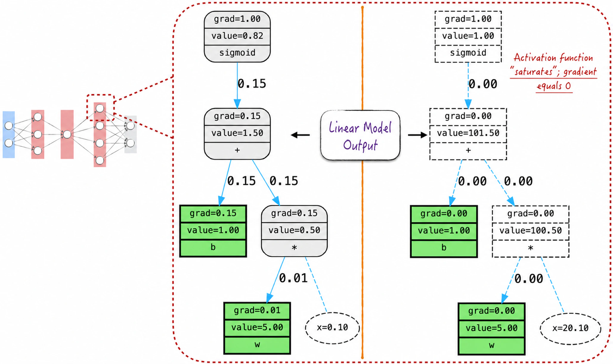

When data are used to train the model, the computational graph expands. The path associated with each observation remains independent, so as long as some observations provide suitable activation inputs, the parameter gradients will not be zero. The parameters will therefore continue to update, as shown on the left side of Figure 8-17.

If the activation function becomes saturated for every observation, the neuron becomes permanently “dead,” as the right side of Figure 8-17 shows. Its parameters never update again, so the neuron stops learning. By analogy with the human brain, dead neurons reduce the learning efficiency of their child nodes. A neural network may consequently appear complex while some of its components are completely ineffective or extremely inefficient, impairing the predictive performance of the entire network.

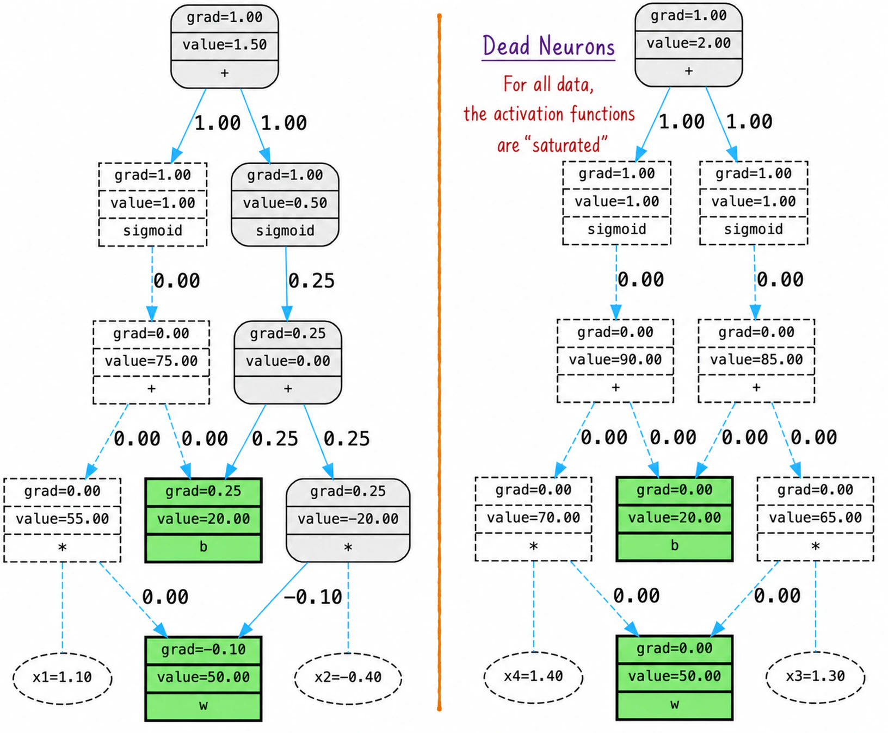

### 8.4.2 Mathematical Foundations

We now examine the mathematics behind dead neurons, beginning with properties of the Sigmoid function.

Sigmoid is well motivated theoretically but has several engineering drawbacks. In particular, its derivative rapidly approaches 0 when the input moves away from 0, as Figure 8-18 shows. This is the well-known saturation of an activation function. More precisely, saturation occurs at both the positive and negative extremes; in both cases, the derivative is approximately 0. A value close to 0 is not theoretically equal to 0, but finite computer precision can easily cause numerical underflow and incorrectly represent it as 0. This risk is greater on GPUs, where mixed-precision training from [Section 7.5.2](/books/deconstructing_LLM/chapter-7/7-5#section-7-5-2) often reduces numerical precision further.

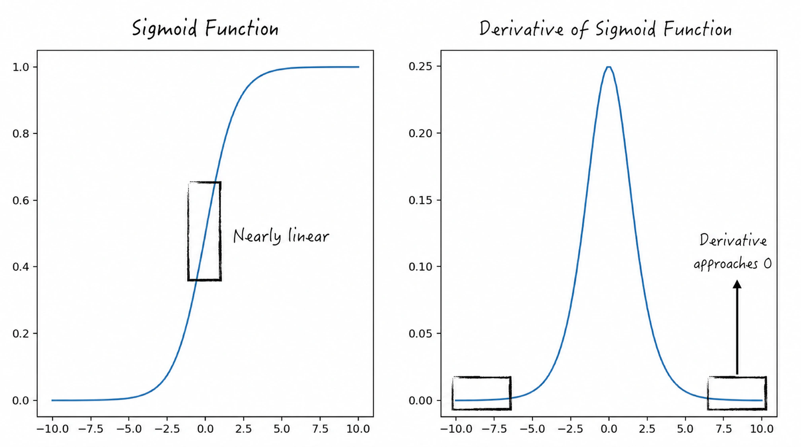

Figure 8-19 presents the mathematical expression for a parameter gradient; see [Section 8.3.2](/books/deconstructing_LLM/chapter-8/8-3#section-8-3-2) for the notation. The derivative of the activation function enters the gradient calculation directly as a multiplicative factor[^2]. If that derivative underflows and is represented as 0, the parameter gradient also becomes 0.

Even without numerical underflow, an excessively small activation derivative may make the parameter gradient so close to 0 that the parameter barely changes. Learning efficiency then declines, model learning becomes abnormally slow, and training grows difficult.

The preceding discussion shows that a neuron learns poorly when the Sigmoid input lies far from 0. Does an input very close to 0 provide the efficient learning we want? Unfortunately, not necessarily. A closer look at the Sigmoid curve shows that it is approximately a straight line near 0, as Figure 8-18 illustrates. Sigmoid is effectively linear in this region, so the entire neural network degenerates into a linear model. This harms predictive performance and also reduces learning efficiency substantially.

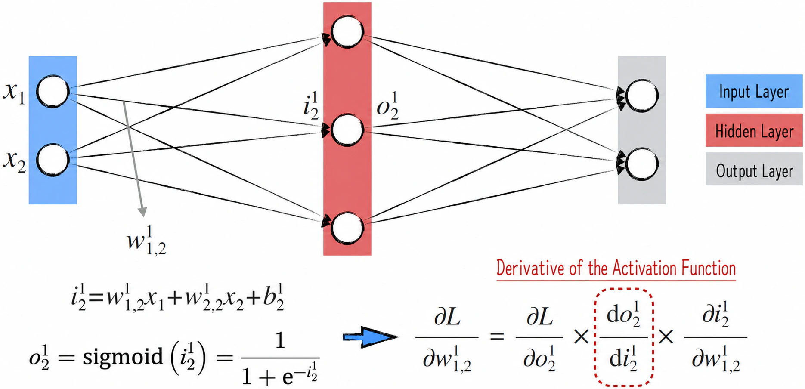

A balanced distribution of activation inputs is therefore essential. We want the inputs to be spread evenly: neither too far from 0 nor too concentrated around it. This balance improves predictive performance while maintaining efficient learning. If the distribution moves away from this balanced state, corrective measures are needed. We therefore treat the distribution of activation inputs as an important tool for monitoring neural-network training.

Because an activation function maps inputs to outputs, monitoring its outputs can serve the same purpose as monitoring its inputs. In practice, outputs are preferred because they are easier to extract and analyze in software implementations[^3]. We now examine how to monitor model training effectively.

### 8.4.3 Monitoring Model Training

[Section 8.4.1](/books/deconstructing_LLM/chapter-8/8-4#section-8-4-1) examined how activation saturation harms model training by selecting one neuron and observing its state through a computational graph. Although intuitive, this method is impractical. Real models have enormous numbers of parameters, and inspecting them one by one is nearly impossible. A large neural network may contain hundreds of millions of parameters. Even at one parameter per second, inspecting 100 million parameters would take approximately 1,157 days.

As [Section 8.4.2](/books/deconstructing_LLM/chapter-8/8-4#section-8-4-2) explained, activation outputs provide a crucial monitoring signal. Their distribution makes it easy to determine whether the functions are saturated. In practice, model-training status is therefore evaluated by examining these distributions, as Listing 8-4 demonstrates[^4]. The code calculates layer-by-layer statistics for activation outputs and displays them as histograms. The data used here are the two-moons dataset labeled 3 in Figure 8-11 of [Section 8.3.3](/books/deconstructing_LLM/chapter-8/8-3#section-8-3-3).

The implementation on lines 13–20 is straightforward. Iterate over the network layers, extract the activation outputs, calculate statistics, and plot their histograms. In addition to the usual mean and standard deviation, line 17 introduces a saturation metric called `saturation`. A Sigmoid function is considered saturated when its output is greater than 0.99 or less than 0.01.

#### Listing 8-4 Distribution of Activation Outputs ([Complete Code](https://github.com/GenTang/regression2chatgpt/blob/en/ch08_mlp/activation_monitoring.ipynb))

```python
import matplotlib.pyplot as plt
# Enlarge the neural network for this discussion
n_hidden = 100
model = Sequential([
    Linear(2, n_hidden), Sigmoid(),
    Linear(n_hidden, n_hidden), Sigmoid(),
    Linear(n_hidden, n_hidden), Sigmoid(),
    Linear(n_hidden, n_hidden), Sigmoid(),
    Linear(n_hidden, 2)
    ])
......

for i, layer in enumerate(model.layers):
    if isinstance(layer, (Sigmoid)):
        t = layer.out
        # An output above 0.99 or below 0.01 indicates saturation
        saturation = ((t - 0.5).abs() > 0.49).float().mean()
        hy, hx = torch.histogram(t, density=True)
        plt.plot(hx[:-1].detach(), hy.detach())
        ......
```

At every step of the optimization algorithm, this code can produce statistics and histograms describing the current activation state. Because the information changes dynamically with each iteration, running the code continuously would produce a “movie” of the activations. A printed page cannot show that motion, so we focus first on the activation state immediately after model initialization, shown on the left side of Figure 8-20.

The state is far from ideal. Except in the first layer, most activation functions are saturated, which inevitably reduces learning efficiency. Ideally, their outputs should be distributed evenly and the `saturation` metric should be small. Correspondingly, gradients backpropagated through the saturated functions are excessively concentrated around 0, as the right side of Figure 8-20 shows.

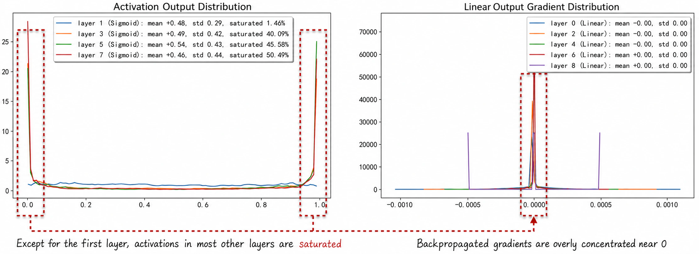

Besides examining activation states, we can study parameter-gradient distributions directly. Listing 8-5 demonstrates the method. One common metric is the ratio of the gradient's standard deviation to the parameter's standard deviation, called `grad_ratio` on line 8.

#### Listing 8-5 Distribution of Weight Gradients ([Complete Code](https://github.com/GenTang/regression2chatgpt/blob/en/ch08_mlp/activation_monitoring.ipynb))

```python
# Examine the distribution of parameter gradients
for i, layer in enumerate(model.layers):
    if isinstance(layer, (Linear)):
        # Examine only the weight parameter w
        p = layer.parameters()[0]
        g = p.grad
        # Ratio of the gradient standard deviation to the parameter standard deviation
        grad_ratio = g.std() / p.std()
        hy, hx = torch.histogram(g, density=True)
        ......
```

Running this code produces the plot on the left side of Figure 8-21. The gradient distributions reveal two problems. First, the gradients are excessively concentrated around 0, consistent with Figure 8-20. Second, enlarging the area around 0 produces the plot on the right side of Figure 8-21. The distributions plainly differ across layers. The gradients in layer 6, for example, lie closer to 0 than those in layer 8. This harmful phenomenon is called vanishing gradients.

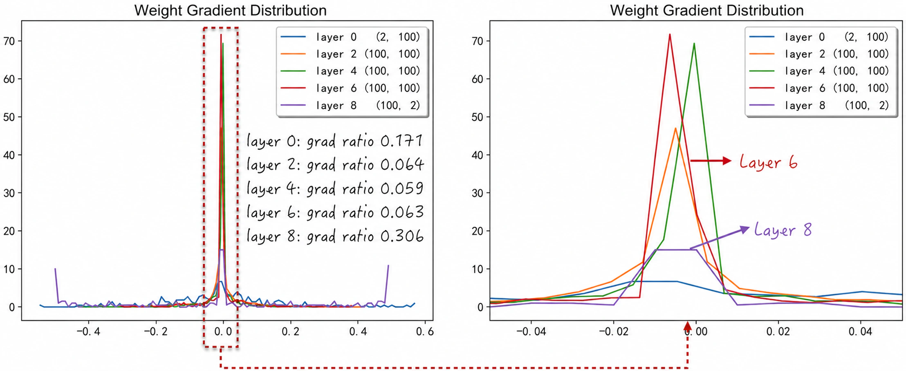

The `grad_ratio` metric enables quantitative evaluation. As noted above, what truly matters is the ratio between the magnitude of each parameter update and the parameter value. Equation (8-15) describes this quantity. The ratio should be neither too large nor too small; in practice, an absolute value that remains near one-thousandth is ideal.

$$
\frac{a_k-a_{k-1}}{a_{k-1}}
=-\eta\frac{\partial L/\partial a_{k-1}}{a_{k-1}}
\tag{8-15}
$$

An important empirical finding in neural networks is that parameter values in every layer approximately follow normal distributions centered near 0, while their gradients also follow approximately normal distributions on both sides of 0. Both parameters and gradients therefore have expectations near 0[^5]. The `grad_ratio` metric is consequently close to the expected absolute value of the right-hand side of Equation (8-15), divided by the learning rate: the mean absolute ratio between parameter gradients and parameter values.

In addition to guiding the choice of learning rate, `grad_ratio` can reveal deviations during training. We can record the parameter updates in every layer, measuring their magnitude by multiplying `grad_ratio` by the learning rate, as in the code in Figure 8-22. The figure shows that the update magnitude gradually decreases with the number of iterations and moves away from the ideal baseline of 0.001. Learning efficiency may therefore be declining, indicating an unsatisfactory training state.

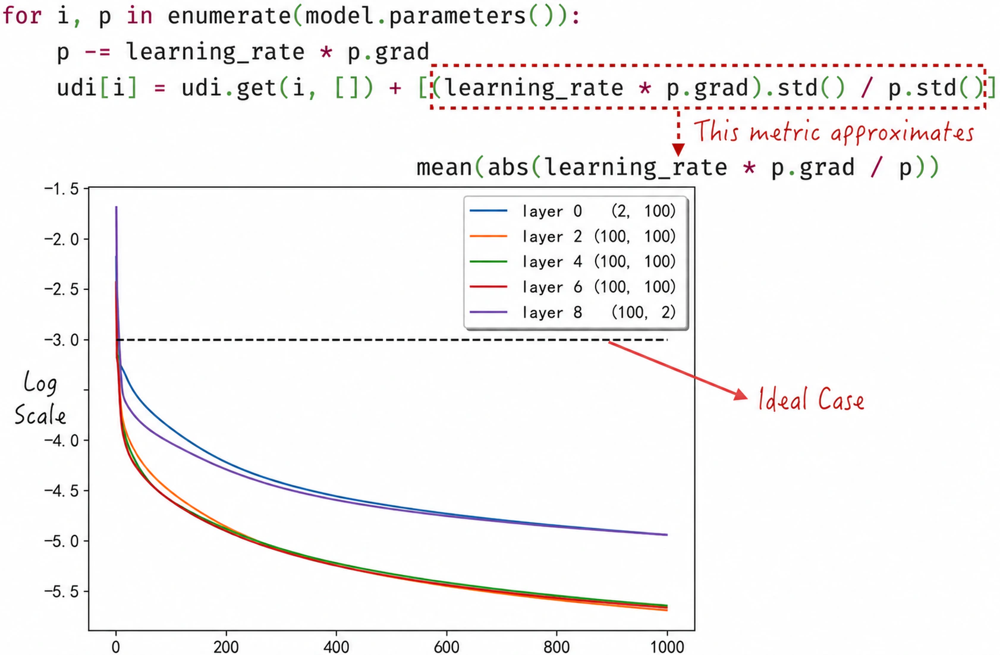

This section introduced three important plots for monitoring model training. Their metrics clearly show that the neural network is not learning well, consistent with the results in Figure 8-14. The following sections explain how to improve the network's learning state and achieve better training performance.

### 8.4.4 Unstable Gradients

[Section 8.4.3](/books/deconstructing_LLM/chapter-8/8-4#section-8-4-3) introduced the important problem of vanishing gradients. The right side of Figure 8-21 visualizes it as inconsistent gradient distributions among the network's layers. This inconsistency originates in the network structure and backpropagation. It severely reduces learning efficiency and makes deep neural networks exceptionally difficult to train. Its two fundamental forms are known as the **vanishing gradient problem** and the **exploding gradient problem**.

Vanishing gradients are especially common in deep neural networks. During backpropagation, gradients shrink layer by layer until those in the earliest layers are nearly 0. These layers cannot learn or adapt effectively to the characteristics of the data, harming the performance of the entire network. Figure 8-23 provides a simple mathematical example: a four-layer network with one neuron in each layer. Mathematical derivation yields the parameter-gradient expressions shown in the figure.

The closer a parameter is to the input, the more multiplicative factors appear in its gradient expression. These factors include derivatives of activation functions, which are normally less than 1; the maximum Sigmoid derivative, for example, is 0.25. Neural-network parameter values are also usually small and approximately normally distributed around 0. This makes the absolute values of the factors smaller still. If each factor is approximately 0.1, a parameter gradient in an early layer may be only one-thousandth as large as one in a later layer.

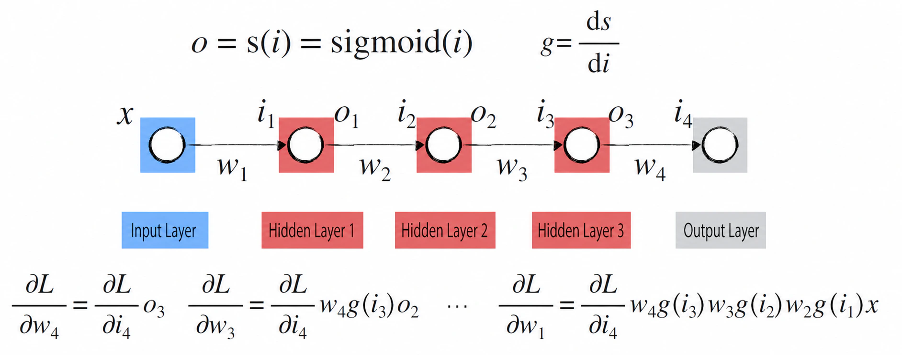

The opposite case is the exploding gradient problem. Here gradients increase from layer to layer, potentially becoming abnormally large in some layers and preventing stable parameter updates. Training may become unstable or the model may fail to converge. Vanishing and exploding gradients are therefore two sides of the same problem. From the perspective of backpropagation, a gradient moves backward through the neural network one layer at a time and may be attenuated or amplified at every layer. As the network becomes deeper or larger, keeping the parameter gradients in every layer within an appropriate range becomes difficult.

Two main approaches address these problems. The first seeks to prevent gradients from shrinking or growing as they pass through each layer. This can be done with improved activation functions whose derivatives remain closer to 1, or with special layers that adjust gradient magnitudes—normalization layers. The second lets gradients “skip” several layers during backpropagation, passing directly to parameters in earlier layers through deliberately constructed shortcuts. This innovation is called a residual connection.

[Section 8.4.5](/books/deconstructing_LLM/chapter-8/8-4#section-8-4-5) discusses improved activation functions, [Section 8.5](/books/deconstructing_LLM/chapter-8/8-5) examines normalization layers, and [Section 9.3.1](/books/deconstructing_LLM/chapter-9/9-3#section-9-3-1) explores residual connections in depth.

### 8.4.5 Improved Activation Functions

Sigmoid has two principal disadvantages as an activation function. First, its derivative approaches 0 when the input moves away from 0, and even at 0 its maximum value is only 0.25. This can cause vanishing gradients. Second, Sigmoid outputs are always positive rather than centered at 0, which is undesirable. Experience shows that symmetric, zero-centered activation functions train neural networks more effectively. Researchers have proposed many new activation functions to correct these shortcomings. We examine two representative examples.

- The tanh (hyperbolic tangent) curve closely resembles the Sigmoid curve. It can be viewed as Sigmoid shifted downward and stretched slightly, placing its center at 0 and increasing its maximum derivative to 1, as Figure 8-24 shows ([Complete Code](https://github.com/GenTang/regression2chatgpt/blob/en/ch08_mlp/activation_functions.ipynb)). Compared with Sigmoid, tanh has a derivative near 1 around 0 and function values centered at 0. Its derivative still approaches 0 when the independent variable moves far from 0, however, limiting its improvement in learning efficiency.

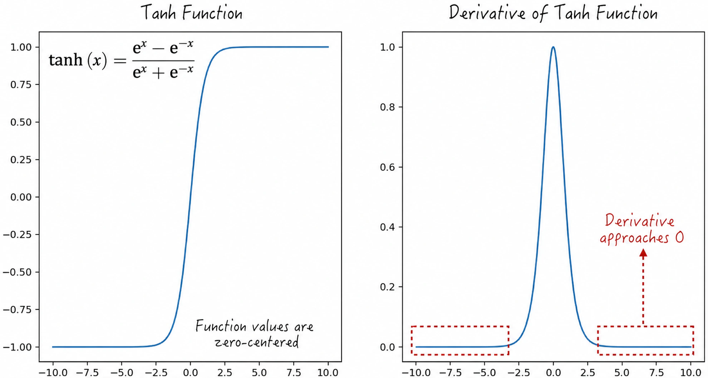

- ReLU, the rectified linear unit, is used widely in deep learning and resembles the behavior of human neurons in some respects, as Figure 8-25 shows. Its derivative takes one of two values: 0 when the input is negative and 1 when the input is positive[^7]. This simple property has proved capable of greatly improving neural-network learning, particularly in deep networks.

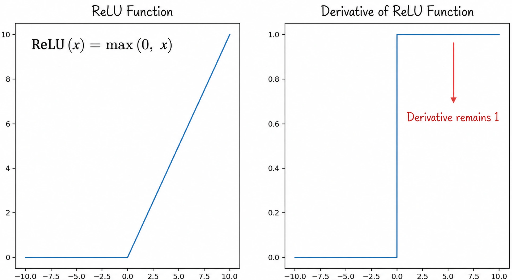

Although ReLU performs well in many situations, it also has drawbacks. When the input is negative, both its output and derivative remain 0, making neurons susceptible to becoming dead. Researchers have proposed a series of improved activation functions, including ELU (exponential linear unit), GELU (Gaussian error linear unit), and SiLU (Sigmoid linear unit)[^8]. We omit their mathematical details and show only their curves and derivatives in Figure 8-26, providing an intuitive impression of their behavior.

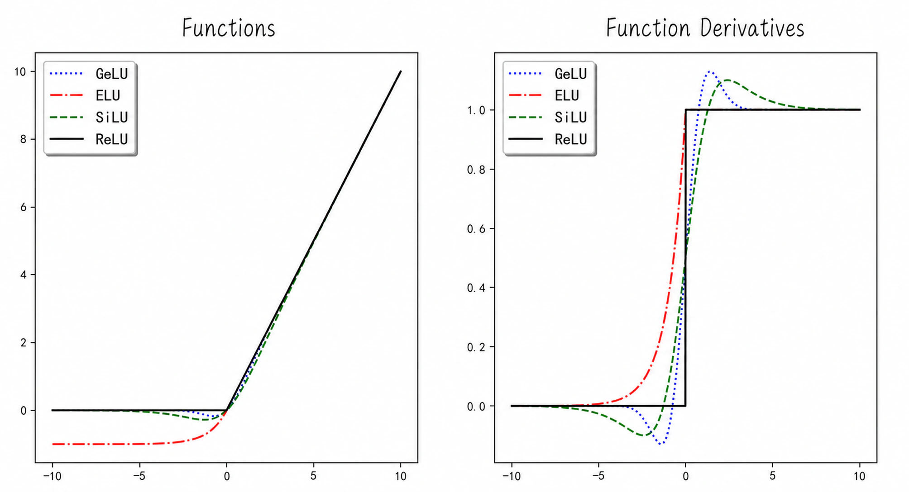

[^2]: This is precisely why the Sigmoid function readily causes vanishing gradients; see [Section 8.4.4](/books/deconstructing_LLM/chapter-8/8-4#section-8-4-4) for details.
[^3]: In the multilayer perceptron discussed here, an activation function's input is the output of a linear model. More complex networks may add other layers after the linear model, such as the normalization layers discussed in [Section 8.5.4](/books/deconstructing_LLM/chapter-8/8-5#section-8-5-4). Analyzing activation outputs is therefore generally simpler and clearer.
[^4]: Parts of this section and [Section 8.5.4](/books/deconstructing_LLM/chapter-8/8-5#section-8-5-4) draw on Andrej Karpathy's course *Neural Networks: Zero to Hero*.
[^5]: Interested readers can download an open-source large neural network—for example, GPT-2 through the Transformers library—and verify this observation.
[^7]: Strictly speaking, the ReLU derivative is undefined at 0. Practical implementations normally define it as 0 at that point.
[^8]: Activation functions are an active topic in neural-network research. Other commonly used functions include Leaky ReLU, GELU-New, and Maxout.
