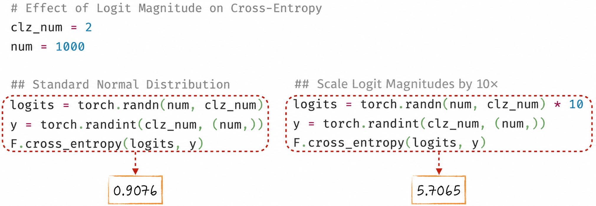
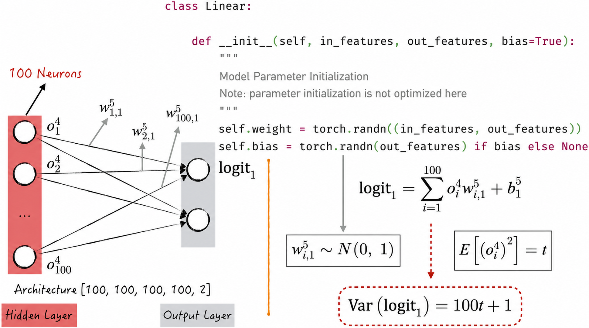
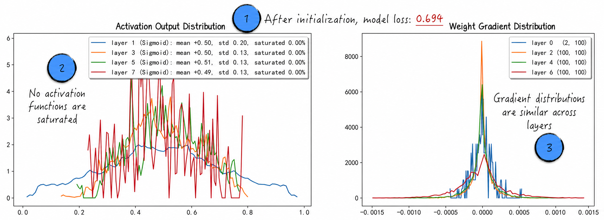
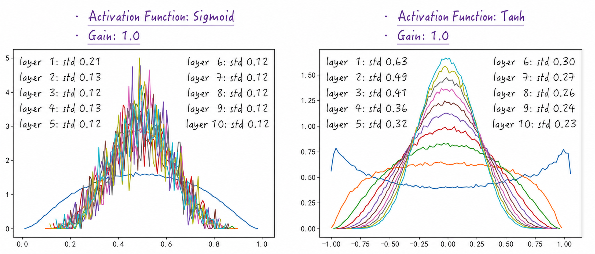
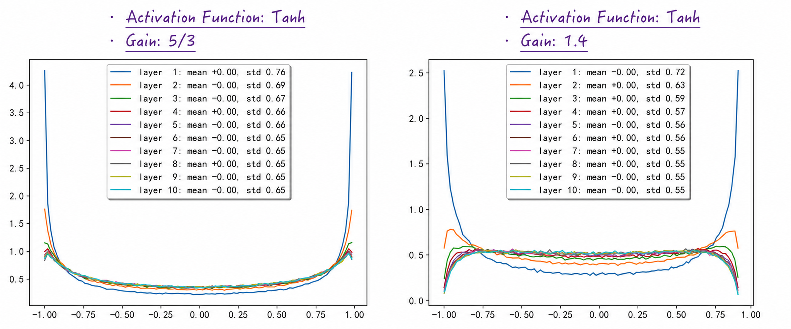
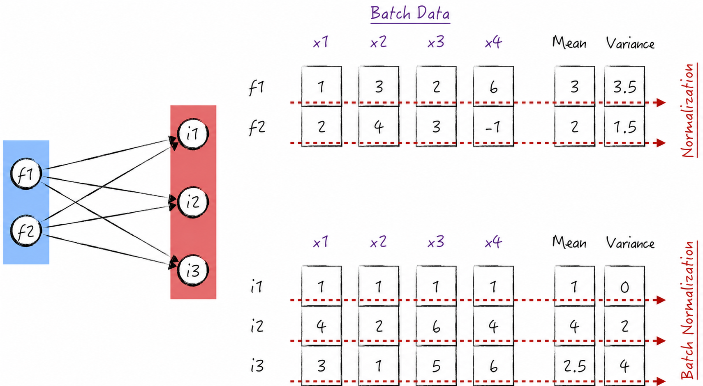
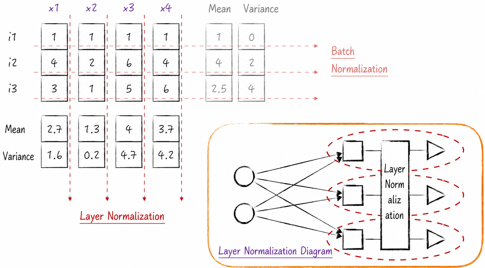

## 8.5 Optimizing Training from the Very First Step

[Section 8.3.4](/books/deconstructing_LLM/chapter-8/8-3#section-8-3-4) applied a multilayer perceptron to several classification problems. Figure 8-14 showed, however, that its learning efficiency on the two-moons data set labeled 3 was unsatisfactory: training remained stagnant for a long period.

To understand the cause of this inefficiency, [Section 8.4.3](/books/deconstructing_LLM/chapter-8/8-4#section-8-4-3) introduced tools commonly used to monitor model training. Like physicians, these tools help diagnose the root cause of poor learning. Based on their findings, [Section 8.4.5](/books/deconstructing_LLM/chapter-8/8-4#section-8-4-5) examined improved activation functions, which can significantly increase learning efficiency. That is not the only possible improvement. This section uses the same monitoring information to investigate methods independent of the activation function.

### 8.5.1 Estimating Model Loss

The central objective of model training in artificial intelligence is to reduce loss. Training is therefore often visualized with a curve showing loss over time. The preceding discussion focused on the curve's trend, such as its rate of decline, but did not examine the meaning of specific loss values, especially for classification. In a binary classification problem, for example, what does a loss of 1.6 mean? What does that number alone tell us about predictive performance?

Without additional knowledge, the most basic strategy for binary classification is random guessing: assign probability 0.5 to class 0 and probability 0.5 to class 1. This method is universal because it applies to every binary classification problem. It is also relatively poor because it uses no information or knowledge about the data. Random guessing can therefore serve as a baseline, and no model should perform worse. A model that does worse than random guessing plainly has a problem.

What is the loss under random guessing? For binary classification, Equation (8-16) gives the loss at one data point, approximately 0.69. Regardless of the data set, random guessing always has this loss. The baseline loss for every binary classification model is therefore 0.69.

$$
L_i=-\left(y_i\ln 0.5+(1-y_i)\ln 0.5\right)=-\ln 0.5\approx 0.69
\tag{8-16}
$$

This knowledge makes the quality of a model's predictions easier to interpret during training; it translates the abstract loss into more intuitive language. If the trained model has a loss near 0.2, for example, then on average it assigns the correct class a probability of approximately 0.82, because $e^{-0.2}\approx0.82$. That is a reasonably good prediction.

### 8.5.2 Initial Improvements to Parameter Initialization

The baseline loss for binary classification is 0.69. In [Section 8.4.3](/books/deconstructing_LLM/chapter-8/8-4#section-8-4-3), however, the model's loss immediately after initialization was approximately 4.16[^1]. The model therefore begins with a very serious error. Learning from such a poor starting point will plainly reduce efficiency and may even prevent correct convergence. We now examine how to correct the problem.

Why does initialization produce such a large error? Figure 8-27 provides a small experiment. In binary classification, if the model's logits—its unnormalized output scores—follow a standard normal distribution, then the corresponding cross-entropy, or loss, is approximately 0.91 under random conditions, close to the baseline. If the range of the logits is expanded by setting their standard deviation to 10, however, cross-entropy rises sharply to an alarming 5.71.



The experiment suggests that the unusually high initial loss is caused mainly by excessive variation in the output logits. Why does this happen? Consider the initialization code in Figure 8-28.



The output-layer weights are initially drawn from a standard normal distribution. What variance will the resulting logits have? A particular input $o$ to the output layer is plainly independent of the model parameter, because the parameters are generated randomly. For a weight $w$, $E[w]=0$ and $\operatorname{Var}(w)=1$. An appropriate derivation for this input yields Equation (8-17)[^2]. Subscripts are omitted for clarity without affecting the argument.

$$
\operatorname{Var}(ow)
=\operatorname{Var}(o)\operatorname{Var}(w)
+\operatorname{Var}(w)(E[o])^2
=\operatorname{Var}(w)E[o^2]
=E[o^2]
\tag{8-17}
$$

It is reasonable to assume further that every input to the output layer follows the same distribution. Equation (8-17) then implies that the variance of the output logits is proportional to the number of neurons feeding the output layer. To keep the logits' variance at 1, set the bias parameter $b$ to 0 and draw the weights from a normal distribution with standard deviation $1/\sqrt M$, where $M$ is the number of input neurons in the output layer. This standardizes the logits' variance and avoids the initialization problem.

The same treatment must be applied to the other layers. Otherwise, the linear outputs of hidden layers vary excessively, which is why most activation functions in Figure 8-20 of [Section 8.4.3](/books/deconstructing_LLM/chapter-8/8-4#section-8-4-3) were saturated. Listing 8-6 optimizes initialization in this way[^3], with the essential code on lines 16–19.

To make the logic and effect of this optimization clear, our `Linear` implementation deliberately omitted initialization improvements and applies them later when the model is used. Mature third-party libraries such as PyTorch normally incorporate some initialization optimization in their linear-model implementations. Readers should consult the relevant documentation carefully and make further adjustments according to the library's behavior and their own requirements.

#### Listing 8-6 Optimizing Parameter Initialization ([complete code](https://github.com/GenTang/regression2chatgpt/blob/en/ch08_mlp/initialization.ipynb))

```python
# Use the same model as in Section 8.4.3
n_hidden = 100
model = Sequential([
    Linear(      2, n_hidden), Sigmoid(),
    Linear(n_hidden, n_hidden), Sigmoid(),
    Linear(n_hidden, n_hidden), Sigmoid(),
    Linear(n_hidden, n_hidden), Sigmoid(),
    Linear(      n_hidden, 2)
    ])

# Optimize parameter initialization
with torch.no_grad():
    for layer in model.layers:
        if isinstance(layer, Linear):
            in_features, out_features = layer.weight.shape
            # Reduce the variance of the weights
            layer.weight *= 1 / in_features ** 0.5
            # Set the bias to 0
            layer.bias = torch.zeros(out_features)
```

After this optimization, the loss falls into a reasonable range—specifically, 0.694. The activation functions also behave much better and the gradient distributions become more appropriate, as Figure 8-29 shows. Even before the optimization algorithm actually runs, these results demonstrate a significant improvement in learning efficiency[^4].



### 8.5.3 Further Improvements to Parameter Initialization

The preceding initialization strategy was designed for the Sigmoid function. It works well with Sigmoid, but do other activation functions require additional techniques?

Answering this question requires a clear objective: initialization should make the output distributions of all layers similar. Because activation functions have relatively complex mathematical expressions, [Section 8.5.2](/books/deconstructing_LLM/chapter-8/8-5#section-8-5-2) focused on making the linear-output distributions similar across layers. This is important because an activation function maps inputs to outputs, so similar input distributions should also produce similar output distributions. This similarity helps keep gradients comparable across layers during backpropagation, allowing the model to learn more effectively.

Once the objective is clear, it can be tested directly. Perform only a forward pass and record each layer's output distribution; this reveals whether the initialized model meets the objective. Listing 8-7 demonstrates the method, with the essential code on lines 16–18. Line 16 implements the method from [Section 8.5.2](/books/deconstructing_LLM/chapter-8/8-5#section-8-5-2), while line 18 applies this section's key idea: the gain value. Setting the gain to 1.0 is equivalent to performing only the initial optimization.

#### Listing 8-7 Measuring Output Distributions Across Layers ([complete code](https://github.com/GenTang/regression2chatgpt/blob/en/ch08_mlp/initialization.ipynb))

```python
@torch.no_grad()
def layer_stats(func, calculate_gain):
    """
    Perform only a forward pass and record each layer's output distribution.
    Parameters
    ----------
    func : activation function
    calculate_gain : function gain
    """
    ......
    x = torch.randn(300, 1000) # Batch size is 300
    for i in range(10):
        l = Linear(1000, 1000, bias=False)
        in_features, _ = l.weight.shape
        # Initial optimization
        l.weight *= 1 / in_features ** 0.5
        # Further optimization
        l.weight *= calculate_gain
        x = func(l(x))
        # Record the output distribution
        hy, hx = torch.histogram(x, density=True)
        ......
```

Running this method compares activation functions such as Sigmoid and Tanh, producing Figure 8-30. For Sigmoid, the initial optimization is sufficient: the standard deviation of every layer remains relatively stable regardless of network depth. With Tanh, however, the standard deviation decreases from layer to layer, which is undesirable. The parameter constraints are apparently too strict, restricting each layer's output excessively and reducing the model's expressive power. We should retain the initial optimization but relax the constraints slightly by expanding the range of parameter values. This is the gain adjustment on line 18.



What gain is appropriate for Tanh? The answer is the seemingly magical number $5/3$. It does not come from an exact theoretical derivation but from practical experience. The value is not particularly sensitive: changing it slightly, to 1.4 for example, produces a similarly stable output distribution, as Figure 8-31 shows.

ReLU, another commonly used activation function, resembles Tanh in requiring a slightly wider parameter range after the initial optimization. For ReLU, the gain is $\sqrt 2\approx1.41$. PyTorch records gains for common activation functions[^5], which can be obtained with `torch.nn.init.calculate_gain`.



### 8.5.4 Normalization Layers

Many techniques can improve parameter initialization; the preceding two are merely classic and instructive examples. Initialization requires precise, delicate settings, much like walking a tightrope: a small error may prevent the desired result. Even carefully tuned initialization can ensure a good learning state only at the beginning. As training continues, its effect gradually weakens and the learning state may deteriorate. How can the model remain in a good state throughout training?

The key is to keep the outputs of different layers similar—or, equivalently, to give the activation inputs in every layer similar distributions. We can insert a special operation before each activation function to normalize its inputs. A **normalization layer** performs this operation and can keep activation-input distributions similar throughout training, significantly improving stability. Normalization makes the training of deep neural networks more systematic and efficient[^6].

Like an input or hidden layer, a normalization layer is a component in the network structure—the word *layer* is important. It has two principal forms. One calculates statistics across a batch of data and is called a **batch normalization layer**; the other calculates them across the neurons in a layer and is called a **layer normalization layer**. For brevity, the remainder of this section calls them **batch normalization** and **layer normalization**, respectively.

How should activation inputs be normalized? Recall the normalization of data features: for each feature, calculate the mean and variance—the square of the standard deviation—across the data set, then subtract the mean from every data point and divide by the standard deviation, as Figure 8-32 shows. Suppose the first hidden layer has three neurons. After the neurons' linear transformations, one data point becomes a three-dimensional vector, which can be viewed as a new feature representation of that point. The layer can therefore be normalized in the same way as the original features. This idea extends to every hidden layer and every set of activation inputs.



In the actual algorithm, the mean and variance are not calculated over the entire data set, but only over the current batch. Academia calls this method **batch normalization**, implemented in Listing 8-8. The same code can normalize either original features or activation inputs after a linear output.

1. To handle the extreme case of zero variance, the algorithm introduces a hyperparameter `eps`, used on line 20.
2. Normalization alone would make the outputs of every neuron in a layer very similar, reducing the model's expressive power. Two model parameters, `gamma` and `beta`, preserve that power. They resemble the weights and biases of a linear model and appear on line 21. They allow different neurons to activate to different degrees.
3. Because normalization subtracts the mean, the bias in the preceding linear component becomes meaningless: regardless of its value, mean subtraction removes it. A neural network using batch normalization therefore does not need biases in the corresponding linear models.

#### Listing 8-8 Batch Normalization ([complete code](https://github.com/GenTang/regression2chatgpt/blob/en/ch08_mlp/normalization.ipynb))

```python
class BatchNorm1d:

    def __init__(self, dim, eps=1e-5, momentum=0.1):
        # Handle the extreme case in which the variance is 0
        self.eps = eps
        # Model parameters
        self.gamma = torch.ones(dim)
        self.beta = torch.zeros(dim)
        # Indicate whether the model is in training mode
        self.training = True
        ......

    def __call__(self, x):
        if self.training:
            # Calculate the mean and variance
            xmean = x.mean(0, keepdim=True)
            xvar = x.var(0, keepdim=True, unbiased=False)
        ......
        # Normalize
        xhat = (x - xmean) / torch.sqrt(xvar + self.eps)
        self.out = self.gamma * xhat + self.beta
        ......
        return self.out

    def parameters(self):
        return [self.gamma, self.beta]
```

Readers encountering batch normalization for the first time may have questions. What happens if the training batch size is 1? And because prediction has no concept of a training batch, how does the layer operate when the model is used for inference?

For the first question, training with batch normalization requires a batch size greater than 1. For the second, the solution is to calculate additional means and variances over the complete data set, separately for each neuron, and use those values during prediction[^7]. The layer therefore behaves differently during training and inference. This differs from the other layers discussed in this chapter but resembles dropout from [Section 7.4.3](/books/deconstructing_LLM/chapter-7/7-4#section-7-4-3).

From the perspective of the forward pass and backpropagation, every data point in a conventional neural network is independent of the other points in its batch. After batch normalization is introduced, however, each point's result during training depends on the selected batch. This may seem surprising, but in practice it improves model performance because batch normalization unintentionally introduces a regularization effect. The same data point produces slightly different results in different batches, like a small random perturbation of the data, helping to prevent overfitting.

Batch normalization creates an important problem for large neural networks: the paths of different data points through the computational graph are no longer independent. Distributed backpropagation with gradient accumulation, as described in [Section 7.4.1](/books/deconstructing_LLM/chapter-7/7-4#section-7-4-1), is therefore no longer possible in the same way. Researchers introduced a new normalization technique—layer normalization—to solve this problem[^8].

Layer normalization assumes that each layer contains many neurons; a layer with few neurons usually requires no normalization. Its mean and variance are calculated not from the batch but from the linear outputs of other neurons in the same layer, as Figure 8-33 shows. In a traditional multilayer perceptron, different neurons in one layer are independent. Layer normalization introduces a new mechanism through which they influence one another.



Although the diagram is somewhat complex, the implementation is simple. Modify lines 16 and 17 of Listing 8-8 to calculate the mean and variance along the first dimension[^9]. Unlike batch normalization, layer normalization uses the same calculation during training and inference, so no additional handling is necessary.

PyTorch provides common implementations of both approaches: `torch.nn.LayerNorm` and `torch.nn.BatchNorm1d`. Consult the PyTorch documentation and examples for their usage.

[^1]: This result appears in the fourth code block of the companion notebook [`ch08_mlp/activation_monitoring.ipynb`](https://github.com/GenTang/regression2chatgpt/blob/en/ch08_mlp/activation_monitoring.ipynb).
[^2]: See [Section 2.2.3](/books/deconstructing_LLM/chapter-2/2-2#section-2-2-3) for the mathematics behind the derivation of Equation (8-17).
[^3]: This method is known academically as Xavier initialization. See the companion notebook [`ch08_mlp/initialization.ipynb`](https://github.com/GenTang/regression2chatgpt/blob/en/ch08_mlp/initialization.ipynb) for the complete implementation.
[^4]: Although the activation states improve, the result is still not ideal. The maximum Sigmoid derivative is 0.25, so vanishing gradients persist even without saturation. See code blocks 9 and 12 in `initialization.ipynb` for the results.
[^5]: The gain for Tanh has no conclusive theoretical explanation. ReLU's gain has a more detailed theoretical derivation. The normalization layers discussed in [Section 8.5.4](/books/deconstructing_LLM/chapter-8/8-5#section-8-5-4) have almost entirely replaced gain adjustments, so this detail need not receive excessive attention.
[^6]: See the companion notebook [`ch08_mlp/normalization.ipynb`](https://github.com/GenTang/regression2chatgpt/blob/en/ch08_mlp/normalization.ipynb) for a complete implementation of normalization layers and their optimization results.
[^7]: See the companion notebook `ch08_mlp/normalization.ipynb` for the complete implementation.
[^8]: Besides complicating distributed computation, batch normalization can reduce the performance of recurrent neural networks; see [Section 10.4.4](/books/deconstructing_LLM/chapter-10/10-4#section-10-4-4). This is another principal reason for introducing layer normalization.
[^9]: The corresponding implementation is `xmean = x.mean(1, keepdim=True)` and `xvar = x.var(1, keepdim=True, unbiased=False)`.
