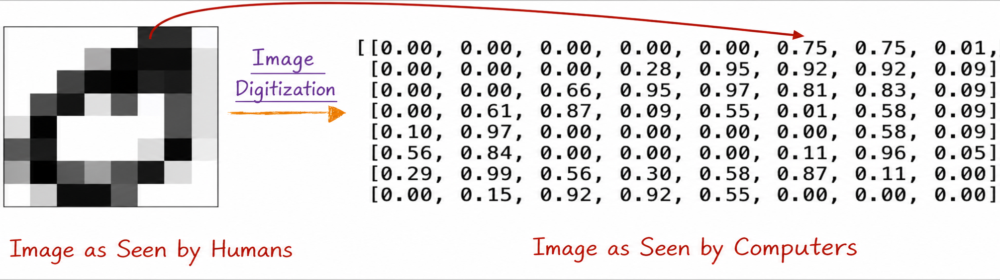
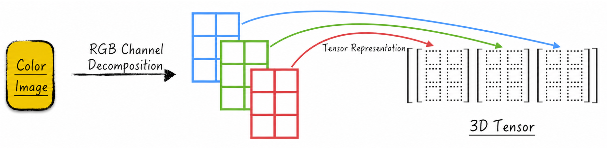
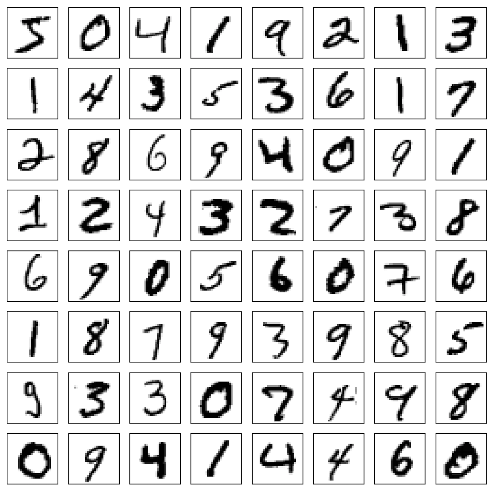
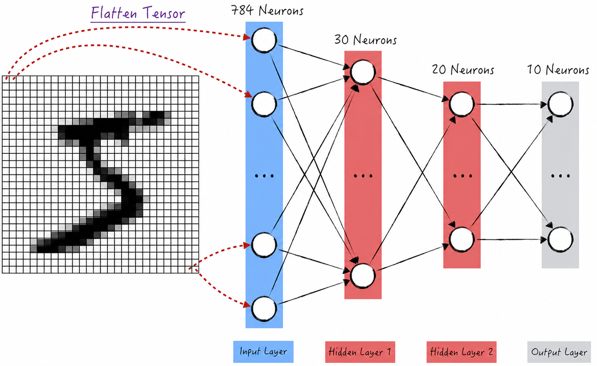
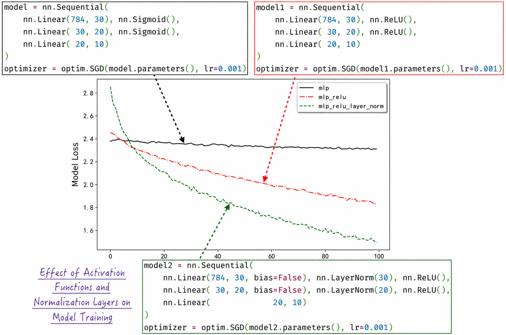
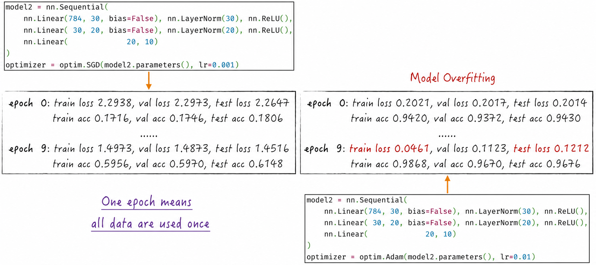
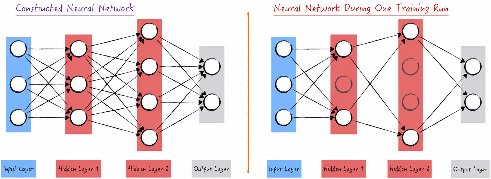
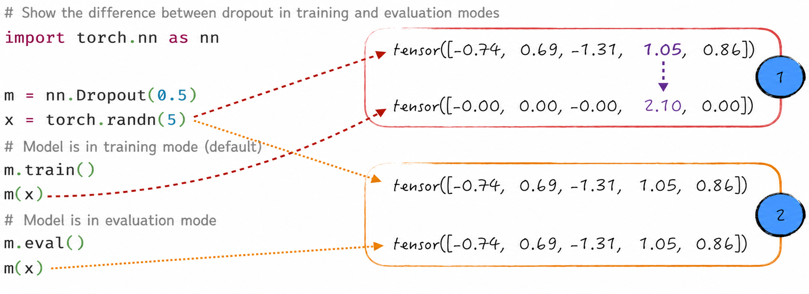
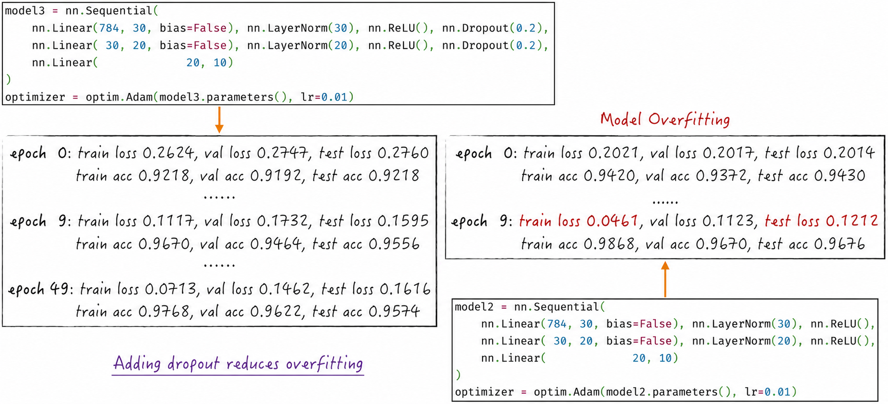

## 9.1 Recognizing Digits with a Multilayer Perceptron

[Chapter 8](/books/deconstructing_LLM/chapter-8) vividly demonstrated the key characteristics of multilayer perceptrons using two-dimensional synthetic data. We now turn to a scenario closer to the real world: using this basic neural-network model for image recognition. During training, we will progressively apply optimization techniques to accelerate training and improve model performance. These include the efficient optimization algorithms from [Chapter 6](/books/deconstructing_LLM/chapter-6), dropout from [Chapter 7](/books/deconstructing_LLM/chapter-7), and normalization layers and improved activation functions from [Chapter 8](/books/deconstructing_LLM/chapter-8). The example in this section will give readers a clearer understanding of how these techniques play important roles in practical problems.

### 9.1.1 Digitizing Visual Objects

In computing, an image is composed of individual pixels. More specifically, a black-and-white image can be divided horizontally into $n$ equal parts and vertically into $m$ equal parts, producing an $n \times m$ grid of small squares. The intensity of each square can be represented by a number between 0 and 1, where 0 is the lightest and 1 the darkest. From a computer's perspective, therefore, an image is essentially a matrix whose entries are real numbers between 0 and 1, as shown in Figure 9-1.



It is important to emphasize that this is only a preliminary digitization of a black-and-white image and cannot yet be called a feature representation of the image, for two main reasons.

1. The central task of feature extraction is to extract abstract feature representations from raw data that are relevant to the modeling objective. The relationship between an image's pixel representation and its content, however, is not intuitive. For example, the connection between concepts such as objects and boundaries in an image and the corresponding pixel values is not obvious.
2. For ease of presentation, the image here has been compressed so that only 64 pixels represent the entire image. In real life, ordinary images typically contain tens of millions of pixels[^9-1]—mainstream smartphone cameras, for example, commonly have resolutions measured in tens of megapixels. It is impractical for a model to learn directly from tens of millions of features.

Computers usually represent color with the RGB color model. This means that any color can be produced by combining red, green, and blue light. Given this basic concept and the preceding discussion of digitizing black-and-white images, it is easy to understand how color images are digitized. A color image can be represented by three matrices of the same shape, each describing the intensity of one primary color—red, green, or blue—as shown in Figure 9-2. Numerical matrices can thus precisely describe the content and color variations of an image[^9-2].



How are these three identically shaped matrices usually organized in neural networks? A matrix is fundamentally a two-dimensional tensor, so the three matrices are represented as a single three-dimensional tensor. The first dimension has length 3, corresponding to the three primary-color channels. The matrix formed by the second and third dimensions is the pixel representation for a particular color channel. This increase in dimensionality may seem abstract to humans because it converts our intuitive two-dimensional understanding of an image into a more abstract three-dimensional data structure. To a neural-network model, however, an image is simply a three-dimensional data structure; the model has no intuitive understanding of how its three dimensions are superimposed. We therefore need algorithms to guide the model so that it can interpret a three-dimensional tensor as a two-dimensional image. If the model were some kind of intelligent organism, we might say that it inhabits a world with one more dimension than ours.

To ensure consistency in data processing, even black-and-white images are represented with a similar three-dimensional tensor. In this case, the first dimension has length 1 because there is only one color channel. This uniform data structure simplifies image processing and allows the model to handle different types of images in the same way.

### 9.1.2 Constructing the Model

We will now build a multilayer perceptron to recognize images from the MNIST dataset[^9-3]. MNIST contains images of handwritten digits from 0 through 9, as shown in Figure 9-3, with 60,000 training images and 10,000 test images in total.



Unlike the images we encounter in everyday life, MNIST images have already been converted into numerical form to facilitate modeling. Each image contains 28 pixels horizontally and 28 pixels vertically. Because the images are black and white, every pixel is represented by a single value indicating its intensity. Before modeling, each image is therefore converted into a $1 \times 28 \times 28$ tensor[^9-4].

The architecture of a multilayer perceptron is fixed. The question now is how to adapt the model to image data. The key is to understand an essential principle of neural-network modeling—similarity in appearance—as discussed in [Section 8.2.4](/books/deconstructing_LLM/chapter-8/8-2#section-8-2-4).

More specifically, the input layer of a multilayer perceptron is a row of neurons, each corresponding to one variable. In appearance, therefore, the model input should be a $1 \times n$ tensor. To achieve this, the image-data tensor must be flattened into a $1 \times 784$ vector, and the model's input layer must correspondingly contain 784 neurons. Because the classification problem has 10 possible outcomes, the output layer contains 10 neurons. A Softmax transformer is also connected to the output layer to produce a predicted probability for each class. We have some freedom in designing the other layers. Here, we construct two hidden layers containing 30 and 20 neurons, respectively. The complete architecture is shown in Figure 9-4.



### 9.1.3 Code Implementation

In [Chapter 8](/books/deconstructing_LLM/chapter-8), we reimplemented a series of model components, including linear models and activation functions, following PyTorch's design principles so that we could understand the model's details more deeply. In keeping with engineering practice, beginning with this chapter our implementations will more closely resemble production code: we will construct the required neural-network models using components provided by PyTorch.

There are generally two ways to construct a multilayer perceptron, as shown in Listing 9-1. The more flexible approach, shown in Lines 6–18, is commonly used to construct complex neural networks. The other approach, shown in Lines 23–27, is shorter and more concise.

1. The first approach subclasses `nn.Module` and implements two important methods: `__init__` and `forward`. The first method defines the components required by the model, such as the linear models in a multilayer perceptron; any required activation functions, such as Sigmoid, can also be defined there. The `forward` method then implements the forward pass—that is, how the model input is transformed into the model output.
2. The second approach relies on PyTorch's `nn.Sequential`. We pass a series of model components to the initializer of `nn.Sequential`, which calls each component's `forward` method in sequence to obtain the final model output. This approach is suitable for simple models but becomes less flexible when handling complex models or calls that cross layer boundaries[^9-5].

#### Listing 9-1 Constructing a Multilayer Perceptron ([Complete Code](https://github.com/GenTang/regression2chatgpt/blob/en/ch09_cnn/mlp.ipynb))

```python
# Two common implementation approaches
import torch.nn as nn
import torch.nn.functional as F

## The more flexible approach
class MLP(nn.Module):

    def __init__(self):
        super().__init__()
        self.hidden1 = nn.Linear(784, 30)
        self.hidden2 = nn.Linear(30, 20)
        self.out = nn.Linear(20, 10)

    def forward(self, x):
        x = F.sigmoid(self.hidden1(x))
        x = F.sigmoid(self.hidden2(x))
        x = self.out(x)
        return x

model = MLP()

## The more concise approach
model = nn.Sequential(
    nn.Linear(784, 30), nn.Sigmoid(),
    nn.Linear(30, 20), nn.Sigmoid(),
    nn.Linear(20, 10)
)
```

When training a model with an optimization algorithm, each iteration requires a randomly selected batch of data. In earlier implementations, we generally wrote our own code to generate these batches. PyTorch provides a very convenient tool for this purpose: DataLoader. It divides data into batches of a specified `batch_size` for use during training, as shown in Listing 9-2. Lines 14–16 demonstrate how to retrieve the resulting batches in sequence. Each model input image is represented by a three-dimensional tensor with shape $1 \times 28 \times 28$. A batch of 500 such images therefore has tensor shape $500 \times 1 \times 28 \times 28$.

#### Listing 9-2 Preparing the Data ([Complete Code](https://github.com/GenTang/regression2chatgpt/blob/en/ch09_cnn/mlp.ipynb))

```python
from torchvision import datasets
from torch.utils.data import DataLoader, random_split

# Prepare the data
dataset = datasets.MNIST(...)
# Split the data into training, validation, and test sets
train_set, val_set = random_split(dataset, [50000, 10000])
test_set = datasets.MNIST(...)
# Construct the data loaders
train_loader = DataLoader(train_set, batch_size=500, shuffle=True)
val_loader = DataLoader(val_set, batch_size=500, shuffle=True)
test_loader = DataLoader(test_set, batch_size=500, shuffle=True)
# Retrieve one batch of data
x, y = next(iter(train_loader))
x.shape, y.shape
# torch.Size([500, 1, 28, 28]), torch.Size([500])
```

The model-training and evaluation code is similar to the code presented earlier and will not be repeated. During evaluation, however, be sure to switch the model's operating mode correctly. See [Section 9.1.4](/books/deconstructing_LLM/chapter-9/9-1#section-9-1-4) for a detailed explanation of this important point.

To clearly demonstrate how activation functions and normalization layers affect training, this section constructs three different models. Their training results are shown in Figure 9-5.



As discussed earlier, using the more efficient ReLU activation function and normalization layers can significantly accelerate model training.

Selecting a more efficient optimization algorithm can likewise accelerate training substantially. For example, Figure 9-6 compares the acceleration achieved by the Adam algorithm introduced in [Section 6.4.3](/books/deconstructing_LLM/chapter-6/6-4#section-6-4-3) with standard stochastic gradient descent. Adam produces a very substantial speedup without compromising model performance. Consequently, standard stochastic gradient descent is now rarely used to train models in production; more efficient optimization algorithms are generally preferred.

As the right-hand side of Figure 9-6 shows, however, accelerating model training commonly causes another problem: the model begins to overfit[^9-6]. Overfitting is common in neural networks, especially when no preventive measures are taken. We next examine in detail how to address it effectively.



### 9.1.4 Preventing Overfitting with Dropout

[Section 7.4.3](/books/deconstructing_LLM/chapter-7/7-4#section-7-4-3) examined the design principles and algorithm behind dropout. Dropout is a technique for constructing computational graphs: selected variables in the graph are randomly multiplied by 0 to produce new variables, which replace the original variables in subsequent computations. Because a neural network is itself a computational graph (see [Section 8.1.2](/books/deconstructing_LLM/chapter-8/8-1#section-8-1-2)), dropout naturally applies to neural networks as well. The only distinction is that although dropout can technically be applied to any variable in a computational graph, in a neural network it is usually applied only to neuron outputs; this is called neuron dropout.

Let us examine how dropout affects model training and how it is implemented. Its effects are easiest to understand through a diagram of the model.

1. First, we need to establish what neuron dropout corresponds to in the diagram. When a neuron is dropped, its value during the forward pass and its gradient during backpropagation both become 0. This is effectively equivalent to removing the neuron and its associated connections from the neural network[^9-7], as shown in Figure 9-7.
2. Second, dropout is applied during model training. In every training iteration, some neurons in the network are selected at random[^9-8] and dropped. Each iteration therefore relies on a different network architecture, created by randomly removing neurons from the original architecture—as noted in the first point, dropping is equivalent to removing. Performing backpropagation and parameter updates on this modified network architecture introduces substantial randomness, which helps address overfitting effectively.



One implementation detail requires particular attention: dropout behaves differently during model training and during evaluation or prediction. Batch normalization, discussed in [Section 8.5.4](/books/deconstructing_LLM/chapter-8/8-5#section-8-5-4), has a similar property. During training, dropout behaves as described above. During evaluation, however, it is disabled, as indicated by Label 2 in Figure 9-8.

Applying dropout in a neural network also involves another key detail: the algorithm increases the values of variables that are not dropped, as indicated by Label 1 in Figure 9-8. Because neurons are dropped with probability 0.5, the remaining variables are scaled to twice their original values—the reciprocal of 0.5. This design keeps the sum of each model layer's output values unchanged before and after dropout is applied. In practice, this detail has proved highly beneficial for model training.



Model performance often needs to be evaluated during training, which requires switching the model from training mode to evaluation mode. When implementing the corresponding performance-evaluation function, be sure to switch the model's operating mode at the appropriate points before and after evaluation, as shown in Lines 11 and 16 of Listing 9-3.

#### Listing 9-3 Switching the Model's Operating Mode ([Complete Code](https://github.com/GenTang/regression2chatgpt/blob/en/ch09_cnn/mlp.ipynb))

```python
@torch.no_grad()
def _loss(model, data_loader):
    """
    Compute model evaluation metrics on different datasets
    """
    ...

def estimate_loss(model):
    re = {}
    # Switch the model to evaluation mode
    model.eval()
    re['train'] = _loss(model, train_loader)
    re['val'] = _loss(model, val_loader)
    re['test'] = _loss(model, test_loader)
    # Switch the model to training mode
    model.train()
    return re
```

Introducing dropout alleviates the model's overfitting to some extent, as shown in Figure 9-9. As training continues, however, the model still begins to overfit after some time. Note that the performance metrics on the validation and test sets do not improve substantially after the tenth epoch. At this point, we can reasonably infer that the model has reached its performance limit. To improve it further, we must change the model architecture rather than merely continue training.



### 9.1.5 Preventing Overfitting with Penalty Terms

As with other models, we can suppress overfitting by introducing penalty terms into a neural network's loss function. In practice, penalty terms are usually combined with dropout to obtain better results. [Section 3.3.3](/books/deconstructing_LLM/chapter-3/3-3#section-3-3-3) discussed how L2 and L1 penalty terms are applied to linear models; their use in neural networks is similar. Let us briefly review the details.

- L2 penalty term. Suppose that the neural network's original loss function is $L$. Define a new loss function $\bar{L}$, as shown in Equation (9-1). Here, $\lambda$ is the weight of the penalty term and is a model hyperparameter. $\boldsymbol{W}$ denotes the model parameters in the neural network. Let $\boldsymbol{W}=(w_1,w_2,\cdots,w_N)$; then $\lVert\boldsymbol{W}\rVert_2^2=\sum_i w_i^2$.

$$
\bar{L}=L+\lambda\lVert\boldsymbol{W}\rVert_2^2 \tag{9-1}
$$

- L1 penalty term. As with the L2 penalty, add an L1 penalty term to the neural network's loss function. Using the same notation gives the new loss function in Equation (9-2), where $\lVert\boldsymbol{W}\rVert_1=\sum_i |w_i|$.

$$
\bar{L}=L+\lambda\lVert\boldsymbol{W}\rVert_1 \tag{9-2}
$$

Intuitively, both penalty terms suppress overfitting by bringing the model parameters closer to 0, just as in linear regression. Adding a penalty term prevents biases in the training data from causing the model to rely too heavily on certain variables, whose corresponding model parameters would have large absolute values.

The two penalty terms differ as follows. An L1 penalty tends to produce “sparse” model parameters, meaning that only a small number of parameters are nonzero. At a high level, this means that the neural network effectively uses only some of the variables and is therefore relatively resistant to noise—the weights of noisy variables are typically estimated as 0. An L2 penalty tends to produce parameter estimates that are close to, but not equal to, 0. At a high level, this means that the model uses nearly all variables, but each has a relatively small influence on the final result.

Each penalty has advantages and disadvantages, and the appropriate choice depends on the application. They can also be combined to form elastic net regularization. Its formula is given in Equation (9-3), where $l$ is a model hyperparameter in the range 0–1 and represents the weight of the L1 penalty. Methods such as grid search can be used to find the optimal hyperparameter values.

$$
\bar{L}=L+\lambda\left[l\lVert\boldsymbol{W}\rVert_1+(1-l)\lVert\boldsymbol{W}\rVert_2^2\right] \tag{9-3}
$$

Implementing these penalty terms in code is straightforward: for the most part, we can translate the equations directly. Listing 9-4 provides a simple example. Lines 11–14 correspond to Equation (9-3), with $\lambda l=\lambda(1-l)=0.001$.

#### Listing 9-4 A Simple Example of Adding Penalty Terms ([Complete Code](https://github.com/GenTang/regression2chatgpt/blob/en/ch09_cnn/mlp.ipynb))

```python
# Define the L1 and L2 penalty terms
def l1_loss(model, weight):
    w = torch.cat([p.view(-1) for p in model.parameters()])
    return weight * torch.abs(w).sum()

def l2_loss(model, weight):
    w = torch.cat([p.view(-1) for p in model.parameters()])
    return weight * torch.square(w).sum()

logits = model(inputs.view(B, -1))
loss = F.cross_entropy(logits, labels)
# Add the penalty terms
loss += l1_loss(model, 0.001)
loss += l2_loss(model, 0.001)
loss.backward()
...
```

In Listing 9-4, all model parameters are included in the penalty terms. In practice, however, we can selectively penalize only some parameters—for example, only the linear transformations in the network, or more specifically only their weights. This design keeps the weights close to 0 while allowing other parameters to vary relatively freely. In some literature, a penalty on weights is called a *kernel regularizer*, while a penalty on biases is called a *bias regularizer*.

In addition to penalizing model parameters, we can perform a similar operation on the output of a particular layer in the neural network. One purpose of penalizing parameters is to prevent neuron outputs from moving far from 0. As the neural network grows, however, cumulative effects can cause some neuron outputs to deviate from 0 even when the parameters remain close to 0. In this case, directly penalizing the outputs produces better results. The implementation is very similar to the one above: simply replace the model parameters in the penalty term with the output of a particular layer. In some literature, this method is called an *activity regularizer*.

[^9-1]: Large volumes of raw data are difficult to process, so the first modeling step is usually to compress images, videos, and similar data. The details are beyond the scope of this book; all data used in this chapter has already been compressed. The code for Figures 9-1 and 9-3 is available in the book's [companion code](https://github.com/GenTang/regression2chatgpt/blob/en/ch09_cnn/mnist.ipynb).
[^9-2]: Once we understand how images are digitized, the digitization of video is easy to explain. A video is essentially a continuous sequence of images. Classic films, for example, are usually presented at 24 frames per second—that is, 24 images are displayed each second. Digitizing video is therefore natural and intuitive.
[^9-3]: MNIST is one of the most commonly used datasets in neural-network research and is often used to evaluate different models.
[^9-4]: Although tensors conveniently represent high-dimensional data, all tensors are stored as one-dimensional arrays. High-dimensional information is actually managed through tensor metadata. More specifically, tensor metadata includes an attribute called `stride`, which tells the computer how far to step through the one-dimensional array to find the next element along the current dimension. For example, if `m = torch.randn(3, 4, 5)`, then `m.stride() = (20, 5, 1)`. This means stepping over 20 elements in the first dimension, 5 elements in the second, and no additional elements in the third—a step size of 1. There is therefore nothing mysterious about high-dimensional tensors: they are implemented by cleverly locating and organizing data in a one-dimensional array. Although changing a tensor's shape may seem complex to humans, it is almost effortless for a computer.
[^9-5]: One example is the residual connection discussed in [Section 9.3.1](/books/deconstructing_LLM/chapter-9/9-3#section-9-3-1).
[^9-6]: Standard stochastic gradient descent also leads to overfitting after sufficiently long training. Overfitting is independent of the optimization algorithm; an efficient algorithm merely causes it to appear sooner.
[^9-7]: In Figure 9-7, a connection between neurons represents multiplication—the product of a neuron's output and a weight. A connection originating at this neuron ceases to function because the gradient propagated back to its weight is now 0. For further details, see Figure 7-19. A connection terminating at the neuron likewise ceases to function, for the reason illustrated in Figure 7-18.
[^9-8]: The neurons to be dropped are selected independently and at random for each data point. This means that every data point uses a different network architecture.
