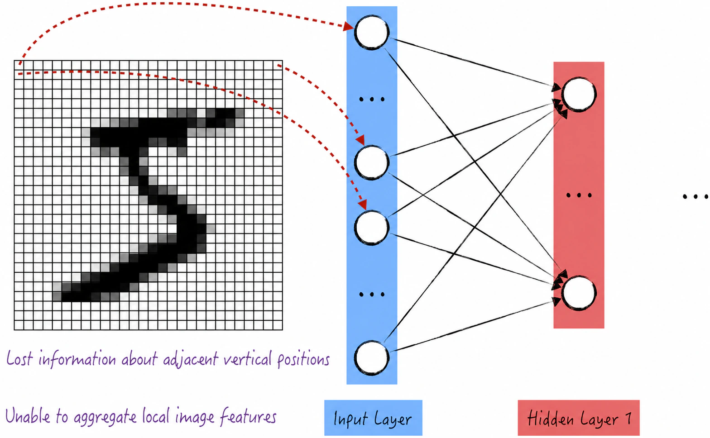
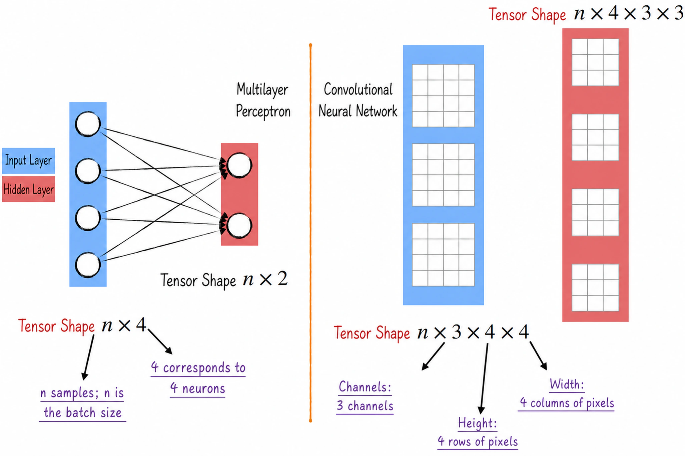
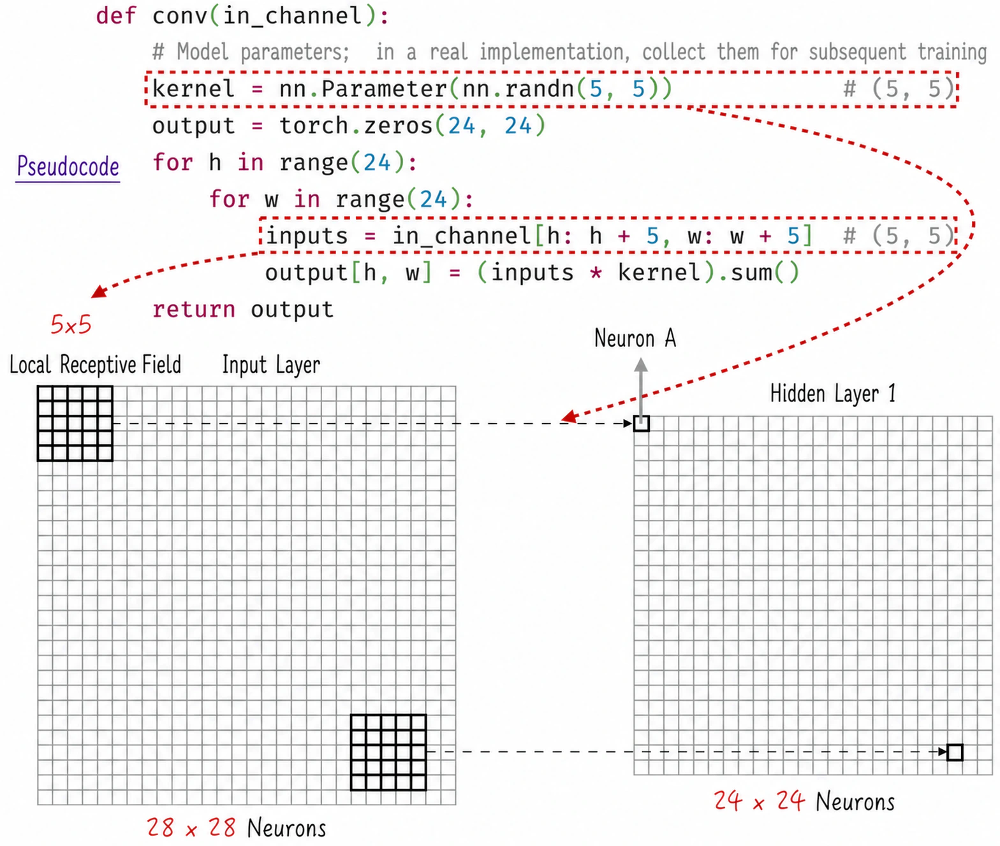
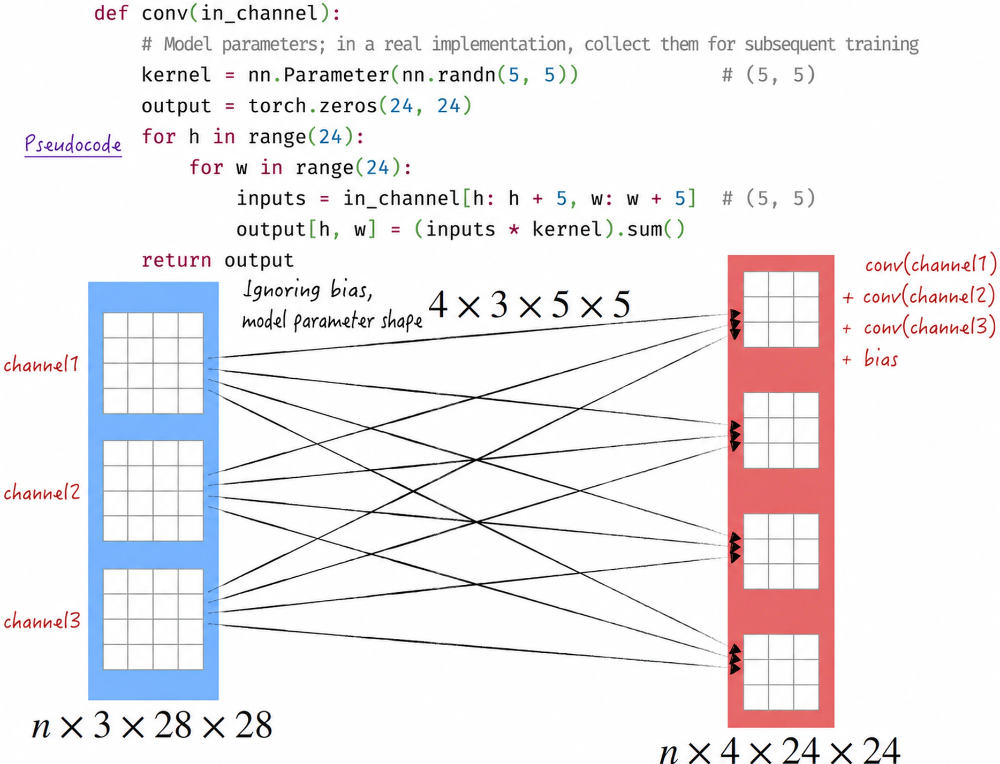
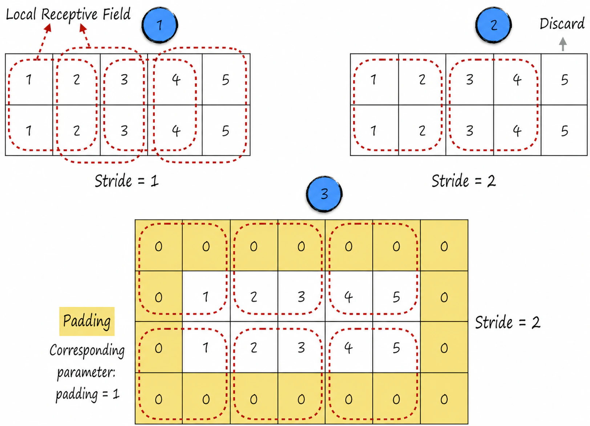
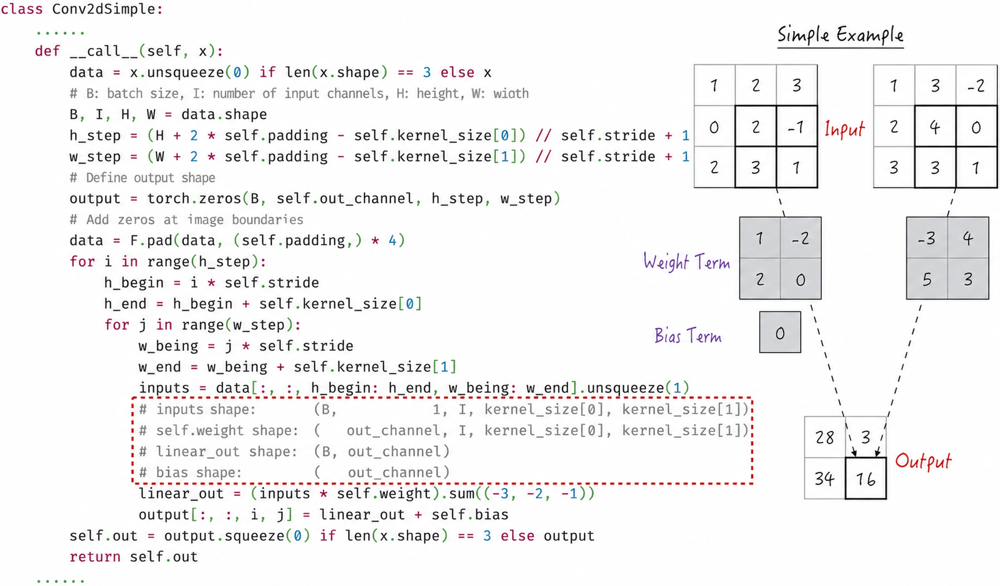
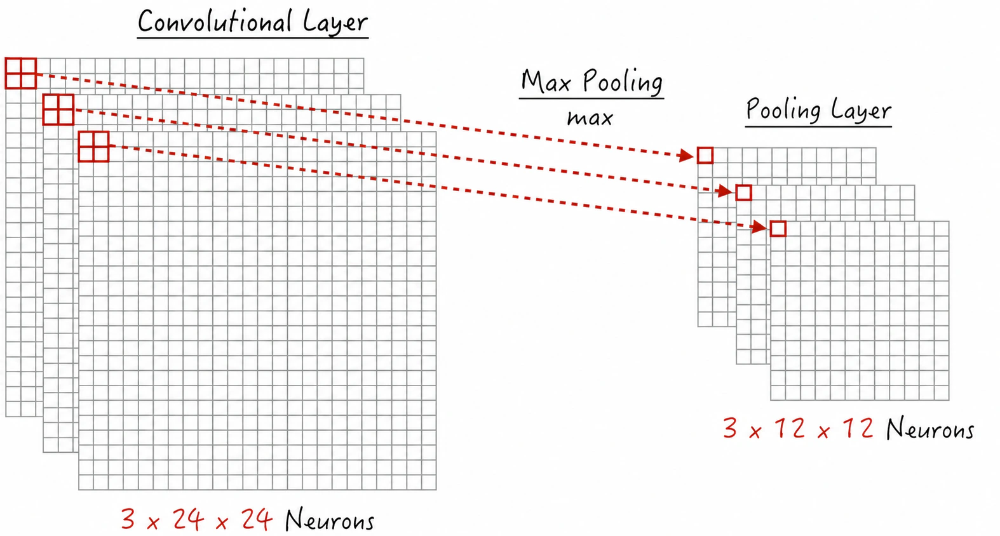
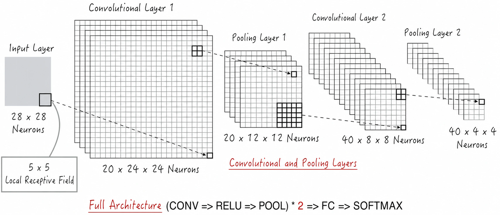
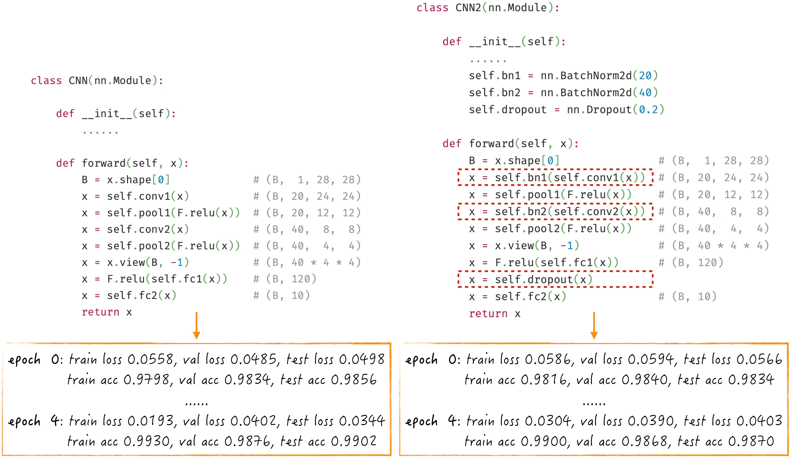
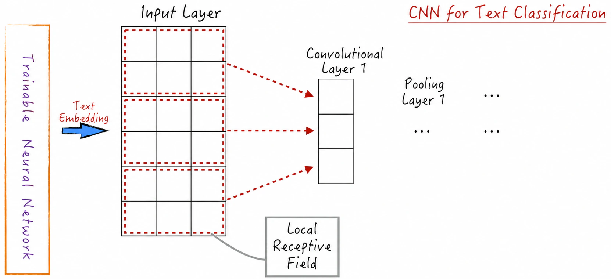

## 9.2 Convolutional Neural Networks

Although the multilayer perceptron performs reasonably well on image-classification tasks, with accuracy of approximately 95%, its image-recognition capabilities still fall short of human vision in handling spatial relationships, color information, and pixel aggregation.

First, when recognizing an image, humans attend not only to the color of each pixel but also to the spatial relationships among pixels. People usually pay particular attention to local information—the relationships among neighboring pixels—because pixels that are closer together tend to be more highly correlated. A fully connected neural network, however, does not explicitly account for pixel locations. As shown in Figure 9-10, the image tensor is flattened into a one-dimensional vector at the input layer to accommodate the one-dimensional arrangement of neurons. This operation discards information about vertically adjacent positions, making it difficult for the multilayer perceptron to capture this important information. Although information about horizontally adjacent positions is preserved to some extent, the model does not use it effectively.



Second, when the human eye processes a color image, it recognizes the image by superimposing pixel representations from multiple colors. If we continue using a multilayer perceptron for color images, we can only flatten the tensor for every color, concatenate the results into a large one-dimensional vector, and pass that vector to the model. This process loses not only spatial information but also color information, so model performance is bound to be less than ideal.

Finally, when recognizing an image, the human eye generally blurs local regions, effectively combining very close pixels into a single pixel for processing. This blurring can actually improve human image-recognition capabilities. The multilayer perceptron, however, has no corresponding design feature.

Convolutional neural networks were introduced to overcome these three shortcomings. We now examine this model in depth.

### 9.2.1 Organizing the Neurons

Neurons in a multilayer perceptron are organized into layers, and a convolutional neural network follows a similar principle. To process image data more effectively, however, convolutional neural networks arrange neurons within a layer in an entirely new way. Because image data is generally represented by one or three matrices, convolutional neural networks take inspiration from this structure: instead of placing neurons in a one-dimensional line, they arrange them as multiple two-dimensional grids, as shown on the right of Figure 9-11. Each small square represents a neuron, analogous to a circle in a multilayer-perceptron diagram.



This arrangement makes convolutional neural networks highly suitable for image data. If the input is a color image, for example, the input layer can be designed as three two-dimensional grids. This establishes an intuitive one-to-one correspondence between the input layer and the image data, allowing the data to be passed directly into the model without additional transformation.

The concept may be easier to understand in terms of its computer implementation. In a multilayer perceptron, neurons are organized in a line, and each layer produces a tensor of shape $n \times k$, where $n$ is the number of data points in a batch and $k$ is the number of neurons; see Figure 8-10 for details. In a convolutional neural network, neurons are organized as several two-dimensional grids, and each layer produces a four-dimensional tensor. The first dimension still represents the batch size. The second is commonly called the channel or output channel, while the third and fourth are called the height and width, respectively. Each layer in a convolutional neural network therefore produces a tensor of shape $n \times c \times h \times w$.

Of these four dimensions, the concept of a channel may be somewhat abstract. It is borrowed from the primary-color channels of a color image. In the input layer, channels correspond directly to primary-color channels. For a color image, for example, this dimension has length 3, representing the red, green, and blue channels. In a hidden layer, channels generally represent different local features. The meaning of this concept will become clearer as we examine the details of convolutional neural networks later in this section.

### 9.2.2 The Architecture of a Convolutional Layer

Careful readers may have noticed that [Section 9.2.1](/books/deconstructing_LLM/chapter-9/9-2#section-9-2-1) discussed the arrangement of neurons but not how neurons in different layers connect—that is, their computational relationships. This is the central topic of [Sections 9.2.2](/books/deconstructing_LLM/chapter-9/9-2#section-9-2-2) through [9.2.4](/books/deconstructing_LLM/chapter-9/9-2#section-9-2-4). Convolutional neural networks introduce two entirely new forms of connection: convolutional layers and pooling layers. These respectively simulate the human visual system's ability to capture local features and to blur information. We begin with the convolutional layer.

The complete operation of a convolutional layer involves multiple dimensions and can seem abstract. To make it easier to understand, we begin with a simple example that focuses on the input layer and first hidden layer and assumes that both layers have one channel, as shown in Figure 9-12. Two points are central to convolutional-layer processing.

1. Local receptive field[^9-9]: In a convolutional neural network, each hidden-layer neuron attends to only a local region of the input data, called its local receptive field. Unlike a neuron in a multilayer perceptron, the hidden-layer neuron does not connect to the entire input. Instead, it connects only to a small window, generally a $5 \times 5$ square. This design lets the neuron process only local information and therefore capture positional information and local image features more effectively.
2. Shared weights and bias: As in a multilayer perceptron, connections between neurons in a convolutional neural network can correspond to linear combinations. The relationship between a local receptive field and a neuron in Hidden Layer 1 can therefore be expressed by Equation (9-4), or by the code in Figure 9-12. Here, $o$ is the output of the neuron in Hidden Layer 1, $w_m$ is a weight, and $i_m$ is an entry in the local receptive field of the input data. Importantly, each channel in a convolutional neural network specializes in extracting one type of local feature. Different neurons in the same hidden layer—and the same channel—therefore share the same model parameters. In Figure 9-12, for example, they use the same 25 weights, temporarily disregarding the intercept. This is known as parameter sharing.

$$
o=\sum_m w_m i_m \tag{9-4}
$$



By sliding the local receptive field across the input layer, we can progressively compute the output of every neuron in Hidden Layer 1[^9-10]. In Figure 9-12, the receptive field moves with a stride of 1, producing a $24 \times 24$ matrix of neuron outputs. This design lets neurons independently process different local regions of the input data and collectively construct a feature representation of the entire input. It not only gives the model the ability to capture local features but also greatly reduces the number of model parameters. In this example, a fully connected multilayer perceptron would require $567 \times (784+1)=445095$ model parameters. The convolutional neural network needs only 25 parameters to deliver better performance. This drastic reduction in parameters is an important reason for the success of convolutional neural networks.

The preceding discussion assumed that the input and hidden layers each had only one channel. How do we handle multiple channels?

- Each hidden-layer channel can represent only one type of local feature. To extract multiple local features, simply add more channels, each using the same procedure but different model parameters.
- If the input layer has multiple channels, as in a color image, apply the same procedure to every input channel and then add the channel-wise results. In the real world, colors from different channels must be superimposed to form the final image, and summing the model's results simulates this process. The handling of multiple input channels can also be extended to connections between hidden layers to simulate the superposition of different local features. An intercept can be added after summing the results if needed. Each output channel has only one intercept, regardless of whether there is one input channel or several; like the weights, this intercept is shared.

In summary, the complete convolutional-layer architecture is shown in Figure 9-13. We can regard channels as “neurons” and mappings from local receptive fields as “neural connections.” From this perspective, the convolutional layer strongly resembles the multilayer perceptron discussed earlier: both are “fully connected” structures. This design effectively captures different local features in an image and is a key component of convolutional neural networks.



### 9.2.3 Convolutional-Layer Details and Code Implementation

Having examined the architecture of convolutional layers in depth, we now discuss two important details of the convolution operation and how to implement them in code. A convolution operation progressively computes neuron outputs by sliding a local receptive field. Two key issues must be considered during this process[^9-11]: the stride and the handling of boundary values.

In the example from [Section 9.2.2](/books/deconstructing_LLM/chapter-9/9-2#section-9-2-2), the local receptive field used a stride of 1. The stride can in fact be adjusted, as shown in Figure 9-14. In theory it can be any integer, but in practice it generally does not exceed the side length of the local receptive field, lest some image information be skipped. The stride determines the size of the output feature map: a larger stride produces a smaller output, while a smaller stride produces a larger one.



When the stride in a convolution operation is greater than 1, a boundary problem can arise and some information may be lost because the data at the boundary is insufficient to form a complete local receptive field, as indicated by Label 2 in Figure 9-14. Padding solves this problem by adding extra values—usually zeros—around the input data to extend its dimensions, as indicated by Label 3 in Figure 9-14[^9-12]. This better supports the convolutional-layer computations and ensures that boundary information is not lost.

We can now implement a simple convolutional layer. The core code is shown in Figure 9-15 ([Complete Code](https://github.com/GenTang/regression2chatgpt/blob/en/ch09_cnn/conv_example.ipynb)). From a coding perspective, a convolutional layer is not difficult to implement. The main operation is sliding the local receptive field, implemented here with nested loops; note that this is not the optimal implementation. Reimplementing the convolutional layer serves two purposes. First, writing the code helps readers understand the technical details and gain insight into how neural-network components operate, removing some of their mystery. Second, it highlights a critical step in implementing neural networks: checking the shapes of tensors involved in an operation, as indicated by the dashed box in Figure 9-15. This step is essential not only when reimplementing a convolutional layer, but also when developing other neural-network components.



### 9.2.4 Pooling Layers

Having discussed how convolutional layers extract local image features, we now examine how a neural network can simulate the human eye's blurring of an image. Suppose four points A, B, C, and D in an image form a square. From a distance, we perceive them as a single point. To “translate” this process into mathematics, if we use one value—such as the maximum of the four pixel values—to represent the four pixels, we have effectively merged them into one blurred point and simulated the eye's blurring operation. Even setting aside the biological inspiration and considering the operation purely as image-data processing, it compresses the image by representing it with fewer pixels. Such compression reduces computational complexity, extracts key information while preserving the image's principal features, and effectively improves model efficiency and performance.

Applying this idea to a convolutional neural network gives us the pooling layer, whose essential characteristics are as follows.

1. A pooling layer operates somewhat like a convolutional layer. It likewise performs an operation on a local region of the input data, called the pooling window, which is analogous to the local receptive field described earlier.
2. Like a convolutional layer, a pooling layer can use a stride to control how the pooling window moves across the input. The stride determines the size of the output feature map, as illustrated in Figure 9-16.
3. Unlike convolution, pooling is not a linear combination. There are two principal pooling methods: max pooling and average pooling. They select the maximum or mean value within a local region, respectively, and use that value to represent the region. A pooling layer therefore has no model parameters. Max pooling is generally used to emphasize prominent input features, whereas average pooling smooths the input and reduces noise.

Convolutional neural networks generally alternate multiple convolutional and pooling layers, progressively reducing the spatial dimensions and extracting more abstract feature representations. Pooling layers help the network compress input data and become more resistant to interference, allowing the model to process image data more effectively.



### 9.2.5 Complete Architecture and Implementation

Although convolutional and pooling layers cleverly simulate two properties of human vision, they cannot by themselves meet the requirements of image recognition because their output structure does not satisfy the requirements of a classification problem. In an MNIST digit-recognition task, for example, the neural network's final layer must be flattened and contain 10 neurons to classify the digits, whereas convolutional and pooling layers do not have this flattened structure.

The usual solution is to add a multilayer perceptron after the final pooling layer, producing the output structure required for classification. Because the neurons in a multilayer perceptron are fully connected, this part of the network is also called the fully connected layer.

Combining these elements, a complete convolutional neural network consists of three main parts: convolutional layers (CONV in Figure 9-17), pooling layers (POOL), and fully connected layers (FC). The architecture is shown in Figure 9-17. Note that a pooling layer outputs a four-dimensional tensor, whereas a fully connected layer takes a two-dimensional tensor whose first dimension is the batch size. When connecting these two layers, the pooling-layer output must therefore be flattened, just as image data is flattened before being passed into a multilayer perceptron. From an architectural perspective, this design treats the final pooling layer as the input layer of the multilayer perceptron. In other words, the convolutional and pooling layers primarily improve the input data by extracting more effective image features.

The implementation is not complicated. As Listing 9-5 shows, we need only translate the architecture in Figure 9-17 into code. Two details require particular attention.

1. The parameters must be set correctly when constructing the network components, as shown in Lines 5–10. This is one of the more difficult parts of the implementation. The preceding discussion can be used to compute these parameters theoretically. In practice, a more common approach is to isolate each component and test it with randomly generated input to see whether its output tensor has the expected shape. For example, use `self.conv1(torch.randn(1, 1, 28, 28))` to inspect the first convolutional layer. Once its output shape is confirmed, the result provides a more intuitive basis for setting the parameters of the next component.
2. When connecting these components to perform the computation, continually verify that the input and output tensor shapes are as expected, as shown in Lines 13–18. As emphasized repeatedly, tensor shapes always require close attention when implementing neural networks.



#### Listing 9-5 A Convolutional Neural Network ([Complete Code](https://github.com/GenTang/regression2chatgpt/blob/en/ch09_cnn/cnn.ipynb))

```python
class CNN(nn.Module):

    def __init__(self):
        super().__init__()
        self.conv1 = nn.Conv2d(1, 20, (5, 5))
        self.pool1 = nn.MaxPool2d(2, 2)
        self.conv2 = nn.Conv2d(20, 40, (5, 5))
        self.pool2 = nn.MaxPool2d(2, 2)
        self.fc1 = nn.Linear(40 * 4 * 4, 120)
        self.fc2 = nn.Linear(120, 10)

    def forward(self, x):
        B = x.shape[0]                              # (B, 1, 28, 28)
        x = self.pool1(F.relu(self.conv1(x)))       # (B, 20, 12, 12)
        x = self.pool2(F.relu(self.conv2(x)))       # (B, 40, 4, 4)
        x = x.view(B, -1)                           # (B, 40 * 4 * 4)
        x = F.relu(self.fc1(x))                     # (B, 120)
        x = self.fc2(x)                             # (B, 10)
        return x
```

Training this model produces excellent classification results, as shown on the left of Figure 9-18, with accuracy approaching 99%[^9-14]. Of course, the architecture above is not the only option. Optimization techniques such as normalization layers and dropout have not yet been included, but adding them is straightforward, as shown on the right of Figure 9-18. Their inclusion still produces similar results, however, making their advantages difficult to observe here.



### 9.2.6 Beyond Image Recognition

Convolutional neural networks perform exceptionally well at image classification. From the model's perspective, however, the material it learns from is not an image as such, but a three-dimensional tensor. This means that the model can potentially learn to classify any object that can be digitized as a three-dimensional tensor. Many objects besides images can be converted into this form; text is a typical example. We will briefly introduce how convolutional neural networks can be used for text classification.

In text classification, suppose that each text is represented by a $k$-dimensional vector, a process called text embedding. Readers need not examine the details of embeddings here[^9-15]; it is enough to know that mature methods are available to perform this step. On the basis of text embeddings, text can be digitized as a three-dimensional tensor, as shown in Figure 9-19.

The example in Figure 9-19 uses the following assumptions and parameter choices.

- Only one type of text embedding is used, so the first dimension—the channel—has length 1.
- The maximum text length is 6. Longer texts are truncated, while shorter texts are padded with a default character to maintain a length of 6. The second dimension—the height—therefore has length 6.
- Each word can be represented by a three-dimensional vector, so the third dimension—the width—has length 3.



We can then construct a convolutional neural network for text classification just as we would for an image. Note that the width of the local receptive field must equal the length of the embedding vector. Because convolutional neural networks capture local features effectively, they can learn meaningful segments of text, such as words or phrases, and thereby achieve good classification performance.

[^9-9]: The receptive field is a biological concept. According to Wikipedia, the receptive field of a sensory neuron is the region in which a stimulus can elicit a response from that neuron. Convolutional neural networks draw on and implement this property.
[^9-10]: In simple terms, for two integrable functions $f$ and $g$, their convolution is defined as $h(x)=\int f(t)g(x-t)\mathrm{d}t$. If the domain of $f(t)$ is a square, computing their convolution resembles the movement of the local receptive field across the image in Figure 9-12. This is the origin of the term *convolutional layer*.
[^9-11]: This chapter discusses the operation of a standard convolutional layer in detail. Convolutional neural networks also include many other convolution variants, such as dilated convolutions and transposed convolutions. Space limitations prevent this book from examining these variants in depth; interested readers can consult other sources to learn more about their principles and applications. These variants play important roles in different scenarios and extend the range of applications for convolutional neural networks.
[^9-12]: Readers may encounter two important concepts in other literature: valid padding and same padding. Valid padding means that no padding is applied to the input. The goal of same padding is to add an appropriate number of padding elements so that the convolutional layer's output has the same shape as its input.
[^9-14]: The performance of convolutional neural networks goes well beyond this result. Experiments have in fact demonstrated accuracy as high as an astonishing 99.77%. Image-deformation techniques can also expand the training data and further improve model performance. These widely used image-recognition techniques include operations such as rotating and translating images. Their details are beyond the scope of this book; interested readers can consult other sources to learn more.
[^9-15]: The technical details of text embeddings are discussed in [Section 10.2.2](/books/deconstructing_LLM/chapter-10/10-2#section-10-2-2).
