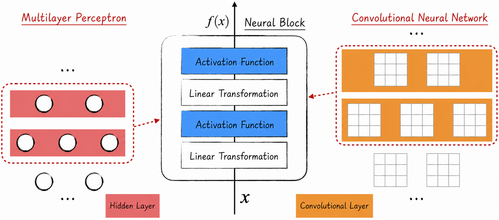
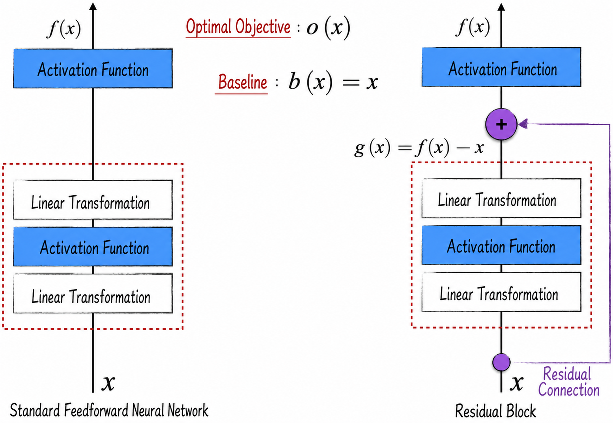
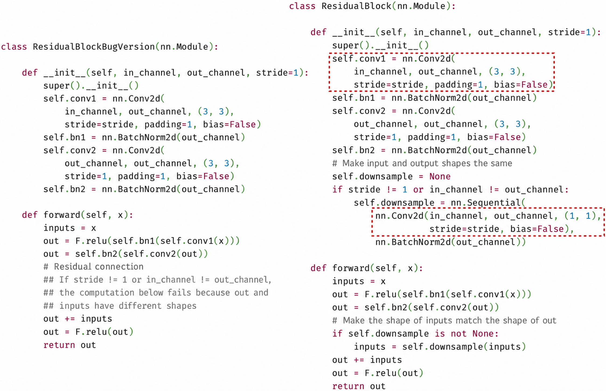
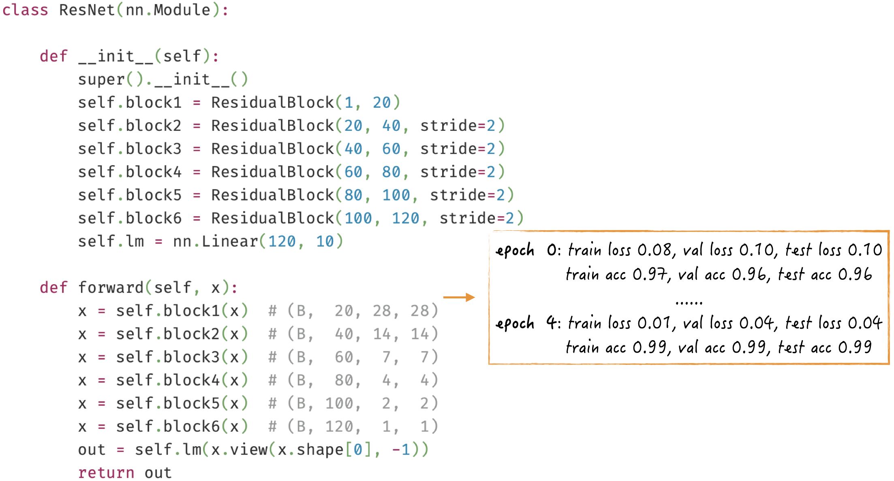

## 9.3 Residual Networks

As Figure 9-17 in [Section 9.2](/books/deconstructing_LLM/chapter-9/9-2) shows, a classic convolutional neural network combines convolutional and pooling layers. Such a network usually has only a small number of convolutional layers—typically two. The convolutional layers extract local features, while the pooling layers compress the image data. Convolutional neural networks demonstrated the potential of deep learning: increasing a network's depth can significantly improve model performance. Would increasing the depth even further produce still better results?

Intuitively, the answer should be yes. If a neural network contains multiple convolutional layers with similar structures, then a shallower network is effectively a subset of a deeper one. In production, however, increasing network depth does not always improve model performance and may instead degrade it. One of the most important reasons is that the vanishing or exploding gradient problem becomes increasingly severe as the network grows deeper (see [Section 8.4.4](/books/deconstructing_LLM/chapter-8/8-4#section-8-4-4) for details).

Optimization techniques are needed to address gradient instability. [Section 8.4.5](/books/deconstructing_LLM/chapter-8/8-4#section-8-4-5) adopted more efficient activation functions, while [Section 8.5.4](/books/deconstructing_LLM/chapter-8/8-5#section-8-5-4) introduced normalization layers. [Section 9.3.1](/books/deconstructing_LLM/chapter-9/9-3#section-9-3-1) examines another widely used technique in depth: the residual connection. These three techniques can significantly improve the training efficiency of deep neural networks. They have become foundational optimization tools for deep learning and are widely used in practice. After discussing residual connections in detail, we will demonstrate how to use these three key techniques to construct the classic residual network (ResNet).

### 9.3.1 Residual Connections

As discussed earlier, both multilayer perceptrons and convolutional neural networks organize their neurons in layers. Neurons in each layer connect only to neurons in adjacent layers; there are no cross-layer connections. To illustrate this point more clearly, we use a different diagram to enlarge part of the network[^9-16], as shown in Figure 9-20.



In Figure 9-20, two adjacent layers are combined into a neural block. Within the block, we no longer focus on the precise arrangement of neurons. Instead, the diagram represents the computational steps through which the data passes—the layer-by-layer composition of linear transformations and activation functions. This representation makes residual connections easier to understand. Although residual connections impose no special requirements on the input and output shapes of a neural block or on its activation functions, the following discussion uses ReLU by default and assumes that the block's input and output have the same shape; that is, $f(x)$ and $x$ have the same shape.

The right-hand side of Figure 9-21 presents a more intuitive and precise illustration of a residual connection. A residual connection allows neurons to establish connections across multiple layers. Figure 9-21 shows a residual connection spanning only two layers, the form most commonly used in practice. In theory, a residual connection can span any number of layers.



Why do residual connections improve learning efficiency and ultimately model performance? There are two key reasons. First, residual connections help overcome gradient instability. Second, after residual connections are introduced, the model's initial state is closer to its final target, making training smoother and the desired performance easier to attain.

1. Gradients play a vital role in neural-network learning. In backpropagation, gradients travel layer by layer in the reverse direction through the network. As noted in [Section 8.4.4](/books/deconstructing_LLM/chapter-8/8-4#section-8-4-4), a gradient may shrink or grow—usually shrink—each time it passes through a layer. In a standard layered neural network, as the number of layers increases, it becomes difficult for the parameter gradients in all layers to remain appropriately scaled at the same time. In general, gradients in the earlier layers become too small relative to those in the later layers, reducing the training efficiency of the entire model. Graphically, a residual connection can be viewed as a special “express lane” that lets gradients reach earlier layers after passing through fewer neurons. This mechanism keeps the gradients in earlier layers at more suitable magnitudes, greatly improving their learning efficiency.
2. Mathematically, the neural block in Figure 9-21 can be viewed as a function with input $x$ and output $f(x)$. The training objective is to continually improve $f(x)$ so that it approaches the optimal target $o(x)$, with model loss minimized when $f(x)=o(x)$. In addition to this optimal target, there is a baseline against which to assess how well $f(x)$ has learned: $b(x)=x$. When $f(x)$ reaches this baseline—that is, when $f(x)=x$—the entire neural network is equivalent to removing two layers and degenerates into a shallower network. In other words, the model's loss should then equal that of the shallower network.

In practice, however, increasing network depth does not always improve model performance and can sometimes degrade it. This indicates that reaching the baseline is very difficult in a standard layered neural network. Reaching it requires both linear transformations inside the dashed box on the left of Figure 9-21 to be identity transformations, which means that their model parameters must form identity matrices. At initialization, however, the parameters of a linear transformation are generated randomly around 0, far from an identity matrix and therefore difficult to reach.

With a residual connection, reaching the baseline target becomes very easy. As shown on the right of Figure 9-21, the model need only make $g(x)$, represented by the dashed box, equal to 0[^9-17]. This corresponds to setting the parameters of both linear transformations inside the dashed box to 0, a state close to initialization and thus relatively easy to attain.

After a residual connection is introduced, the learning target of $g(x)$ in the dashed box becomes $o(x)-x$. Without the residual connection, as shown on the left of Figure 9-21, the learning target of the dashed box is approximately $o(x)$. The expression $o(x)-x$ resembles a residual in mathematics, so it is called a residual mapping in the academic literature; this is also the origin of the term *residual connection*. For convenience in discussion and implementation, a neural block with a residual connection is called a residual block.

### 9.3.2 Implementation Essentials and Tips

Let us now see how to implement residual connections in code. The key is to ensure that the two tensors being connected have the same shape; otherwise, the operation cannot be performed. The simplest way to accomplish this is to ensure that the residual block's input and output have the same shape. In Figure 9-21, for example, $g(x)$ and $x$ must have the same shape.

For a multilayer perceptron, meeting this requirement is relatively straightforward: the simplest method is to give every layer the same number of neurons. For convolutional layers, however, the parameters must be selected carefully so that the input and output shapes match. Listing 9-6 demonstrates two commonly used convolutional-layer parameter settings.

#### Listing 9-6 Examples of Convolutional-Layer Parameter Settings ([Complete Code](https://github.com/GenTang/regression2chatgpt/blob/en/ch09_cnn/res_nets.ipynb))

```python
# This convolution has the same input and output shapes
conv3 = nn.Conv2d(3, 3, (3, 3), stride=1, padding=1)
x = torch.randn(1, 3, 28, 28)
print(x.size(), conv3(x).size())
# torch.Size([1, 3, 28, 28]) torch.Size([1, 3, 28, 28])

# These two convolutions have the same output shape
stride = torch.randint(0, 10, (1,))
conv1 = nn.Conv2d(3, 4, (3, 3), stride=stride, padding=1)
conv2 = nn.Conv2d(3, 4, (1, 1), stride=stride, padding=0)
x = torch.randn(1, 3, 28, 28)
print(stride, conv1(x).size(), conv2(x).size())
# tensor([6]) torch.Size([1, 4, 5, 5]) torch.Size([1, 4, 5, 5])
```

On this basis, we can implement a residual block containing two convolutional layers, as shown on the left of Figure 9-22 ([Complete Code](https://github.com/GenTang/regression2chatgpt/blob/en/ch09_cnn/res_nets.ipynb)).



Requiring the input and output shapes to be exactly the same can restrict the applications of residual connections. In image recognition, for example, we want to increase the number of hidden-layer channels while reducing their height and width as we move through the network, just as in a standard convolutional neural network. The implementation above does not support this requirement: attempting to increase the number of channels causes the code on the left of Figure 9-22 to fail. This basic implementation can be improved by first applying a linear transformation to the input whenever its shape differs from the output shape, and then forming the residual connection, as shown on the right of Figure 9-22. The essence of this improvement is that the two convolutional layers inside the dashed box produce outputs of the same shape; Lines 7–13 of Listing 9-5 provide a concrete example. This improvement makes residual connections more flexible and able to accommodate different network architectures.

### 9.3.3 Code Implementation

As Figure 9-22 shows, the residual-block implementation skillfully combines three techniques: normalization layers, the ReLU activation function, and residual connections. This makes residual blocks highly efficient to train; stacking many of them does not reduce their learning efficiency. On this foundation, we can construct the classic residual network[^9-19], as shown in Figure 9-23.



[^9-16]: Unlike the standard convolutional neural network introduced in [Section 9.2](/books/deconstructing_LLM/chapter-9/9-2), the convolutional neural network discussed in this section contains only convolutional layers, resembling the architecture of a classic residual network.
[^9-17]: Except at the input layer, $x$ represents the output of an activation function and is therefore greater than or equal to 0. For nonnegative inputs, ReLU acts as the identity transformation.
[^9-19]: The residual network in this implementation differs slightly from the architecture in the classic paper. This book uses a simpler network design that nevertheless emphasizes the core structure. The complete code is available in the book's [companion code](https://github.com/GenTang/regression2chatgpt/blob/en/ch09_cnn/res_nets.ipynb).
