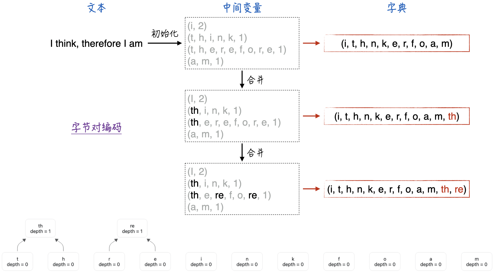
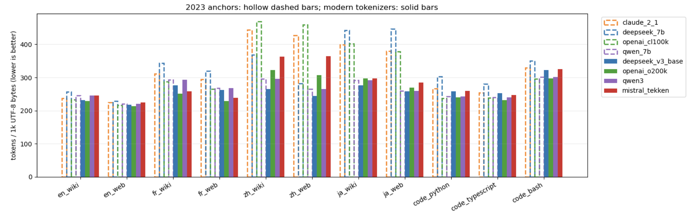
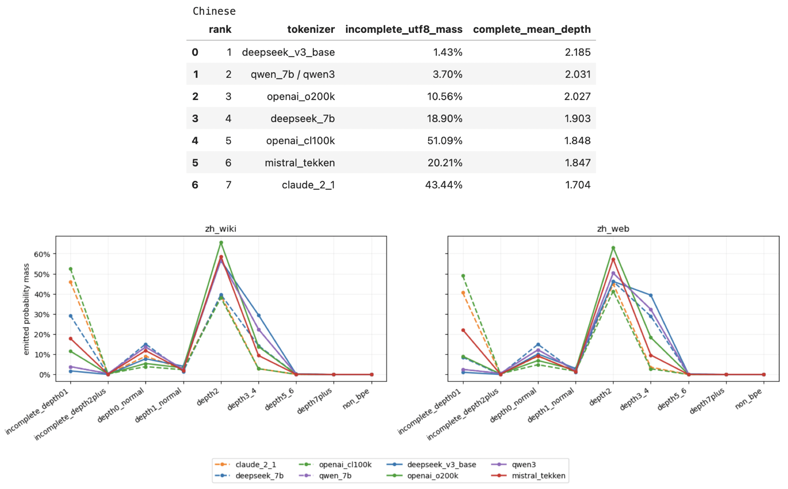
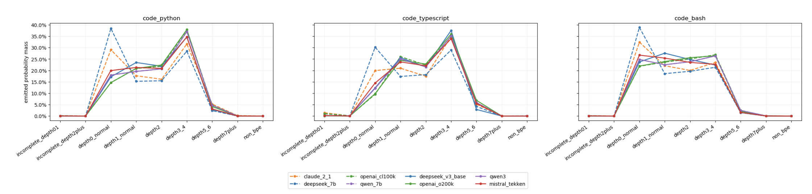

# 被低估的LLM基础组件——重新审视分词器

> **本文要点 / TL;DR**
>
> **问题**：不训练语言模型，能否仅从分词结果识别字符内部的字节碎片和过度fallback等结构缺陷？
>
> **方法**：将token的UTF-8完整性与BPE合并树深度结合，使用`incomplete UTF-8 mass`、完整性感知的depth分布和`complete mean depth`，统一测试五家分词器在四种自然语言和三种编程语言上的表现。
>
> **结论**：BPE结构指标能发现压缩率和Rényi efficiency遗漏的碎片化问题；实验还显示，新一代分词器显著改善了CJK覆盖，但分词效率不能直接预测模型能力。
>
> **配套资源：**[完整Notebook（代码、数据处理与实验结果）](https://github.com/GenTang/GenTang.github.io/blob/main/content/zh/blog/tokenization/code/compare_tokenizer_generations.ipynb)

## 什么是分词器（Tokenizer）

虽然在使用者看来，大语言模型（LLM）似乎只是简单的“输入文本、输出文本”，但这背后是一套精密的工程组件在协同工作。从模型底层的角度来看，我们输入的文本首先会经过分词器（Tokenizer）处理，被切分成一个个词元（Token），并转化为对应的数值ID（代表该词元在词表中的位置）。而模型的每一次输出，本质上都是在预测词表中的词元在下一个位置出现的概率。

换言之，分词器输出的词元是模型理解与表达世界的“基本原子”，极大地影响着模型的输出质量。举个极端但直观的例子：假设模型的词表中仅有`我想、想要、你`这三个词元，那么模型可以说出`你想要`，但无论如何也说不出`我想要`。

再看一个更具体的案例：在GPT-4时代，模型常常无法正确判断“9.11和9.8谁更大”。这并非因为模型的逻辑能力不足，而是因为分词器将数字切分成了不规则的碎片：将9.11切分为 `9` + `.` + `11`，而将 9.8 切分为 `9` + `.` + `8`。这导致模型因为11大于8而误认为9.11大于9.8。因此，分词器看似不起眼，却是一个能深刻影响模型表现的核心组件。

即便抛开模型效果不谈，从经济角度来看，当前大模型主流的收费模式正是按词元数量计费。分词效率的高低（即一段文本会被切分成多少个token）直接决定了调用成本。由此可见，分词器也是一个与我们钱包息息相关的关键要素。

### BPE的树形结构

在分词器这个领域，BPE（字节对编码，Byte Pair Encoding）是目前最主流的方案。其核心思想是基于贪心策略，通过迭代合并最高频的字符对，从而寻找数据压缩率最优的分词映射方案。具体算法细节如图1所示：

从图中例子的树形结构可以看出，位于最底层的词元（Token）并不承载实际语义，其主要功能是提供基础覆盖（兜底机制）。这种设计能够保证模型在面对罕见词或全新词汇时，可将其向下拆解为基础词元，从而有效规避 OOV（Out-of-Vocabulary，未登录词）异常。

应当指出，上述图例仅为概念简化。在工业界真实的底层算法（如 BBPE）中，基础词汇表并非由单纯的字母构成，而是由一个字节（Byte）所能映射的 256 种状态组成。这意味着除了常规的字母与数字外，底层词表中还充斥着大量不可读的乱码或字节片段。从语言学视角来看，这类底层符号本身不承载任何语义含义；它们的引入，本质上是计算机二进制存储体系给自然语言处理带来的一类系统性偏差。

## 需要信仰

如果从第一性原理出发，我们对大语言模型的终极期望其实非常纯粹：希望它能够拥有类似人类的智能，出色地胜任各类复杂任务。然而，现实世界的复杂性决定了我们极难设计出一个统一且可量化的“智能指标”，并以此直接作为训练模型的优化目标。

因此，我们只能退而求其次。结合Decoder-Only架构，将“预测下一个词元的交叉熵损失（Cross-Entropy Loss）”设定为一个中间态的代理目标。事实上，并没有严密的理论推导或确凿的实验证据能够绝对保证：交叉熵损失越低，模型就必然在下游各种复杂任务中表现越好。但我们选择相信这条路径——或者说，以OpenAI为代表的先驱在研发ChatGPT时，正是怀揣着这种“因相信而看见”的信念，才一路坚持了下来。如今，随着大模型的巨大成功，越来越多的从业者也建立起了这种信念。

类似的“信仰”也同样体现在分词器的设计上。

一方面，我们同样缺乏充分的理论依据或绝对的实证数据来证明“一个更好的分词器必然会提升模型能力的上限”，但大家依然保持着这样的共识与信仰。另一方面，虽然我们对“什么是好的分词器”有一些直观且模糊的认知--比如对多语言的表达要兼顾公平、词元切分要恰如其分地符合语义、以及对同一语言下的不同语料做到无偏覆盖--但迄今为止，行业内依然缺乏一个能够全面、综合衡量分词器优劣的标尺，只能依赖若干维度的经验性指标来进行侧面评估。

## 常用的评价指标

目前，业界尚未找到单一指标能够全面判定分词器的优劣。因此，本文将结合**压缩率**、**频率分布**和 **BPE树形结构**三个维度进行综合评估。

| 维度 | 指标名称 | 目的与释义 |
| --- | --- | --- |
| **压缩率** | `tokens_per_1000_bytes` | 衡量处理固定大小（1000 Bytes）文本所需的 Token 数量。该值越低，说明序列被压缩得越短，模型的计算与调用成本通常也越低。 |
| **频率分布** | `shannon_model_efficiency` | 基于香农熵（Shannon Entropy）衡量 Token 频率分布的整体均匀程度，并按词表大小进行归一化。值越高表示词表利用越充分、分布越分散，但这不绝对等同于模型效果更好。 |
| **频率分布** | `renyi_model_efficiency` | 相比于香农熵，基于瑞利熵（Rényi Entropy）的指标更关注高频 Token（头部），用于诊断概率分布是否过度集中。它是一个纯分布诊断指标，并非完整的质量评分。 |
| **BPE 结构** | `incomplete_utf8_mass` | 统计自身字节序列无法独立解码为完整 UTF-8 字符的 Token 占比。数值越高，说明分词边界频繁落在多字节字符内部，模型越依赖字节级兜底（Byte-level fallback）。 |
| **BPE 结构** | `completeness-aware depth distribution` | 结合 UTF-8 完整性感知的深度分布。先区分 Token 在 UTF-8 层面是否完整，再将其按 BPE 合并深度划分为 `depth=0, 1, 2, 3–4, 5–6, 7+`。它描绘了输出 Token 在合并树中的来源层级，深度高低本身不直接代表好坏。 |
| **BPE 结构** | `complete_mean_depth` | 仅在 UTF-8 完整的 BPE Token 中，按输出频次加权计算的平均深度。用于衡量“成功成词”的部分平均利用了多深的合并结构。 |

压缩率和频率分布相关指标已经有较多研究。本文重点关注的是将UTF-8完整性与BPE树深度结合起来：正常的字母、数字和标点即使位于`depth=0`也不属于异常；更明确的信号，是位于浅层且不能独立构成UTF-8字符的词元。

上述指标均为无需训练模型即可直接计算的内在指标。它们能有效揭示分词器在压缩效率、词表覆盖率和底层结构上的缺陷，但尚不能完全替代下游任务的评测，也无法绝对证明某款分词器必然会带来模型能力的跃升。

### BPE结构相关指标的深层意义

引入BPE结构相关的指标，主要基于以下两方面的考量：

1. **是否破坏了表音语言的语义连续性**：对于拉丁字母语言而言，如果分词后的大量词元都位于树的极浅层，往往意味着分词粒度过细（例如完整的单词被过度拆解为字母组合），这在一定程度上破坏了文本原有的语义完整性。
2. **是否导致CJK语言产生无意义碎片**：对于CJK（中日韩）等表意文字，问题则更为严峻。以中文为例，通常一个汉字需要3个字节的UTF-8编码来表示。如果分词器频繁输出浅层且不完整的词元，实际上是在输出毫无意义的“字节碎片”。这些碎片的危害是全方位的：
	* **缺失语义**：碎片本身不具备任何语言学意义。
	* **推高成本**：显著拉长了分词后的序列长度，大幅增加了模型推理与计算的开销。
	* **增加难度**：迫使模型花费额外的注意力机制去强行拼合这些碎片，增加了预测下一个词的难度。

因此，后续的分析将重点考察BPE结构相关的指标。正如我们在后续实验中将看到的，在其他常规指标大体一致的情况下，这两个维度的指标能够真正地“丈量”出分词器的优劣，从而为进一步优化分词器提供坚实的依据。

## 实验与结果

为了全面评估分词器的表现，我们从“语言种类”和“语料来源”两个维度构建了8组测试数据（4种语言 × 2种来源）。

在语言种类上，我们选取了英语、法语、中文和日语四种代表性语言。其中，英语和法语采用拉丁字母体系（表音文字），而中文和日文则以表意文字（CJK）为主。通过跨语系的横向对比，我们能够揭示同一分词器对不同底层文字体系的偏好；而通过同语系内部的对比，则能进一步观察分词器在相似语言结构下的细微表现差异。

在语料来源上，我们将数据严格划分为网页文本（Web）和维基百科（Wiki）两类。通常而言，网页语料更偏向于口语化的日常用语，数据质量相对参差不齐（中下游质量）；而百科语料则代表了结构化、更偏学术的高质量书面表达。这一维度的对比，旨在检验分词器面对不同质量与文体风格时的鲁棒性。

此外，考虑到代码理解与生成在大模型应用中的重要性，我们还额外引入了Python、TypeScript(TS)和Bash三种主流编程语言的测试语料，专门用于考察分词器在代码场景下的分词精度与压缩效率。

### 所用的分词器

本文选择了DeepSeek不同代际的分词器，并加入Claude、OpenAI、Qwen和Mistral作为外部参照。虽然这些分词器的文件格式和实现方式不同，但都属于以byte为基础的BPE，可以还原出可比较的merge树结构。

需要特别说明的是，Anthropic目前并未公开最新Claude模型的完整分词器，因此本文只能使用2023年与Claude 2.1同期公开的版本作为参照。后文实验表明，这一早期分词器在多语言压缩和CJK字节fallback等方面存在明显不足；但这些结果不能直接外推到当前的Claude模型，其最新分词器是否以及如何改进，目前尚无足够的公开信息可供判断。

| 分词器 | 普通文本词表 | 定位与说明 |
|---|---:|---|
| Claude 2.1 | 64,995 | 使用Anthropic公开的tokenizer文件，作为2023年的同期参照。 |
| DeepSeek 7B / V2-Lite | 100,000 | DeepSeek早期的100K词表。两者的普通文本词表、预分词规则和输出结果相同。 |
| OpenAI `cl100k_base` | 100,256 | GPT-4和GPT-4 Turbo时期使用的tokenizer，作为2023年的OpenAI参照。 |
| Qwen-7B / Qwen3 | 151,643 | Qwen的大词表byte-level BPE。两代的普通token及其ID完全相同，主要变化发生在special token和消息协议。 |
| DeepSeek V3-Base / V3.2 / V4-Flash-Base | 127,997 | DeepSeek更新后的约128K词表。三者的普通文本分词完全相同，后续版本主要扩展special token。 |
| OpenAI `o200k_base` | 199,998 | GPT-4o之后使用的约200K词表，代表OpenAI较新的分词方案。 |
| Mistral Tekken | 130,072 | Mistral Nemo使用的多语言及代码tokenizer，作为现代大词表方案的外部参照。 |

表中的“普通文本词表”只统计实际参与BPE编码的token，不包括special token、控制token和模型为计算效率预留的embedding位置。

接下来从两个角度分析实验结果。

第一个是纵向比较：观察同一系列的分词器如何随时间变化，以及这些变化主要改善了哪些语言和领域。

第二个是横向比较：在相同测试语料上，对比不同分词器的压缩率、UTF-8 fallback、BPE深度和频率分布。这里的“更好”仅指内在分词指标更好，不能直接等同于模型能力更强。

### 代际变化：CJK进步最明显

从2023年至今，分词器的演进并不均匀。真正具有明确代际变化的主要是DeepSeek和OpenAI；Qwen-7B与Qwen3的普通BPE词表完全相同，而DeepSeek V3.2和V4-Flash也继续沿用V3的普通文本词表。

DeepSeek的变化最为明显。DeepSeek 7B在中文Web上的压缩率为每1000 bytes产生282个token，在中文Wikipedia上则上升到369个；到了DeepSeek V3，中文Web和Wikipedia的压缩率分别下降到244和265个token，如图2所示。

如图3所示，DeepSeek 7B的incomplete UTF-8 mass分别为8.55%和29.24%。这说明它虽然已经针对中文进行了优化，但对不同类型中文语料的覆盖并不均衡，Wikipedia中的大量字符仍会退回到字节碎片。而对于DeepSeek V3，相应的incomplete UTF-8 mass也下降到1.08%和1.78%。Wiki/Web之间的差距明显缩小，完整token的平均depth也有所上升，说明更多中文字符和词语能够通过较完整的BPE合并表示。

日文上的进步更加显著：DeepSeek 7B平均需要445 tokens/1000 bytes，incomplete mass达到45.4%；V3分别改善到267和3.1%。因此，DeepSeek这次词表更新的主要方向并不只是一般性的压缩，而是大幅补充了CJK字符和词语的覆盖，减少字符内部的byte fallback。

OpenAI也表现出类似趋势。从`cl100k_base`升级到`o200k_base`后：

- 中文压缩率平均从464下降到315 tokens/1000 bytes，incomplete mass从51.1%下降到10.6%；
- 日文压缩率从390下降到284，incomplete mass从34.8%下降到6.0%；
- 英文压缩率只改善约1%～2%。

这说明`o200k_base`扩大的词表容量主要被用于改善非英语文本，而不是继续大幅优化已经较成熟的英文分词。

### 横向比较：现代分词器仍有明显语言偏好

横向来看，英文依然是各分词器处理得最成熟的语言：压缩率普遍较低，incomplete UTF-8 mass也几乎为零。法文的token数量普遍高于英文，但很少出现字符内部的fallback，主要差异来自单词和词缀的合并效率。

现代分词器在不同语言上的优势并不相同：

- 英文和法文的压缩率以`o200k_base`最好；
- Mistral Tekken在法文上表现突出，但仍略逊于`o200k_base`；
- DeepSeek V3在中文和日文上综合表现最好；
- Qwen位居CJK语言的前列，但Qwen-7B到Qwen3并没有更新普通BPE词表；
- Claude 2.1和`cl100k_base`在中文、日文上仍大量依赖byte fallback。

以图4为例，各个分词器在中文上面的分词效果

DeepSeek V3不仅产生的token最少，而且字符内部碎片最少、完整token的平均depth更高。这几个指标指向了相同方向：它对中文的有效覆盖更加充分。

各个分词器在法语上面的效果如图5所示

实验也能看到公司目标市场和训练数据选择留下的痕迹，例如DeepSeek和Qwen在中文上较强、Mistral Tekken在法文上较强。

### Rényi没有失效，但不能单独评价分词质量

Claude 2.1在中文上的Rényi efficiency约为0.470，高于DeepSeek V3的0.449。然而，Claude平均需要436 tokens/1000 bytes，incomplete UTF-8 mass高达43.44%；DeepSeek V3对应的数值分别只有254和1.43%。

`cl100k_base`的现象更加明显：它拥有本组最高的中文Rényi efficiency之一，但同时也是中文压缩率和UTF-8完整性最差的分词器之一。

这并不是Rényi指标计算错误，而是它只回答了一个更窄的问题：token的使用概率是否均匀。大量字节碎片同样可以形成均匀的频率分布，因此较高的Rényi efficiency并不意味着token具有更完整的语言结构。

> Rényi efficiency可以诊断频率分布是否过度集中，但不能判断这些token本身是否合理。

它必须与压缩率、incomplete UTF-8 mass和depth结构（比如上面用的complete mean depth）结合使用。

### 代码：分词效率与模型能力并不完全一致

在三种编程语言上，OpenAI和Qwen的压缩率整体领先，DeepSeek V3、Mistral Tekken和Claude 2.1处于相近区间，而DeepSeek 7B明显落后。

| 分词器 | Python | TypeScript | Bash | 三种语言平均 |
|---|---:|---:|---:|---:|
| OpenAI o200k | 239 | 232 | 298 | 256 |
| OpenAI cl100k | 238 | 238 | 295 | 257 |
| Qwen | 243 | 239 | 301 | 261 |
| Mistral Tekken | 259 | 247 | 325 | 277 |
| DeepSeek V3 | 258 | 253 | 323 | 278 |
| Claude 2.1 | 266 | 254 | 330 | 283 |
| DeepSeek 7B | 303 | 281 | 350 | 311 |

表中数值均为tokens/1000 bytes，越低表示同样大小的代码产生的token越少。

DeepSeek的代际进步则非常明确。V3相对7B：

- Python的token数量下降14.8%；
- TypeScript下降9.9%；
- Bash下降7.8%；
- TypeScript的incomplete UTF-8 mass也从1.06%下降到0.13%。

更新后的DeepSeek V3已经与Claude 2.1处于同一水平。

另一个共同现象是，所有分词器在Bash上的压缩率都明显差于Python和TypeScript。Bash包含大量短命令、参数、路径、环境变量和密集符号组合，对自然语言和常规代码为主训练的BPE并不友好。因此，Bash并非DeepSeek独有的弱项，而是现有通用分词器普遍覆盖不足的领域。

### 可以如何继续改进

对于DeepSeek，下一步更值得关注的是代码语料；对于Qwen，虽然它在2023年的时候处于较为领先的地位，但现在相对来说，有点落后了。

除了汇总指标，高频token本身也暴露了语料质量问题。在中文Web测试集中，`赌`、`澳门`、`赌博`、`真人`和`彩票`等token异常活跃：在DeepSeek V3的输出中，`赌`、`澳门`和`赌博`的频率排名分别达到132、222和507；而在中文Wikipedia中，它们的排名分别下降到11480、9397和28394。Qwen等其他分词器也呈现出类似的主题聚集。

单个词语本身并不能证明语料低质，例如“澳门”和“彩票”也可能出现在正常文本中；但大量赌博相关词语同时进入高频区，说明当前中文Web语料中很可能混入了较多博彩广告、SEO页面或垃圾内容。如果类似内容在tokenizer训练语料中占比过高，BPE就可能为博彩、广告和模板化文本分配过多merge和词表容量，挤压其他语言、专业领域和代码token的空间。因此，改进分词器不应只是扩大词表，还应首先改善训练数据的组成和质量。

更合理的方向包括：

1. 加强语料清洗和抽样检查，过滤博彩广告、SEO垃圾页、重复模板、乱码和异常格式；
2. 在固定词表规模下，平衡不同语言、领域和编程语言的语料比例，避免某一类高重复内容主导BPE merge；
3. 对比Wiki/Web的高频token及其rank变化，识别异常主题簇，而不只观察汇总指标；
4. 找出高频fallback片段，将词表容量重新分配给覆盖不足的语言或领域；
5. 分析低emitted但高internal usage的脚手架token，区分真正浪费容量的token和仍被大量上层token依赖的中间节点；
6. 用压缩率、UTF-8完整性和depth筛选候选方案，再通过小型语言模型或下游任务验证，选出最好的分词器。
