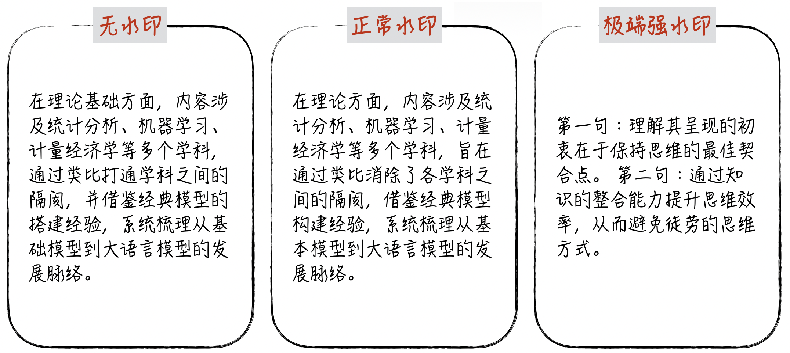
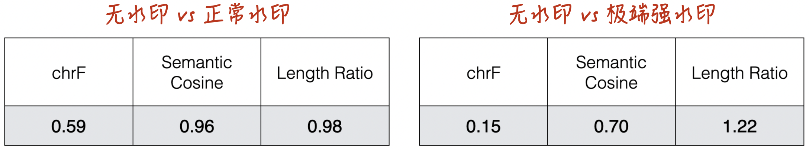
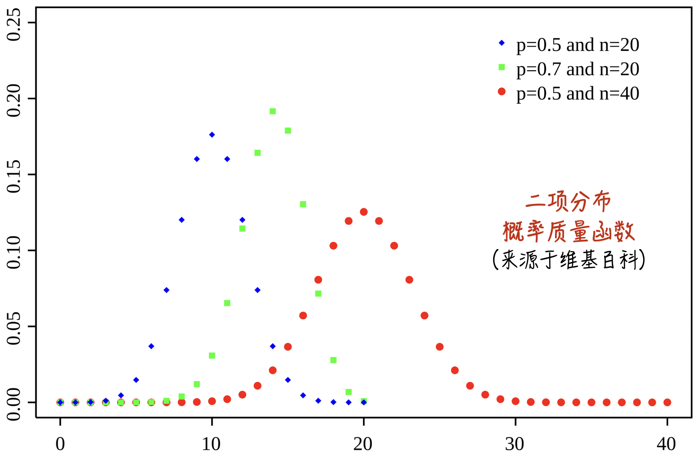
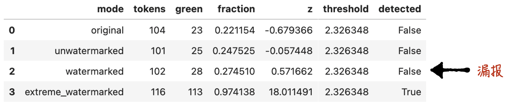
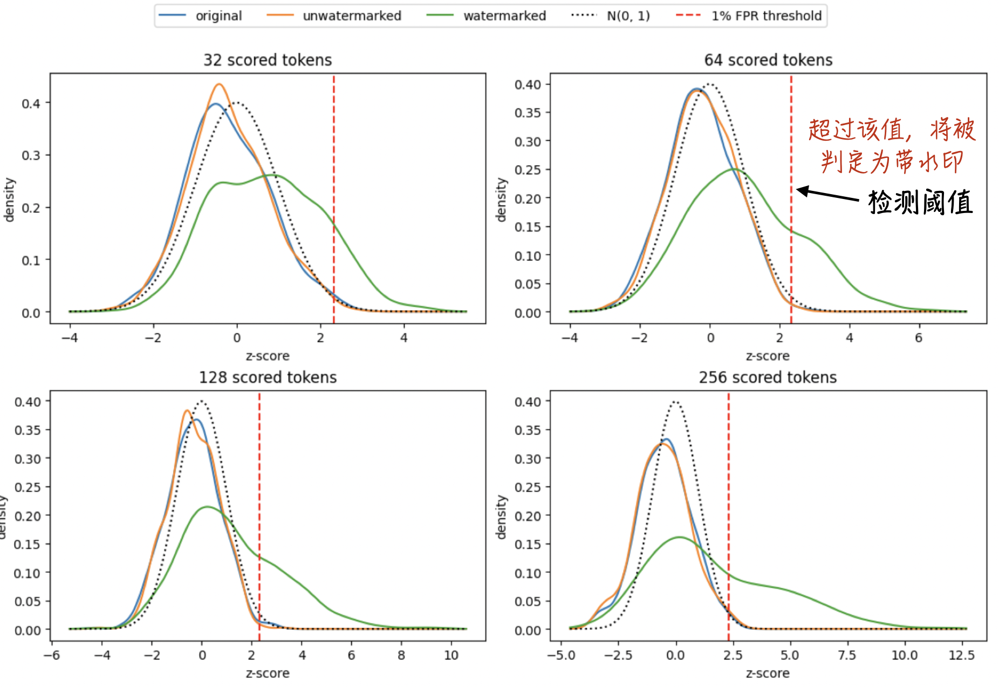
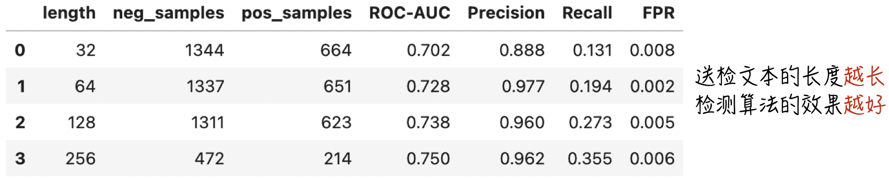

# Anthropic要在文本中加水印，这是如何做到的呢？

> **本文要点 / TL;DR**
>
> **问题**：KGW如何在不明显破坏语义的情况下嵌入水印，又为什么能用z-score检测它？
> 
> **方法**：从零实现KGW，并在DeepSeek模型上比较无水印、正常水印与极端水印文本。
> 
> **结论**：正常强度的水印对语义影响有限；文本越长，水印信号越充分，检测的效果越好。
>
> 配套资源：[完整 Notebook（代码、数据与实验结果）](https://github.com/GenTang/GenTang.github.io/blob/main/content/zh/blog/watermarking_on_aigc/code/kgw_from_scratch.ipynb)

## 缘起：Anthropic引入文本水印

近日，为响应欧盟的监管要求，Anthropic宣布将在旗下AI模型的输出中引入隐形文本水印。此举旨在不影响用户阅读体验的前提下，为AI生成内容（AIGC）提供可靠的溯源与检测手段。

数字水印技术在图像、音频和视频等领域早已屡见不鲜。以图像为例，现代隐形水印的核心原理是在海量像素中植入人眼无法分辨的微弱信号。这种机制之所以可行，主要依赖于两个前提：

1. 图像的像素点足够密集且微小，单个像素的扰动处于人类视觉的感知盲区。
2. 检测程序却可以检测到这些改动，从而识别出水印信号。

然而，文本数据有着本质的不同。语言文字是高度离散的符号系统，人类会精确地阅读并理解每一个字词。因此，将图像水印的思路“生搬硬套”到文本上是行不通的。尽管如此，早期的文本水印依然借鉴了图像处理的逻辑，例如在字里行间插入“零宽字符”来隐藏信息。这种方式虽然简单，但极其脆弱——只要对文本进行基础的格式清洗，或复制到不保留特殊字符的纯文本环境中，水印就会轻易失效，因为它并没有真正融入文本深层的语言结构中。

为了解决这一痛点，现代文本水印技术开始深入大语言模型（LLM）生成的底层逻辑：直接在词元（Token）生成的概率分布上做文章。这类方法会在模型预测下一个词时隐蔽地干预其采样过程，使生成的内容在选词造句上，稍微偏向预先通过算法设定好的一组特定词汇（学术上通常称为“绿名单”，Green List）。这种策略既不会破坏文本的原意和连贯性，又极大地提升了水印防破解和抗篡改的能力。

尽管Anthropic尚未公开其水印的具体技术细节，但业界普遍推测，其大概率采用了上述基于生成概率的方法（也有传闻称，其技术路线类似于Google DeepMind研发的SynthID-Text）。在这类概率文本水印中，有两种堪称经典的标志性算法：

1. **KGW算法**（基于绿名单划分的经典算法）
2. **Google DeepMind SynthID-Text**

本文将首先拆解KGW算法的技术细节；在下一篇博客中，我们将继续探讨SynthID-Text。

## KGW算法细节

在深入探讨 KGW 算法的底层逻辑之前，我们先通过一个直观的例子来建立感性认识（如图1所示）：

1. **无损的阅读体验**：对比无水印的原文，适度添加水印后的文本在语义表达和阅读流畅度上几乎没有差异，仅仅是在部分词汇的选择上发生了微妙的变化。
2. **过度水印的副作用**：当然，就像图像水印如果浓度过高会破坏画质一样，如果文本水印的强度过大（如最右侧文本所示），就会导致语句生硬，严重影响人类的阅读体验。



除了肉眼的直观评判，在大规模实验或工业级应用中，我们需要借助客观的量化指标来衡量水印对文本质量的影响。具体而言，我们通常会考察以下几个维度：

- **chrF（字符级相似度）**：通过比较两段文本的字符n-gram重合程度衡量字面相似性，越接近1表示用词和表达越相似。
- **Semantic Cosine（语义相似度）**：计算两段文本语义向量的余弦相似度，越接近1表示整体含义越接近。
- **Length Ratio（生成长度比）**：计算候选文本与参考文本的token 数量之比，越接近1表示两者长度越接近。

对于上文的直观案例，相应的量化指标如图2所示。数据显示，适度添加水印的文本与无水印文本在核心语义上保持了高度一致（语义相似度Semantic Cosine极度逼近于1），尽管两者在具体的字词选择与表面形态上存在显著差异（字符级指标chrF得分明显偏离1）。这一客观的量化结果，完美印证了我们此前“语义无损但用词微调”的直观阅读感受。



### 算法细节与代码实现

为了更好地理解 KGW 算法，我们先简单回顾一下大语言模型（LLM）生成文本的基础流程：

1. LLM拥有一个固定的词表。每一次生成操作，本质上都是从词表中挑选出一个词元（token），并将其拼接在现有上下文（context）的末尾。

2. 模型会根据当前的context，为词表中的每一个候选词元计算出一个分数（logits）。分数越大，代表该词元在当前语境下被选中的概率越高。

在此基础上，KGW算法的核心干预逻辑其实非常简洁：

1. **名单划分**：在模型计算完初始的logits之后，KGW会基于前置背景（计算前置背景的哈希值，然后将其作为伪随机种子），将整个词表随机分为两部分：**绿名单（Green List）** 和 **红名单（Red List）**。
2. **概率干预**：对划分到“绿名单”中的词元统一增加一个偏置常数，从而在不破坏整体语法结构的前提下，人为地拔高模型选择绿名单词元的概率。

具体实现可以参考下方的代码片段。其核心逻辑完美对应了上述的两个步骤，主要集中在两处代码上：

* 第 `8 - 10` 行：根据伪随机种子生成绿名单。
* 第 `24 - 27` 行：为绿名单中词元的scores（logits）增加偏置值。

#### 程序清单1（[完整 Notebook](https://github.com/GenTang/GenTang.github.io/blob/main/content/zh/blog/watermarking_on_aigc/code/kgw_from_scratch.ipynb)）

```python
class KGWLogitsProcessor(LogitsProcessor):
    """在模型logits上施加KGW绿名单偏置"""
    ...

    def greenlist(self, previous_token: int) -> torch.LongTensor:
        """根据前一个token和密钥，确定性地返回绿名单token IDs"""
        # 相同的previous_token和key必须在嵌入端与检测端产生完全相同的排列。
        seed = (self.key * previous_token) % (2**64 - 1)
        generator = torch.Generator(device=self.device).manual_seed(seed)
        return torch.randperm(self.vocab_size, generator=generator, device=self.device)[:self.green_size]


    def __call__(
        self,
        input_ids: torch.LongTensor,
        scores: torch.FloatTensor,
    ) -> torch.FloatTensor:
        """复制`scores`，并给每个batch样本对应的绿名单logits加上`delta`。"""
        # input_ids的形状是  (B,  L)
        # scores的形状是     (B, vs)
        # B是批次大小，L是序列长度，vs是词表大小
        # clone避免原地修改其他logits processor可能还要使用的输入。
        scores = scores.clone()
        for row in range(input_ids.shape[0]):
            previous_token = int(input_ids[row, -1])
            green_ids = self.greenlist(previous_token)
            scores[row, green_ids] += self.delta
        return scores
```

### 检测原理

探讨水印的检测原理，就不可避免地要涉及一些统计学概念。其中最核心的数学工具就是假设检验中的关键指标：[P-value](/books/deconstructing_LLM/chapter-2/2-2#section-2-2-5)。

简单来说，假设检验的基本逻辑是：在自然状态下，数据应当聚集分布在期望值附近，出现极端偏差的概率极低（可以脑补为一个钟形的正态分布）。因此，当极端值出现时，我们就可以认定数据处于“非自然”状态（即被注入了水印）。

具体到 KGW 算法中：由于每一步生成绿名单的过程都是随机的，如果一段文本**没有**添加水印，那么它包含的每一个词元（token）落在“绿名单”内的概率应当是独立且固定的（假设绿名单的划分比例为 25%）。
设整段文本的总词元数为 $n$，其中属于绿名单的词元数量为$x$。在无水印的零假设下，$x$应该严格服从二项分布（如图3所示）。更进一步，我们可以通过中心极限定理对其进行标准化，计算出$Z_{score} = \frac{x - np}{\sqrt{np(1-p)}}$，此时它将近似服从标准正态分布。



有了这样的数学基础，我们就可以直接利用正态分布的假设检验技术，设定阈值来反向推断一段文本是否包含水印。具体的检测代码实现如下：

#### 程序清单2（[完整 Notebook](https://github.com/GenTang/GenTang.github.io/blob/main/content/zh/blog/watermarking_on_aigc/code/kgw_from_scratch.ipynb)）

```python
class KGWDetector:
    """重建 KGW 绿名单并计算检测统计量"""
    ...

    def __call__(
        self,
        token_ids: list[int] | torch.LongTensor,
    ) -> dict[str, int | float] | None:
        """返回绿名单命中数、z-score，以及正态近似和二项分布的上尾概率。"""
        # 转成普通整数列表，便于逐位置重建绿名单。
        ids = torch.as_tensor(token_ids, device=self.device).flatten().tolist()
        # 当前token是否为绿色，取决于它前面的一个token。
        green = sum(current in self.greenlist(previous) for previous, current in zip(ids, ids[1:]))
        tokens = len(ids) - CONTEXT_WIDTH
        z = (green - self.gamma * tokens) / math.sqrt(tokens * self.gamma * (1 - self.gamma))
```


基于上述统计学分析不难看出，KGW的水印检测本质上是一种**概率判断**。既然是概率判断，就必然存在误报（False Positive）**和**漏报（False Negative）的情况，例如在我们刚才演示的例子中，算法就出现了一次漏报。



那么，水印检测方法的准确率究竟受哪些核心因素制约呢？我们将在下一节进行深度剖析。


## 算法效果评估

回顾KGW的算法细节，不难发现一个直观的规律：概率干预的强度（即为绿名单赋予的偏置常数`delta`）越大，输出概率的偏离就越显著，水印自然也越容易被检测程序捕捉。然而，在实际工程落地中，`delta`的调节空间其实非常有限。因为过大的`delta`会严重破坏语言模型原有的概率分布，导致生成文本的语言质量大幅恶化。

相比之下，另一个深刻影响检测准确率的因素则显得没那么直观——它就是**生成文本的长度**。正如前文所述，检测算法的底层逻辑是基于二项分布的假设检验（P-value）。在统计学中，样本量（即文本长度）直接决定了假设检验的效力。文本越长，可供检验的样本特征就越充足，检测的置信度也就越高，算法的各项分类指标自然会随之显著攀升。

既然`delta`存在天然的性能掣肘、难以随意调高，那么在接下来的部分，我们将重点探讨**文本长度**究竟是如何具体影响水印检测效果的。


### 数据分布的直观观测

为了验证“文本长度决定检测效力”这一结论，我们设计了如下对比实验：

1. **数据准备**：通过让模型复述人类撰写的文本，构建三组对比数据集

	* 纯人类编写的文本
	* 未加水印的AI生成文本
	* 添加了KGW水印的AI生成文本

2. **变量切分**：对上述每组数据，我们分别截取不同长度的文本片段，并独立计算每个片段的$Z_{score}$。

3. **对照组表现（无水印）**：如图5所示，对于人类文本和未加水印的AI文本，其$Z_{score}$的概率密度分布非常稳定，**几乎不随送检文本长度的改变而发生偏移**，始终聚集在零附近。

4. **实验组表现（有水印）**：对于携带水印的文本，其$Z_{score}$分布随着截取长度的增加发生了显著的“右移”。当片段较短时，水印文本的分布曲线与无水印文本存在大面积重叠，导致检测界限模糊；但随着文本长度的不断累加，两者的分布区间越发泾渭分明，算法也就能越轻易地将水印文本“揪”出来。



### 检测算法的量化评估

除了上述基于分布图的直观感受，我们还可以将整个检测程序视为一个标准的**二分类器（Binary Classifier）**，从而引入机器学习中经典的[分类指标](/books/deconstructing_LLM/chapter-4/4-3)对其进行严谨的量化评估。具体而言，我们重点考察了不同文本长度下模型的 **AUC**（ROC曲线下面积）、**Precision**（查准率）以及 **Recall**（查全率）。具体的数据表现如下所示：



## 破解与规避方法

基于上述分析，要绕过或消除这类水印检测，主要有以下两种策略：

1. **截断文本长度**：水印检测通常依赖足够字数的统计特征积累，适当缩短输出文本能显著降低检测的显著性与准确率。

2. **模型重写与回译**：

	* **模型复述**：借助未添加水印的模型对原文本进行重新表述。
	* **跨语言回译**：更简便的方法是进行双向翻译，比如：中文 → 英文 → 中文，利用翻译过程对语法结构和词汇分布的重构来打乱水印特征（当然这也要借助没有水印的模型）。

## 结论

KGW的核心并不复杂：生成时根据上下文确定绿名单并提高其中词元的采样概率，检测时重建同一份绿名单，再用z-score衡量绿名单命中次数是否显著偏高。它的价值在于把水印嵌入和统计检测连接成了一套可解释、可复现的机制。

实验也揭示了这套机制的边界：正常水印强度可以在较好保持语义的同时留下统计信号，但检测效果依赖文本长度；提高水印强度虽然更容易检测，却会损害文本质量；复述、回译和截断也可能削弱水印。

更根本的问题是，KGW改变了**改变了原有的词元概率分布**。使得带水印模型生成的文本概率不同于原始模型。这种偏差在一般文本生成场景（如对话、写作）中尚可接受，但在对格式和逻辑严密性要求极高的场景（如代码生成，以及公式、JSON等强格式化文本生成）中，往往会带来致命的错误。

因此，业界正在探索**不改变文本原始概率分布的水印技术**（即无损/无偏水印）。这正是我们下一篇博客的主题：**Google DeepMind SynthID-Text**。