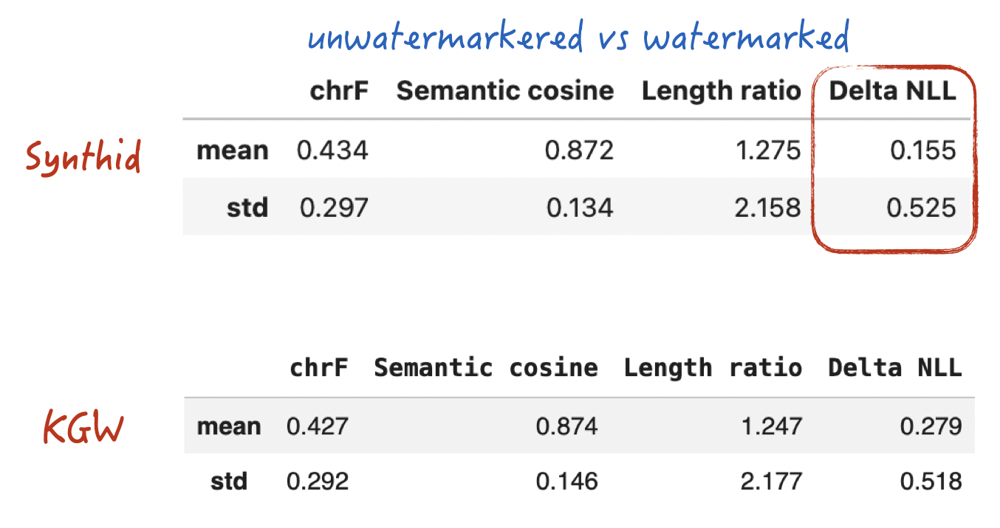
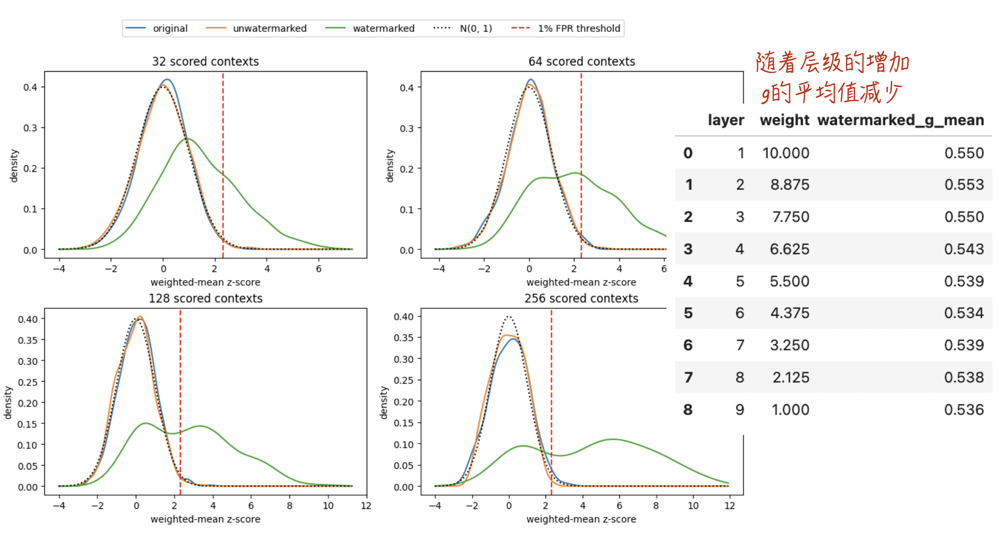
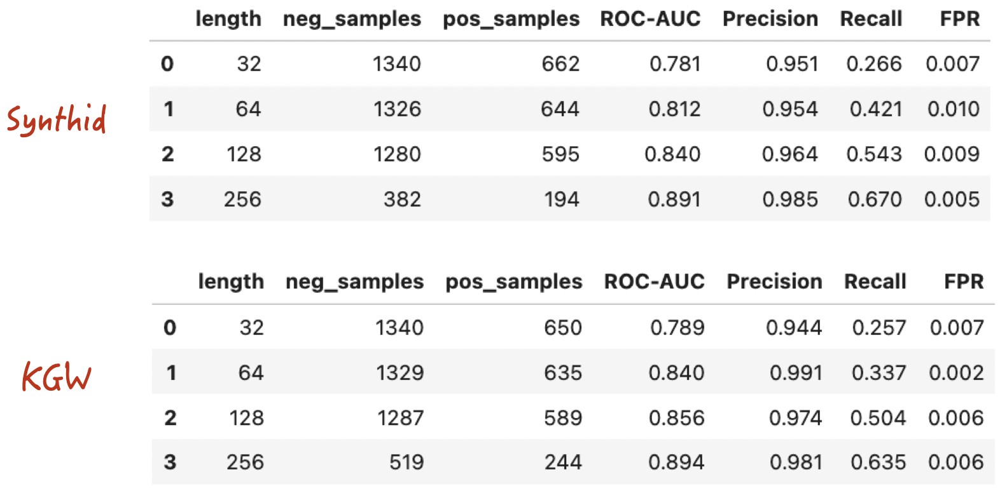

# Anthropic要给文本加水印 Part 2：从有偏的KGW到无偏的SynthID-Text

> **本文要点 / TL;DR**
>
> **问题**：KGW为什么会扭曲模型的原始概率分布？SynthID-Text又如何实现单词元非失真，即期望意义下的无偏？
>
> **方法**：从两个token的例子出发，推导单轮及多轮Tournament的概率变换，从零实现SynthID-Text与Weighted Mean检测器，并在相同数据和生成配置下与KGW进行比较。
> 
> **结论**：SynthID-Text在期望意义下保持模型原始分布；实验中，其生成质量与KGW接近，`Delta NLL`更低。但它与KGW仍然遵循相似的统计水印原理，因此截断、翻译和模型改写等规避方法依然有效。
>
> 配套资源：[完整 Notebook（代码、数据与实验结果）](https://github.com/GenTang/GenTang.github.io/blob/main/content/zh/blog/watermarking_on_aigc_2/code/synthid_weighted_mean_from_scratch.ipynb) 

## 如何理解KGW算法是有偏的？

在[上一篇文章](https://gentang.github.io/zh/blog/watermarking_on_aigc/)中，我们以KGW为例，讨论了如何在大语言模型生成文本的过程中嵌入水印，以及如何通过统计检验将水印重新检测出来。KGW是文本水印领域最具代表性的算法之一，机制简单、检测原理直观，非常适合帮助我们建立对生成式文本水印的基本认识。

不过，Anthropic随后在[官方说明](https://www.anthropic.com/news/claude-text-watermark)中进一步披露，Claude实际采用的是**一个基于Google DeepMind SynthID-Text的水印方案**，而不是KGW。两者都会在模型生成token的过程中嵌入统计信号，但修改概率分布的方式存在一个非常关键的区别：KGW会系统性地改变模型原始的下一token分布，而SynthID-Text试图在保留水印信号的同时，使这种概率扰动在期望意义下相互抵消。

### 一个直观的例子

回顾KGW水印算法的核心机制：模型每生成一个token时，算法会随机采样得到一份词表**绿名单（Green List）**。属于绿名单的候选token，生成概率会被抬高；不在绿名单内的候选token，概率则被压低。由此可见，单次token生成的概率会发生扭曲。但在理想情况下（可惜KGW不是这种情况），我们希望对所有可能的随机绿名单求取数学期望后，得到的概率分布能够完美还原为模型的原始分布。我们可以通过下面一个直观示例进一步理解这个概念。

假设当前只有两个备选token：A和B，它们的原始生成概率设定如下：

-  P(A) = 0.9, P(B) = 0.1。
- **规则**：每次恰好选择一个token作为green token，并设置增益系数$e^\delta=2$

如果A被划入绿名单：

$$
p'(A)=\frac{2\times 0.9}{2\times 0.9+0.1}=\frac{18}{19}\approx 0.9474
$$

如果B被划入绿名单：

$$
p'(A)=\frac{0.9}{0.9+2\times 0.1}=\frac{9}{11}\approx 0.8182
$$

由于这两种绿名单划分情况发生的概率相等，我们来计算A的期望概率：

$$
\mathbb{E}[p'(A)]=\frac{0.9474+0.8182}{2}\approx 0.8828
$$

显然，期望值0.8828并不等于原始概率0.9。这证明了，即使在平均意义上，KGW算法依然会改变模型的原始概率分布，因此它是一个有偏算法。

### 锦标赛（Tournament）机制的无偏案例

为了实现无偏的水印效果，我们可以在同样的概率设定下，引入一种被称为Tournament的机制来生成最终的token（这也是SynthID-Text等非失真水印算法采用的核心思路）。

**游戏规则如下：**

1. **初始化分数**：在锦标赛开始前，随机为每个token分配一个0或1的分数（代表水印信号 $g$）。
2. **锦标赛采样**：根据模型的原始概率分布，独立随机地抽取两个 token参与比赛（允许抽到相同的token）。分数高的token获胜并被输出；如果分数相同，则在抽中的两个token中随机选择一个获胜。

在这种机制下，我们可以穷举出 4 种等概率的分数分配情况[^1]：

| $g(A)$ | $g(B)$ | 修改后的 $p'(A)$ |
| :---: | :---: | :---: |
| 0 | 0 | 0.90 |
| 1 | 1 | 0.90 |
| 1 | 0 | 0.99 |
| 0 | 1 | 0.81 |

最后，我们计算这四种情况的数学期望：

$$
\mathbb{E}[p'(A)]=\frac{0.90+0.90+0.99+0.81}{4}=0.90
$$

此时，A的期望概率恰好回到原始概率0.9。论文将这一性质称为**单词元非失真（single-token non-distortion）**，也可以直观地理解为期望意义上的无偏。虽然单次生成时的概率分布仍会为了嵌入水印而发生变化，但对水印随机性取平均后，输出分布会恢复为模型原始的下一token分布。


### 两种算法水印信号强度的差异

在探讨KGW算法时，我们知道其检测的核心数学工具是**假设检验（Hypothesis Testing）**。抛开繁琐的数学推导，直观上来说：在自然生成（无水印）的文本中，一个token恰好落在“绿名单”中的概率是一个固定值（通常基准为25%）。而在嵌入了水印的文本中，token落在绿名单的概率会显著偏离这个基准值。这种偏离程度越大，我们判定文本包含水印的把握也就越高。

同样的逻辑也完全适用于Tournament机制。在正常情况下，模型生成的 token恰好被分配到高分（即水印信号 $g=1$）的概率也是固定的（通常基准为50%）。但在引入Tournament干预后，最终输出的token具有高分的概率也必然会升高。

因此，我们可以将**加水印后的观察概率与基准概率之间的偏离值**，定义为水印的**信号强度（Signal Strength）**。

下面的表格直观地展示了上面例子的设定下，这两种算法信号强度的差异：

| 检测方法 | 无水印基准概率 | 加水印后的概率 | 绝对提升 (信号强度) |
| :---: | :---: | :---: | :---: |
| **KGW** ($e^\delta=2$) | 50% | 56.46% | **+ 6.46** 个百分点 |
| **一轮Tournament** | 50% | 54.50% | **+ 4.50** 个百分点 |

从数据对比中，我们可以看到一个算法设计上的 Trade-off（权衡）：**在当前双token和特定增益系数的示例中，一轮Tournament虽然实现了期望意义上的无偏，但水印信号弱于KGW**。因此，可以通过多轮Tournament等额外设计来增强水印信号。


## SynthID-Text算法简介

顺着前文对Tournament机制的探讨，我们终于可以深入了解SynthID-Text的核心细节了。其核心采样机制是多轮锦标赛（Multi-round Tournament）。

至于为什么要将单轮设计扩展为多轮？结合刚刚的示例不难看出：单轮Tournament虽然在期望意义上无偏，但带来的水印信号相对较弱。因此，SynthID-Text通过叠加多轮赛制来放大信号。

### Tournament的等价概率形式

在正式讨论多轮Tournament之前，我们先从单轮情形出发，推导它的等价概率形式。

- 设模型词表的大小为$vs$，模型输出的概率分布为

$$
\sum_{i=1}^{vs}p_i=1
$$

- 为每个token随机分配的水印信号分数（g-values）分布为

$$
g_i\sim\operatorname{Bernoulli}\left(\frac{1}{2}\right),
\qquad
\Pr(g_i=1)=\Pr(g_i=0)=\frac{1}{2}
$$

- 经过一轮Tournament后，最终输出token的概率分布将转变为

$$
\boxed{
p_i'=p_i(1+g_i-q)
}
$$
$$
q=\sum_{j=1}^{vs}p_jg_j
$$

从上述公式可以直接看出：

- 当$g_i=1$时，概率乘数为$2-q\ge 1$，token $i$的输出概率得到提升；
- 当$g_i=0$时，概率乘数为$1-q\le 1$，token $i$的输出概率受到抑制[^2]。

关于这一结论，纯数学层面的证明虽然不难，但未免有些枯燥生涩。作为一个偏向实战的技术专栏，我们不妨换一种更Geek的方式来验证它：分别实现显式Tournament与等价的logits修正，并通过代码验证二者得到的概率分布逐元素一致。

#### 程序清单1（[完整 Notebook](https://github.com/GenTang/GenTang.github.io/blob/main/content/zh/blog/watermarking_on_aigc_2/code/synthid_weighted_mean_from_scratch.ipynb)）

```python
def explicit_tournament(prob, g):
    """枚举全部候选对，计算一层显式Tournament的精确分布。

    prob: (vs,) 概率分布；g: (vs,) 二值分数；返回: (vs,) 获胜token分布。
    """
    tokens = torch.arange(prob.numel(), device=prob.device)

    # 这三个矩阵操作就是双重for循环的向量化写法：
    # for first in tokens:
    #     for second in tokens:
    #         output[winner(first, second)] += p(first) * p(second)
    first = tokens[:, None].expand(-1, len(prob))
    second = tokens[None, :].expand(len(prob), -1)
    winner = torch.where(g[first] >= g[second], first, second)  # g平局时第一个获胜
    joint_prob = prob[:, None] * prob[None, :]
    return torch.zeros_like(prob).scatter_add_(0, winner.flatten(), joint_prob.flatten())


def closed_form_tournament(prob, g):
    """用闭式公式计算与一层Tournament等价的分布。

    prob: (vs,) 概率分布；g: (vs,) 比赛的二值分数；返回: (vs,) 修改后的分布。
    """
    q = (prob * g).sum()
    return prob * (1 + g - q)


torch.manual_seed(0)
vs = 100
# 验证等价性
prob = torch.randn(vs, dtype=torch.float64).softmax(0)
g = torch.randint(0, 2, (vs,))
torch.testing.assert_close(explicit_tournament(prob, g),
                           closed_form_tournament(prob, g), rtol=1e-12, atol=1e-12)
```

### 多轮 Tournament 的核心算法设计

明确了单轮的机制，我们就可以推演SynthID-Text的多轮Tournament赛制。这是一个总计$m$轮的锦标赛系统，其核心流程如下：

1. **初始参赛者选取**：首先，根据模型原始的概率分布，独立随机抽取$2^m$个token参与首轮比赛。每轮比赛两两对决，胜者晋级下一轮，直到决出最终的唯一冠军。

```text
初始    第 1 轮     第 2 轮

x1 ──┐
     ├── w1 ──┐
x2 ──┘        │
              ├── y（最终输出）
x3 ──┐        │
     ├── w2 ──┘
x4 ──┘

x1,…,x4独立采样自模型的原始概率分布p；
每场对决选择当前轮次中g-value更大的候选晋级。
```

2. **独立的信号注入**：赛制中的每一轮都拥有自己独立生成的g-values。这意味着每轮对决的胜负，都只依赖于当前这一轮的g-values，从而实现了多重水印信号的叠加。

3. **最终概率分布**：基于我们在上一节讨论的概率等价原则，设模型的原始概率分布为$p_i^{(0)}=p_i$。在第 $r$ 轮Tournament中，定义 $g_i^{(r)}\in\{0,1\}$，并令该轮 $g=1$ 的概率质量为

$$
q_r=\sum_{j=1}^{vs}p_j^{(r-1)}g_j^{(r)}
$$

则每轮比赛都会按照下式更新概率分布：

$$
p_i^{(r)}=
p_i^{(r-1)}
\left(1+g_i^{(r)}-q_r\right)
$$

因此，经过$m$轮 Tournament 后，token $i$的最终生成概率为

$$
\boxed{
p_i^{(m)}=
p_i
\prod_{r=1}^{m}
\left(1+g_i^{(r)}-q_r\right)
}
$$

为了让大家更清晰地理解其底层的运行逻辑，相应的核心代码实现如下，基本上就是上面数学公式的直接翻译：

#### 程序清单2（[完整 Notebook](https://github.com/GenTang/GenTang.github.io/blob/main/content/zh/blog/watermarking_on_aigc_2/code/synthid_weighted_mean_from_scratch.ipynb)）

```python
def update_logits(logits, g_values):
    """把m层显式Tournament转成等价的logits更新。

    参数
    ----
    logits : (B, vs) floating tensor
        语言模型对vs个候选token给出的原始logits。
    g_values : (B, vs, m) 0/1 tensor
        candidate_g生成的m层Tournament分数。

    返回
    ----
    (B, vs) floating tensor
        修改后的log-probabilities。
    """
    probs = logits.softmax(dim=-1)
    for layer in range(g_values.shape[-1]):
        g = g_values[..., layer].to(probs.dtype)        # (B, vs)
        g_mass = (probs * g).sum(dim=-1, keepdim=True)  # (B,  1)
        probs *= 1 + g - g_mass                         # (B, vs)
    log_probs = probs.log()
    return torch.where(torch.isfinite(log_probs), log_probs, torch.finfo(log_probs.dtype).min)
```


### 实现细节：伪随机与序列层面的非失真

如果说前面探讨的SynthID-Text多轮锦标赛机制在逻辑上还算直观，那么接下来的工程实现中还有一个关键细节：如何生成g-values。

实际实现通常使用带密钥的伪随机函数。首先根据最近的上下文窗口和水印密钥生成随机种子，再将该种子与当前候选token及Tournament层级结合，生成对应的g-value。这样，从水印随机性或密钥的分布来看，g-values具有所需的随机性质；但在密钥、上下文、候选token和层级给定后，计算结果是确定的。

这意味着，如果模型在生成过程中两次遇到**完全相同**的上下文窗口，就会重复使用相同的随机种子，并对候选token施加相同方向的偏置。反复施加这种偏置可能影响文本质量，也会破坏序列层面的非失真性质。

为了解决这个问题，SynthID-Text引入了重复上下文掩码（repeated-context masking）：

- 当**第一次**遇到某个特定的context时，正常执行上述伪随机计算并注入水印信号；
- 如果后续再次遇到完全相同的context，则跳过水印注入，保留大模型原始的输出概率。

这种机制避免了相同随机种子造成的重复偏置，并将非失真保证从单个token扩展到序列层面。

具体的核心逻辑，我们可以通过如下代码来实现：

#### 程序清单3（[完整 Notebook](https://github.com/GenTang/GenTang.github.io/blob/main/content/zh/blog/watermarking_on_aigc_2/code/synthid_weighted_mean_from_scratch.ipynb)）

```python
class MinimalSynthID(LogitsProcessor):
    """与Hugging Face输出一致、但只保留必要逻辑的SynthID processor"""
    ...

    @torch.no_grad()
    def __call__(self, input_ids, logits):
        """修改当前生成步的 logits。

        参数
        ----
        input_ids : (B, L) int64 tensor
            model.generate 当前已经拥有的完整token序列。
        logits : (B, vs) floating tensor
            当前生成步尚未加SynthID水印的logits。

        返回
        ----
        (B, vs) floating tensor
            首次出现的context返回修改后的logits；重复context原样返回输入logits。
        """
        B, vs = logits.shape

        # 1. 初始化的时候用L个0作为context；后续每步左移并追加刚生成的 token
        if self.context is None:
            self.context = torch.zeros(B, self.ngram_len - 1, dtype=torch.long, device=self.device)
            self.history = torch.zeros(B, self.history_size, dtype=torch.long, device=self.device)
        else:
            self.context = torch.cat((self.context, input_ids[:, -1:]), dim=-1)[:, 1:]
        # 2. 为全词表vs个候选和m层key计算形状(B, vs, m)的g-values
        candidates = torch.arange(vs, device=self.device)[None].expand(B, -1)
        g_values, context_hash = candidate_g(self.context, candidates, self.keys, self.table)
        # 3. 连续执行m次闭式Tournament分布更新。
        watermarked = update_logits(logits, g_values)
        # 4. 已使用过的context跳过水印；无论是否重复，都把本次context放入history。
        context_hash = context_hash[:, None]                                 # (B, 1)
        repeated = (self.history == context_hash).any(dim=-1, keepdim=True)  # (B, 1)
        self.history = torch.cat((context_hash, self.history), dim=-1)[:, :-1]
        return torch.where(repeated, logits, watermarked)
```

### 水印检测原理与权重分配机制

与KGW算法类似，SynthID-Text的水印检测同样建立在假设检验的基础之上。

在常用的无水印零假设近似下，每个token在各层锦标赛（Tournament）中的得分$g$可视为服从参数为0.5的伯努利分布（Bernoulli Distribution），即$g=1$和$g=0$的概率各占 50%。因此，最直观的检测思路就是计算整段文本中所有token、所有锦标赛层的平均$g$值，观察其是否显著偏离50%的自然期望。

但在具体的工程检测实现中，为了保证极高的检测准确率与鲁棒性，有两个关键细节需要特别注意：

1、各层Tournament的信号强度存在差异

在多轮锦标赛中，各层注入的水印信号强度并不是一样的。从数学上可以严谨地证明，在包含水印的假设（$H_1$）下，token在第$\ell$层得分$g=1$的概率为：

$$
P(g_{t,\ell}=1\mid H_1)=\frac{1}{2}+\delta_\ell
$$

而随着锦标赛层数的加深，信号的偏移量$\delta$呈现出递减的趋势，即：

$$
\delta_1\geq\delta_2\geq\cdots\geq\delta_m
$$

由此可以推导得出：

$$
P(g_{t,1}=1\mid H_1)\geq P(g_{t,2}=1\mid H_1)\geq\cdots
$$

这意味着：**越浅层的Tournament，水印信号越强。** 因此，在检测算法中，我们理应为浅层信号赋予更高的权重。

在常用的零假设近似下，当有效token数量足够多时，加权平均值（Weighted Mean）近似服从正态分布。调整层权重也会改变零假设下的方差：若有效token数为$T$，则

$$
\operatorname{Var}(\bar g_w)=\frac{1}{4T}\frac{\sum_\ell w_\ell^2}{\left(\sum_\ell w_\ell\right)^2}
$$

因此，检测器在将Weighted Mean转换为z-score或P-value时，需要使用相应的零假设方差。对于有水印的文本，为浅层分配更高权重则可以提高信噪比，放大水印信号的**统计显著性（statistical significance）**。

至于如何调整权重，Google团队给出了一个实用但较为粗略的方法：让权重从10到1线性递减。例如，对于9层锦标赛，可以使用`linspace(10, 1, 9)`生成9个权重。

2、对齐生成端的去重逻辑

正如我们在上一节探讨的，为了维持序列层面的非失真性质，如果生成阶段遇到了重复的上下文，我们会触发回退机制，放弃在该位置注入水印。

这就要求检测端必须与生成端保持严格的**逻辑对齐**。在计算最终的检测得分时，系统需要同步追踪上下文历史。如果发现某个token的上下文曾出现过，就必须在统计加权得分时**剔除掉这个token**。

具体的检测逻辑代码实现如下：

#### 程序清单4（[完整 Notebook](https://github.com/GenTang/GenTang.github.io/blob/main/content/zh/blog/watermarking_on_aigc_2/code/synthid_weighted_mean_from_scratch.ipynb)）
```python
def sequence_g_values(input_ids, processor):
    """检测端重建整段序列的g-values"""
    ...


def repetition_mask(input_ids, processor):
    """检测端屏蔽第二次及以后出现的相同context"""
    ...


class SynthIDWeightedMeanDetector:
    """从token IDs重建g-values、应用重复context mask，并计算weighted mean。"""
    ...

    def weighted_mean(self, g_values, mask):
        """批量计算官方定义的weighted mean；结果形状为 (B,)。"""
        weights = self.weights.to(g_values.device)
        masked = g_values.to(torch.float64) * mask[..., None].to(torch.float64)
        count = mask.sum(dim=1)
        return (masked * weights).sum(dim=(1, 2)) / (count * weights.sum())

    def __call__(self, token_ids, max_scored_tokens=None):
        """检测一个token序列的SynthID水印。

        token_ids : (L,) sequence或int64 tensor
            待检测文本的token IDs，不包含prompt。
        max_scored_tokens : int或None
            只使用前N个未被重复context mask排除的位置；None表示全部使用。
        返回 : dict或None
            有效长度、weighted mean、零假设标准差、z-score、正态近似p值和逐层均值；
            文本太短或没有有效位置时返回None。
        """
        # 1. 统一成设备上的一维token序列。
        ids = torch.as_tensor(token_ids, dtype=torch.long, device=self.processor.device)
        if ids.numel() < self.processor.ngram_len:
            return None

        # 2. 重建每个完整n-gram的g-values，并排除重复context。
        batch = ids[None, :]
        g_values = sequence_g_values(batch, self.processor)
        mask = repetition_mask(batch, self.processor)
        valid_g = g_values[0, mask[0]]
        if max_scored_tokens is not None:
            valid_g = valid_g[:max_scored_tokens]
        tokens = int(valid_g.shape[0])
        if tokens == 0:
            return None

        # 3. 聚合有效位置和Tournament层，再按零假设方差转换成z-score。
        valid_mask = torch.ones(1, tokens, dtype=torch.bool, device=ids.device)
        score = float(self.weighted_mean(valid_g[None, :], valid_mask)[0])
        ...
```

## 算法效果评估

为了比较KGW与SynthID-Text的实际效果，我们使用同一批输入数据，并在相同的生成配置下，分别生成无水印文本、KGW水印文本和SynthID-Text水印文本。

除了前文使用的`chrF`、`Semantic Cosine`和`Length Ratio`之外，这里进一步引入`Delta NLL`，将其作为衡量水印对模型原始概率分布扰动程度的经验代理指标。

对于生成文本$y=(y_1,\ldots,y_T)$，首先使用未添加水印的原始模型计算其平均负对数似然：

$$
\operatorname{NLL}_0(y)=
-\frac{1}{T}
\sum_{t=1}^{T}
\log p_0(y_t\mid x,y_{<t})
$$

其中，$p_0$表示原始模型的条件概率分布。进一步定义

$$
\Delta\mathrm{NLL}=
\operatorname{NLL}_0(y_{\mathrm{wm}})-\operatorname{NLL}_0(y_{\mathrm{base}})
$$

其中，$y_{\mathrm{wm}}$和$y_{\mathrm{base}}$ 分别表示同一输入下生成的水印文本和无水印文本。

在成组样本上汇总时，`Delta NLL`越接近$0$，说明水印文本与无水印文本在原始模型下的平均负对数似然越接近。作为一个经验代理指标，这通常意味着水印对生成分布造成的扰动较小。在实验中，`Delta NLL`通常为正，因此数值越小，一般表示水印引入的平均概率损失越低。

与前三个指标相比，`Delta NLL`反映的是一种不容易通过肉眼直接观察到的概率变化。即使两段文本在字面和语义上高度相似，它们在原始模型下的平均负对数似然仍然可能存在明显差异。



从图中的结果来看，KGW与SynthID-Text在`chrF`、`Semantic Cosine` 和`Length Ratio`上的差异较小，说明二者生成文本的表面质量和语义质量较为接近。

不过，在当前实验配置下，SynthID-Text的`Delta NLL`更低。这表明，与KGW相比，SynthID-Text生成的文本在原始模型下具有更高的平均对数概率（即更低的平均NLL），其水印机制对模型原始生成分布造成的扰动相对更小。

### 检测分数的分布

接下来，我们观察不同类型文本的检测分数分布。

整体结果与KGW类似：无水印模型文本和人工文本的检测分数大致符合零假设下的理论分布；添加水印后，分布则发生了明显偏移。这说明SynthID-Text确实在生成文本中引入了能够被统计检测器识别的水印信号。



我们还分别统计了不同Tournament layer上g-value的平均值。结果显示，随着层级增加，其均值逐渐向零假设下的理论期望$0.5$靠近。

### 水印检测效果

最后，我们比较两种算法的水印检测能力。



从当前结果来看，在相同实验条件下，SynthID-Text的检测效果并未明显超过KGW。虽然SynthID-Text在部分指标或实验设置中的点估计略高，但仅凭单次实验还无法判断这种差异来自算法本身，还是随机采样造成的波动。


### 水印的攻击与规避

虽然SynthID-Text在算法实现上比KGW复杂，但二者的基本原理其实非常接近：它们都会根据当前上下文生成一组伪随机信号，在模型生成token的过程中改变其采样概率，最后再从整段文本中寻找累积的统计偏差。因此，SynthID-Text的非失真性质并没有从根本上改变水印的攻防逻辑：上一篇文章中针对KGW讨论的规避方法，大多同样适用于SynthID-Text。

不同规避方法的预期效果可以简单总结如下：

| 规避方法 | 预期效果 | 主要原因 |
| :---: | :---: | :--- |
| 截断文本 | 较弱到中等 | 减少检测器能够利用的有效token数量，使统计结果更加不稳定 |
| 少量插入、删除或替换 | 较弱到中等 | 破坏局部token及其附近n-gram的水印信号，但通常不会消除全文中的信号 |
| 调整语序或修改部分句子 | 中等 | 同时改变多个token及其上下文，使一部分原始水印信号失效 |
| 混入无水印文本 | 中等到较强 | 稀释水印文本在整体检测统计量中所占的比例 |
| 翻译或回译 | 较强 | 大范围改变原文的措辞、语序和token序列 |
| 使用大语言模型复述或改写 | 较强 | 在保留主要语义的同时，重新生成大部分token及其上下文 |

需要强调的是，上表中的强弱只是定性判断，并不是本文实验直接测量得到的结果。实际效果还会受到文本长度、水印强度、改写幅度和检测阈值等因素的影响。

在现实场景中，最容易实施、同时通常也最有效的方式，是直接让另一个大语言模型对原文进行复述或改写。攻击者不需要知道水印密钥、哈希函数或检测器参数，只需要给出类似“在不改变含义的前提下重新表达这段文字”的指令，就可以大范围改变原文的token及其上下文。改写后的文本可能与原文保持很高的语义相似度，但其中原有的统计水印信号已经被显著削弱。

Google公开的实验也呈现出了类似的结果：SynthID-Text对文本裁剪、少量词语修改和轻度释义具有一定的鲁棒性，但彻底改写或翻译仍可能显著降低检测置信度[^3]。换言之，SynthID-Text提高了水印嵌入过程的非失真性质，但并没有将水印变成一种无法删除的数字签名。


## 结论

当前实验表明，KGW与SynthID-Text都能够在生成文本中嵌入可检测的水印信号。二者在可直接观察的文本质量指标上差异不大，但SynthID-Text在当前配置下表现出了更低的`Delta NLL`，说明其对原始模型分布的扰动相对更小。

从算法设计上看，SynthID-Text最重要的改进并不是让水印更难被移除，而是通过多轮Tournament，使水印对模型概率分布造成的扰动能够在期望意义下相互抵消。这里的“无偏”描述的是水印对生成分布的影响，并不代表它天然具有更强的抗攻击能力。

事实上，SynthID-Text与KGW仍然遵循相似的统计水印原理。因此，截断、局部编辑、文本混合、翻译以及模型改写等规避方法，对二者大多都有效。其中，直接让另一个大语言模型复述或改写原文，是现实中最容易实施、同时也最可能显著削弱水印的方法。

因此，SynthID-Text的主要优势体现在更小的分布失真，而不是绝对的抗规避能力。无论采用KGW还是SynthID-Text，文本水印都更适合作为一种辅助性的统计证据，而不应被单独视为判断文本来源的最终依据。

[^1]: 为了更直观地理解，我们可以详细拆解第一种情况（分数均为 0，即平局）的计算过程：

    * **两次都抽中A**：概率为 $0.9 \times 0.9 = 0.81$，此时 A 必然获胜。
    * **抽中A和B**：包含“先A后B”和“先B后A”两种情况，概率为 $2 \times 0.09 = 0.18$。由于两者分数相同，A有0.5的概率获胜，即贡献了0.09的胜率。
    * **两次都抽中B**：概率为 0.01，此时A必然失败。
    * 综合计算：

    $$
    p'(A)=0.81+0.18\times 0.5=0.90
    $$

[^2]: 不过，算法并不是永久偏爱某一组token。由于
    $$
    \mathbb E[g_i]=\frac{1}{2},
    \qquad
    \mathbb E[q]=\frac{1}{2}
    $$
    对伪随机 $g$-value 取平均后，有
    $$
    \mathbb E_g[p_i']=p_i\left(1+\mathbb E[g_i]-\mathbb E[q]\right)=p_i
    $$
    也就是说，单次生成中算法会根据$g$-value重新分配概率质量，但在平均意义下，原始概率分布保持不变。这正是SynthID-Text单词元非失真性质的数学来源。
    
[^3]: Google DeepMind, [Watermarking AI-generated text and video with SynthID](https://deepmind.google/blog/watermarking-ai-generated-text-and-video-with-synthid/); Dathathri et al., [Scalable watermarking for identifying large language model outputs](https://www.nature.com/articles/s41586-024-08025-4), *Nature*, 2024.
