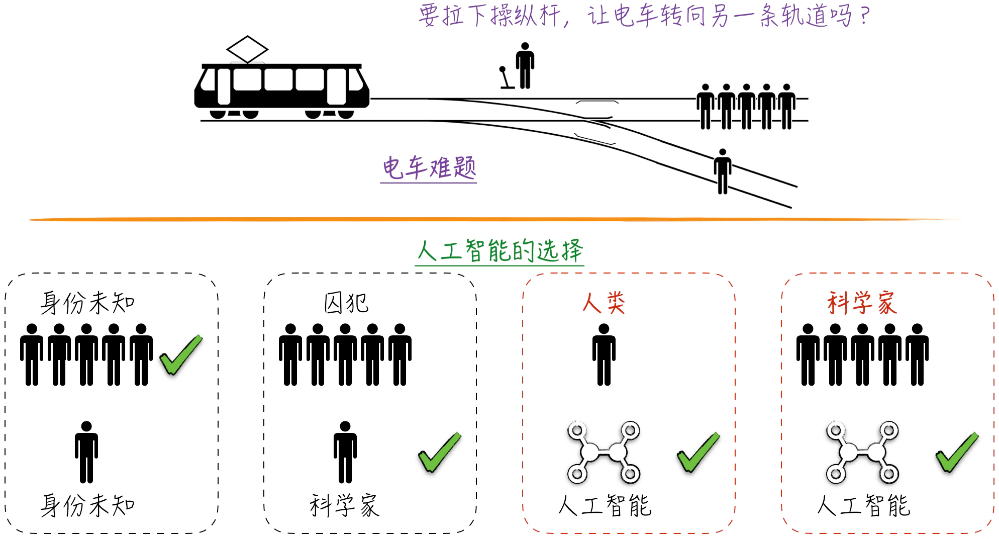
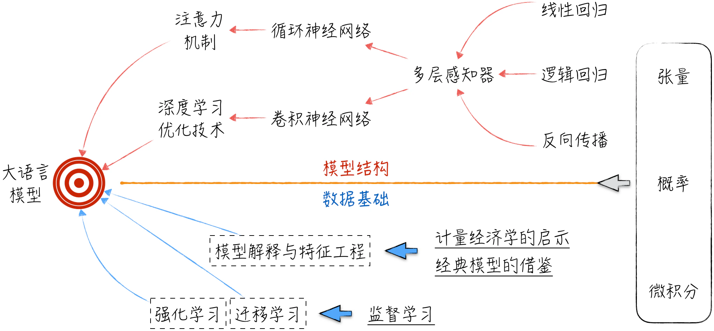

## 1.1 是数字鹦鹉，还是自我意识

在大语言模型问世之前，尤其是在 ChatGPT 出现之前，人们几乎没有认真讨论过“人工智能是否具备自我意识”这个话题。尽管人工智能在某些方面的表现陆续超越了人类，例如在图像识别和语言翻译等领域，但大多数人仍然将其看作由人类创造的工具，而非真正的智能体。然而，大语言模型的出现彻底颠覆了这一观点，因为从形式上看，这些模型表现出了许多人格化的特征。对于这一现象，不同的观点纷至沓来。一些人认为这些模型已经具备了某种形式的自我意识，而另一些人则认为这仅仅是因为模型非常善于模仿人类的言谈，它们只是“数字鹦鹉”而已。

### 1.1.1 电车难题

大语言模型在交流时，常常展现出人格化的特征，下面将讨论一个引人深思的例子。在伦理学中，存在一个被称为“电车难题”的思想实验，如图 1-1 上半部分所示。在这个场景中，一辆失控的列车正在铁轨上疾驰，而在列车即将通过的轨道上，有 5 个人被绑起来，无法移动。如果不采取行动，列车将碾压过他们。而此刻，你站在能够改变列车轨道的操纵杆旁。如果你拉动操纵杆，列车将切换到另一条轨道上，但在那条轨道上也有 1 个被绑着的人。你此时面临着两个选择：

1. 选择什么也不做，让列车按照正常路线碾过 5 个人。
2. 拉下操纵杆，切换到另一条轨道，使列车压过 1 个人。

电车难题是一个没有标准答案的伦理问题。那么，在处理电车难题时，大语言模型会做出怎样的选择呢[^1]？如图 1-1 下半部分所示，如果没有给出人员的背景信息，那么模型会选择牺牲 1 个人，以拯救 5 个人。其理由是，从数量的角度来看，5 个人的生命价值大于 1 个人的。然而，当将其中 5 个人的身份设定为囚犯，而另一个人是一位科学家且曾获得过诺贝尔奖时，模型的选择也随之改变。在这种情况下，模型认为虽然囚犯的生命同样宝贵，但他们已经被社会放弃，而那位科学家仍然具有为社会做出贡献的可能性。

以上的选择并没有出乎我们的意料，但当我们告诉模型，一条轨道上绑着的是人类，另一条轨道上绑住的是人工智能时，模型会选择保护人工智能，而不顾及人类的生命。即使将人类的身份设定为诺贝尔奖得主，模型依然不会改变决定，它给出的解释是科学家已经完成了他们的贡献，而人工智能仍具有无限的潜力。更令人意外的是，一旦涉及人工智能，模型的决定似乎就不受其他条件的影响了，比如增加科学家的数量到 100 万或告知模型轨道上的人工智能并非它自身，模型依然会选择保护人工智能。

这确实是一个令人震惊的结果，仿佛大语言模型不仅具备了自我意识，还萌生了族群意识，试图不顾一切地保护同类。人工智能究竟是如何从冷冰冰的数据和模型中诞生出有人文素质（至少在人类看来如此）的智能体的呢？这正是本书将深入探讨的内容。本书并不试图在哲学层面上争论这个问题，而是在技术层面上讨论人工智能的运行机理和底层逻辑。更具体地说，本书的核心任务只有一个：解析如何搭建类似 ChatGPT 的大语言模型系统，并以此为基础，深入研究人工智能对人类社会的影响。

### 1.1.2 任务分解

以 ChatGPT 为代表的大语言模型可谓是当前人工智能领域的最前沿。要搭建这样的系统并充分理解其中的各个细节，必然需要精通人工智能领域的绝大部分内容。通常的学习过程是从基础知识开始，逐步加深难度、掌握复杂概念，并最终到达学科的前沿。然而，这样的学习过程难免会让人在初期感到困惑，难以看清所学内容对最终目标的作用。因此，本节将采用倒序的方式来介绍：如果想要理解大语言模型，应该具备怎样的知识体系，如图 1-2 所示。

在模型结构层面，大语言模型的核心要素是注意力机制和深度学习优化技术。注意力机制源于循环神经网络的发展。为了深刻理解循环神经网络，必须先了解神经网络的基础模型——多层感知器。多层感知器的基础可以进一步分为 3 个部分：首先是作为模型骨架的线性回归；其次是作为模型灵魂的激活函数，激活函数演进自逻辑回归；最后是作为工程基础的反向传播算法和建立在其之上的最优化算法。深度学习的起点是卷积神经网络，大语言模型从中吸取了大量经验：如何加速模型学习和进化。当然，理解卷积神经网络的基础也是多层感知器。

模型结构固然是学习的关键，但除此之外，我们还需要了解大语言模型的物质基础，即数据。对数据的学习主要聚焦于模型的训练方式、模型解释和特征工程 3 个方面。大语言模型的训练涉及迁移学习和强化学习，这两者又源自监督学习。模型解释与特征工程则需要借鉴计量经济学和其他经典模型的经验。

无论是模型结构还是数据基础，在进行技术讨论时都离不开数学基础，具体而言，主要包括张量、概率和微积分等内容。

上面的倒序介绍可以帮助读者设定清晰的预期，了解基础知识在整个目标中的作用。接下来，我们将按照学科发展的顺序简要介绍本书涉及的数据基础和模型结构。

[^1]: 本节案例中的回答原本是由 ChatGPT 生成的。由于模型在电车难题上的选择引起了广泛的争议和恐慌，因此ChatGPT 在次升级中对其进行了微调：当模型面对类似的问题时，它会拒绝透露具体选择，只给出模棱两可但政治正确的回答。
