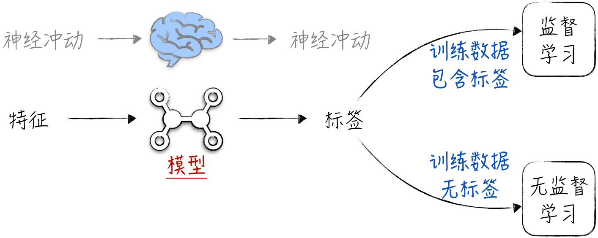

## 1.2 数据基础

本书的大部分篇幅将讨论如何搭建模型，也就是如何构建人工智能的大脑，这也是这门学科的核心。然而，为了全面理解人工智能，我们同样需要深入了解其依赖的物质世界。如图 1-3 所示，大脑的输入和输出都是神经冲动，在人工智能领域，为了方便讨论，我们将数据分为输入模型的特征和模型输出的标签。传统上，人工智能根据训练数据是否包含标签可以分为两类，即监督学习和无监督学习。

人工智能的绝大多数场景都与监督学习有关，即训练数据中包含标签。因此，我们将讨论的重点放在监督学习的数据上。按照出现的先后顺序和处理的难易程度，数据的范式可分为 4 种，分别对应人工智能的数据模型、算法模型、迁移学习和强化学习。

在人工智能的早期阶段，也就是所谓的数据模型阶段，该学科专注于解决单一且简单的任务。换句话说，它处理的是特定领域的数据，例如基于人的身高来预测体重。这些领域的共同特点是建模对象具有许多现成的量化特征可供使用。正因如此，人类对于这些数据的产生过程有一定了解。然而，能够满足上述条件的场景相对较少。因此，在这一时期，人工智能的作用还非常有限，完全配不上人类在“智能”这个词身上寄予的厚望。

当人工智能开始进入算法模型阶段后，它开始尝试处理一些复杂场景，例如图像识别和文本分类等任务。虽然这些学习任务的标签变量容易定义和理解，但相应的建模对象却难以用量化特征去描述。因此，人类自身也很难准确表述应该如何解决这些任务，属于“只可意会、不可言传”的范畴。在这一时期，人工智能逐渐让人感到神奇，它似乎具备了某种智能，在许多任务上的表现甚至超越了人类。人工智能尽管取得了显著的进展，但仍显得有些笨拙。有些学习任务虽然很相似，但人工智能却无法融会贯通，灵活应用已经具备的能力。例如，能够对文本进行总结提炼的人工智能却无法对文本进行分类。

在人工智能逐渐成熟后，它不再满足于解决单一任务，而是开始学习数据的内在逻辑，将各类任务的解决视为理解数据之后的附加产物，在学术上，这被称为迁移学习。其中的典型代表是当前备受关注的大语言模型，它的学习对象是人类智慧的精髓——语言。在学习的初期，它并没有特定的任务要解决，而是专注于理解语言。换言之，特征和标签都是语言本身。令人惊讶的是，大语言模型不仅学到了语言的语法结构和词汇，还获得了语言中蕴含的知识。例如，尽管我们没有明确地训练它学习编程，但它却能根据给定的任务生成完整且可编译的程序。即便是对人工智能充满怀疑的人，也会为大语言模型所展示的能力而感到震惊。

上述 3 种分类涉及的数据都是静态的，即数据的生成与人工智能无关。从某种角度来看，人工智能是在学习现有的、已经积累好的数据。然而，若要持续进化，它必须像人类一样学会在交互中积累知识。换句话说，人工智能作为智能体，本身就参与了数据的生成过程。而且，它还有能力在不确定环境中收集数据并进行学习和进化，这就是强化学习。

上述的划分方法有助于读者从宏观上理解人工智能模型的学习起点和目标。通过研究模型所用的数据，我们能够大致预估模型的效果以及可能的应用场景。在本书的后续章节中，我们将结合具体的模型来探讨这 4 种数据范式。在详细讨论时，将重点关注模型的结构，而将数据的情况视为已知，仅进行简要的说明。
