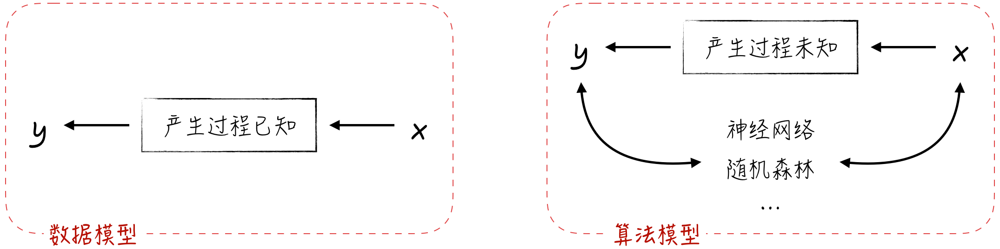
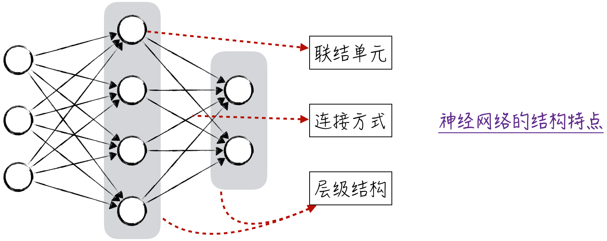

## 1.3 模型结构

模型作为人工智能的大脑，可以被看作一系列数据运算的堆砌。然而，这些运算并非偶然出现的，而是按照一定的脉络有序发展起来的。在最初的阶段，模型的设计理念是将人类的知识以运算的形式固化下来。在那个时代，计算机尚未问世，模型的运算需要人工手动完成。因此，人们设计了最简单、最容易计算的线性回归模型。不过，在实际情况中，线性关系较为罕见。对于非线性关系，要使用非线性变换对特征进行处理，从而构造出近似线性的关系。举例而言，考虑方程 $y = x + x^2$，其中，$y$ 与 $x$、$x^2$ 存在线性关系，而 $x^2$ 是 $x$ 通过非线性变换得到的。

如果非线性的根源是标签变量，又该如何处理呢？举例来说，假设模型处理的是二分类问题，用 0 表示一个类别，用 1 表示另一个类别。在这种情况下，无论如何变换特征，都难以得到近似的线性关系。因此，我们需要调整模型结构，进而产生逻辑回归模型。尽管逻辑回归模型专注于解决分类问题，但从其模型名称中可以看出，该模型的基础仍是线性回归。

线性回归和逻辑回归模型构成了所谓的数据模型。如图 1-4 所示，由于其模型结构相对简单，我们可以通过它们深入理解数据的产生过程。不过，正因为这两个模型的结构相对固定，因此研究和应用的焦点主要集中在如何对特征进行有效变换，以及如何确保模型的稳定性。

随着计算机的发展和进步，训练和使用复杂模型成为可能。因此，人工智能领域不断涌现各种新颖的算法模型。这些模型的关注点不再仅限于理解数据，而是通过巧妙的结构设计来获得更出色的效果。这与前文讨论的数据模型有着本质上的不同。不管模型的结构如何设计，模型本质上都是一系列数据运算的堆砌。这启发我们运用工程学的经验来组装模型：将已知的模型视为工程组件，通过组合的方式来构建更复杂的模型。或者可以这样理解：从宏观的角度来看，模型的输入和输出都是数据。既然如此，为何不模仿人类的大脑，将一个模型的输出作为另一个模型的输入呢？这就是模型联结主义。由于模型联结主义的核心思想是将简单模型联结成复杂模型，那么不难理解，我们会尝试联结最简单的模型。然而不幸的是，线性模型的联结仍然是线性的。因此，逻辑回归模型成了联结主义最初的尝试，实际上，这正是神经网络最初的模样。

神经网络是人工智能的核心，在讨论它时通常需要借助图示，以便更好地理解它的复杂结构。在图示中，我们从联结单元、连接方式和层级结构这 3 个方面来展示神经网络的结构特点。在图 1-5 中，圆圈代表着联结单元，这些单元是联结主义中的简单模型，也被称为神经元。圆圈之间的连线不仅代表数据的传输，还揭示了模型内部的层级关系。

最初的神经网络被称为多层感知器，它的设计方案可以概括为 3 个关键点：联结单元采用逻辑回归，连接方式为相邻层的神经元全连接，而层级结构则规定了同层之间和跨层之间都不允许连接。这种搭建方式简单直接，但其相对死板的结构在某些场景下无法更好地适应数据，从而限制了模型的效果。为了解决这一问题，各种新颖的网络结构层出不穷，以下是 3 个经典的成功案例。

1. **卷积神经网络**：在进行图像识别时，局部特征是关键，而全连通的网络结构未能有效体现这一特点，导致效果不佳。为了解决这一问题，卷积神经网络引入了局部连接的机制，成功提升了模型的效果。此外，它还在模型结构中加入了跨层连接的机制，这样的设计可以提高模型的学习效率。
2. **循环神经网络**：序列数据（如文本）的特点是数据之间相互依赖，而同层之间不允许连接的结构导致模型无法很好地处理这种依赖关系。为此，循环神经网络采用递归的结构，允许同层神经元根据输入数据自动进行连接，这种处理机制使得模型可以在数据之间传递信息，提升了处理序列数据的效果。
3. **注意力机制**：逻辑回归作为神经元虽然能提供比较好的模型解释，但其简单的结构难以处理序列数据中的复杂依赖关系。为此，大语言模型引入了注意力机制，将神经元的结构设计成更复杂的形式，使得模型能够将注意力集中在输入数据的特定区域，提高了处理长序列的效率。

这些模型在逻辑上呈现出一种承前启后的关系。本书将深入探讨每个模型的细节，并展示它们之间的内在联系：如何从最简单的线性回归模型逐步发展为时下前沿的大语言模型。