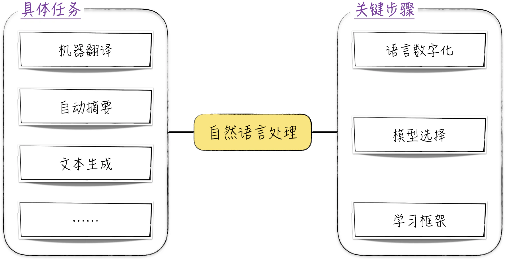
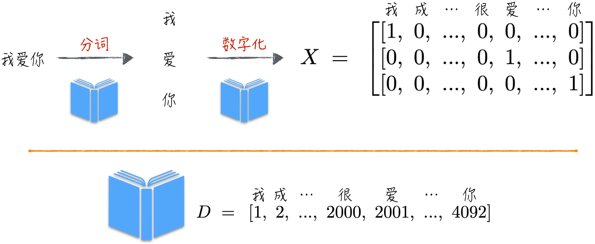
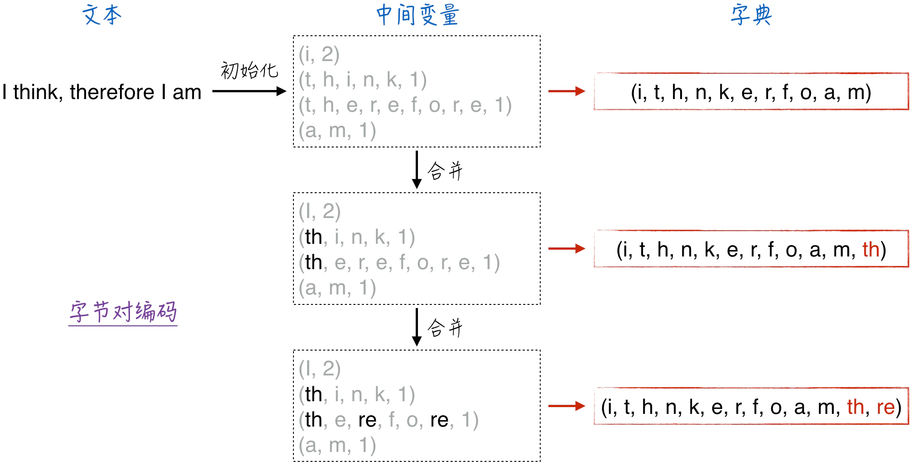
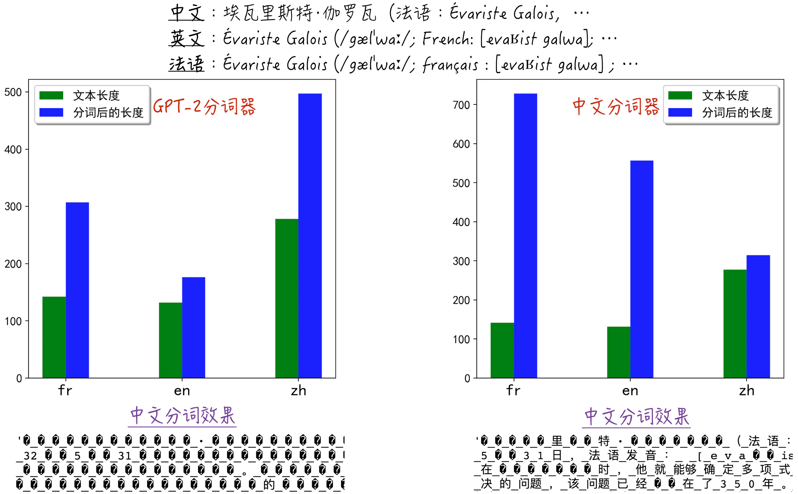
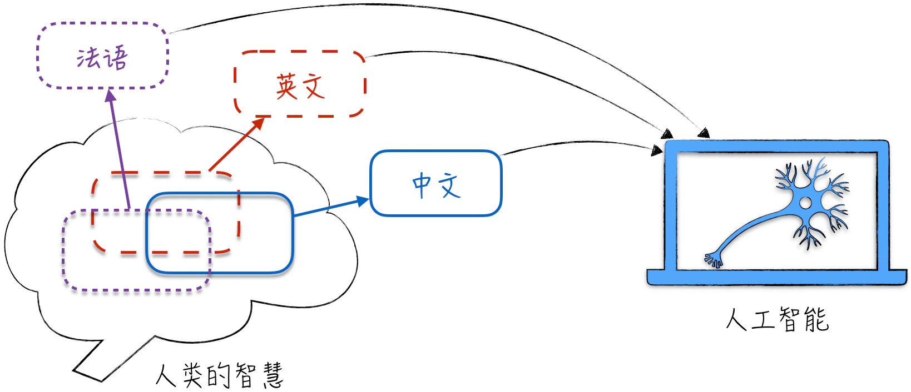
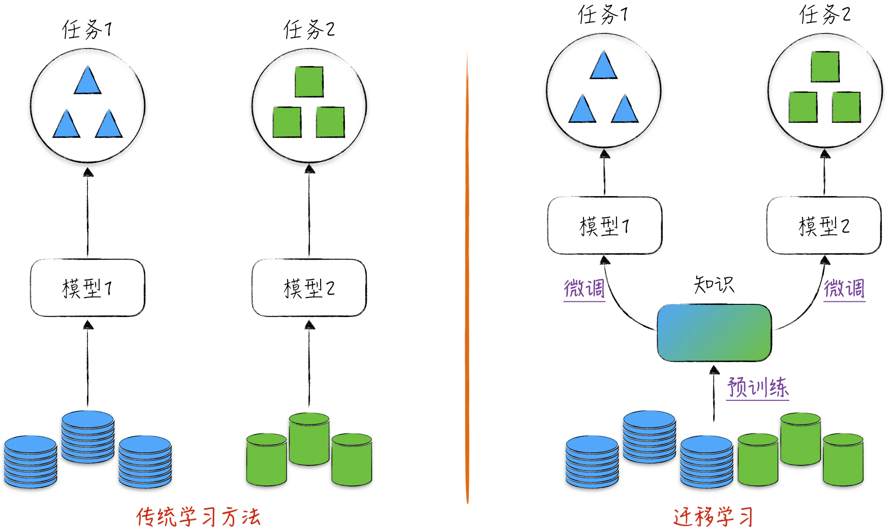

## 10.1 自然语言处理的基本要素

自然语言处理是人工智能领域中至关重要的任务。语言本身是一个复杂的学科，即使对于人类而言，掌握一门语言也需要耗费相当多的时间和努力。因此，自然语言处理汇聚了人工智能最先进的技术和一些最巧妙的设计。通过深入研究自然语言处理，我们能够迅速了解人工智能的最新技术和发展趋势。当然，自然语言处理的相关技术和建模思维也能够轻松应用于其他领域。

此外，人类的交流主要依赖文字，几乎所有知识都以文字的形式呈现和存储。机器理解语言不仅可以使人与机器之间的交流更加顺畅，还能让机器学会存储在语言中的知识。这一过程有望推动人工智能产生质的飞跃——从单一的人工智能逐渐演进为通用人工智能（Artificial General Intelligence，AGI）。

自然语言处理的目标非常明确：使计算机能够像人类一样处理和理解语言，以执行各种自动化任务。从技术角度来看，由于语言的复杂性，自然语言处理并没有一个严格且准确的定义。它包括多种不同的建模任务，如机器翻译、自动摘要、文本生成等。此外，随着时间的推移，这个领域使用的技术和主要依赖的模型也在不断发展演进。

尽管自然语言处理涉及多样化的具体任务，使用的模型和技术也各不相同，但从宏观角度看，可以将其分为 3 个关键步骤：语言数字化、模型选择和学习框架，如图 10-1 所示。语言数字化和模型选择的概念相对容易理解。学习框架则是指训练模型的模式和方法，具体细节将在[10.1.5 节](/books/deconstructing_LLM/chapter-10/10-1#section-10-1-5)中详细讨论。

在传统的自然语言处理中，通常会针对单一任务进行建模，比如文本分类。在这种情况下，学习框架相对简单，与其他建模任务类似，使用数字化的文本数据和相应的标签来训练模型。然而，这种单一任务的建模方式与真正理解语言的目标还有一定距离。当前最先进的大语言模型采用的是迁移学习（Transfer Learning）框架，它包含两个步骤。

- 预训练阶段：模型在大规模文本数据上进行训练，其目标是学习通用的语言知识，而不是特定的任务知识。
- 微调阶段：针对具体的建模任务，在预训练模型的基础上微调模型参数，以提升它在特定任务上的表现。

需要明确的是，上述 3 个关键步骤中的每一个都包括多种不同的技术。因此，将它们分开讨论有助于更好地理解。在实际应用中，读者可以根据需求自由组合。本节将重点讨论文本数字化和学习框架，模型选择将在本章后续部分和[第 11 章](/books/deconstructing_LLM/chapter-11)中详细讨论。

### 10.1.1 语言数字化

与图像识别中的图像特征提取相似，语言的特征提取同样具有挑战性。为了解决这个问题，可以借鉴图像处理的方法，首先考虑如何将语言数字化，然后利用模型（通常是神经网络）自动提取特征。

语言数字化的核心是一个将文字排好序的字典。举例来说，假设有一个包含 $n$ 个文字的字典，比如“我”排在第 1 位，“成”排在第 2 位，如图 10-2 下半部分所示。借助这个字典，每个文字都可以用一个 $n$ 维向量表示。如果一个文字在字典中排在第 $j$ 位，那么相应位置的值就是 1，即 $x_j=1$；其他位置的值为 0，即 $x_i=0, i\ne j$。如果一个文本包含 $k$ 个文字，那么它可以轻松地被数字化为一个 $k\times n$ 的矩阵（二维张量）。这种方法在学术界通常被称为独热编码（One-Hot Encoding）。

在前面的讨论中，我们有意忽略了一个重要的问题：当需要数字化的文字不在字典中时，应该如何处理？在实际应用中，这种情况相当常见。字典是在处理文本之前预先生成的，而文本的内容千变万化，可能包括生僻字、新的英文缩写、表情符号等，这些“文字”都可能不在字典中。

为了解决这个问题，通常的做法是在字典中预留一个特殊字符。当所有其他字符都无法匹配时，就用这个特殊字符来表示未知的“文字”。举个极端的例子，如果字典只包含 26 个英文字母和一个特殊字符，那么所有汉字都会被表示为相同的特殊字符，从而被数字化成相同的向量。在这种情况下，即使模型再强大，也难以学会处理中文。

尽管现实情况不会那么极端，但字典的定义确实对模型效果影响巨大。以大语言模型 ChatGPT 为例，它使用相同的模型结构来处理不同语言的文本，但在处理英文时，模型效果明显好于中文，其中一个原因就是英文的字典定义更加合理[^10-1-1]。可以将字典类比为图像识别中的像素点，它在自然语言处理中扮演着基础角色。如果这个基础不稳固，存在一些偏差，那么即使模型结构再绝妙，也难以取得良好的效果。

那么，字典是如何生成的呢？这将是接下来的讨论重点，即分词器（Tokenizer）。分词器的任务是将文本划分成有意义的单元，并以此为基础构建字典。

### 10.1.2 分词器的语言基础

实际上，字典中的元素通常不是我们日常理解的“文字”或“单词”（虽然有一定相似性）。为了避免混淆，将这些元素称为词元（或令牌、Token）。它们是语言数字化时不可再分的语义结构，也是模型进行计算和推断的最小单元。因此，接下来的讨论将广泛使用词元这个术语，希望读者能迅速熟悉并理解它。

词元的生成取决于分词器。分词器不仅是技术领域的一个话题，而且涉及多个学科的交叉领域。因此，本节以及接下来的两节内容可能会有些偏离主题。读者如果对细节感兴趣，可以参考这些讨论并结合其他资料进行深入研究；如果对细节不感兴趣，可以将分词器视为一个封装好的工程组件，其主要任务是将语言划分成词元，构建字典，并最终实现语言数字化。

不同的分词器会产生差异很大的结果。以英语（表音文字的典型代表）为例，可以考虑以下两种分词器。

- 字母分词器：按字母划分文本，将每个字母作为词元。由于英语字母有限，字典会非常小，只包含 26 个元素（排除符号），输入数据的维度较低，这降低了模型训练的难度。然而，这种划分方式产生的数据不是很适合学习，因为单个字母通常不携带太多含义，而且不同字母在不同单词中可能具有完全不同的语义。
- 空格分词器：将英文文本按照空格划分，将每个单词作为词元。这种方式产生的数据更适合学习，因为每个词元都代表一个明确的含义。然而，英语中的词汇量很大，字典会非常庞大。研究表明，仅英语就包含超过 26 万个单词，而通常的模型最好使用包含 5 万个词元的字典。

通过上述讨论，可以了解到理想的分词器需要满足两个关键要求：首先，生成的字典不应过于庞大[^10-1-2]；其次，每个词元最好只表示一个明确的语义。正如哲学家维特根斯坦所强调的，“一个词的意义就在于它在语言中的使用（The meaning of a word is its use in the language）”。因此，理想的分词器必须具备对语言结构和使用规则的深刻理解。

为了更深入地讨论分词器，首先需要对世界上的语言进行分类。根据其书写系统的不同，可以将语言分为 4 种类型。

- 语素文字（Logographic）、音节文字（Syllabic）：代表语言包括中文等，这些语言的书写系统基于语素或音节，每个字符通常代表一个单词或有特定含义的语言单元。
- 全音素文字（Alphabetical）：代表语言包括英文、法文等，它们的书写系统由字母组成，每个字母代表一个音素或声音。
- 辅音音素文字（Abjad）：代表语言包括阿拉伯文，它们的书写系统主要包含辅音，省略了元音，所以朗读文章时口中需补上适当的元音。
- 元音附标文字（Abugida）：代表语言包括北印度婆罗米文字，它们的书写系统以元音为基础，辅音附在元音之后。

我们也可以“文化沙文主义”[^10-1-3]一点，将这些文字根据其书写系统的特点简化为两大类。

- 语素文字（Logographic）：例如中文，每个字符代表一个词或特定含义的单元。
- 表音文字（Phonogram）：除中文之外的其他文字，它们的书写系统基于音素或音节。

无论如何分类，中文都是一种独特的文字，因此其分词方法与其他语言有显著不同。接下来的讨论将首先关注英文分词器，介绍几种常用的分词方法及其优缺点，随后在[10.1.4 节](/books/deconstructing_LLM/chapter-10/10-1#section-10-1-4)中详细讨论中文分词。

### 10.1.3 英文分词器

[10.1.2 节](/books/deconstructing_LLM/chapter-10/10-1#section-10-1-2)中的两个分词器示例分别代表了两个极端。为了实现理想的分词效果，需要在这两个极端之间找到一个平衡点，也就是一种“既能比单个字母更大，又比完整单词更小”的语义单元，这就是子词分词（Subword Tokenization）。

举例来说，技术文档中经常出现这些单词：data（数据）和 metadata（元数据）、physics（物理）和 metaphysics（形而上学）。通过观察这些单词，可以发现 meta 实际上是一个子词，即比单词更小但具有独立语义的单元。

那么，如何穷尽这些子词呢？经典的方法之一是字节对编码（Byte-Pair Encoding，BPE），具体步骤如下。

1. 初始化：将文本拆分成单个字符，并计算每个字符的出现频率。
2. 合并：选择出现频率最高的字符对（Byte Pair），将它们合并成一个新的子词元，并更新词汇表。
3. 重复：重复第 2 步，直到达到预设的词汇表大小或者合并次数。
4. 最终词汇表：包括字符和子词元，可以用于分词和文本编码。

整个过程如图 10-3 所示。根据上述描述，最终生成的分词器的词汇表大小取决于算法执行了多少次合并操作。例如，如果初始字符集包含 478 个字符，那么经过 40000 次合并后，将生成包含 40478 个词元的词汇表——这是初代 GPT 使用的分词算法。

上述算法的基础是语言中存在一个相对较小的初始字符库，这对于表音文字是可行的，但对于中文等非表音文字并不适用，原因在于中文不是由字母构成的。为了使分词器能够处理各种语言，学术界进一步提出了字节级字节对编码（Byte-Level BPE）[^10-1-4]。这个设计的精妙之处在于，无论是英文、中文还是其他语言，它们的字符在计算机中最终都被转换成二进制来存储。

具体来说，字符在计算机中都以字节为单位进行存储，而 1 字节由 8 个二进制数组成。通常来说，一个字母用 1 字节存储，也就是一个字母对应着一个 8 位二进制数，而一个中文汉字由 2 字节来存储。因此，任何字符都可以被表示为若干个 8 位二进制数的组合。

基于这一点，字节级字节对编码的做法是将之前算法中的初始化字符集替换为 1 字节所能表示的内容[^10-1-5]，而其他步骤保持不变。这种分词器更加灵活，限制更少，因此也被称为通用分词器。通用分词器能够处理各种文本内容，包括不同的语言和表情符号等，因此是一个被广泛应用的强大工具。

### 10.1.4 中文分词的挑战

中文和英文的语言结构存在显著差异，因此难以直接借鉴英文中成熟的分词算法。为了更好地理解这一点，以前面提到的字节对编码算法为例。这个算法构建在英文的两个显著特点上：一是英文容易被划分成单词，二是单词由字母组成。然而，这两个前提在中文中都面临挑战。

第一，中文文本中的词语没有像英文那样使用明确的空格分隔，因此在中文中将文本划分成单个词语变得更复杂。

第二，中文不同于表音文字，没有字母的概念[^10-1-6]。虽然汉字需要组合成词语才能表达意思，有点类似于英文字母，但汉字与英文字母存在两个显著区别。

- 在中文中，当我们遇到不认识的汉字时，通常可以通过识别偏旁部首或其他构成部分来猜测其含义和发音。正如俗语所说“四川人眼睛生得尖，认字认半边”，这表明汉字可以被进一步拆分为有意义的部分。也就是说，汉字在语义上与英文字母存在显著差异，更类似于英文字母的其实是偏旁部首。
- 从工程角度看，中文拥有大量汉字，远远多于英文字母。如果将中文简单地视为字母，并尝试借鉴字节对编码算法来合并字符，会导致生成的字典过于庞大，使后续模型难以学习。

通用分词器看似解决了上述问题，但实际上仍然存在某种程度的“语言偏见”。为了说明这一点，来看一个具体例子：分别用法语、英语和中文三种语言介绍伟大的法国数学家埃瓦里斯特·伽罗瓦，然后用通用分词器对这三段文字进行分词。尽管三段文字表达了相同的内容且文本长度相近，但中文（法语也存在类似情况）分词后的长度明显超过英文，如图 10-4 左侧所示[^10-1-7]。这表明分词器对中文的划分过于细致，破坏了语言的内在结构。可以这样理解：这种分词效果类似于在处理英文时将其按字母分词，这会导致分词后的中文更难学习。

那么，是什么原因导致了这种现象呢？其根本原因在于通用分词器的训练数据偏向英文[^10-1-8]。在全球的文献库中（以互联网语料库为代表），英文的比例远高于其他语言。就像人类学习一样，英文得到更广泛的暴露，因此通用分词器在英文上表现更出色。而对于其他语言，比如法语、中文等，分词效果就较差。实际上，如果使用中文语料库来训练分词器，然后对比中文和英文的分词效果，会发现结果与之前完全相反，如图 10-4 右侧所示。

总结一下，现有的分词技术主要是面向表音文字设计的，因此在处理中文时，直接套用这些技术通常效果平平。即使使用通用分词器，由于中文文献相对较少，中文分词的效果也明显不如英文。然而，这些短板不应被视为不足之处，反而应被视为该领域的发展机遇。一方面，这说明中文自然语言处理领域仍然有许多机会等待着我们去发挥创造力；另一方面，中文的独特性也凸显了它在人工智能领域潜在的特殊价值。

哲学家维特根斯坦曾说过，“我语言的边界即是我世界的边界（The limits of my language mean the limits of my world）”。一个人思考的方式和极限都受其所使用语言的限制，可以说我们在使用语言的同时，也在被语言塑造。语言是表达思想的强大工具，但学习外语的人都深知，每种语言都包含独特的概念，很难用其他语言准确翻译。比如，《道德经》中的“道可道，非常道”在英文中难以准确表达，“道”这个概念在英文中找不到合适的对应词汇[^10-1-9]。因此，作为一门广泛使用且蕴含丰富古老智慧的语言，中文为神经网络提供了更丰富的学习资源，使其能够变得更智慧，如图 10-5 所示。

### 10.1.5 学习框架：迁移学习

在人工智能的早期阶段，学习方法主要专注于单一任务，即为每个任务单独搭建模型。实际上，前面章节介绍的模型也都遵循这个思路。以[第 9 章](/books/deconstructing_LLM/chapter-9)介绍的卷积神经网络为例，当进行图像识别时，模型并不试图理解图像的内容，比如是否包含多种颜色或曲线等，而是直接对预测标签进行建模。这种建模方式虽然目标明确，但存在一个严重限制：构建的模型只能用于解决特定任务，即使面对极其相似的任务，也只能重新搭建和训练模型，无法做到知识的融会贯通。

现代深度学习正朝着更加通用和灵活的方向发展，使我们能够构建适用于多个任务的模型。这一方法被称为迁移学习，它通过将从一个任务中获得的知识迁移到另一个任务中，从而节省时间和资源。本节开头讨论的学习框架——预训练和微调，就是迁移学习的典型代表，如图 10-6 所示。

在这个框架中，预训练阶段至关重要，模型在此阶段通过学习大量文本数据来理解语言。但由于此时还没有具体的建模目标，需要考虑如何准备数据来训练模型。换句话说，在不考虑模型具体结构的情况下，应该如何为模型构建适当的输入数据和预测标签，使模型能够理解语言？具体而言，有 3 种主要方法。

1. 序列到序列模式[^10-1-10]（Sequence to Sequence Model）：这种模式是在模拟语言翻译的过程。简而言之，需要提供一系列已经翻译好的文本对。例如，“I think therefore I am”和“我思故我在”，将第一句英文作为输入数据，第二句中文作为预测标签，反之亦然。在这种模式下，模型的主要任务是学习如何将一个文字序列翻译成另一个文字序列。
2. 自回归模式（Autoregressive Model）：这是一种简单而直接的方法，它根据给定的文本背景来预测下一个词元[^10-1-11]。以文本“我爱你”为例，可以创建两组训练数据：输入是“我”，预测标签是“爱”；输入是“我爱”，预测标签是“你”。这种方式生成的训练数据量通常远多于其他方式，而且能够覆盖更广泛的内容。例如，文本“I think therefore I am 的中文翻译：我思故我在”就可以覆盖序列到序列模式想要传递的知识。
3. 自编码模式（Autoencoding Model）：随机屏蔽掉文本中的一些词元，然后预测缺失的部分[^10-1-12]。以“我思故我在”为例，可以将其随机屏蔽为“我*故*在”（这就是输入数据），而预测标签是“思”和“我”。与自回归模式相比，自编码模式的实现稍显复杂，需要在文本中随机选择要屏蔽的词元，而自回归模式相当于只屏蔽最后一个词元[^10-1-13]。

实际上，上述训练方法都源自 Transformer 模型[^10-1-14]的演化，最初的灵感来自 Transformer 的不同组件适合不同的训练方式。然而，随后的研究表明，对于同一个模型，只要稍做修改，就可以采用这 3 种模式中的任何一种进行训练。

在自然语言处理的发展中，不同训练模式在不同历史时期占据主导地位[^10-1-15]。最初，大多数模型采用序列到序列模式训练，随后自编码模式变得流行，而 ChatGPT 的成功让自回归模式逐渐引领潮流。尽管这 3 种训练模式在构建训练数据方面存在很大差异，但它们训练出的模型内核却比较相似。这是因为不论采用哪种方式，预训练的主要目标都是学习如何更有效地提取文本特征，具体细节可以参考[8.3.5 节](/books/deconstructing_LLM/chapter-8/8-3#section-8-3-5)和[11.4.1 节](/books/deconstructing_LLM/chapter-11/11-4#section-11-4-1)。从工程角度来看，3 种模式传递的知识是相似的。自回归模式更容易处理，能够生成更多训练数据，因此，本书后续内容将专注于这一训练模式，并深入研究如何利用不同模型更有效地学习语言。

[^10-1-1]: 大语言模型 ChatGPT 在英文上的表现最佳，其原因不仅是英文字典定义更为合理，详细内容请参考[10.1.4 节](/books/deconstructing_LLM/chapter-10/10-1#section-10-1-4)，还有其他因素，比如英文语料更加丰富且质量更高。
[^10-1-2]: 过于庞大的字典会导致模型难以训练，详细讨论见[10.2.3 节](/books/deconstructing_LLM/chapter-10/10-2#section-10-2-3)。
[^10-1-3]: 沙文主义（Chauvinism）一词源于尼古拉·沙文（有可能是文艺作品中的虚构人物），他是拿破仑手下的一名士兵，因为获得军功章而对拿破仑感恩戴德，对拿破仑以军事力量征服其他民族的政策狂热崇拜。文化沙文主义（Cultural Chauvinism）是一种极端的偏见和偏执，表现为对自己所属文化的过度自信和过度推崇。它通常伴随着对其他文化的贬低、轻视、歧视或敌视，以及对自己文化的绝对优越感。需要明确的是，在本书中，我们强调中文的独特性并不代表“文化沙文主义”。中文作为一门语言拥有其独特之处，这并不意味着要否定其他语言的重要性或价值。使用这一词汇的目的是提醒读者，在利用人工智能学习人类语言时，要警惕正向或逆向的文化沙文主义，应接纳不同语言和文化的多样性，并珍惜其带来的贡献。
[^10-1-4]: 字节级字节对编码是 GPT-2 采用的分词方法。
[^10-1-5]: 因为 8 位二进制数的取值范围是 0 到 255，所以初始字符集包含 256 个元素。
[^10-1-6]: 在历史上，中文无法用拉丁化字母书写曾被认为是“中文的原罪”。这一观点在新文化运动时期尤为突出。在当时的社会背景下，中文因为难以印刷传播及其较高的学习难度，被认为是中国高文盲率和整体滞后的重要原因。陈独秀曾言，“中国文字，既难载新事新理，且为腐毒思想之魔窟，废之诚不足惜。”鲁迅甚至在死前高呼“汉字不灭，中国必亡”。因此，那个时代的汉字拉丁化运动倡导“不再使用汉字，全文采用字母书写”。然而，中华人民共和国成立后，通过开展扫盲运动，文盲率迅速下降，这显然证明了这一运动和观点的荒谬性。历史反复证明，激进的革命口号虽然能激发人们的热情，让人热血沸腾，但大多数情况下只会带来一地鸡毛。渐进的技术革新往往是真正的进步之道。
[^10-1-7]: 在图 10-4 中，以单词数量表示英文和法语文本的长度，而中文文本的长度是汉字个数。由图中的数据可以观察到，中文和法语在分词前后的膨胀程度相似。完整实现请参考配套代码 [`ch10_rnn/tokenizer.ipynb`](https://github.com/GenTang/regression2chatgpt/blob/zh/ch10_rnn/tokenizer.ipynb)。
[^10-1-8]: 根据[10.1.3 节](/books/deconstructing_LLM/chapter-10/10-1#section-10-1-3)的内容，通用分词器也是通过数据训练得到的。需要注意的是，它的训练原理不同于神经网络，不依赖梯度下降法和反向传播等技术。
[^10-1-9]: 反过来的例子也有很多，比如中文中原本没有“科学”一词的概念。在“五四运动”时期，曾经将这个词音译为“赛因斯”（赛先生）。然而，随着时间的推移和人们对该领域的深入理解，科学已经成为中文中不可或缺的概念。与人工智能类似，通过学习多种语言，可以扩展视野，丰富知识储备。以英文为例，它是科学的通用语言，精通英语有助于更深刻地理解科技发展。实际上，英语已经不再仅仅是英国人的母语，许多科技领域中的新术语和新概念，如神经网络中的 Back Propagation（反向传播），即使对于以英语为母语的人来说也可能需要时间来理解，就像学习一门新外语一样。虽然以母语表达和感受母语之美通常会激发爱国情怀，但承认语言的局限性只是陈述一个客观事实，与情感和意识形态无关。相反，作为中文的传承者，学习其他语言中独特的概念，将其翻译并融入中文，有助于丰富和发展我们的母语，使其成为一门更加美丽的语言。这也是我们的使命和责任。
[^10-1-10]: 直接翻译应该是“序列到序列模型”，为了避免混淆，本书将其称为“序列到序列模式”。另两个术语也类似。
[^10-1-11]: 当读者遇到词元这个术语时，可以简单地将其理解为中文中的词语或英文中的单词，以便于理解。
[^10-1-12]: 在最初的版本中，自编码模式还包含另一个训练任务，即预测两个句子是否来自同一文本并且在该文本中是否连续。
[^10-1-13]: 理论上，自编码模式可以覆盖自回归模式，即将长度为 $n$ 的原始文本转化为 $n-1$ 个新文本，例如将“我爱你”转化为“我爱”和“我爱你”，然后屏蔽这些新文本的最后一个字。然而，在实际应用中，很少使用这种方法来构建自编码模式的训练数据，因此不能将这种方法视为自回归模式的扩展。
[^10-1-14]: 对 Transformer 模型不太熟悉的读者也无须担心，[第 11 章](/books/deconstructing_LLM/chapter-11)将对这个模型进行详细讨论。
[^10-1-15]: 序列到序列模式的代表有 BART 和 T5；自回归模式的代表是 GPT；自编码模式的代表是 BERT。
