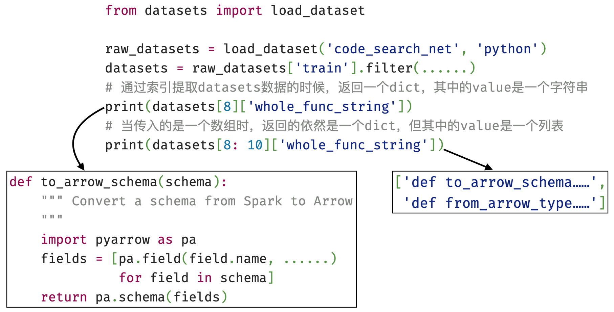
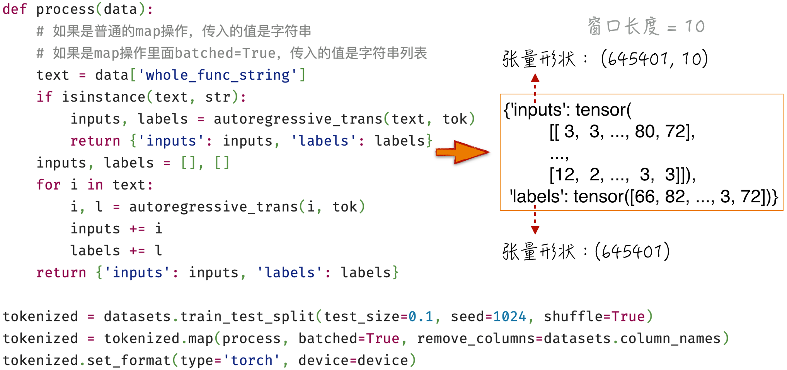
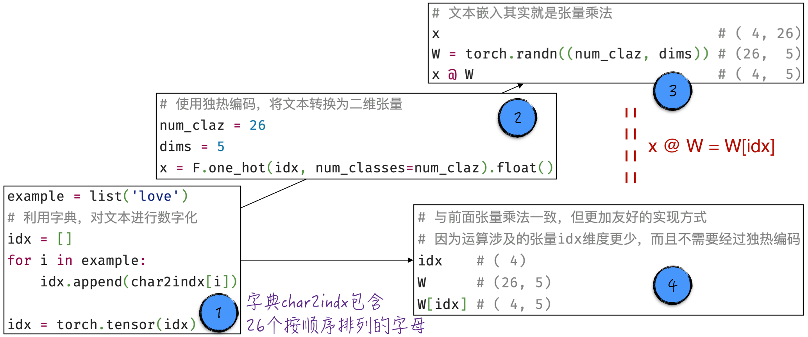
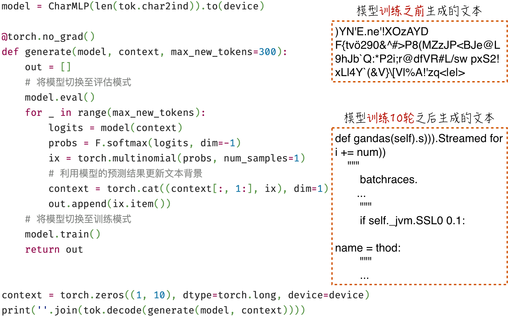

## 10.2 利用多层感知器学习语言

在自回归模式下，我们的目标是根据文本背景预测下一个词元。在这个过程中，模型需要应对以下两个关键问题。

- 变长输入：随着文本的深入，文本背景的长度逐渐增加，因此模型需要处理不定长的输入数据。
- 文字间的关联：模型必须捕捉文字之间的相互关系，以便得到更准确的预测结果。

然而，作为普通神经网络的代表，传统的多层感知器模型未能满足这两个要求。首先，多层感知器的输入形状是固定的；其次，它的模型结构无法直接捕捉文字间的依赖关系。不过，可以通过调整模型输入的方法来巧妙地解决（部分解决）这两个问题，从而成功地将多层感知器用于语言学习。

具体来说，设置一个固定的窗口长度，比如 $n$，然后将模型的输入限制为 $n$ 个连续的词元。这种方法虽然与自回归模式的要求稍有不同，但仍然能够根据部分文本背景预测下一个词元。下面将深入讨论这一方法的细节。

### 10.2.1 数据准备

在学习自然语言处理时，首要步骤是获取充足的语言数据，通常称为语料库。本节将使用开源的 Python 代码作为语料库[^10-2-1]，也就是说，尝试使用神经网络学习如何自动生成 Python 代码。如图 10-7 所示，使用 `datasets` 可以方便地获取已经整理好的开源代码。



在处理获取到的 Python 代码时，正如[第 9 章](/books/deconstructing_LLM/chapter-9)所述，需要完成两个关键任务：首先，将文本数字化；其次，根据自回归模式创建训练数据。

1. 使用字母分词器实现文本数字化。这意味着训练数据中出现的字符将组成分词器的字典，如程序清单 10-1 的第 5 行所示[^10-2-5]。此外，为了标识文本的开头和结尾，引入两个特殊字符 `<|b|>` 和 `<|e|>`，分别表示开头和结尾，如第 7～9 行所示。需要注意的是，这两个特殊字符的具体形式只是为了便于理解，它们并不匹配任何实际字符。
2. 在自回归模式下，创建训练数据的过程涉及将背景文本与预测词元进行配对。具体实现可以参考第 22～24 行代码。由于窗口长度固定，因此在处理文本开头部分时，需要使用表示开始的特殊字符 `<|b|>` 填充文本，以确保模型能够学习文本的最初部分，如第 21 行所示。此外，在文本末尾也需要加上表示结束的特殊字符 `<|e|>`，这个字符会让模型学会如何结束一个文本，即何时停止生成文本。值得注意的是，由于自回归模式的工作原理，一个字符串（原始的 Python 代码）会对应多条训练数据，如第 28～37 行所示。

#### 程序清单 10-1 创建训练数据（[完整代码](https://github.com/GenTang/regression2chatgpt/blob/zh/ch10_rnn/char_mlp.ipynb)）

```python
class char_tokenizer:

    def __init__(self, data, begin_ind=0, end_ind=1):
        # 数据中出现的所有字符构成字典
        chars = sorted(list(set(''.join(data))))
        # 预留两个位置给开头和结尾的特殊字符
        self.char2ind = {s: i + 2 for i, s in enumerate(chars)}
        self.char2ind['<|b|>'] = begin_ind
        self.char2ind['<|e|>'] = end_ind
        self.begin_ind = begin_ind
        self.end_ind = end_ind
        self.ind2char = {i: s for s, i in self.char2ind.items()}
    ...

def autoregressive_trans(text, tokenizer, context_length=10):
    inputs, labels = [], []
    b_ind = tokenizer.begin_ind
    e_ind = tokenizer.end_ind
    enc = tokenizer.encode(text)
    # 增加开头和结尾的特殊字符
    x = [b_ind] * context_length + enc + [e_ind]
    for i in range(len(x) - context_length):
        inputs.append(x[i: i + context_length])
        labels.append(x[i + context_length])
    return inputs, labels

# 举例展示自回归模式的训练数据
tok = char_tokenizer(datasets['whole_func_string'])
example_text = 'def postappend(self):'
inputs, labels = autoregressive_trans(example_text, tok)
for a, b in zip(inputs, labels):
    print(''.join(tok.decode(a)), '--->', tok.decode(b))
<|b|><|b|><|b|><|b|><|b|><|b|><|b|><|b|><|b|><|b|> ---> d
<|b|><|b|><|b|><|b|><|b|><|b|><|b|><|b|><|b|>d ---> e
<|b|><|b|><|b|><|b|><|b|><|b|><|b|><|b|>de ---> f
<|b|><|b|><|b|><|b|><|b|><|b|><|b|>def --->
<|b|><|b|><|b|><|b|><|b|><|b|>def  ---> p
...
```

在完成上述两项准备工作的基础上，就能够将原始数据转换为适用于模型的训练数据，如图 10-8 所示。尽管模型看到的是数字，输出的也是数字，但通过适当的映射和处理，模型也能够与人进行交流[^10-2-2]。这或许更好地诠释了“语言是思想的影子”（Language is the shadow of thought）这一理念。语言背后的思想远比使用的文字更为重要。

回到技术层面，在进行数据转换时，由于涉及一对多的关系，需要使用批量映射（Batch Mapping）操作。有关该操作的细节，请参考相关开源工具的官方文档[^10-2-3]。



### 10.2.2 文本嵌入

有些读者可能会感到困惑，[10.1.1 节](/books/deconstructing_LLM/chapter-10/10-1#section-10-1-1)介绍的语言数字化需要将每个词元转换成 $1\times n$ 的张量（具体细节请参考图 10-2，其中 $n$ 表示字典大小），但是在图 10-8 中，只是将它们转换成了数字——数值表示词元在字典中的位置。这其中的原因是什么呢？

下面通过一个简单例子来解释这个问题。假设有一个包含 26 个字母的字典，命名为 `char2indx`，现在需要将文本 `love` 数字化。

1. 使用字典将文本转换为 $1\times4$ 的张量，其中每个位置的数值表示字母在字典中的位置，如图 10-9 中标记 1 所示。
2. 在此基础上，可以对结果进行独热编码，得到一个 $4\times26$ 的张量，如图 10-9 中标记 2 所示。
3. 然而，使用上述处理方式得到的结果并不会为模型提供足够的有用信息。为了进一步提升数据的表达能力，假设每个词元的语义可以用一个 $1\times5$ 的张量表示。将这个张量的每个维度想象为某种语言特征，而词元与特征张量之间的映射关系是通过模型学习得来的。这一关键操作被称为文本嵌入（Embedding）[^10-2-4]。在代码层面，文本嵌入通过张量乘法实现，具体请参考图 10-9 中标记 3。文本嵌入的目的是提供更具信息量的特征表示，以便神经网络更好地理解和处理文本数据。



对于第 2 步和第 3 步，PyTorch 提供了一种更方便的实现方式，如图 10-9 中标记 4 所示。这种方法更高效，因此在实际应用中通常倾向于使用这种方式，而不是手动实现独热编码后再完成文本嵌入。

根据前面的讨论，可以实现一个简化版本的文本嵌入，示例代码如程序清单 10-2 所示。在进行文本嵌入时，只需传入文本在字典中的位置即可，无须进行不必要的独热编码，见第 13～15 行。事实上，PyTorch 也提供了文本嵌入的封装 `nn.Embedding`，这个封装要求的输入格式与程序清单 10-2 一致，这也解释了为什么[10.2.1 节](/books/deconstructing_LLM/chapter-10/10-2#section-10-2-1)的实现中没有包含独热编码步骤。

#### 程序清单 10-2 文本嵌入（[完整代码](https://github.com/GenTang/regression2chatgpt/blob/zh/ch10_rnn/embedding_example.ipynb)）

```python
class Embedding:

    def __init__(self, num_embeddings, embedding_dim):
        self.weight = torch.randn((num_embeddings, embedding_dim))

    def __call__(self, idx):
        self.out = self.weight[idx]
        return self.out

    def parameters(self):
        return [self.weight]

emb = Embedding(num_claz, dims)
idx.shape, emb(idx).shape
# (torch.Size([4]), torch.Size([4, 5]))
```

### 10.2.3 代码实现

在[10.2.1 节](/books/deconstructing_LLM/chapter-10/10-2#section-10-2-1)和[10.2.2 节](/books/deconstructing_LLM/chapter-10/10-2#section-10-2-2)的基础上，利用多层感知器模型学习语言就变得简单和直接了，具体代码如程序清单 10-3 所示。以下是关键的数据转换步骤。

1. 如第 11 行代码所示，输入数据的形状为 $(B,10)$，其中 $B$ 代表批量大小，10 表示窗口长度。在这个维度下，每个分量表示相应词元在字典中的位置，读者可以参考图 10-8 中的结果来更好地理解这一点。
2. 文本嵌入的长度是 30，也就是使用 30 个特征刻画一个词元。因此，经过嵌入处理后，数据形状变为 $(B,10,30)$，如第 12 行代码所示。
3. 为了将数据传递给多层感知器进行学习，就像在[9.1.2 节](/books/deconstructing_LLM/chapter-9/9-1#section-9-1-2)中处理图像数据时一样，将数据转换成形状为 $(B,300)$ 的张量，如第 13 行代码所示。一旦数据被展平，后续计算就与标准的多层感知器一致了。
4. 在构建模型时，需要确定字典大小，即第 3 行中的参数 `vs`。这个参数用于构建文本嵌入层（第 5 行）和最终输出层（第 8 行）。因此，当字典规模非常庞大时，模型参数数量会急剧增加，从而导致模型难以训练。这也解释了[10.1.2 节](/books/deconstructing_LLM/chapter-10/10-1#section-10-1-2)中的观点：字典规模应该适中。

#### 程序清单 10-3 多层感知器学习语言（[完整代码](https://github.com/GenTang/regression2chatgpt/blob/zh/ch10_rnn/char_mlp.ipynb)）

```python
class CharMLP(nn.Module):

    def __init__(self, vs):
        super().__init__()
        self.embedding = nn.Embedding(vs, 30)
        self.hidden1 = nn.Linear(300, 200)
        self.hidden2 = nn.Linear(200, 100)
        self.out = nn.Linear(100, vs)

    def forward(self, x):
        B = x.shape[0]               # (B, 10)
        emb = self.embedding(x)      # (B, 10, 30)
        h = emb.view(B, -1)          # (B, 300)
        h = F.relu(self.hidden1(h))  # (B, 200)
        h = F.relu(self.hidden2(h))  # (B, 100)
        h = self.out(h)              # (B, vs)
        return h
```

有了搭建好的模型，就可以循环使用它来生成 Python 代码了，甚至可以在进行模型训练之前就生成代码，如图 10-10 所示。在模型训练之前，生成的 Python 代码看起来毫无意义。但通过简单的模型训练后，模型生成的结果已经具备了一些代码雏形。在本例中，模型已经掌握了一些关键字（比如 `def`），以及一些常见的英语单词（比如 `name`）。此外，模型还学到了 Python 代码的基本结构，例如使用缩进表示代码块。



### 10.2.4 普通神经网络的缺陷

本节示例介绍了如何使用普通神经网络处理序列数据。从上述内容中可以了解到，尽管普通神经网络可以通过一些技巧处理序列数据，但存在一些明显的限制和缺陷。

首先，由于模型结构的限制，普通神经网络的输入和输出通常是固定大小的张量。在上面的示例中，模型输入是长度等于 10 的字符串，而模型输出是下一个字符的概率分布。这意味着模型难以有效处理可变长度的输入序列，在某些任务上的表现受限。例如，如果下一个字符的分布概率与窗口之外的字符有关（相关字符在文本中的距离超过 10），那么本节搭建的模型就难以捕捉这种长距离依赖关系。

其次，在普通神经网络中，数据的转换步骤是固定的。例如，在多层感知器模型中，数据的转换步骤由模型层数决定，这些步骤是预先定义的，无法根据数据或特定任务的属性进行自适应调整，也就无法最优地学习复杂的序列数据。

最后，从学习效率的角度来看，在模型训练过程中，尽管训练数据中的文本窗口相互重叠，但模型在处理时却将它们视为独立数据。换句话说，窗口重叠部分的信息每次都被重复计算，这会导致大量计算资源浪费，从而影响模型训练效率。

这些问题促使我们寻求新的模型结构，以更好地对序列数据进行建模。下面将深入讨论一种强大的神经结构——循环神经网络，它能够有效解决上述问题。

[^10-2-1]: 大语言模型（如 ChatGPT）通过学习开源代码获得了极强的推理能力。从书写系统的角度来看，代码类似于英文，这也是大语言模型在英文方面表现更佳的一个原因。通过这个例子可以看到，在自然语言处理领域，语言的范围已经不再局限于传统文本，而是包括所有可以用文字记录的内容。可以将文中使用的数据从 Python 代码替换成数学公式，这样模型就能够展现其在数学方面的学习能力。这体现了大语言模型的多功能性和广泛应用性。
[^10-2-2]: 所有进行自然语言处理的模型（比如 ChatGPT）都是如此，它们学习和预测的都只是数字而已。
[^10-2-3]: 关于批量映射的细节，相应文档的描述其实并不清晰。熟悉大数据处理的读者可以参考 PySpark 中的 `mapPartitions` 和 `flatMap` 操作，批量映射实际上可以看作这两种操作的结合。
[^10-2-4]: 详见[9.2.6 节](/books/deconstructing_LLM/chapter-9/9-2#section-9-2-6)。
[^10-2-5]: 在进行自然语言处理时，由于计算量较大，模型训练时间较长，因此本章提供的代码会优先在 GPU 上运行。如果读者的计算机上没有 GPU，由于随机数的影响，模型结果可能略有不同。
