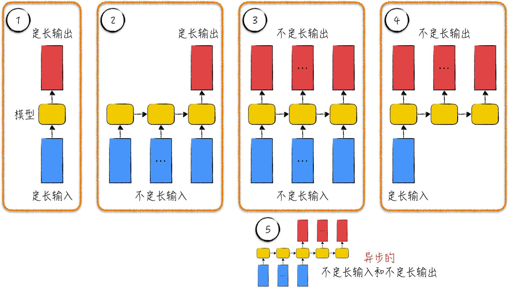
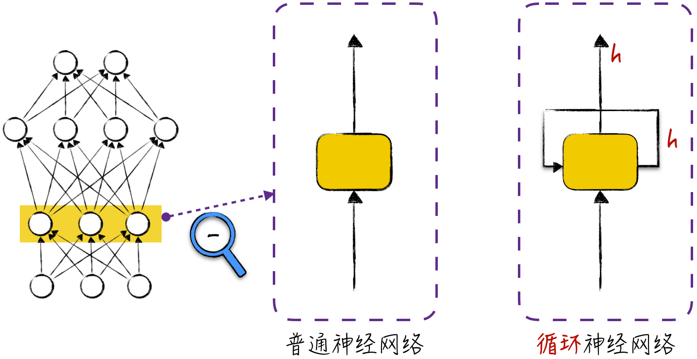
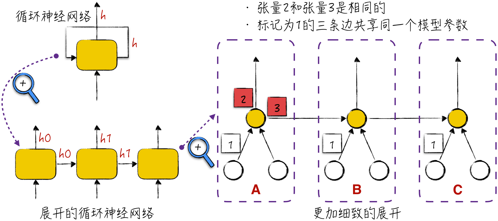
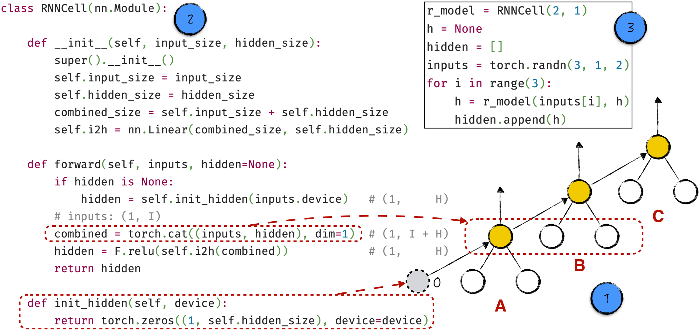
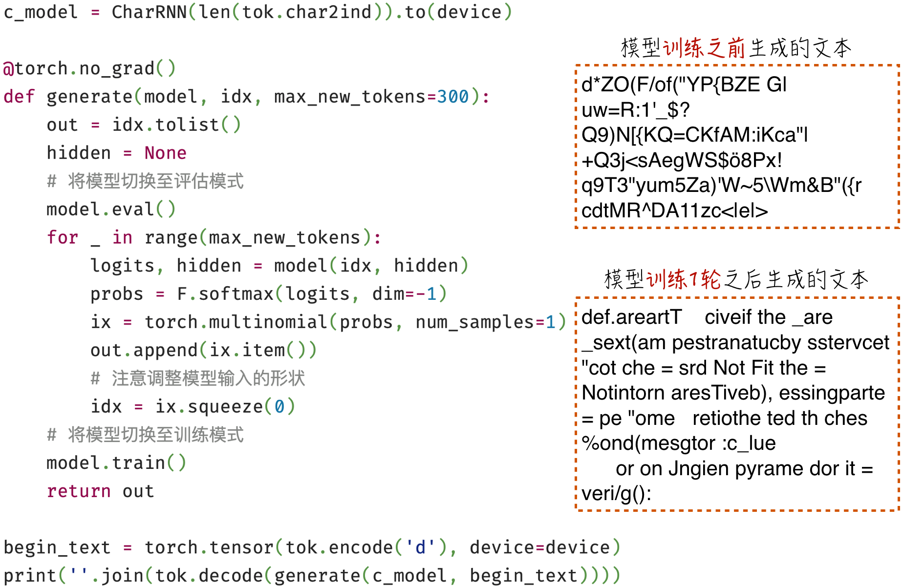
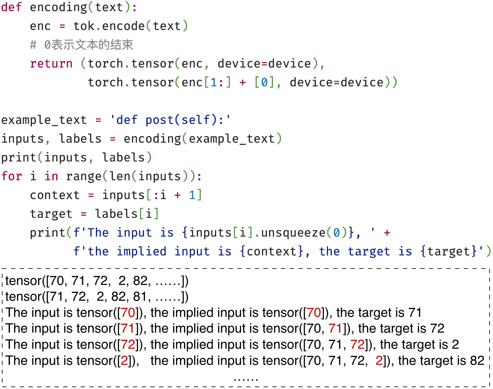
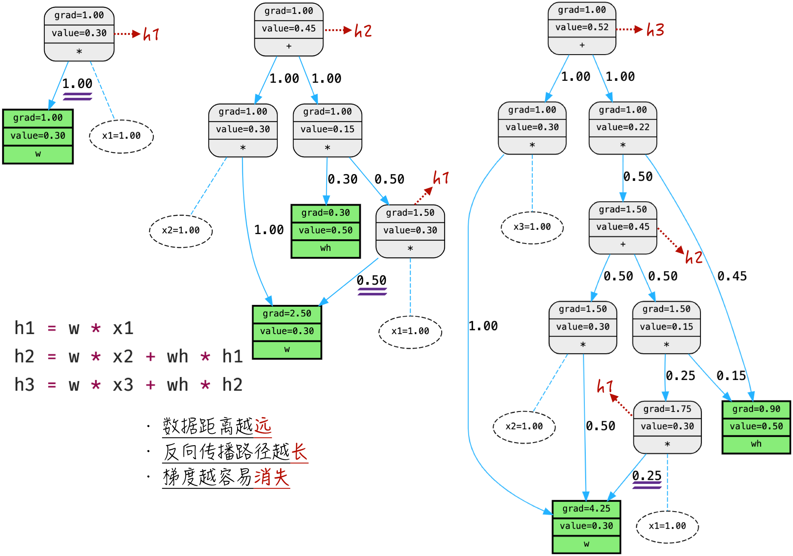

## 10.3 循环神经网络

让我们暂时抛开具体的结构细节，从更宏观的角度审视人工智能领域的模型。在这个角度下，模型就像一个不透明的黑盒子，将张量输入这个黑盒子，然后从中获得一些输出张量。根据输入和输出张量的形状，可以将常见应用场景分为以下 4 种，如图 10-11 所示[^10-3-1]。

1. 定长输入和定长输出，见标记 1。[第 9 章](/books/deconstructing_LLM/chapter-9)讨论的图像识别就属于这一类。
2. 不定长输入和定长输出，见标记 2。理想的文本分类就是这种情况，文本长度不一，模型需要将其分类到预定的固定类别中。同样，理想的自回归模式也属于这一类。
3. 不定长输入和不定长输出，见标记 3。这对应着自然语言处理中的序列到序列模式。在这种场景下，输入和输出的文本长度都是不固定的。需要注意的是，标记 3 的图示可能让人误以为输入和输出同时产生，但实际上它们之间可以是异步的。也就是说，在输入和输出之间可能存在明显间隔，就像标记 5 所示的情况一样。文本翻译是一个典型例子，模型需要阅读完整个输入文本后才开始生成翻译输出。
4. 定长输入和不定长输出，见标记 4。典型例子是图像描述生成任务，即给定一张图片，模型需要生成对图片的文字描述，而描述文本的长度是不固定的。



普通神经网络仅适用于处理第一种场景。本节将讨论的循环神经网络能处理上述所有场景。更令人兴奋的是，它可以自适应地调整数据转换步骤，更高效地从数据中提取信息，因而在众多任务中展现出令人惊叹的性能和预测效果。接下来，我们将深入研究这类模型，并探讨如何将其应用于自然语言处理。

### 10.3.1 图示与结构

普通神经网络的一大特点是采用分层结构组织神经元。在同一层中，神经元相互独立，它们之间没有直接的神经连接。为了清晰展示这一结构特点，可以将同一层中的神经元表示为一个方块（称为神经块），如图 10-12 所示。每个神经块具有两个箭头，分别表示该神经块的输入和输出。

循环神经网络打破了普通神经网络的限制，它允许同一层的神经元通过相互连接传递信息。从图示上看，循环神经网络与普通神经网络的不同之处在于多了一条循环箭头。循环神经网络通常用于处理序列数据，这个箭头表示神经块不仅接收当前数据的输入，还会处理前序数据传递过来的信息。需要特别强调的是，在典型的循环神经网络图示中，输出箭头和循环箭头表示的张量实际上是一致的（如图中的 $h$），通常被称为隐藏状态（Hidden State）。这些隐藏状态构成了模型的核心，也是下一节的主要讨论内容。



图 10-12 可能并不够直观。初看时，我们可能会困惑这样单一的神经块如何处理不定长的输入和输出。另外，循环箭头所代表的神经连接到底是什么样的呢？因此，有必要更细致地研究一下模型图示。

实际上，循环神经网络的结构并不是静态的，而是会随着输入数据进行动态调整。具体来说，假设输入的序列数据长度为 3，那么循环神经网络会自动展开成由 3 个神经块组成的网络。这种展开的、没有循环的网络结构更加直观和易于理解，如图 10-13 左侧所示。



在展开的循环神经网络中，每个神经块都是按照相同方式“重复”构建的，这意味着它们共享参数，类似于[9.2.2 节](/books/deconstructing_LLM/chapter-9/9-2#section-9-2-2)讨论的卷积层。为了更好地理解这一点，下面进一步放大神经块，看看其中隐藏的神经元是如何连接的。为了简化图示，假设输入数据的张量长度为 2，而每个神经块只有 1 个神经元。在处理序列数据时，循环神经网络的工作方式可以用以下步骤描述。

1. 当神经网络接收到输入序列的第一个数据时，神经网络的形态如图 10-13 中的 A 所示。在这个阶段，神经块 A 中的神经元接收第一个数据的输入，并经过计算后输出信号 2。同时，它准备好信号 3，等待序列的下一个数据。
2. 当输入序列的第二个数据到来时，神经网络会增加一个新的神经块，如图 10-13 中的 B 所示。这时，整个神经网络的形态就等于 A+B。在神经块 B 中，神经元将接收 3 个神经元的输入，其中两个来自第二个数据的输入，另一个是前一个神经块 A 的信号 3。神经元的输出部分与神经块 A 的输出部分类似。
3. 上述计算步骤将一直重复，直至序列数据结束。

在图 10-13 中，有两个要点值得注意。

- 输出共享和循环连接：与普通神经网络类似，同一神经元发出的信号是一样的，这意味着对于循环神经网络，对外输出和指向自身的张量相同，比如信号 2 和信号 3。
- 共享参数：信号 1 的三条边共享同一个模型参数，这种设计与卷积层中的共享参数类似。这是循环神经网络的一个关键特性，它不仅有效减少了模型参数、提高了训练效率，还有助于模型捕捉序列数据中的模式和特征。

### 10.3.2 模型的关键：隐藏状态

要想掌握循环神经网络，理解隐藏状态是关键。神经网络是一门工程学科，通过代码实现模型是理解隐藏状态的最佳途径。现在的任务是将循环神经网络的展开形式转化为代码。与之前讨论的普通神经网络不同，循环神经网络的图示（见图 10-13）具有两个可能让初学者感到困惑的特点。

- 水平传递箭头：在循环神经网络中，除了向上传递的箭头，还存在指向自身的水平箭头。在数学角度上，普通神经网络中神经元的计算仅涉及当前输入的数据。而在循环神经网络中，需要将当前数据与隐藏状态结合在一起计算。那么，如何实现这种结合呢？
- 初始神经块的特殊性：第一个神经块与后续神经块不同，它是序列的起始点，因此没有隐藏状态的输入。这使得它的代码实现相对特殊。

这两个特点的描述可能会让人感到困惑，似乎它们的实现很复杂。然而，一旦看到实际代码并理解其原理，就会惊讶地发现它们实际上如此简单和直观。

针对第一点，在图示中将神经块 B 和神经块 C 抬高，使它们的输入神经元与前一个隐藏状态神经元平行，如图 10-14 中标记 1 所示。这一调整使图示与普通神经网络非常相似，看上去更直观。根据这个图示，只需将前一个隐藏状态和当前数据进行张量拼接，然后将拼接好的张量传递给当前的隐藏状态神经元。

此外，第一个神经块 A 仅接收输入数据，没有隐藏状态的输入。为了与其他神经块保持一致，为其设置一个初始隐藏状态，其中所有元素都被初始化为 0。这一调整并不改变计算结果，但消除了初始神经块的特殊性，从而简化了整个模型结构，为代码实现提供了便利。

将上述两点翻译成代码，就得到了如图 10-14 中标记 2 所示的模型实现（[完整代码](https://github.com/GenTang/regression2chatgpt/blob/zh/ch10_rnn/char_rnn.ipynb)）[^10-3-2]。在处理序列数据时，需要循环调用这个模型。假设序列长度为 $n$，那么模型将被调用 $n$ 次。每次调用时，前一次返回的隐藏状态将作为其中一个参数传递给模型，具体代码示例如图 10-14 中标记 3 所示。从模型结构的角度来看，每次调用都会在模型中增加一个神经块[^10-3-3]，这也是循环神经网络得名的原因。



### 10.3.3 利用循环神经网络学习语言

要将循环神经网络应用于自然语言的自回归学习，还需要其他模型组件的协助。

首先，从张量形状来看，循环神经网络输出的张量形状为 $(1,H)$，这里的 $H$ 代表隐藏状态长度。但是，如果模型要预测下一个词元，那么模型输出的张量形状应该是 $(1,VS)$，其中 $VS$ 表示字典大小，即所有可能词元的数量。通常情况下，$H$ 和 $VS$ 这两个数值并不相等，这就导致不能直接使用标准循环神经网络进行自然语言的自回归学习。

其次，我们在阅读文本时会在心中建立对文本意思的整体理解。这个理解一方面随着阅读过程中新出现的内容而不断更新，另一方面也是执行众多任务的基础，比如分析文本的情感色彩或者预测作者接下来可能讲述的内容等。循环神经网络的运行方式正是对这一认知过程的模拟。模型的隐藏状态对应着对文本的理解，更准确地说，隐藏状态是文本的特征表示。基于这个隐藏状态，可以构建模型预测接下来的内容。

这个用于预测的模型通常被称为语言建模头（Language Modeling Head）。通常情况下，它是一个相当简单的线性模型，将形状为 $(1,H)$ 的隐藏状态向量转换为形状为 $(1,VS)$ 的张量，后者蕴含着词元出现的概率——通过使用 Softmax 函数将其转化为词元的概率分布。上述代码实现如程序清单 10-4 所示。

#### 程序清单 10-4 循环神经网络学习语言（[完整代码](https://github.com/GenTang/regression2chatgpt/blob/zh/ch10_rnn/char_rnn.ipynb)）

```python
class CharRNN(nn.Module):

    def __init__(self, vs):
        super().__init__()
        self.emb_size = 30
        self.hidden_size = 50
        self.embedding = nn.Embedding(vs, self.emb_size)
        self.rnn = RNNCell(self.emb_size, self.hidden_size)
        self.h2o = nn.Linear(self.hidden_size, vs)

    def forward(self, x, hidden=None):
        # x: (1); hidden: (1, 50)
        emb = self.embedding(x)         # (1, 30)
        hidden = self.rnn(emb, hidden)  # (1, 50)
        output = self.h2o(hidden)       # (1, vs)
        return output, hidden

c_model = CharRNN(len(tok.char2ind)).to(device)
inputs = torch.tensor(tok.encode('d'), device=device)
hidden = None
logits, hidden = c_model(inputs, hidden)
logits.shape, hidden.shape
# (torch.Size([1, 98]), torch.Size([1, 50]))
```

在模型的实现细节方面，模型输入是一个形状为 $(1)$ 的张量，表示当前词元在字典中的位置。首先，模型会对输入进行文本嵌入，假设嵌入特征的长度为 30，如第 13 行所示。然后，将嵌入后的张量和上一个隐藏状态传递给循环神经网络，以获取当前隐藏状态，如第 14 行所示。这个隐藏状态经过语言建模头的转换，最终生成词元分布的 Logits，如第 15 行所示。

在构建模型的过程中，需要时刻关注每次转换后的张量形状，这对于调试程序和确保模型计算准确性至关重要。当模型构建完成后，可以输入一个随机生成的数据来验证模型输出的形状是否符合预期，具体实现如第 18～23 行所示。有了完整模型后，接下来将讨论如何准备训练数据、进行模型训练，以及如何使用模型生成文本。

### 10.3.4 模型训练与文本生成

模型搭建完成后，随时可以投入使用。在实际应用中，通常会在进行模型训练之前就利用它生成文本，以验证模型实现是否存在问题。

与普通神经网络（见图 10-10）不同，循环神经网络能够自动处理文本的背景信息，无须复杂的人工处理。整个文本生成过程如图 10-15 所示，图中展示了模型训练之后的效果，训练流程的技术讨论见下文。然而，对比这两张图的结果，会发现循环神经网络的效果并不理想。这样的结果主要有两个原因：首先，当前模型的学习效率较低，因此训练轮次有限；其次，循环神经网络在结构上仍有改进空间。这两个问题将在[10.4 节](/books/deconstructing_LLM/chapter-10/10-4)中探讨，这里先重点关注模型训练流程。



模型训练前需要准备数据。在自回归模式下，循环神经网络每次只接收当前词元和上一步生成的隐藏状态作为输入，因此数据准备相对简单，如图 10-16 所示。具体来说，模型训练所需的输入数据和预测标签形状相同。尽管每次输入的数据看起来雷同，但随着输入文本的推进，它们隐含的含义却大不相同。这正是循环神经网络的强大之处，它能够自动处理复杂的背景依赖关系，即使是不定长的背景信息，模型也能够有效捕捉和处理。



循环神经网络的训练方式与普通神经网络有显著不同。在普通神经网络中，各个数据之间相互独立，可以利用张量进行并行计算，因此代码比较简洁且优雅，几乎没有循环结构。在循环神经网络中，数据之间存在相互依赖，无法进行并行计算。因此，在训练模型时，必须逐步生成预测结果，计算模型损失，以进行反向传播和梯度下降。具体实现可以参考程序清单 10-5，其中最关键的步骤是循环累加模型损失，如第 11～13 行所示。

#### 程序清单 10-5 训练循环神经网络（[完整代码](https://github.com/GenTang/regression2chatgpt/blob/zh/ch10_rnn/char_rnn.ipynb)）

```python
epochs = 1
optimizer = optim.Adam(c_model.parameters(), lr=learning_rate)

for epoch in range(epochs):
    for data in datasets:
        inputs, labels = encoding(data['whole_func_string'])
        hidden = None
        loss = torch.tensor([0.], device=device)
        optimizer.zero_grad()
        lens = inputs.shape[0]
        for i in range(lens):
            logits, hidden = c_model(inputs[i].unsqueeze(0), hidden)
            loss += F.cross_entropy(logits, labels[i].unsqueeze(0)) / lens
        loss.backward()
        optimizer.step()
```

循环神经网络是一种十分经典和常用的模型，开源算法库已经提供了成熟而高效的封装[^10-3-4]。读者可以选择直接使用它们提供的封装，或者深入阅读源代码。然而，这些实现通常包含复杂的抽象、层级和继承结构，不但初学者难以理解，甚至经验丰富的专家也可能在代码的迷宫中迷失方向。

前面的讨论提供了一个直观的代码实现，旨在帮助读者更好地理解模型细节。然而，这种实现的计算效率相对较低，极大限制了模型的使用。想象一下，如果一个模型需要花费一年时间进行训练，那么即使其设计结构再精妙，也将失去实际应用价值。如何更高效地实现模型需要较长篇幅的讨论，因此相关内容将在[10.4.1 节](/books/deconstructing_LLM/chapter-10/10-4#section-10-4-1)中呈现。接下来讨论循环神经网络的学习原理。

### 10.3.5 模型的学习原理：通过时间的反向传播

普通神经网络在训练模型时使用反向传播算法计算模型参数的梯度，反向传播算法的细节已在[第 7 章](/books/deconstructing_LLM/chapter-7)中详细讨论过。那么对于循环神经网络，模型参数的梯度计算方法又是什么呢？答案仍然是反向传播算法，或者更确切地说，算法的核心仍然是反向传播。

具体来说，为了计算循环神经网络的参数梯度，首先根据输入的序列数据将模型展开成没有循环的网络，然后在这个展开的网络上应用反向传播算法。学术界通常将这种算法称为通过时间的反向传播（Back Propagation Through Time，BPTT）。

由于循环神经网络会根据序列长度自动展开成庞大的网络结构，因此在直觉上，我们担心它将面临严重的梯度不稳定问题，参考[8.4.4 节](/books/deconstructing_LLM/chapter-8/8-4#section-8-4-4)。这是因为根据之前的讨论，梯度传播路径越长，就越容易出现梯度消失或爆炸。事实上，循环神经网络确实会遇到梯度不稳定问题，但与普通神经网络的情况有所区别，通常被形象地称为“部分不稳定”。

为了更清晰地理解这一问题，下面通过一个简单示例可视化这一现象（[完整代码](https://github.com/GenTang/regression2chatgpt/blob/zh/ch10_rnn/bptt_example.ipynb)）。图 10-17 定义了一个序列数据 $x_1,x_2,x_3$ 及其对应的隐藏状态 $h_1,h_2,h_3$。为了图示简洁，暂时忽略激活函数。当对 $h_3$ 执行反向传播时，由于 $x_1$ 距离输出较远，梯度传播需要经过更长路径，导致 $x_1$ 的梯度贡献急剧减小，从 1 减少到 0.25。随着序列长度增加，这一现象会变得更加明显。

简而言之，当数据与输出之间的距离较远时，其贡献的梯度可以忽略不计，它对模型优化几乎不起作用。这也表明，尽管循环神经网络从结构上可以处理任意长度的序列，但它就像一个健忘的人，只有短期记忆。对于时间久远的数据，虽然它处理过，但几乎都忘记了。



[^10-3-1]: 插图参考自 Andrej Karpathy 的文章 *The Unreasonable Effectiveness of Recurrent Neural Networks*。读者可能会对图中的水平传递箭头感到困惑，但不用担心，这是本章将要讨论的循环神经网络图示。
[^10-3-2]: 循环神经网络的激活函数除了代码中使用的 ReLU，另一个常见选择是 Tanh。
[^10-3-3]: 在计算机中，神经网络以计算图的形式存储。因此，每次调用模型都会向计算图中添加一个神经块。简而言之，对于长度为 $n$ 的输入序列，循环神经网络会自动展开，生成包含 $n$ 个“重复”神经块的网络结构。
[^10-3-4]: PyTorch 为循环神经网络提供的封装是 `nn.RNN`。在这个封装中，线性变换部分包含两个截距项。从概念上来说只需要一个截距项，这里设置两个是为了与 CuDNN（CUDA Deep Neural Network，神经网络的 GPU 计算依赖于此）兼容。类似处理方式也存在于其他循环神经网络模型中，比如长短期记忆网络。
