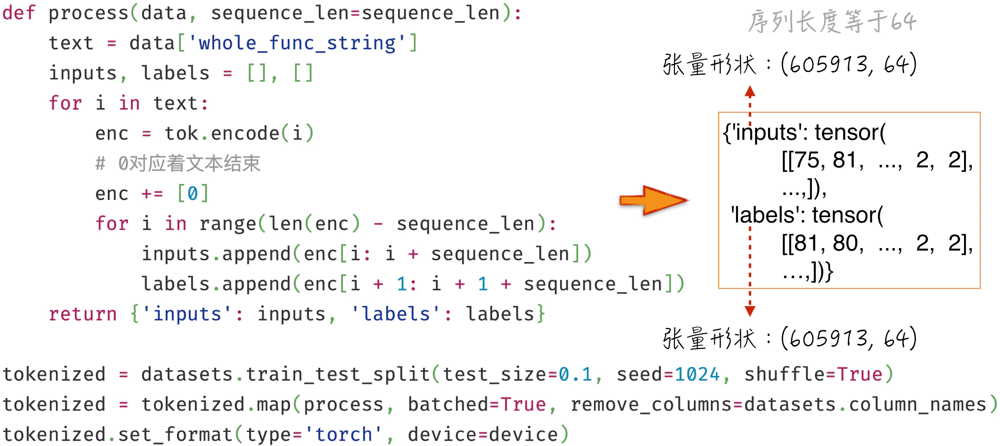
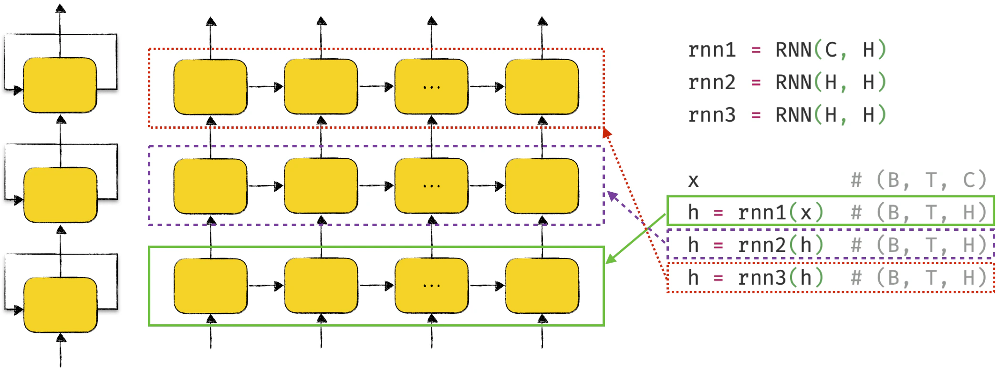
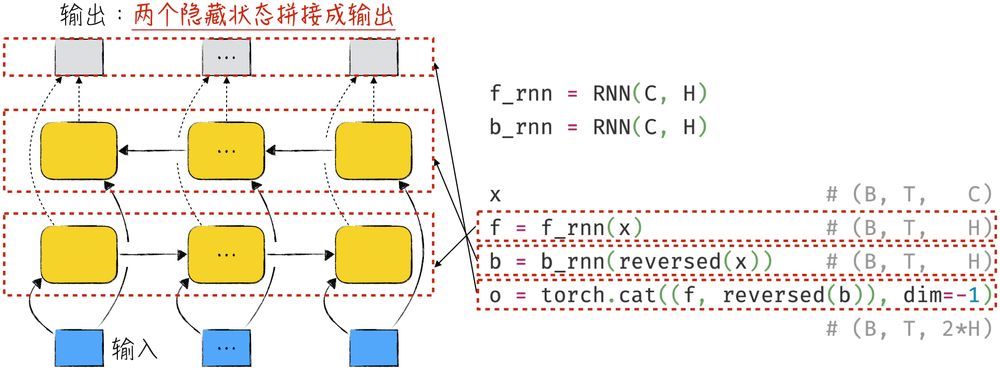
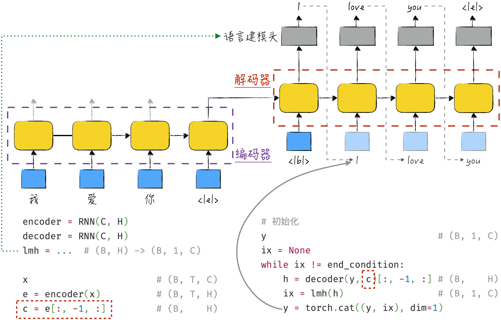
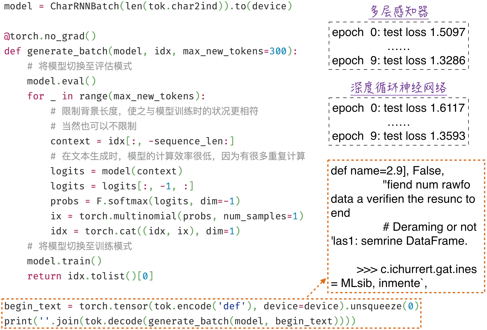

## 10.4 深度循环神经网络

[10.3 节](/books/deconstructing_LLM/chapter-10/10-3)中实现了一个最简单的单层循环神经网络，本节将进一步讨论如何构建更复杂的循环神经网络，并将其应用于自然语言处理。搭建复杂模型的关键在于高效且优雅的代码实现，这也是接下来将要讨论的内容。

### 10.4.1 更优雅的代码实现

模型训练的基础是梯度下降法及其变种，具体细节请参考[第 6 章](/books/deconstructing_LLM/chapter-6)。在这类算法的每个迭代周期内，首先选择一批数据，然后计算模型在这批数据上的损失并进行反向传播。在这个过程中，不同数据的计算相互独立，可以并行执行，这一点同样适用于循环神经网络。

同一序列的模型计算必须串行进行，不同序列的计算仍然可以并行处理。例如，同一文本中的文字必须按顺序处理，但是不同文本可以同时并行处理。因此，提高循环神经网络计算效率的关键在于并行处理批量数据的模型计算。具体代码实现如程序清单 10-6 所示，以下是实现要点。

1. 实现并行计算的首要步骤是将批量数据整合成一个新的、更高维度的张量。假设模型输入数据的形状为 $(B,T,C)$，如第 10～13 行所示。其中，$B$ 代表批量大小（Batch Size），$T$ 代表序列数据长度，$C$ 代表每个元素的特征长度。在自然语言处理领域，$C$ 通常表示文本嵌入特征的长度。需要注意的是，上述计算假设所有输入序列具有相同长度，然而实际应用中，序列长度不同的情况时有发生。[10.4.2 节](/books/deconstructing_LLM/chapter-10/10-4#section-10-4-2)将介绍如何处理这一细节，以确保模型能够灵活适应不同长度的输入序列。
2. 根据前面的讨论，模型将为序列数据中的每个元素生成一个对应的隐藏状态。因此，模型输出形状将为 $(B,T,H)$，如第 22 行和第 23 行代码所示。其中，$H$ 表示隐藏状态长度。
3. 因为序列数据内部需要循环处理，所以需要对输入张量进行转置，将其形状变为 $(T,B,C)$，详见第 14 行。然后，将之前在模型外部执行的循环步骤移到模型内部。具体来说，将程序清单 10-5 中的第 11 行和第 12 行稍做修改，变成程序清单 10-6 中的第 17～20 行。

#### 程序清单 10-6 批量循环神经网络（[完整代码](https://github.com/GenTang/regression2chatgpt/blob/zh/ch10_rnn/char_rnn_batch.ipynb)）

```python
class RNN(nn.Module):

    def __init__(self, input_size, hidden_size):
        super().__init__()
        self.hidden_size = hidden_size
        self.i2h = nn.Linear(input_size + hidden_size, hidden_size)

    def forward(self, x, hidden=None):
        re = []
        # B: batch size
        # T: sequence length
        # C: number of channels
        B, T, C = x.shape
        x = x.transpose(0, 1)  # (T, B, C)
        if hidden is None:
            hidden = self.init_hidden(B, x.device)
        for i in range(T):
            # x[i]: (B, C); hidden: (B, H)
            combined = torch.cat((x[i], hidden), dim=1)
            hidden = F.relu(self.i2h(combined))  # (B, H)
            re.append(hidden)
        result_tensor = torch.stack(re, dim=0)   # (T, B, H)
        return result_tensor.transpose(0, 1)     # (B, T, H)

    def init_hidden(self, B, device):
        return torch.zeros((B, self.hidden_size), device=device)
```

本节提供的实现与 PyTorch 中的 `nn.RNN` 相比，虽然核心实现类似，但是具体接口封装上有一些不同之处。在输入数据方面，本节要求数据的第一个维度表示批量大小，而在 PyTorch 的封装中，默认情况却不是这样。此外，PyTorch 的封装还支持双向和多层循环神经网络，而本节的实现是单层单向的。

### 10.4.2 批量序列数据的处理

上述模型实现对输入数据提出了一项相对严格的要求，即输入序列的长度必须相同。为了使这个模型更具通用性，能够适应长度不一的批量序列数据，通常有两种常见处理方法。

一种是填充数据，即根据批量数据中最长的序列长度，使用特殊字符填充其他序列的空白部分。这种处理方式存在一些问题。首先，由于需要使用特殊字符填充，会导致不必要的计算开销——填充字符并不需要进行模型计算。其次，填充的特殊字符可能使模型产生误解，因为模型无法区分哪部分数据不需要学习。为了应对这两个问题，PyTorch 提供了一系列封装函数，用于更高效地处理填充数据和模型计算，其中包括 `pack_padded_sequence` 和 `pad_packed_sequence` 等函数。关于这些函数的详细信息，请读者查阅官方文档。鉴于篇幅有限，本书不再赘述。

另一种是截断。截断意味着设定一个文本长度 $T$，然后按照这个长度从文本中截取片段用于训练。

在大语言模型中，更常用的方法是截断而不是填充。这样选择有两个主要原因。首先，虽然循环神经网络能够处理任意长度的序列数据，但当处理长距离依赖时，它会面临挑战。因此，太长的序列数据对模型优化帮助不大，选择一个合适的序列长度更有益。其次，采用截断方法可以非常方便地多次学习同一文本。具体来说，如果文本总长度为 $L$，那么可以逐步滑动窗口，生成 $L-T+1$ 个序列片段（相互重叠）。这种方式大幅扩充了训练数据数量，有助于提高模型泛化能力。

图 10-18 所示为截断方法的一种实现，下面将使用它来准备训练数据。一些细心的读者可能会产生疑虑：这个实现似乎不能很好地处理文本长度小于 $T$ 的情况。的确如此，图 10-18 中提供的实现存在一些不足之处，无法处理这种“特殊”情况。它只是一个比较直观的示范，而非最佳实践。



在实际应用中，为了更全面地处理各种情况，通常采取以下方法进行截断：在每个文本末尾添加一个特殊字符来表示结束，比如之前提到的 `<|e|>`。然后，将所有文本连接成一个长串，截断操作将在这个长串上进行。这种方式能够保证即使某个文本的长度小于 $T$，也能正常处理，只是这种情况下截取的数据中包含了表示结束的特殊字符。

### 10.4.3 从单层走向更复杂的结构

前文实现的循环神经网络是单层网络结构。在横向上，模型可以根据输入的序列数据自动展开成一个宽度很大的结构，但从纵向上看，神经网络仍然只有一层。为了提升模型表达能力，类似于多层感知器，循环神经网络也可以增加层数。这意味着可以通过叠加多个循环神经网络层来构建深度循环神经网络（Deep RNN）[^10-4-1]，如图 10-19 所示。深度循环神经网络的展开形式是一个宽度和高度都很大的网络结构。从工程角度来看，模型会首先横向传递信号，然后逐层向上，一层一层地计算。这种方法可以最大限度地实现并行处理，提高模型效率。



前文所讨论的模型不仅是单层的，而且是单向的，即单向循环神经网络（Unidirectional RNN）——模型按照顺序从左到右处理序列数据。这种处理方式的假设是当前数据只依赖左侧文字的背景。然而，在实际应用中，这种假设并不总是成立。以英语为例，冠词 `a` 和 `an` 的使用取决于右侧文字，比如 `a boy` 和 `an example`。

为了提升模型效果，需要引入双向循环神经网络（Bidirectional RNN），如图 10-20 所示。这种双向设计使模型能够更全面地捕捉序列中的依赖关系和模式，提高模型对复杂序列数据的建模能力。在自然语言处理领域，自回归模式只需要单向循环神经网络。但在自编码模式下，要预测被遮蔽的内容，需要考虑左右两侧的上下文，通常需要双向循环神经网络。

值得注意的是，图 10-20 所示的双向循环神经网络仍然只是单层神经结构，也可以叠加多层来提升模型效果。此外，双向循环神经网络的输出使用了张量拼接的处理技巧。这种简单且直观的处理方法在后续许多复杂神经网络中也经常出现。



按照输入/输出的张量形状进行分类，前面讨论的循环神经网络都属于不定长输入、不定长输出的模型，对应图 10-11 中的标记 3。这种模型被称为标准循环神经网络，具有广泛适用性，简单调整后可适应各种复杂的应用场景。下面以标准循环神经网络为基础举例，构建一个用于解决翻译问题的模型，其具体结构如图 10-21 所示。



模型中包含两个标准循环神经网络，分别被称为编码器（Encoder）和解码器（Decoder）[^10-4-2]。在图 10-21 中，编码器会逐步读入中文文本。它为每个输入词元生成相应的隐藏状态，我们主要关注最后一个隐藏状态，它包含了整个文本的信息，会被传递给解码器。

解码器的运作方式与编码器有所不同，它不需要生成全零的初始隐藏状态，而是接收来自编码器的隐藏状态作为起点。在解码器中，初始输入序列是表示文本开始的特殊字符 `<|b|>`。与文本生成时的步骤类似，解码器会将预测结果添加到输入序列中，然后再次触发模型预测——这个过程依赖其他模型组件，例如图 10-21 中的语言建模头 `lmh`。如此循环，解码器逐步生成目标文本，完成翻译任务。

按照输入/输出张量形状进行分类，编码器是不定长输入、定长输出的模型，对应图 10-11 中的标记 2。解码器将定长输入映射到不定长输出，对应图 10-11 中的标记 4。当编码器和解码器结合在一起时，就构成了图 10-11 中的标记 5。

### 10.4.4 利用深度循环神经网络学习语言

根据上述讨论，下面将构建一个双层的单向循环神经网络，用于语言学习。具体模型细节可以参考程序清单 10-7。为了防止过拟合，模型对每一层输出进行了随机失活（Dropout）操作，如第 16～17 行代码所示。在实际应用中，这一设计几乎已经成为循环神经网络的标准配置。

#### 程序清单 10-7 深度循环神经网络（[完整代码](https://github.com/GenTang/regression2chatgpt/blob/zh/ch10_rnn/char_rnn_batch.ipynb)）

```python
class CharRNNBatch(nn.Module):

    def __init__(self, vs):
        super().__init__()
        self.emb_size = 256
        self.hidden_size = 128
        self.embedding = nn.Embedding(vs, self.emb_size)
        self.dp = nn.Dropout(0.4)
        self.rnn1 = RNN(self.emb_size, self.hidden_size)
        self.rnn2 = RNN(self.hidden_size, self.hidden_size)
        self.h2o = nn.Linear(self.hidden_size, vs)

    def forward(self, x):
        # x: (B, T)
        emb = self.embedding(x)      # (B, T, C)
        h = self.dp(self.rnn1(emb))  # (B, T, H)
        h = self.dp(self.rnn2(h))    # (B, T, H)
        output = self.h2o(h)         # (B, T, vs)
        return output
```

与[10.3.4 节](/books/deconstructing_LLM/chapter-10/10-3#section-10-3-4)的实验结果相比，新模型的预测效果有了一定改善，但仍然未能达到理想水平。如图 10-22 所示，它的表现与多层感知器旗鼓相当，这主要是由于循环神经网络在处理长距离依赖关系时表现不佳，[10.5 节](/books/deconstructing_LLM/chapter-10/10-5)将深入讨论这一问题。



值得注意的是，如果参考图 10-19，本节使用随机失活的方式实际上是在处理神经网络中的纵向信号。然而，这不是唯一方式，也可以对神经网络中的横向信号执行相似操作，也就是在隐藏状态上引入失活操作。这一方法在学术界被称为循环失活（Recurrent Dropout）。

虽然 PyTorch 提供的封装中并不包含循环失活，但实现这一功能并不困难，只需在程序清单 10-6 的基础上稍做修改即可。这个例子清楚展示了神经网络的灵活性，同时印证了我们不仅需要理解神经网络模型设计的细节，还需要通过代码实现它。这样就可以根据实际需求自主增添相应的模型组件，而不必受限于开源工具的开发进度和设计选择。

[^10-4-1]: 这种模型也可以被称为多层循环神经网络（Multi-Layer RNN）。
[^10-4-2]: 著名的语言模型 Transformer，其基本结构也分为编码器和解码器两个主要部分。
