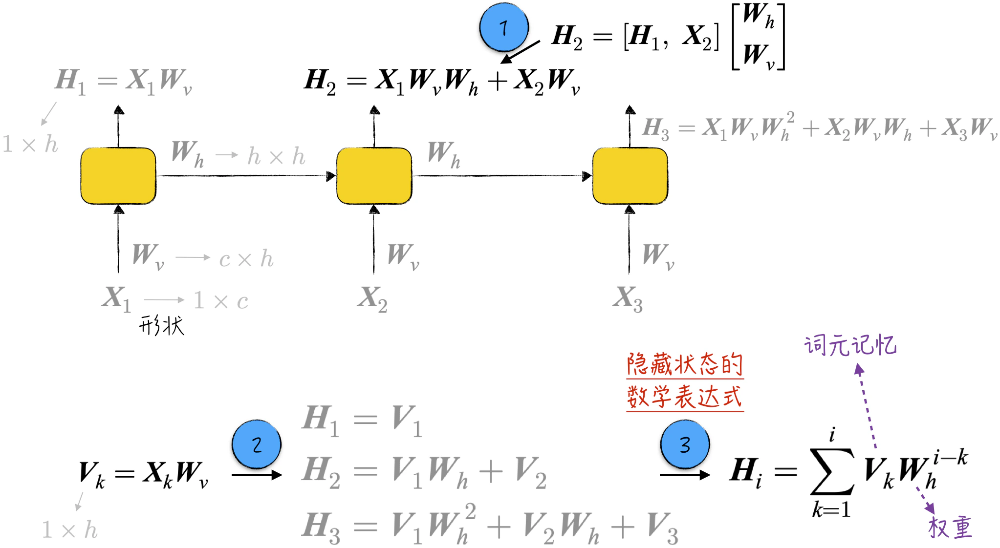
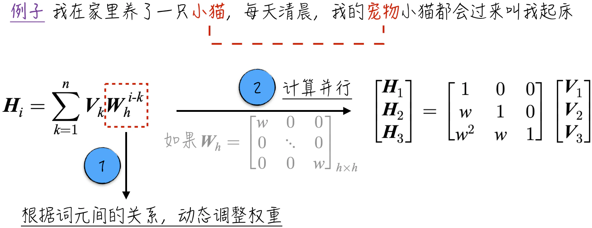
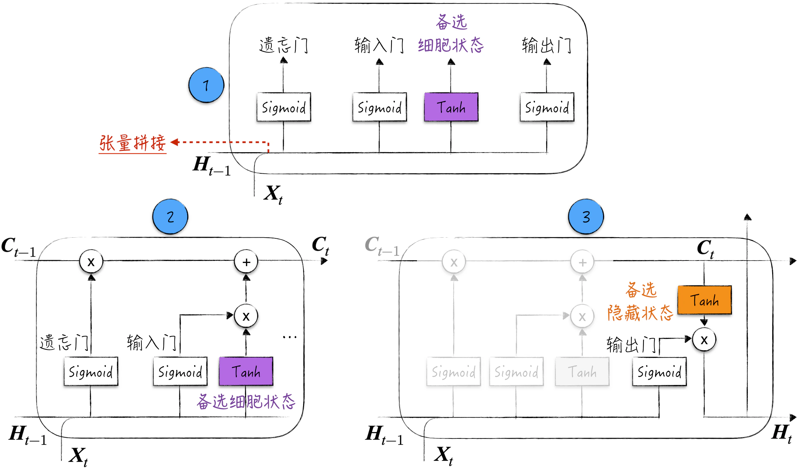
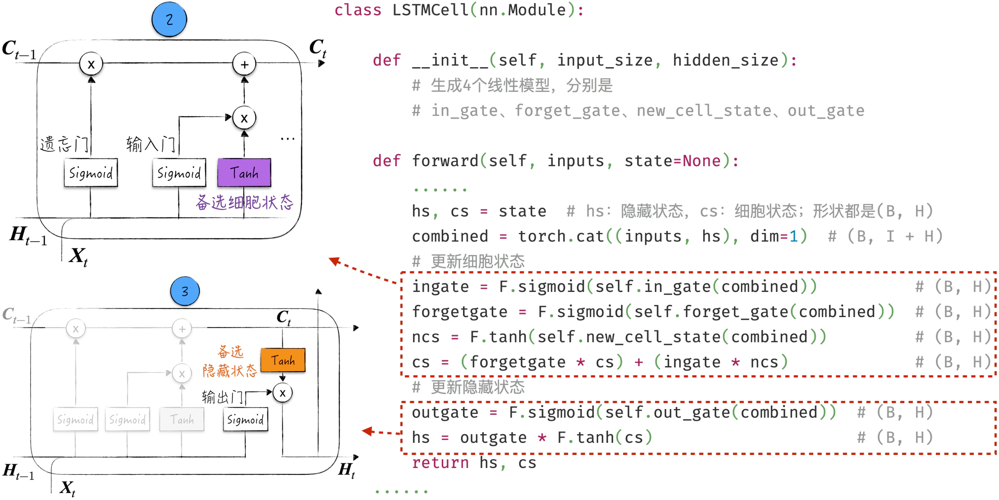
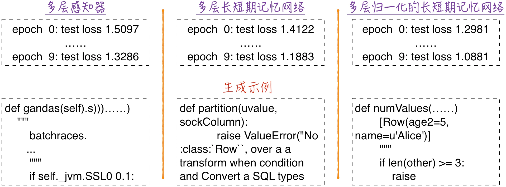

## 10.5 长短期记忆网络

标准循环神经网络在处理长距离依赖关系时表现不佳，这限制了它在自然语言处理等领域的应用。从前面的讨论中可以看出，这种模型似乎只能从距离较近的数据中获取信息，学术上将这一特性形象地称为短期记忆。为了改进这一问题，学术界引入了经典的长短期记忆网络（Long Short-Term Memory，LSTM）[^10-5-1]。

这个名字有点奇怪，经常让人感到困惑。实际上，正确的断句方式应该是“长-短期记忆-网络”。这种断句方式能够准确表达这个模型想要解决的问题，即如何在模型中长时间保留短期记忆，使模型能够更有效地处理长距离依赖关系。

LSTM 是一种比较古老的模型，它的设计可以追溯到 1995 年，正式文章于 1997 年发表。这个模型的设计非常巧妙，但由于其结构复杂、难以训练，因此在很长一段时间内只被视为学术界的研究课题，鲜有成功的业界案例。随着 GPU 计算和模型训练技术的发展，这个模型逐渐在语音识别、文本翻译、游戏等领域取得了广泛应用。其发展历程充分体现了神经网络是一门非常注重实践的学科。一个模型要想成功，不仅要考虑模型理论结构的优雅，还需要关注如何在工程上高效落地，这在实际场景中往往更加关键。

下面将深入探讨 LSTM 的细节，并提供代码实现以展示如何在自然语言处理领域应用它。

### 10.5.1 短期记忆

[10.3.5 节](/books/deconstructing_LLM/chapter-10/10-3#section-10-3-5)已经从反向传播的角度直观介绍了短期记忆，但由于尚未在数学上对其进行严格定义和讨论，我们对这个问题的理解仍然不够深刻。实际上，短期记忆问题在神经网络领域至关重要。为了解决这一问题，涌现了一系列著名模型，其中包括本节讨论的长短期记忆网络，以及当前备受追捧的大语言模型。因此，本小节的核心内容是深入探讨短期记忆的数学原理和可能的解决方法。

在循环神经网络中，隐藏状态是模型进行预测的基础，但它只有相当短的记忆能力。以自然语言处理为例，每一步的隐藏状态理论上应该是从文本到当前位置的特征表示，然而实际上，每一步的隐藏状态只能记录最近几个词元的信息。

由于隐藏状态的更新需要使用激活函数，使得短期记忆问题在数学上变得比较烦琐。然而，忽略激活函数的存在并不会影响我们理解问题的关键或得出结论[^10-5-2]。因此，接下来的讨论将不考虑激活函数，以简化数学推导过程。

图 10-23 中引入了一些数学记号：$\boldsymbol X_k$ 代表输入数据，$\boldsymbol H_i$ 代表相应隐藏状态，它们的形状分别为 $1\times c$ 和 $1\times h$。在隐藏状态的更新过程中，模型对前一个隐藏状态和当前输入数据进行张量拼接，然后进行线性变换。

为了更清晰地理解隐藏状态的更新细节，将处理隐藏状态的参数表示为 $\boldsymbol W_h$，将处理输入数据的参数表示为 $\boldsymbol W_v$。使用矩阵乘法（参考图 10-23 中标记 1），可以得到隐藏状态的数学表达式，如公式（10-1）所示。

$$
\boldsymbol H_i=\sum_{k=1}^{i}\boldsymbol X_k\boldsymbol W_v\boldsymbol W_h^{i-k}
\tag{10-1}
$$



现在关注图 10-23 中的标记 2。在计算中，引入了一个新变量 $\boldsymbol V_k$，它等于 $\boldsymbol X_k$ 与 $\boldsymbol W_v$ 的乘积。这个新变量只由词元本身决定，与它在文本中的位置无关，因此可以将新变量看作词元本身的特征表示。基于这一理念，将隐藏状态的数学表达式改写成如下形式：

$$
\boldsymbol H_i=\sum_{k=1}^{i}\boldsymbol V_k\boldsymbol W_h^{i-k}
\tag{10-2}
$$

在公式（10-2）中，可以将 $\boldsymbol W_h^{i-k}$ 理解为权重，那么隐藏状态可以被视为所有词元特征的一种加权平均。或者更形象地说，把 $\boldsymbol V_k$ 看作词元所带来的记忆，那么隐藏状态就是所有词元记忆的加和。通常情况下，模型参数 $\boldsymbol W_h$ 分布在接近 0 的范围内，这导致当距离时间步较远时，$\boldsymbol W_h^{i-k}$ 会迅速趋近于 0。因此，在隐藏状态中，只有距离较近的词元的记忆会被保留，这就是所谓的短期记忆现象。

从上面的公式可以看出，循环神经网络存在一些不太令人满意的问题。隐藏状态是所有词元记忆的加和，但是每个记忆的权重主要受到距离影响，这体现为公式（10-2）中的乘方项。当距离较远时，由于乘方效应，权重会迅速减小。模型难以表达元素之间的相似关系，也就无法有效处理长距离依赖关系。

考虑这个句子：我在家里养了一只小猫，每天清晨，我的宠物小猫都会过来叫我起床。当模型处理到“宠物”这个词时，它需要与前面的“小猫”建立强关联。换句话说，对于这一步的隐藏状态，“小猫”的权重应该很大，这样可以帮助模型预测下一个词元也是“小猫”。然而，公式（10-2）表明模型无法有效处理这种长距离依赖关系。为了解决这个问题，需要重新设计权重项，使其能够更好地反映词元之间的相关性。这正是注意力机制（Attention Mechanism）的主要改进之处，相关细节将在[11.1.2 节](/books/deconstructing_LLM/chapter-11/11-1#section-11-1-2)中详细讨论。

如果进一步将 $\boldsymbol W_h$ 限定为一个数量矩阵（Scalar Matrix），那么可以用矩阵乘法表示所有隐藏状态的计算，如图 10-24 所示。与循环神经网络中的串行处理相比，例如程序清单 10-6 中的第 17～21 行，这种计算方式可以进行并行计算，更加高效。从另一个角度来看，基于下三角矩阵的矩阵乘法在某种程度上等同于循环的累加过程。按照这个思路，可以对循环神经网络中的循环部分进行调整，在保留核心特性的同时提高计算效率。这也是注意力机制的另一个创新点，具体细节请参考[11.1.3 节](/books/deconstructing_LLM/chapter-11/11-1#section-11-1-3)。



### 10.5.2 模型结构

在标准循环神经网络中，每个神经元由一个线性变换和一个激活函数组成。神经元接收前一个隐藏状态和当前输入两个张量作为输入，得到当前隐藏状态并将其输出。隐藏状态有两个作用：参与下一个隐藏状态的计算，以及预测当前数据的标签。

长短期记忆网络的改进主要体现在神经元结构上。与标准循环神经网络不同，它引入了更复杂的神经元结构，包括两个关键状态：细胞状态（Cell State）和隐藏状态。隐藏状态的作用类似于标准循环神经网络，细胞状态用于长距离信息传递。具体来说，在长短期记忆网络中，神经元接收 3 个张量作为输入，分别是前一个细胞状态、前一个隐藏状态，以及当前输入。神经元会根据内部算法更新细胞状态和隐藏状态，并生成相应输出。需要强调的是，通常只使用隐藏状态预测当前数据的标签。

长短期记忆网络神经元的运算相对复杂，不再只是简单的线性和非线性叠加。这是因为它需要同时维护和更新两个状态，以确保细胞状态能够有效传递长距离信息。为了更好地处理这一任务，模型引入了一个重要组件——门控（Gate）。门控的作用是决定哪些信息应该被保留，哪些信息应该被遗忘。

虽然这个概念看起来有些抽象，但在数学上非常清晰。可以将这一过程表示为张量乘法 $\boldsymbol r=\boldsymbol g*\boldsymbol x$。其中，$\boldsymbol x$ 是一个 $1\times h$ 的张量，表示备选信息；$\boldsymbol g$ 同样是一个 $1\times h$ 的张量，其值在 0 到 1 之间变化。当 $\boldsymbol g$ 的某个分量等于 1 时，$\boldsymbol x$ 中对应位置上的信息被完全保留；当 $\boldsymbol g$ 的某个分量等于 0 时，$\boldsymbol x$ 中对应位置上的信息被完全遗忘；当 $\boldsymbol g$ 的分量处于 0 和 1 之间时，表示只保留部分信息。

引入门控概念后，模型的计算流程可以概括如下。

1. 类似于标准循环神经网络，将上一个隐藏状态和当前输入进行张量拼接，如图 10-25 中标记 1 所示。
2. 模型更新细胞状态。基于拼接张量，模型生成两个关键门控：遗忘门（Forget Gate）和输入门（Input Gate）。同时，模型还会基于拼接张量生成一个备选细胞状态。最终，通过组合上一个细胞状态、遗忘门、输入门和备选细胞状态，模型将生成新的细胞状态，如图 10-25 中标记 2 所示。
3. 模型更新隐藏状态。模型基于更新后的细胞状态生成备选隐藏状态，并基于拼接张量生成输出门（Output Gate）。最终，这两者协同作用，生成最终的隐藏状态，如图 10-25 中标记 3 所示。



将上述计算流程应用到自然语言处理领域，可以更清晰地理解细胞状态和隐藏状态在学习语言时所扮演的不同角色。细胞状态并不直接与当前输入互动，因此它主要用于存储文本知识。与此不同，隐藏状态与当前输入密切合作，专注于处理新信息，包括生成新的信息和更新文本知识等。这样明确的分工巧妙地平衡了信息的长期积累和短期处理，使模型能够高效处理长距离依赖关系。

前文对于模型结构的讨论可能会给初学者带来困扰，模型图示看起来相当复杂，难以理解。此外，烦琐的数学推导也可能让一些读者感到抽象。为了帮助读者更好地理解模型细节，下面将上述图示翻译成代码。这往往是理解模型的最佳途径，尽管模型看起来复杂，但其代码实现相对更加清晰。

### 10.5.3 代码实现

在长短期记忆网络中，神经元的核心包括两个状态，即细胞状态和隐藏状态。在代码实现中，通常使用相同形状的张量表示它们——也可以选择使用不同形状的张量，但这只会增加代码实现的复杂性，没有任何实际益处。在这个设定下，图 10-26 展示了神经元的核心实现（[完整代码](https://github.com/GenTang/regression2chatgpt/blob/zh/ch10_rnn/lstm.ipynb)）。其结构看起来复杂，但基本要素仍然是线性模型和非线性变换。



首先是实现门控这个核心组件。由于门控的输出范围在 0 到 1 之间，所以使用线性模型与 Sigmoid 函数的组合来实现它。图 10-26 中的变量 `ingate`、`forgetgate` 和 `outgate` 分别对应输入门、遗忘门和输出门。这些门控的作用非常关键，有助于控制信息流动和细胞状态更新。

接下来讨论细胞状态的更新过程。为了更清晰地理解这一过程，将模型置于自然语言处理的背景中。首先利用 Tanh 函数和线性模型生成备选细胞状态 `ncs`。输入门和备选细胞状态的乘积可以被理解为新添加的文本知识，遗忘门和细胞状态 `cs` 的乘积代表从上一步保留下来的文本知识，将这两者相加，便得到了新的细胞状态。

在这个更新过程中，有两点特别关键。

1. 激活函数的选择：与门控的 Sigmoid 函数[^10-5-3]不同，这里使用的 Tanh 函数实际上就是这个神经元的激活函数。这意味着可以根据需要将 Tanh 函数替换为其他激活函数，比如效率更高的 ReLU 函数[^10-5-4]。在普通神经元中，激活函数的输出就是神经元的输出，而在这里，激活函数的输出需要经过门控筛选，才能最终成为神经元的输出。需要注意的是，由于每个神经元有两个输出，因此除了生成备选细胞状态，激活函数还被用于生成备选隐藏状态。如果要更改激活函数，需要同时更改这两个地方。
2. 双组件设计：在细胞状态更新过程中，模型采用两个组件表达新的文本知识。这或许让人感到疑惑，因为输入门和备选细胞状态的输入相同，输出的张量形状也相同，那么为什么不直接通过一个模型生成新增的文本知识呢？这个设计之所以存在，是为了模拟人类获取知识的两个过程：一个是基于新信息提取知识，另一个是决定哪些新知识需要被长期存储。当然，这种设计并不是唯一正确的方式。在后续研究中，也出现了对长短期记忆网络的改进和变种，其中一些并没有输入门[^10-5-5]。这个例子展示了神经网络作为实用型学科与其他理工科的不同之处。在神经网络领域，很多时候并没有绝对的对与错，只要大的思路正确，结构细节对结果的影响有时并不大。这与人类学习相似，每个人的学习方法各不相同，但只要方向正确，都可以取得相似的学习效果。

隐藏状态的更新与细胞状态类似，因此不再详细讨论具体过程。

### 10.5.4 利用长短期记忆网络学习语言

一旦实现了神经元，搭建长短期记忆网络就变得相对简单，它与循环神经网络的实现非常相似，在此不展示具体实现步骤。但需要提醒的是，对于复杂模型的实现，确保代码准确性是一项具有挑战性的任务。有些数学细节即使出现错误，程序仍然能够正常运行，因此很难发现问题。一种有效方法是查找其他人的实现代码，并将两者的计算结果进行比对。对于经典模型，PyTorch 等深度学习框架提供了相应封装，可以通过比对这些封装来确保程序正确性。此外，通过这个过程，读者还可以加深对模型的理解，提高对开源工具的掌握水平。具体实施步骤可以参考本书配套代码。

为了完成 Python 语言的学习任务，我们搭建了一个多层长短期记忆网络[^10-5-6]，如程序清单 10-8 所示。为了提高模型训练效率，除使用随机失活外，还引入了归一化层，详细内容请参考[8.5.4 节](/books/deconstructing_LLM/chapter-8/8-5#section-8-5-4)，这些改进可以在第 23～25 行代码中看到。在模型中还可以增加其他优化模型训练的技术，但对于长短期记忆网络，或者更一般的循环神经网络，归一化层是最具讨论价值的。

#### 程序清单 10-8 多层长短期记忆网络（[完整代码](https://github.com/GenTang/regression2chatgpt/blob/zh/ch10_rnn/lstm.ipynb)）

```python
class LSTM(nn.Module):
    ...

class CharLSTM(nn.Module):

    def __init__(self, vs):
        super().__init__()
        self.emb_size = 256
        self.hidden_size = 128
        self.embedding = nn.Embedding(vs, self.emb_size)
        self.dp = nn.Dropout(0.4)
        self.lstm1 = LSTM(self.emb_size, self.hidden_size)
        self.norm1 = nn.LayerNorm(self.hidden_size)
        self.lstm2 = LSTM(self.hidden_size, self.hidden_size)
        self.norm2 = nn.LayerNorm(self.hidden_size)
        self.lstm3 = LSTM(self.hidden_size, self.hidden_size)
        self.norm3 = nn.LayerNorm(self.hidden_size)
        self.h2o = nn.Linear(self.hidden_size, vs)

    def forward(self, x):
        # x: (B, T)
        emb = self.embedding(x)                   # (B, T, C)
        h = self.norm1(self.dp(self.lstm1(emb)))  # (B, T, H)
        h = self.norm2(self.dp(self.lstm2(h)))    # (B, T, H)
        h = self.norm3(self.dp(self.lstm3(h)))    # (B, T, H)
        output = self.h2o(h)                      # (B, T, vs)
        return output
```

首先，需要明确的是，归一化层分为层归一化和批归一化。在循环神经网络中，通常采用层归一化。这是因为批归一化的做法是对同一批次的数据计算平均值和标准差，再进行归一化处理。这种方法的隐含假设是同一批次的数据具有相似性。然而，在序列数据中，这个假设通常不成立。以自然语言处理为例，相同文字在文本中的不同位置可能具有完全不同的语义。因此，在不同位置的数据之间进行归一化处理在理论上不太合适。即使按照序列的不同位置分别计算统计信息再做归一化，使用批归一化也会遇到困难：在使用模型时，如果遇到了比所有训练数据更长的序列，那么批归一化就难以处理了。

其次，关于归一化层的使用，可以像上述方法一样，在每一层后面都添加归一化层。这样确实能提升模型训练效率，但它与设计归一化层时的初衷有些不符。最初设计归一化层的目的是确保不同层的激活函数具有相似输入，以加速模型训练过程。因此，最佳实践是将归一化层直接放在激活函数之前，而不是在不同层之间插入归一化层。

上述最佳实践建议将归一化操作嵌入神经元内部。具体而言，需要重新设计长短期记忆网络的神经元，示例代码如程序清单 10-9 所示。请特别留意第 20 行代码，在应用非线性变换之前执行归一化操作[^10-5-7]。此外，值得注意的是，输入门、遗忘门、备选细胞状态和输出门的输入都相同，因此可以将这 4 个组件的线性变换合并在一起，如第 8 行和第 9 行所示。在需要时，可以利用第 20 行的 `chunk` 函数将它们分开。这种实现方式在 PyTorch 等开源工具中十分常见，能够使代码变得更加清晰和简洁。

#### 程序清单 10-9 归一化的长短期记忆网络（[完整代码](https://github.com/GenTang/regression2chatgpt/blob/zh/ch10_rnn/lstm.ipynb)）

```python
class LSTMLayerNormCell(nn.Module):

    def __init__(self, input_size, hidden_size):
        super().__init__()
        self.input_size = input_size
        self.hidden_size = hidden_size
        combined_size = self.input_size + self.hidden_size
        self.gates = nn.Linear(
            combined_size, 4 * self.hidden_size, bias=False)
        self.ln_gates = nn.LayerNorm(4 * self.hidden_size)
        self.ln_c = nn.LayerNorm(self.hidden_size)

    def forward(self, inputs, state=None):
        B, _ = inputs.shape  # (B, I)
        # state: ((B, H), (B, H))
        if state is None:
            state = self.init_state(B, inputs.device)
        hs, cs = state
        combined = torch.cat((inputs, hs), dim=1)  # (B, I + H)
        i, f, c, o = self.ln_gates(self.gates(combined)).chunk(4, 1)
        ingate = F.sigmoid(i)      # (B, H)
        forgetgate = F.sigmoid(f)  # (B, H)
        outgate = F.sigmoid(o)     # (B, H)
        # 更新细胞状态
        ncs = F.tanh(c)            # (B, H)
        cs = self.ln_c((forgetgate * cs) + (ingate * ncs))  # (B, H)
        # 更新隐藏状态
        hs = outgate * F.tanh(cs)  # (B, H)
        return hs, cs
    ...
```

这两个模型对相同数据进行训练，可以获得相似结果，如图 10-27 所示[^10-5-8]。需要注意的是，将归一化操作嵌入神经元内部的效果更佳，也更符合归一化层的设计原理。

归一化层的使用反映了神经网络领域中两个看似矛盾的特点。一方面，神经网络的构建非常灵活，只要输入/输出的张量形状能够互相匹配，模型组件可以自由组合。除了极少数情况，几乎不存在绝对正确或错误的结构。因此，在构建模型时，可以充分发挥创造力和想象力。另一方面，每个模型组件都有一些隐含的最佳使用方式，这需要我们深入了解组件细节。只有尽可能遵循最佳实践，才能充分发挥组件的潜力。



[^10-5-1]: 这个模型的创始人是来自德国的学者，模型名称也反映了德语中喜欢合成复合词的习惯。
[^10-5-2]: 通常情况下，循环神经网络采用的激活函数是 ReLU。当输入大于 0 时，ReLU 表现为一个恒等变换；当输入小于 0 时，则将输入映射为 0。将小于 0 的值映射为 0 代表完全遗忘，这进一步加重了短期记忆问题。如果激活函数是 Tanh，由于在 0 附近的导数等于 1，也近似于恒等变换。
[^10-5-3]: Sigmoid 函数在模型中的主要作用是进行信息筛选。根据门控的定义，它的输出范围被限制在 0 到 1 之间，因此通常情况下，很难将这个函数替换为其他函数。在某些文献中，Sigmoid 函数也被称为门控激活函数。
[^10-5-4]: 在长短期记忆网络被发明时，ReLU 函数并没有出现。不过几乎可以确定，如果在模型中使用 ReLU 函数，会得到更优的模型性能。
[^10-5-5]: 长短期记忆网络在近 30 年的发展历程中，一直秉持着其核心思想，但具体结构和组件发生了多次演化和改进。因此，在学习神经网络时，应该灵活思考，深入理解其背后的原理，而不是死记各种网络的结构和数学公式。
[^10-5-6]: 这个模型包含数十万个参数，如果使用 CPU 进行计算，需要较长时间，然而在自然语言处理领域，这仍然是一个很“迷你”的模型。
[^10-5-7]: 将归一化操作嵌入神经元还有其他实现方式。例如，将当前输入和隐藏状态分开处理，分别对它们进行线性变换和归一化操作。
[^10-5-8]: 这并不是模型的极限，可以继续训练模型以进一步改善预测效果。另外，尽管应用随机失活技术降低了过拟合风险，但随着模型规模增加，过拟合仍然是一个常见问题。在这种情况下，可以考虑在模型损失函数中添加一些惩罚项来解决这个问题。更多详细内容请参考[9.1.5 节](/books/deconstructing_LLM/chapter-9/9-1#section-9-1-5)。
