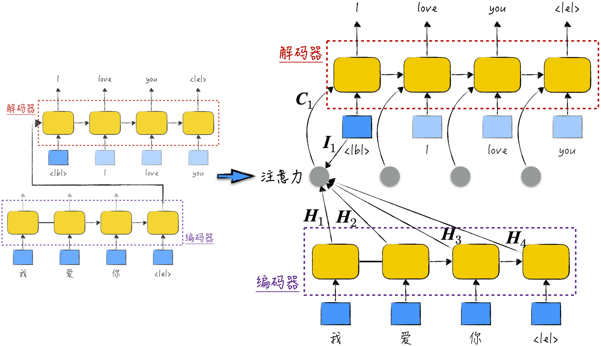
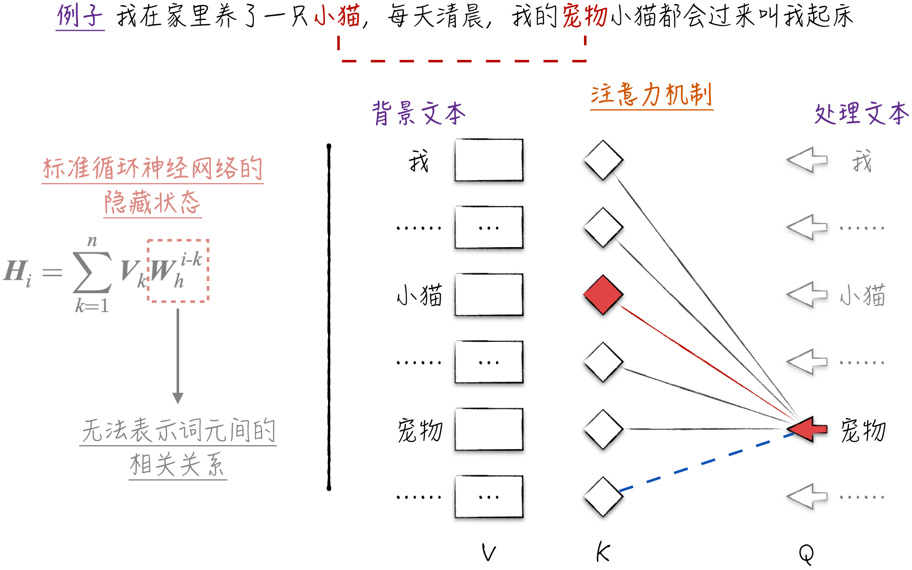
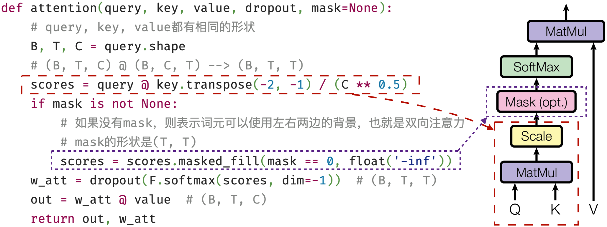
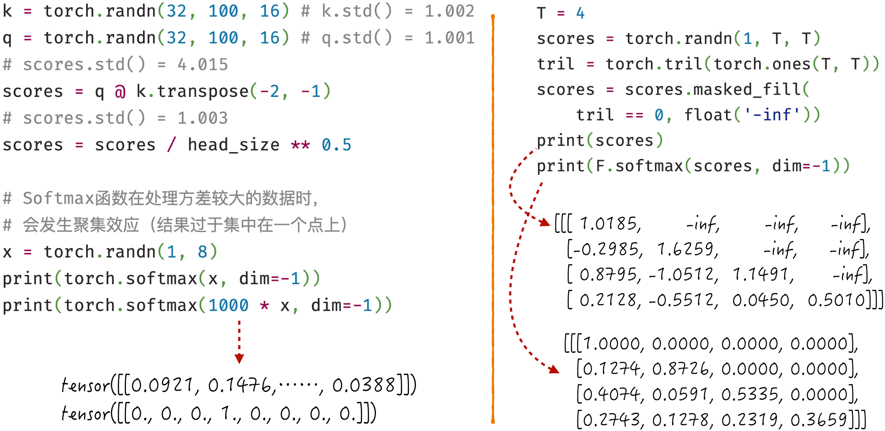

## 11.1 注意力机制

大语言模型最重要的设计是注意力机制（Attention Mechanism）。这一设计能够高效地捕捉语言中错综复杂的依赖关系，使模型深刻理解语言。正如[第 10 章](/books/deconstructing_LLM/chapter-10)所述，语言是人类智慧的栖息之所。一旦模型能够出色地理解语言，尤其是多种语言，那么它将理解语言中蕴含的人类智慧，这在一定程度上解释了为什么模型能在多个领域呈现出令人惊艳的效果[^11-1-1]。

首先，追溯注意力机制的历史，介绍其设计初衷。接下来，深入研究在不同的训练模式下注意力机制的变化，其中包括自回归、自编码和序列到序列（可参考[10.1.5 节](/books/deconstructing_LLM/chapter-10/10-1#section-10-1-5)）。最后，通过代码示例高效实现注意力机制，为搭建大语言模型奠定基础。

### 11.1.1 设计初衷

设计注意力机制最初是为了解决翻译问题。[10.4.3 节](/books/deconstructing_LLM/chapter-10/10-4#section-10-4-3)已经简要介绍了编码器-解码器结构，如图 11-2 左侧所示（详细内容请参考图 10-21），其中包含两个标准循环神经网络，它们相互协作，通常用于处理翻译任务。然而，这个结构存在一个明显的不足，即两个组件之间的唯一交互是编码器在处理完整个输入文本后传递给解码器的隐藏状态，也就是一个向量。从拟人的角度来看，编码器通过阅读文本，将文本的知识浓缩成了一个向量，然后解码器根据这个向量将文本翻译成另一种语言。这个处理过程中最重要的假设是：能使用一个向量完整地表示一个文本。换句话说，无论文本多长，文本中的所有内容都可以被压缩成一个向量，这显然是不够合理的，尤其是对于长文本，这种方式容易丢失大量的信息。

因此，学术界对这一模型框架进行了改进，引入了注意力机制。在编码器-解码器结构中，原本使用单一的隐藏状态来传递信息，但会导致模型性能受限。受此启发，在注意力机制中，编码器在每一步产生的隐藏状态都直接参与到解码器的计算中，如图 11-2 右侧所示。

具体来说，注意力机制利用当前输入的数据和编码器的所有隐藏状态，计算一个额外的背景向量（Context Vector），用于辅助解码器的预测。这一过程可以分为 3 个关键步骤。

1. 计算对齐分数（Alignment Score）：在翻译过程中，一个至关重要的任务是确定接下来要翻译的内容与原文中的哪个位置最相关。以图 11-2 为例，当解码器的输入是“I”时，需要准确地确定接下来的翻译应该与原文中的“爱”对齐。为了达到这一目的，需要将解码器的当前输入与编码器的所有隐藏状态进行逐一配对，然后计算得到相应的对齐分数[^11-1-2]。沿用图中的数学符号，这一过程可以被表示为公式（11-1）。

$$
s_{i,j}=f(\boldsymbol I_i,\boldsymbol H_j)
\tag{11-1}
$$

2. 将对齐分数转换为权重：对齐分数的大小反映了在翻译过程中应该将多少注意力放在相应的位置上，这正是注意力机制这个名字的由来。由于每个位置都有相应的对齐分数，我们需要将这些分数合理地转化为权重，以确保它们的总和等于 1，且每个分量都是正数。为了满足这一要求，通常使用 Softmax 函数。整个转换过程可以用公式（11-2）来表示。

$$
\begin{aligned}
\boldsymbol W_i &= \operatorname{Softmax}(\boldsymbol S_i) \\
\boldsymbol W_i &= (w_{i,1},w_{i,2},\cdots,w_{i,n});\quad
\boldsymbol S_i=(s_{i,1},s_{i,2},\cdots,s_{i,n})
\end{aligned}
\tag{11-2}
$$

3. 加权平均以获得背景向量：编码器的隐藏状态本身包含了有关语义的信息。利用第 2 步中获得的权重，对这些隐藏状态进行加权平均，从而得到背景向量。背景向量综合考虑了注意力的位置和相关的语义信息，为翻译任务提供了出色的特征表示。具体如公式（11-3）所示[^11-1-3]。

$$
\boldsymbol C_i=\sum_{j=1}^{n}w_{i,j}\boldsymbol H_j
\tag{11-3}
$$

这就是最初版本的注意力机制[^11-1-4]。在这种设计中，模型同时考虑两个文本，一个是输入，另一个是输出。对于输出文本的每个词元（读者可以将其简单理解为中文词语或英文单词，准确的定义请参考[10.1.2 节](/books/deconstructing_LLM/chapter-10/10-1#section-10-1-2)），我们在输入文本中寻找相关的注意力位置。然而，这种设定限制了它仅适用于序列到序列模式。为了能在更广泛的场景中使用这个精妙的设计，学术界引入了更通用的注意力机制，这将是[11.1.2 节](/books/deconstructing_LLM/chapter-11/11-1#section-11-1-2)的讨论重点。

### 11.1.2 改进后的注意力机制

如果综合考虑公式（11-1）到公式（11-3），会发现注意力机制的核心本质是特征提取，也就是为文本内容找到更好的特征表示，即背景向量。尽管每一步的隐藏状态可以很好地反映文本内容，但它同时参与了权重的计算。这种双重身份容易让它顾此失彼，从而影响模型的性能。为了解决这个问题，下面将暂时离开循环神经网络的框架，借鉴上述 3 个公式，设计一个改进后的注意力机制。

改进后的注意力机制中仍然区分背景文本和处理文本，不同之处在于，两者可以是同一个文本。为文本中的每个词元引入 3 个向量，分别为查询向量（Query）、键向量（Key）和数值向量（Value），分别用 Q、K 和 V 表示，如图 11-3 所示。最终的特征表示是通过以下计算步骤获得的。

1. Q 和 K 用于计算词元之间的对齐分数。具体来说，将处理文本中的当前输入（使用 Q）与背景文本中的每个词元（使用 K）逐一匹配，然后计算它们的内积，得到对齐分数。
2. 基于对齐分数，计算得到权重向量。
3. 通过权重向量对 V 进行加权，最终得到背景向量。

注意力机制的核心步骤涉及 3 个重要向量：Q、K、V。其中，Q 代表当前词元需要查询的信息，K 代表词元在文本中的背景信息，V 代表词元自身的特征。因此，注意力机制可以被非常通俗地理解为：文本内容的特征表示是词元特征的加和平均，权重主要反映词元间的相关关系。这一机制避免了标准循环神经网络的一个缺陷，即难以有效捕捉词元间的关联关系（见图 11-3 左侧部分，具体细节请参考[10.5.1 节](/books/deconstructing_LLM/chapter-10/10-5#section-10-5-1)）。值得注意的是，背景向量的数学公式（可参考公式（11-3））与隐藏状态非常相似，因此注意力机制也被视为循环神经网络的一员。

改进后的注意力机制对使用场景没有限制。当处理文本和背景文本不同时，算法被称为交叉注意力（Cross-Attention），它将会被用在序列到序列模式中。当处理文本和背景文本相同时，将其称为自注意力（Self-Attention），它的使用场景是自回归和自编码模式。它们的不同点在于：在自回归模式下，模型仅关注词元左侧的对齐分数（图 11-3 中虚线部分被强制设为 0），这类注意力被形象地称为单向注意力（Unidirectional Attention）；在自编码模式下，计算对齐分数没有这种限制（图 11-3 中虚线部分会正常计算），这类注意力被称为双向注意力（Bidirectional Attention）。

### 11.1.3 数学细节与实现技巧

在介绍了注意力机制的核心步骤之后，接下来将深入讨论它的数学细节，以及如何在代码中高效地实现它。

改进的注意力机制将两个向量的内积定义为对齐分数，因此可以利用张量计算来执行注意力机制。详细的算法定义和实现代码如图 11-4 所示。前文的理论介绍仅关注单个词元，但实际的代码实现需要尽可能地提升运算效率。因此，假设 `query`、`key` 和 `value` 的形状都是（B, T, C），其中 B 表示批量大小，T 表示文本长度，C 表示词元特征长度。在这种设定下，图 11-4 中的代码能够以并行方式处理批量数据，相比于传统的循环神经网络，这是一项显著的改进。

图 11-4 所示的算法在学术上被称为缩放点积注意力（Scaled Dot-Product Attention）[^11-1-5]。在具体计算中，有两个特别的细节处理，分别是图 11-4 中的缩放（Scale）和掩码（Mask），对模型结果和计算效率有很大影响。

- 缩放：对齐分数等于两个向量的内积，因此向量的长度越长，对齐分数的方差就越大。而对于 Softmax 函数，如果输入数据的方差很大，它生成的权重分布会过于集中在某一个点，如图 11-5 左侧所示，这显然不符合模型的期望。因此，在计算内积后，需要对得到的对齐分数进行归一化处理，以确保它的方差等于 1。
- 掩码：在自回归模式下，词元只能使用位于图 11-5 左侧的文本背景。这意味着在数学上，用于加权平均的权重矩阵应该是一个上三角矩阵。为此将使用以下数学技巧：将对齐分数矩阵的上三角元素设置为负无穷（或者绝对值很大的负数），然后通过 Softmax 函数转换得到理想的上三角权重矩阵，如图 11-5 右侧所示。

[^11-1-1]: 大语言模型在众多其他领域表现卓越。然而，到目前为止，“为何这些模型如此出色”仍然存在争议，尚无定论。这里提供的是其中一种解释，笔者也倾向于支持这一观点，鼓励感兴趣的读者查阅其他文献提供的解释，以便更深入地了解这一话题。
[^11-1-2]: 对齐分数有多种不同的计算方式，其中一种直观的方法是计算当前输入向量与隐藏状态向量的内积，并将其作为对齐分数。此外，也可以搭建一个简单的神经网络来完成这一计算。
[^11-1-3]: 根据[10.4.1 节](/books/deconstructing_LLM/chapter-10/10-4#section-10-4-1)的内容，隐藏状态可以被解释成词元特征的加和，从形式上来看，这与公式（11-3）非常相似。因此，背景向量可以被看作隐藏状态的一种改进和升级，将其作为循环神经网络的输入是非常合理的。
[^11-1-4]: 这个设计源自论文“Neural Machine Translation by Jointly Learning to Align and Translate”。
[^11-1-5]: 这是最著名的注意力机制之一，源自论文“Attention Is All You Need”。其他变种的注意力机制都遵循相似的核心原理和设计思想。正如在[10.4.3 节](/books/deconstructing_LLM/chapter-10/10-4#section-10-4-3)中讨论长短期记忆网络时强调的，理解神经网络的关键在于掌握其核心思想，而不是死记硬背具体的模型结构和公式。
