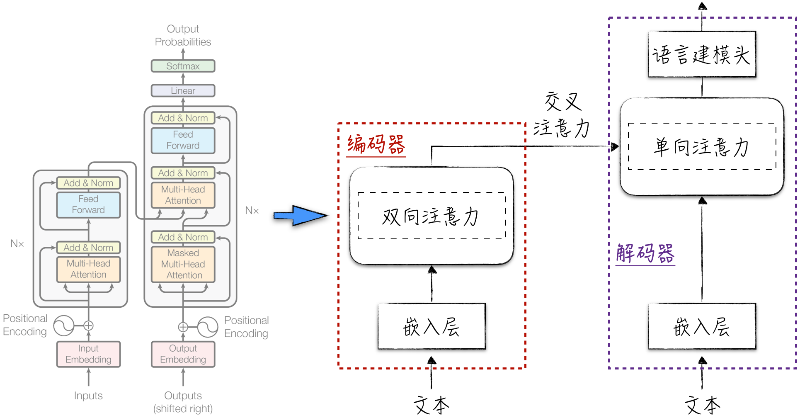
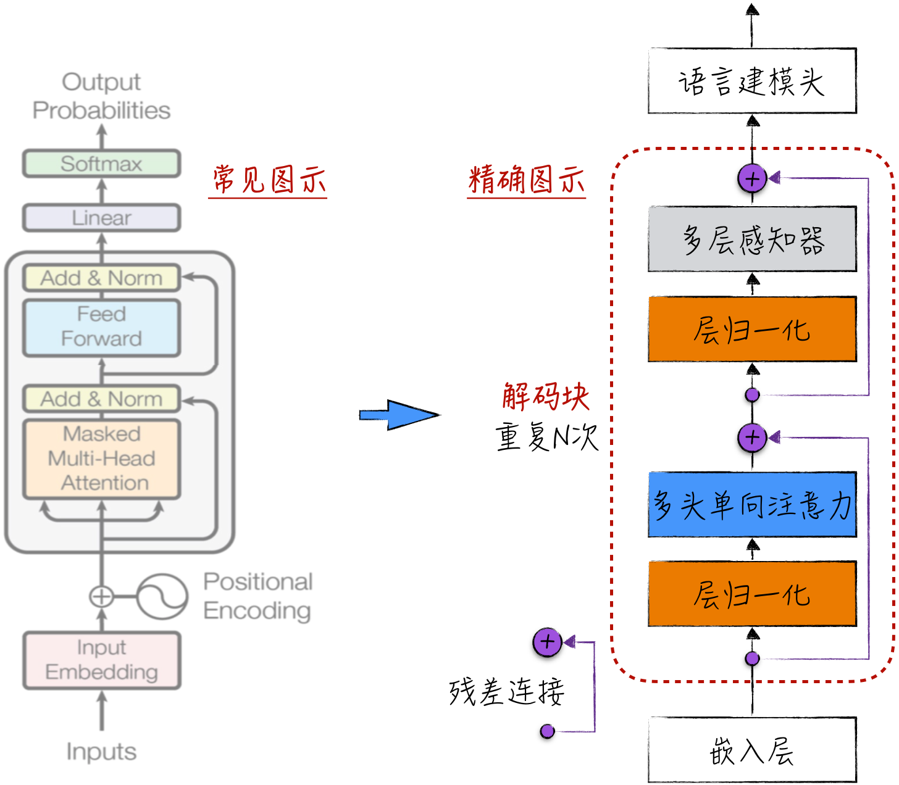
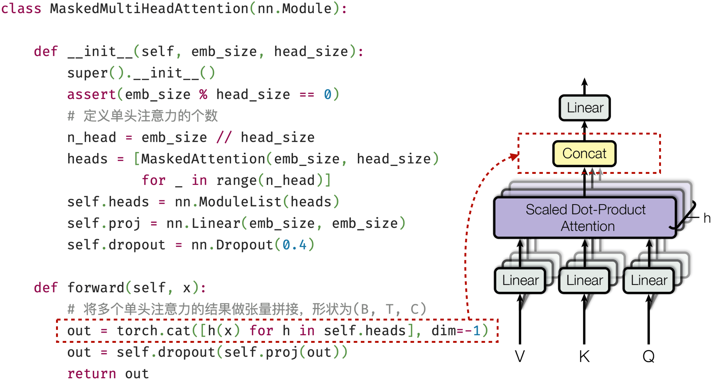
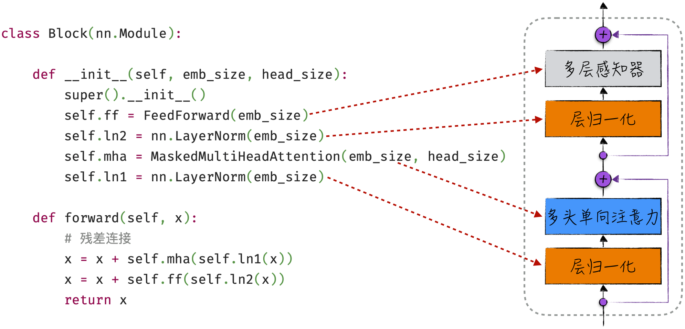
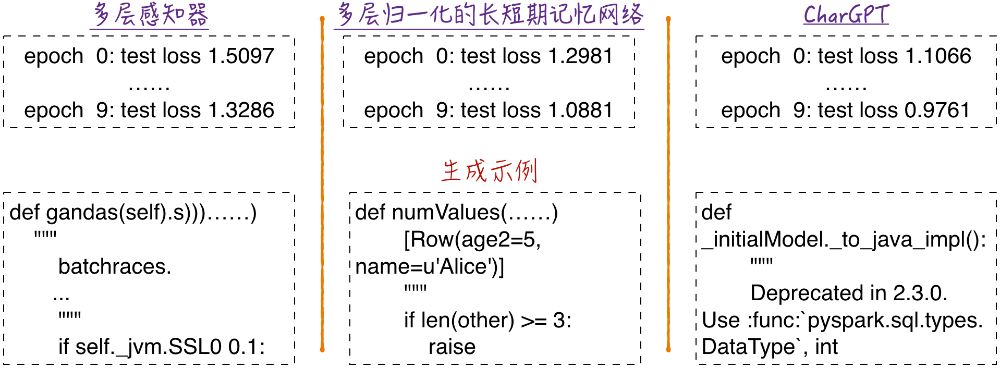

## 11.2 从零开始实现 GPT-2

大语言模型这个商业术语正如其名，强调了这类模型的一个共同特点，那就是“大”。这主要体现在三个方面：首先，这类模型拥有大规模的模型参数，其数量级通常在数十亿到数千亿之间；其次，为了训练这些模型，需要大规模的数据集，语料库的总长度常常达到万亿级别；最后，由于前两个因素的影响，训练这些模型的成本也相当巨大。2023 年，从零开始训练一个最先进的大语言模型需要数千台专业服务器，花费高达数百万美元。

从技术角度看，大语言模型并没有一个明确的定义。通常，它指的是包含注意力机制且用于自然语言处理的神经网络模型。尽管不同的大语言模型在结构上存在较大差异，但从发展历史来看，它们都有一个共同的祖先：Transformer。图 11-6 左侧展示了模型的详细结构，这是从 Transformer 模型的原始论文中摘取的，因此在相关文献中被广泛引用。这个图示中包含大量细节，可能会让读者迷失方向。因此，本书更倾向于使用图 11-6 右侧的简化示意图，以便更清晰地理解模型的整体架构。

Transformer 模型具备完整的编码器和解码器结构，因此通常应用于序列到序列模式[^11-2-1]。从注意力的角度来看，它包含 3 种不同类型的注意力机制，分别是双向注意力，用于编码器；单向注意力，用于解码器；以及交叉注意力，用于编码器和解码器的协同工作。

复杂的结构提高了模型在翻译等任务中的性能，也使它的应用范围受到限制。为了更广泛地应用这一架构，出现了两种不同的改进和简化方式：一种是仅使用图 11-6 中的编码器部分（只包含双向注意力），通常用于自编码模式，最著名的代表是 BERT；另一种是只包含图 11-6 中的解码器部分（只包含单向注意力），通常用于自回归模式，其中最著名的是 GPT[^11-2-2]。



就结构而言，以 GPT 为代表的单向注意力模型是最简单的，在工程处理和训练数据准备方面也最为便捷。也许正因如此，这类模型取得了最引人瞩目的成就。因此，本章的讨论重点是这类模型的经典代表：GPT-2。从实用角度来看，尽管存在更卓越的单向注意力模型，但它们通常规模巨大，难以在普通的家用计算机上运行，更不用说训练了。相比之下，GPT-2 的规模适中，适合在家用计算机上运行，我们可以下载、使用或修改该模型，以便更好地理解其原理。（但要注意，最好在配备 GPU 的服务器上进行模型训练，在家用计算机上训练模型可能需要非常长的时间。）

本章将从零开始构建 GPT-2 模型[^11-2-3]，帮助读者深入理解模型的关键结构和实现技巧。由于大语言模型在结构上有一些相似之处，在掌握了 GPT-2 的实现方法后，也就具备了实现其他大语言模型的能力。

### 11.2.1 模型结构

总体来说，GPT-2 的结构可以分为 3 个主要部分，自下而上分别是嵌入层、多次重复的解码块，以及语言建模头，如图 11-7 右侧所示。其中，解码块（Decoder Block）是至关重要的组成部分，包含 4 个核心元素：多头单向自注意力（Masked Multi-Head Attention）、残差连接、层归一化和多层感知器[^11-2-4]。多层感知器是一个相对被人熟知的概念，残差连接和层归一化是提高模型训练效果的关键技术，具体的细节见[8.5.4 节](/books/deconstructing_LLM/chapter-8/8-5#section-8-5-4)和[9.3.1 节](/books/deconstructing_LLM/chapter-9/9-3#section-9-3-1)，这里不再详述。或许会让读者感到困惑的是多头单向自注意力，它只是自注意力机制的改进版本，在初步理解时，可以将其等同于普通的注意力。基于上述内容，在深入细节之前，再从宏观上讨论这个模型的独特之处。

GPT-2 的图示与神经网络图示有一些显著不同，特别是解码块。在神经网络发展的早期，研究人员通常从仿生学的角度来构建模型，因此引入了神经元、全连接和隐藏层等概念。随着研究的深入，学术界发现神经网络的核心本质是线性计算和非线性变换的多层叠加。因此，研究人员突破神经元连接方式的限制，设计了卷积神经网络和循环神经网络。不仅如此，他们还改进了神经元的内部结构，设计了长短期记忆网络。

GPT-2 的解码块延续了这一创新思路。尽管它的内部结构难以用传统的图示表示，但这并不重要，因为它的设计承载了神经网络的核心理念。如[11.1.3 节](/books/deconstructing_LLM/chapter-11/11-1#section-11-1-3)所述，注意力机制只涉及线性计算，层归一化和残差连接也同样如此。因此，整个解码块实际上是线性计算和非线性变换的叠加。其中，非线性变换来自多层感知器，这也是解码块中包含多层感知器的原因之一。

从类比的角度来看，注意力机制是对循环神经网络的改进。尽管在图示上无法准确表示，但解码块实际上是循环神经网络和多层感知器的组合。在理解复杂神经网络时，读者不应固守传统的图示，而应从计算意义的角度理解各个运算步骤的作用，这有助于更深刻地理解模型。

在其他文献中，GPT-2 的结构经常被表示为图 11-7 左侧的形式。这个图示沿用了经典 Transformer 的画法，便于理解模型的主要组件，但并不是 GPT-2 的精确结构。对比图 11-7 左右两侧可以发现，两者最重要的差异在于层归一化的位置：左侧先计算注意力或多层感知器，再进行残差连接和层归一化，这种结构被称为后归一化（Post-Norm）；右侧先对输入进行层归一化，再将其送入注意力或多层感知器，这种结构被称为前归一化（Pre-Norm）。原始 Transformer 使用 Post-Norm，而 GPT-2 使用 Pre-Norm。

层归一化的位置看似只是结构细节，却会显著影响模型的训练过程。研究表明，Post-Norm 在初始化时可能使靠近输出端的梯度过大，因此通常更依赖学习速率预热和谨慎的超参数设置；Pre-Norm 的梯度在初始化时更加稳定，深层模型通常也更容易训练。因此，GPT-2、GPT-3 以及许多后续的大语言模型采用了 Pre-Norm 或与其相近的归一化方案[^norm]。



### 11.2.2 多头单向注意力

多头单向注意力是多个单向注意力的组合。为了更清晰地表述，可以将[11.1.3 节](/books/deconstructing_LLM/chapter-11/11-1#section-11-1-3)中讨论的注意力机制称为单头注意力。程序清单 11-1 是单头单向注意力组件的代码实现，其中有两个关键点需要注意。

1. 注意力的计算需要 3 个关键参数，分别是 `query`、`key` 和 `value`。在模型中，采用 3 个独立的线性回归模型生成这些向量，具体实现请参考第 8～10 行和第 17～20 行。由于模型中使用了层归一化，这 3 个线性模型都不需要截距项。
2. 单向注意力的实现需要依赖一个上三角矩阵，也就是掩码（`mask`）。具体的实现细节见第 12、13 和 21 行。由于 GPT-2 对模型能够处理的文本长度有限制（关于这一点的详细原因请参考[11.2.4 节](/books/deconstructing_LLM/chapter-11/11-2#section-11-2-4)的讨论），为了提高计算效率，在创建模型时使用参数 `sequence_len` 提前生成能够覆盖最长文本的矩阵 `tril`。值得注意的是，上三角矩阵的作用是辅助注意力计算，它并不需要参与模型的训练。为了实现这一点，使用 `register_buffer` 来记录生成的矩阵。

#### 程序清单 11-1 单头单向注意力（[完整代码](https://github.com/GenTang/regression2chatgpt/blob/zh/ch11_llm/char_gpt.ipynb)）

```python
def attention(query, key, value, dropout, mask=None):
    ...

class MaskedAttention(nn.Module):

    def __init__(self, emb_size, head_size):
        super().__init__()
        self.key = nn.Linear(emb_size, head_size, bias=False)
        self.query = nn.Linear(emb_size, head_size, bias=False)
        self.value = nn.Linear(emb_size, head_size, bias=False)
        # 这个上三角矩阵不参与模型训练
        self.register_buffer(
            'tril', torch.tril(torch.ones(sequence_len, sequence_len)))
        self.dropout = nn.Dropout(0.4)

    def forward(self, x):
        B, T, C = x.shape  # C = emb_size
        q = self.query(x)  # (B, T, H)
        k = self.key(x)    # (B, T, H)
        v = self.value(x)  # (B, T, H)
        mask = self.tril[:T, :T]
        out, _ = attention(q, k, v, self.dropout, mask)
        return out         # (B, T, H)
```

从组件的功能角度来看，单头单向注意力的主要任务是进行特征提取。为了尽可能全面地提取特征信息，多头单向注意力采用了反复提取的策略。简而言之，对于相同的输入，它会使用多个结构相同但具有不同模型参数的单头单向注意力组件来提取特征[^11-2-5]，并对得到的多个特征进行张量拼接[^11-2-6]和映射。

从张量形状的角度来看，由于在模型中使用了残差连接，因此注意力组件的输入形状和输出形状最好相同。然而，单头注意力组件并没有这种保证，通常情况下，单头注意力的输出形状会小于输入形状。为了确保张量形状的一致性，可以使用多头注意力，通过对多个张量进行拼接的方式来实现这一目标。

基于上述讨论，多头单向注意力的实现如图 11-8 所示，其实现相对简单且易于理解，但它并不是最高效的实现方式。细心的读者可能会注意到红色框内包含循环操作，生成 `self.heads` 时也使用了循环操作。这些循环操作不利于并行计算，会影响模型的运算效率。更高效的实现方式是将“多头”操作设计为张量运算的形式，具体细节可以借鉴[10.5.4 节](/books/deconstructing_LLM/chapter-10/10-5#section-10-5-4)中的程序清单 10-9。



### 11.2.3 解码块

与传统的多层感知器略有不同，解码块中的多层感知器[^11-2-7]包括两层线性计算和一层非线性变换[^11-2-8]，如程序清单 11-2 所示，而传统的多层感知器通常采用一层线性计算和一层非线性变换的配对结构。实际上，解码块中的多层感知器可以分为两个部分：第一部分是经典的单层感知器，第二部分是一个线性映射层。组件的第二部分不仅可以完成一次线性学习，还保证了组件输入和输出的张量形状相同[^11-2-9]。

#### 程序清单 11-2 解码块中的多层感知器（[完整代码](https://github.com/GenTang/regression2chatgpt/blob/zh/ch11_llm/char_gpt.ipynb)）

```python
class FeedForward(nn.Module):

    def __init__(self, emb_size):
        super().__init__()
        self.l1 = nn.Linear(emb_size, 4 * emb_size)
        self.l2 = nn.Linear(4 * emb_size, emb_size)
        self.dropout = nn.Dropout(0.4)

    def forward(self, x):
        x = F.gelu(self.l1(x))
        out = self.dropout(self.l2(x))
        return out
```

按照模型的图示，将上述的组件组合在一起，就得到了解码块的实现，如图 11-9 所示。



### 11.2.4 GPT-2 的完整结构与重现

在设计 GPT-2 的模型结构时，还有最后一个关键细节需要考虑，那就是如何捕捉词元在文本中的位置信息。尽管注意力机制成功地捕捉了词元之间的相关关系，但它却顾此失彼，忽略了词元的位置。回顾[11.1.2 节](/books/deconstructing_LLM/chapter-11/11-1#section-11-1-2)和[11.1.3 节](/books/deconstructing_LLM/chapter-11/11-1#section-11-1-3)中的内容，可以发现：双向注意力只包含不受位置影响的张量计算。这意味着打乱词元在文本中的位置不会影响双向注意力的计算结果。类似地，对于单向注意力，更改左侧文本中的词元顺序也不会影响计算结果。然而，对于自然语言处理来说，词语在文本中的位置通常至关重要，因此需要想办法让模型能够捕捉词元的位置信息。

有一种非常简单的方法可以实现这一点。在使用循环神经网络进行自然语言处理时，在模型的开头使用了文本嵌入技术。文本嵌入层的输入是词元在字典中的位置，而输出是词元的语义特征，该特征将用于后续的模型计算。对于位置信息，我们完全可以“依葫芦画瓢”，在模型的开头引入一个位置嵌入层。这一层的输入是词元在文本中的位置，输出是与语义特征具有相同形状的位置特征。位置特征和语义特征将被结合在一起，参与后续的模型处理。从人类的角度来看，文本嵌入层学习了词元的语义特征，位置嵌入层学习了词元的位置信息；从模型的角度来看，它们几乎是相同的，都是基于位置信息（字典位置和文本位置）的学习。因此，这个设计虽然简单，却能够有效地捕获词元的位置信息。

将上述内容转化为代码，如程序清单 11-3 所示。其中，第 6 行定义了位置嵌入层。在生成位置嵌入层时，需要确定嵌入层的大小，即最大的文本长度，这也解释了为什么模型只能处理有限长度的文本。除了 GPT-2，其他大语言模型也存在类似的限制，这是由注意力机制和位置嵌入导致的，也是这些模型的明显不足。因此，如何克服或放宽这一限制是当前的热门研究方向。

#### 程序清单 11-3 GPT-2（[完整代码](https://github.com/GenTang/regression2chatgpt/blob/zh/ch11_llm/char_gpt.ipynb)）

```python
class CharGPT(nn.Module):

    def __init__(self, vs):
        super().__init__()
        self.token_embedding = nn.Embedding(vs, emb_size)
        self.position_embedding = nn.Embedding(sequence_len, emb_size)
        blocks = [Block(emb_size, head_size) for _ in range(n_layer)]
        self.blocks = nn.Sequential(*blocks)
        self.ln = nn.LayerNorm(emb_size)
        self.lm_head = nn.Linear(emb_size, vs)

    def forward(self, x):
        B, T = x.shape
        pos = torch.arange(0, T, dtype=torch.long, device=x.device)
        tok_emb = self.token_embedding(x)       # (B, T,  C)
        pos_emb = self.position_embedding(pos)  # (   T,  C)
        x = tok_emb + pos_emb                   # (B, T,  C)
        x = self.blocks(x)                      # (B, T,  C)
        x = self.ln(x)                          # (B, T,  C)
        logits = self.lm_head(x)                # (B, T, vs)
        return logits
```

与其他模型类似，要在自然语言处理任务中应用该模型，需要完成两个额外的步骤：定义分词器和准备训练数据。

- GPT-2 采用的分词器是字节级字节对编码分词器。有关此分词器的详细算法和缺陷，请参考[10.1.3 节](/books/deconstructing_LLM/chapter-10/10-1#section-10-1-3)和[10.1.4 节](/books/deconstructing_LLM/chapter-10/10-1#section-10-1-4)。
- GPT-2 的训练数据是 OpenWebText[^11-2-10]。在准备训练数据时，采用的方法是在文本的末尾添加一个特殊字符来表示文本结束，然后将所有文本拼接成一个长字符串。在这个长字符串上，截取长度等于 `sequence_len` 的训练数据。这种方法有效解决了文本长度不一致的问题，提高了训练效率。

至此，我们终于完成了重现 GPT-2 所需的一切准备工作。模型的训练过程需要耗费一定的计算资源和时间，根据 Andrej Karpathy 的实验[^11-2-11]，为了复现最小版本的 GPT-2（拥有 1.24 亿个参数），我们需要一台配备 8 块 A100 40GB 显卡的计算机和大约 4 天的训练时间。

### 11.2.5 Python 语言学习任务

尽管没有资源来复现 GPT-2，但是可以利用类似的模型来解决较小的自然语言处理任务，比如前文中反复提到的 Python 语言学习。这将使我们有机会亲身体验该模型的优点。

在 Python 语言学习任务中，无须改动模型结构，只需调整分词器和训练数据。具体来说，模型将使用字母级别的分词器，训练数据的准备方法与 GPT-2 非常相似。更多细节可以参考本书的相关代码和[10.4.2 节](/books/deconstructing_LLM/chapter-10/10-4#section-10-4-2)。

模型的具体结果如图 11-10 所示。该模型的规模相对较小，只包含大约 240 万个参数，训练时间较短，但取得了令人满意的效果。如果进行更长时间的训练或者增加模型规模，能够获得更出色的模型效果。



[^11-2-1]: 经过精心的设计和调整，Transformer 模型已经成功应用于自回归和自编码模式。此外，仅包含编码器的模型也能在序列到序列模式和自回归模式下使用（解码器也类似）。
[^11-2-2]: BERT 的全称是 Bidirectional Encoder Representation from Transformer。GPT 的全称是 Generative Pre-trained Transformer。
[^11-2-3]: 完整的实现请参考本书配套代码 [`ch11_llm/char_gpt.ipynb`](https://github.com/GenTang/regression2chatgpt/blob/zh/ch11_llm/char_gpt.ipynb)。模型的实现过程参考了 OpenAI 提供的 GPT-2 开源版本、Harvard NLP 提供的 Transformer 开源实现，以及 Andrej Karpathy 的课程“Neural Networks: Zero to Hero”。
[^11-2-4]: 解码块中的多层感知器与传统的多层感知器略有不同，具体细节请参考[11.2.3 节](/books/deconstructing_LLM/chapter-11/11-2#section-11-2-3)。
[^11-2-5]: 这里的设计受到了卷积神经网络中卷积层的启发，多头机制对应卷积层中的通道概念。有关卷积层的细节请参考[9.2.2 节](/books/deconstructing_LLM/chapter-9/9-2#section-9-2-2)。
[^11-2-6]: 为了更好地理解这一方法，可以参考循环神经网络中的隐藏状态。如[10.3.2 节](/books/deconstructing_LLM/chapter-10/10-3#section-10-3-2)所述，隐藏状态在更新过程中也使用了张量拼接这一操作。
[^11-2-7]: 实际上，该组件的正式名称是前馈神经网络（Feed-Forward Network）。本书中倾向于使用“多层感知器”这一术语来描述该组件。二者在结构上并没有本质区别，多层感知器的说法更常见（更准确），也更易于理解。
[^11-2-8]: 模型中的非线性变换是 GeLU（Gaussian Error Linear Unit），这是对 ReLU 的一种改进，详见[8.4.5 节](/books/deconstructing_LLM/chapter-8/8-4#section-8-4-5)。
[^11-2-9]: 在多头单向注意力组件中，最后一个计算步骤也是线性映射。不同的是，多头单向注意力的线性映射并没有改变张量的形状，而这里的线性映射对张量进行了压缩。这个设计使得解码块中的多层感知器呈现出两头细、中间粗的形状，既有助于特征提取（中间越宽，模型可以提取的特征就越多），又能兼顾模型后续的残差连接。
[^11-2-10]: OpenWebText 是由 OpenAI 创建的数据集，用于训练 GPT-2 模型。尽管它的名字中包含“Open”，但实际上它本身并不是一个开源的数据集。不过，我们可以使用工具 `datasets` 来获取由其他研究者创建的开源版本。根据论文“Language Contamination Helps Explain the Cross-lingual Capabilities of English Pretrained Models”的研究，该数据集以英文为主，包含少量中文，这也解释了为什么 GPT-2 能够理解中文。
[^11-2-11]: 具体结果请查阅 Andrej Karpathy 的 GitHub 页面。
[^norm]: 从后来的工程经验来看，Post-Norm 可以被视为原始 Transformer 架构中一个不够理想的选择。
