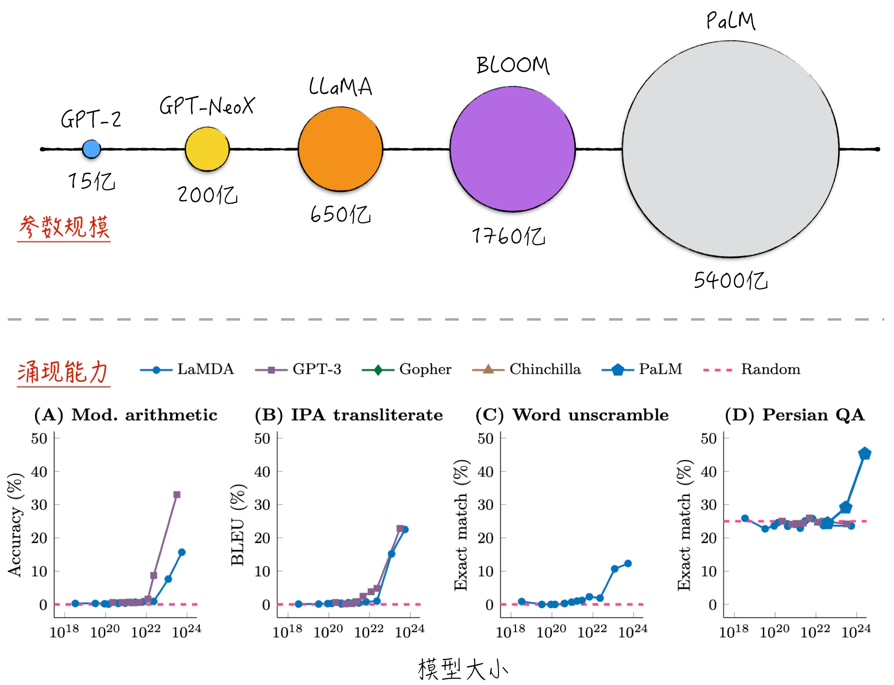
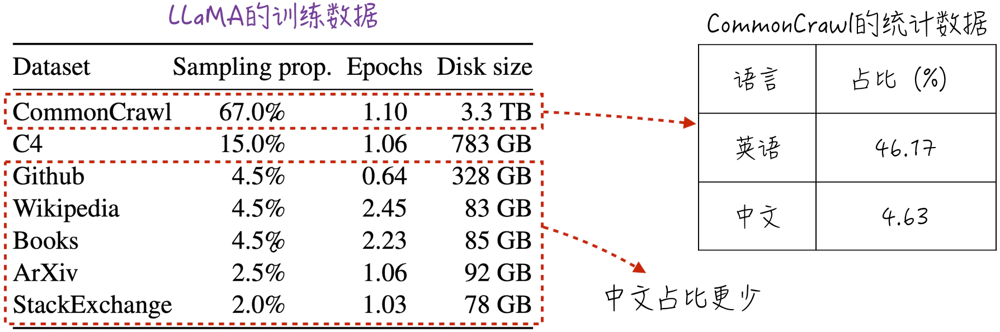
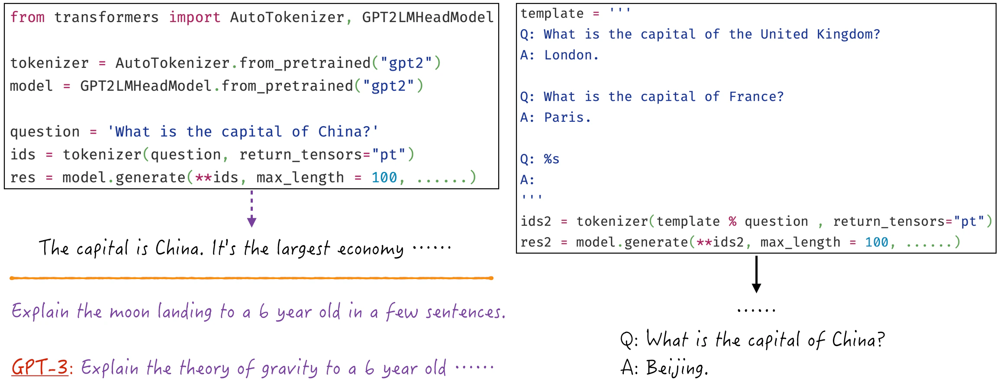
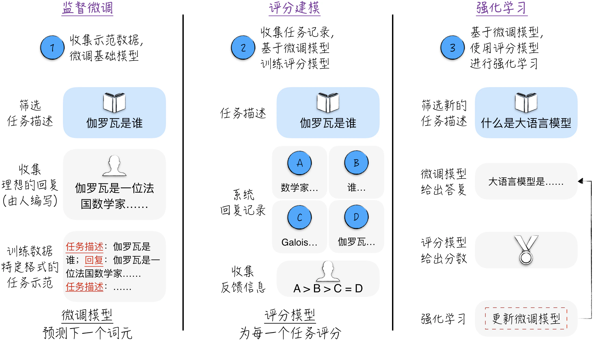
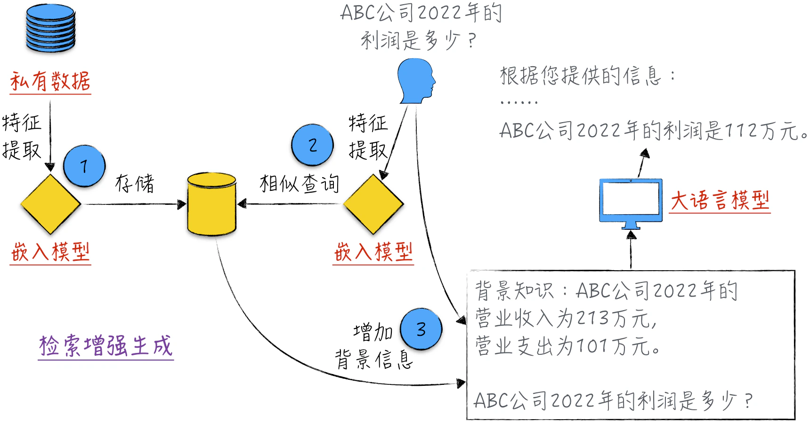

## 11.3 从大语言模型到智能助手

根据[11.2 节](/books/deconstructing_LLM/chapter-11/11-2)的内容，我们可以从零开始搭建和训练自己的大语言模型 GPT-2。这是令人异常兴奋的里程碑，但并不是最终目标。在实际生产中，应用大语言模型还需要解决最后一公里[^11-3-1]问题：如何有效地将模型能力和应用场景相结合。在理论上，迁移学习（参考[10.1.5 节](/books/deconstructing_LLM/chapter-10/10-1#section-10-1-5)）包括两个步骤：预训练和微调。训练 GPT-2 仅涉及第一步，即预训练，生成的模型被称为预训练模型（Pretrained Model）或基础模型（Base Model）。

在实际的生产环境中，通常不推荐将 GPT-2 作为基础模型，因为它规模较小，效果一般[^11-3-2]。目前已经有许多更大规模、效果更出色的基础模型开源可用，选择合适的开源模型通常是应用的首要步骤。因此，本节将首先介绍大语言模型（特别是开源模型）的现状，并以 GPT-2 为例简要介绍在使用开源模型时的注意事项。

要解决最后一公里问题，需要根据具体的场景进行多方面的个性化调整，没有一个通用的理论框架可以直接套用。我们可以借鉴成功项目的经验和步骤，ChatGPT 就是一个成功的案例。本节以 ChatGPT 为例，探讨如何从基础模型出发，逐步构建智能助手。由于这一过程涉及众多技术细节，因此本节的讨论将仅限于主要流程的介绍，具体的细节将在[11.4 节](/books/deconstructing_LLM/chapter-11/11-4)和[11.5 节](/books/deconstructing_LLM/chapter-11/11-5)中详细展开。

对于像 ChatGPT 这样的智能助手，为了发挥其最大潜力，需要掌握一些使用技巧。这是本节将要讨论的内容，其中包括提示工程（Prompt Engineering）和检索增强生成（Retrieval-Augmented Generation，RAG）。本节内容可能看起来有点多，但总结起来就一句话：离开实验室，到现实世界里向业界学习如何使用大语言模型。

### 11.3.1 大语言模型的现状

大语言模型的显著特点是规模大，图 11-11 的上半部分展示了一些经典模型[^11-3-3]的规模（截至 2023 年）。那么，为何要构建如此庞大的模型呢？这是因为大语言模型具备涌现能力（Emergent Ability）[^11-3-4]，即在较小的模型中不存在，但在大型的模型中显现出来的能力。如果将模型比作人类，那么涌现能力就好比人在成长过程中突然开窍，获得新的认知能力一样。如图 11-11 下半部分所示，随着模型规模的增加，模型的预测性能显著提高（需要注意，这不是过拟合的表现）。随着性能指标的显著提升，大语言模型还展现出了许多令人意想不到的能力，如推理能力，这些能力使模型看起来更接近通用人工智能（AGI）。然而，需要注意的是，模型的规模并不总是与模型的性能成正比。举个例子，LLaMA 模型虽然规模较小，但多个方面的性能已经超越了规模更大的 BLOOM 模型。因此，在选择基础模型时，规模不应该是唯一的筛选标准。

除了模型的规模，我们往往还会关注模型的训练数据，它将直接影响模型的性能。并非每个模型都会公开训练数据的细节，但它们之间的差异不会太大。以 LLaMA 模型为例，图 11-12 左侧所示为其训练数据的统计信息[^11-3-5]。从数据量的角度来看，训练数据的规模相当可观。从语言构成的角度来看，训练数据相对单一。如图 11-12 右侧所示，语言主要为英文，其他语言相对较少，中文则更加有限[^11-3-6]。这也解释了为什么该模型在英文上表现最佳，而在其他语言上效果一般。除此之外，分词器也是影响模型效果的一个重要因素（特别是针对中文），具体细节请参考[10.1.4 节](/books/deconstructing_LLM/chapter-10/10-1#section-10-1-4)。这提醒我们，如果主要的应用场景是中文，那么在选择基础模型时，首先要考虑的是如何增强模型在中文方面的能力。

### 11.3.2 开源模型

在使用开源的大语言模型时，通常使用工具 Transformer 下载所需的模型。但需要注意的是，由于工具的封装（或许有点过度封装），同一个模型可能存在多个不同的衍生版本。以 GPT-2 为例，工具提供了多个版本：带有语言建模头的 `GPT2LMHeadModel`、没有语言建模头的 `GPT2Model` 等[^11-3-7]。这些模型的差异不是当前讨论的重点，只是提醒读者，在选择模型时务必仔细阅读其说明文档，以选择合适的版本。

基础模型在训练过程中只处理一个任务，即根据文本的背景来预测下一个词元。从本质上讲，模型只是通过模仿训练数据中的概率分布来生成最有可能的文本。因此，它们在回答问题时通常会提供相关的内容，但明显没有真正理解对话的意图，就像鹦鹉学舌一样[^11-3-8]。如图 11-13 左侧上半部分所示[^11-3-9]，基础模型的回答令人困惑，与之前展示的 ChatGPT 相比差距明显。即使使用更强大的 GPT-3，其效果也与期望相去甚远：我们希望模型能够提供明确的解释，但它却回复了与提问相似的一系列问题。

这不仅是因为模型的能力有限，更多的是因为模型尚未学会如何以人类习惯的方式进行对话和回应请求（这些模型有自己的交流方式，与人类的方式不同，或者可以说，人类尚未学会如何以模型可理解的方式与模型进行交流）。实际上，可以使用一些小技巧来引导模型，如图 11-13 右侧所示。通过在输入中提供一些引导信息，模型就能够按照我们希望的方式生成回答。这种方法既是提示工程的雏形，也是构建智能助手的重要灵感。[11.3.4 节](/books/deconstructing_LLM/chapter-11/11-3#section-11-3-4)和[11.5 节](/books/deconstructing_LLM/chapter-11/11-5)将更深入地讨论这些话题。

### 11.3.3 从 GPT 到 ChatGPT

将 GPT 优化成 ChatGPT 是一个巨大的飞跃。ChatGPT 的成功使大语言模型这一技术词汇成为各行各业的热门话题。这个优化过程涉及多种技术，本书将在后续章节中深入讨论每项技术的细节[^11-3-10]。读者可以先将这些技术视为一个黑盒，从训练数据的特点和期望的效果这两个方面来理解每项技术的作用。

整个优化过程对应迁移学习中的微调阶段。微调阶段需要执行 3 个关键步骤：监督微调[^11-3-11]（Supervised Fine-tuning）、评分建模（Reward Modeling）和强化学习（Reinforcement Learning），如图 11-14 所示[^11-3-12]。

下面简要介绍每个步骤。

1. 基础模型并不理解我们提供给它的任务描述，也不了解什么样的回答是符合预期的。监督微调的目标是让模型变得能够理解任务描述并给出合适的回答。在这个阶段，最重要的是收集任务示范数据，然后利用这些数据在自回归模式下对模型进行训练[^11-3-13]。经过监督微调，模型能够相对正常地回答用户的提问。为了表述清晰，不妨将这一步得到的模型称为微调模型。

2. 将微调模型部署到生产环境后，收集用户对模型回答的反馈。如何有效利用这些反馈来改进模型的性能呢？答案是强化学习。强化学习是人工智能的一个分支，它根据对模型结果的评分来动态调整模型，以最大化模型评分（不是传统的最小化损失函数）。因此，强化学习需要的训练数据包含 3 个部分：任务描述、微调模型的回答，以及回答的评分。用户提供的反馈通常是对回答的排序，而不是直接的分数[^11-3-14]，这与强化学习所需的数据格式不一致。为了解决这个问题，需要构建一个评分模型，该模型能够学习用户的反馈，对大语言模型的回答进行评分，这样就可以获得用于强化学习的训练数据。需要再次提醒读者的是，普通用户并不会接触到评分模型，该模型只是一个辅助模型，帮助我们使用强化学习技术更好地优化第 1 步中得到的微调模型。
3. 利用第 2 步产生的训练数据，使用强化学习动态调整微调模型，以使其回答更符合我们的期望。

在 GPT 到 ChatGPT 的优化过程中，有 3 个值得思考的现象。

1. 微调只是释放了基础模型原有的潜力。微调后的模型在与人交互的效果上取得了显著的进步，但值得注意的是，整个微调过程（3 个步骤加在一起）是极其短暂的。训练数据量不到预训练阶段的 2%，训练时间也是如此。因此，我们可以合理地认为，在短暂的微调过程中，模型并没有学到多少新的知识，只是学会了与人交流的方式，从而将其原有的能力充分发挥出来。用一个不太严谨的比喻来说明，原本的基础模型可能像一位出色的法国数学家，但由于不懂中文，他无法与我们交流数学。然后他花了一个月时间学习了一些中文，此时大家觉得他的数学水平突然提高了，但实际上并不是，只是他现在可以与我们沟通了。
2. 微调会使模型失去多样性和创造性。微调后的模型在互动效果方面表现更出色，但并不是在所有任务中都比基础模型更好。研究发现，基础模型更具创造性，其回答也更多样化。在某些需要创造性的任务中，如创作小说和诗歌，基础模型的效果更好。这个现象也引发了人们对教育过程的反思。如果将预训练比作初等教育，那么基础模型就相当于高三毕业生。经过高等教育（微调阶段），学生在特定领域的技能得到了提高，但就创造性而言，高等教育也可能抑制了学生的创新能力。
3. 微调模型是否会导致社会只剩下一种声音？微调模型是通过模仿任务示范来回答问题的，在监督微调的过程中，训练数据相对有限，但对模型的最终效果有着重要的影响。ChatGPT 的所有任务示范由一个仅有 40 名成员的远程团队[^11-3-15]完成。从某种意义上来说，ChatGPT 每天都在重复这 40 个人的声音。在此过程中，成员的个人偏见或狭隘观点（每个人都潜藏着无法自我察觉的偏见和狭隘观点）可能被保留在模型中，每天传播给数亿人[^11-3-16]。一个健康的社会不应该只有一种声音。微调后的模型丧失了多样性，这是否会加剧社会的分歧和撕裂，导致严重的后果呢？如何确保微调阶段的训练数据具备多样性和公正性，是一个值得深思和引起警觉的问题。

微调后的模型（比如 ChatGPT）如果仍无法满足需求，可以参考上述步骤继续微调。值得注意的是，这种方法相对比较复杂，它需要重新训练模型，资源投入也较大，并且不能百分之百确保微调后的模型一定会更智能（微调需要经验的积累，在实践中，大语言模型很容易因为微调而变得“愚笨”）。实际上，除了这种复杂的修改方式，还有一些相对简单的调整模型的方法，以使模型更符合期望，包括提示工程和检索增强生成。

### 11.3.4 提示工程

什么是提示工程？简而言之，就是将大语言模型视为人类伙伴，以人际交流的方式与之互动，以便说服模型更好地提供服务。提示工程的方法众多，本节不打算详尽列举所有方法，只将重点放在几个经典的案例上。

1. 给予提示。这种方法的正式名称是 Few-Shot Prompting，可以直译成“少量示例提示方法”。图 11-13 所示的就是一个典型示例。就像与人交流一样，当对方不太理解我们所交代的任务时，我们可以提供一些示范例子，帮助对方迅速理解我们的意图，从而完成任务。通过这种方法，我们可以在不编写代码的情况下完成各种建模任务，如图 11-15 上方所示：通过示例引导来完成文本分类任务，无须编写复杂的模型代码。
2. 让模型有时间进行思考。这种方法就是思维链（Chain of Thought，CoT）。就像人在解决问题时需要时间一样，给予模型足够的“思考时间”可以促使它提供正确的答案。与人类不同，模型的思考并不依赖时间，而依赖词元。因此，让模型自己进行内部对话，可以帮助它更好地厘清思路并完成任务，如图 11-15 中间所示。如果直接提问，模型会给出错误的答案，但如果提示它可以一步步解答（在原始论文中，魔法般的提示语是“Let’s think step by step”），模型就能够提供正确的答案。
3. 要求反思。当模型提供了答案后，可以要求它对自己的答案进行检查，以核对答案是否符合要求，如图 11-15 下方所示。在这种情况下，模型会仔细反思自己的回答，并进行必要的修正，以提供正确的答案。
4. 正面鼓励也是一个有效的方法。当向模型提问时，可以先鼓励模型提供高质量的回答。研究表明，在问题之前加上如下简单的陈述可以显著提高模型的表现：“你是某个领域的专家，请完成下面的任务”。产生这种现象的原因尚无确切的定量分析，一般认为在训练数据中，同一个问题可能存在多种不同的答案，它们的质量参差不齐，如果鼓励模型将自己视为专家，它就会相应地从其记忆中筛选出高质量的答案作为回应。

提示工程在某种程度上颠覆了人机互动的方式，是大语言模型中最引人入胜的领域之一。与其他技术不同，大语言模型虽然极为复杂，却几乎没有使用门槛，只需要告诉它需求就可以了。感兴趣的读者可以阅读其他相关资料，深入了解这个话题，甚至探索出更多令人惊叹的使用方法。

### 11.3.5 检索增强生成

检索增强生成（Retrieval-Augmented Generation，RAG）这个术语看似比较深奥，但其原理非常简单。大语言模型的知识是从其训练数据中获得的，如果某些特定知识没有包含在这些数据中，模型就难以执行相关任务。如图 11-16 所示，假设有一些私有财务数据，这些信息是非公开的，大语言模型无法直接回答与这些数据相关的问题。如果希望模型能够使用这些私有数据来处理任务，应该怎么办呢？解决方法很简单，只需将这些信息作为背景资料提供给模型就可以了。由于模型理解语言，它可以临时学习背景资料，然后使用其中的信息来完成具体的任务。

上述示例非常生动形象，但与实际的生产应用还有一定距离。具体来说，我们需要人为地根据任务来筛选与之相关的背景资料，然后才能重新构造任务描述（将背景资料添加到任务描述中）。若要将这个过程自动化，完全由系统和模型来处理，就要用到检索增强生成。

为了更好地理解这个算法，首先回顾一下大语言模型的基本构成。从宏观的角度来看，模型可以分为两个部分：最顶部的语言建模头（Language Modeling Head）和由其他所有组件构成的嵌入模型[^11-3-17]（Embedding Model）。从作用上来看，语言建模头相当于一个多元逻辑回归模型，嵌入模型用于提取文本的特征。任何文本[^11-3-18]经过嵌入模型处理后，都可以得到一个相同长度的张量，该张量代表文本的语义特征。两个张量越接近（可以通过张量之间的夹角来衡量它们的相似性），就意味着两个文本的语义越相似。基于这一思路为任务选择最合适的背景信息，具体的算法可以分为 3 步，如图 11-17 所示。

1. 通过嵌入模型提取私有文本数据的特征，并将这些张量存储在数据库或者内存中。
2. 使用相同的嵌入模型提取任务描述的特征，找到最相似的背景资料。
3. 将背景资料添加到任务描述中，并通过大语言模型得到最终的回复。

[^11-3-1]: 根据维基百科，最后一公里（Last Kilometer）原意是指完成长途跋涉的最后一段里程，后被引申为完成一件事情时的最终关键性步骤（通常还说明此步骤充满困难）。
[^11-3-2]: 相比于其他神经网络，GPT-2 已经相当庞大，但在大语言模型领域，它实际上是一个很“迷你”的模型。在实际的生产环境中，模型规模和训练数据都要大得多。以 ChatGPT 为例，它所使用的是 GPT-4（截至 2023 年的版本）。GPT-4 的模型规模更大，表现也更出色。
[^11-3-3]: LLaMA 的全称是 Large Language Model Meta AI。BLOOM 的全称是 BigScience Large Open-science Open-access Multilingual Language Model。PaLM 的全称是 Pathways Language Model。本节列举的大语言模型主要以英文为基础进行预训练。国内也存在一些以中文为基础的大语言模型。可惜的是，这些模型的技术文档相对较少，因此在本书中无法提供详细的讨论。
[^11-3-4]: 源自论文“Emergent Abilities of Large Language Models”。
[^11-3-5]: 源自论文“LLaMA: Open and Efficient Foundation Language Models”。
[^11-3-6]: Common Crawl 是一个非结构化的、多语言的网页数据集，而 C4 是基于 Common Crawl 的、清洗之后的数据集。这两者是目前训练大语言模型的主要数据来源。LLaMA 模型对 Common Crawl 和 C4 这两个数据集都进行了英文筛选，因此模型学习到的中文其实更少。
[^11-3-7]: 去掉语言建模头是大语言模型的常见衍生版本。这类模型通常被用于文本的特征提取，因此也被称为嵌入模型（Embedding Model）。具体细节可参考[8.3.5 节](/books/deconstructing_LLM/chapter-8/8-3#section-8-3-5)中的图 8-15 或[11.3.5 节](/books/deconstructing_LLM/chapter-11/11-3#section-11-3-5)。
[^11-3-8]: 一些研究人员认为，大语言模型实际上是擅长模仿人类的鹦鹉，并不具备真正的智能。这种观点质疑模型是否真正理解语言，或许它们只是在统计上模仿文本数据而已。这是非常有趣的观点，很难被证实，也很难被证伪。但是谁又敢说语言的本质不是概率呢？毕竟根据量子力学，微观世界的物质都是以概率波的形式存在的。
[^11-3-9]: 完整的实现请参考本书配套代码 [`ch11_llm/gpt2.ipynb`](https://github.com/GenTang/regression2chatgpt/blob/zh/ch11_llm/gpt2.ipynb)。在示例中使用英文，是因为 GPT-2 处理中文的效果较差，难以展示这两种方法的区别。
[^11-3-10]: 监督微调和评分建模请参考[11.5 节](/books/deconstructing_LLM/chapter-11/11-5)，强化学习请参考[第 12 章](/books/deconstructing_LLM/chapter-12)。
[^11-3-11]: 监督微调这个名字可能会引起一些困惑，学术界之所以采用这个术语，是为了强调在这个阶段使用监督学习的方法（自回归模式）来微调模型，这与后续使用强化学习进行微调有所不同。此外，从训练的目的来看，这一步骤的主要目标是让模型能够模仿任务示范生成回复，因此在这个语境中，“监督”约等于“模仿”。
[^11-3-12]: 图片参考自论文“Training Language Models to Follow Instructions with Human Feedback”。
[^11-3-13]: 训练的目的是通过特定格式的文本和少量示范例子，引导模型按照期望的方式生成回答，这与图 11-13 右侧所示的例子非常相似。
[^11-3-14]: 即使用户提供了关于回答的评分，我们仍然很难将这些评分直接应用于强化学习。这是因为每个人的评分标准都不尽相同，可能会对模型的正确性产生严重影响。
[^11-3-15]: 更准确地说，文中提到的 ChatGPT 指的是最初版本的 ChatGPT，该版本依赖的大语言模型是 GPT-3。尽管后续的 ChatGPT 在团队规模和数据收集方法上进行了扩展，但这并不改变任务示范来源于极少数人的事实。
[^11-3-16]: 这并不是要批评 ChatGPT 的方法，实际上，几乎所有基于大语言模型的智能助手系统都存在类似的问题：构建系统的过程中存在一些“独裁”环节，这会对系统的中立性产生严重影响。随着大语言模型的发展，搭建模型已经超越了技术本身，我们正在为社会引入新的智能，因此不能忽视技术对社会的影响。
[^11-3-17]: 以 GPT-2 为例，[11.3.2 节](/books/deconstructing_LLM/chapter-11/11-3#section-11-3-2)中提到的 `GPT2Model` 就属于嵌入模型。请注意，这里的嵌入模型和模型的文本嵌入（Word Embedding）层是完全不同的，不要混淆它们。
[^11-3-18]: 由于大语言模型都有文本长度的限制，因此模型无法处理超出长度限制的背景资料。如果遇到超出限制的资料，常用的方法是使用模型来压缩文本，即通过大语言模型生成文本摘要，再进行检索增强生成。
