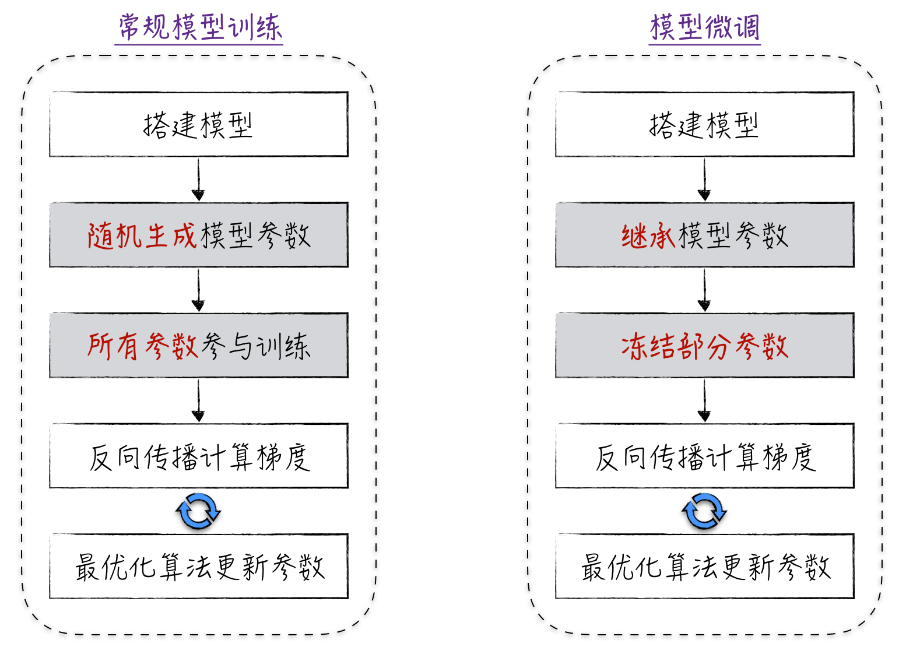
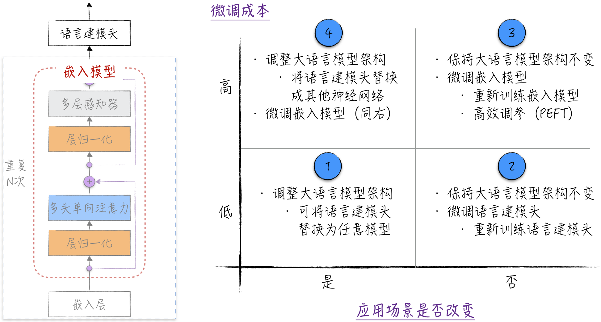
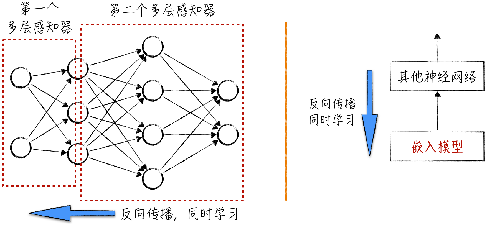
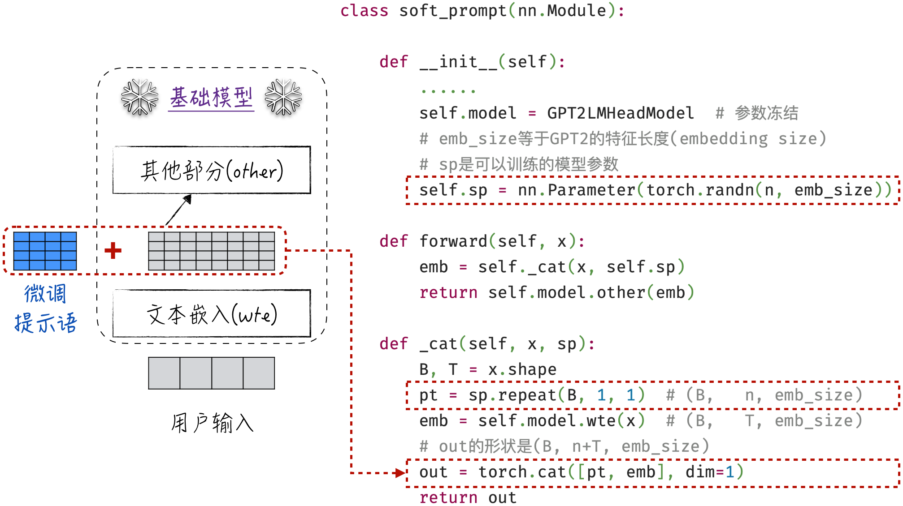
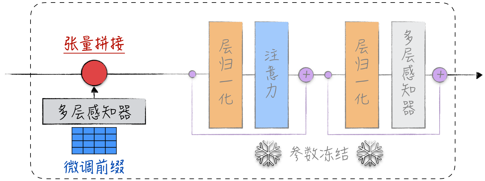
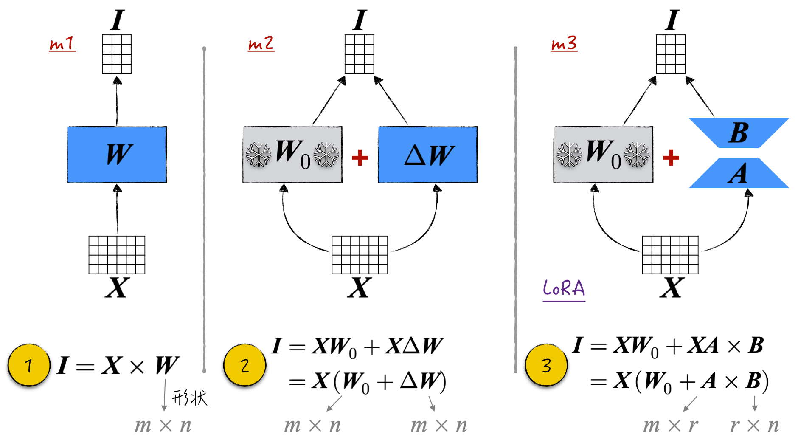
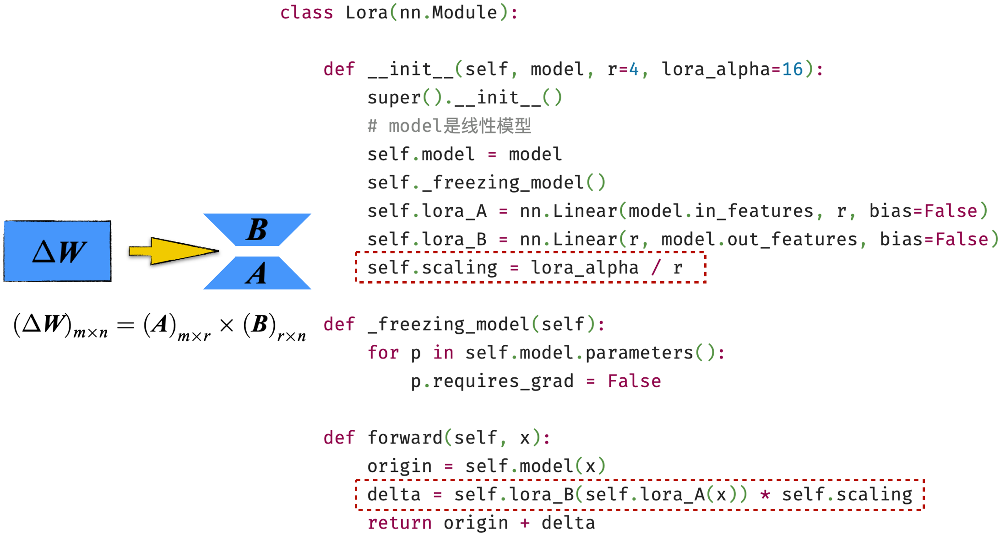

## 11.4 模型微调

在开源社区中，我们可以轻松获得许多性能卓越的基础模型（预训练的大语言模型）。然而，初步体验表明，这些模型都存在一个共同的限制，即它们还无法直接与人类交流，在使用过程中显得比较笨拙。但 ChatGPT 的成功案例证明：经过适当的微调，这些基础模型可以迅速变得“聪明”，成为可靠的智能助手。

从技术角度来看，模型微调的具体流程是什么？它与模型训练有何不同吗？其实，两者之间的差别微乎其微，如图 11-18 所示。常规模型训练的流程如下：首先，搭建模型结构；然后，随机初始化模型参数；最后，基于训练数据逐步更新这些参数。模型微调的过程与之非常相似，不同之处有两点。首先，参数的初始化：在模型微调时，参数不是随机生成的，而是全部或者部分继承已经训练好的模型的参数[^11-4-1]。其次，参与训练的参数范围：在常规模型训练中，所有参数都将参与训练，而在模型微调时，可以根据需要冻结部分参数，从而提高训练效率并更好地继承之前模型的知识。



模型微调是一项需要创造力的任务。在搭建模型时，需要巧妙地设计模型结构，以便最大限度地继承已有的模型。在训练过程中，我们希望尽可能减少参与训练的参数数量。为了更好地理解微调技术，将其分为宏观和微观两个层面。宏观层面的关注点是如何更好地继承已有模型，将介绍模型微调的主要应用场景，以及不同场景下可供选择的技术路径。微观层面更侧重于如何减少参与训练的参数数量，以便更高效地完成微调任务。

需要注意的是，模型微调是一个快速发展的领域，应用场景多种多样。因此，本节只讨论一些经典且富有启发性的方法。面对具体的微调任务时，读者可以根据需要参考其他资料，或者基于本节的内容发挥自己的创造力。此外，本节讨论的内容主要基于大语言模型，但这些微调技术同样适用于其他大型神经网络模型。

### 11.4.1 模型微调的 4 种模式

从宏观层面来看，模型微调可以被分为 4 种模式，划分维度分别是微调成本和应用场景是否改变。

- 正如[11.3.5 节](/books/deconstructing_LLM/chapter-11/11-3#section-11-3-5)所讨论的，大语言模型可以被看作由语言建模头和嵌入模型拼接而成的，如图 11-19 左侧所示。其中，语言建模头相对简单，嵌入模型则非常复杂，对其进行调整需要付出较大的代价。因此，根据是否对嵌入模型进行调整来区分模型微调的成本是高还是低[^11-4-2]。
- 模型微调后的应用场景也可以分为两类。一是微调后的模型与基础模型有不同的应用场景，例如，利用嵌入模型的输出构建全新的文本分类模型，ChatGPT 微调过程中的评分建模也属于这一类。二是应用场景保持不变，例如 ChatGPT 微调过程中的监督微调，或者增强基础模型的中文能力等。

根据上述两个维度，可以得到图 11-19 右侧所示的四象限图。对于这 4 种不同的组合，通常采用的微调方法如下。



1. 替换语言建模头，保持嵌入模型不变（标记 1）：面对不同的应用场景，如果希望用较低的成本完成模型微调，通常的做法是保持嵌入模型不变，将语言建模头替换成其他合适的模型。这种做法的思路是充分利用模型联结主义，将嵌入模型的输出作为新模型的输入来完成建模任务。替换上来的模型组件有非常多的选择，比如机器学习和统计分析的模型，包括线性回归、逻辑回归，以及[第 13 章](/books/deconstructing_LLM/chapter-13)中将介绍的监督学习和无监督学习的模型。
2. 冻结嵌入模型参数，只调整语言建模头（标记 2）：由于应用场景不变，微调模型成本最低的做法是保持嵌入模型不变，只调整语言建模头。利用[7.4.2 节](/books/deconstructing_LLM/chapter-7/7-4#section-7-4-2)讨论的参数冻结，将嵌入模型冻结，这意味着在反向传播算法计算梯度时，这部分参数的梯度不会被计算。因此，在模型微调时，嵌入模型不会变化，只更新语言建模头。
3. 对嵌入模型进行调整，包括直接调整和高效调参（标记 3）：面对相同的应用场景，如果希望提高模型效果的上限，就需要对嵌入模型进行调整。具体的方法可以进一步细分为两种：一种是非常直接的，不冻结嵌入模型的参数，直接用新的数据训练模型（这种方法的成本很高）；另一种是高效调参，这部分内容将在[11.4.2 节](/books/deconstructing_LLM/chapter-11/11-4#section-11-4-2)中详细讨论。
4. 使用其他神经网络替换语言建模头并调整嵌入模型（标记 4）：由于应用场景有所变化，语言建模头需要被替换，但只能使用其他神经网络来替换。这样，两个神经网络叠加在一起，在训练过程中，梯度将从一个神经网络传递到另一个神经网络，然后两部分都会进行更新，如图 11-20 所示[^11-4-3]。这个过程看似有些神奇，但实际上我们已经多次遇到过。即使是最简单的多层感知器，也可以被看作多个多层感知器的组合，其训练过程与上述过程相同。



### 11.4.2 高效调参概述

为了降低嵌入模型的微调成本并提高效率，学术界引入了高效调参（Parameter-Efficient Fine-Tuning，PEFT）技术，它是微观层面的微调技术。这类技术的处理方法虽然有很多种，但核心思想是类似的：冻结嵌入模型的参数，同时在不改变模型主体结构的情况下，通过引入额外的组件实现微调[^11-4-4]。

经典方法可以分为两类：一种是直接增加模型组件，其中包括提示调整（Prompt Tuning）和前缀调整（Prefix Tuning）；另一种是通过模拟参数更新的效果来实现微调，代表性的方法是 LoRA（Low-Rank Adaptation）。由于没有合适的中文翻译，后续章节将继续使用 LoRA 这一缩写形式。

### 11.4.3 高效调参之增加模型组件

提示调整和前缀调整这两种方法非常相似，出现的时间也十分相近。

首先讨论提示调整。在[11.3.4 节](/books/deconstructing_LLM/chapter-11/11-3#section-11-3-4)的提示工程中，为了更好地与模型交互，通常在任务描述中额外加入一些的提示语，例如“一步一步解答”。虽然这些人为编写的提示语能提高模型的效果，但整个过程并不够自动，也无法保证增加的提示语是最佳的选择。是否可以用类似模型训练的方式自动找到最佳的提示语呢？答案是肯定的，这正是提示调整算法的核心思想[^11-4-5]。

为了更清晰地解释这一算法，可以将基础模型分成两部分，即文本嵌入和其他部分，如图 11-21 左侧所示。输入的文本首先经过文本嵌入的处理，转化为张量，再进行后续计算。从模型的角度来看，增加提示语其实就是在张量（任务描述对应的张量）的开头拼接一些前缀张量（提示语对应的张量）。为了将这一思路工程化，首先假设增加的提示语是固定长度的，由 $n$ 个词元组成。然后，对于所有输入，增加的提示语都是相同的。因此，可以冻结基础模型，然后生成一系列可以训练的模型参数，用于表示提示语对应的张量。这样在模型训练的过程中，新的模型参数会找到最佳的提示语，而基础模型保持不变。整个过程的核心步骤如图 11-21 中红框部分所示。



前缀调整的方法与提示调整非常类似，唯一的不同之处在于，它为模型中的每个解码块都注入了前缀，具体的结构如图 11-22 所示。由于篇幅有限，这两种方法的详细实现和使用示例在此不做讨论。



### 11.4.4 高效调参之 LoRA

提示调整和前缀调整基本可以视作为大语言模型定制的方法，它们在设计时对模型结构做出了很强的假设，算法留给用户自主调整的空间也有限，因此限制了上述两种方法的应用范围。相比之下，LoRA 具有更大的灵活性，几乎可以用于任何模型，并且给予用户更大的微调自由。因此，LoRA 是一种更受欢迎、具有更广泛应用场景的高效调参方法。下面暂时将焦点从大语言模型身上移开，在更广泛的神经网络背景下讨论 LoRA 的细节。

神经网络的大部分模型参数都源自线性模型[^11-4-6]，因此我们只考虑如何高效地微调线性模型。如图 11-23 所示，构建 3 种不同的线性模型。

- 模型 m1 是常规的线性模型，其对应的参数用矩阵 $\boldsymbol W$ 表示，模型的计算公式如标记 1 所示。矩阵中的所有参数都参与训练，而且它的初始状态为 $\boldsymbol W_0$。
- 模型 m2 由两部分组成。一部分是已经冻结的模型 m1，冻结状态为 $\boldsymbol W_0$，即模型微调之前的状态。另一部分是一个常规的线性模型，其参数矩阵用 $\Delta\boldsymbol W$ 表示，其形状与 $\boldsymbol W$ 相同，初始值全部为 0，我们将其称为更新矩阵。标记 2 表明，模型 m2 也是一个线性模型，因为模型的计算同样是矩阵乘法。在微调之前，m1 和 m2 的参数完全相同，而且参与训练的模型参数本质上也是相同的（参数数量相同，在模型中的作用也相同）。换句话说，两个模型是完全等价的，因此我们可以将重点放在如何高效地微调模型 m2 上。
- 模型 m3 也包含两部分。一部分是已经冻结的模型 m1。另一部分是两个线性模型的嵌套，其参数分别为矩阵 $\boldsymbol A$ 和矩阵 $\boldsymbol B$，初始值均为 0。模型的计算公式如标记 3 所示，其中 $r$ 远远小于 $m$ 和 $n$。从公式中可以看出，m3 同样是一个线性模型。在微调之前，m3 与 m2 是等价的。然而，m3 参与训练的参数个数较少，因此其能够达到的效果上限低于 m2。



从微调的最终结果来看，很多情况下（大语言模型的微调场景就是典型案例），m2 中更新矩阵的秩（The Rank of Matrix）非常小。这意味着 $\Delta\boldsymbol W$ 可以分解为两个更小矩阵的乘积[^11-4-7]，如图 11-24左侧所示（[完整代码](https://github.com/GenTang/regression2chatgpt/blob/zh/ch11_llm/lora_tutorial.ipynb)）。这证明了，只需设置合适的 $r$，m3 在微调场景下完全可以达到与 m2 相同的效果，且成本更低。这正是 LoRA 算法的核心思想。在具体的算法实现上，LoRA 引入了超参数 `lora_alpha` 来调节冻结部分和训练部分的关系，如图 11-24 中的红框部分所示。



LoRA 的代码实现并不困难，但由于大语言模型的结构相对复杂，要在其中灵活添加 LoRA 适配器并非易事。因此，在实际生产中，通常使用开源工具 `peft` 来实现对大语言模型的 LoRA 应用。程序清单 11-4 中列举了一些常见的操作（更多的使用细节请参考本书配套代码）。

- 通过 `target_modules` 参数（第 10 行和第 11 行）指定需要添加 LoRA 适配器的线性模型，可以根据需要在模型中添加多个 LoRA 适配器。
- 如果模型中有多个 LoRA 适配器，在使用时可以随时切换，如第 17 行所示。
- 还可以临时禁用或卸载 LoRA 适配器，将模型还原到初始状态，参考第 19～24 行代码。

#### 程序清单 11-4 LoRA（[完整代码](https://github.com/GenTang/regression2chatgpt/blob/zh/ch11_llm/lora_tutorial.ipynb)）

```python
class MLP(nn.Module):

    def __init__(self, bias=False):
        super().__init__()
        self.lin0 = nn.Linear(2, 4, bias=bias)
        self.lin1 = nn.Linear(4, 2, bias=bias)
    ...

# 在模型中加入多个 LoRA 适配器
config1 = LoraConfig(r=3, lora_alpha=16, target_modules=['lin0'])
config2 = LoraConfig(r=5, lora_alpha=16, target_modules=['lin0', 'lin1'])
model = MLP()
peft_model = PeftModel(model, config1, adapter_name='lora1')
peft_model.add_adapter(peft_config=config2, adapter_name='lora2')

# 切换 LoRA 适配器
peft_model.set_adapter('lora2')

# 禁用 LoRA 适配器之后，将模型恢复到原模型状态
with peft_model.disable_adapter():
    print(peft_model(x))

# 还可以卸载 LoRA 适配器，将模型恢复到初始状态
peft_model.unload()
```

[^11-4-1]: 对于那些无法继承的部分，初始的模型参数仍然是随机生成的。
[^11-4-2]: 从理论上讲，对嵌入模型进行调整可以提高微调后模型的性能上限，但微调过程需要更多的经验，否则很可能适得其反。
[^11-4-3]: 将多个神经网络组合在一起训练的方法非常有趣。在联合训练之后，既可以将这几个模型组合在一起使用（与模型训练时一样），也可以将它们单独提取出来并独立使用。这种方法经常被用在强化学习等领域。
[^11-4-4]: 由于基础模型的参数被冻结，当保存高效调参的结果时，只需保存额外增加的组件参数，可以有效节省存储空间。此外，需要注意的是，在一般情况下，会冻结整个嵌入模型，但这并不是绝对的规则，也可以根据需要解冻嵌入模型的特定层，以便让它们也参与训练。
[^11-4-5]: 在某些文献中，人工寻找提示语的方法被称为 Hard Prompt Tuning，工程化的方法则被称为 Soft Prompt Tuning。
[^11-4-6]: 尽管神经网络中的非线性变换十分重要，但这些变换并不包含模型参数。其他组件，如层归一化等，拥有的模型参数相对较少。
[^11-4-7]: 分解的原理是矩阵的奇异值分解。参考[2.1.5 节](/books/deconstructing_LLM/chapter-2/2-1#section-2-1-5)和[13.5 节](/books/deconstructing_LLM/chapter-13/13-5)中的讨论，分解公式中的 $r$ 等于矩阵的秩。因此，LoRA 算法的核心在于被分解矩阵的秩很小。如果矩阵的秩很大，使用这种方法可能会显著降低模型的性能。
