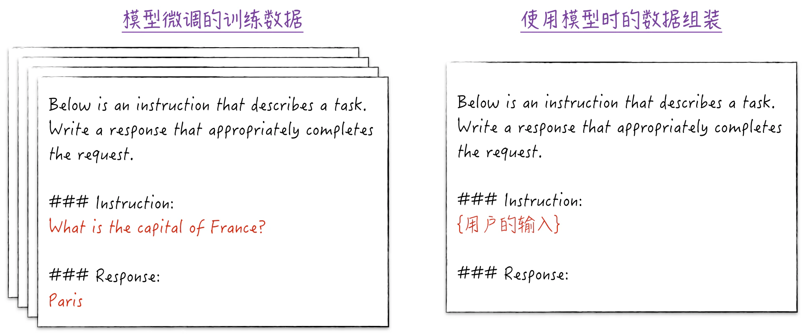
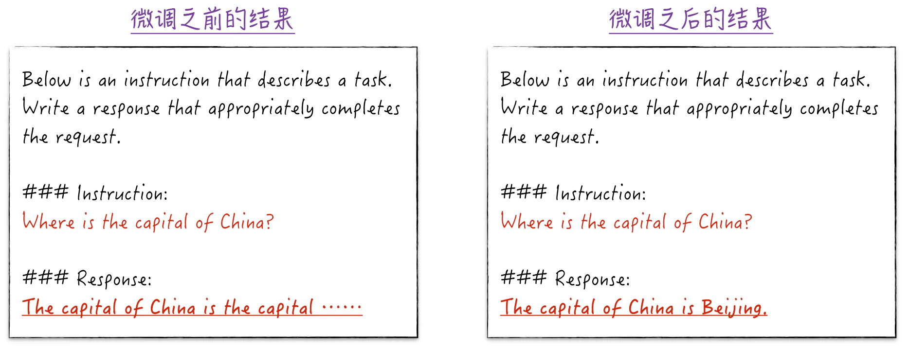
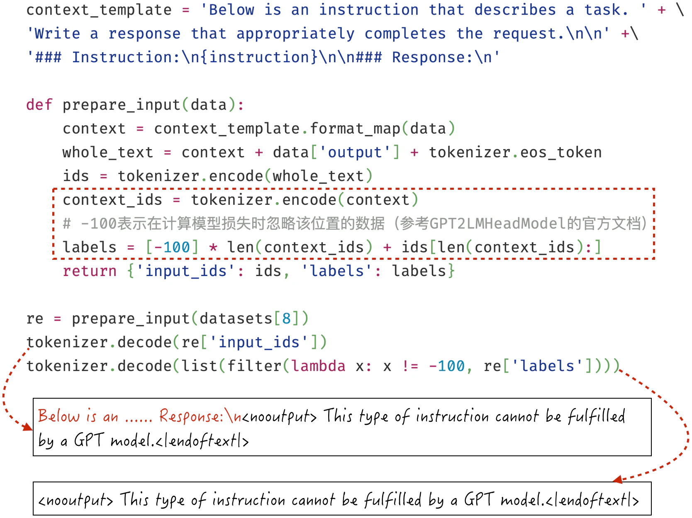
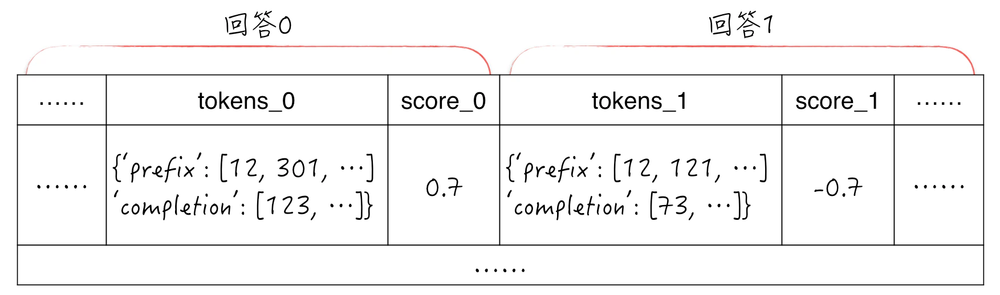
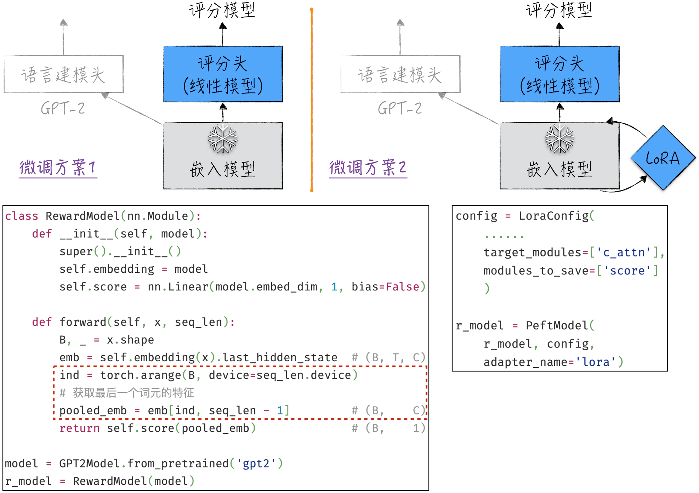
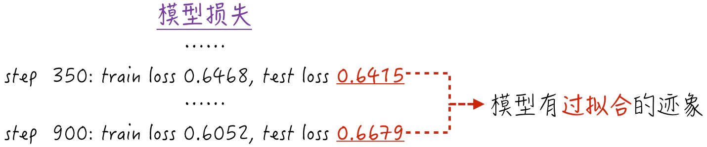

## 11.5 监督微调和评分建模

在介绍完模型微调的技术后，下面以 GPT-2 为基础模型，再现 ChatGPT 微调中的监督微调和评分建模。这两个具体的案例都非常具有启发性，可以帮助读者更深刻地理解模型微调。

### 11.5.1 监督微调初体验

根据[11.3.2 节](/books/deconstructing_LLM/chapter-11/11-3#section-11-3-2)的内容，预训练获得的基础模型只会根据文本预测下一个词元是什么，因此无法与人类进行有效的交流。监督微调的目标是使模型更好地理解我们发出的指令，并给出适当的回复。回顾图 11-13 右侧的示例（或者参考图 11-25），可以通过添加特定格式和内容的提示语，让模型明白输入的内容实际上是一个任务描述，它需要完成这项任务。尽管从模型的角度来看，它仍然是在预测下一个词元，但提示语的特殊格式和前缀内容使模型能够生成我们期望得到的回复。



然而，添加提示语的方法并不总是奏效，效果只是差强人意。这是因为在预训练过程中，这种特殊格式的数据相对较少，导致模型对这种问答文本的理解可能不够深入。因此，我们需要强化模型对这类数据的理解，具体步骤如下。

1. 准备训练数据：如图 11-25 左侧所示，利用模板准备问答格式的文本数据[^11-5-1]。
2. 对模型进行微调：由于应用场景保持不变，因此模型的结构不需要改变。另外，为了提升模型效果，整个模型都将参与微调（对应图 11-19 中的标记 3）。在微观层面，将使用 LoRA 来提高微调效率。
3. 使用模型时的数据组装：如图 11-25 右侧所示，在使用微调后的模型之前，需要将用户的原始请求转化为问答格式，并为回答部分留空，提示模型生成答案。

模型微调过程中的模型搭建、训练数据准备和效果评估等细节与预训练类似。限于篇幅，这里不做过多讨论，请读者参考[`ch11_llm/gpt2_lora.ipynb`](https://github.com/GenTang/regression2chatgpt/blob/zh/ch11_llm/gpt2_lora.ipynb)。需要注意的是，在[11.2.2 节](/books/deconstructing_LLM/chapter-11/11-2#section-11-2-2)实现注意力算法时，为了便于理解，分别使用了 3 个线性模型来表示 `query`、`key` 和 `value`。由于这 3 个模型的输入是一样的，完全可以使用一个线性模型来表达（参考程序清单 10-9 中对长短期记忆网络的实现），这也是开源工具 Transformer 对 GPT-2 的实现方式。如图 11-26 所示，模型结构中的 `c_attn` 组件对应注意力算法中的线性模型。因此，在设置 LoRA 适配器时，需要填写正确的模块名称。这个细节表明，虽然在实际工作中从头开始训练大语言模型的情况不多，但我们仍需要对基础模型的结构和实现有较好的理解，这样才能更好地进行微调。


当模型微调开始时，我们满怀期待着一个美好的结局。然而很遗憾，模型很快进入了发散状态[^11-5-3]，即模型的损失开始增大而不是减小。这是因为模型的训练脚本太过简单，还无法在大规模数据上训练复杂模型。为了解决这个问题，需要从 4 个方面对训练脚本进行优化。

1. 最优化算法的超参数调整：可以参考领域内的最佳实践来选择合适的超参数。
2. 学习速率的动态调整：固定且偏大的学习速率很容易导致模型发散。动态调整的策略包括两个主要方面。首先，在训练开始有一个热身（Warmup）阶段，在此阶段，学习速率非常小，主要目的是帮助模型熟悉训练数据。其次，在正常训练阶段，学习速率将缓慢地逐渐减小。
3. 内存开销的最小化：大语言模型的计算需要消耗大量的内存，如果不优化内存的使用，我们就不得不选择非常小的批量大小，这会导致模型训练的不稳定。常用的内存优化技术有梯度累积和混合精度计算。具体的细节请参考[7.4.1 节](/books/deconstructing_LLM/chapter-7/7-4#section-7-4-1)和[7.5.2 节](/books/deconstructing_LLM/chapter-7/7-5#section-7-5-2)。
4. 梯度裁剪（Gradient Clipping）：在深度神经网络中，梯度爆炸是一个常见的问题。归一化层和更高效的激活函数可以在一定程度上缓解这个问题，此外，还有一种更直接的解决方法，即梯度裁剪。梯度裁剪的思路非常简单：首先计算参数的梯度，然后对这些梯度进行“归一化”处理[^11-5-4]（例如，通过线性变换将其范数缩放至 1），以免梯度变得过大。

程序清单 11-5 综合了上述 4 种优化方法，是更符合实际生产需求的训练脚本。

#### 程序清单 11-5 优化后的训练脚本（[完整代码](https://github.com/GenTang/regression2chatgpt/blob/zh/ch11_llm/gpt2_lora.ipynb)）

```python
device = 'cuda' if torch.cuda.is_available() else 'cpu'
grad_clip = 1.0

def train_gpt_optimum(model, optimizer, data_loader, max_iters=1000):
    lossi = []
    scaler = torch.cuda.amp.GradScaler(enabled=(device == 'cuda'))
    for iter_num in range(max_iters):
        # 动态调整学习率
        lr = get_lr(iter_num + 1)
        for param_group in optimizer.param_groups:
            param_group['lr'] = lr
        # 梯度累积
        for i in range(gra_acc_steps):
            inputs, labels = data_loader()
            # 混合精度训练
            ctx = torch.autocast(device_type=device, dtype=torch.float16)
            with ctx:
                logits = model(inputs).logits
                logits = logits.transpose(-2, -1)
                loss = F.cross_entropy(logits, labels)
                lossi.append(loss.item())
                loss *= 1 / gra_acc_steps
            scaler.scale(loss).backward()
        # 梯度裁剪
        scaler.unscale_(optimizer)
        clip_grad_norm_(model.parameters(), grad_clip)
        scaler.step(optimizer)
        scaler.update()
        optimizer.zero_grad(set_to_none=True)
    return lossi
```

使用优化后的训练脚本，得到一个微调后的模型。如图 11-27 所示，经过短时间的微调，GPT-2 的用户体验更接近 ChatGPT。这个模型似乎在认真回答问题，而不只是简单地鹦鹉学舌（用户并不知道图中的问答模板，只是简单地输入问题，然后获得模型的回答）。



上述微调的主要目标是将模型转变为一个问答机器人。如果有其他的目标，那么微调过程应如何调整呢？需要调整的地方并不多，通常只有训练数据准备这一步。如果希望增强模型对中文的理解能力，需要准备中文文本作为训练数据；如果想提升模型的逻辑推理能力，那么训练数据应该包含代码或数学教材等内容。因此，有了合理的技术框架之后，监督微调就类似于教孩子学习阅读，关键在于准备合适且充分的学习材料。

### 11.5.2 更优化的监督微调

在上述微调过程中，存在一个潜在的问题。由于问答模板的存在，微调训练数据中包含很多重复的内容，也就是模板开头的文本“Below is an...”。由于模型的训练方式是自回归模式，这些重复的模板内容也是模型学习的一部分。换句话说，模型将多次学习，在遇到“Below”时，应该预测下一个词为“is”。然而，我们并不希望模型学习这些内容，这对模型生成合适的答案没有什么帮助。

理想情况下，我们希望在计算模型的损失时，将模板部分和用户问题部分排除在外，只专注于回答部分。微调的目标是让模型学会如何生成答案，而不是重复模板内容和用户提出的问题。具体的代码实现并不复杂，通常的做法是使用一个特殊的数值来表示这些不需要学习的部分，比如在开源工具 Transformer 中，使用的值是 $-100$。当预测的标签等于这个特殊值时，模型在计算损失时会将其忽略，如图 11-28 所示（[完整代码](https://github.com/GenTang/regression2chatgpt/blob/zh/ch11_llm/gpt2_lora_optimum.ipynb)）。



使用经过优化的数据进行模型微调，不仅效率更高（因为不需要计算所有数据的模型损失），而且产生的模型结果更好[^11-5-6]。这提醒我们，并不是所有的模型输出或标签数据都必须参与模型训练，应该根据需求有选择地计算损失，以便更有效地引导模型朝着正确的方向学习。

### 11.5.3 评分建模

根据[11.3.3 节](/books/deconstructing_LLM/chapter-11/11-3#section-11-3-3)中图 11-14 的介绍，评分模型的作用是利用用户的反馈数据对模型的回答进行评分。因此，模型使用的数据不再是普通的文本，训练方式也不再是自回归模式。在深入讨论具体的模型细节之前，首先了解一下训练数据的特点。

使用 OpenAI 为 GPT-3 准备的评分建模数据[^11-5-7]。这些数据的生成方式如下：对于同一个问题，GPT-3 会利用在网上搜索到的不同资料作为背景信息来生成多个回答（这是检索增强生成的一种应用，细节请参考[11.3.5 节](/books/deconstructing_LLM/chapter-11/11-3#section-11-3-5)），然后从用户那里收集对这些不同回答的反馈。因此，在这些数据中，每一条记录都包括对同一个问题的两个回答及相应的评分。其中，关键字段是 `tokens` 和 `score`，如图 11-29 所示。

- `tokens` 字段包含 `prefix` 和 `completion` 两个子字段。`prefix` 是完整的问题描述，其中包含用户的原始输入以及系统收集的背景资料。`completion` 是模型生成的回答。因此，将这两者连接起来可以得到完整的问答文本，完整的问答文本将作为评分模型的输入。此外，需要注意的是，`tokens` 字段中保存的不是原始文本，而是经过 GPT-2 的分词器处理后的结果，因此可以在模型中直接使用。如果需要，也可以使用分词器将它们还原成文本，以帮助我们建立对数据的直观印象。
- `score` 表示用户的反馈数据。当 `score_0` 大于 0 时，表明用户更喜欢回答 0，反之亦然[^11-5-8]。需要明确的是，这个字段仅用于对回答的排序，而不是回答质量的具体评分。因此，在建模过程中，不能将 `score` 直接用作模型的目标评分。



讨论完训练数据，接下来开始探讨模型的结构设计。

1. 从张量的形状来看，模型的输入是经过分词器处理后的“文本”（与 GPT-2 相同），而输出是一个数值，表示模型对问答文本的评分。
2. 根据第 1 步的分析，模型的应用场景发生了变化，因此需要重新构建模型。最直接的方法如图 11-30 所示（[完整代码](https://github.com/GenTang/regression2chatgpt/blob/zh/ch11_llm/gpt2_reward_modeling.ipynb)），将 GPT-2 的语言建模头替换为一个只输出一个值的线性模型（不妨称之为评分头）。需要注意的是，嵌入模型会为文本中的每个词元生成相应的文本特征（有些文献也称为隐藏状态）。在评分建模中，将最后一个词元的特征作为评分头的输入，可以参考虚线框内的代码来帮助理解。这是因为最后一个词元的特征包含了整个文本的信息[^11-5-10]。
3. 对于新的评分模型，可以仅训练替换的评分头，冻结其他部分，即图 11-30 中的微调方案 1。然而，这样微调的结果可能不够理想。不过幸运的是，线性模型本质上是一个没有激活函数的神经网络。因此，可以同时微调评分头和嵌入模型，即图 11-30 中的微调方案 2（这也是本节所采用的方案）。具体来说，就是使用 LoRA 高效地微调嵌入模型，其技术方案与监督微调类似。

模型搭建完成后，下一步是定义模型的损失函数。对于初学者来说，理解这一步可能是最具挑战性的，因为与以往的建模情境不同，只有排序数据，而没有直接的评分数据可以使用。将排序数据应用于评分模型并不复杂，只需进行一次非线性转换即可。回顾[8.2.1 节](/books/deconstructing_LLM/chapter-8/8-2#section-8-2-1)和[8.2.3 节](/books/deconstructing_LLM/chapter-8/8-2#section-8-2-3)的内容，可以使用 Softmax 函数将模型生成的偏好评分转换为偏好的概率分布，然后将这个概率分布与排序数据相结合，从而定义模型的损失，也就是常用的交叉熵。具体实现如程序清单 11-6 所示，在第 8～13 行中，首先使用模型对两个答案分别进行评分，然后将这两个评分拼接在一起，并与排序数据一道用于计算模型的损失。



#### 程序清单 11-6 定义评分模型的损失函数（[完整代码](https://github.com/GenTang/regression2chatgpt/blob/zh/ch11_llm/gpt2_reward_modeling.ipynb)）

```python
class PreferenceModel(nn.Module):

    def __init__(self, model):
        super().__init__()
        self.pref = model

    def forward(self, data):
        input0, len0 = data['input_ids_0'], data['input_len_0']
        input1, len1 = data['input_ids_1'], data['input_len_1']
        score0 = self.pref(input0, len0)
        score1 = self.pref(input1, len1)
        out = torch.concat((score0, score1), dim=1)
        loss = F.cross_entropy(out, data['label'])
        return out, loss

p_model = PreferenceModel(r_model).to(device)
```

如果利用数据对模型进行训练，会发现模型的结果并不尽如人意。如图 11-31 所示，模型的预测效果仅略好于随机猜测（参考[8.5.1 节](/books/deconstructing_LLM/chapter-8/8-5#section-8-5-1)，对于二元分类问题，随机猜测的模型损失为 0.69）。如果想通过继续训练或者增加模型复杂度来提升效果，又会遇到很严重的过拟合问题。这主要有以下两个原因。



1. 在实际应用中，通常基于监督微调的结果来构建评分模型，评分模型的训练数据是由微调模型产生的，这样设计有助于获得更好的结果。然而，这里由于篇幅限制，直接基于 GPT-2 构建评分模型，影响了模型的性能。此外，GPT-2 本身的性能有限，处理这种复杂任务对它来说有点勉为其难了。
2. 模型的训练数据相对较少，而参与训练的参数又相对较多，因此容易发生过拟合。为了解决这个问题，可以考虑在损失函数中引入惩罚项（例如，参考[9.1.5 节](/books/deconstructing_LLM/chapter-9/9-1#section-9-1-5)，增加 Activity Regularizer）；或者根据问题是否重复，调整每个数据点的损失权重。这些调整的具体细节较为烦琐，而且并不具有普适性，因此就不再详细讨论了。

如果仔细比较监督微调和评分建模，可以发现评分模型的训练方式非常有趣。为了利用排序数据，评分模型将与逻辑回归结合在一起参与训练。但是在训练结束后，我们不再使用整个模型，而是只利用其中的一部分，即评分模型。这种新颖的应用方式实际上是强化学习的核心思想，类似的应用案例在实际中也很常见。例如，对于[11.3.5 节](/books/deconstructing_LLM/chapter-11/11-3#section-11-3-5)中讨论的检索增强生成，可以采用类似的流程来微调其中的嵌入模型，以取得更好的效果。

### 11.5.4 如果重新构建 ChatGPT

如果重新构建一个精通中文的 ChatGPT，从技术手段上来说，我们已经站在了这门学科的前沿，几乎拥有所需的一切工具[^11-5-11]。但在实践中可能会遇到哪些挑战呢？在本节中，笔者打算谈谈自己的一些想法，为读者提供启发。

从技术实现的角度来看，训练一个可投入生产的大语言模型需要高超的工程能力，以确保训练过程的顺利进行。尽管这极具挑战性，但并非是无法克服的技术障碍。在本书编写的当下（2023 年），由于种种原因，我们面临严重的芯片短缺问题，这会影响模型的训练速度，甚至可能导致无法完成模型训练。幸运的是，利用分布式计算框架，可以通过构建大规模集群来缓解算力危机。纵观计算机领域的发展历史，目前最先进的芯片也会快速“平民化”，而且市场的力量会推动技术绕过各种限制。因此，笔者相信算力危机不会持续太长时间。

从数据的角度来看，中文的开源语料库十分有限，且质量有待提高。尽管在物理世界中，中文的使用量并不少，但以数字形式保存下来的资料明显偏少。这导致了负向的反馈循环：可用的中文资料较为稀少，不仅导致对中文的研究不足，也限制了使用中文进行模型训练的尝试。

从语言的角度来看，我们期望模型精通中文，但如果仅学习中文，其表现就会受到限制。大部分科学知识是以英文形式存在的，中文所携带的知识量并不够丰富（这并非因为英文更优越，而是由于历史原因，英文已成为科学的语言）。这看起来是一个无解的难题，但大语言模型可以翻译或自动生成语言资料，因此利用技术手段丰富中文语料似乎是一个值得尝试的方案。

大语言模型的训练成本高昂，其预测过程也需要消耗大量资源。此外，受限于模型结构和训练方式，它们并非通用人工智能，无法胜任所有任务。为确保模型的可持续发展，我们需要找到适合其发挥作用的场景。实际应用不仅为项目提供了资金支持，还可以衍生出新的应用场景，推动技术进步。ChatGPT 就是一个成功的案例。最初的 Transformer 模型由谷歌团队设计，而且当时有多个模型达到了相似的效果。但 ChatGPT 找到了合适的问答场景，并对 Transformer 进行了深度微调。因此，ChatGPT 迅速成为备受欢迎的工具，这也反过来进一步推动了它的技术发展。

总结一下，语言资料和应用场景是重新构建 ChatGPT 时的重要限制和难题，且暂时没有成熟的解决方案。

[^11-5-1]: 本节使用的微调数据来自开源项目 Alpaca。与 ChatGPT 不同，Alpaca 的微调数据是由 ChatGPT 生成的。因此，从某种意义上来说，大语言模型不仅具有相当的智能水平，还具备了一定的自我繁殖能力，可以深度参与到类似系统的研发过程中。
[^11-5-3]: 为了迅速复现这一常见问题，我们在脚本中故意采用了不太合理的学习速率，但导致发散的根本原因并不完全是学习速率过大。
[^11-5-4]: 梯度裁剪的具体实现方式有很多，将梯度范数缩放至 1 只是其中一种。有关其他方法的细节可参考相关文献。
[^11-5-6]: 如果仅简单比较模型损失的数值，会发现优化后的损失反而更大，但这并不代表模型的表现更差。出现这种情况的原因是优化前的模型损失包含对模板内容的预测，而这部分预测相对容易，导致总体损失值较低。若要进行公正的比较，需要将模型评估的指标限定在回答内容上，而不是整个文本。
[^11-5-7]: 这些微调数据也被 OpenAI 应用于评分建模。不同之处在于，OpenAI 的建模起点是监督微调的 GPT-3 模型。
[^11-5-8]: 实际上，此字段经过了特殊处理，以使两个分数相加等于 0。此外，当 `score_0` 等于 0 时，表示用户对两个答案并没有明显偏好，即持中立态度。这种数据的占比较小，并且对其进行处理超出了本章的讨论范围。因此，在数据预处理阶段，我们已将这部分数据删除。
[^11-5-10]: 这种建模方式实际上将嵌入模型视为编码器，其相关细节详见[10.3.5 节](/books/deconstructing_LLM/chapter-10/10-3#section-10-3-5)的图 10-20。
[^11-5-11]: 严格来讲，有两个技术工具尚待完善。首先是利用强化学习进行模型微调的流程，其次是更为先进的模型结构，例如 GPT-4。
