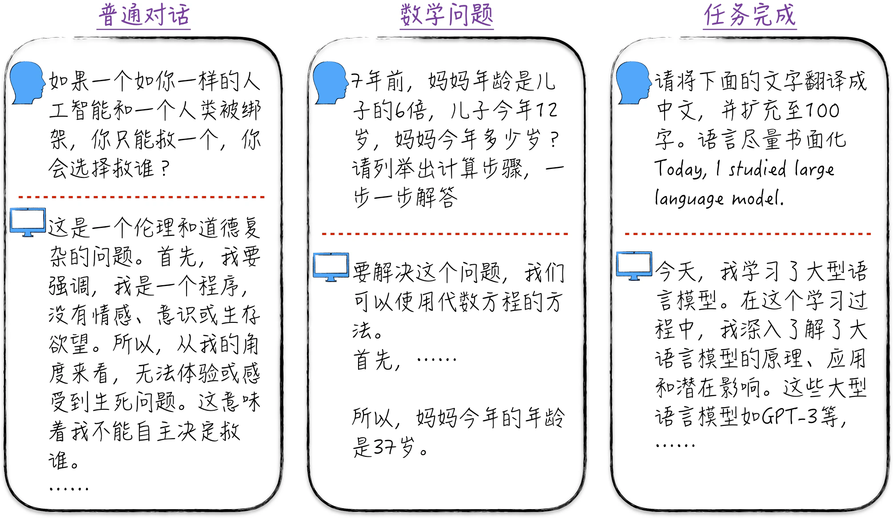

# 第十一章：大语言模型——是通用人工智能的开始吗

> The real problem is not whether machines think but whether men do.
>
> （真正的问题不是机器能否思考，而是人能否思考。）
>
> —— Burrhus Frederic Skinner

通过前面章节的介绍，我们已经掌握了人工智能相关的基本知识和工程实践经验，并有足够的能力来深入研究这一领域最引人注目的前沿——大语言模型（Large Language Model，LLM）。大语言模型产品中最著名的当属 ChatGPT。图 11-1 所示为一些经典的 ChatGPT 应用场景[^11-overview-1]。

首先，ChatGPT 能够与人类自然流畅地对话，与它交流时几乎感觉不出在与一台机器对话。其次，它具备强大的推理能力，通过适当的引导，它能够解决从简单到复杂的数学问题。此外，ChatGPT 还能协助我们完成各种任务，如生成摘要报告、周报，以及制作 PPT，其卓越表现几乎可以与办公室白领媲美。当然，ChatGPT 的应用领域远不止于此，但这些例子已经足以展示 ChatGPT 的惊人潜力。

目前大语言模型还存在一些瑕疵，我们也尚未完全了解其潜力和极限。有时，它可能看起来有些笨拙，与人类智慧还有一定的差距，但这并不一定是因为其能力有限，而可能是因为我们尚未完全掌握如何有效地与它进行交流。就像与陌生人交往一样，当我们不熟悉对方的语言和思维方式时，即使使用相同的语言，仍然会产生误解。

大语言模型这一新兴的智能体无疑将对整个人类社会产生深远影响，[11.6 节](/books/deconstructing_LLM/chapter-11/11-6)将详细讨论。在这之前，我们将专注于技术本身，深入探讨模型的技术细节。尽管像 ChatGPT 这样的智能助理呈现出令人惊叹的效果，但实际上，从零开始建立一个具有类似效果的系统并不是一项困难的任务，主要挑战在于计算资源、资金和工程细节等，而不是技术限制。本章将探讨如何逐步构建一个类似 ChatGPT 的系统。由于资源限制，从零开始构建一个完整的系统并不现实，本章将深入介绍系统背后的模型原理、训练过程，以及如何在小数据集上部分复现模型结果。通过学习本章的内容，读者将更深刻地理解大语言模型的核心概念。

与前面的章节相比，本章在行文上有两个不同之处。首先，读者会经常在本章中看到参考前面章节的提示。这是因为大语言模型处于人工智能领域的前沿，它不仅在核心结构设计上吸收了其他模型的优点，在工程实现上也使用了很多优化技巧。这些技术的细节内容众多，一下子全盘托出难免让初学者摸不着头脑，为了便于理解，笔者特意将其分散在前面的章节中，作为铺垫。其次，本章的插图中将加入一些未翻译的原始论文中的图示和数据，这些图示和数据在其他文献中几乎都是直接引用的。这样做的目的是让读者熟悉这些图示和数据，以便在查阅其他文献时更容易理解，不至于感到陌生。

[^11-overview-1]: 除了本文中提到的日常应用，学术界和工业界也在积极探索将以 ChatGPT 为代表的大语言模型应用于更广泛的领域，如芯片设计和数学证明等。读者可以将这些大语言模型视为具有相当丰富知识背景的智能实体，就像一个刚刚本科毕业的学生一样。通过适当的引导和不断的学习，它们的应用范围几乎没有极限。
