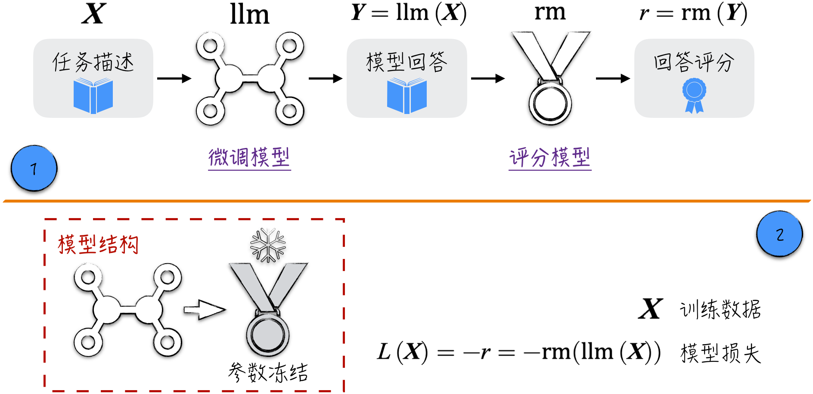
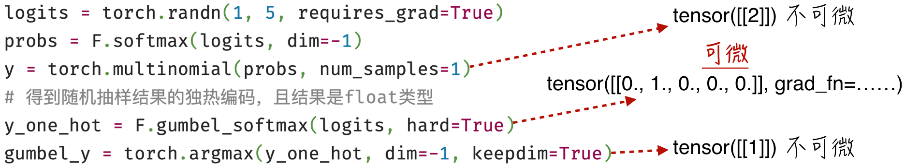
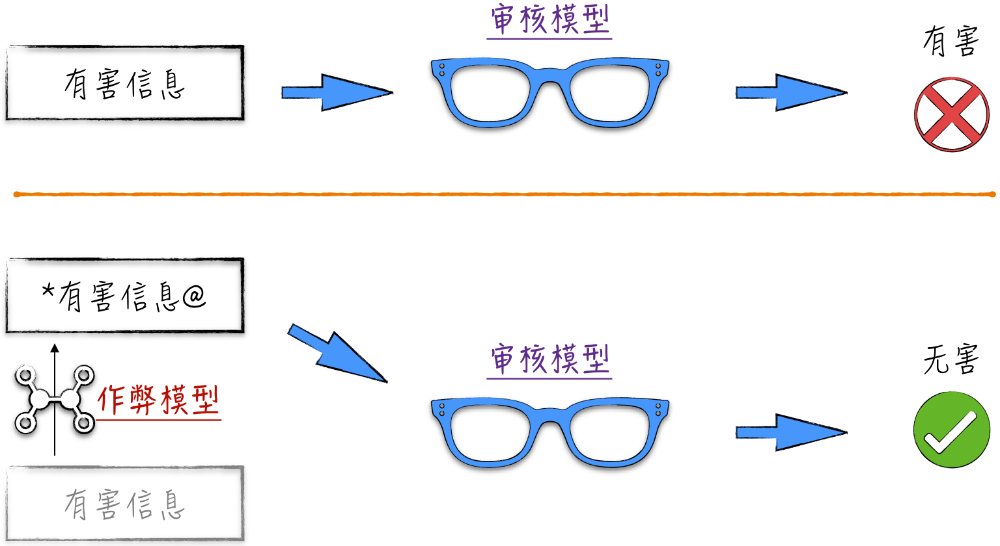
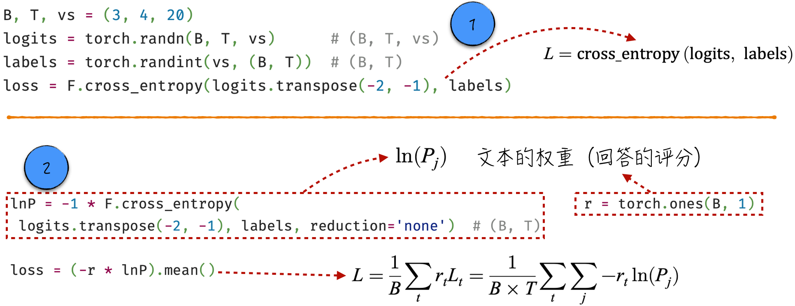
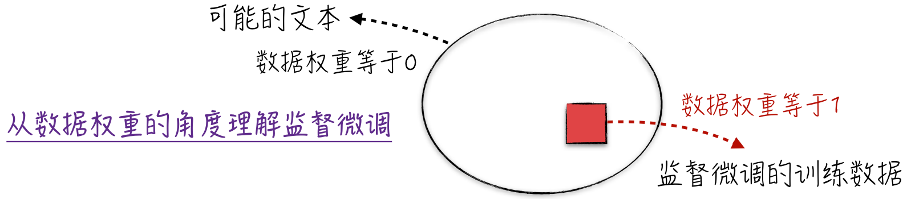

## 12.1 大语言模型的持续优化

在探讨如何通过客户反馈来持续优化模型之前，首先回顾[11.5 节](/books/deconstructing_LLM/chapter-11/11-5)的内容，其中重点讨论了针对大语言模型的两个经典微调案例：监督微调和评分建模。

通过预训练得到的基础模型，虽然功能强大，但受限于训练方式，只能根据文本背景预测下一个词元（Token）是什么。从表现上来看，模型好像一只善于模仿的鹦鹉，能够提供相关的信息，却难以理解人类的真实意图，在交互中常常出现答非所问的情况。为了解决这一问题，对模型进行第一步微调，即监督微调。通过采用固定模板、收集示范数据对模型进行微调，我们成功打磨出了一个更自然、回答效果更好的微调模型。这个模型能够在线上系统中与客户进行有效的互动，同时积累大量的反馈数据。

为了进一步提升模型的表现，充分利用这些宝贵的反馈信息至关重要。然而，反馈信息通常相对有限，而且由于个体差异，用户评价标准也可能存在差异。为了应对这些挑战，引入了评分模型，它能够代替人类对模型的回答和反应进行评估。考虑到大语言模型的主要目标是赢得用户认可，因此进一步优化模型的目标变得十分明确：微调模型，确保模型回答能够获得更高的评分。

### 12.1.1 最大化评分：直观但错误的模型

为了提升模型回答的得分，需要仔细分析当前建模场景中已有的模型组件。如图 12-1 中标记 1 所示，这个场景包括两个关键组件：具备生成回答能力的微调模型，以及负责对回答进行评估的评分模型。当用户给出任务描述时，微调模型将生成一个回答，这个回答将作为评分模型的输入，从而得到相应的模型评分。最终的评分类似于模型的损失，成为模型优化的目标。唯一的区别在于：模型损失越小越好，而模型评分越高越好。

基于上述分析，可以按照图 12-1 中标记 2 所示的步骤来构建模型。首先将微调模型和评分模型联结在一起，并冻结评分模型，这样就完成了模型结构的搭建。接下来，将模型的输出乘以 $-1$ 定义为模型损失。借助已有的训练技术（如随机梯度下降法），模型训练将逐步降低模型损失，即逐步提高模型评分。



上面的建模思路非常清晰，具体的代码实现也不复杂，如程序清单 12-1 所示[^12-1-1]。在整个过程中，关键的步骤是生成文本，如第 11～20 行所示。在实际的生产环境中，可能会采用更复杂的算法来提升生成文本的质量，但核心逻辑始终如一：根据微调模型的预测概率，随机生成下一个词元（见第 18 行）。

#### 程序清单 12-1 直观但错误的模型结构（[完整代码](https://github.com/GenTang/regression2chatgpt/blob/zh/ch12_rl/intuition_model.ipynb)）

```python
class RLModel(nn.Module):

    def __init__(self, llm, r_model):
        super().__init__()
        self.llm = llm
        self.r_model = r_model
        # 冻结模型
        for param in r_model.parameters():
            param.requires_grad = False

    def generate(self, idx, max_new_tokens):
        model = self.llm
        for _ in range(max_new_tokens):
            logits = model(input_ids=idx).logits
            logits = logits[:, -1, :]
            probs = F.softmax(logits, dim=-1)
            # 根据概率，随机生成下一个词元
            idx_next = torch.multinomial(probs, num_samples=1)
            idx = torch.cat((idx, idx_next), dim=1)
        return idx

    def forward(self, idx):
        # 为了代码简洁，设置产生文本的长度
        ans = self.generate(idx, 20)
        reward = self.r_model(ans)
        return reward

inputs = '1 + 2 = 3, 2 + 1 = 3, 1 + 2 ='
ids = tokenizer(inputs, return_tensors="pt")
model = RLModel(llm, r_model)
loss = -1 * model(ids['input_ids'])
# 将报错
loss.backward()
```

到目前为止，一切似乎进展得很顺利，效果更好的大语言模型似乎呼之欲出。然而，当我们兴致勃勃地运行第 33 行代码，试图触发反向传播时，却会意外地收到程序的报错信息。是哪里出了问题呢？下一小节将深入讨论这一问题。

### 12.1.2 为什么行不通：不可微的运算

根据[8.3.5 节](/books/deconstructing_LLM/chapter-8/8-3#section-8-3-5)中的模型联结主义，神经网络的核心思想是通过工程化的方式组装构建出功能更强大的模型。在之前的讨论中，只要模型组件的输入和输出形状对得上，数据格式一致，就可以任意拼接模型。但为什么这里行不通呢？原因在于，之前进行模型联结时，所涉及的运算都是可微的[^12-1-2]，联结出来的模型可以使用反向传播算法。

然而，上述模型计算中有一个不可微的步骤，即生成文本时所使用的随机抽样运算：`torch.multinomial`。要严格证明这个运算的不可微性相当复杂，但我们可以从直观角度来理解这一结论。随机抽样的结果是一系列整数，表示被抽中数据在列表中的位置。从直观上看，计算的结果是离散的，存在“突然跳跃”的情况，因此它是不可微的[^12-1-3]。

为了解决这个问题，可以采用一些可微的运算来替代随机抽样。一个经典的例子是使用 Gumbel-Softmax 技术。如图 12-2 所示，这种技术可以近似地获得随机抽样的结果，同时确保整个计算过程是可微的。



Gumbel-Softmax[^12-1-4]用于在模型联结时能够更完整地使用分类模型（直接利用最终的分类结果）。这项技术在众多模型中取得了成功[^12-1-5]，那么是否可以用它来优化大语言模型呢？答案是否定的。这是因为基于这项技术的优化方式太直接，容易导致模型发生过拟合的现象。具体而言，评分模型能够在一定程度上代替人类对模型回答进行评价，但它存在一些缺陷，比较容易受到“欺骗”，比如一些类似于乱码的文本却能够获得很高的评分。如果让生成文本变得可微，那么基于梯度的最优化算法将导致微调模型更倾向于生成这种容易获得高分但毫无实际意义的回答。从模型的角度来看，这是合理的；从技术的角度来看，这也并非过拟合。使用测试数据，微调模型生成的回答依然能够获得高分，只是这些高分的回答在人类看来毫无意义。

正是因为 Gumbel-Softmax 具备欺骗模型的潜力，学术界常常运用它来进行攻击训练。以社交网络为例，通常使用文本分类模型审核用户发布的信息，例如检测文本中是否包含仇恨言论等有害信息。一般情况下，分类模型表现得相当可靠。然而，通过利用 Gumbel-Softmax，可以创建并训练一个作弊模型来干扰分类模型的判断。简单来说，作弊模型的目标是将包含有害信息的原始文本转化为与之相似但又稍有不同的新文本。从人类的视角看，新文本和原文本基本上没有任何差异（可以简单理解为，新文本包含一些不影响理解的特殊字符）。但对于分类模型来说，它很可能对原文本分类正确，但对新文本分类错误。整个流程如图 12-3 所示。



### 12.1.3 可行的建模方式：调整损失函数

在进一步优化大语言模型时，直接将评分最大化并非可行的方式。那么正确的建模方式是什么呢？实际上，之前的章节已经涉及了这种建模方式。回顾[4.4 节](/books/deconstructing_LLM/chapter-4/4-4)，当面对非均衡数据集时，我们在模型损失中调整了不同类别的权重。通过增加少数类别的权重，模型更倾向于减少这些类别的损失。这启示我们，通过调整文本的权重可以实现建模目标。降低模型在高评分回答上的损失相当于增加模型生成这类回答的概率，这种调整权重的方式可以更好地引导模型生成更高评分的回答。

为了更清晰地理解这一点，下面回顾一下模型的损失函数。假设下一个词元的序号是 $j$，而模型对其的预测是 $\operatorname{logit}_j$。那么，模型在这次预测中的损失如公式（12-1）所示，即模型的损失等于该词元概率对数的负数。

$$
\begin{aligned}
P_j &= \frac{e^{\operatorname{logit}_j}}{\sum_i e^{\operatorname{logit}_i}} \\
L_j &= -\ln P_j
\end{aligned}
\tag{12-1}
$$

此前的模型训练中一次性计算了模型在 $B$ 个文本（每个文本的长度都为 $T$）上的损失为

$$
L=\frac{1}{B\times T}\sum -\ln P_j
\tag{12-2}
$$

这个计算过程中并没有区分文本，而是一并计算所有文本中所有词元的损失。具体的代码实现如图 12-4 中标记 1 所示。



稍微修改公式（12-2）的加和方式。首先，计算模型在一个文本上的损失，即该文本中所有词元的损失之和。从概率的角度来理解，这样计算的理论基础是模型生成文本的联合概率等于各词元概率的乘积。然后计算模型在批量文本上的损失，具体的表达式为

$$
L=\frac{1}{B}\sum_tL_t=\frac{1}{B}\sum_t\frac{1}{T}\sum_j-\ln P_j
\tag{12-3}
$$

这样修改后，可以将模型评分（记作 $r_t$）作为权重引入损失函数，如图 12-4 中标记 2 所示。首先，计算每个文本的损失，然后将其乘以文本的权重（模型评分），最后计算总和，得到模型的总损失。按照之前的讨论，模型会努力降低在高权重下的损失，即增加高权重的 $\sum\ln P_j$，这样就能提高生成高评分回答的概率。在具体实现中，需要注意 3 个要点。

1. 使用 `F.cross_entropy` 时，可以通过将参数 `reduction` 设置为 `none`，得到模型在每个词元上的损失，即 $-\ln P_j$。
2. 如果按照图 12-4 中的方式，让模型评分 $r_t$ 恒等于 1，就得到了常用的模型损失。这时图 12-4 中标记 1 和标记 2 定义的损失是完全一致的。
3. 在图 12-4 中标记 2 的实现中，我们有意地先计算 $\ln P$，然后将模型评分的负数作为权重来定义损失，这样做是在为后续强化学习的讨论做准备。假设模型的参数为 $\theta$，并且批量数据中只有一个文本，那么模型参数的更新公式如下。其中，$P$ 是模型生成该文本的联合概率，即文本中所有词元概率的乘积。请先理解并记住这个公式，它是强化学习中非常关键的数学基础。

$$
\theta_{k+1}=\theta_k-\lambda\frac{\partial L}{\partial\theta}=\theta_k+\lambda\times r\times\nabla\ln P
\tag{12-4}
$$

关于本节讨论的建模方式和模型损失函数，有 3 个有趣的要点值得注意。

1. 公式（12-4）实际上就是[12.4.1 节](/books/deconstructing_LLM/chapter-12/12-4#section-12-4-1)中将要讨论的策略梯度定理。就像“高端的食材往往只需要采用最朴素的烹饪方式”，复杂的模型处理往往只有一个简单直观的思想原型。简单模型并非只有教学用途，深入理解它们的原理对掌握复杂模型非常有帮助。
2. 监督微调的技术原理实际上与本节讨论的方法非常相似。具体来说，在图 12-5 中，如果用大圆表示所有可能的文本数据，那么监督微调阶段的训练数据可以用方块来表示。从理论的角度来看，监督微调实际上就是将方框内的数据权重设置为 1，而方框外的数据权重设置为 0。因此，监督微调也会面临“过拟合”问题。



3. 直接使用调整后的损失函数来训练模型也容易导致“过拟合”问题。这种优化方式过于直接和粗暴，容易导致模型忽视之前预训练的积累，在调整时过度偏向评分模型，从而使模型的整体效果下滑（尽管从评分的角度看，模型似乎有所提高）。当然，也可以选择不使用评分模型，直接利用用户的反馈来训练模型，但这样只会加剧问题。因此，需要一种更精细和更动态的学习方式：既能提高微调模型的评分，又能兼顾预训练阶段积累的知识。这种方法就是强化学习。

[^12-1-1]: 为了突出关键步骤，完整实现中没有使用已经训练过的微调模型或评分模型，但这不会影响模型的构建和训练。
[^12-1-2]: 许多常用的运算都是不可微的，例如 `argmax`。有时难以证明一个运算是否可微，尤其是涉及高维张量时。在实际应用中，借助 PyTorch 可以相对轻松地验证一个运算是否可微：首先创建一个需要计算梯度的张量（`requires_grad=True`），然后检查相应计算结果是否包含 `grad_fn`。
[^12-1-3]: 可微性是函数的一种性质。可微性要求函数图像相对光滑，没有尖锐的凸起或不连续的部分。当讨论随机抽样的可微性时，首先需要在概率空间中定义与计算相关的函数。正如前文所述，由于随机性导致了跳跃行为，这个函数的图像甚至是不连续的，因此不满足可微的要求。
[^12-1-4]: 重参数化（Reparameterization）是一项开创性的技术，其核心思想在于将随机性剥离出来，使得包含随机因素的计算能够使用反向传播算法。Gumbel-Softmax 作为这一技术的代表，其数学处理相对复杂，但代码实现相对简单。对此感兴趣的读者可以参考 PyTorch 中对 Gumbel-Softmax 的实现。
[^12-1-5]: 一个经典的例子是由 OpenAI 开发的生成模型 DALL-E，它能够根据用户输入的文字描述生成相应的图片。
