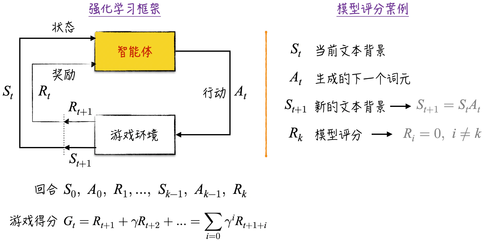
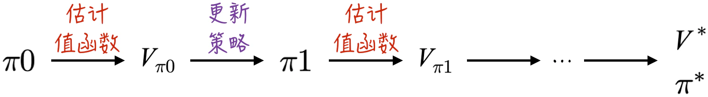

## 12.2 强化学习简介

强化学习与传统学习的主要差异在于训练数据与模型之间的关系。在传统学习中，训练数据的收集与模型的训练相对独立。然而，在某些场景下，模型的训练数据本身就是使用模型过程中的副产物。例如，如果不使用大语言模型生成文本，就无法得到相应的模型评分，而这些评分正是训练数据的一部分。当然，传统学习也可以通过迭代来处理这种场景：使用上一次迭代产生的模型收集评分，然后根据这些评分优化模型并准备下一次迭代。然而，这种方式显得有些离散，训练数据的收集和模型的优化不够连续。在训练过程中，模型实际上已经发生了变化，但是训练数据没有及时地根据这些变化进行调整，导致学习效率不高。

强化学习的创新之处在于将数据收集与模型优化变得更连续，可以形象地将整个过程比作学习骑自行车。骑行过程中几乎同时进行以下两个步骤：获得新的骑行体验，通过这些经验提高骑行技能。这种连续性使得强化学习在处理实时反馈和适应性学习方面表现出色。

### 12.2.1 核心概念

为了更深入地理解强化学习，需要掌握这一领域的核心概念。为了更生动具体地展示这些概念，下面将它们融入游戏的背景中，主要涉及 3 个关键方面：游戏设定、游戏回合、游戏得分。

1. **游戏设定**：在一个游戏中，时刻 $t$ 能观察到游戏的状态（State）是 $S_t$，参与游戏的智能体（可以是模型或者人类）仅基于当前状态做出的行动（Action）是 $A_t$。如图 12-6 左侧所示，这个动作会带来两个后果：一是获得游戏奖励（Reward）$R_{t+1}$，二是游戏状态由 $S_t$ 变成 $S_{t+1}$。在这个过程中，游戏状态的变化可能带有一定的随机性，也就是说，相同的游戏状态和行动可能导致不同的下一个状态[^12-2-1]，而且下一个状态如何分布也存在一定的不确定性。另外，游戏奖励同样存在着不确定性。这正是强化学习存在的原因。如果已知游戏奖励和状态转换的概率分布，那么传统学习就足以解决问题。
2. **游戏回合**：如果 $S_{t+1}$ 不是游戏的结束状态，就重复上述过程，直到游戏结束（本章只考虑有限游戏）。游戏从开始到结束的整个过程被称为一个回合（Episode）。如图 12-6 所示，一个游戏回合（假设游戏在 $k$ 步结束）的结果和过程可以表示为序列 $S_0,A_0,R_1,\cdots,S_{k-1},A_{k-1},R_k$。
3. **游戏得分**：虽然尚未对强化学习的目标给出严格的定义，但直觉告诉我们，它一定与智能体在游戏中获得的奖励有关。一个游戏回合可能包含多个奖励，因此需要以某种方式对这些奖励进行汇总。这里借鉴金融领域的经验，引入折现率 $\gamma$（Gamma）的概念，定义游戏得分（Gain）为 $G_t$。需要注意的是，针对回合中的任意一步都定义了游戏得分，表示游戏奖励到这一步的折现值。这样汇总后，即使某些步骤没有游戏奖励（例如奖励发生在游戏的最后一步），我们仍然能够定义相应的游戏得分，以准确反映当前步骤的价值。

上述概念可能有些抽象，下面举两个更具体的例子来帮助读者理解和熟悉，分别是模型评分场景和传统学习场景。

将强化学习的概念应用到模型评分场景中，可以得到如下的对应结果。时刻 $t$ 的文本背景就是游戏状态 $S_t$，模型生成的下一个词元就是行动 $A_t$。有了这两个要素，下一时刻的状态就是确定的：$t$ 时刻的文本加上生成的词元。同时，并非每一步都存在游戏奖励[^12-2-2]：在文本生成的过程中，游戏奖励保持为 0；在文本最终生成完毕时，会得到一个评分作为游戏奖励。

强化学习的描述与传统学习截然不同，可能会让初学者感到难以理解。如果将训练数据定义为游戏状态（在这种情况下，游戏状态的转换不依赖于智能体的行动，只依赖于预先设定好的数据顺序）；将模型预测定义为行动；将模型损失的负数定义为游戏奖励。那么，强化学习就可以等同于传统学习了（其中 $\gamma=1$）。因此，传统学习实际上可以被视为强化学习的一个特例。

### 12.2.2 目标定义

在上述设定的基础上，进一步假设智能体通过策略（Policy）$\pi$ 来决定其行动。一般而言，智能体的策略是随机的（Stochastic Policy）[^12-2-3]，也就是说，在面对游戏状态 $S_t$ 时，智能体对于将要采取的行动具有一定的随机性。模型评分的例子就属于这种情况：在预测下一个词元时，大语言模型返回的是下一个词元的概率分布。因此，为了简化数学表达，使用 $\pi(A_t,S_t)$ 表示在状态 $S_t$ 下采取特定行动 $A_t$ 的概率。具体的数学公式如下：

$$
\begin{aligned}
\pi(A_t,S_t)&=p \\
\sum_{A_t}\pi(A_t,S_t)&=1
\end{aligned}
\tag{12-5}
$$

强化学习的目标是找到最佳的策略 $\pi^*$，以使智能体在游戏中达到最高的平均分。这一目标很直观，但实现起来相当复杂。为了更深入地讨论这个话题，需要从数学上严格定义强化学习的目标，分为以下三个关键步骤。

1. 如公式（12-6）所示，针对游戏状态 $S_t$ 定义值函数（Value Function），即从状态 $S_t$ 开始所有回合游戏得分的期望（平均得分）。值函数的计算需要应对两种随机性：游戏状态的转换和策略本身（随机策略）。

$$
V_\pi(s)=E_\pi[G_t\mid S_t=s]
\tag{12-6}
$$

2. 在游戏中，每个状态都有相应的值函数。然而，游戏初始状态的值函数是最让人感兴趣的，它揭示了智能体在整个游戏中的平均表现。为了方便讨论，设定游戏的初始状态为确定且唯一，记为 $S_0$。对于初始状态不明确的游戏，可以引入一个虚构的游戏开端。以模型评分为例，设想存在一个初始状态，在这个状态下，游戏以一定概率生成各种各样的问题，然后正式开始模型回答和评分。
3. 一旦定义好值函数和游戏开端，就能得到最优策略的数学表达式，如公式（12-7）所示。这个公式就是强化学习的目标。

$$
\pi^*=\operatorname*{arg\,max}_\pi V_\pi(S_0)
\tag{12-7}
$$

上述数学公式与传统学习比较类似，值函数似乎就是损失函数的负数，计算它并没有什么难度，那么它的特别之处在哪里呢？

简而言之，特别之处在于传统学习的损失函数有清晰且简单的表达式，而在绝大多数情况下，我们并不知道值函数的具体表达式。以文本生成为例，对于用户提出的问题，模型可能生成的文本几乎是无穷无尽的[^12-2-4]。因此，几乎不可能根据公式（12-6）来计算准确的期望。由于我们不清楚值函数的具体形式，近似它都是一项异常困难的任务。更进一步，如果不知道值函数的具体值，那么公式（12-7）就只是一个理论上的空中楼阁，看起来很吸引人，实际上却难以应用。当然，强化学习的核心内容就是在不知道值函数表达式的情况下解决公式（12-7）所示的最优化问题。

### 12.2.3 两种解决方法

强化学习中解决最优化问题的方法主要分为两大类：策略学习（Policy Learning）和值函数学习（Value Function Learning）。首先介绍数学形式较为简洁的策略学习。

在策略学习的讨论中，将策略限定为神经网络。这时策略可以用符号 $\pi_\theta$ 来表示，其中 $\theta$ 表示模型参数。从理论上来说，值函数 $V_\pi(S_0)$ 就是 $\theta$ 的函数。因此，强化学习的目标就变成了优化参数 $\theta$，使得 $V_\pi(S_0)$ 得到最大值。这个问题可以使用梯度上升法（梯度下降法乘以 $-1$）来解决，具体如公式（12-8）所示。需要注意的是，在强化学习中，习惯用 $\alpha$ 来表示学习速率。

$$
\begin{aligned}
\theta_{k+1}&=\theta_k+\alpha\nabla_\theta V_\pi(S_0) \\
\nabla_\theta V_\pi(S_0)&=\nabla_\theta E_\pi[G_t\mid S_t=S_0]
\end{aligned}
\tag{12-8}
$$

在上述公式中，正确估计参数梯度是关键且最具挑战性的一步。实际上，这个公式并没有直接解决问题，因为 $V_\pi(s)$ 本身就难以准确计算，更别说它的梯度了。从数学的角度来看，计算梯度通常要了解函数的准确表达式（这也是传统学习的思路）。策略学习的独特之处在于它能够在不知道函数表达式的情况下，直接估计函数的梯度。有关策略学习的深入讨论将在[12.4 节](/books/deconstructing_LLM/chapter-12/12-4)中展开。

接下来介绍值函数学习。由于大语言模型的优化过程未直接采用这种方法，本章将只涉及值函数学习的一部分内容。

在值函数学习中，采用如图 12-7 所示[^12-2-5]的迭代方式来估计值函数和更新智能体的策略。这种迭代方式在学术上被称为广义策略迭代（Generalized Policy Iteration，GPI）。实际上，几乎所有的强化学习算法都或多或少地借鉴了广义策略迭代的思想，包括前文介绍的策略学习。广义策略迭代的身影将在后续讨论中反复出现。

根据广义策略迭代的思路，值函数学习可分为两个关键步骤：值函数估计和策略更新。在值函数估计阶段，可以运用神经网络来模拟值函数[^12-2-6]。具体而言，在游戏中利用当前的策略来收集训练数据，随后利用神经网络估计值函数。尽管模型估计存在一定误差，但仍可以利用这些估计结果来推动策略的更新。有关值函数估计的深入讨论将在[12.3 节](/books/deconstructing_LLM/chapter-12/12-3)中展开。

一旦获得了值函数的估计值，就可以利用这些信息来更新策略。在当前状态等于 $s$ 的情况下，如果智能体采取的行动是 $A_t$，那么获得的游戏奖励是 $R_{t+1}$，而下一个状态是 $S_{t+1}$。根据这些设定，更新后的策略[^12-2-7]如公式（12-9）所示。策略的更新通常不牵涉模型的学习，只需根据公式直接求解即可[^12-2-8]。

$$
\begin{aligned}
A_t^*&=\operatorname*{arg\,max}_{A_t}E[R_{t+1}+\gamma V(S_{t+1})\mid S_t=s] \\
\pi(A_t^*,s)&=1
\end{aligned}
\tag{12-9}
$$

总结一下，这两类方法的核心精髓在于：在不知道值函数准确表达式的情况下，有效地估计值函数（值函数学习）和值函数的梯度（策略学习）。

[^12-2-1]: 如果一个游戏的下一个状态仅与当前状态和当前行动有关，那么这个游戏就被称为马尔可夫游戏。马尔可夫游戏是强化学习的主要研究对象，也是本章讨论的内容。顾名思义，描述和解决这类游戏的数学工具是马尔可夫链（Markov Chain）。由于篇幅限制，本章不会深入探讨相关内容，有兴趣的读者可以参考[13.3.2 节](/books/deconstructing_LLM/chapter-13/13-3#section-13-3-2)。
[^12-2-2]: 基于上一节的讨论，模型评分的游戏奖励的确如正文所述。然而，在 ChatGPT 的优化案例中，除了最终的评分，还将引入其他形式的游戏奖励。详细内容将在后续章节中进行深入讨论。
[^12-2-3]: 另一类策略是确定性策略（Deterministic Policy），它可以被看作随机策略的一种特例，其中某一行动的概率等于 1。
[^12-2-4]: 以 GPT-2 为例，它的字典大小为 50256（不包括表示文本结束的特殊字符）。如果设定生成的文本长度为 10，那么可能的生成文本数量将达到 $10^{47}$ 左右，这是一个极其庞大的数字。文本生成的例子相对简单，因为我们已经了解了游戏状态的转换规则；在通常的强化学习场景下，状态转换也无法完全确定，会使值函数的准确估计变得更困难。
[^12-2-5]: 图片参考自 Richard S. Sutton 和 Andrew G. Barto 编著的 *Reinforcement Learning*。
[^12-2-6]: 在进行值函数估计时，除神经网络外，几乎所有的监督学习模型都可以用来完成这一任务，也可以不搭建模型，直接根据算法进行估计。采用神经网络学习值函数的方法被称为深度强化学习（Deep Reinforcement Learning）。
[^12-2-7]: 这里使用的策略更新方法被称为贪心策略（Greedy Policy）。贪心策略是一种确定性策略，很多情况下无法达到最优。为了提升其灵活性，可以引入一定的随机性。
[^12-2-8]: 直接根据值函数进行策略更新常会遇到困难，因为我们对奖励 $R_{t+1}$ 和状态 $S_{t+1}$ 并没有完全了解。为了更简单地更新策略，值函数学习通常采用 Q-learning：定义 $Q(S_t,A_t)$ 为在状态 $S_t$ 采取行动 $A_t$ 的预期得分，再利用模型进行估计。限于篇幅，本章不介绍其具体内容。
