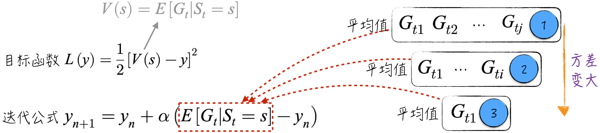
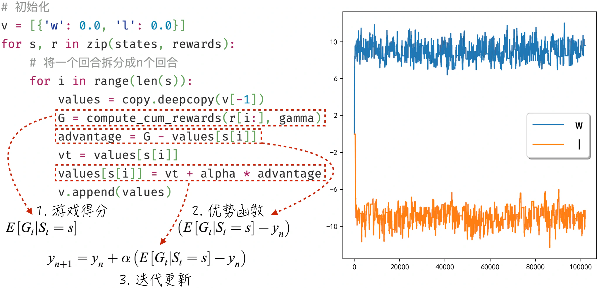
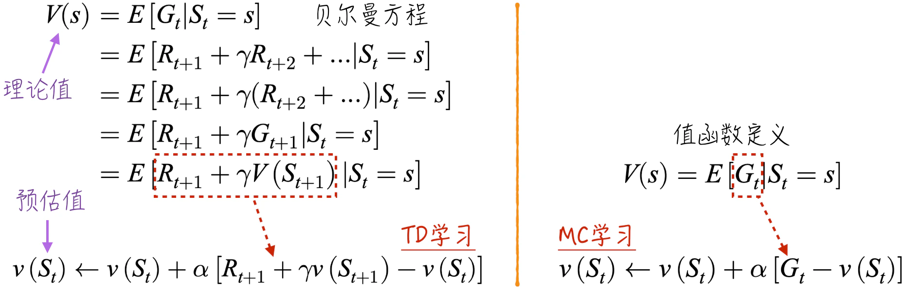
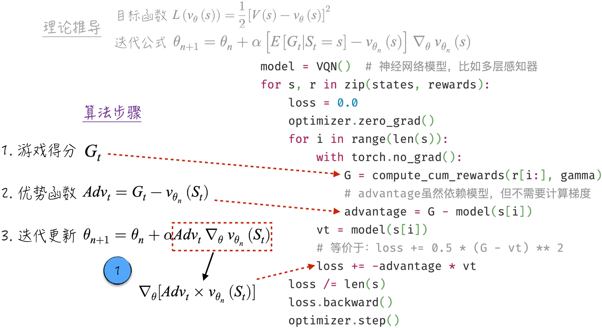
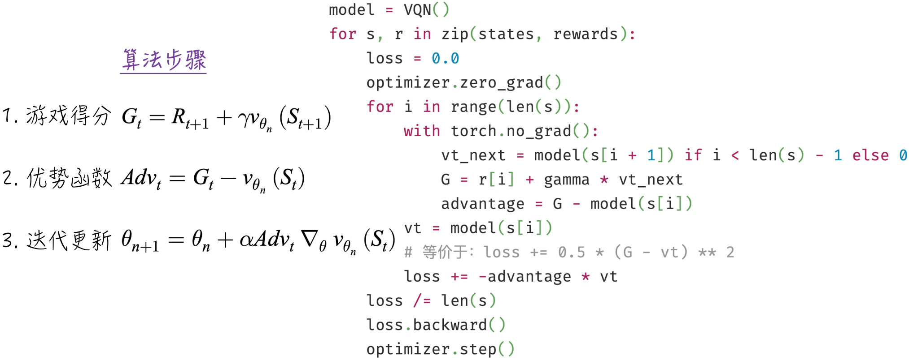
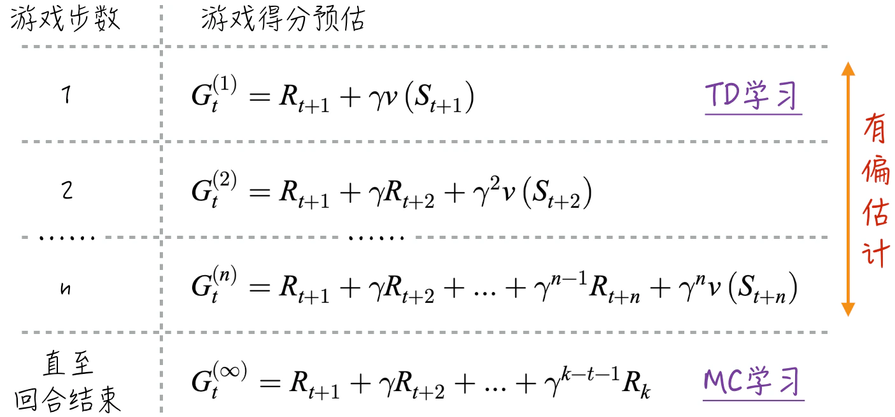
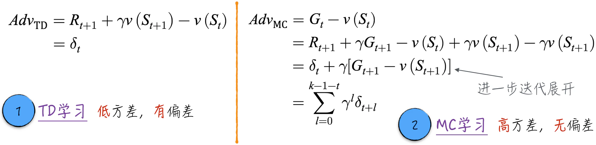
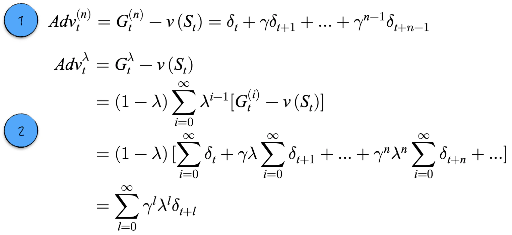
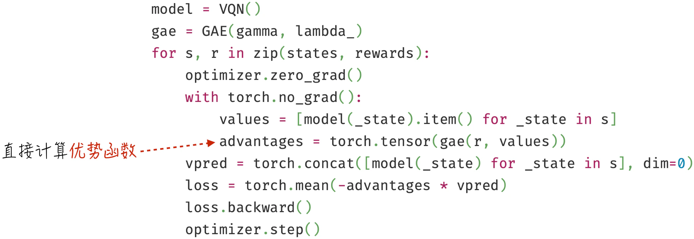

## 12.3 值函数学习

本节将简要讨论值函数学习。因为讨论的目的主要是为[12.4.3 节](/books/deconstructing_LLM/chapter-12/12-4#section-12-4-3)做准备，所以本节将专注于值函数的估计，而不涉及策略的更新。也就是说，本节讨论的算法都不是完整版本[^12-3-1]。

为了更清晰地讨论算法，引入一个简单的游戏[^12-3-2]，暂且称之为抽奖。

- 该游戏有两个状态，分别为 $w$ 和 $l$。
- 参与者有两个可能的行动，即抽奖（用数字 1 表示）和不抽奖（用数字 0 表示）。
- 在状态 $w$ 下，每次抽奖的奖励服从均值为 1、标准差为 1 的正态分布；而在状态 $l$ 下，奖励的均值为 $-1$，标准差为 1。
- 参与者如果选择抽奖，那么游戏在产生奖励后有 1% 的概率会终止；如果选择不抽奖，那么游戏立即终止（在这种情况下，游戏的奖励为 0）。

在本节中，无须考虑策略的更新，可以将策略固定为一直抽奖（尽管这并非最佳策略）。在这个简单的游戏中，各个状态的值函数相对容易获得[^12-3-3]：假设 $\gamma=0.9$，那么状态 $w$ 的预期游戏得分约等于 10，状态 $l$ 的预测得分约等于 $-10$。这些结果将有助于验证后续讨论的算法是否正确。

在值函数的估计过程中涉及两个概念。首先是理论上的值函数，即回合奖励折现值的期望，用 $V(s)$ 表示，可参考公式（12-6）。其次是对值函数的实际估计，用 $v(s)$ 表示。后续的讨论将严格按照上述符号来区分，以免引起误解。

### 12.3.1 MC 学习

MC 学习是值函数估计的经典算法，其全称是蒙特卡洛学习（Monte-Carlo Learning），为了表述简洁，后文将沿用缩写形式。为了更好地理解这个算法，下面从一个优化问题开始介绍，即寻找目标函数 $L(y)$ 的最小值，如图 12-8 所示。根据梯度下降法（参考[6.2 节](/books/deconstructing_LLM/chapter-6/6-2)），可以得到图 12-8 所示的迭代公式。按照这个公式进行迭代，$y$ 可以收敛到 $V(s)$。



在迭代公式中，$-(E[G_t\mid S_t=s]-y_n)$ 表示目标函数的梯度。然而，由于 $E[G_t\mid S_t=s]$ 是未知的，迭代公式似乎无法真正运行。为了解决这一难点，需要回顾[6.4.1 节](/books/deconstructing_LLM/chapter-6/6-4#section-6-4-1)中讨论的随机梯度下降法。该算法并没有严格按照数学公式计算损失函数的梯度，而是使用部分数据来估算，尽管每一步使用的梯度存在一定的误差，但并不影响算法的收敛。换言之，在梯度下降法中，并不需要知道确切的梯度，使用梯度的估计值[^12-3-4]同样可以达到收敛的效果。

同理，对于上述梯度中的期望 $E[G_t\mid S_t=s]$，“正确”的做法是完成足够多个游戏回合，并收集它们的游戏得分，然后计算这些得分的平均值，如图 12-8 中标记 1 所示。但这个平均值只是对真实期望的估计[^12-3-5]，完全可以用少量回合的得分来预估期望，如标记 2 所示。甚至“极端”一点，只用一个回合的得分来预估期望，如标记 3 所示。上述 3 种方法都是可行的，只是回合数越少，预估值的方差越大。

基于上述讨论，MC 学习包含 3 个关键步骤：游戏得分、优势函数、迭代更新。算法的实现过程如图 12-9 左侧所示。在实际实现中，将一个回合拆分成多个独立的回合，以最大限度地利用已收集到的数据，提高算法的学习效率。图 12-9 右侧显示，该算法迅速收敛到了值函数的附近。



对于 MC 学习，数学基础较好的读者可能会产生一些疑惑：根据图 12-8 中定义的目标函数，就可以直接求出 $y$ 的表达式，如公式（12-10）所示，为什么还需要使用迭代的方式来逼近值函数呢？

$$
y^*=V(s)=E[G_t\mid S_t=s]
\tag{12-10}
$$

这个问题的答案并不复杂。由于 $E[G_t\mid S_t=s]$ 是未知的，因此通过数学求解得到的表达式实际上无法直接使用。如果使用单个回合的得分处理公式（12-10），它只能一次性计算，无法用后续游戏得分改进结果；如果希望不断利用新的得分改进估计，公式（12-10）就演变成了 MC 学习。

MC 学习还有一种非常直观的理解方式。参照图 12-9 中的实现，可以用公式（12-11）来概括整个算法：

$$
v(S_t)\leftarrow v(S_t)+\alpha[G_t-v(S_t)]
\tag{12-11}
$$

其中，变量 $v(S_t)$ 表示对游戏得分期望的预估。如果发现某次得分比预估高，也就是游戏结果对平均水平（算法预估值）有优势，就略微增加预估值；反之，则略微降低预估值。通过大量迭代，预估值会逐渐趋近于真实值。

### 12.3.2 贝尔曼方程与 TD 学习

虽然 MC 学习在值函数的预估方面表现出色，但其运行效率相对较低，通常需要耗费大量资源和时间等待整个游戏回合结束才能进行迭代。此外，在一些场景下，游戏可能没有明确的终止状态，例如“金钱永不眠”的金融市场。

理想情况下，我们希望算法能够在游戏进行的过程中就开始运行，及时利用每个奖励信息进行模型更新，以提高学习的实时性。TD 学习正好可以满足这一需求。TD 学习的全称是时序差分学习（Temporal-Difference Learning），为了表述简洁，后文将沿用算法的简称。

为了更深入地理解这一算法，首先了解一下著名的贝尔曼方程（Bellman Equation）。如图 12-10 所示，将游戏得分的表达式在期望运算中展开并重新组合，便可得到贝尔曼方程。它揭示了值函数存在一种类似“循环定义”的平衡：当前状态的值函数等于奖励与下一状态值函数现值之和的期望。



将贝尔曼方程与值函数的定义做对比，可以轻松地将 MC 学习转变为 TD 学习。如图 12-10 所示，用 $R_{t+1}+\gamma v(S_{t+1})$ 代替 $G_t$ 来计算优势即可。因此，TD 学习也可以被看作 MC 学习的扩展。

- 在游戏的每一步，根据获得的奖励 $R_{t+1}$ 和已有的算法结果 $v(S_{t+1})$ 来预估回合的得分。
- 根据第一步得到的预估得分，借鉴 MC 学习的步骤来改进算法结果。

TD 学习是强化学习中具有里程碑意义的算法。它有两个显著特点：首先，它能够实现对每一步游戏结果的实时学习；其次，$v(S_t)$ 不仅是算法的更新对象，还参与了学习目标的定义。在其他算法中，学习目标通常是固定的；而在 TD 学习中，目标 $R_{t+1}+\gamma v(S_{t+1})$ 会随着 $v(S_{t+1})$ 改变[^12-3-6]。虽然这个估计在学习初期通常有偏，但在大多数情况下算法仍能保证收敛，只是速度可能相对较慢。因此需要在工程实践中尝试创新和近似，确保算法迅速且稳定地收敛。

在本章的简单游戏中，算法的收敛并不成问题，具体实现和结果如图 12-11 所示。虽然 TD 算法的优化可以与游戏同时进行，但代码仍选择先等待回合结束并收集数据，再利用每一步的奖励更新算法，以便与文本生成的场景保持一致。在文本生成场景中，首先生成完整文本（相当于回合结束），然后进行强化学习优化。


### 12.3.3 利用神经网络进行学习

在前文的讨论中，无论是 MC 学习还是 TD 学习，都没有搭建任何模型，只是直接根据算法规则进行值函数估计。这其实是强化学习最初的模样。然而，这种方式只能处理离散的游戏状态。如果游戏状态连续或状态数量十分庞大，就不再适用。以模型评分为例，我们不可能在字典中为所有可能的文本申请一个独立的键。因此，本节讨论如何将神经网络与强化学习相融合。

下面以简单的 MC 学习为起点。在最优化问题中引入神经网络模型 $v_\theta(s)$，其中 $\theta$ 表示模型参数，便能得到图 12-12 所示的理论推导结果。在理想的迭代公式中，同样存在未知的 $E[G_t\mid S_t=s]$。借鉴 MC 学习的方法，利用 $G_t$ 来估算这个期望，得到 MC 学习结合神经网络的算法步骤：游戏得分、优势函数和迭代更新。

在迭代更新中，每次都涉及 $Adv_t\nabla_\theta v_{\theta_n}(S_t)$ 的计算。如果严格按照表达式实现，就需要逐个计算参数偏导数。实际上，如果 $Adv_t$ 与 $\theta$ 无关，那么它等于 $Adv_t\times v_{\theta_n}(S_t)$ 的梯度。由于 $Adv_t$ 原本也是 $\theta$ 的函数，需要使用一个关键技巧：通过 `torch.no_grad` 关闭 `advantage` 的梯度追踪（相当于将其参数冻结，细节可参考[7.4.2 节](/books/deconstructing_LLM/chapter-7/7-4#section-7-4-2)）。此外，这里使用梯度上升，所以定义损失函数时需要乘以 $-1$。



总结一下，在使用 PyTorch 实现强化学习算法时，最好充分利用已有封装完成计算。这要求我们对反向传播和最优化算法有深刻理解。不同的强化学习算法存在显著差异，但通常遵循以下步骤。

1. 通过数学变换将梯度计算符号前的变量（除学习速率外）移到符号后。
2. 确保在此过程中被移动的变量不会计算梯度。
3. 根据移动后的梯度公式定义损失函数，并注意损失函数的正负号。

上述步骤在后续的复杂算法中会反复出现。代码将一个回合分成多个小回合，但并没有对每个小回合都进行参数更新，这与算法的严格定义略有不同。这样处理既是为了与文本生成场景保持一致，也不会影响结果。在实现经典算法时，需要明确哪些是关键步骤，哪些可以灵活调整。

MC 学习和神经网络的结合讨论完毕后，TD 学习和神经网络的结合就变得容易理解了，如图 12-13 所示。只需对游戏得分这一步进行相应调整即可。



### 12.3.4 n 步 TD 学习与优势函数

回顾[12.3.2 节](/books/deconstructing_LLM/chapter-12/12-3#section-12-3-2)的内容，TD 学习实际上是 MC 学习的一种拓展，两者的唯一不同之处在于如何估计游戏得分 $G_t$。MC 学习根据回合内的所有游戏奖励计算实际游戏得分，而 TD 学习利用当前奖励和已有算法结果来预估游戏得分。将 TD 学习的思路推广，如果游戏进行 $n$ 步，便可结合前 $n$ 步奖励和 $n$ 步后的状态估计游戏得分，如图 12-14 所示。



游戏进行 $n$ 步之后，游戏得分的最佳估计是 $G_t^{(n)}$。在此基础上，借鉴 MC 学习的步骤，可以定义 n 步 TD 学习（n-step TD Learning）：

$$
v(S_t)\leftarrow v(S_t)+\alpha[G_t^{(i)}-v(S_t)]
\tag{12-12}
$$

尽管前文花费大量篇幅介绍如何预估游戏得分，但直接参与迭代更新的是 $G_t^{(n)}-v(S_t)$。这个量被称为优势函数（Advantage Function）。它可以理解为：在游戏开始前，算法给出的平均水平预测是 $v(S_t)$；随着游戏进行，根据反馈，得分预期被更新为 $G_t^{(n)}$。如果 $G_t^{(n)}>v(S_t)$，说明采取的行动比平均水平更有优势。这可能意味着模型对平均水平估计太低，需要增加预估值；也可能意味着该行动确实更有利，应提高其概率，这是[12.4 节](/books/deconstructing_LLM/chapter-12/12-4)将讨论的内容。

### 12.3.5 TD Lambda 学习与 GAE

对于 n 步 TD 学习，应该如何选择最合适的 $n$ 呢？首先，MC 学习的优势函数等于 TD 学习优势函数的折现值，具体推导如图 12-15 所示。一般情况下，MC 学习的优势函数方差大于 TD 学习的优势函数。这一点在图 12-9 和图 12-11 的例子中也得到印证。另一方面，TD 学习的优势函数是有偏的。因此，$n$ 越小，优势函数的方差越小，但偏差越大，无法选出一个理论上最优的 $n$。



可以不再选择某个特定的 $n$，而将所有结果加权平均，这就是 TD Lambda 学习，正式名称为 TD($\lambda$) 学习。

$$
\begin{aligned}
G_t^\lambda&=(1-\lambda)\sum_{i=1}^{\infty}\lambda^{i-1}G_t^{(i)} \\
v(S_t)&\leftarrow v(S_t)+\alpha[G_t^\lambda-v(S_t)]
\end{aligned}
\tag{12-13}
$$

严格按照公式（12-13）计算 $G_t^\lambda$ 会产生大量重复计算。为了提高效率，引入 GAE（Generalized Advantage Estimation）算法，具体操作如图 12-16 所示：先将每个 n 步 TD 学习的优势函数写成 TD 学习优势函数 $\delta_t$ 的折现值，再展开 TD Lambda 学习的优势函数，得到可以高效计算的公式。



当 $\lambda=0$ 时，算法就是 TD 学习；当 $\lambda=1$ 时，算法演变成 MC 学习。除非 $\lambda=0$，否则 TD Lambda 学习需要等到回合结束。由于 GAE 更好地综合了游戏中每步的信息，在没有特殊实时性需求时，通常更倾向于使用 GAE 估计值函数。

算法的代码实现并不复杂，与计算游戏得分十分相似，都是对序列进行折现（游戏得分是奖励的折现，而 GAE 是对 $\delta_t$ 的折现）。

#### 程序清单 12-2 GAE（[完整代码](https://github.com/GenTang/regression2chatgpt/blob/zh/ch12_rl/value_learning.ipynb)）

```python
class GAE:

    def __init__(self, gamma, lambda_):
        self.gamma = gamma
        self.lambda_ = lambda_

    def __call__(self, rewards, values):
        advantages = []
        last_ad = 0
        vt_next = 0
        for r, vt in zip(reversed(rewards), reversed(values)):
            delta = r + self.gamma * vt_next - vt
            last_ad = delta + self.gamma * self.lambda_ * last_ad
            advantages.insert(0, last_ad)
            vt_next = vt

        return advantages
```

基于 GAE，可以实现相应的值函数估计，图 12-17 展示了如何将 GAE 和神经网络结合。



[^12-3-1]: 要实现完整算法，需要在值函数估计的基础上按照规则更新策略。有兴趣的读者请参考其他相关文献。
[^12-3-2]: 关于游戏的完整实现，请参考[`ch12_rl/utils.py`](https://github.com/GenTang/regression2chatgpt/blob/zh/ch12_rl/utils.py)。
[^12-3-3]: 平均情况下，每个回合有 100 次抽奖，在 $w$ 状态下每次奖励等于 1。利用等比数列求和，可以得到预期游戏得分约等于 10。
[^12-3-4]: 并非所有估计值都能达到良好的收敛效果。数学上可以证明，只有无偏的估计值（估计值的期望等于真实梯度）才能保证收敛。
[^12-3-5]: 游戏得分可以被视为随机变量，每个回合的分数只是一次观测。多次观测的平均值与单次观测有相同的期望，但方差更小，估计更可靠。
[^12-3-6]: TD 学习会使用已有算法（模型）的结果动态调整学习目标，这种方法被称为 Bootstrapping（自助法）。它使数据收集与模型优化成为相对连续的过程。
