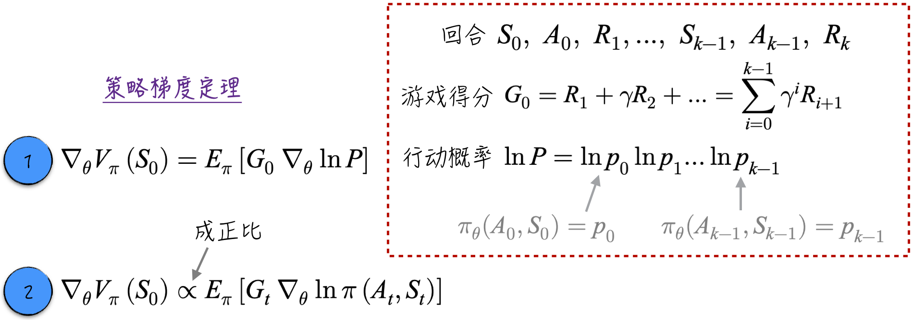
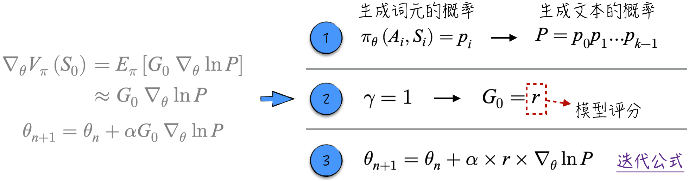
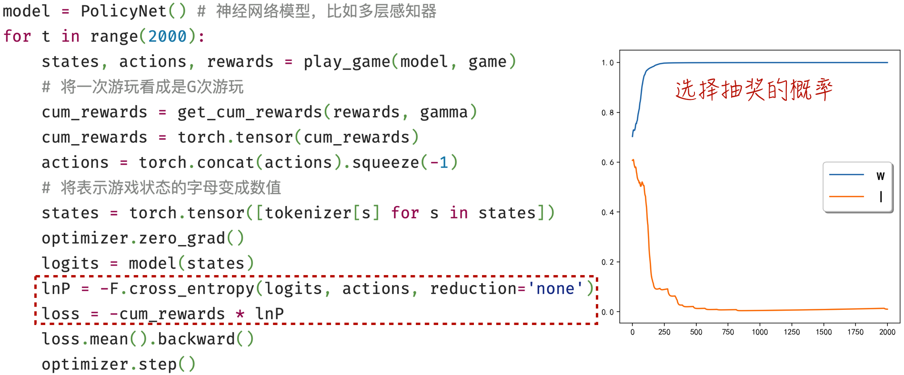
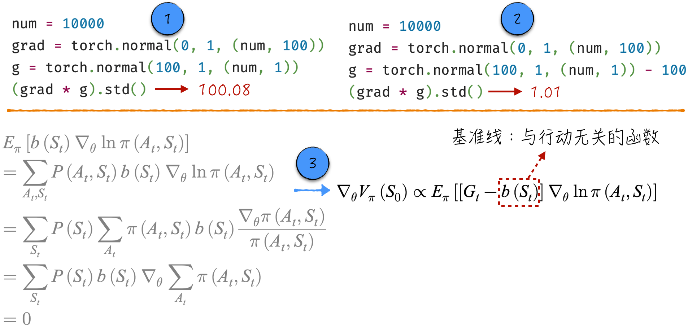
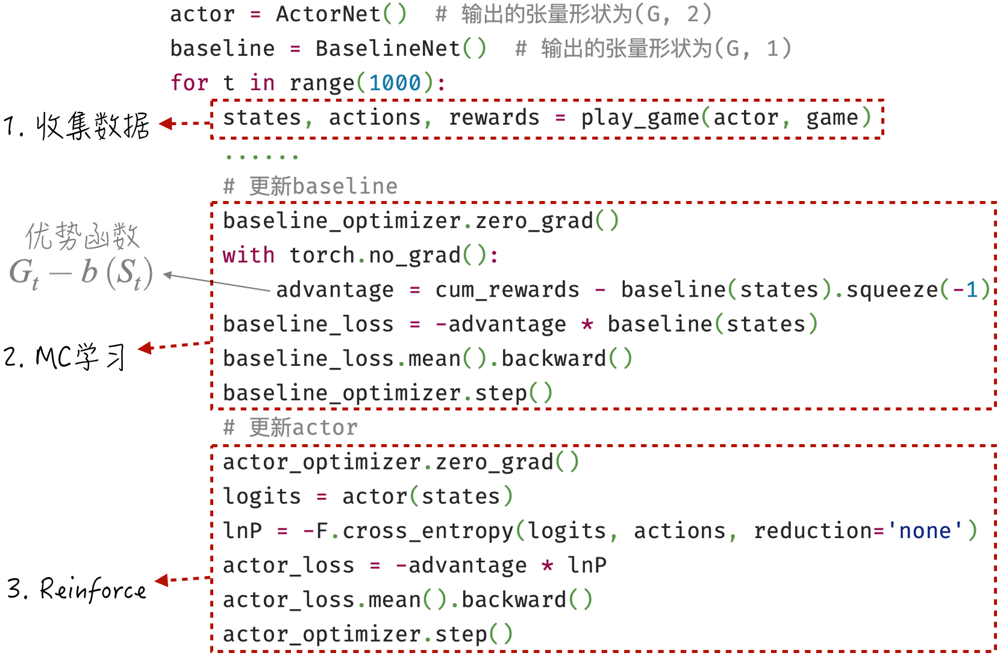
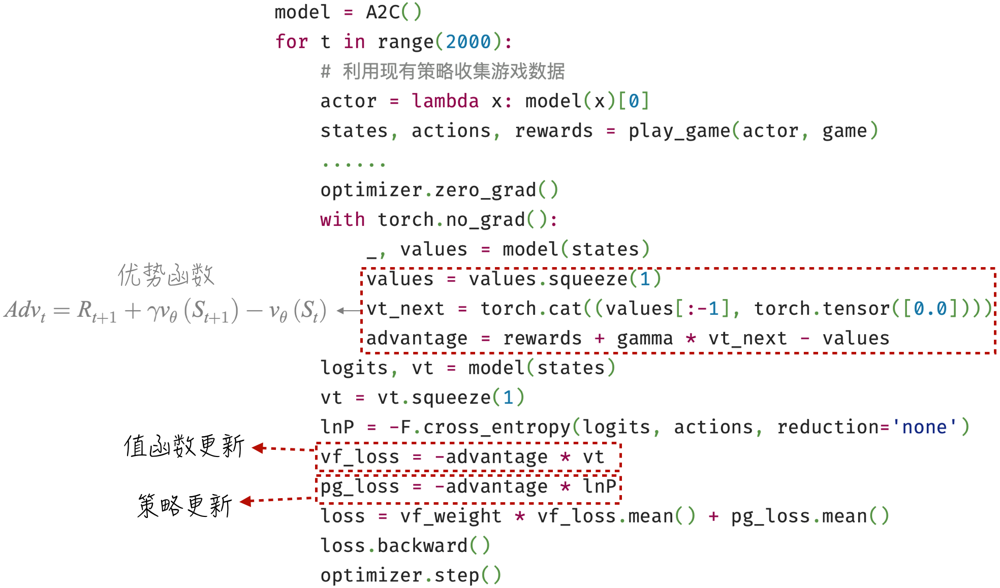

## 12.4 策略学习

上一节深入讨论了值函数学习的核心概念，即在给定策略的情况下如何估计值函数。然而，值函数的估计只是整个过程中的一小部分，强化学习真正追求的是找到游戏的最佳策略。为了达到这一目标，可以在值函数估计的基础上，通过规则更新策略并不断迭代，直至得到最佳策略（请参考图 12-7）。这种方法可行，但显得有些烦琐，不够直接。

另一种更简洁的方法是直接为策略搭建模型，并通过最优化算法使策略收敛到最佳。本节将深入讨论策略学习的方法 Reinforce，并在此基础上利用值函数估计，实现更快速、更稳定的策略收敛。这也是本节将要详细探讨的另两个算法：基准线（Reinforce with Baseline）和 A2C（Advantage Actor Critic）。

本节的讨论将沿用[12.3 节](/books/deconstructing_LLM/chapter-12/12-3)的游戏。根据游戏设定，当处于 $w$ 状态时，预期奖励为 1，而在 $l$ 状态时，预期奖励为 $-1$。由于它们之间没有状态转换，因此可以轻松推导出游戏的最佳策略：如果当前处于 $w$ 状态，就持续抽奖；如果处于 $l$ 状态，就避免参与抽奖。

### 12.4.1 策略梯度定理

策略学习的核心理论是策略梯度定理（Policy Gradient Theorem）。为了更好地理解这一理论，首先回顾[12.2.2 节](/books/deconstructing_LLM/chapter-12/12-2#section-12-2-2)的内容。在游戏中，策略的输入是游戏状态 $S_t$，输出是行动 $A_t$ 的概率分布。通过一个神经网络模型来模拟策略，用符号 $\pi_\theta$ 表示，其中 $\theta$ 表示模型参数。为了简化数学表达，用 $\pi(A_t,S_t)$ 表示在状态 $S_t$ 下采取特定行动 $A_t$ 的概率。模型的学习目标是最大化初始状态 $S_0$ 的值函数 $V_\pi(S_0)=E_\pi[G_t\mid S_t=S_0]$。解决这个最优化问题的关键在于计算策略的梯度：

$$
\nabla_\theta V_\pi(S_0)=\nabla_\theta E_\pi[G_t\mid S_t=S_0]
\tag{12-14}
$$

直接计算公式中的梯度是一项具有挑战性的任务。幸运的是，策略梯度定理为我们提供了两种更可行的计算方式，如图 12-18 所示。



1. 在第一种计算方式中（见图中标记 1），策略梯度定理的表达式以等号的形式呈现。其中，$G_0$ 和 $\ln P$ 是针对游戏回合的指标。如果游戏回合为 $S_0,A_0,R_1,\cdots,S_{k-1},A_{k-1},R_k$，那么 $G_0$ 表示该回合在初始状态的游戏得分，$\ln P$ 表示该回合中所有动作的联合概率。
2. 在第二种计算方式中（见图中标记 2），策略梯度的表达式以“正比”形式呈现，即策略梯度的精确值与公式右边的量之间相差一个常数值。这样估计对最优化算法已经足够，只差一个常数并不会影响算法收敛，只会影响学习速率的选择。虽然计算的是策略在初始状态的梯度，但公式右边与初始状态关系不大，它是任意时刻游戏得分和概率对数乘积的期望。

比较这两种计算方式，第一种更准确，但计算更烦琐，需要计算整个回合所有行动的联合概率；第二种只需计算当前行动的概率。因此，通常更倾向于采用第二种方式。

虽然第一种计算方式并不实用，但它在理论上提供了很多启发。通过借鉴 MC 学习的方法，利用单个游戏回合的得分来估算策略梯度 $E_\pi[G_0\nabla_\theta\ln P]$，可以得到图 12-19 左侧的参数迭代公式。



将这一公式映射到模型评分场景中：游戏策略就是生成回答的大语言模型，$P$ 等于生成文本的概率；游戏奖励在最后一步产生，如果设定折现率 $\gamma=1$，回合初始状态的游戏得分就是模型评分。因此，图 12-19 中标记 3 所示的参数更新公式与[12.1.3 节](/books/deconstructing_LLM/chapter-12/12-1#section-12-1-3)中的公式（12-4）几乎完全一致。这个结果也提醒我们：如果直接使用策略学习来优化大语言模型，可能会面临比较严重的“过拟合”问题。

### 12.4.2 Reinforce 算法

Reinforce 算法的中文翻译是“强化”，为了避免引起不必要的误解，后文直接使用英文名称。该算法的核心设计包括两个要素：一是采用策略梯度定理的第二种计算方式；二是借鉴 MC 学习的方法，利用单个游戏回合的数据来估算策略梯度，即 $E_\pi[G_t\nabla_\theta\ln\pi(A_t,S_t)]\approx G_t\nabla_\theta\ln\pi(A_t,S_t)$。具体的迭代公式如下：

$$
\theta_{n+1}=\theta_n+\alpha G_t\nabla_\theta\ln\pi(A_t,S_t)
\tag{12-15}
$$

其中，$\ln\pi(A_t,S_t)$ 的实现可以参考[12.1.3 节](/books/deconstructing_LLM/chapter-12/12-1#section-12-1-3)中的图 12-4，$G_t\nabla_\theta\ln\pi(A_t,S_t)$ 的实现可以参考[12.3.3 节](/books/deconstructing_LLM/chapter-12/12-3#section-12-3-3)中的图 12-12。借助这些准备，可以得到图 12-20 所示的代码实现及运行结果（[完整代码](https://github.com/GenTang/regression2chatgpt/blob/zh/ch12_rl/policy_learning.ipynb)）。



整个算法的核心步骤被标记在图 12-20 的虚线框内，其中变量 `lnP` 对应公式（12-15）中的 $\ln\pi(A_t,S_t)$。值得注意的是，在计算游戏得分 `cum_rewards` 时，必须确保该变量的参数被冻结。当然，对于分类模型（本例中的策略就是一个分类模型），需要通过随机抽样得到最终分类结果，它们天然就是不可微的。

### 12.4.3 基准线算法

在 Reinforce 算法中，$G_t$ 直接参与梯度计算，但由于其方差较大，会降低算法的收敛稳定性（详见[12.3.5 节](/books/deconstructing_LLM/chapter-12/12-3#section-12-3-5)）。因此，我们希望找到一种方法来减小梯度方差，这就是基准线算法。该算法全称是 Reinforce with Baseline，本章简称为“基准线”。

在深入讨论算法之前，通过一个直观例子理解其核心设计。如图 12-21 中标记 1 所示，假设 `grad` 是 $\ln\pi(A_t,S_t)$ 本身的梯度，`g` 是游戏得分。当直接使用游戏得分时，最终参与迭代更新的梯度方差很大。如果减小游戏得分的绝对值，例如减去游戏得分的平均值，就能有效减小最终梯度的方差，如标记 2 所示。这个过程有点类似于对游戏得分进行归一化。

如图 12-21 中标记 3 所示，引入一个与行动无关的函数 $b(S_t)$，可以看到在游戏得分中减去它并不影响策略梯度的估计。这个与行动无关的函数就是基准线。



基准线的选择非常灵活：既可以是固定数值，也可以是与行动无关的函数，比如值函数。由于 Reinforce 算法的思路与 MC 学习很相似，自然可以选择 MC 学习得到的值函数估计作为基准线。具体步骤和代码实现如图 12-22 所示（[完整代码](https://github.com/GenTang/regression2chatgpt/blob/zh/ch12_rl/a2c.ipynb)）。



需要注意以下两点。

1. 如果使用 MC 学习的值函数作为基准线，那么参与策略更新的其实是 MC 学习中的优势函数（参与值函数更新的也是同一个优势函数）。提升某一行动概率的依据应该是这个行动能否获得比平均水平更高的得分，而不应该仅仅是某个状态下的平均得分。
2. 值函数的估计依赖于游戏策略。为了突出重点，[12.3.3 节](/books/deconstructing_LLM/chapter-12/12-3#section-12-3-3)讨论的是在固定策略下估计值函数。然而在这里策略不断变动，因此必须按照图 12-7 中介绍的广义策略迭代交替更新值函数和策略：先按已有策略收集数据，再计算 MC 学习的优势函数，并用同一个优势函数更新值函数及策略。

### 12.4.4 A2C 算法

基准线算法使用了 MC 学习的优势函数。参考[12.3.5 节](/books/deconstructing_LLM/chapter-12/12-3#section-12-3-5)的讨论，MC 学习的优势函数只是 TD Lambda 学习的一个特例（$\lambda=1$），而且方差最大。因此，可以借鉴 TD Lambda 的其他优势函数进一步改进基准线算法，比如 A2C 算法采用 TD 学习的优势函数（$\lambda=0$）。

理解基准线算法的原理后，A2C 的实现就相对简单，主要改动在于如何计算优势函数。本节的重点在于介绍 A2C 中常用的模型搭建方法——共享参数。在基准线的实现中，使用两个独立的神经网络分别表示游戏策略和值函数估计。A2C 可以继续沿用这一方式，但值函数学习中积累的知识不能传递给策略更新。为了避免这种浪费，实践中更常见的搭建方式是使用一个有两个头的神经网络，同时实现游戏策略和值函数估计。

#### 程序清单 12-3 A2C（[完整代码](https://github.com/GenTang/regression2chatgpt/blob/zh/ch12_rl/a2c.ipynb)）

```python
class A2C(nn.Module):

    def __init__(self):
        super().__init__()
        self.emb = nn.Embedding(2, 4)
        self.action_ln = nn.Linear(4, 2)
        self.critic_ln = nn.Linear(4, 1)

    def forward(self, x):
        # x: (G)
        x = F.relu(self.emb(x))
        actions = self.action_ln(x)  # (G, 2)
        values = self.critic_ln(x)   # (G, 1)
        return actions, values
```

训练模型的过程与基准线的例子非常相似，不同之处主要有两点：一是使用 TD 学习的方法来估算优势函数；二是由于采用共享参数的方式，只需定义一个损失函数即可。相关实现细节如图 12-23 所示。


