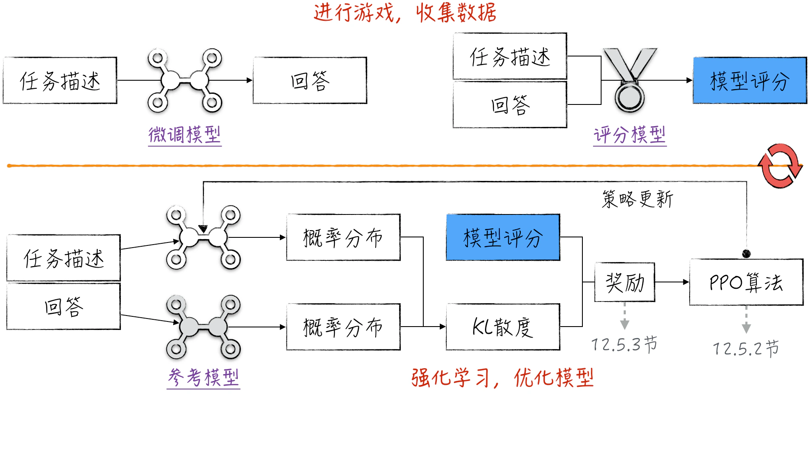
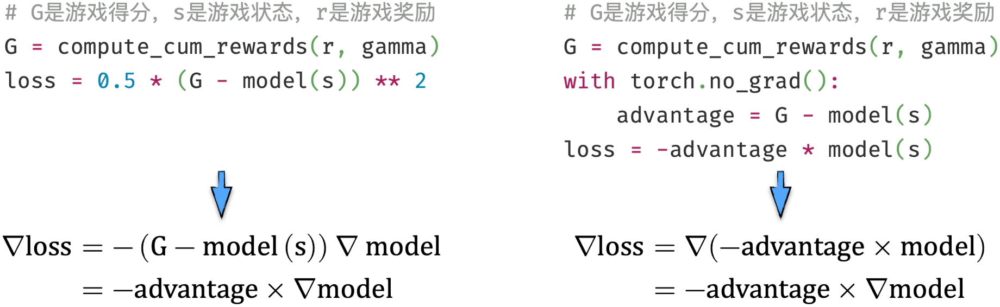
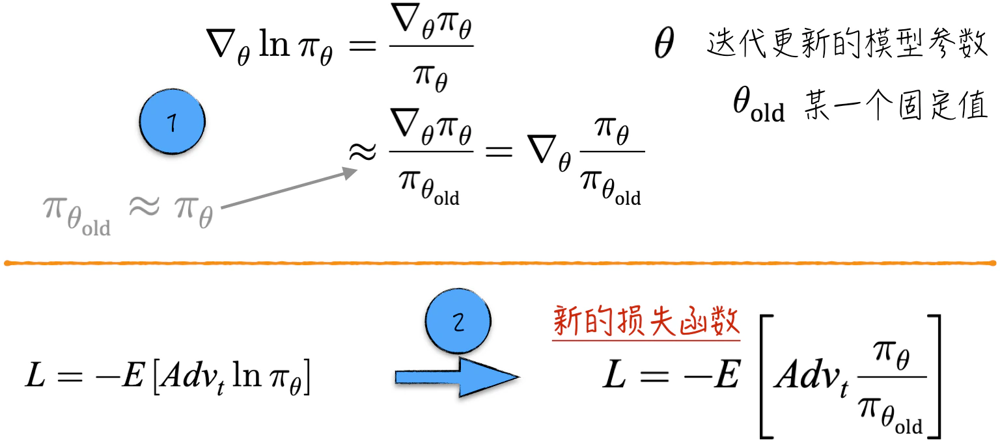
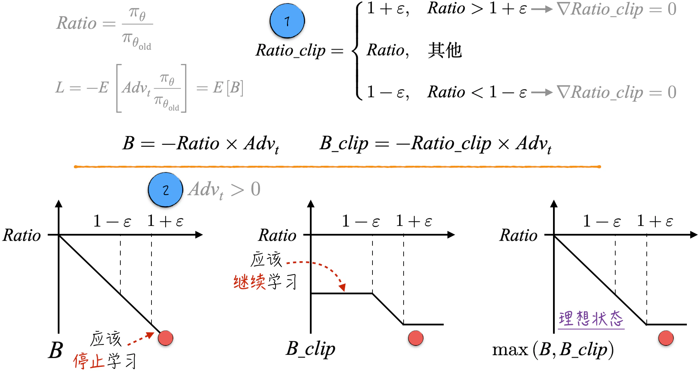
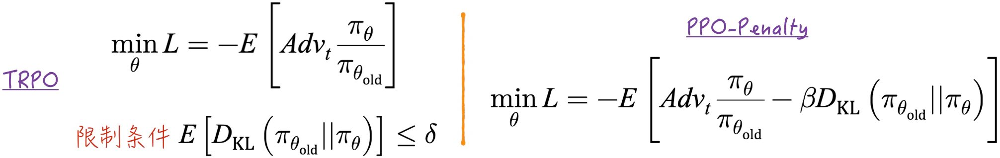
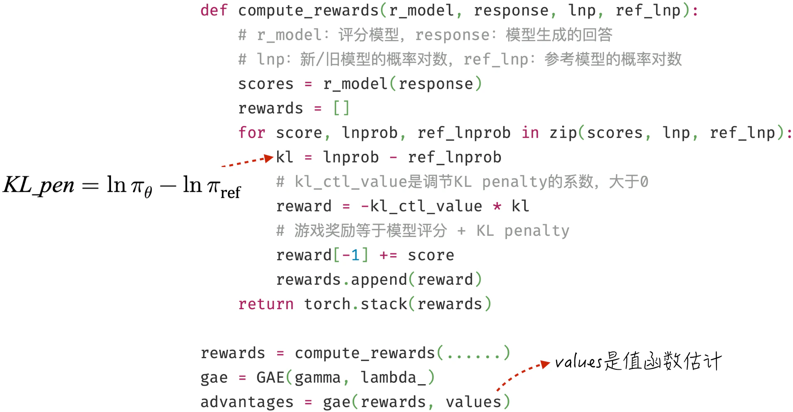
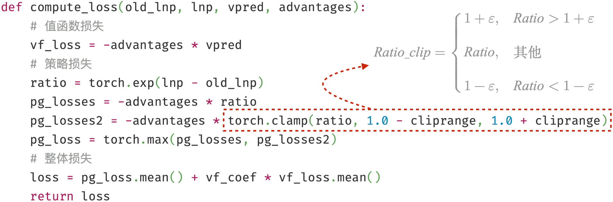
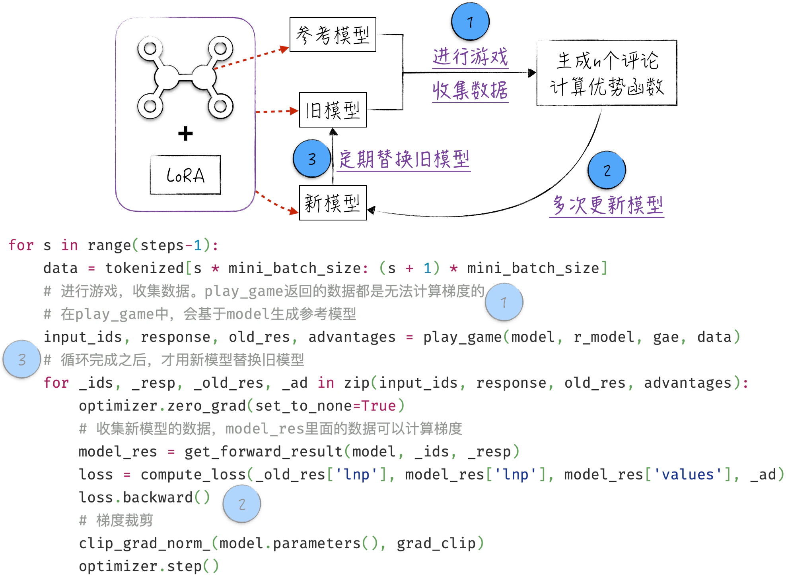

## 12.5 利用 PPO 优化大语言模型

在经过充分准备之后，我们有了足够的背景知识和经验，可以深入讨论如何运用强化学习进一步优化大语言模型。图 12-24 所示为模型优化的整个流程[^12-5-1]。这一过程分为两个阶段：首先利用大语言模型生成文本，再通过评分模型获取相应评分，主要目的是收集数据；接着利用收集的数据，运用强化学习技术优化模型。



### 12.5.1 损失函数与参数更新

损失函数是人工智能模型的灵魂，它不仅可以作为评估模型性能的标准，还直接影响着模型参数的更新方式。前文遵循的思路是先明确定义模型损失，再基于最优化算法推导参数更新公式（详细内容请参考[第 6 章](/books/deconstructing_LLM/chapter-6)的图 6-8）。然而，深入观察参数更新公式，会发现参与计算的实际上是损失函数的梯度，而非损失函数本身。如果两个函数的梯度相同，任选其中一个作为损失函数都能实现相同效果。以[12.3.3 节](/books/deconstructing_LLM/chapter-12/12-3#section-12-3-3)中的 MC 学习为例，图 12-25 所示的两种损失函数定义得到完全一致的模型结果。



这启发我们，可以通过参数更新公式反推一个合适且相对简单的损失函数，从而简化模型理论。以策略学习为例，原始目标函数相当复杂，需要借助策略梯度定理才能估算梯度。如果坚持使用原始目标函数，就很难继续改进算法。因此，下面讨论如何为策略学习重新定义损失函数，以 A2C 算法为例，其他算法类似。

[12.4.4 节](/books/deconstructing_LLM/chapter-12/12-4#section-12-4-4)采用共享参数的方式搭建模型。这种方式在工程上提高了学习效率，却增加了理论复杂度。为了便于理解，先假设 A 和 C 是相互独立的模型，策略模型的参数更新如下：

$$
\theta_{n+1}=\theta_n+\alpha Adv_t\nabla_\theta\ln\pi(A_t,S_t)
\tag{12-16}
$$

公式（12-16）与公式（12-4）几乎一模一样，因此可以按照公式（12-17）定义 A2C 算法的策略损失。这个损失函数与分类模型的损失并没有太多差别。如果定义 $Adv_t=-1$，就变成了熟知的分类模型损失函数。

$$
L=-E[Adv_t\ln\pi(A_t,S_t)]
\tag{12-17}
$$

### 12.5.2 从 A2C 到 PPO

根据公式（12-17）定义的损失函数，可以清晰地理解为什么使用 A2C 优化大语言模型会面临严重的“过拟合”问题：尽管优化后的模型评分更高，但从人类角度看，它的表现却下滑了。这是因为 A2C 只关注参与损失定义的模型评分，而忽略了预训练阶段积累的知识。我们的目标是在相对有限的范围内优化模型：尽可能获得高评分，同时不偏离优化前的模型太远。为此需要引入 PPO（Proximal Policy Optimization，近端策略优化）算法。

图 12-26 从 A2C 的梯度出发，引入固定参数 $\theta_{old}$。当 $\theta\approx\theta_{old}$ 时，可以推出 $\pi_\theta\approx\pi_{\theta_{old}}$，于是 $\ln\pi_\theta$ 的梯度可以近似为 $\pi_\theta/\pi_{\theta_{old}}$ 的梯度，并据此定义新的损失函数。直观上，优势函数反映某一行动相对于平均水平的优势：优势越大，就应提升该行动的概率；反之，则应降低其概率。因此，新损失函数的目标可以理解为最大化优势函数的期望。



将 $\pi_{\theta_{old}}$ 视为优化之前的参数，那么 $Ratio=\pi_\theta/\pi_{\theta_{old}}$ 就反映模型的变动程度。旧损失函数只有当前模型的信息，新损失函数则同时包含当前模型和旧模型的信息。优化的核心思想是：模型变动较小时正常更新；变动较大时停止更新。只需对 $Ratio$ 进行裁剪，即可得到 $Ratio_{clip}$，如图 12-27 中标记 1 所示。



如果以 $B$ 的期望作为损失函数，就等同于 A2C，模型可能持续偏离旧模型；如果只使用 $B_{clip}$，当 $Ratio<1-\varepsilon$ 时模型会因裁剪而无法继续优化；定义 $\max(B,B_{clip})$ 的期望作为损失函数，则可以在推动 $B$ 减小的同时，阻止模型变化超过限定范围。对于优势函数小于 0 的情况也能得到相同结论。因此，PPO-Clip 的策略损失定义如下：

$$
p_{\mathrm{loss}}=E[\max(B,B_{\mathrm{clip}})]
\tag{12-18}
$$

与 A2C 的共享参数类似，PPO 的策略更新和值函数估计也共享参数。因此，需要将策略损失和值函数损失一起考虑。其中，$v_\theta$ 表示值函数的估计，$c$ 是表示值函数损失权重的超参数。

$$
\begin{aligned}
v_{\mathrm{loss}}&=E[-Adv_t\times v_\theta] \\
L&=E[p_{\mathrm{loss}}+c\times v_{\mathrm{loss}}]
\end{aligned}
\tag{12-19}
$$

### 12.5.3 微调游戏奖励

要将 PPO 用于优化大语言模型，还有一个细节需要特别留意：微调游戏奖励。首先讨论两个与概率分布相关的数学工具：KL 散度（Kullback-Leibler Divergence，KLD）和熵（Entropy）。为了理解它们在人工智能中的应用，下面从交叉熵开始。

- 分类模型的损失函数就是标签变量和模型预测结果的交叉熵。针对两个概率分布 $P$ 和 $Q$，它们之间的交叉熵为

$$
\operatorname{cross\_entropy}(P,Q)=-\sum_i p_i\ln q_i
\tag{12-20}
$$

- 熵是某个概率分布与自身的交叉熵。它反映概率分布的分散程度：概率集中于一个值时，熵等于 0；均匀分布在 $n$ 个值上时，熵达到最大值 $\ln n$。

$$
\operatorname{entropy}(P)=-\sum_i p_i\ln p_i
\tag{12-21}
$$

- KL 散度是交叉熵和熵的综合。减小 KL 散度有两个途径：减小 $P$ 和 $Q$ 之间的差异，或提升 $P$ 的分散程度。

$$
D_{\mathrm{KL}}(P\|Q)=-\operatorname{entropy}(P)+\operatorname{cross\_entropy}(P,Q)
\tag{12-22}
$$

将这些工具应用到大语言模型中。模型输出 $\pi$ 表示下一个词元的概率分布，因此可以使用交叉熵度量两个大语言模型之间的差异。新旧模型的交叉熵不超过某个上限，就能确保新模型不会与旧模型相去甚远。此外，在保证准确性的前提下，还希望模型尽可能保持多样性。综合这两个方面，恰好就是让新旧模型的 KL 散度保持在合理范围内。

图 12-28 左侧利用 KL 散度定义受限制的最优化问题，这就是 PPO 的早期形态 TRPO（Trust Region Policy Optimization）。由于带限制条件的最优化问题难以求解，可以把 KL 散度作为惩罚项加入损失函数，得到右侧的 PPO-Penalty。



经典 PPO-Clip 算法并未直接使用 KL 散度。为了提升模型优化效果，可以在模型评分游戏中引入它。

1. 选择一个参考模型。参考模型与 PPO 中的旧模型不同：参考模型在整个优化过程中不改变，旧模型则会随算法运行适时更新。通常选择优化前的微调模型作为参考，但其结构和形式并没有严格规定。
2. 对于给定文本，逐步计算新模型和参考模型之间的 KL 散度，并将其相反数 $-D_{\mathrm{KL}}(\pi_\theta\|\pi_{ref})$ 作为游戏奖励。这意味着每生成一个词元都会有一个奖励，而不只在最后一步获得模型评分。

KL 散度始终为正，因此这一项奖励始终为负，会引导新模型向参考模型靠拢。尽管 KL 散度在数学上是一个期望，但实现时通常使用 $KL_{pen}$ 代替严格计算。

$$
\begin{aligned}
D_{\mathrm{KL}}(\pi_\theta\|\pi_{\mathrm{ref}})
&=\sum_{A_t}\pi_\theta(A_t,S_t)[\ln\pi_\theta(A_t,S_t)-\ln\pi_{\mathrm{ref}}(A_t,S_t)] \\
KL_{\mathrm{pen}}&=\ln\pi_\theta-\ln\pi_{\mathrm{ref}}
\end{aligned}
\tag{12-23}
$$

这样选择主要有三个理由：$KL_{pen}$ 与用单次游戏估算策略梯度的思想相似；它能衡量新模型与参考模型的差异，并在大多数情况下为正；如果这个值小于 0，说明新模型的分散情况很好，减去负值相当于增加熵奖励，可以提高模型多样性。

### 12.5.4 代码实现

本节将深入讨论如何运用 PPO 优化大语言模型。在介绍具体代码前，有三个背景信息需要说明。

1. 由于本书采用 GPT-2 的最小版本，并且微调训练有限，直接优化问答模型难以获得直观结果。为突出强化学习的特点，本节实现一个更简单的任务：生成电影评论。相同思路仍适用于问答机器人的优化。
2. 许多开源工具提供了 PPO 封装，但包含大量与算法无关的细节。本书自行实现整个算法，以帮助读者理解；实现不支持多个文本的批量训练，因此不适合高效训练大量数据。
3. 强化学习优化需要微调模型、评分模型和训练数据。本节使用 `lvwerra/gpt2-imdb` 生成电影评论，使用 `lvwerra/distilbert-imdb` 将评论分类为正面或负面，并采用 IMDb 电影评论作为训练数据。优化目标是：根据给定的评论开头，自动生成正面的电影评论。

第一步是搭建模型。PPO 通过共享参数同时实现文本生成（游戏策略）和评分预估（值函数估计）。程序清单 12-4 的第 8～13 行展示模型结构，第 17～25 行使用 LoRA 实现微调。

#### 程序清单 12-4 模型结构（[完整代码](https://github.com/GenTang/regression2chatgpt/blob/zh/ch12_rl/llm_ppo.ipynb)）

```python
class A2CLLM(nn.Module):

    def __init__(self, model):
        super().__init__()
        self.actor = model
        self.critic = nn.Linear(model.base_model.embed_dim, 1, bias=False)

    def forward(self, x):
        _res = self.actor(input_ids=x, output_hidden_states=True)
        logits = _res.logits
        emb = _res.hidden_states[-1]
        values = self.critic(emb).squeeze(-1)
        return logits, values

    ......

def init_peft_model(model):
    config = LoraConfig(
        r=1,
        lora_alpha=8,
        target_modules=['c_attn'],
        fan_in_fan_out=True,
        bias='none',
        modules_to_save=['critic'])
    return PeftModel(model, config, adapter_name='lora_ppo')

model = A2CLLM(AutoModelForCausalLM.from_pretrained('lvwerra/gpt2-imdb'))
model = init_peft_model(model)
```

完成模型架构后，下一步是计算游戏得分以及基于得分的优势函数（关于 GAE 的细节可参考[12.3.5 节](/books/deconstructing_LLM/chapter-12/12-3#section-12-3-5)）。具体实现如图 12-29 所示。



得到优势函数后，下一步是定义模型损失。图 12-30 基本上是对公式（12-18）和公式（12-19）的直接复现。



接下来的模型训练按照强化学习的一般步骤进行：进行游戏、收集数据和更新模型。使用 PPO 时，需要区分新模型、旧模型和参考模型，它们之间的关系和代码实现如图 12-31 所示。



生成评论和收集数据的具体实现可参考程序清单 12-5。采用 LoRA，可以方便地生成参考模型，具体代码见第 14～15 行。

#### 程序清单 12-5 生成评论和收集数据（[完整代码](https://github.com/GenTang/regression2chatgpt/blob/zh/ch12_rl/llm_ppo.ipynb)）

```python
def play_game(model, r_model, gae, data):
    model.eval()
    all_input_ids, all_response, all_res, all_advantages = [], [], [], []
    for input_ids in data['input_ids']:
        all_input_ids.append(input_ids)
        # 生成评论
        response = model.generate(input_ids)
        all_response.append(response)
        with torch.no_grad():
            # 记录旧模型数据
            res = get_forward_result(model, input_ids, response)
            all_res.append(res)
            # 记录参考模型数据
            with model.disable_adapter():
                ref_res = get_forward_result(model, input_ids, response)
            rewards = compute_rewards(r_model, response,
                                      res['lnp'], ref_res['lnp'])
            all_advantages.append(gae(rewards, res['values']))
    model.train()
    return all_input_ids, all_response, all_res, all_advantages
```

仔细观察上述代码会发现，收集数据时使用模型的评估模式（第 2 行）。此外，使用 LoRA 时没有设置 `lora_dropout`。这是因为模型损失依赖 $Ratio$，而它是模型结果的倒数。随机失活可能导致模型对某些数据的预测出现较大偏差，引起 $Ratio$ 异常增大，从而导致算法不稳定。因此，在 PPO 中使用随机失活需要相当谨慎。

若确实需要使用随机失活，最佳位置是在 LoRA 组件内。被冻结的微调模型中也包含随机失活组件，但这些组件应始终关闭，因为它们原本用于影响已经被冻结的参数更新。单独开启或关闭 LoRA 组件内的随机失活时需要格外小心，具体实现和模型结果请参考[`ch12_rl/llm_ppo_correct_dropout.ipynb`](https://github.com/GenTang/regression2chatgpt/blob/zh/ch12_rl/llm_ppo_correct_dropout.ipynb)。

[^12-5-1]: 正文中的流程参考自 ChatGPT 的技术实现。使用强化学习优化模型还有许多其他方法，希望读者不要被特定实例局限，而是能够举一反三。
