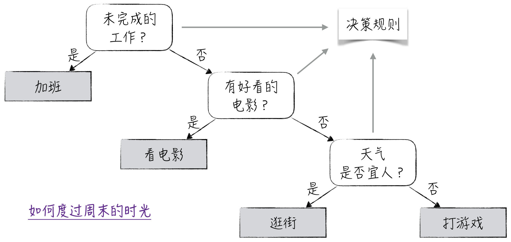
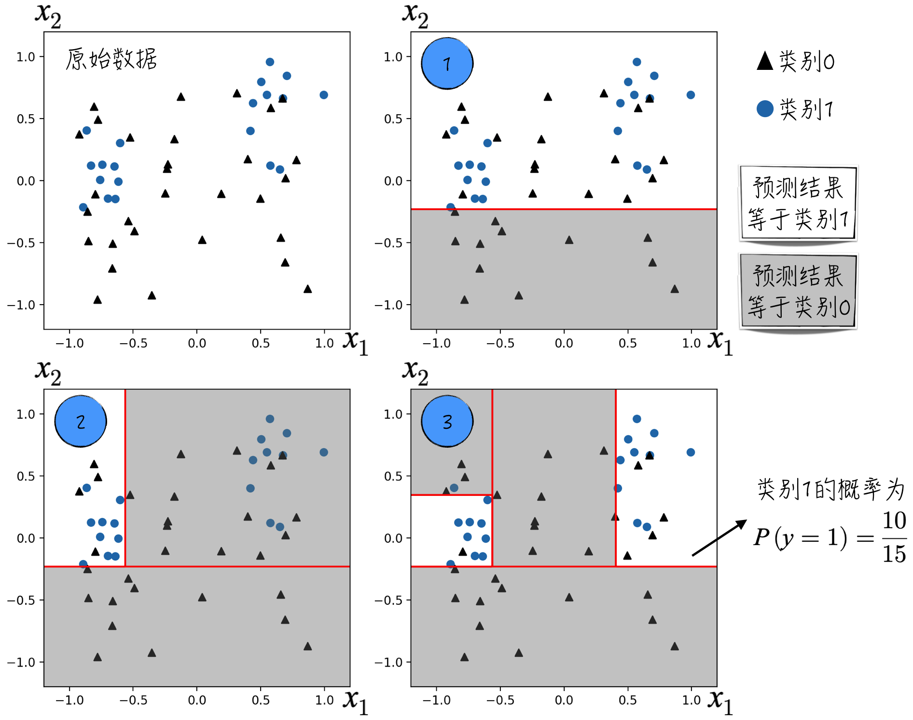
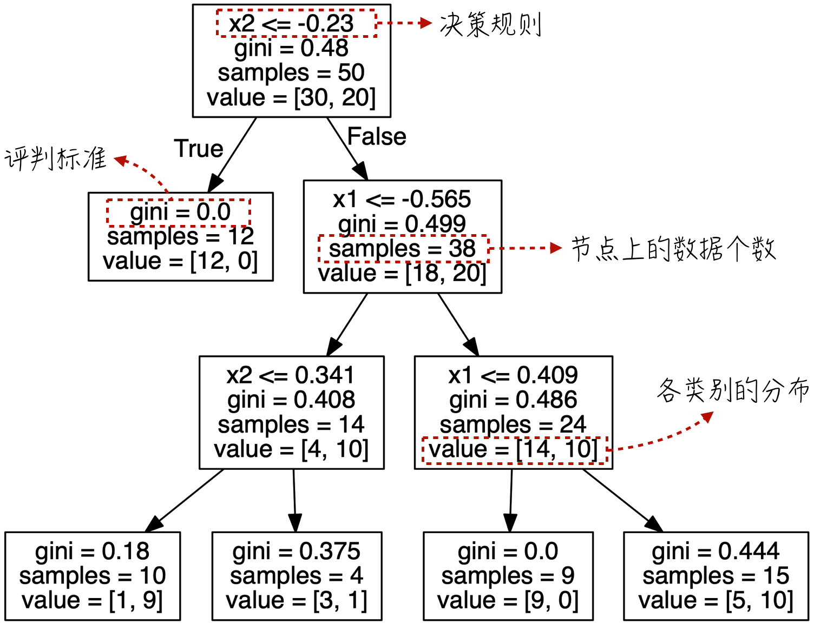
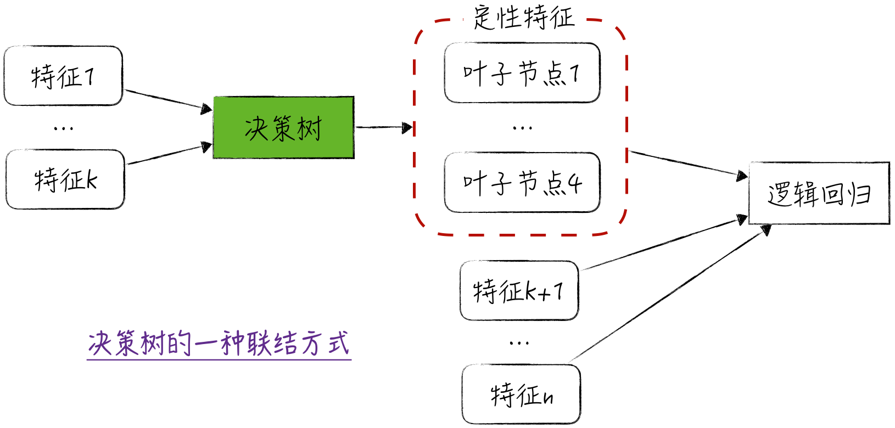
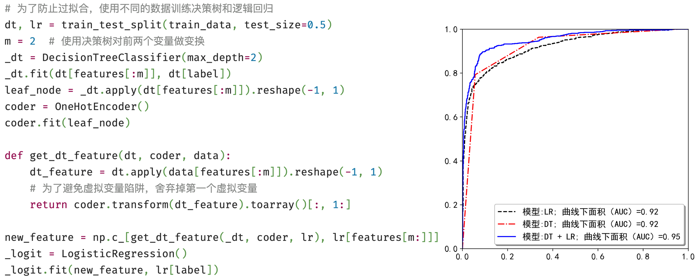
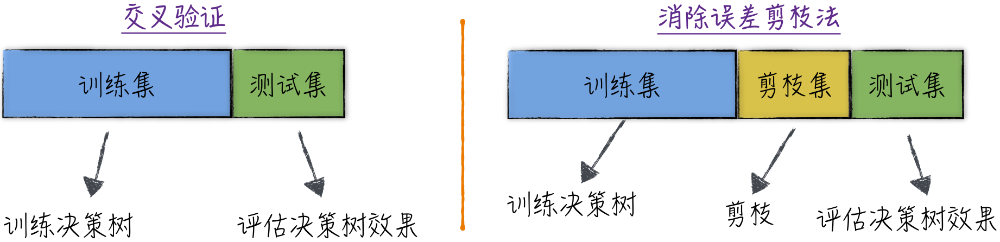
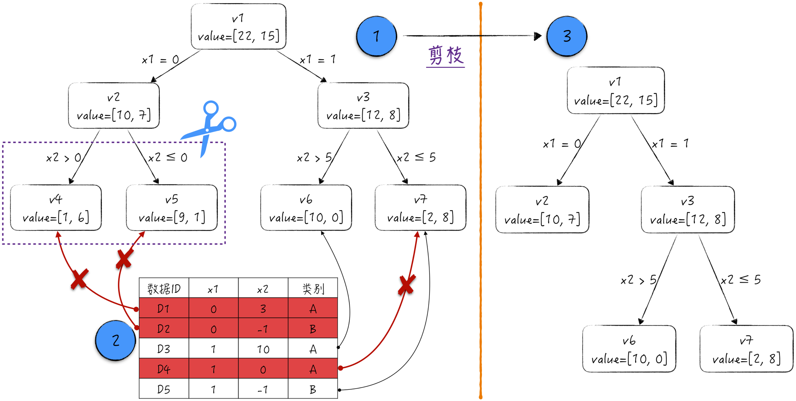

## 13.1 决策树

决策树（Decision Tree）是极具特色的模型。与大多数人工智能模型不同，它不沉溺于复杂的数学抽象，而是通过生成决策规则来解决分类和回归问题，就如同人类做决策一般。

学术界将这一模型称为白盒模型（White Box Model），因为其运行机制能够直截了当地转化为人类语言。即使对这个领域毫不了解的非技术人员，也能轻松理解其工作原理。决策树模型的核心在于决策规则。为了更深入地探讨具体的模型细节，下面研究人们在现实生活中是如何运用规则做决策的。

### 13.1.1 决策规则

设想一下，历经一周的辛劳，我们终于来到了期待已久的周五晚上。在这个夜晚，一个重要的决定摆在我们面前：如何度过即将到来的周末时光？这一决策过程由一系列决策规则、路径及结果交织而成，如图 13-1 所示。圆角框表示决策规则，方形框表示决策结果，而框与框之间的连线表示决策路径。

- 如果尚有一些未完成的工作，那么周末无法休息，只能选择加班。
- 若周末能够美满休憩，我们或许想去看场电影，当然，这取决于近期是否正在上映令人感兴趣的电影。
- 如果好电影稀缺，那么周末活动将取决于天气。如果天气晴好，可以选择出门逛街；反之，只能宅在家里打游戏。

这种简洁的决策过程在日常生活中屡见不鲜，决策树恰好模拟了这样的思考方式。为了对模型有更直观的理解，下面展示决策树解决分类问题的全过程[^13-1-1]。首先随机生成数据，包括两个特征 $x_1,x_2$，如图 13-2 所示；接下来，决策树将按照以下步骤将数据划分为两类。

1. 根据规则 $x_2<-0.23$，将平面分为 2 个区域，如图中标记 1 所示。由于下方灰色区域内的所有训练数据均属于类别 0，因此该区域的预测结果为类别 0。相应地，在上方白色区域内，类别 1 的比例较高，因此该区域的预测结果为类别 1。
2. 在第 1 步的基础上，引入新规则 $x_1<-0.565$，将平面细分为 3 个区域，如图中标记 2 所示。与第 1 步类似，根据各区域内类别的比例，确定该区域的预测结果。
3. 重复上面的过程，可以得到图中标记 3 所示的结果。值得注意的是，决策树不仅可以预测数据的类别，还能输出数据属于各个类别的概率。以标记 3 中右侧白色区域为例，其中有 10 个数据点属于类别 1，5 个数据点属于类别 0。因此，该区域属于类别 1 的概率为 $10/(10+5)$。

我们可以将上述模型结果转换为更直观的树形结构，如图 13-3 所示。其中，方框代表树的一个节点，带有决策规则的节点称为中间节点（Internal Node），没有决策规则的为叶子节点（Leaf Node）。叶子节点表示最终的预测结果，中间节点反映决策的逻辑过程，节点之间的连线代表决策路径。图中 `gini` 字段表示节点的不纯度，相关细节将在[13.1.2 节](/books/deconstructing_LLM/chapter-13/13-1#section-13-1-2)中讨论。

上述简单例子清晰展示了决策树生成规则的方法：选择一个划分特征和相应的阈值，特征值大于阈值是一条决策路径，反之为另一条决策路径。接下来将深入讨论决策规则的评判标准，这是决策树选择划分特征和阈值的基础。

### 13.1.2 评判标准

在处理分类问题时，如果一个节点上的数据几乎都属于同一类别，说明它已经具有很好的纯度，无须进一步划分。如果节点上的数据比较杂乱，那么需要为该节点生成新的划分规则。新规则只要能够有效分离不同类别，使子节点的类别都比较单一，就是一个优秀的规则。

根据上述建模思路，首先定义节点的不纯度（Impurity）。假设数据分为 $K$ 类，分别记为 $0,1,\cdots,K-1$；当前节点记为 $m$，节点上一共有 $N_m$ 个数据。定义类别 $i$ 在该节点上的占比为

$$
p_{mi}=\frac{1}{N_m}\sum_j\mathbf{1}_{\{y_j=i\}}
\tag{13-1}
$$

基于类别占比，通常使用以下几种方式定义节点的不纯度。这些指标的取值范围都在 0 到 1 之间，数值越接近 0，表示类别越趋于单一。

- Gini 不纯度：$\operatorname{Gini}_m=\sum_i p_{mi}(1-p_{mi})$
- 交叉熵：$\operatorname{Entropy}_m=-\sum_i p_{mi}\ln p_{mi}$
- 误分类率（Misclassification）：$\operatorname{Misclf}_m=1-\max_i p_{mi}$

在节点不纯度的基础上，可以进一步定义决策规则的不纯度。以 Gini 不纯度为例，假设节点 $m$ 根据某种规则被划分为两个子节点，可以使用公式（13-2）定义决策规则的 Gini 不纯度。其中，$N_i$ 表示第 $i$ 个子节点的数据个数，$\operatorname{Gini}_i$ 表示第 $i$ 个子节点的 Gini 不纯度。换句话说，某个划分规则的 Gini 不纯度等于各子节点 Gini 不纯度的加权平均，权重为子节点的数据量占比。

$$
\operatorname{Gini}_{\mathrm{split}}=\sum_{i=1}^{2}\frac{N_i}{N_m}\operatorname{Gini}_i
\tag{13-2}
$$

在这些数学定义的基础上，决策规则的生成算法可以描述如下。

- 当节点 $m$ 的 Gini 不纯度小于等于某个阈值时，表示该节点无须进一步拆分，否则需要生成新的划分规则。节点停止划分的其他条件将在[13.1.4 节](/books/deconstructing_LLM/chapter-13/13-1#section-13-1-4)中讨论。
- 对于每个需要再次划分的节点，选择 Gini 不纯度最低的规则来生成子节点，并不断重复这个过程，直至所有节点都不再需要划分。决策树生成策略实际上就是贪心算法[^13-1-2]。

上述算法解决的是分类问题，决策树同样可以解决回归问题。具体步骤与分类问题非常相似，唯一的区别在于将评判标准由不纯度改为距离误差，例如均方差。

### 13.1.3 决策树的预测与模型的联结

决策树是一种白盒模型，其预测算法非常易于解释。对于给定的数据，根据各个节点的决策规则，将数据分配到某个叶子节点，并由叶子节点给出最终预测值。整个过程如图 13-4 所示。

- 对于分类问题，叶子节点提供数据属于每个类别的概率，这个概率等于各个类别的数据占比。假设数据分为 $K$ 类，叶子节点上一共有 $N$ 个数据，则 $P(y=i)=\sum_j\mathbf{1}_{\{y_j=i\}}/N$。最终预测结果为具有最大概率的类别。
- 对于回归问题，叶子节点的预测结果等于节点内标签变量的平均值。

仔细分析决策树对特征的处理，可以发现其优点在于能够综合考虑多个变量，同时对特征的线性变换表现稳定。另外，对于定量特征，决策树将其划分成几个互不相交的区间，这能有效规避定量特征边际效应恒定的隐含假设（更多细节请参考[5.3 节](/books/deconstructing_LLM/chapter-5/5-3)）。然而，决策树的缺点也显而易见：预测算法太过简单，仅利用类别占比或平均值，导致预测效果并不尽如人意。

为了弥补决策树的不足，可以借鉴模型联结主义的思想（相关细节请参考[8.3.5 节](/books/deconstructing_LLM/chapter-8/8-3#section-8-3-5)），巧妙地将决策树与其他模型结合使用。本节简要介绍一种在广告行业和金融反欺诈中广泛应用的方式：将决策树视为特征提取工具。

如图 13-5 所示，假设决策树有 4 个叶子节点，而某个数据落在第 3 个叶子节点，那么数据的新特征是 $(0,0,1,0)$。在新特征和剩余原始特征的基础上搭建逻辑回归模型，从而得到最终预测结果。这种模型结构既保留了决策树在特征提取上的优势，也发挥了逻辑回归预测效果好和稳定性强的长处。

图 13-5 的实现代码如图 13-6 所示（[完整代码](https://github.com/GenTang/regression2chatgpt/blob/zh/ch13_others/dt_logit.ipynb)）。整个过程非常直观，但在利用决策树提取特征时要特别留意虚拟变量陷阱，具体细节请参考[5.4.4 节](/books/deconstructing_LLM/chapter-5/5-4#section-5-4-4)。

上述联结方式有以下两点值得讨论。

首先，在图 13-5 所示的模型中，如果特征 1 到特征 $k$ 都是定量特征，那么决策树的作用实际上是将定量特征转换为定性特征。这可以看作[5.3 节](/books/deconstructing_LLM/chapter-5/5-3)内容的一种延伸：卡方检验会将一个定量特征独立地转换为定性特征，因此在转换过程中会忽略特征之间的联动效应。使用决策树能够综合考虑定量特征之间的关系，使模型更全面地捕捉数据信息。

其次，决策树的使用方式和图 8-15 中的神经网络有些相似。这两种方法的底层逻辑确实相通，只不过神经网络提取的特征一般是定量特征，而决策树提取的通常是定性特征。另外，决策树提取的特征具有很好的可解释性，神经网络提取的特征则通常难以理解。

### 13.1.4 剪枝

在实际应用中，决策树模型常常会遇到过拟合问题[^13-1-3]。从直观上理解，决策树几乎可以无限制地划分节点，使每个叶子节点里只剩下极少量、类别较为单一的数据。这会导致模型的预测结果看似完美，但实际上完全没有捕捉到数据间的内在联系。用技术手段防止决策树过细地划分节点，在学术上被形象地称为剪枝（Pruning）。根据使用时间点不同，剪枝分为以下两类。

- 前剪枝（Pre-Pruning）：作用于决策树的生成过程中，通过阈值限制决策树生长，例如限制最大深度或者每个节点的最少数据量。
- 后剪枝（Post-Pruning）：作用于决策树生成之后，主要思路是剪掉其中不太必要的子树，即不纯度下降不明显的子树。

前剪枝相对直观，通过设置第三方工具的参数即可控制决策树生长。后剪枝更复杂，需要更细致的算法，其中一种被广泛应用的方法是消除误差剪枝法（Reduced Error Pruning，REP）。

在实际建模中，为了防止过拟合，通常将数据划分为互不相交的训练集和测试集，这正是[3.3.1 节](/books/deconstructing_LLM/chapter-3/3-3#section-3-3-1)介绍的交叉验证。REP 对这一思想进行了扩展，如图 13-7 所示，将数据划分为训练集、测试集和剪枝集（Pruning Set）。剪枝集用于评估决策树中的某个子树是否应该合并为一个叶子节点。

下面通过一个简单例子说明剪枝算法。假设数据分为 A 和 B 两类，特征为 $x_1$ 和 $x_2$。图 13-8 中，标记 1 是通过训练数据得到的决策树，标记 2 是剪枝集。方框第一行表示节点 ID，第二行表示各类别的数据量。

剪枝过程如下。

1. 对于数据 D1，它所在的节点是 v4，模型预测错误；D2 的预测也错误。如果剪掉这两个节点，D1 和 D2 都会落在节点 v2 上，此时只有 D2 预测错误。剪枝前后错误数量从 2 个减少到 1 个，因此执行剪枝。
2. 类似地，使用 D3、D4、D5 对子树 v3、v6、v7 进行评估。剪枝前后的错误数都为 1，因此不执行剪枝。
3. 由于 v3 的子树未被剪枝，因此不考虑是否对子树 v1、v2、v3 进行剪枝。这一过程被称为 Bottom-Up Restriction。

剪枝完成后得到图 13-8 中标记 3 所示的精简决策树。整个算法可以总结如下。

1. 根据剪枝集，定义节点 $v$ 的剪枝收益。假设以 $v$ 为根节点的子树为 $T$。

$$
\operatorname{Gain}_v=\text{$T$ 的预测错误数}-\text{$v$ 的预测错误数}
\tag{13-3}
$$

2. 从叶子节点开始，向上剪去所有收益大于 0 的子树，除非子树中存在剪枝收益为负的节点。

[^13-1-1]: 本章讨论应用最广泛的 CART（Classification And Regression Tree）。CART 通过构建二叉树处理回归和分类问题。完整实现请参考[`ch13_others/dt_example.ipynb`](https://github.com/GenTang/regression2chatgpt/blob/zh/ch13_others/dt_example.ipynb)。
[^13-1-2]: 寻找最优决策树是一个 NP 完全问题，因此只能退而求其次地使用贪心算法求解。
[^13-1-3]: 从理论角度看，决策树属于非参模型（Nonparametric Model），即隐含的模型参数个数会随训练数据规模增长。相比参数个数固定的参数模型，例如逻辑回归，决策树更容易出现过拟合。
