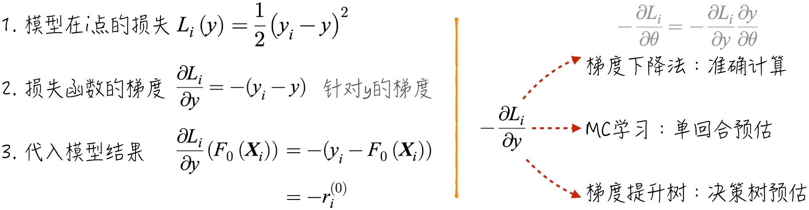
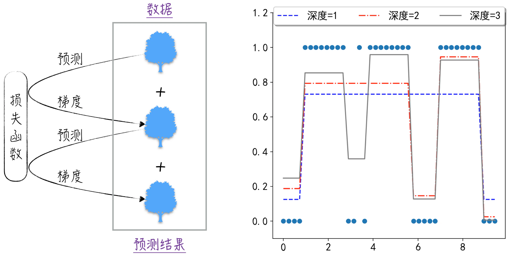

## 13.2 树的集成

决策树模型虽然简单明了，但独立使用时效果并不理想。正如[13.1.3 节](/books/deconstructing_LLM/chapter-13/13-1#section-13-1-3)所述，将决策树与逻辑回归相结合，能够显著提升模型性能。然而，由于这涉及两种截然不同的模型，数学上很难为这种联结方式提供理想的抽象，导致它们难以成为一个通用的解决方案。

神经网络的成功经验启示我们，将结构相似的模型联结在一起，能够释放出巨大的潜力[^13-2-1]。依葫芦画瓢，将决策树首尾相连，构建一个强大的模型。每个决策树都“站在前面模型的肩膀上”，进一步优化，形成了提升方法（Boosting Method）的基本理念。此外，决策树还有一种更经典且简洁的联结方式，即通过多个决策树的平均结果确定最终预测结果，这被称为平均方法（Averaging Method）。直观来看，提升方法使模型变得更长，类似于神经网络领域的深度学习；平均方法使模型变得更胖，类似于增加神经网络隐藏层的宽度。

这两种方法的代表模型分别是随机森林（Random Forest）和梯度提升决策树（Gradient Boosting Decision Tree，GBDT）。下面将深入讨论这两种模型的工作原理，以及它们在不同应用场景中的优势和限制。

### 13.2.1 随机森林

随机森林是一个由 $n$ 个决策树组成的模型，每个决策树都独立地完成学习和预测。这些决策树会产生一系列中间结果，而模型的最终结果是对这些中间结果的“加权平均”。

- 对于分类问题，最终结果是中间结果中出现次数最多的类别。可以将每个决策树想象成一个投票者，而随机森林是一场投票，通过“少数服从多数”的原则得到最终决策。
- 对于回归问题，随机森林的预测结果是中间结果的平均值。

随机森林的理论基础源自：单个决策树犯错的概率较大，但许多树同时犯错的概率就显著降低了。假设针对某个分类问题，有 3 个相互独立的决策树，它们各自预测错误的概率为 20%。按照“少数服从多数”的原则将它们组合成随机森林，预测错误的情况包括 3 个决策树都错误，或者只有 1 个预测正确。这个随机森林的犯错概率下降到了 10.4%。

$$
0.2^3+3\times0.2^2\times0.8=10.4\%
\tag{13-4}
$$

通过上面的例子可以看到，随机森林的预测效果很大程度上取决于森林中的决策树是否相互独立。如果每个决策树都相同，那么随机森林就退化成了决策树模型。对于同一份训练数据，为了生成相互独立的决策树，可以在训练数据、选择特征及划分阈值三个方面引入随机性。

1. **随机选择训练数据**：在决策树的训练过程中，不再使用全部数据，而是随机选择一部分数据来训练模型。如此一来，每个决策树都基于不同的数据集生成，提高了独立性。
2. **限制特征的选择**：在生成决策规则时，并不遍历所有特征，而是只选择部分特征参与规则生成。在这种方式下，每个决策树的特征选择都是随机的。
3. **随机划分阈值**：选择规则的划分阈值时，不再追求全局最优解，而是随机构成一个候选阈值集合，再从中选择效果最优的阈值。这进一步引入了不确定性，提高了决策树的独立性。

实际应用中，并不一定需要同时实现上述三种随机性。scikit-learn 提供了两种实现：Random Forest 和 Extremely Randomized Trees。前者实现训练数据和决策特征的随机性，后者实现全部三种随机性。具体的模型调用可参考 scikit-learn 官方文档。

### 13.2.2 梯度提升决策树

梯度提升决策树这个名字或许有些晦涩，但其中“梯度提升”这一术语与[6.2 节](/books/deconstructing_LLM/chapter-6/6-2)讨论的梯度下降法有关。事实上，梯度提升决策树的核心思想就是梯度下降法的一种扩展。这并非我们第一次遇到这种方法，例如[12.3.1 节](/books/deconstructing_LLM/chapter-12/12-3#section-12-3-1)讨论的 MC 学习，其核心步骤也是随梯度进行更新。

如果使用决策树解决回归问题，其模型效果一定会优于将所有数据预测为 0。假设有 $n$ 个训练数据，记为 $\{\boldsymbol X_i,y_i\}$，用 $h$ 表示决策树，那么上述论断表示为

$$
\sum_i[y_i-h(\boldsymbol X_i)]^2<\sum_i y_i^2
\tag{13-5}
$$

公式（13-5）的证明基于这样一个事实：对于落在同一个节点的数据，决策树的预测值为它们的平均数。不失一般性地，假设 $y_1,y_2,\cdots,y_k$ 落在同一个叶子节点上。利用方差的定义公式，不难证明公式（13-6）。将所有叶子节点的不等式相加，就得到公式（13-5）。

$$
\begin{aligned}
h(\boldsymbol X_i)&=\bar y=\frac{1}{k}\sum_{i=1}^{k}y_i \\
\sum_{i=1}^{k}(y_i-\bar y)^2&<\sum_{i=1}^{k}y_i^2
\end{aligned}
\tag{13-6}
$$

进一步假设回归问题中的初始模型为 $F_0$。这个初始模型的具体形式并不重要，例如，可以假设它对所有数据的预测都相同，等于所有数据的平均值。对于任意数据点 $i$，模型的残差表示为

$$
r_i^{(0)}=y_i-F_0(\boldsymbol X_i)
\tag{13-7}
$$

为了提升模型效果，对数据集 $\{\boldsymbol X_i,r_i^{(0)}\}$ 进行建模，得到决策树模型 $h_1$，然后将这个模型与初始模型组合成新的预测模型 $F_1$：

$$
F_1(\boldsymbol X_i)=F_0(\boldsymbol X_i)+h_1(\boldsymbol X_i)
\tag{13-8}
$$

根据公式（13-5）可以得出，相比初始模型 $F_0$，新模型 $F_1$ 的效果更好。通过不断重复这个过程，即 $F_k=F_{k-1}+h_k$，可以持续提升模型效果。直观来看，就是利用决策树学习前一模型的残差，将它们累加，得到一个更强大的模型。

为什么模型名字中包含“梯度”呢？因为模型的残差就是损失函数梯度的相反数。图 13-9 左侧给出了具体推导。简而言之，使用梯度提升决策树预估损失函数针对 $y$ 的梯度，再基于预估值更新模型。这个过程与 MC 学习有异曲同工之妙，两者都在模仿梯度下降法。

基于上述准备，可以得到梯度提升决策树解决回归问题的具体步骤。

1. 如图 13-9 所示，定义模型在数据点 $i$ 的损失函数为 $L_i(y)$。
2. 初始模型定义为 $F_0=\sum_{i=1}^{n}y_i/n$，即所有数据的平均值。
3. 根据损失函数的梯度得到新的训练数据 $\{\boldsymbol X_i,-\frac{\partial L_i}{\partial y}(F_0(\boldsymbol X_i))\}$，并利用这些数据得到决策树模型 $h_1$。
4. 更新模型，得到 $F_1=F_0+\gamma_1h_1$，其中 $\gamma_1$ 表示模型更新的力度。参数 $\gamma_1$ 通过 $\gamma_1=\operatorname*{arg\,min}_\gamma\sum_{i=1}^{n}L_i(F_0+\gamma h_1)$ 估算。
5. 不断重复第 3 步和第 4 步，得到模型更新公式。其中，决策树 $h_k$ 的训练数据为 $\{\boldsymbol X_i,-\frac{\partial L_i}{\partial y}(F_{k-1}(\boldsymbol X_i))\}$。

$$
F_k=F_{k-1}+\gamma_kh_k
\tag{13-9}
$$

实践中通常事先选定 GBTs 的深度 $m$，即使用 $m$ 个决策树，此时模型为 $F=F_0+\sum_{i=1}^{m}\gamma_i h_i$。图 13-10 展示了模型的学习过程（[完整代码](https://github.com/GenTang/regression2chatgpt/blob/zh/ch13_others/gbts.ipynb)）。随着深度增加，每个决策树都致力于纠正前一个模型留下的错误，使整体预测效果逐层提升。

梯度提升决策树虽然最初为回归问题设计，但也能自然地扩展到分类问题。对于二元分类问题，标签 $y_i$ 可以是 1 或 0。使用公式（13-10）定义分类问题的损失函数，其中 $y$ 是模型预测值，分类问题就完全类似于回归问题。

$$
L_i(y)=y_i\ln(1+e^{-y})+(1-y_i)\ln(1+e^y)
\tag{13-10}
$$

在代码实现上，scikit-learn 提供 `GradientBoostingRegressor` 解决回归问题，提供 `GradientBoostingClassifier` 解决分类问题。它们的使用方式与决策树类似。

[^13-2-1]: 这种方法在学术上被称为集成方法（Ensemble Method）。集成方法并不仅限于决策树。可以把机器学习中比较简单的模型称为弱学习器（Weak Learner），而集成方法将一系列弱学习器组合成预测效果更好的复杂模型。它与联结主义相似，区别在于联结主义更侧重哲学层面，集成方法更侧重具体算法。
