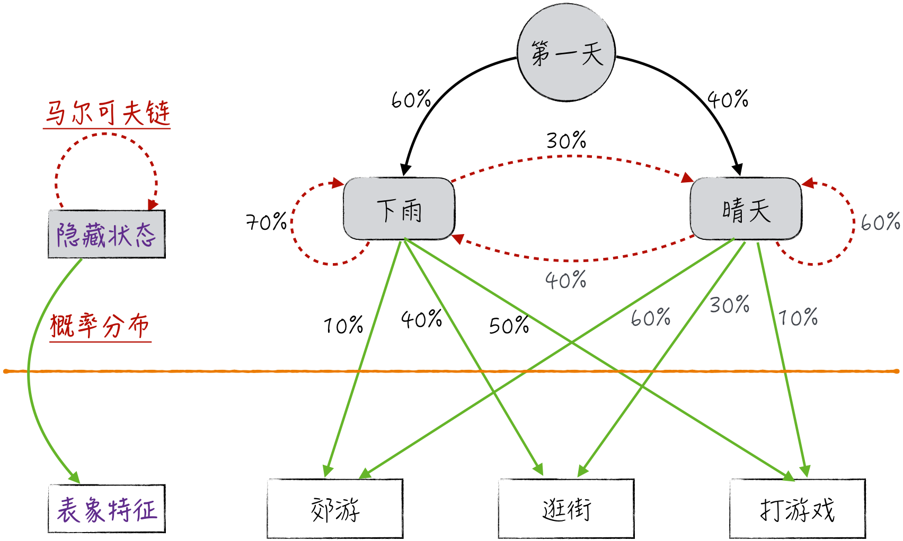
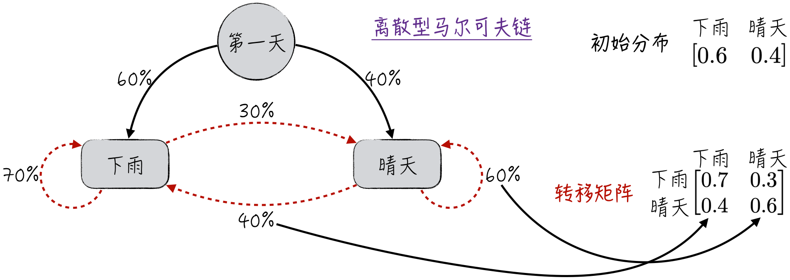
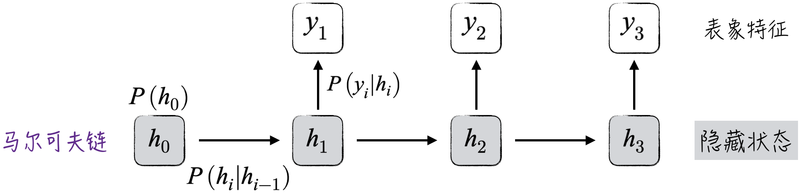
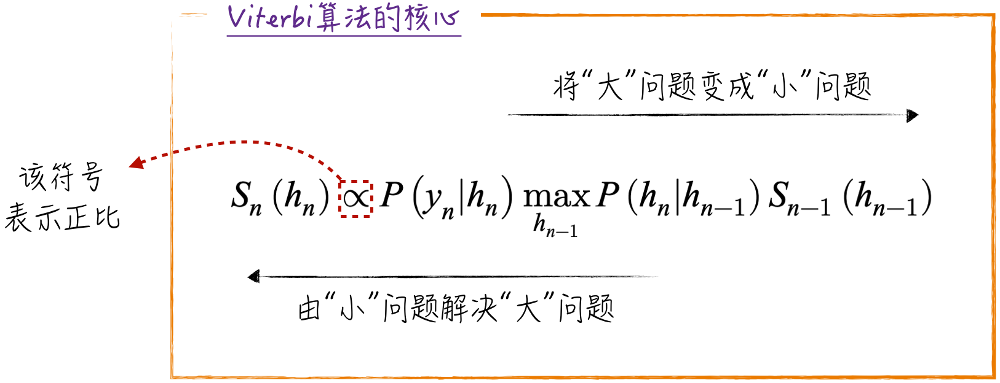
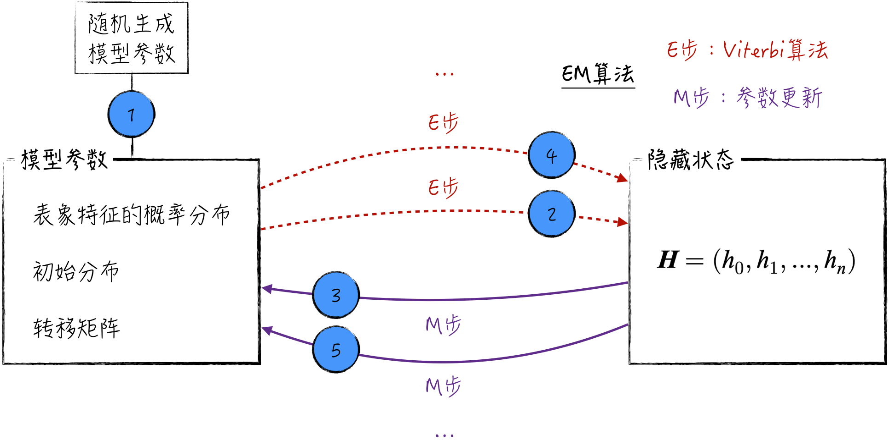
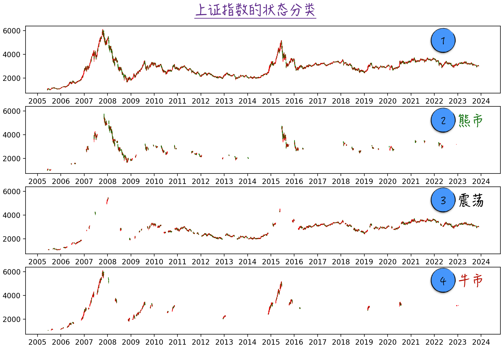

## 13.3 隐马尔可夫模型

隐马尔可夫模型（Hidden Markov Model，HMM）与神经网络在多个方面存在相似之处。在功能上，它专门用于处理序列数据，与循环神经网络一脉相承；在结构上，它可以被视为循环神经网络的简化版本；在模型训练方面，它采用期望最大化（Expectation Maximization，EM）算法，与神经网络中的向前传播和向后传播有很多相似之处。回顾学术发展脉络，隐马尔可夫模型的出现早于神经网络，许多建模技巧受到了它的启发。

隐马尔可夫模型和神经网络虽然存在相似性，但二者也有很大的差别。神经网络更注重通过网络结构的设计让机器自己学习，而隐马尔可夫模型更关注在概率上对数据进行建模。目前，这两种模型都在特定任务上发挥着重要作用。

### 13.3.1 一个简单的例子

下面通过一个简单的例子引出模型。假设需要规划 3 天假期，假期活动会受到天气状况的制约。天气情况分为下雨和晴天两种，可选活动有郊游、逛街和打游戏三种。天气情况的基本假设如下。

- 每天的天气只与前一天的天气存在关联。
- 如果前一天下雨，第二天有 70% 的概率仍然下雨，30% 的概率转为晴天。
- 如果前一天是晴天，第二天有 60% 的概率仍是晴天，40% 的概率下雨。
- 第一天有 60% 的概率下雨，40% 的概率晴天。

活动安排遵循以下概率。

- 在下雨天，郊游、逛街和打游戏的概率分别为 10%、40% 和 50%。
- 在晴天，郊游、逛街和打游戏的概率分别为 60%、30% 和 10%。

图 13-11 展现了上述场景。若观察到 3 天的活动安排分别是郊游、逛街和打游戏，需要据此推测 3 天的天气情况，这正是隐马尔可夫模型的典型应用。

对这个例子进行抽象，引入变量 $h_i$ 表示第 $i$ 天的天气，它是隐藏状态；$y_i$ 表示第 $i$ 天的活动，是可见的表象特征。从逻辑上来看，隐藏状态决定表象特征，但模型需要根据观察到的表象特征推测看不到的隐藏状态。

循环神经网络处理的数据有输入特征 $x_i$、隐藏状态 $h_i$ 和标签变量 $y_i$。输入特征 $x_i$ 和前一个隐藏状态 $h_{i-1}$ 共同决定新的隐藏状态 $h_i$，$h_i$ 进一步决定输出标签 $y_i$。尽管模型训练专注于提高对 $y_i$ 的预测准确度，但实际应用中可以只利用模型推测的隐藏状态 $h_i$。因此，隐马尔可夫模型可以被视为没有输入特征的循环神经网络。

这两个模型在外观上相似，具体计算却有很大差异。在循环神经网络中，隐藏状态的转换是确定的；在隐马尔可夫模型中，隐藏状态的转换是随机的。处理这种随机关系的数学工具就是马尔可夫链，具体细节将在[13.3.2 节](/books/deconstructing_LLM/chapter-13/13-3#section-13-3-2)中讨论。

### 13.3.2 马尔可夫链

马尔可夫链（Markov Chain）是处理随机序列数据最常用的数学工具。假设 $h_1,h_2,\cdots,h_n$ 是按顺序排列的随机变量，这些随机变量之间的关联关系可以表示为

$$
P(h_i\mid h_{i-1},\cdots,h_0)=P(h_i\mid h_{i-1})
\tag{13-11}
$$

这个公式表示在随机过程中，当前状态只与前一个状态相关。对于马尔可夫链，还可以证明公式（13-12）成立，即在已知当前状态的条件下，过去和未来相互独立。

$$
P(h_0,\cdots,h_{i-1},h_{i+1},\cdots,h_n\mid h_i)
=P(h_0,\cdots,h_{i-1}\mid h_i)P(h_{i+1},\cdots,h_n\mid h_i)
\tag{13-12}
$$

当随机变量 $h_i$ 的取值离散时，马尔可夫链可以通过转移矩阵（Transition Matrix）和初始分布表示。例如，[13.3.1 节](/books/deconstructing_LLM/chapter-13/13-3#section-13-3-1)中的天气情况可以用一个 $2\times2$ 的矩阵和相应初始分布表示，如图 13-12 所示。

更一般地，假设 $h_i$ 有 $n$ 个可能取值，则转移矩阵 $\boldsymbol Q$ 为 $n\times n$ 的方阵，其中的元素表示为

$$
Q_{i,j}=P(h_t=j\mid h_{t-1}=i)
\tag{13-13}
$$

转移矩阵中第 $i$ 行、第 $j$ 列的元素表示从状态 $i$ 到状态 $j$ 的概率。因此，第 $i$ 行表示从状态 $i$ 到其他可能状态的概率分布，显然有 $\sum_{j=1}^{n}Q_{i,j}=1$。

虽然马尔可夫链规定当前状态只与前一状态相关，但稍加变换即可处理更复杂的情况。例如，若当前状态与最近两个状态相关，可以定义新状态 $\boldsymbol z_i=(h_i,h_{i-1})$，此时随机过程 $\boldsymbol z_i$ 仍然是一个马尔可夫链。

### 13.3.3 模型架构

本节只讨论离散隐藏状态。根据前面的讨论，模型参数可划分为三个部分：表象特征的概率分布 $P(y_i\mid h_i)$、初始分布 $P(h_0)$ 和转移矩阵 $P(h_i\mid h_{i-1})$，具体如图 13-13 所示。

如果用 $\boldsymbol Y=(y_0,y_1,\cdots,y_n)$ 表示表象特征，用 $\boldsymbol H=(h_0,h_1,\cdots,h_n)$ 表示隐藏状态，那么可以得到数据的联合概率表达式：

$$
P(\boldsymbol Y,\boldsymbol H)
=P(h_0)P(h_1\mid h_0)\cdots P(h_n\mid h_{n-1})\prod_jP(y_j\mid h_j)
\tag{13-14}
$$

模型参数的估计原则是最大化数据的联合概率。其中，表象特征 $\boldsymbol Y$ 已知，但隐藏状态 $\boldsymbol H$ 可能未知。如果 $\boldsymbol H$ 也已知，可以直接推导模型参数估计值；若未知，则需要借助期望最大化算法，具体将在[13.3.4 节](/books/deconstructing_LLM/chapter-13/13-3#section-13-3-4)中讨论。

先将注意力转向模型预测：在已知参数的情况下，应该如何预测隐藏状态？具体的数学公式如下：

$$
\hat{\boldsymbol H}=\operatorname*{arg\,max}_{\boldsymbol H}
P(h_0,h_1,\cdots,h_n\mid y_1,y_2,\cdots,y_n)
\tag{13-15}
$$

求解这个公式并不容易，因为 $h_n$ 的选择依赖前一状态 $h_{n-1}$。解决这个问题的方法是 Viterbi 算法。Viterbi 算法利用动态规划的思想，将原始问题转化为类似的子问题：

$$
S_n(h_n)=\max_{h_0,h_1,\cdots,h_{n-1}}
P(h_0,h_1,\cdots,h_n\mid y_1,y_2,\cdots,y_n)
\tag{13-16}
$$

$S_n(h_n)$ 表示在已知状态 $h_n$ 的情况下，对于表象特征 $\{y_1,y_2,\cdots,y_n\}$，数据所能达到的最大概率。数学上可以证明，这个问题可以按照图 13-14 所示的方式拆解为若干个子问题，这就是 Viterbi 算法的核心（[完整代码](https://github.com/GenTang/regression2chatgpt/blob/zh/ch13_others/viterbipy.py)）。

### 13.3.4 股票市场的应用

在股票市场，我们只能观察到股票价格、成交量等信息，但无法直接得知当前股市处于牛市、熊市还是震荡市。在这个建模场景中，隐藏状态未知，参数估计依赖隐藏状态，隐藏状态估计又依赖模型参数。隐马尔可夫模型使用与神经网络训练相似的方案解决这一问题。

- **E 步**：在给定模型参数的情况下，使用 Viterbi 算法估计隐藏状态。这一步类似于神经网络中的向前传播。
- **M 步**：利用 E 步预估的隐藏状态更新模型参数。这一步通常可以直接得到参数估计值的解析表达式，类似于神经网络中的向后传播。

数学证明表明，交替使用上述两步，最终可以得到模型参数的最佳估计值，并顺带获得隐藏状态。整个过程如图 13-15 所示，这个算法被称为期望最大化算法。

回到股票市场，首先将其分为两个层次。

- 第一层包括观察到的股票市场特征，如 5 日收益率的对数、20 日收益率的对数、5 日成交额增长率的对数，以及 20 日成交额增长率的对数，用变量 $\boldsymbol Y_i$ 表示。
- 第二层是观察不到的市场状态，共有牛市、熊市和震荡三种状态，用变量 $h_i$ 表示。

然后构建一个模型，根据一段时间的市场表现预测当前以及未来一段时间的市场状态。有效市场假说表明，当前股票价格已经充分反映所有历史信息。在已知当前市场条件时，未来和过去相互独立，即 $h_i$ 可以被视为马尔可夫链。进一步假设在已知市场状态的情况下，股票日收益率的对数和成交量增长的对数服从正态分布，因此这一模型被称为高斯隐马尔可夫模型（Gaussian HMM）。

本例使用从 2005 年 6 月 1 日到 2023 年 11 月 28 日的上证指数及相应每日成交额。为了规避通货膨胀对成交额的长期影响，模型使用 5 日和 20 日成交额增长率的对数，而不是成交额的绝对值。

根据模型结果，将不同状态的上证指数表示在不同坐标系中，可以得到图 13-16（[完整代码](https://github.com/GenTang/regression2chatgpt/blob/zh/ch13_others/stock_analysis.ipynb)）。图中标记 1 包含所有交易数据，标记 2、3、4 分别包含不同状态的数据。根据数据特点，可以推断标记 2 表示熊市、标记 3 表示震荡市、标记 4 表示牛市。

基于模型结果，可以得到一种量化交易策略：如果当天被判定为牛市，就买入或继续持有股票，反之就卖出或保持空仓。但实际效果可能远不如历史回测准确，因为模型基于历史数据预测 $h_1$ 时已经知道后来的交易数据 $\boldsymbol Y_2,\boldsymbol Y_3,\cdots,\boldsymbol Y_n$。现实中无法预知未来，因此需要循环调用公式（13-17），逐步预测 $h_n$，而不是一次性得到全部预测结果。

$$
\hat{\boldsymbol H}=\operatorname*{arg\,max}_{\boldsymbol H}
P(h_0,h_1,\cdots,h_n\mid\boldsymbol Y_1,\boldsymbol Y_2,\cdots,\boldsymbol Y_n)
\tag{13-17}
$$
