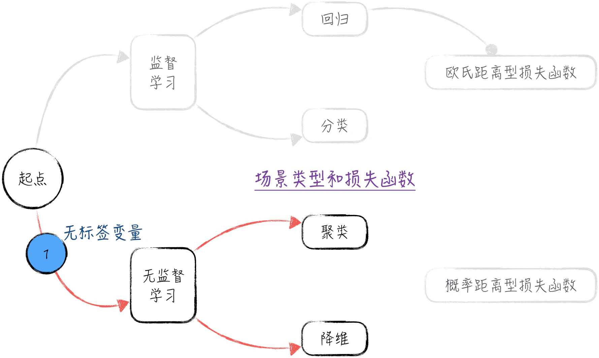
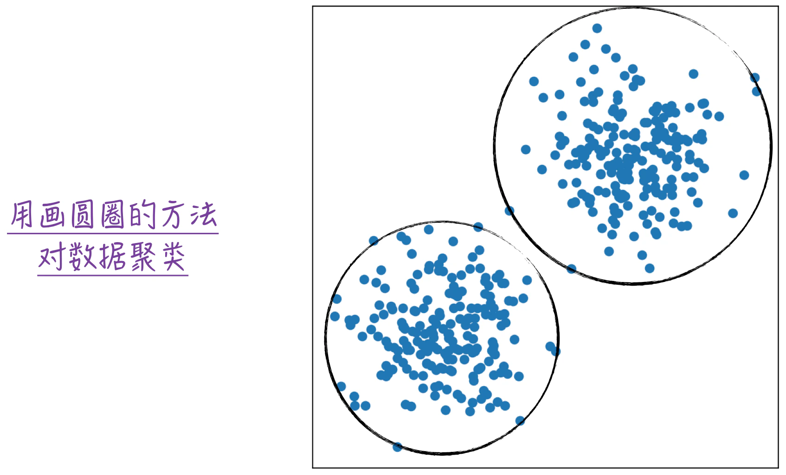
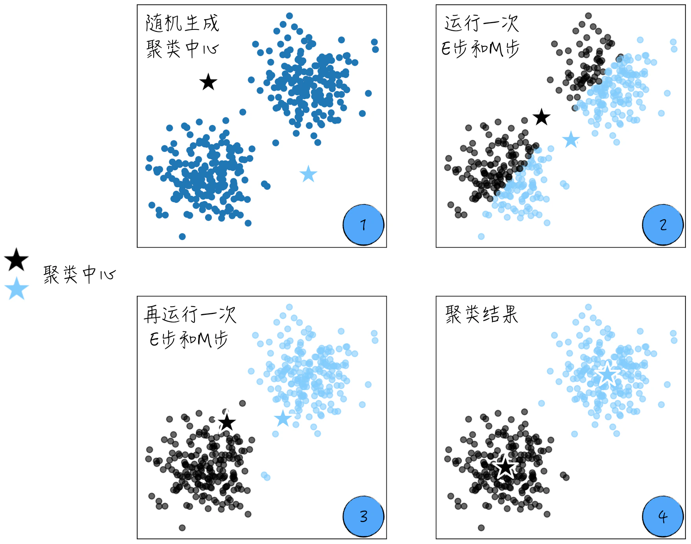
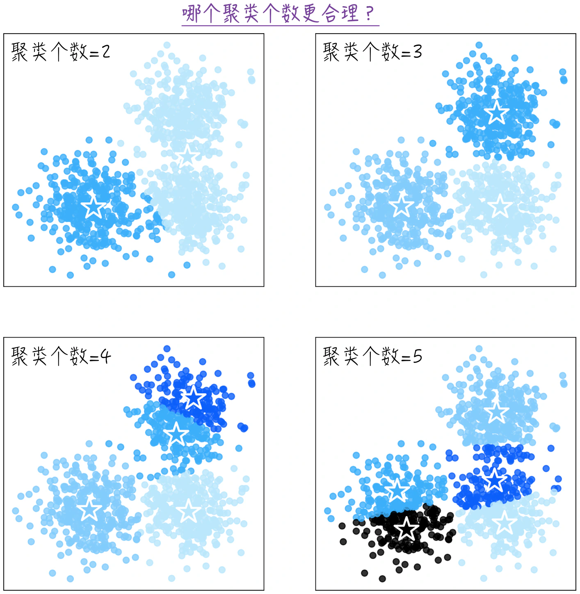
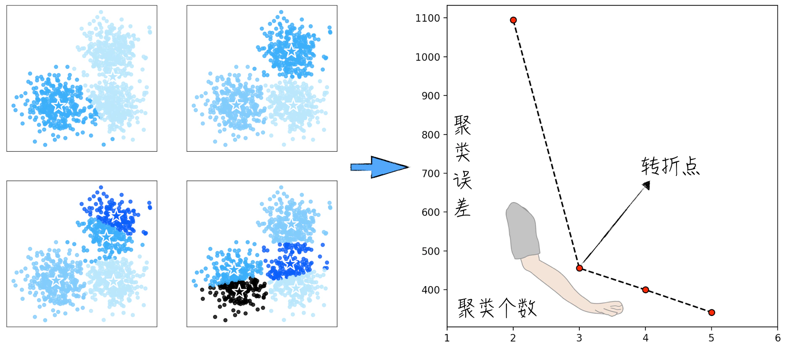
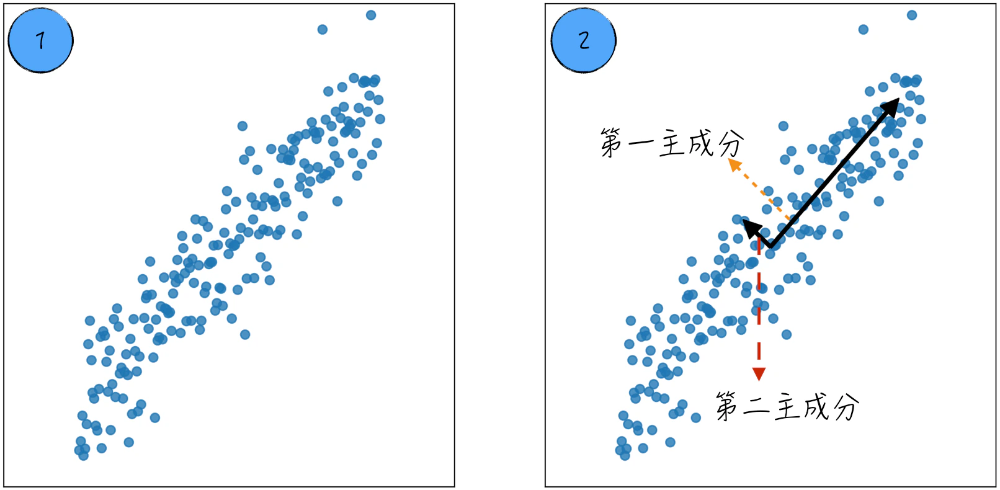
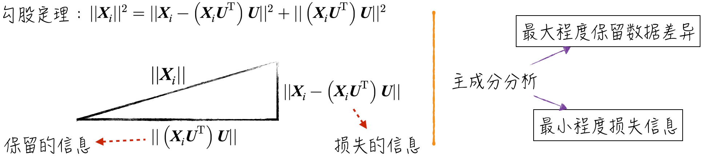

## 13.4 聚类与降维

之前章节的讨论重点是监督学习，这类模型所用的训练数据包含标签变量，即数据中既有特征 $\boldsymbol X$，也有标签 $y$。在这种情况下，建模思路非常直观：学习特征与标签之间的相关关系，并以此对未知数据进行预测。评估模型效果也很直接，只需计算预测值与实际值之间的差异。

然而，现实生活中的很多场景缺乏标签变量。例如，我们希望通过个体行为推测其性格，但性格本身难以清晰定义，因此相应数据很难收集；又如零售行业，尽管客户对商品的估价可以定义，获取这些数据却几乎不可能。

在这些场景下，监督学习模型无法有效训练。尽管没有明确的标签 $y$，但不应忽视特征 $\boldsymbol X$ 所蕴含的丰富信息。无监督学习模型致力于在没有明确答案的情况下，从数据中学习相关关系，并推断可能的答案。

常见的无监督学习模型可以分为两大类：聚类模型和降维模型，如图 13-17 所示。聚类模型旨在将相似的数据划分为一类；降维模型致力于将高维空间中的数据映射到更简洁的低维空间，以便更有效地捕捉数据的主要特征。

### 13.4.1 经典聚类模型 K-Means

K-Means 是一种简单又强大的聚类算法，它根据数据点之间的欧氏距离将数据分为 $K$ 个类别。假设要聚类的是二维数据，如图 13-18 所示。模型的任务是将这些数据分成两类，离得越近的数据越相似，应该被划为同一类别。换成数学语言，就是数据之间的相似度与欧氏距离成反比，这也是 K-Means 的基本假设。

基于这一假设，算法的目标很明确：尽可能将距离较近的数据划分为同一类。从图像上来看，这相当于使用半径尽可能小的圆圈分别囊括数据。

将上述经验抽象为数学定义。假设对数据 $\boldsymbol X_i$ 进行聚类，聚类数量由参数 $k$ 决定（关于 $k$ 的选择方法请参考[13.4.2 节](/books/deconstructing_LLM/chapter-13/13-4#section-13-4-2)）。在完成聚类后，用 $\boldsymbol\mu_j$ 表示 $k$ 个聚类中心，每个数据点的类别用 $t_i$ 表示。希望每个数据点到所属类别中心的距离越小越好，因此定义如下损失函数：

$$
L=\sum_{j=1}^{k}\sum_{i=1}^{n}
\lVert\boldsymbol X_i-\boldsymbol\mu_j\rVert^2\mathbf{1}_{\{t_i=j\}}
\tag{13-18}
$$

其中，$t_i$ 是聚类的输出结果。与其他模型相似，K-Means 的训练目标也是最小化损失函数。因此，$t_i$ 的估算公式如下：

$$
\hat t_i=\operatorname*{arg\,min}_{t_i}L
\tag{13-19}
$$

公式（13-18）中包含两种模型参数：每个数据所属的类别 $t_i$ 和聚类中心 $\boldsymbol\mu_j$。这两种参数相互依存：如果知道每个数据所属的类别，聚类中心就是数据的平均值；如果知道聚类中心，一个数据的类别取决于它离哪个中心最近。这启发我们借鉴[13.3.4 节](/books/deconstructing_LLM/chapter-13/13-3#section-13-3-4)中的期望最大化算法来估计模型参数。

1. 随机生成 $k$ 个聚类中心点。
2. 根据已有聚类中心点，将数据分为 $k$ 类。分类结果取决于数据离哪个中心最近。这一步可以看作 EM 算法中的 E 步。
3. 根据分类结果，重新计算每个类别的聚类中心。这一步是 EM 算法中的 M 步。
4. 不断重复 E 步和 M 步，直至聚类中心收敛。

图 13-19 展示了算法的收敛过程（[完整代码](https://github.com/GenTang/regression2chatgpt/blob/zh/ch13_others/kmeans.ipynb)）。在标记 1、2、3 处，聚类结果和聚类中心并不完全匹配，说明算法尚未收敛；在标记 4 处，聚类中心和聚类结果完全吻合，算法已经达到收敛状态。

直观来看，K-Means 可以被描述为通过画圆圈对数据进行聚类，但这种方式只适用于少数情况。实际数据的分布形态千差万别，有的呈椭圆状，有的沿曲线分布。对于更复杂的分布，需要使用混合高斯模型（Gaussian Mixture Model，GMM）或谱聚类（Spectral Clustering）等其他聚类模型。

### 13.4.2 如何选择聚类个数

无监督学习的训练数据没有标签变量。除了极个别情况，我们很难确定数据应该被划分为多少个类别。对于 K-Means，给定任意聚类个数 $k$，模型总能将数据分为 $k$ 类。如图 13-20 所示，在相同数据集上，可以将其分别聚类为 2 至 5 类。那么，应该如何合理地选择聚类个数呢？

[13.4.1 节](/books/deconstructing_LLM/chapter-13/13-4#section-13-4-1)中的公式（13-18）定义了 K-Means 的损失函数，它表示每个数据点到相应聚类中心的距离平方和。这个值越小，说明整体上数据点到聚类中心的距离越近，因此它也被称为聚类误差，是评估模型效果的重要指标。

这个指标与聚类个数相关。聚类个数 $k$ 越大，聚类误差越小。在某种程度上，聚类个数代表模型复杂度。与其他机器学习模型一样，模型越复杂，对训练数据的拟合效果越好，但也越容易发生过拟合（详见[3.3.1 节](/books/deconstructing_LLM/chapter-3/3-3#section-3-3-1)）。然而，对于聚类问题，将数据划分为训练集和测试集并不能解决问题，因为随着聚类个数增加，两者的聚类误差都会下降。

实际应用中通常使用 Elbow Method 选择合适的聚类个数，不妨将它称为“手肘法”。这个方法的核心假设是：当聚类个数小于真实类别数时，聚类误差会迅速下降；当聚类个数超过真实值时，聚类误差虽然仍然下降，但下降速度显著减缓。因此，聚类误差曲线宛如人的手肘，转折点对应最佳聚类个数。对于图 13-20 中的数据，图 13-21 表明最佳聚类个数是 3（[完整代码](https://github.com/GenTang/regression2chatgpt/blob/zh/ch13_others/kmeans_choose_k.ipynb)）。

手肘法直观，但难以用数学公式准确量化，因此使用时存在一定主观偏差。更严谨的方法是轮廓分析（Silhouette Analysis），其核心思想是计算聚类中心能在多大程度上代表类别内的所有数据。

### 13.4.3 经典降维模型主成分分析

降维（Dimension Reduction）的目标是将高维空间中的数据映射到低维空间。在人工智能领域，通常使用向量表示数据，降维的效果就是用更短的向量表示数据。降维不可避免地导致信息损失，但它有助于降低随机因素的干扰，更好地捕捉数据的主要特征。对于高维数据，还可以先将数据降至二维或三维，再利用可视化方式传递信息。

最常用的降维模型是主成分分析（Principal Components Analysis，PCA），其目的是找出数据中的主要成分，即数据变化幅度排名前几位的维度。

图 13-22 展示了将二维数据压缩为一维的例子。降维相当于向某条直线投影，投影后的点就是降维数据。根据主成分分析的原则，投影后的数据方差越大越好，这样能够保留更多信息。图中较长的箭头表示第一主成分（First Principal Component），即数据变化幅度最大的方向。类似地，可以定义与第一主成分垂直的第二主成分。

下面从数学角度探讨如何得到上述结果。假设要降维的数据有 $n$ 个，每个数据为 $m$ 维，记第 $i$ 个数据为 $\boldsymbol X_i=(x_{i,1},x_{i,2},\cdots,x_{i,m})$。为了推导方便，假设这 $n$ 个数据的中心为原点。

首先考虑将数据降到一维。假设降维直线的单位向量为 $\boldsymbol U=(u_1,u_2,\cdots,u_m)$，满足 $\lVert\boldsymbol U\rVert^2=1$。第 $i$ 个点在这条直线上的投影可以表示为

$$
\widetilde{\boldsymbol X}_i=(\boldsymbol X_i\boldsymbol U^\mathsf{T})\boldsymbol U
\tag{13-20}
$$

由于数据的中心在降维过程中保持不变，降维后数据的方差可以表示为

$$
V=\sum_{i=1}^{n}\lVert\widetilde{\boldsymbol X}_i\rVert^2
=\sum_{i=1}^{n}(\boldsymbol X_i\boldsymbol U^\mathsf{T})^2
\tag{13-21}
$$

根据 $(\boldsymbol X_i\boldsymbol U^\mathsf{T})^\mathsf{T}=\boldsymbol U\boldsymbol X_i^\mathsf{T}=\boldsymbol X_i\boldsymbol U^\mathsf{T}$，可以进一步变换为

$$
V=\sum_{i=1}^{n}\boldsymbol U\boldsymbol X_i^\mathsf{T}\boldsymbol X_i\boldsymbol U^\mathsf{T}
=\boldsymbol U\left(\sum_{i=1}^{n}\boldsymbol X_i^\mathsf{T}\boldsymbol X_i\right)\boldsymbol U^\mathsf{T}
\tag{13-22}
$$

将 $\sum_{i=1}^{n}\boldsymbol X_i^\mathsf{T}\boldsymbol X_i$ 记为 $\boldsymbol C$，它是一个 $m\times m$ 的矩阵，也就是数据的协方差矩阵。因此，最佳降维向量，也就是第一主成分的估算公式为

$$
\widehat{\boldsymbol U}=\operatorname*{arg\,max}_{\lVert\boldsymbol U\rVert=1}
\boldsymbol U\boldsymbol C\boldsymbol U^\mathsf{T}
\tag{13-23}
$$

数学上可以证明，当 $\boldsymbol U$ 为矩阵 $\boldsymbol C$ 的特征向量，且相应特征值达到最大值时，$\boldsymbol U\boldsymbol C\boldsymbol U^\mathsf{T}$ 达到最大值。换句话说，将数据降到一维就是求矩阵 $\boldsymbol C$ 的最大特征向量；若要降到 $k$ 维，则需要求出矩阵 $\boldsymbol C$ 的前 $k$ 个特征向量。

还可以从如何使信息损失最小的角度考虑降维。对于第 $i$ 个点，降维后的数据为 $\widetilde{\boldsymbol X}_i$，损失掉的信息为 $\boldsymbol L_i=\boldsymbol X_i-\widetilde{\boldsymbol X}_i$。根据最小损失信息原则，最佳降维向量为

$$
\widehat{\boldsymbol U}=\operatorname*{arg\,min}_{\lVert\boldsymbol U\rVert=1}
\sum_{i=1}^{n}\lVert\boldsymbol L_i\rVert^2
\tag{13-24}
$$

如图 13-23 所示，数学上可以证明公式（13-24）和公式（13-23）等价。因此，主成分分析在降维过程中同时达到两个目的：尽可能保留数据间的差异，尽可能减少信息损失。

主成分分析能够将数据降至 $k$ 维。与聚类个数的选择类似，可以将协方差矩阵的特征值从大到小排列，再使用[13.4.2 节](/books/deconstructing_LLM/chapter-13/13-4#section-13-4-2)中的 Elbow Method 选择最佳的 $k$。需要注意的是，$k$ 必须同时小于原始数据维度 $m$ 和数据个数 $n$。

主成分分析通过画直线的方式对数据降维，因此处理线性数据时效果显著。当数据呈现非线性分布时，可以引入核函数技术，先将低维空间中的数据映射到高维空间，使数据在高维空间中近似线性，再进行降维。这种方法被称为核主成分分析（Kernel PCA）。主成分分析的完整示例可参考[`ch13_others/pca.ipynb`](https://github.com/GenTang/regression2chatgpt/blob/zh/ch13_others/pca.ipynb)。
