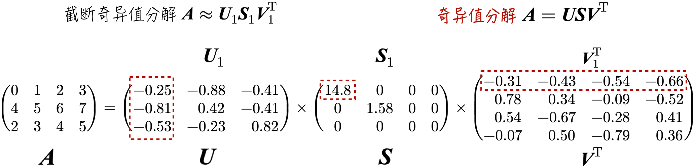
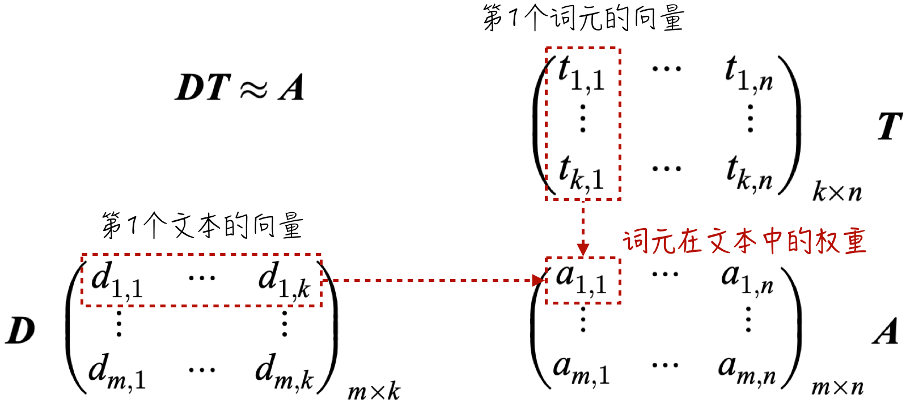
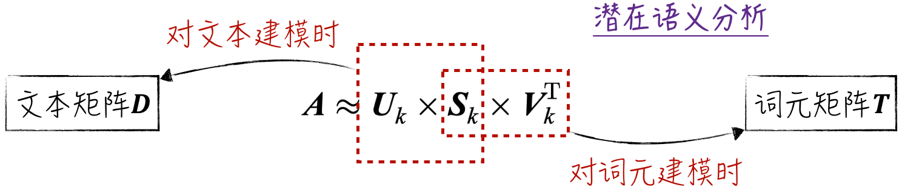
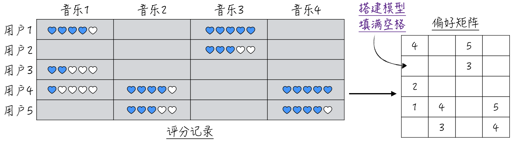
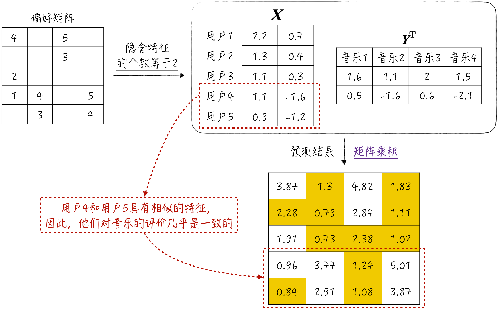

## 13.5 奇异值分解

矩阵的奇异值分解看似首次提及，但实际上，之前的章节已经多次应用了它的结论。例如，[2.1.5 节](/books/deconstructing_LLM/chapter-2/2-1#section-2-1-5)中有这样一个定理：当某个矩阵的秩较小时，它可以被分解为两个小矩阵的乘积。这个定理在大语言模型微调中发挥了重要作用，是 LoRA 技术（参考[11.4.4 节](/books/deconstructing_LLM/chapter-11/11-4#section-11-4-4)）的理论基础。

奇异值分解在人工智能领域的应用远不止于此。它能够从表象数据中挖掘出内在的隐含特征，类似于循环神经网络中的隐藏状态，因此在自然语言处理和推荐系统等领域都有广泛应用。

### 13.5.1 数学定义

奇异值分解（Singular Value Decomposition，SVD）是有关矩阵分解的重要定理。假设 $\boldsymbol A$ 是一个 $m\times n$ 的矩阵，矩阵 $\boldsymbol A$ 能被分解为三个矩阵的乘积：

$$
\boldsymbol A=\boldsymbol U\boldsymbol S\boldsymbol V^\mathsf{T}
\tag{13-25}
$$

其中，$\boldsymbol U,\boldsymbol S,\boldsymbol V$ 的含义如下。

- $\boldsymbol U$ 是一个 $m\times m$ 的正交矩阵（Orthonormal Matrix），满足 $\boldsymbol U\boldsymbol U^\mathsf{T}=\boldsymbol U^\mathsf{T}\boldsymbol U=\boldsymbol I$。
- $\boldsymbol S$ 是一个 $m\times n$ 的对角矩阵，其对角线元素按从大到小排列，且为非负实数。这些元素被称为奇异值（Singular Value）。如果矩阵 $\boldsymbol A$ 的秩为 $k$，那么有 $k$ 个不等于 0 的奇异值，反之亦然。记 $\boldsymbol S_{m\times n}=(s_{i,j})$，其中 $l=\min(m,n)$。

$$
s_{i,j}=
\begin{cases}
0,&i\ne j \\
>0,&i=j
\end{cases}
\qquad
s_{1,1}>s_{2,2}>\cdots>s_{l,l}>0
\tag{13-26}
$$

- $\boldsymbol V$ 也是一个正交矩阵，它的形状是 $n\times n$。

### 13.5.2 截断奇异值分解

奇异值分解在数学上十分完备，但人工智能应用很少需要计算完整结果，通常只关心矩阵中最大的几个奇异值。因此，学术界引入了截断奇异值分解（Truncated SVD）。

对于矩阵 $\boldsymbol A$，奇异值分解表示为 $\boldsymbol A=\boldsymbol U\boldsymbol S\boldsymbol V^\mathsf{T}$。在截断奇异值分解中，选择 $\boldsymbol S$ 中最大的 $k$ 个奇异值，得到 $k\times k$ 的对角矩阵 $\boldsymbol S_k$；选取 $\boldsymbol U$ 的前 $k$ 列，得到 $m\times k$ 的矩阵 $\boldsymbol U_k$；选取 $\boldsymbol V$ 的前 $k$ 列，得到 $n\times k$ 的矩阵 $\boldsymbol V_k$。整个过程如图 13-24 所示，其中 $k=1$。

矩阵 $\boldsymbol U_k\boldsymbol S_k\boldsymbol V_k^\mathsf{T}$ 的秩是 $k$，小于原始矩阵的秩。因此，从线性空间的角度来看，截断奇异值分解实际上对矩阵进行了降维。基于这个理论，LoRA 的适用范围可以进一步扩大：对于秩较大的参数变动矩阵，可以理解为 LoRA 利用截断奇异值分解对其进行了降维处理。

截断奇异值分解中的 $k$ 表示降维维度，与主成分分析中的 $k$ 类似，可以在一定范围内任意选择。合适的 $k$ 取决于具体应用场景，通常采用网格搜索（Grid Search）等方法寻找最佳取值。

### 13.5.3 潜在语义分析

潜在语义分析（Latent Semantic Analysis，LSA）在自然语言处理领域扮演着重要角色。该模型基于训练文本，将词元和文本转化为向量，这些向量能够高效地代表词元或文本的语义。这一转换过程将人类语言转换为模型可处理的向量，为文本分类、情感分析等应用奠定基础。

1. 定义训练数据的权重矩阵 $\boldsymbol A$。这是一个 $m\times n$ 的矩阵，其中行数 $m$ 表示文本数量，列数 $n$ 表示字典大小（详见[10.1.1 节](/books/deconstructing_LLM/chapter-10/10-1#section-10-1-1)）。矩阵中的元素等于对应词元在文本中的权重。实际应用中通常使用 TF-IDF 定义权重。
2. 假设词元和文本都能用长度为 $k$ 的向量表示，而且词元向量和文本向量的内积应该等于词元在文本中的权重。词元在文本中的权重越大，文本的语义就越接近词元的语义。

将文本向量组合成矩阵 $\boldsymbol D$，将词元向量组合成矩阵 $\boldsymbol T$，那么词元在文本中的权重矩阵 $\boldsymbol A$ 近似等于矩阵 $\boldsymbol D$ 和 $\boldsymbol T$ 的乘积，如图 13-25 所示。

图 13-25 中的矩阵分解与截断奇异值分解非常相似。如果使用 $k$ 个奇异值分解矩阵 $\boldsymbol A$，可以得到 $\boldsymbol A\approx\boldsymbol U_k\boldsymbol S_k\boldsymbol V_k^\mathsf{T}$。其中，$\boldsymbol U_k$ 的形状与 $\boldsymbol D$ 相似，$\boldsymbol V_k^\mathsf{T}$ 的形状与 $\boldsymbol T$ 相似。

- 矩阵 $\boldsymbol U_k$ 的行代表文本，列代表隐含特征。这些特征能在最大限度上代表文本语义，但具体含义并不清楚，这是潜在语义分析的一个缺点。
- $\boldsymbol V_k$ 是词元的矩阵，行代表词元，列代表特征。
- $\boldsymbol S_k$ 是对角矩阵，对角线元素表示相应特征的重要程度。

在实际应用中，处理对角矩阵 $\boldsymbol S_k$ 的常见方法如图 13-26 所示。

- 当建模重点是文本时，例如对文本分类，通常令 $\boldsymbol D=\boldsymbol U_k\boldsymbol S_k$ 和 $\boldsymbol T=\boldsymbol V_k^\mathsf{T}$。
- 当建模重点是词元时，例如寻找同义词，通常令 $\boldsymbol D=\boldsymbol U_k$ 和 $\boldsymbol T=\boldsymbol S_k\boldsymbol V_k^\mathsf{T}$。
- 当研究重点是词元和文本之间的关系时，上述任意一种处理方法都合适。

截断奇异值分解通常借助 scikit-learn 提供的 `sklearn.decomposition.TruncatedSVD` 实现。大语言模型的嵌入模型（参考[11.3.5 节](/books/deconstructing_LLM/chapter-11/11-3#section-11-3-5)）同样实现了从语言到向量的转换。相比之下，嵌入模型能够对任意文本进行转换，潜在语义分析则主要处理训练数据中的文本。

### 13.5.4 大型推荐系统

大型推荐系统在互联网上应用广泛，例如电商平台会根据用户的个人信息和历史购买行为智能推荐商品。从模型角度看，推荐行为对应一个分类问题：针对用户，将所有商品分为感兴趣和不感兴趣两类；针对商品，将用户分为感兴趣和不感兴趣两类。

逻辑回归、神经网络等模型都能解决分类问题，但这些模型只能从单一角度建模。例如，从用户角度出发，建模数据是商品特征，用户喜好由模型参数反映，因此需要为每个用户单独建模。互联网应用中的用户和商品数量都十分庞大，传统分类模型难以同时构建和训练数以万计甚至数百万个模型。

为了解决这一问题，可以借助矩阵分解，使用 $k$ 个特征表示用户和商品，并用相应向量的内积表示用户对商品的偏好。

以音乐推荐为例，可以收集用户对部分音乐的评分。这些评分构成偏好矩阵 $\boldsymbol M$（Preference Matrix），它是一个 $m\times n$ 的矩阵，行表示用户，列表示音乐，矩阵元素是用户对音乐的评分，如图 13-27 所示。偏好矩阵并不完整，大部分元素未知。建模的目的就是使用预测值将偏好矩阵填满。

从数学上讲，模型对偏好矩阵 $\boldsymbol M$ 的处理思路与潜在语义分析一致。将 $\boldsymbol M$ 分解成两个矩阵的乘积，其中 $\boldsymbol X$ 为 $m\times k$ 的矩阵，它的行表示用户，每一列对应一个隐含特征；$\boldsymbol Y$ 是 $n\times k$ 的矩阵，它的行表示音乐，每一列的含义与 $\boldsymbol X$ 中的列相同。

$$
\boldsymbol M\approx\boldsymbol X\boldsymbol Y^\mathsf{T}
\tag{13-27}
$$

由于 $\boldsymbol M$ 并非完整矩阵，无法像截断奇异值分解那样估算 $\boldsymbol X$ 和 $\boldsymbol Y$。为此引入如下损失函数。其中，$m_{i,j}$ 表示 $\boldsymbol M$ 中已知的元素；$\boldsymbol X_i$ 和 $\boldsymbol Y_j$ 分别是两个矩阵的行向量，$\alpha$ 为惩罚项权重。

$$
L=\sum_{i,j}(m_{i,j}-\boldsymbol X_i\boldsymbol Y_j^\mathsf{T})^2
+\alpha(\lVert\boldsymbol X_i\rVert^2+\lVert\boldsymbol Y_j\rVert^2)
\tag{13-28}
$$

矩阵 $\boldsymbol X,\boldsymbol Y$ 的估算原则是使损失函数最小化。如果不考虑惩罚项，模型希望预测值 $\boldsymbol X_i\boldsymbol Y_j^\mathsf{T}$ 尽可能接近观测到的实际值 $m_{i,j}$。获得两个矩阵的估计值后，就可以得到整个偏好矩阵的预测值。图 13-28 展示了模型估算过程。

这个模型的推荐逻辑十分朴素：如果两个用户具有相似的评分行为，那么他们的喜好也大致相同，可以根据其中一个人的评分预测另一个人的评分。这种建模思路被称为协同过滤（Collaborative Filtering），矩阵分解从数学上量化地实现了这一思路。

尽管上述模型能同时处理大量用户和商品，但实际应用中很少直接采用它，主要有两个原因：用户和商品数量可能极其庞大，即使专门设计的模型也难以胜任；该模型只考虑用户对商品的偏好，无法利用用户个人信息、商品属性及用户行为特征等其他信息。

为了提升推荐效果，常常需要将这个模型与其他模型结合使用。一种常见策略是先预测用户对某一类商品的偏好，再使用其他模型得到更精准的最终预测。在工程实现中，这类模型通常需要处理超大规模数据集，因此训练和预测都依赖分布式计算框架，例如 Apache Spark。
