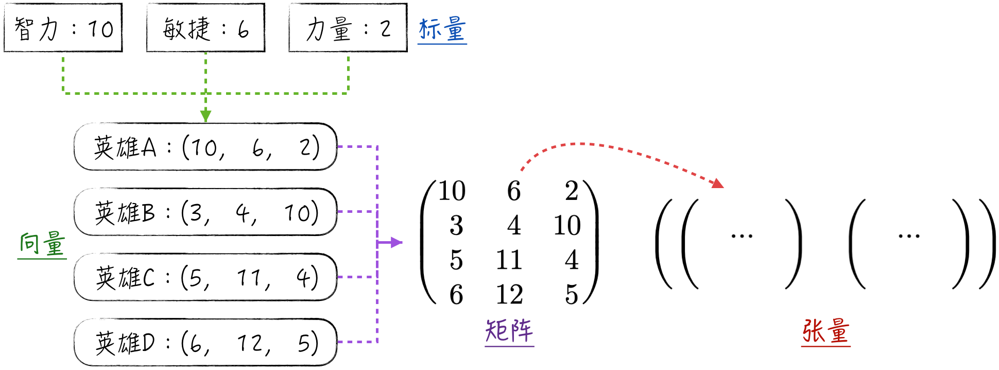
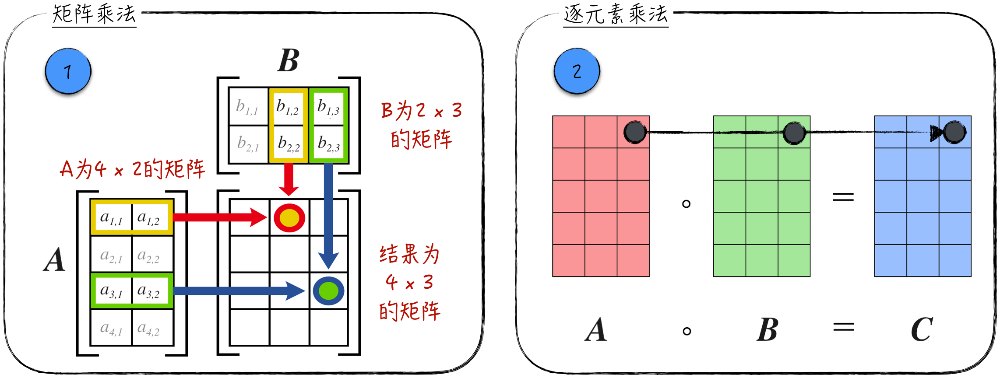
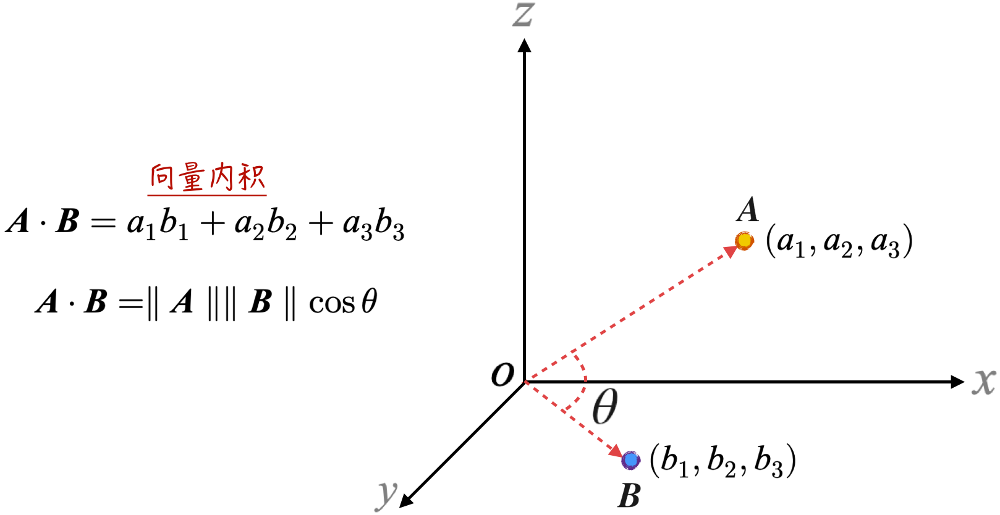
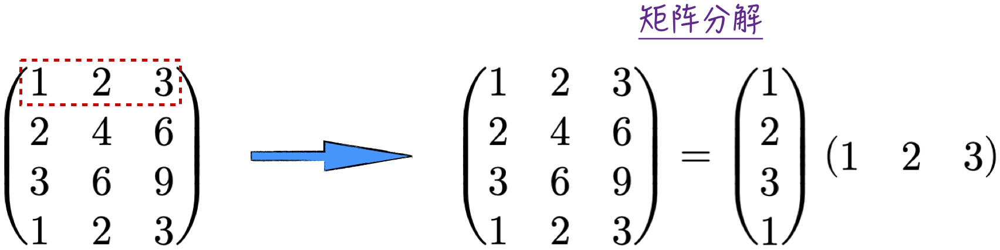
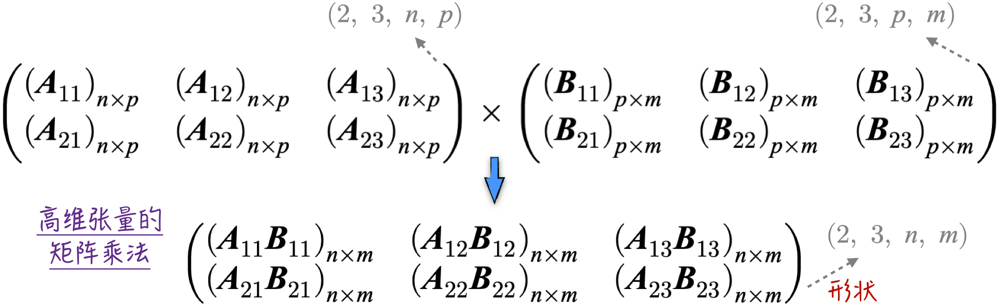
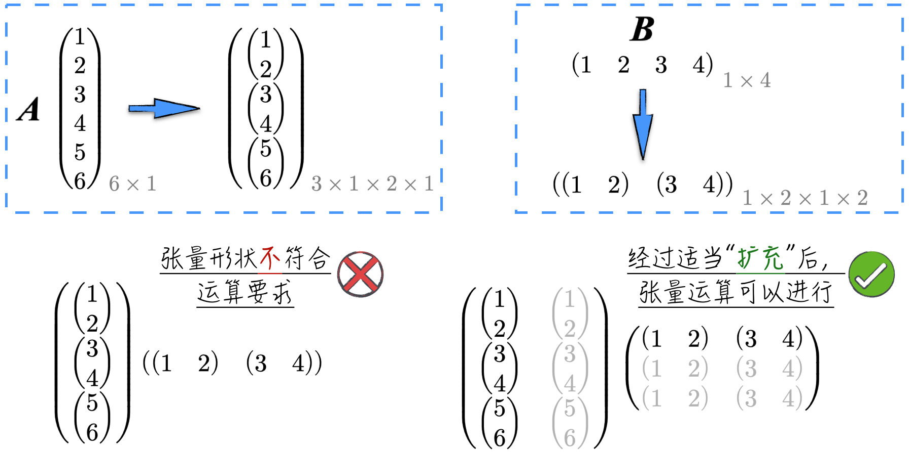

## 2.1 向量、矩阵和张量

在人工智能领域，数据和模型的存在形式都是张量。若要理解这个相对陌生的概念，就要从大家最熟悉的标量开始谈起。

### 2.1.1 标量、向量、矩阵与张量

通过下面的简单例子，我们能更直观地理解**标量**（Scalar）、**向量**（Vector）、**矩阵**（Matrix）和**张量**（Tensor）这 4 个数学概念。

假设在开发一个网络对战游戏时，玩家选择不同英雄进行对战。每个英雄的能力由 3 种属性描述：智力、敏捷和力量[^dota]。用 $i$ 表示智力、$a$ 表示敏捷、$s$ 表示力量，如图 2-1 所示。

- 将英雄 A 设置为智力型英雄，智力为 10，敏捷为 6，力量为 2。在数学上，这些数值称为标量，也就是单个数字。
- 将英雄 A 的属性值排成一行，按智力、敏捷和力量的顺序，用 $\mathbf A=(10,6,2)$ 表示。在数学上，$\mathbf A$ 被称为向量，准确来说是行向量。直观上，行向量是多个数字（标量）排成一行。类似地，还有列向量，即多个数字排成一列。
- 现在设计另外 3 个英雄，分别为 B、C 和 D，其向量分别表示为 $\mathbf B=(3,4,10)$、$\mathbf C=(5,11,4)$ 和 $\mathbf D=(6,12,5)$。将这 4 个英雄的向量排列成矩阵，每行代表一个英雄，这个矩阵表示所有 4 个英雄的属性数据。
- 上面的矩阵描述了 4 个英雄的初始状态。在游戏过程中，这些英雄的属性数据会发生变化，因此每次升级都需要生成新的矩阵来表示它们。将这些矩阵有序地排列成一行，就得到了所谓的张量（确切地说是三维张量）。

通过上面的例子可以直观地感受到：所谓标量、向量和矩阵，其实就是通过某种排列方式将数字展示出来。例如，标量仅能展示单个数字，而向量（行向量）可以按行的形式排列多个数字。为了便于描述，学术上将它们抽象为张量[^tensor]，并引入了张量维度的概念。张量维度可以理解为张量可以延伸的方向数量：标量是零维张量，因为它只是一个数字；向量是一维张量，因为向量（行向量）可以水平延伸；矩阵是二维张量，因为它可以在水平和垂直方向延伸。当然，张量的维度可以是任意值，比如，将上述的三维张量按行或列排列，就得到了四维张量。对于高维张量，我们可能无法直观理解，但没关系，实际上，几乎没有人能完全理解它。我们只需习惯这种表示方式即可。

与张量维度密切相关的是张量的**形状**（Shape）。它等同于每个维度的大小组成的向量，比如，一个向量的形状是 $(3)$，矩阵的形状是 $(4,3)$，三维张量的形状是 $(2,4,3)$。

然而，若仅仅将张量局限于数字排列方式的定义，其作用就很有限了。张量之所以被广泛应用，是因为在其基础上定义了相应的运算。不同维度的张量拥有不同类型的运算，就运算丰富程度和重要性而言，矩阵（二维张量）是最特殊的一个。这是因为，标量实际上就是我们熟知的数字，其运算非常直观；而向量可以视作特殊形状的矩阵，例如 $n$ 维行向量可以视为形状为 $(1,n)$ 的矩阵，因此向量运算就是矩阵运算。对于更高维的张量，在人工智能领域，我们可以将其视为多个矩阵的堆叠，其运算也是基于矩阵定义的。因此，下面首先重点讨论矩阵，然后再探讨高维张量的运算定义。

### 2.1.2 数学记号与特殊矩阵

在数学中，向量和矩阵的表示方法如公式（2-1）所示，其中 $x_{i,j}$ 表示标量，也就是一个实数，$\mathbf X_i$ 表示一个 $m$ 维的行向量（张量形状为 $(m)$），$\mathbf X$ 表示 $n\times m$ 的矩阵（张量形状为 $(n,m)$）。本书后续章节也将采用相同的记号。需要注意的是，列向量可以表示为行向量的转置，因此没有专门的记号用于表示列向量。有关转置运算的细节，请参考 2.1.3 节。

$$
\begin{aligned}
\mathbf X_i&=(x_{i,1},x_{i,2},\dots,x_{i,m})\\
\mathbf X&=
\begin{pmatrix}
\mathbf X_1\\
\mathbf X_2\\
\vdots\\
\mathbf X_n
\end{pmatrix}
=(x_{i,j})
\end{aligned}
\tag{2-1}
$$

在开始讨论矩阵运算之前，先来了解一类特殊的矩阵：**方阵**（Squared Matrix）。方阵指的是行数等于列数的矩阵。从形状上看，它呈现正方形的特征，因此被称为方阵。在方阵中有 3 种矩阵值得特别注意。

1. **单位矩阵**（Identity Matrix）是一种特殊矩阵，其对角线元素为 1，而其他元素均为 0。单位矩阵通常用符号 $\mathbf I_n$ 来表示。

$$
\mathbf I_n=
\begin{pmatrix}
1&0&\cdots&0\\
0&1&\cdots&0\\
\vdots&\vdots&\ddots&\vdots\\
0&0&\cdots&1
\end{pmatrix}
=(\mathbf 1_{\{i=j\}})
\tag{2-2}
$$

2. **对角矩阵**（Diagonal Matrix）指的是除矩阵的对角线元素外，其他元素均为 0，通常用 $\operatorname{diag}(d_1,d_2,\dots,d_n)$ 表示。不难注意到，单位矩阵是一种特殊的对角矩阵。

$$
\operatorname{diag}(d_1,d_2,\dots,d_n)=
\begin{pmatrix}
d_1&0&\cdots&0\\
0&d_2&\cdots&0\\
\vdots&\vdots&\ddots&\vdots\\
0&0&\cdots&d_n
\end{pmatrix}
\tag{2-3}
$$

3. **三角矩阵**（Triangular Matrix）可以分为上三角矩阵和下三角矩阵两种形式。上三角矩阵是指其对角线以下的元素均为零，记为 $\mathbf U$；下三角矩阵是指其对角线以上的元素均为零，记为 $\mathbf L$。不难发现，对角矩阵是三角矩阵的一种特殊情况。

$$
\mathbf U=
\begin{pmatrix}
u_{1,1}&u_{1,2}&\cdots&u_{1,n}\\
0&u_{2,2}&\cdots&u_{2,n}\\
\vdots&\vdots&\ddots&\vdots\\
0&0&\cdots&u_{n,n}
\end{pmatrix}\qquad
\mathbf L=
\begin{pmatrix}
l_{1,1}&0&\cdots&0\\
l_{2,1}&l_{2,2}&\cdots&0\\
\vdots&\vdots&\ddots&\vdots\\
l_{n,1}&l_{n,2}&\cdots&l_{n,n}
\end{pmatrix}
\tag{2-4}
$$

### 2.1.3 矩阵运算

为了能像处理数字一样使用矩阵，我们定义了矩阵的“加减乘除”4 种运算。

#### 1. 矩阵的加减法

与数字的加减法不同，不是所有矩阵都能进行加减运算。这种运算需要矩阵具有相同的形状，也就是它们的行数和列数都相等。假设矩阵 $\mathbf X,\mathbf Y$ 同为 $n\times m$ 的矩阵，则它们的和、差仍为 $n\times m$ 的矩阵，具体的加减法定义如下：

$$
\begin{aligned}
\mathbf X&=(x_{i,j})\qquad \mathbf Y=(y_{i,j})\\
\mathbf X\pm\mathbf Y&=
\begin{pmatrix}
x_{1,1}\pm y_{1,1}&\cdots&x_{1,m}\pm y_{1,m}\\
\vdots&\ddots&\vdots\\
x_{n,1}\pm y_{n,1}&\cdots&x_{n,m}\pm y_{n,m}
\end{pmatrix}
\end{aligned}
\tag{2-5}
$$

基于以上定义，不难证明，矩阵的加法满足结合律和交换律。假设 $\mathbf Z$ 同样是一个 $n\times m$ 的矩阵，可以得到如下公式：

$$
\mathbf X+\mathbf Y=\mathbf Y+\mathbf X
\qquad
\mathbf X+\mathbf Y+\mathbf Z=\mathbf X+(\mathbf Y+\mathbf Z)
\tag{2-6}
$$

#### 2. 矩阵的 3 种乘法运算

（1）**矩阵与数字的乘法**。矩阵与数字的乘法类似于数字相乘的规则，任意一个实数都能与任意一个矩阵相乘。假设 $k$ 是一个实数，它与矩阵 $\mathbf X$ 的乘法定义如下：

$$
k\mathbf X=
\begin{pmatrix}
kx_{1,1}&\cdots&kx_{1,m}\\
\vdots&\ddots&\vdots\\
kx_{n,1}&\cdots&kx_{n,m}
\end{pmatrix}
\tag{2-7}
$$

（2）**矩阵与矩阵的乘法**（Matrix Multiplication）。矩阵乘法对矩阵的形状有严格要求，即第一个矩阵的列数（矩阵形状的第 2 个元素）等于第二个矩阵的行数（矩阵形状的第 1 个元素）。举个具体的例子，假设 $\mathbf A$ 是一个 $n\times p$ 的矩阵，$\mathbf B$ 是一个 $p\times m$ 的矩阵，则它们之间的乘积是一个 $n\times m$ 的矩阵（可参考图 2-2[^wiki] 中的标记 1），记为 $\mathbf{AB}$[^multiplication]，其定义如下：

$$
\mathbf A=(a_{i,j})\qquad
\mathbf B=(b_{i,j})\qquad
\mathbf{AB}=\left(\sum_{r=1}^{p}a_{i,r}b_{r,j}\right)
\tag{2-8}
$$

不难证明，矩阵的乘法满足结合律 $(\mathbf{AB})\mathbf C=\mathbf A(\mathbf{BC})$，以及分配律 $\mathbf A(\mathbf B+\mathbf C)=\mathbf{AB}+\mathbf{AC}$，但不满足交换律（在通常情况下，两个矩阵交换顺序后，乘法运算的前提条件都不满足）。这一点与数字的乘法有很大的不同。另外，任何一个矩阵与单位矩阵的乘积（前提条件是矩阵乘法的要求被满足）等于其本身，比如 $\mathbf I_n\mathbf A=\mathbf A=\mathbf A\mathbf I_p$。因此，单位矩阵可以被看作矩阵中的 1。

实际上，线性模型经常使用矩阵乘法来表示。比如，假设线性模型为

$$
\begin{cases}
y_1=ax_1+b\\
y_2=ax_2+b
\end{cases}
\tag{2-9}
$$

令$\mathbf X=\begin{pmatrix}x_1&1\\x_2&1\end{pmatrix},
\boldsymbol\beta=(a,b),
\mathbf Y=\begin{pmatrix}y_1\\y_2\end{pmatrix},$则公式（2-9）可以表示为 $\mathbf Y=\mathbf X\boldsymbol\beta^{\mathsf T}$。

（3）**矩阵的逐元素乘法**（Hadamard Product 或者 Element-Wise Multiplication）。假设矩阵 $\mathbf A,\mathbf B$ 同为 $n\times m$ 的矩阵，则它们之间的逐元素乘积仍为 $n\times m$ 的矩阵，记为 $\mathbf A\circ\mathbf B$。计算过程如图 2-2 中的标记 2 所示，具体的公式如下：

$$
\mathbf A\circ\mathbf B=(a_{i,j}b_{i,j})
\tag{2-10}
$$

矩阵的逐元素乘法在数学理论中并不常见，但在编程中，经常使用它来同时计算多组数据的乘积。

#### 3. 矩阵的除法：逆矩阵

对矩阵求逆是对方阵进行的特殊操作。假设 $\mathbf M$ 是一个 $n\times n$ 的矩阵，若存在一个 $n\times n$ 的矩阵 $\mathbf N$ 使得它们的乘积等于 $n$ 阶单位矩阵，如公式（2-11）所示，则称矩阵 $\mathbf N$ 为矩阵 $\mathbf M$ 的**逆矩阵**（Inverse Matrix），记为 $\mathbf M^{-1}$，$\mathbf M$ 被称为可逆矩阵。

$$
\mathbf{MN}=\mathbf{NM}=\mathbf I_n
\tag{2-11}
$$

数学上可以证明，如果一个矩阵存在逆矩阵，则逆矩阵是唯一的。所以对于方阵 $\mathbf M$，如果存在另一个方阵 $\mathbf L$，使得 $\mathbf{ML}=\mathbf I_n$，则一定有 $\mathbf{LM}=\mathbf I_n$，且 $\mathbf L=\mathbf N=\mathbf M^{-1}$。

关于逆矩阵，以下是一些常用的公式：

$$
(\mathbf M^{-1})^{-1}=\mathbf M
\qquad
(k\mathbf M)^{-1}=\frac{1}{k}\mathbf M^{-1}
\qquad
(\mathbf{MN})^{-1}=\mathbf N^{-1}\mathbf M^{-1}
\tag{2-12}
$$

#### 4. 矩阵的转置

直观上理解，矩阵的**转置**（Transpose）就是把矩阵沿着对角线进行翻转。假设 $\mathbf X$ 为 $n\times m$ 的矩阵，则它的转置为 $m\times n$ 的矩阵，记为 $\mathbf X^{\mathsf T}$。具体的公式如下：

$$
\mathbf X=(x_{i,j})\qquad
\mathbf X^{\mathsf T}=(x_{j,i})
\tag{2-13}
$$

关于矩阵的转置，以下是一些常用的公式，其中假设 $k$ 为实数，而且公式中涉及的矩阵乘法和逆矩阵都是有意义的。

$$
\begin{aligned}
(\mathbf X^{\mathsf T})^{\mathsf T}&=\mathbf X\\
(\mathbf X+\mathbf Y)^{\mathsf T}&=\mathbf X^{\mathsf T}+\mathbf Y^{\mathsf T}\\
(k\mathbf X)^{\mathsf T}&=k\mathbf X^{\mathsf T}\\
(\mathbf{XY})^{\mathsf T}&=\mathbf Y^{\mathsf T}\mathbf X^{\mathsf T}\\
(\mathbf X^{\mathsf T})^{-1}&=(\mathbf X^{-1})^{\mathsf T}
\end{aligned}
\tag{2-14}
$$

### 2.1.4 向量夹角

在人工智能领域，向量是一个被广泛运用的数学工具，常用于描述建模对象。举例来说，图 2-1 中使用了一个形状为 $(3)$ 的向量来描述英雄。在实际应用中，评估数据之间的相似程度是常见需求，由此催生了向量之间夹角的定义。

先通过一个具体的例子来直观感受一下夹角的定义。在直角坐标系中，将形状为 $(3)$ 的向量映射成空间中的一个点[^three-dimensions]，如图 2-3 中的点 $\mathbf A=(a_1,a_2,a_3)$ 和点 $\mathbf B=(b_1,b_2,b_3)$。定义它们之间的**向量内积**（Dot Product）为

$$
\mathbf A\cdot\mathbf B=a_1b_1+a_2b_2+a_3b_3
\tag{2-15}
$$

根据公式（2-15），不难发现，向量与自身的内积等于该向量长度的平方，如公式（2-16）所示。

$$
\mathbf A\cdot\mathbf A=\lVert\mathbf A\rVert^2=a_1^2+a_2^2+a_3^2
\tag{2-16}
$$

进一步的数学推导可以证明：两个向量的内积等于向量长度及其夹角余弦的乘积，具体公式如图 2-3 所示。

从几何角度来看，在三维空间中，当两个向量之间的夹角越小时，它们的相似性就越高。或者换个角度来理解，如果将两个向量的长度缩放成 1，那么夹角越小意味着它们之间的距离就越近。这个直观的结论可以推广到任意形状的向量。具体来说，如果两个向量 $\mathbf X$ 和 $\mathbf Y$ 的形状相同，如公式（2-17）所示定义向量夹角的余弦，这个余弦值越大，就代表它们的相似度越高，反之亦然。

$$
\cos\theta=\frac{\mathbf X\cdot\mathbf Y}{\lVert\mathbf X\rVert\lVert\mathbf Y\rVert}
\tag{2-17}
$$

### 2.1.5 矩阵的秩

向量之间除了可以定义内积和夹角，还存在一种特殊的关系，即线性表示。举个简单的例子，对于行向量 $\mathbf X=(x_1,x_2,x_3)$，它可以被表示为线性组合的形式：

$$
\mathbf X=x_1(1,0,0)+x_2(0,1,0)+x_3(0,0,1)
$$

换句话说，$\mathbf X$ 可以被 $\mathbf e_1=(1,0,0)$、$\mathbf e_2=(0,1,0)$、$\mathbf e_3=(0,0,1)$ 这 3 个行向量线性表示。

向量之间的线性表示是非常重要且深奥的数学概念，由它衍生出来的很多结论常被用于优化向量或者矩阵的计算。本节将探讨它在矩阵分解中的应用。首先，定义**矩阵的秩**（The Rank of Matrix）。考虑一个 $n\times m$ 的矩阵，这个矩阵可以被看作 $n$ 个行向量的集合。数学上可以证明，能找到 $r$ 个行向量[^linear-independence] 来表示矩阵中的所有行向量。这个 $r$ 就是矩阵的秩。虽然这个结论的严谨证明十分复杂，但不用担心，我们可以通过一个简单的例子来理解它，如图 2-4 左侧所示。在这个例子中，矩阵的秩等于 1，因为所有的行向量都是虚线框中向量的倍数。

有了秩的定义，根据矩阵奇异值分解理论，可以将一个 $n\times m$ 的矩阵分解成 $n\times r$ 和 $r\times m$ 两个矩阵的乘积，如图 2-4 右侧所示。

原始矩阵包含 $n\times m$ 个独立数字，但在分解后，只需保留 $(n+m)\times r$ 个数字。当矩阵的秩远小于其尺寸时，通过这种分解，可以用更少的数字来表达原始矩阵，从而极大地节省存储空间。更重要的是，矩阵常用于描述线性模型。借助上述的矩阵分解表示，用较小的模型可以实现与大模型相同的效果，但计算量大幅减少[^application]。

### 2.1.6 高维张量运算

上面定义的矩阵运算可以分为两类：逐元素运算和矩阵乘法。前者包括矩阵的加减法、矩阵与数字的乘法，以及矩阵的逐元素乘法。这些运算非常直观，实际上就是对应位置上元素的运算。因此，我们能够很方便地将这些运算扩展到高维张量。也就是说，高维张量可以定义加减法、与数字的乘法以及逐元素乘法。这些运算的具体公式与矩阵运算非常类似，在此就不再一一列举了。

矩阵乘法可以简洁地描述模型计算，因此，需要将矩阵乘法也扩展到高维张量。具体而言，将高维张量的最后两维视为矩阵，将其他维度视为循环维度（这也解释了之前提到的高维张量实质上是矩阵的堆叠）。为了更好地理解这一概念，下面通过一个具体的例子来说明。考虑两个四维张量的矩阵运算，如图 2-5 所示。首先，验证并确保张量形状符合运算要求：即除去最后两维，其他维度的大小相同，而最后两维的大小满足普通矩阵乘法的要求。接着，对最后两维构成的矩阵进行矩阵乘法运算，同时对其他维度进行逐元素处理。

实际上，仔细思考后可以发现，高维张量和矩阵是可以相互转换的，如图 2-6 所示，将矩阵 $\mathbf A$ 转换为一个四维张量（当然，反向操作也同样适用）。更确切地说，不同维度的张量之间是可以相互转换的[^block-matrix]。但是需要注意的是，形状的转换可能导致原本的计算无法继续。比如，图 2-6 中的矩阵 $\mathbf A$ 和 $\mathbf B$ 可以进行矩阵乘法运算，但在经过图中的转换后，它们的形状变成了 $(3,1,2,1)$ 和 $(1,2,1,2)$，因此，转换后的高维张量之间是无法进行计算的。

为了让转换后的高维张量仍然可以进行运算，并且获得与原始矩阵乘法相同的结果，可以像图 2-6 中所示的那样（图中浅色部分表示数据复制），对张量进行适当的复制和扩充。扩充后的张量不仅能够顺利完成运算，还能保证结果与我们期望的一致。在神经网络的计算中，这种张量自动复制扩充的机制十分常见。实际上，许多开源工具已经实现了这一功能。更多细节可参考 [6.3.1 节](/books/deconstructing_LLM/chapter-2/6-3#section-6-3-1)。

[^dota]: 如果读者对 DotA 比较熟悉，不妨将这款游戏想象成 DotA。
[^tensor]: 在数学上，对张量的严谨定义相当复杂，不易理解。然而在人工智能领域，使用张量是为了更有效地组织数值计算。因此，这里使用了一种简单又相对准确的定义。
[^wiki]: 图片参考自维基百科。
[^multiplication]: 在有的文献中，矩阵的乘法也被记作 $\mathbf A\cdot\mathbf B$，但这种记法很容易和后面将介绍的向量内积混淆，因此本书并不采用这种记录方法。
[^three-dimensions]: 我们熟悉的物理世界在空间上是三维的，因此无法直观展示形状更大的向量，只能通过三维空间的类比来解释夹角定义的合理性。
[^linear-independence]: 严谨的表述是 $r$ 个线性无关的行向量。线性无关，表示这些向量之间无法进行线性表示。
[^application]: 这样的纯理论探讨可能令人难以理解，[11.4.4 节](/books/deconstructing_LLM/chapter-2/11-4#section-11-4-4)中将介绍具体的应用案例，以便读者更轻松地理解正文中的结论。
[^block-matrix]: 熟悉矩阵运算的读者可能已经接触过将矩阵运算（例如矩阵乘法）拆分成子矩阵的操作。这里讨论的内容实际上是对这种计算方法的扩展。
