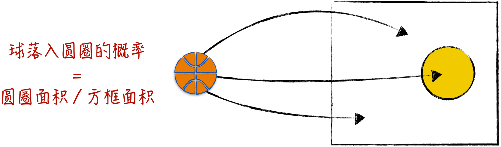
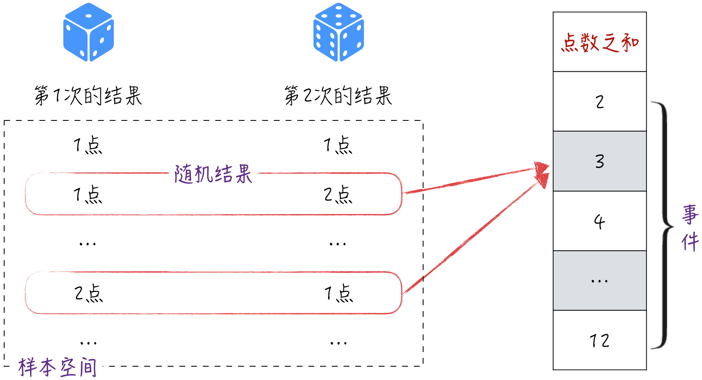
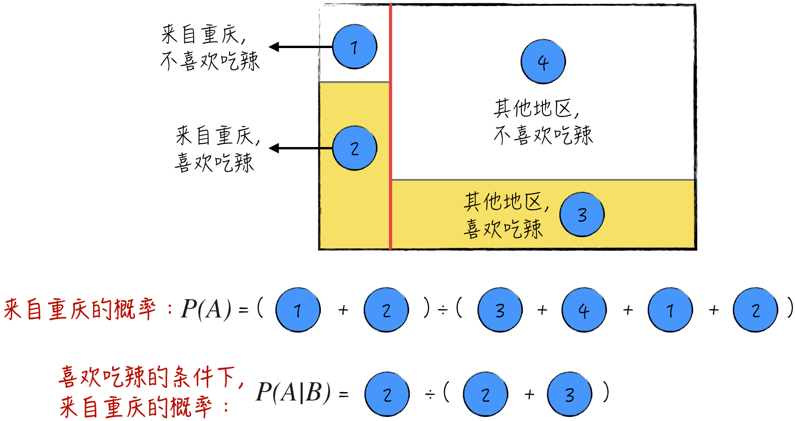
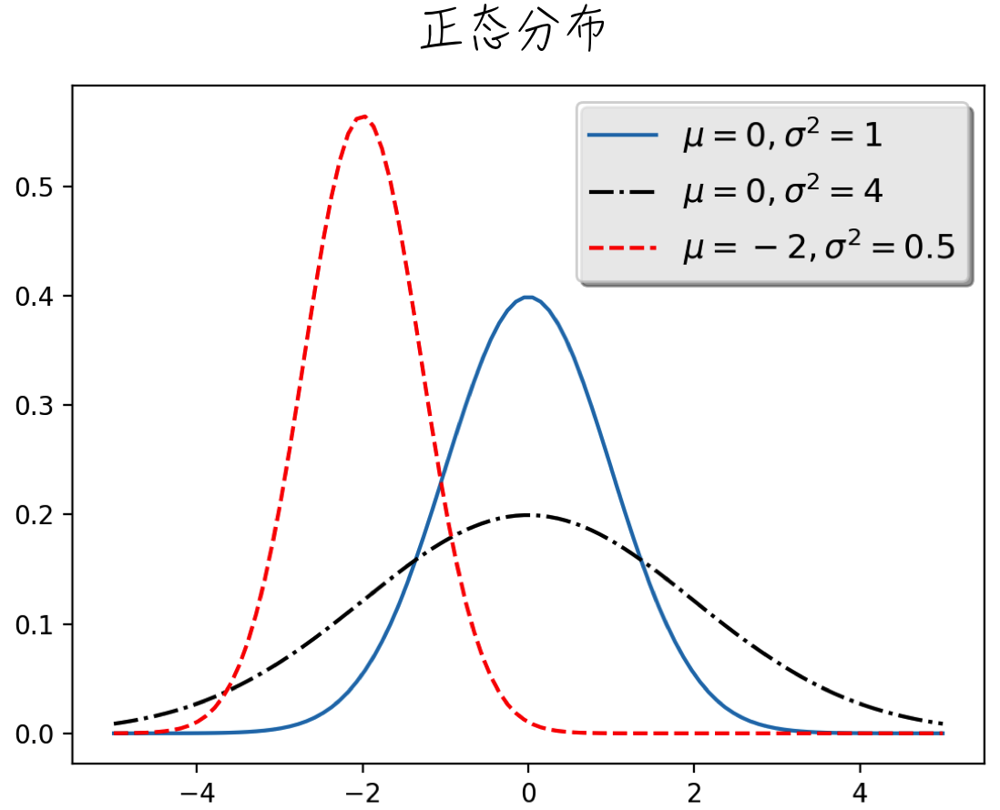
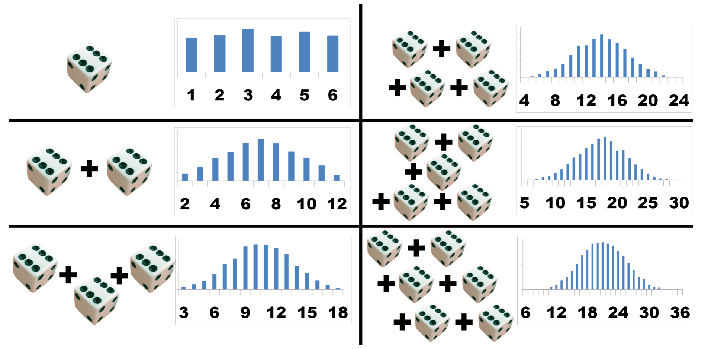
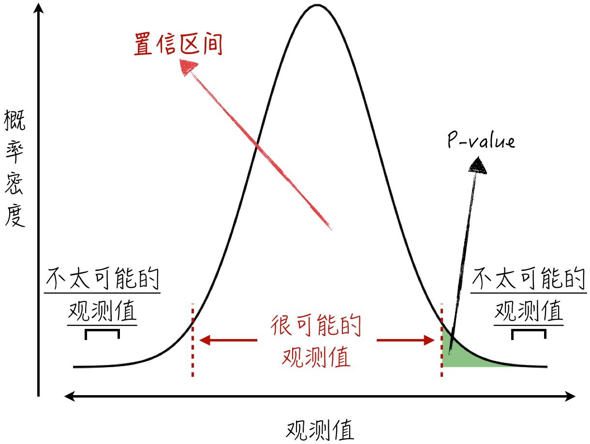

## 2.2 概率

什么是概率？直观上可以将其理解为事件发生的比例。举个例子，在图 2-7 中，假设随机投掷小球到一个方框内，那么小球落入圆圈的概率可以等于圆圈的面积除以方框的面积。

在人工智能领域，概率被广泛应用。在后续的模型讨论中会发现，几乎所有的模型都可被视作概率模型。这也意味着，模型的预测结果都带有一定的随机性。精通概率知识不仅有助于更好地理解模型的原理，更重要的是，它还能帮助我们准确解读模型的结果，区分出哪些结果是真实可信的，哪些结果是由随机扰动带来的错觉。为了更深入地学习概率，下面从概率的定义开始讨论。

### 2.2.1 定义概率：事件和概率空间

概率论最初源自对掷骰子的思考[^history]，我们同样用这个游戏来引入概率的基本定义。假设连续掷两次骰子，然后计算两次点数的总和。记第一次掷骰子得到的点数为 $X_1$，第二次的点数为 $X_2$，两次点数之和为 $XX=X_1+X_2$。容易得到，$XX$ 可能的取值为 2～12，将 $XX=i$ 记为事件 $E_i$。

其实可以进一步细分这些事件，比如 $XX=3$ 对应的事件 $E_3$ 可以分解为两个事件：一个是第一次点数是 1，第二次点数是 2（记为 $(1,2)$）；另一个是第一次点数是 2，第二次点数是 1（记为 $(2,1)$）。整个过程如图 2-8 所示。将事件 $E_i$ 发生的概率记为 $P(E_i)$，其表达式如下：

$$
P(E_3)=P\bigl((1,2)\cup(2,1)\bigr)
=P((1,2))+P((2,1))
=\frac{1}{6}
\tag{2-18}
$$

对于其他结果，也可以用类似的方法定义它们发生的概率。

将上面的方法推广到一般情况，就可以得到概率的定义[^axioms]：将所有不可再分的随机结果记为 $\omega$。这些不可再分的随机结果组成了一个可数的非空集合，被称为**样本空间**（Sample Space），用符号 $S$ 表示。样本空间内的子集被称为**事件**。概率 $P$ 是一个实数函数，被定义在样本空间上，它满足以下两个条件：

- $P(\omega)\geqslant 0$，对于所有的 $\omega$ 都成立；
- $\sum_{\omega\in S}P(\omega)=1$。

对于一个事件 $E$，其对应的概率为 $P(E)=\sum_{\omega\in E}P(\omega)$。一个样本空间加上定义的概率称为一个概率空间。根据概率的定义，可以得到公式（2-19），其中 $A,B$ 均为随机事件，而 $A^c$ 表示事件 $A$ 的补集。

$$
\begin{aligned}
0&\leqslant P(A)\leqslant 1,\\
P(A^c)&=1-P(A),\\
P(A\cup B)&=P(A)+P(B)-P(A\cap B)
\end{aligned}
\tag{2-19}
$$

### 2.2.2 条件概率：信息的价值

前面已经介绍了单个事件和多个事件中发生任意一个事件的概率，接下来讨论两个或多个事件同时发生的概率。假设有两个不同的事件 $A$ 和 $B$，它们同时发生的概率被记为 $P(A\cap B)$。那么这个概率与 $P(A)$、$P(B)$ 有什么关系吗？

为了更清晰地解释这个问题，需要引入**条件概率**这个概念。条件概率是指在已知一个事件已经发生的情况下，另一个事件发生的可能性，这可以用公式（2-20）来表示。其中，$P(A\mid B)$ 代表在事件 $B$ 发生的情况下，事件 $A$ 发生的可能性；而 $P(B\mid A)$ 则表示在事件 $A$ 发生的情况下，事件 $B$ 发生的可能性。

$$
P(A\mid B)=\frac{P(A\cap B)}{P(B)}
\qquad
P(B\mid A)=\frac{P(A\cap B)}{P(A)}
\tag{2-20}
$$

将公式（2-20）中的两个条件概率结合起来，就可以得到**贝叶斯定理**：

$$
P(B\mid A)=\frac{P(A\mid B)P(B)}{P(A)}
\tag{2-21}
$$

可以通过一个简单的例子更直观地理解条件概率。假设在一个大学班级中：

- 来自重庆的学生比例为 10%，而这部分学生喜欢吃辣的比例为 90%；
- 90% 的学生来自其他地区，其中有 30% 的学生喜欢吃辣。

为了表述清楚，用 $A$ 表示某学生来自重庆，用 $B$ 表示该学生喜欢吃辣。根据上面的描述，在没有其他信息的情况下，一个学生来自重庆的概率为 10%，即 $P(A)=0.1$。但如果知道了这个学生喜欢吃辣，那么显然他来自重庆的比例会上升，因为重庆人更喜欢吃辣。这意味着“喜欢吃辣”这个信息对判断他是否来自重庆是有价值的，但应该如何量化这个影响呢？可以利用条件概率来量化“喜欢吃辣”这个信息的价值。根据贝叶斯定理，可以计算出 $P(A\mid B)=0.25$[^chongqing]，如图 2-9 所示。通俗来讲，知道这个学生喜欢吃辣后，他来自重庆的概率从 10% 上升到了 25%。这就是我们从信息中得到的价值。

如果条件概率等于原本的概率，即 $P(A\mid B)=P(A)$（在这种情况下也容易推出 $P(B\mid A)=P(B)$），则称事件 $A$ 和事件 $B$ **相互独立**。换句话说，事件 $B$ 和事件 $A$ 毫无关联，前者的发生与否不会对后者的发生产生影响。

当两个事件相互独立时，可以推出 $P(A\cap B)=P(A)P(B)$。基于这一概念，可以定义任意多个相互独立的事件：假设 $A_1,A_2,\dots,A_n$ 是一系列相互独立的随机事件，当且仅当针对其中的任意有限子集 $A_{i_1},A_{i_2},\dots,A_{i_k}$，都满足$
P(A_{i_1}\cap A_{i_2}\cap\cdots\cap A_{i_k})
=P(A_{i_1})P(A_{i_2})\cdots P(A_{i_k})
$。

### 2.2.3 随机变量

为了进一步量化随机事件，在其基础上定义**随机变量**这个概念：将随机事件映射为数字（通常是实数）的函数[^measurable]。比如，在 [2.2.1 节](/books/deconstructing_LLM/chapter-2/2-2#section-2-2-1)中提到的变量 $XX$，等于两次点数之和，就是一个随机变量。通过引入随机变量，能更方便地计算概率。根据取值方式的不同，随机变量可以分为**离散型随机变量**和**连续型随机变量**。

- 离散型随机变量的取值是离散的，比如上面提到的 $XX$，其可能的取值是离散的自然数，大于等于 2 且小于等于 12。对于离散型随机变量 $X$，假设它可能的取值为 $x_1,x_2,\dots,x_n$。$X$ 的随机性可由**概率分布函数**（Probability Distribution Function）来描述，具体的定义如公式（2-22）所示。

$$
P(x_i)=p_i
\tag{2-22}
$$

- 连续型随机变量的取值是连续的，比如人体的身高。对于连续型随机变量 $X$，它的随机性可以由**概率密度函数**（Probability Density Function）来描述，它的定义如公式（2-23）所示（公式中涉及的微积分请参考 [2.3 节](/books/deconstructing_LLM/chapter-2/2-3)）。

$$
P(a\leqslant X\leqslant b)=\int_a^b f_X(x)\,\mathrm dx
\qquad
f_X(x)=\frac{\mathrm d}{\mathrm dx}P(-\infty\leqslant X\leqslant x)
\tag{2-23}
$$

对于随机变量，常用的函数和统计指标如下。

- **累积分布函数**（Cumulative Distribution Function，CDF）的定义如下：

$$
F_X(x)=P(X\leqslant x)
\tag{2-24}
$$

- **期望**（Expected Value）。期望可以被直观地理解为随机变量的加权平均值，通常用 $E[X]$ 来表示。具体的计算公式如下（如果期望存在）：

$$
E[X]=
\begin{cases}
\displaystyle\sum_i p_i x_i,&X\text{ 是离散型随机变量},\\[6pt]
\displaystyle\int x f_X(x)\,\mathrm dx,&X\text{ 是连续型随机变量}
\end{cases}
\tag{2-25}
$$

- **方差**（Variance），记为 $\operatorname{Var}(X)$，用于度量随机变量的分散情况。它的定义公式为（如果方差存在）：

$$
\operatorname{Var}(X)
=E\bigl[(X-E[X])^2\bigr]
=E[X^2]-(E[X])^2
\tag{2-26}
$$

- **协方差**（Covariance），记为 $\operatorname{Cov}(X,Y)$，用于度量两个随机变量的整体变化幅度和它们之间的相关关系。它的定义公式如公式（2-27）所示。简而言之，协方差描述了两个变量同时增加或减少的趋势[^covariance]。需要注意的是，随机变量的方差是协方差的一种特殊情况。

$$
\operatorname{Cov}(X,Y)
=E\bigl[(X-E[X])(Y-E[Y])\bigr]
=E[XY]-E[X]E[Y]
\tag{2-27}
$$

对于随机变量的期望和协方差，有如下几个常用的公式：

$$
\begin{aligned}
E[aX+bY]&=aE[X]+bE[Y]\\
\operatorname{Cov}(X,X)&=\operatorname{Var}(X)\\
\operatorname{Var}(aX+bY)
&=a^2\operatorname{Var}(X)+b^2\operatorname{Var}(Y)
+2ab\operatorname{Cov}(X,Y)
\end{aligned}
\tag{2-28}
$$

在讨论单个随机变量的概率分布之后，下面转而探讨两个随机变量之间的条件概率分布。假设正在研究的两个随机变量分别为 $X$ 和 $Y$。

- 如果 $X$ 和 $Y$ 都是离散型随机变量，则它们之间的条件分布可用条件概率分布函数来描述，具体的定义如下：

$$
P(X=x_i\mid Y=y_j)
=\frac{P(X=x_i,Y=y_j)}{P(Y=y_j)}
\tag{2-29}
$$

- 如果 $X$ 和 $Y$ 都是连续型随机变量，则它们之间的条件分布可用条件概率密度函数来描述，具体的定义如下。其中，$f_{X,Y}$ 是变量 $X$ 和 $Y$ 的联合概率密度函数[^joint-density]，$f_X$ 是变量 $X$ 的概率密度函数。

$$
f_{Y\mid X}(y\mid X=x)=\frac{f_{X,Y}(x,y)}{f_X(x)}
\tag{2-30}
$$

- 如果 $X$ 和 $Y$ 中有一个是离散型随机变量，另一个是连续型的，则按照上面的方式定义其条件概率分布。严格的数学定义涉及的实变函数比较复杂，而且在实际应用中不太常见，因此在此不做深入讨论。

类似于相互独立的随机事件，下面将定义相互独立的随机变量。对于一个随机变量 $X$ 和一个实数 $a$，$X$ 是否小于 $a$ 就定义了一个随机事件，记为 $[X<a]$。基于这些随机事件的相互独立性，就可以定义随机变量是否独立。具体地，假设 $X_1,X_2,\dots,X_n$ 是一系列随机变量，对于其中任意一个有限子集 $X_{i_1},X_{i_2},\dots,X_{i_k}$ 以及任意数字子集 $a_{i_1},a_{i_2},\dots,a_{i_k}$，如果随机事件 $[X_{i_1}<a_{i_1}],[X_{i_2}<a_{i_2}],\dots,[X_{i_k}<a_{i_k}]$ 是相互独立的，则随机变量 $X_1,X_2,\dots,X_n$ 是相互独立的。

当随机变量相互独立时，计算它们的概率分布和统计指标将更简便，如公式（2-31）所示。为了表述简洁，这里只以两个独立的随机变量为例（记为 $X,Y$），对于多个随机变量的情况，处理方法类似。

$$
\begin{aligned}
P(X=x_i,Y=y_j)&=P(X=x_i)P(Y=y_j)
\quad\text{或}\quad f_{X,Y}=f_Xf_Y\\
E[XY]&=E[X]E[Y]\\
\operatorname{Var}(aX+bY)
&=a^2\operatorname{Var}(X)+b^2\operatorname{Var}(Y)
\end{aligned}
\tag{2-31}
$$

### 2.2.4 正态分布：殊途同归

本节将讨论一个非常重要的概率分布：**正态分布**（Normal Distribution），也称为**高斯分布**（Gaussian Distribution）。当随机变量 $X$ 服从正态分布时，它是一个连续型随机变量，相应的概率密度函数如下：

$$
f(x)=\frac{1}{\sqrt{2\pi\sigma^2}}
\exp\left(-\frac{(x-\mu)^2}{2\sigma^2}\right)
\tag{2-32}
$$

公式（2-32）中的 $\mu$ 和 $\sigma^2$ 是概率分布的参数，可以证明随机变量 $X$ 的期望等于 $\mu$，方差等于 $\sigma^2$，如公式（2-33）所示。通常将其记为 $X\sim N(\mu,\sigma^2)$。

$$
E[X]=\mu\qquad \operatorname{Var}(X)=\sigma^2
\tag{2-33}
$$

当 $\mu=0,\sigma^2=1$ 时，称其为标准正态分布。可以证明随机变量 $(X-\mu)/\sigma$ 服从标准正态分布，即 $(X-\mu)/\sigma\sim N(0,1)$。在不同参数下，正态分布的概率密度函数曲线如图 2-10 所示，参数 $\mu$ 决定了曲线的中心位置，而参数 $\sigma^2$ 决定了曲线的平坦程度。这个值越大，概率密度曲线越平坦。

在实际应用中，许多随机变量都大致服从正态分布，因此这个分布在各个领域的应用非常广泛。比如在搭建模型时，通常会假设模型的随机扰动项服从正态分布[^normal-error]。但为什么正态分布如此普遍呢？这里给出一个相当合理的猜测——**中心极限定理**（Central Limit Theorem）。

假设随机变量 $X_1,X_2,\dots,X_n$ 服从**独立同分布**[^not-independent]（Independent and Identically Distributed，i.i.d.），且具有有限的期望和方差，记为 $E[X_i]=m,\operatorname{Var}(X_i)=v^2$。数学上可以证明如下的定理：

$$
\begin{aligned}
\bar X_n&=\frac{1}{n}\sum_{i=1}^{n}X_i\\
T_n&=\frac{\sqrt n(\bar X_n-m)}{v}\\
\lim_{n\to\infty}T_n&\sim N(0,1)
\end{aligned}
\tag{2-34}
$$

公式（2-34）表示，在一定条件下，不管随机变量的分布如何，它们在经过一定的线性变换后都会逼近标准正态分布。可以形象地理解为，多个随机效应叠加起来就近似服从正态分布。举例来说，考虑图 2-11[^muelaner]：一个骰子的点数近似服从均匀分布；两个骰子点数之和的分布曲线近似于一个等边三角形；而随着骰子数量的增多，点数之和的分布曲线就越来越接近于正态分布。

在现实中，我们观察到的许多随机变量实际上是多个独立同分布的随机变量叠加起来的结果。根据中心极限定理，这些随机变量大致服从正态分布。

### 2.2.5 P-value：自信的猜测

下面以正态分布为例，介绍一个统计学中的重要概念：**P 值**（P-value）。P 值在数学上对应着分位数方程（Quantile Function）。

不妨假设 $X$ 是一个实数随机变量，而 $p$ 是 $(0,1)$ 区间内的一个实数，那么它的**分位数方程**定义为

$$
Q(p)=\inf\{x\in\mathbb R:p\leqslant P(X\leqslant x)\}
\tag{2-35}
$$

也就是说，$Q(p)$ 为累积概率大于等于 $p$ 值的最小实数。举一个简单的例子来展示这个定义，假设 $X$ 是一个骰子的点数，那么它在 1～6 上服从均匀分布，即 $P(X=i)=1/6,i=1,2,\dots,6$。如果 $p=0.5$，比较容易可以得到：$P(X\leqslant 3)=0.5$、$P(X\leqslant 4)=4/6$，以及 $P(X\leqslant 2)=2/6$，所以 $Q(0.5)=3$。以此类推，可以得到如下的分位数方程：

$$
Q(p)=
\begin{cases}
1,&0<p\leqslant\frac16\\
2,&\frac16<p\leqslant\frac26\\
3,&\frac26<p\leqslant\frac36\\
4,&\frac36<p\leqslant\frac46\\
5,&\frac46<p\leqslant\frac56\\
6,&\frac56<p<1
\end{cases}
\tag{2-36}
$$

介绍完数学公式后，再来看看 P 值定义背后的内容。对于一个服从正态分布的随机变量 $X$，其观测值大多会集中在期望值周围，因为正态分布在期望值附近具有更高的概率密度，所以观测值在这个区域是更常见的，如图 2-12 所示。由此，定义 $X$ 的 $\alpha$ 置信区间（$\alpha$ 通常等于 0.95 或者 0.99）：概率等于 $\alpha$ 且以期望为中心的对称区域。

严格的数学定义如下：如公式（2-37）所示，定义 $a$ 和 $b$，使得 $X$ 的 $\alpha$ 置信区间为 $[a,b]$，即有 $\alpha$ 的概率，$X$ 的观测值会落到区间 $[a,b]$。

$$
a=Q\left(0.5-\frac{\alpha}{2}\right)
\qquad
b=Q\left(0.5+\frac{\alpha}{2}\right)
\tag{2-37}
$$

换个角度来描述这个概念：$X$ 的观测值落在左边（或者右边）“尾部区域”是非常罕见的。当发生这种罕见的情况时，我们就需要反思哪里出了问题。假设观测值为 $x$，定义这个观测值对应的 P 值为 $P(X\leqslant x)$（若观测值落在右边尾部，则 P 值为 $P(X\geqslant x)$），如图 2-12 所示。容易得到对于 $\alpha$ 置信区间 $[a,b]$，$a$ 和 $b$ 的 P 值都为 $(1-\alpha)/2$。

在人工智能领域，P 值以及相应的置信区间有许多应用案例。它们常被用于分析模型结果的可信度或进行假设检验。这些细节将在本书的第 3～5 章中详细讨论。

[^history]: 概率论的起源可追溯到 17 世纪的法国，当时法国宫廷内盛行着掷骰子的赌博游戏。为了弄清参与者取胜的可能性，人们求助于数学家布莱兹·帕斯卡（Blaise Pascal）。这段历史开启了概率论这门学科的大门。
[^axioms]: 正文中给出的定义并不是严格意义上的公理化定义。严格的定义为：概率是定义在概率空间上的一种度量，也就是从样本事件到实数的函数。这个函数满足所谓的柯尔莫果洛夫公理（Kolmogorov Axioms）。具体地，假设 $P$ 为概率：对于任意一个事件 $E$，则 $P(E)\geqslant0$；对于所有可能事件的集合 $\Omega$，则 $P(\Omega)=1$；任意两两互不相交的事件组成可数序列 $E_1,E_2,\dots$，则 $P(E_1\cup E_2\cup\cdots)=\sum_iP(E_i)$。
[^chongqing]: 这里给出具体的计算过程。首先将事件 $B$ 的概率分解，即 $P(B)=P(B\cap A)+P(B\cap A^c)$。再根据条件概率的公式得到 $P(B)=P(B\mid A)P(A)+P(B\mid A^c)P(A^c)$，以及 $P(A\mid B)=\frac{P(B\mid A)P(A)}{P(B\mid A)P(A)+P(B\mid A^c)P(A^c)}$。根据问题的描述，有 $P(A)=0.1,P(A^c)=0.9,P(B\mid A)=0.9,P(B\mid A^c)=0.3$。代入公式计算可以得到 $P(A\mid B)=\frac{0.09}{0.09+0.27}=0.25$。
[^measurable]: 严格的数学定义要求函数为可测函数。可测函数是测度论中的一个数学概念，比较复杂且与人工智能关系不大，因此不做展开。
[^covariance]: 协方差可以取多种数值，其正负性代表了变量之间的线性相关性。正值表示正相关，即一个变量的增加伴随着另一个变量的增加；负值表示负相关，即一个变量的增加伴随着另一个变量的减少；而零值表示无线性相关性。然而，协方差数值的大小难以直观解释，所以通常使用相关系数（协方差除以方差）来更准确地衡量变量之间的关联性。
[^joint-density]: 联合概率密度函数的定义如下：假设 $X$ 和 $Y$ 是两个连续型随机变量，若函数 $f_{X,Y}$ 满足 $P(a\leqslant X\leqslant b,c\leqslant Y\leqslant d)=\int_c^d\int_a^b f_{X,Y}(x,y)\,\mathrm dx\,\mathrm dy$，则称 $f_{X,Y}$ 为随机变量 $X$ 和 $Y$ 的联合概率密度函数。
[^normal-error]: 这个假设并不总是符合现实情况，有时会导致模型的效果并不好，甚至会得出错误的结论。很多模型的改进和创新也基于这一假设，例如逻辑回归，详见 [4.1.3 节](/books/deconstructing_LLM/chapter-4/4-1#section-4-1-3)。
[^not-independent]: 如果随机变量 $X_1,X_2,\dots,X_n$ 不相互独立，则中心极限定理不再成立。可以考虑如下的反例：假设 $X_1$ 在 $-1$ 和 $1$ 上服从均匀分布，即 $P(X_1=-1)=P(X_1=1)=0.5$。而对于 $i>1$，随机变量 $X_i=X_1$，那么 $X_i$ 也是均匀地分布在 $-1$ 和 $1$ 上。但 $\frac1n\sum_{i=1}^nX_i$ 等于 $1$ 或者 $-1$。显然，这个概率分布不会逼近正态分布。
[^muelaner]: 图片参考自 Jody Muelaner 博士的个人主页。
