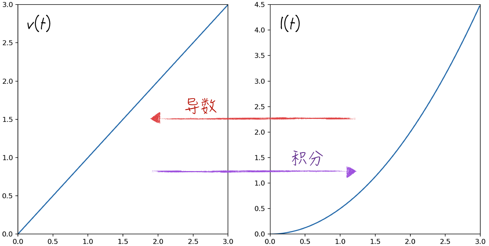
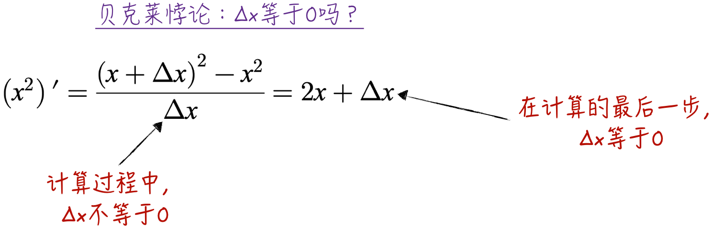
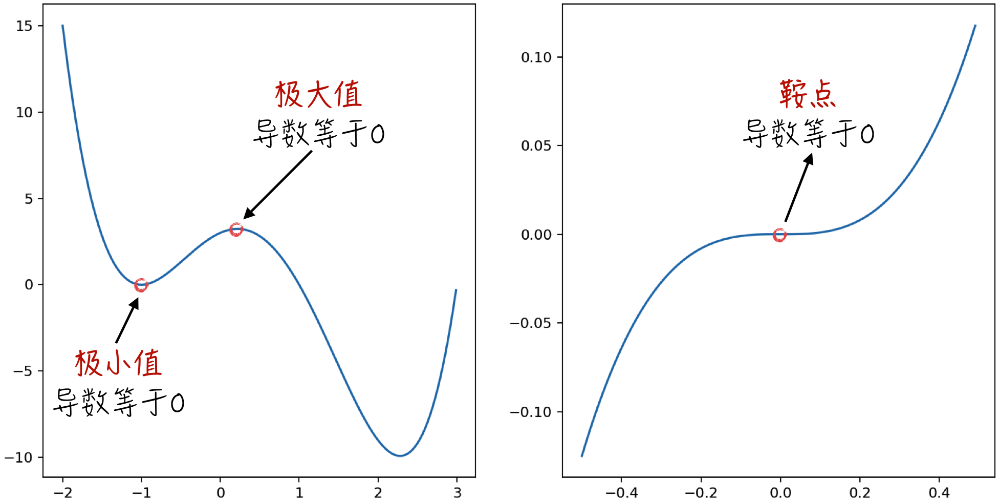

## 2.3 微积分

微积分是现代数学的基石，包括两个主要概念：导数（微分）和积分。导数表示函数在局部的变化速率，例如根据物体的位置函数计算其运动速度。积分则用于计算函数在一段区间内的累积效应，比如在统计学中，根据连续型随机变量的概率密度函数计算其落在特定区间内的概率。在人工智能领域，积分通常用于理论研究，导数则大量应用在工程实践中，比如利用导数解决最优化问题。因此，本节将重点介绍导数的相关知识和应用。

### 2.3.1 导数和积分

本节将延续前文的风格，继续通过日常生活的例子来引入微积分的基本概念。假设我们在一条直线上行走，在行走的过程中有两个关键要素：位置和速度。设 $l(t)$ 为 $t$ 时刻我们与起点的距离，而 $v(t)$ 为 $t$ 时刻的速度。这两个函数是相互关联的，速度代表位置的瞬间变化率，位置则是速度在一段时间内的累积。微积分的核心问题在于，如何从位置函数 $l(t)$ 中推导出速度函数 $v(t)$（导数），以及从速度函数 $v(t)$ 中导出位置函数 $l(t)$（积分）。具体过程可参考图 2-13。

当已知时刻 $t_1$ 的位置 $l(t_1)$ 以及时刻 $t_2$ 的位置 $l(t_2)$ 时，可以很容易地得出这段时间内的平均速度$\bar v=[l(t_2)-l(t_1)]/(t_2-t_1)$。

当我们匀速前进时，这段时间内任意时刻的速度 $v(t),t_1\leqslant t\leqslant t_2$ 都等于这个平均速度 $\bar v$。如果不是匀速前进呢？那么 $t_1$ 时刻的速度就和平均速度存在一定的差异。显然，时间间隔越短，平均速度 $\bar v$ 与 $t_1$ 的速度 $v(t_1)$ 就越接近。当时间间隔达到极限 0 时，$\bar v$ 就等于 $v(t_1)$。这可以用数学语言表述为，平均速度的极限等于起点时刻的速度，如公式（2-38）所示[^differentiable]。

$$
\lim_{t_2\to t_1}\frac{l(t_2)-l(t_1)}{t_2-t_1}
=\lim_{t_2\to t_1}\bar v
=v(t_1)
\tag{2-38}
$$

这个计算过程在数学上被称为求函数的**导数**，记为 $l'(t)=v(t)$。导数的物理含义非常清晰：当自变量 $t$ 变化很小的量 $\mathrm dt$ 时（在数学上，$\mathrm dt$ 被称为无穷小量），因变量 $l(t)$ 的变化幅度大约为 $v(t)\mathrm dt$，记为 $\mathrm dl(t)=l'(t)\mathrm dt$。在数学上，上面的公式叫作**微分**。

对速度函数 $v(t)$ 继续求导，得到 $v(t)$ 的一阶导数，也就是 $l(t)$ 的二阶导数，它表示前进的加速度 $a(t)=v'(t)=l''(t)$。以此类推，可以定义函数 $l(t)$ 的 $n$ 阶导数[^higher-derivative]，记为 $l^{(n)}(t)$。

类似地，当已知时刻 $t_1$ 的速度等于 $v(t_1)$，位置等于 $l(t_1)$ 时，假设匀速前进，那么 $t_2$ 时刻所在的位置是 $l(t_2)=l(t_1)+v(t_1)(t_2-t_1)$。如果不是匀速前进，显然按匀速前进估算的位置 $l(t_1)+v(t_1)(t_2-t_1)$ 和实际位置 $l(t_2)$ 存在一定误差。那应该如何减少这个误差呢？考虑将时间区间 $[t_1,t_2]$ 分为 $n+1$ 段，不妨设相应的分段时间点为 $x_0,x_1,\dots,x_n$，计算公式如下：

$$
x_0=t_1\qquad
x_{i+1}=x_i+\frac{t_2-t_1}{n}
\tag{2-39}
$$

在每一个小的时间段内，移动过程可以近似为匀速前进。那么 $t_2$ 时刻估算的位置为

$$
l(t_1)+\sum_{i=0}^{n}v(x_i)\frac{t_2-t_1}{n}
\tag{2-40}
$$

数学上可以证明，在一定条件下[^integrable]，随着 $n$ 增大，公式（2-40）得到的估算结果会更接近于 $l(t_2)$。当 $n$ 趋近于正无穷大时，这两者就完全相等了。

$$
l(t_2)-l(t_1)
=\lim_{n\to\infty}\sum_{i=0}^{n}v(x_i)\frac{t_2-t_1}{n}
=\int_{t_1}^{t_2}v(t)\,\mathrm dt
\tag{2-41}
$$

在数学上，公式（2-41）被称为**积分**，记为 $l(t)=\int v(t)\,\mathrm dt$。可以看到，导数和积分就像加减法一样，可以相互推导，互为逆运算。

数学上的导数计算实际上是对函数的极限求解，而后者通常相当复杂。因此，数学家们提供了简单函数的导数，以及将复杂函数的导数分解为简单函数导数的计算法则（参考 [2.3.3 节](/books/deconstructing_LLM/chapter-2/2-3#section-2-3-3)）。导数计算的四则运算法则及常见简单函数的导数如下。其中，$f$ 和 $g$ 都是可导函数。

$$
\begin{aligned}
(fg)'&=f'g+fg'\\
\left(\frac fg\right)'&=\frac{f'g-fg'}{g^2}\\
c'&=0\qquad (x^n)'=nx^{n-1}\\
(\sin x)'&=\cos x\qquad (\cos x)'=-\sin x\\
(\mathrm e^x)'&=\mathrm e^x\qquad (\ln x)'=\frac1x
\end{aligned}
\tag{2-42}
$$

### 2.3.2 极限

导数的定义运用了数学中的**极限**概念。而在研究函数微分时，引入了另一个重要概念：无穷小量 $\mathrm dt$。这两个概念是数学中非常深刻的结论，在历史上，还曾引起了所谓的第二次数学危机，在此做简单介绍。

当牛顿和莱布尼茨[^leibniz] 各自独立发明微积分时，他们都使用如图 2-14 所示的推导方法计算函数的导数（以函数 $x^2$ 为例）。在计算过程中，无穷小量 $\Delta x$ 有时不等于 0，有时又等于 0。这就是著名的贝克莱悖论：“幽灵般的无穷小”。

为了解决这个危机，以柯西[^cauchy] 为首的数学家建立了严格的实数极限理论，将无穷小量理解为一个过程，而非一个确定的量。具体地，函数 $f(x)$ 在点 $x_0$ 的导数 $f'(x_0)$ 被定义为：对于任意一个 $\varepsilon>0$，都存在一个 $\delta>0$，使得任何 $x\in(x_0-\delta,x_0+\delta)$ 且 $x\ne x_0$，都能使公式（2-43）成立。这段表述在数学上是非常著名的 $\varepsilon$-$\delta$ 语言，有数学背景的读者也许非常熟悉。

$$
\left|\frac{f(x)-f(x_0)}{x-x_0}-f'(x_0)\right|<\varepsilon
\tag{2-43}
$$

类似地，微分公式 $\mathrm df(x)=f'(x)\mathrm dx$ 也表示一个动态过程，而非通常意义上的静态相等。

### 2.3.3 链式法则

在公式（2-42）中列举了一些常用函数的导数，但显然覆盖不够全面。例如，常用的多项式函数 $f(x)=(x^2+1)^2$ 并没有被包含在内。虽然可以利用乘法分配律将函数 $f(x)$ 重新写成标准的多项式形式，即 $f(x)=x^4+2x^2+1$，然后利用导数的加法公式，求得 $f(x)$ 的导数：$f'(x)=4x^3+4x=4x(x^2+1)$。但这种计算方式效率不高，而且并不是所有的复杂函数都能像多项式函数一样，通过四则运算就能分解成简单函数。因此，需要一种更高效的方法来处理复杂函数的求导，这便是**链式法则**。

事实上，多项式函数 $f(x)$ 可以被看作两个简单函数的复合。不妨设 $g(x)=x^2+1$，$h(x)=x^2$，则 $f(x)=h(g(x))$。通常 $f(x)$ 被称为复合函数，记为 $f=h\circ g$。

对于复合函数，数学上可以证明如下的等式成立：

$$
(h\circ g)'=(h'\circ g)g'
\tag{2-44}
$$

将公式（2-44）应用到上面的例子中，可以得到 $h'=2x$ 以及 $h'\circ g=2g(x)=2(x^2+1)$。因此，很容易得出 $f'(x)=4x(x^2+1)$。

根据链式法则，可以推导出反函数的导数公式。不妨设 $g$ 是 $f$ 的反函数，即 $f(g(x))=x$。对这个等式的两边求导数，可以得到：

$$
(f'\circ g)g'=1
\qquad
g'=\frac{1}{f'\circ g}
\tag{2-45}
$$

举例来说，$f(x)=x^3$ 的反函数为 $g(x)=x^{1/3}$，则根据公式（2-45）以及 $f'(x)=3x^2$，由此可以得到 $g'(x)=1/[3(x^{1/3})^2]=1/(3x^{2/3})$。

根据链式法则，还可以得到反三角函数的导数：

$$
\begin{aligned}
[\arcsin(x)]'&=\frac1{\sqrt{1-x^2}}
& [\arccos(x)]'&=-\frac1{\sqrt{1-x^2}}\\
[\arctan(x)]'&=\frac1{1+x^2}
& [\operatorname{arccot}(x)]'&=-\frac1{1+x^2}
\end{aligned}
\tag{2-46}
$$

### 2.3.4 偏导数与梯度

之前的章节集中讨论了单变量函数，也就是一元函数。然而，在现实生产与建模中，我们经常面对的是多变量函数，也就是多元函数。

对于多元函数，引入**偏导数**来探究函数的局部变化情况。偏导数的基础源于之前介绍的导数。其思路是选择多元函数中的一个变量作为自变量，将其他变量视为常数。然后，按照一元函数导数的定义，计算相应的偏导数。以一个示例来说明，假设有一个多元函数 $f(x,y)=xy+xy^2$。当对变量 $x$ 求偏导时，$y$ 就被当作常数，反之亦然。由此可以得到

$$
\frac{\partial f}{\partial x}=y+y^2
\qquad
\frac{\partial f}{\partial y}=x+2xy
\tag{2-47}
$$

显而易见，导数计算法则同样适用于偏导数。偏导数的加减乘除法则相对简单，所以不再赘述。需要详细讨论的是多元复合函数的链式法则。假设 $f(u,v)$ 是一个二元函数，其中，$u=g(x,y),v=h(x,y)$。数学上可以证明如下等式：

$$
\begin{aligned}
\frac{\partial f}{\partial x}
&=\frac{\partial f}{\partial u}\frac{\partial u}{\partial x}
+\frac{\partial f}{\partial v}\frac{\partial v}{\partial x}\\
\frac{\partial f}{\partial y}
&=\frac{\partial f}{\partial u}\frac{\partial u}{\partial y}
+\frac{\partial f}{\partial v}\frac{\partial v}{\partial y}
\end{aligned}
\tag{2-48}
$$

与一元函数的微分类似，在一定条件下[^multivariable-differentiable]，多元函数 $f(x_1,x_2,\dots,x_n)$ 的微分和偏导数存在如下关系：

$$
\mathrm df=\sum_{i=1}^{n}\frac{\partial f}{\partial x_i}\,\mathrm dx_i
\tag{2-49}
$$

事实上，$f$ 的所有一阶偏导数$
\left(\frac{\partial f}{\partial x_1},\frac{\partial f}{\partial x_2},\dots,\frac{\partial f}{\partial x_n}\right)
$组成了一个向量。这个向量被称为函数的**梯度**，记为 $\nabla f$。梯度在模型的工程实现上发挥了巨大的作用[^gradient]，具体细节请参考 [2.3.5 节](/books/deconstructing_LLM/chapter-2/2-3#section-2-3-5)和[第 6 章](/books/deconstructing_LLM/chapter-6)。

### 2.3.5 极值与最值

导数和偏导数的讨论占据了大量的篇幅，那它们的用途是什么呢？答案是求函数的**极值**（局部最小/最大值）和**最值**（全局最小/最大值）。其中，求函数的最值常被称为最优化问题，是人工智能工程实现的核心问题。为了表述简便，先考虑一元可微函数 $f(x)$，此函数在 $x_0$ 处取得最小值。那么根据导数的定义，可以得到

$$
f'(x_0)=\lim_{x\to x_0}\frac{f(x)-f(x_0)}{x-x_0}
$$

由于 $f(x_0)$ 是函数的最小值，因此当 $x>x_0$ 时，

$$
\frac{f(x)-f(x_0)}{x-x_0}\geqslant0
\tag{2-50}
$$

而 $x<x_0$ 时，

$$
\frac{f(x)-f(x_0)}{x-x_0}\leqslant0
\tag{2-51}
$$

综合公式（2-50）和公式（2-51），可以得到 $f'(x_0)=0$[^limit-proof]。对于最大值，也能证明同样的结论。这个观察可以扩展到多元可微函数 $g(\mathbf X)$（其中 $\mathbf X$ 为向量），假设它在 $\mathbf X_0$ 处取得最值，则它的梯度在该点等于 0，即 $\nabla g(\mathbf X_0)=0$。

然而，需要明确的是，函数在某一点的导数或梯度等于 0，并不能保证该点一定是函数的最值点。它有可能只是函数的极值点或**鞍点**（Saddle Point），如图 2-15 所示。用更正式的术语表达就是，导数或梯度等于 0 是函数取得最值的必要条件，但并非充分条件。虽然导数或梯度等于 0 并非确定最值点的充要条件，但它提供了筛选可能最值点的方法。在实际应用中，通常使用这个条件来获得备选的最值集合，随后通过其他方法来最终确认函数的最值。详细的方法和技巧将在[第 6 章](/books/deconstructing_LLM/chapter-6)中讨论。

[^differentiable]: 公式（2-38）和公式之前的表述在数学上并不严谨，因为函数 $l(t)$ 可能并不是可微函数。也就是说，极限 $\lim_{t_2\to t_1}\frac{l(t_2)-l(t_1)}{t_2-t_1}$ 并不存在。因此严谨的表述为，如果 $l(t)$ 是可微函数，则起点时刻的速度等于平均速度的极限。
[^higher-derivative]: 与一阶和二阶导数不同，高阶导数在现实世界中的意义其实很模糊。正因为如此，微积分的发明者之一牛顿曾宣称，三阶及其以上的导数都是无意义的。但现实并非如此，高阶导数的应用范围还是非常广泛的。比如，在 1972 年美国总统竞选期间，尼克松号称他将在任内使通货膨胀的加速度减缓。这让尼克松成为历史上第一位用三阶导数证明自己才能的国家领导人。
[^integrable]: 当公式（2-41）的极限存在时，函数 $v(t)$ 称为可积函数。更准确地说，它是黎曼可积（Riemann Integral）函数。在人工智能领域，通常遇到的函数都是可积可微的函数。在数学上，除黎曼积分外，常用的积分还有勒贝格积分（Lebesgue Integral）。这个积分的定义涉及实变函数理论，比较复杂，而且它在人工智能领域多用于理论研究，因此这里不做讨论。
[^leibniz]: 戈特弗里德·威廉·莱布尼茨（Gottfried Wilhelm Leibniz），德国数学家、哲学家。他与牛顿谁先发明微积分的争论是数学界至今最大的公案。事实上，莱布尼茨对微积分的记录方法更简洁明了，现代微积分的数学符号大多源于他。
[^cauchy]: 奥古斯丁·路易·柯西（Augustin Louis Cauchy），法国数学家。他建立了一系列严格的微积分准则，使后者摆脱了贝克莱悖论的困扰。柯西毕业并任教于法国辉煌灿烂的巴黎综合理工学院（École Polytechnique）。大学基础课程《高等数学》中的绝大部分理论都源于此学校。
[^multivariable-differentiable]: 若多元函数 $f$ 在给定点某邻域内的各个偏导数存在且偏导函数在该点都连续，则此函数在该点可微，这时公式（2-49）成立。当然，在人工智能领域处理的函数几乎都是可微函数。
[^gradient]: 事实上，函数的梯度在梯度下降算法中扮演了重要的角色，而链式法则构成了反向传播算法的理论基础，这两个理论概念是深度学习的关键。
[^limit-proof]: 数学上可以证明，当函数 $h(x)$ 在给定点 $x_0$ 附近（除去 $x_0$）恒大于等于 0 时，若极限 $\lim_{x\to x_0}h(x)$ 存在，则一定有 $\lim_{x\to x_0}h(x)\geqslant0$。公式（2-50）表示 $f'(x_0)\geqslant0$，而公式（2-51）表示 $f'(x_0)\leqslant0$，因此 $f'(x_0)=0$。
