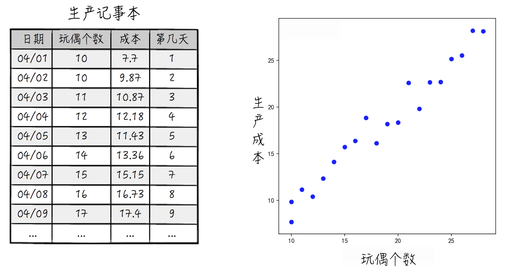
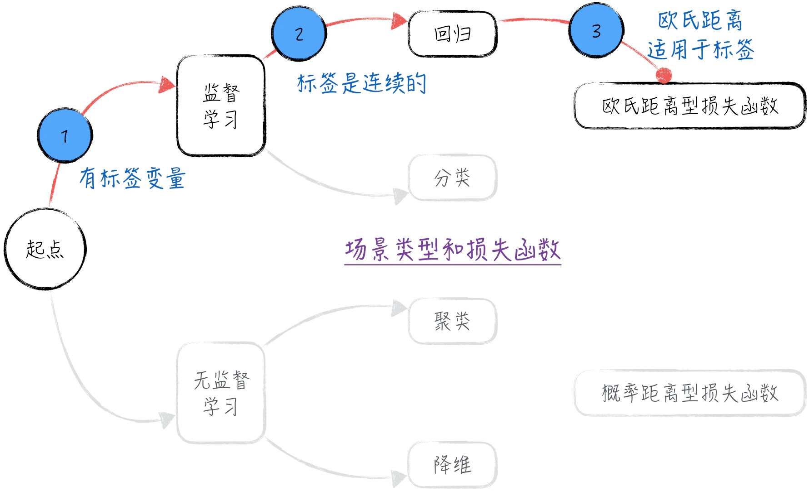
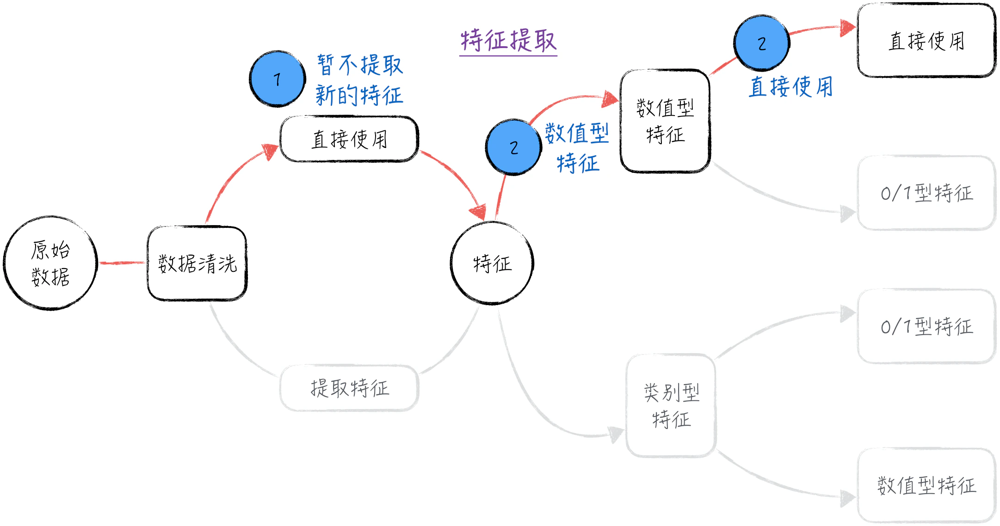
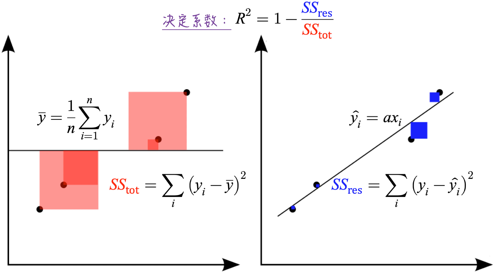
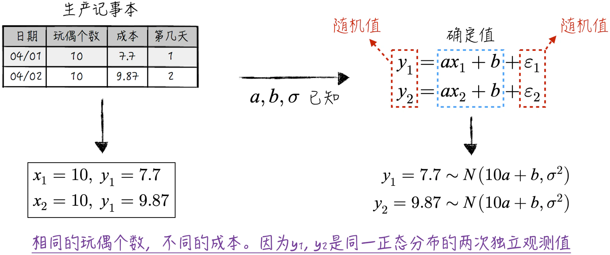
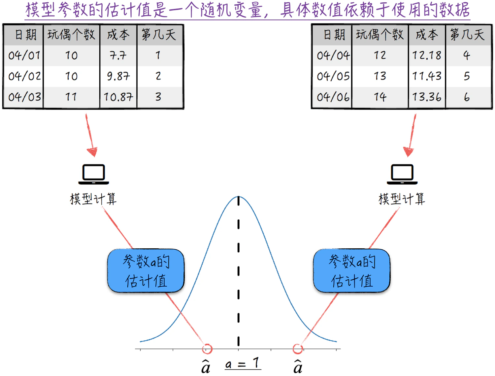
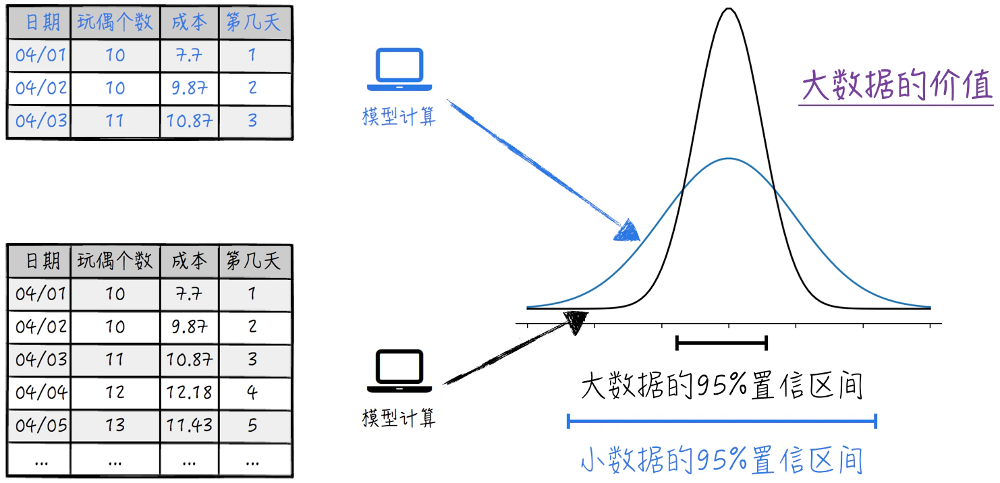

## 3.1 一个简单的例子

下面用一个简单的例子引出线性回归模型。假设有一个玩偶制造工厂，生产数据如图 3-1 左侧所示。这些数据包含玩偶个数和生产成本两个字段。

直觉上，我们初步推测玩偶个数和生产成本之间可能存在一种线性关系。为了更加清晰地理解这些数据，需要进行数据可视化，图形化展示有助于直观呈现变量之间的关系。在直角坐标系中将数据绘制出来后，发现玩偶个数和生产成本的关系并非严格呈现出一条直线：似乎沿某条直线上下波动，如图 3-1 右侧所示。基于这样的可视化结果和所掌握的背景知识，采用线性回归模型似乎是一个不错的选择。为了更全面地掌握这个模型，下面将分别采用机器学习和统计分析这两种不同的方法来解决这个建模问题。

在进入正式的模型讨论之前，先“揭秘”数据背后的生成公式。实际上，前文中的数据是由公式（3-1）生成的[^approximation]。在真实的建模场景中，我们始终无法获知数据背后的真实规律，然而提前知晓正确答案有助于更好地评估模型表现以及建模过程中的得失。

$$
y_i=x_i+\varepsilon_i
\tag{3-1}
$$

其中，$x_i$ 代表某一天生产的玩偶个数，而 $y_i$ 是对应那一天的生产成本。公式（3-1）表示，制造玩偶的平均成本等于 1。

公式中的 $\varepsilon_i$ 是一组随机变量，它们服从期望值为 0、方差为 1 的正态分布。这些随机变量代表制造玩偶时产生的随机成本。例如，当制作出失败的玩偶时，$\varepsilon_i$ 为正；而当偶然发现可用的旧布料时，$\varepsilon_i$ 则为负。这些随机成本与制造玩偶的数量是相互独立的。

### 3.1.1 机器学习的建模方式

机器学习解决建模问题的步骤可以总结为：确定建模场景并定义损失函数、提取特征、选择模型形式，以及评估模型效果。

首先分析上述例子的建模场景和损失函数，如图 3-2 所示。

1. 在给定的数据集中，$x_i$ 表示第 $i$ 天生产的玩偶个数，$y_i$ 表示第 $i$ 天的生产成本。我们需要通过生产的玩偶个数来预测成本。这表示在数据中存在标签字段，也就是模型的预测对象：生产成本。因此，这是一个监督学习过程。
2. 需要被预测的成本 $y_i$ 是连续的数值，代表数量的变化，它不是离散的，因此这属于回归问题。
3. 建模的目标是使模型预测的成本和真实的生产成本尽可能接近。为了实现这一目标，首先需要基于预测值和真实值之间的差异定义模型损失。已知实际成本为 $y_i$，假设模型预测的成本为 $\hat y_i$，那么预测值和真实值之间的差就定义了一个损失函数 $L=(1/n)\sum_{i=1}^{n}|y_i-\hat y_i|$。因此，建模目标就抽象为最小化损失函数。但遗憾的是，该函数在某些点是不可导的，这使得数学处理变得相当复杂。为了解决这一问题，可以重新定义一个在数学上更易处理的损失函数[^loss-choice]，具体形式如公式（3-2）所示，即真实值与预测值的欧氏距离平方平均值。

$$
L=\frac{1}{n}\sum_{i=1}^{n}(y_i-\hat y_i)^2
\tag{3-2}
$$

模型框架构建完成后，我们需要审视可用的数据，并提取用在模型中的特征，如图 3-3 所示。在机器学习中，这一过程被称为特征工程。

1. 这个示例中的数据是“干净”的，这表示数据中没有错误或异常值，因此可以省去数据清洗的步骤[^dirty-data]。目前的数据集只包含一个原始特征 $\mathbf X=\{x_i\}$，表示数量。尽管可以对 $\mathbf X$ 进行数学变换以生成新的特征，例如对其进行平方运算产生 $\mathbf X^2$，但在初始建模阶段，选择只使用原始特征。如果模型表现不佳，再考虑引入新的特征。
2. 原始特征 $\mathbf X=\{x_i\}$ 表示数量，属于数值型变量。在这个变量上进行的数学运算具有意义，因此 $\mathbf X$ 可以直接用于模型。

在当前场景中，选择模型形式是相对简单的一步[^model-selection]。根据先前的分析，我们决定使用线性回归模型，具体的模型定义如公式（3-3）所示。其中，$a$ 表示生产一个玩偶的变动成本，$b$ 表示固定成本[^intercept]。

$$
\hat y_i=ax_i+b
\tag{3-3}
$$

基于先前定义的损失函数和建模原则，可以得到模型参数的估计公式：参数 $(a,b)$ 的估计值 $(\hat a,\hat b)$ 将使得损失函数 $L$ 达到最小值，如公式（3-4）所示。

$$
(\hat a,\hat b)=\underset{a,b}{\operatorname{argmin}}\sum_{i=1}^{n}(y_i-ax_i-b)^2
\tag{3-4}
$$

至此，我们其实已经完成了机器学习的建模任务，但这并不意味着结束，因为还需要了解如何评估模型的效果。

1. 从预测的角度看，我们希望模型的预测结果尽可能接近真实成本。因此，如公式（3-5）所示，定义线性模型的均方误差（Mean Squared Error，MSE）。均方误差其实就是模型的损失函数，均方误差越小，模型的预测效果越好。

$$
\operatorname{MSE}=\frac{1}{n}\sum_{i=1}^{n}(y_i-\hat y_i)^2=L
\tag{3-5}
$$

2. 从解释数据的角度来看，我们希望模型能最大限度地解释成本变化的原因。换句话说，未被模型解释的成本 $(y_i-\hat y_i)$ 占成本变化 $(y_i-\frac{1}{n}\sum_{i=1}^{n}y_i)$ 的比例越小越好。因此，如图 3-4 所示，定义模型的决定系数（Coefficient of Determination，$R^2$）。决定系数越接近 1，模型的解释效果越好[^r-squared]。

在完成上述分析后，可以利用第三方库 scikit-learn 来解决这个问题。具体的解决方案将在 [3.2.1 节](/books/deconstructing_LLM/chapter-3/3-2#section-3-2-1)中详细讨论。建议读者先阅读 [3.2.1 节](/books/deconstructing_LLM/chapter-3/3-2#section-3-2-1)，再阅读 [3.1.2 节](/books/deconstructing_LLM/chapter-3/3-1#section-3-1-2)。

### 3.1.2 统计分析的建模方式

机器学习的建模过程虽然简洁，但也因此存在一些遗憾。机器学习难以完全解释数据所呈现的随机性，以及这种随机性将如何影响模型的结果。而这些正是统计分析擅长的领域，因此，本节将深入讨论统计分析是如何搭建线性回归模型的。

按照统计分析的一般步骤，首先需要对数据中的随机性进行建模。在先前的分析中，自变量 $x_i$ 和因变量 $y_i$ 之间似乎呈现出一种线性关系，但同时伴随着一些随机波动。因此，可以假设 $y_i$ 和 $x_i$ 之间的关系如公式（3-6）所示。该公式中的模型参数 $a$ 和 $b$ 分别表示生产一个玩偶的变动成本和固定成本。$\varepsilon_i$ 被称为噪音项，代表未被现有数据捕捉到的随机成本，服从期望为 0、方差为 $\sigma^2$ 的正态分布，记为 $\varepsilon_i\sim N(0,\sigma^2)$。特别需要注意的是，$\sigma^2$ 也是模型的参数。

除模型公式外，在模型构建过程中有两个重要假设[^endogeneity]：$\varepsilon_i$ 之间相互独立，$\varepsilon_i$ 和 $x_i$ 之间也相互独立。

$$
y_i=ax_i+b+\varepsilon_i
\tag{3-6}
$$

公式（3-6）表明 $y_i$ 由 $x_i$、$a$、$b$ 和 $\varepsilon_i$ 构成。当给定一组参数 $a,b$ 以及噪音项的方差 $\sigma^2$ 时，由于 $x_i$ 表示玩偶个数，是一个确定的量，那么 $y_i$ 和 $\varepsilon_i$ 一样是一个随机变量，服从期望为 $ax_i+b$、方差为 $\sigma^2$ 的正态分布，即 $y_i\sim N(ax_i+b,\sigma^2)$。换句话说，数据中的 $y_i$ 只是 $N(ax_i+b,\sigma^2)$ 这个正态分布的一个观测值，如图 3-5 所示，而且 $y_i$ 之间也是相互独立的。用数学语言描述就是：$y_i$ 在已知 $a,b,x_i,\sigma^2$ 时的条件概率分布是 $N(ax_i+b,\sigma^2)$，如公式（3-7）所示。

$$
y_i\mid a,b,x_i,\sigma^2\sim N(ax_i+b,\sigma^2)
\tag{3-7}
$$

既然数据本身就是随机变量，那么直觉告诉我们：模型参数的估计量和预测结果也应该都具有随机性。这种颠覆传统的观点或许让人有些震惊，但它却是统计分析这门学科的核心思想之一。接下来将通过数学推导来证实这一点。

根据之前的分析，$y_i$ 之间相互独立。所以得到 $\mathbf Y$ 的联合概率密度，如公式（3-8）所示。将该密度视为模型参数的函数时，它称为模型的似然函数（Likelihood Function），通常被记为 $L$[^likelihood-notation]。

$$
\begin{aligned}
p(\mathbf Y\mid a,b,\mathbf X,\sigma^2)
&=\prod_i p(y_i\mid a,b,x_i,\sigma^2)\\
\ln p(\mathbf Y\mid a,b,\mathbf X,\sigma^2)
&=-\frac{n}{2}\ln(2\pi\sigma^2)-\frac{1}{2\sigma^2}\sum_i(y_i-ax_i-b)^2
\end{aligned}
\tag{3-8}
$$

对于不同的模型参数，观测数据对应的似然值并不相同。我们希望这个似然值达到最大，这也是计算模型参数估计值的方法，被称为最大似然估计法（Maximum Likelihood Estimation，MLE）。对公式（3-8）求最大值，可以得到如下的估计公式。

$$
\begin{aligned}
(\hat a,\hat b)
&=\underset{a,b}{\operatorname{argmax}}\,P(\mathbf Y\mid a,b,\mathbf X,\sigma^2)
=\underset{a,b}{\operatorname{argmin}}\sum_i(y_i-ax_i-b)^2\\
\hat\sigma^2
&=\underset{a,b}{\operatorname{argmax}}\,P(\mathbf Y\mid a,b,\mathbf X,\sigma^2)
=\frac{\sum_{i=1}^{n}(y_i-\hat y_i)^2}{n}\\
\hat y_i&=\hat a x_i+\hat b
\end{aligned}
\tag{3-9}
$$

通过公式（3-9）得到的参数估计量 $(\hat a,\hat b,\hat\sigma^2)$ 都是随机变量。由于具体的推导过程比较烦琐，正文中将略去这些细节[^matrix-proof]。下面以 $\hat a$ 为例，用一个简化的数学推导来说明这一问题。假设数据集中只包含两组数据点 $(x_k,y_k),(x_l,y_l)$，且 $x_k\ne x_l$。在这种情况下，可以通过求解公式（3-10）中的方程组得到 $\hat a$ 的表达式。值得注意的是，公式（3-10）的右侧表示 $\hat a$ 是一个随机变量，并且服从以真实参数值 $a$ 为期望的正态分布。

$$
\begin{cases}
y_k=\hat a x_k+\hat b\\
y_l=\hat a x_l+\hat b
\end{cases}
\Rightarrow
\hat a=\frac{y_k-y_l}{x_k-x_l}
=\frac{a(x_k-x_l)+\varepsilon_k-\varepsilon_l}{x_k-x_l}
=a+\frac{\varepsilon_k-\varepsilon_l}{x_k-x_l}
\tag{3-10}
$$

在进行更详细的数学推导后，可以得到参数估计量的精确抽样分布，如公式（3-11）所示。根据公式（3-9），模型的预测结果同样是模型参数的线性组合，因此，预测结果也是一个随机变量。然而与参数估计量相比，预测结果的分布函数非常复杂，其推导更类似于解决数学难题，对理解模型的帮助有限。因此，本章的后续讨论将主要关注模型参数。在分析预测结果时，我们将采取“拿来主义”，直接使用开源工具提供的算法，而不会过多探讨算法背后的细节。

$$
\begin{aligned}
\hat b&\sim N\left(b,\frac{\sigma^2}{n}\right)\\
\hat a&\sim N\left(a,\frac{\sigma^2}{\sum_i(x_i-\bar x)^2}\right)\\
\hat\sigma^2&\sim\chi_{n-2}^2\frac{\sigma^2}{n}
\end{aligned}
\tag{3-11}
$$

既然参数估计量本身也是随机变量，那么更重要的是了解这些估计量的抽样分布，而不只是关注由公式（3-9）计算出的具体估计值。这些估计值只是估计量在当前样本上的一次实现，并不等于真实参数。另外，模型参数的具体估计值严重依赖于使用的数据。以一个简单的例子来说明，如图 3-6 所示，使用前 3 天的数据进行估计和使用第 4 到 6 天的数据进行估计，会得到不同的结果。

尽管参数估计量的随机性会带来不确定性，但在模型设定正确、数据满足相应假设且新增数据包含有效信息的情况下，随着数据量增加，参数估计量的不确定性通常会减小，并更集中于真实值附近。这也是大数据的价值之一：在这些条件下，增加数据有助于提高参数估计的精度，并可能改善模型的预测效果，如图 3-7 所示。

尽管机器学习和统计分析在数学计算上存在差异，但仔细对比公式（3-4）和公式（3-9）后会发现，模型参数 $a$ 和 $b$ 的估计公式是相同的，也就是说两种方法得到了相似的结果。那么，统计分析中烦琐的数学推导究竟有何意义呢？参数的分布函数对我们理解数据又有什么帮助呢？以下是两个典型的应用场景。

1. **置信区间**：通过参数的概率分布可以计算出参数的置信区间，也就是参数的真实值大致落在什么范围内。类似地，我们也可以得到模型结果的置信区间，从而了解预测值与真实值的差异范围，这可以使我们对模型结果更有信心。
2. **假设检验**：借助参数的概率分布，可以判断是否能够接受或拒绝某些假设。例如，在 1% 的犯错概率下，能否拒绝“参数 $b$ 的真实值等于 0”这个假设？通俗理解为，参数 $b$ 的真实值等于 0 的可能性是否低于 1%？这就是参数 $b$ 的 99% 显著性假设检验。通过假设检验，我们能更好地判断数据之间的关系。如果无法拒绝上述假设，那么需要思考：固定成本（参数 $b$）是否真实存在？模型得到的固定成本 $\hat b$ 是否只是因为模型不准确而导致的“错误”结论？

上述讨论的代码实现会依赖于第三方库 statsmodels。具体细节将在 [3.2.2 节](/books/deconstructing_LLM/chapter-3/3-2#section-3-2-2)中讨论。

[^approximation]: 这个公式其实并不严谨。因为正态分布的值域是整个实数范围，所以根据公式，$y_i$ 的取值可能为负数。这与生产成本必然大于 0 相矛盾。数学上完全严格的写法应为 $y_i=\max(x_i+\varepsilon_i,0)$。但是在本案例中，$x_i+\varepsilon_i<0$ 的概率非常小，几乎可以忽略。因此，模型可近似为公式（3-1）。
[^loss-choice]: 对于线性回归模型，公式（3-2）所定义的损失函数不仅在数学上更易处理，它还隐含地满足了数据的一个假设，即随机扰动项服从正态分布。事实上，正文中提到的绝对值损失和公式（3-2）对应着不同的线性回归模型。绝对值损失对应 Least Absolute Deviations Regression，而公式（3-2）对应 Least Squares Regression。
[^dirty-data]: 在真实的建模场景中，往往会存在很多“脏数据”，因此数据清洗和预处理是不可或缺的环节。
[^model-selection]: 在实际的建模过程中，模型选择是一项需要考虑多种因素的复杂任务，涉及建模场景、模型特性、数据规模，以及可用计算资源等多个方面。这要求数据科学家具备多方面的能力，以充分展现自身价值。
[^intercept]: 如果用模型语言来描述，公式（3-3）中的 $b$ 称为截距，它是线性回归模型中非常重要的参数之一。在加入这个参数后，模型才能在数据平移和数据单位转换时保持稳定。当发生数据平移时，例如原来统计的成本中少算了 1 元，现在需要加上，即 $y_i$ 变为 $y_i+1$，参数 $a$ 的估计值将保持不变。当发生数据单位转换时，例如将成本单位由“元”改为“百元”，即 $y_i$ 变成 $y_i/100$，参数 $a$ 将成比例地放大或缩小。在线性回归特别是多元线性回归中，各个自变量的单位常常不一致。如果没有加入参数 $b$，这两点性质便不再成立，所以在搭建线性回归模型时通常会加入截距。
[^r-squared]: 使用同正文中一样的符号，在最小化损失函数时，有 $\sum_i y_i=\sum_i\hat y_i$。令 $SS_{tot}=\sum_i(y_i-\bar y)^2$ 为总离差平方和，$SS_{reg}=\sum_i(\hat y_i-\bar y)^2$ 为模型解释的回归平方和，则 $R^2=SS_{reg}/SS_{tot}$。用学术语言来解释，这表示决定系数等于因变量的方差中可由自变量解释的比例。因此，可以用这个指标判断模型的解释能力。图 3-4 参考自维基百科。
[^endogeneity]: 如果假设不成立，可能会引发内生性问题。由于篇幅有限，本书不会讨论这一细节，感兴趣的读者请自行查阅相关资料。细心的读者可能会注意到，在机器学习中，我们用术语“特征”表示数据中的玩偶个数，而在统计分析中则使用“自变量”。同样地，机器学习使用“标签”表示生产成本，而统计分析使用“因变量”。这些术语的含义是相同的。
[^likelihood-notation]: 在学术上，通常用 $\theta$ 表示模型中的所有参数，比如本例中的 $a,b,\sigma^2$；用 $D$ 表示数据。因此，参数的似然函数记为 $L(\theta\mid D)=p(D\mid\theta)$。当 $D$ 为连续数据时，等式右边表示概率密度；当 $D$ 为离散数据时，表示概率质量。等式左边虽然形式相似，但不表示条件概率。
[^matrix-proof]: 严谨的数学证明可以用矩阵表示线性回归模型：$\mathbf Y=\mathbf X\boldsymbol\beta+\boldsymbol\varepsilon$。参数估计量为 $\hat{\boldsymbol\beta}=(\mathbf X^{\mathsf T}\mathbf X)^{-1}\mathbf X^{\mathsf T}\mathbf Y=\boldsymbol\beta+(\mathbf X^{\mathsf T}\mathbf X)^{-1}\mathbf X^{\mathsf T}\boldsymbol\varepsilon$。这个式子表示模型参数的估计量是随机变量，而且它们服从期望为参数真实值的正态分布。如果两个服从正态分布的随机变量相互独立，那么它们的线性组合依然服从正态分布。
