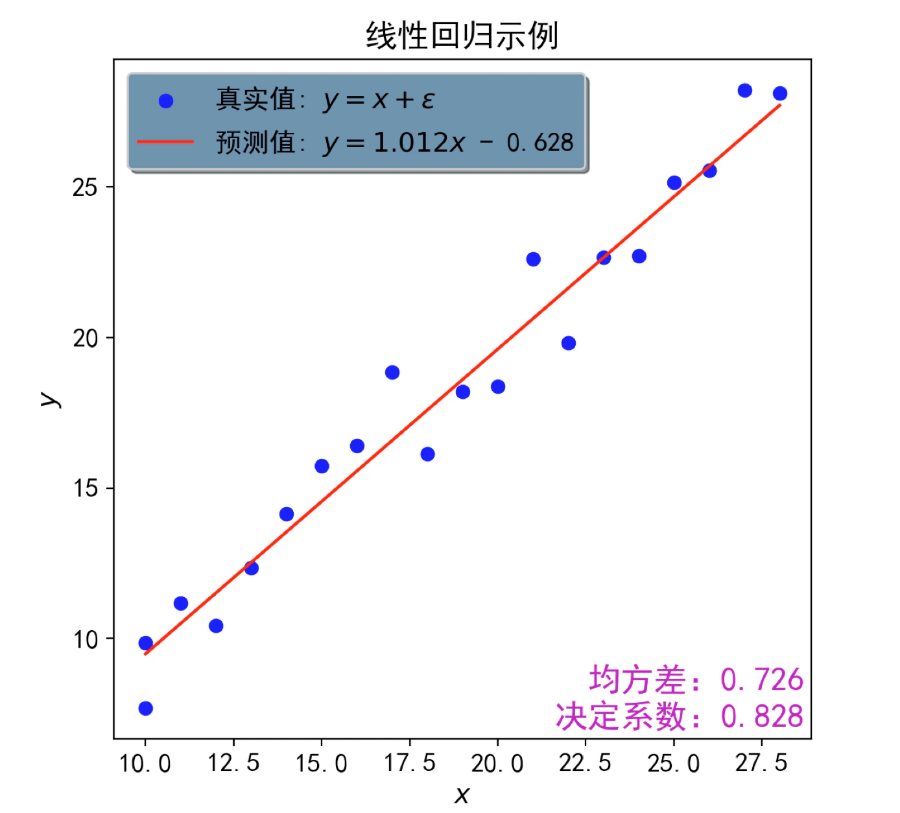
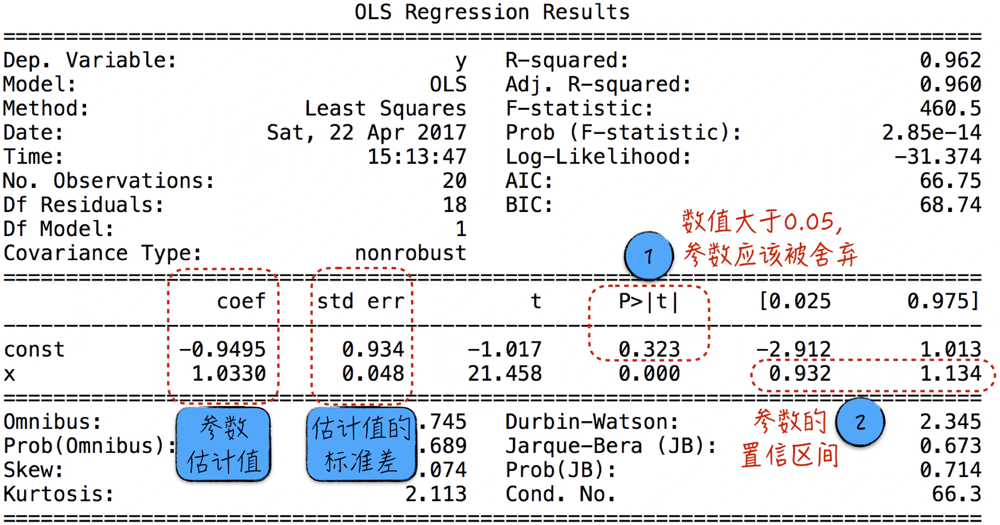
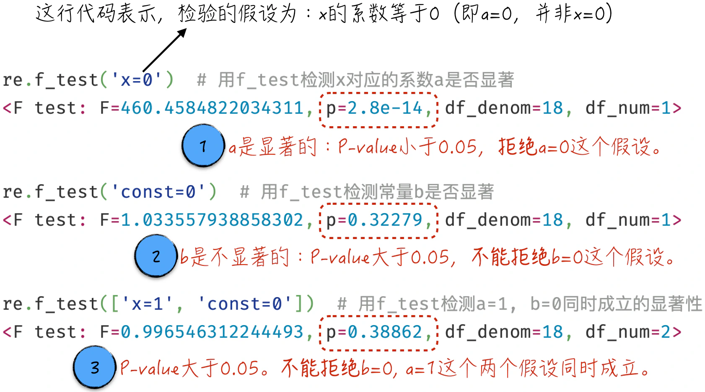
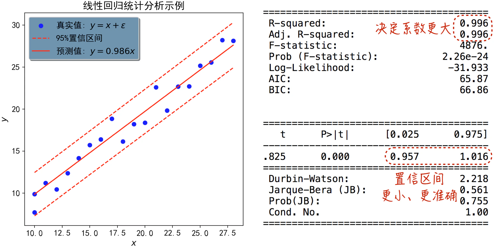

## 3.2 模型实现

本节将分别使用 scikit-learn 和 statsmodels 这两个开源工具来实现线性回归模型。这两种实现方式都相对简单。scikit-learn 的版本对应机器学习的建模方式，statsmodels 的版本则更关注统计分析。因此，本节除了搭建模型，还将重点展示如何计算置信区间和进行假设检验。

### 3.2.1 机器学习的代码实现

在 scikit-learn 的基础上，搭建并训练线性回归模型是十分简单的，主要分为 3 个步骤，如程序清单 3-1 所示。

1. **数据准备**：在第 6～8 行代码中，数据被划分为训练集和测试集。这样做的目的是防止模型产生过拟合的问题，具体细节将在 [3.3.1 节](/books/deconstructing_LLM/chapter-3/3-3#section-3-3-1)中详细讨论。
2. **搭建并训练模型**：第 11 行代码用于搭建模型，第 14 行代码则用于训练模型。值得注意的是，一旦 `model.fit` 函数被调用，它将根据传入的数据估计模型参数，并修改对应的对象 `model`。因此，虽然第 14 行代码中没有明确的赋值操作，但 `model` 已经被修改了，成了训练后的模型。
3. **评估模型效果**：利用 scikit-learn 提供的方法，能够轻松地计算出模型的均方差和决定系数，具体实现是第 17～20 行代码。

#### 程序清单 3-1 线性回归（[完整代码](https://github.com/GenTang/regression2chatgpt/blob/zh/ch03_linear/linear_ml.ipynb)）

```python
import numpy as np
import pandas as pd
from sklearn import linear_model

# 划分训练集和测试集
data = pd.read_csv('./data/simple_example.csv')
train_data = data[:15]
test_data = data[15:]

# 创建一个线性回归模型
model = linear_model.LinearRegression()
# 训练模型，估计模型参数
features, labels = ['x'], ['y']
model.fit(train_data[features], train_data[labels])

# 均方差，越小越好
error = model.predict(test_data[features]) - test_data[labels]
mse = np.mean(error.values ** 2)
# 决定系数，越接近 1 越好
score = model.score(test_data[features], test_data[labels])
```

将模型结果用可视化的方式呈现出来，就可以得到图 3-8。在可视化过程中，我们使用了另一个常用的第三方库 matplotlib，具体的使用细节请参考本书配套代码。



- 机器学习得到的模型是 $\hat y_i=1.012x_i-0.628$。该模型估计玩偶的平均成本为 1.012，而固定成本为 $-0.628$。估计的平均成本与实际生产成本 1 相差不大，但估计的固定成本为负数，这与常识相悖。
- 模型的均方差被估算为 0.726。这意味着，如果用此模型来估计生产总成本，平均误差为 $\sqrt{0.726}\approx0.85$。
- 模型的决定系数等于 0.828。这表示大约 83% 的成本变化可以由模型解释，即 83% 的成本是由玩偶制作过程产生的。这部分成本是可控的，与生产个数之间呈现明显的线性关系，而剩下的 17% 是暂时未知的随机成本。

### 3.2.2 统计分析的代码实现

统计学的关注重点是如何利用模型分析数据，并根据分析结果逐步修正和优化建立的模型。本节的代码实现将呈现这一过程。具体而言，首先利用第三方库 statsmodels 建立先前假设的线性回归模型，即 $y_i=ax_i+b+\varepsilon_i$。具体实现请参考程序清单 3-2。

1. 在第三方库 statsmodels 中，线性回归模型以矩阵形式表示。因此，若要引入模型中的参数 $b$，需要在自变量中加入常量 1。如第 8 行代码所示，使用 `add_constant` 函数来完成这一操作，新添加的常量项的变量名是 `const`。
2. 搭建并训练模型的过程也相当简单，如第 11 行和第 12 行代码所示。第 11 行代码表示创建一个线性回归模型，第 12 行代码表示训练模型，对模型参数进行估计。
3. 对于训练好的模型，既可以通过调用 `summary` 函数来计算模型最常用的统计性质，也可以调用 `f_test` 做假设检验。具体的代码可参考第 14～24 行，调用结果将在随后详细讨论。

#### 程序清单 3-2 分析线性回归模型（[完整代码](https://github.com/GenTang/regression2chatgpt/blob/zh/ch03_linear/linear_stat.ipynb)）

```python
import statsmodels.api as sm

# 数据准备
data = pd.read_csv('./data/simple_example.csv')
features, labels = ['x'], ['y']
Y = data[labels]
# 加入常量变量
X = sm.add_constant(data[features])

# 构建模型
model = sm.OLS(Y, X)
re = model.fit()

# 整体统计分析结果
print(re.summary())
# 用 f_test 检测 x 对应的系数 a 是否显著
print('检验假设 x 的系数等于 0：')
print(re.f_test('x=0'))
# 用 f_test 检测常量 b 是否显著
print('检测假设 const 的系数等于 0：')
print(re.f_test('const=0'))
# 用 f_test 检测 a=1, b=0 同时成立的显著性
print('检测假设 x 的系数等于 1 和 const 的系数等于 0 同时成立：')
print(re.f_test(['x=1', 'const=0']))
```

接下来，深入分析所得的模型结果。通过运行程序清单 3-2 中的第 15 行代码，可以获得如图 3-9 所示的结果，其中展示了模型参数的估计值以及相应的统计信息。



1. 首先，关注图中的标记 1。结果显示参数 $b$ 的估计值为 $-0.9495$，然而在假设 $b=0$ 的情况下，它的 P-value 却高达 32.3%。换句话说，基于现有数据推断：尽管估计值为 $-0.9495$，但参数 $b$ 的真实值实际上等于 0 的概率为 32.3%[^p-value-wording]。在这种情况下，我们认为参数 $b$ 是不显著的（在统计学中，P-value 小于 5% 被称为显著，小于 1% 被称为极显著）。因此，在建模时应该舍弃此参数[^keep-intercept]。类似地，参数 $a$ 的估计值为 1.033，其对应的 P-value 在保留 3 位小数时等于 0。也就是说，P-value 小于 1%，参数 $a$ 是极显著的，应该被纳入模型。基于这个结果，应修改模型为以下形式。

$$
y_i=ax_i+\varepsilon_i
\tag{3-12}
$$

2. 接下来，分析图中的标记 2。由这两个数值构成的区间被称为参数的置信区间，这个置信区间对应的置信度为 95%。也就是说，在 95% 的概率下，参数 $a$ 的真实值将在 $[0.932,1.134]$ 区间内，真实值 1 就在这个区间内。同样地，可以得到参数 $b$ 的 95% 置信区间为 $[-2.912,1.013]$，这个区间包含 0。这一结论与参数 $b$ 不显著的结果是一致的。从数学上可以证明这两者是等价的。也就是说，可以通过参数的 95% 置信区间是否包含 0 来判断其显著性：如果包含，则不显著；如果不包含，则显著。
3. 除了图 3-9 中所示的结果，还可以使用 `f_test` 函数进行假设检验。例如，调用程序清单 3-2 中的第 18 行、第 21 行代码分别检验参数 $a$ 和 $b$ 的显著性，或者调用第 24 行代码检验 $a=1,b=0$ 这两个假设同时成立的显著性。具体结果如图 3-10 所示[^tests]。



根据上述分析，按照公式（3-12）修改模型并重新估计模型参数。重新搭建模型的代码实现十分简单，只需在训练模型时，传入不包含常数项的数据即可。新搭建模型的结果如图 3-11 所示。正如前文所提及的，线性回归模型的预测结果也是一个随机变量，同样可以计算模型预测结果的置信区间，这可以通过 statsmodels 提供的 `wls_prediction_std` 函数来实现。尽管模型的预测值与真实值仍存在一些偏差，但所有的真实值都位于预测结果的 95% 置信区间内，如图 3-11 中左侧所示。在实际应用中，利用模型结果的置信区间，可以确定未知数据的大致范围，或者筛选出在区间外的异常值进行数据的异常检测。

新模型的统计分析结果如图 3-11 中右侧所示。相比于旧模型（见图 3-9），新模型的决定系数更大，而参数 $a$ 的置信区间更狭窄。新模型为 $y_i=0.986x_i+\tilde\varepsilon_i$，这与真实的 $y_i=x_i+\varepsilon_i$ 更接近。换言之，借助统计学中的分析工具，我们成功搭建了更精准的模型。



[^p-value-wording]: 这句话在数学上并不严谨。严格的表达应为：在参数 $b$ 等于 0 的假设下，如果拒绝这个假设，那么犯错的概率为 32.3%。然而这种类似哲学拷问的表述让人难以理解，所以把它近似为正文中的表述，虽然损失了一点准确性，但也未尝不可。
[^keep-intercept]: 在实际的建模过程中，即使常数项（截距项）的系数不显著，通常也不会被舍弃。这样的处理能够确保模型在数据平移和单位转换时保持稳定。
[^tests]: 读者可能注意到，图 3-10 中标记 2 的结果与图 3-9 中标记 1 的结果相同。但其实，图 3-9 所示的是 `t_test` 的结果，而图 3-10 是 `f_test` 的结果。限于篇幅，这两种检验的定义细节和差异不做展开。需要注意的是，`t_test` 只能做单个变量的假设检验，比如 `const=0`，但无法做多个变量的多个假设检验，比如 `x=1` 和 `const=0` 同时成立；而 `f_test` 对这两种检验都可以做。
