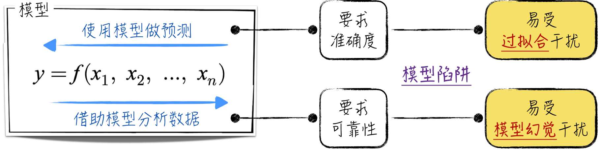
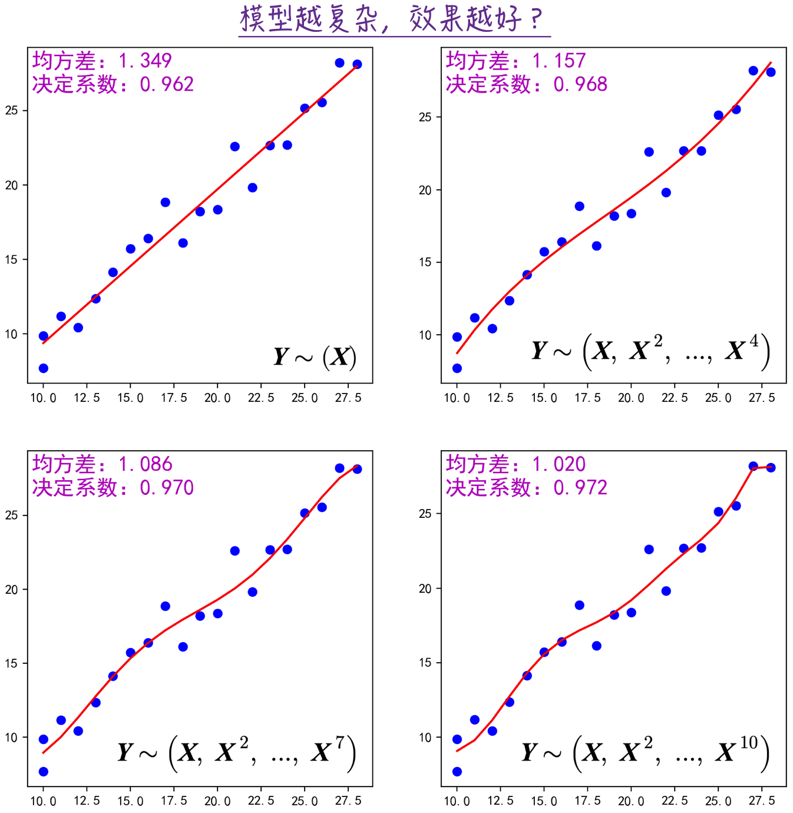
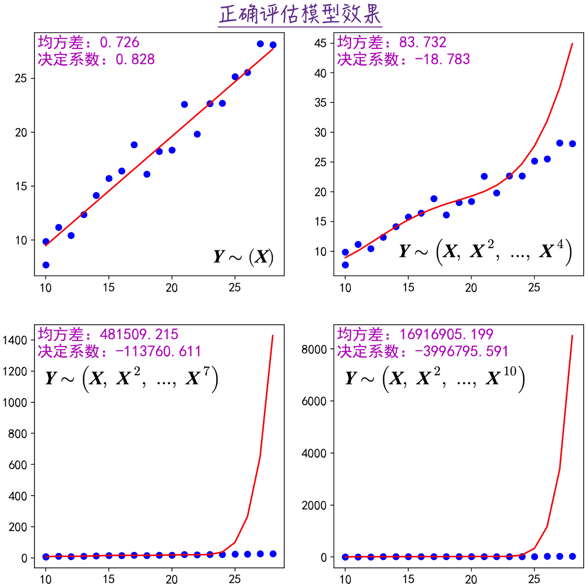
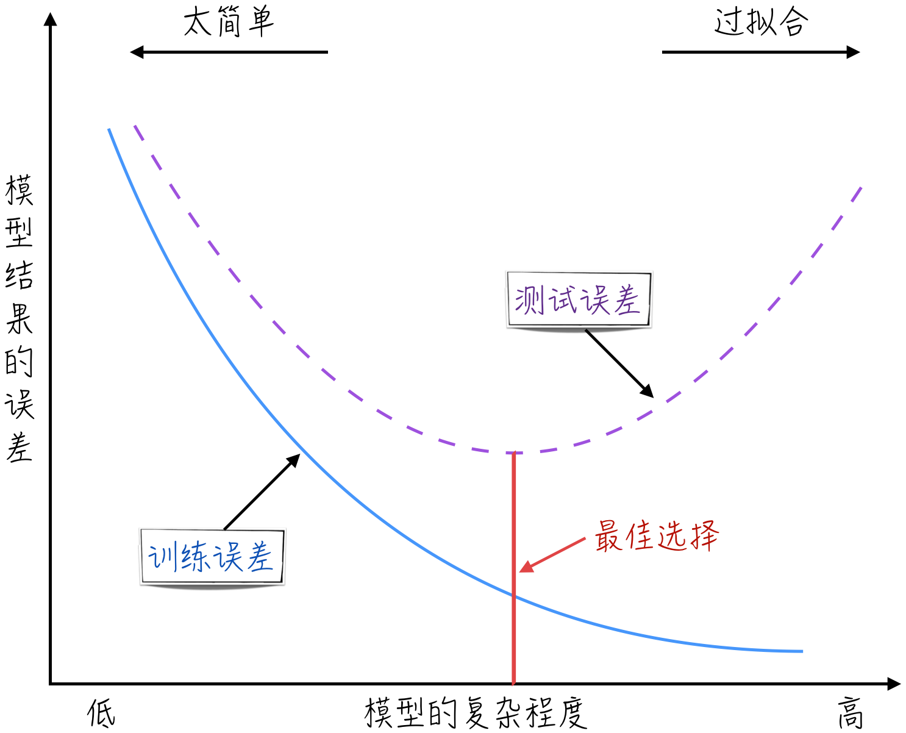
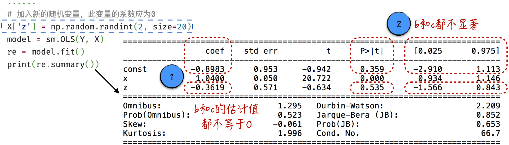
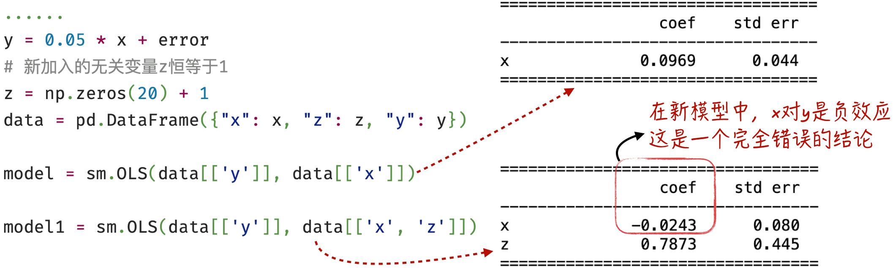
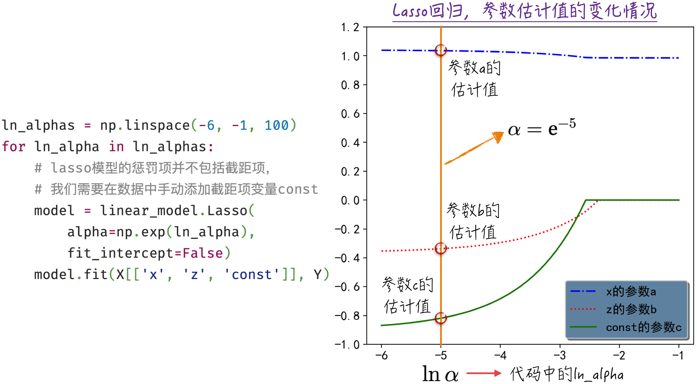
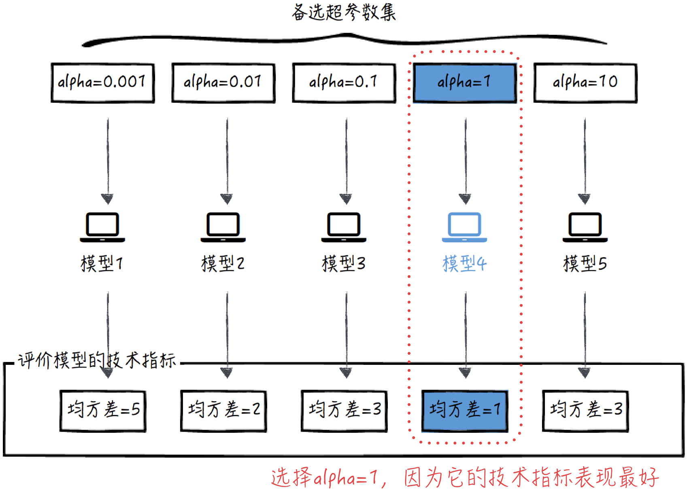
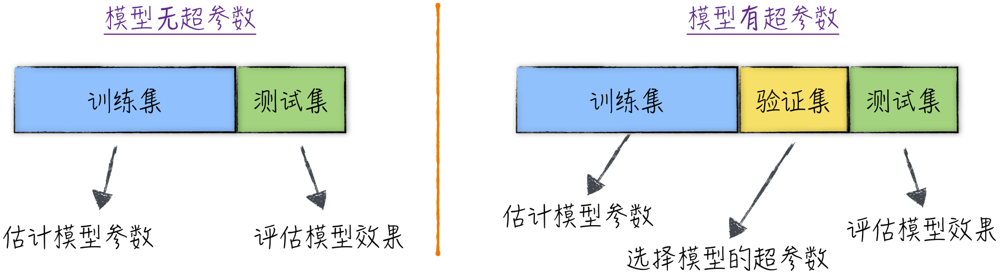

## 3.3 模型陷阱

在人工智能实践中，构建模型通常有两个主要目标：一是使用模型对未知数据进行预测；二是利用模型分析数据，揭示数据中的内在规律，为决策提供支持。针对这两种目标的实践通常会面临以下两类问题。

1. **模型预测不稳定**：数据科学家在模型搭建过程中会设定多种技术指标来评估模型的预测准确度。例如，3.1.1 节针对线性回归模型定义了均方差和决定系数等指标。这些指标在历史数据上的效果较好，使我们对模型的表现充满信心。然而，当真正用模型来预测未知数据时，我们却发现模型的表现远不如预期，有时甚至比随机猜测还差，这表示模型的预测效果并不稳定。
2. **参数估计值不可靠**：在人工智能领域，模型除用于预测外，对数据的解读与理解同样至关重要。在大数据时代，随着数据驱动理念的普及，公司决策逐渐倚重数据分析的结果，而非仅依赖领导的个人经验。然而，模型参数的估计值具有一定的随机性，偏差较大的参数可能导致我们错误地预测估计值和自变量之间的关联效应，严重影响数据分析结果的准确性。举例来说，在 3.2.1 节中，模型得出的玩偶生产成本为负数，这显然不符合实际情况。

这两类问题的产生有着各自的原因，可以采用特定的方法来避免发生这些问题。但在深入了解这些方法之前，先来探讨这两类问题产生的根源，如图 3-12 所示。

在模型构建过程中，为了提高预测的准确性，数据科学家通常会从已知特征中提取更多的新特征，以建立更复杂的模型。特别是随着深度学习概念的流行，即使面对的是相对简单的情境，人们也似乎越来越倾向于使用复杂模型。然而，模型越复杂，越容易陷入“自我误导、加强偏见”的陷阱，从而导致过拟合的问题。一旦出现过拟合，模型越复杂，其错误也会更显著。在这种情况下，当训练模型时，各项评估指标看似良好，但在实际应用中的表现却难以令人满意。

在大数据时代，我们获得了比以往更多的变量，这为搭建模型提供了更多的选择。在建模实践中，数据科学家会找寻新的自变量，并将它们纳入模型。然而，由于模型训练实质上是数学运算，即使毫不相关的变量被引入模型，也会得出相应的参数估计值，而这个估计值几乎不可能为 0。这导致了所谓的“模型幻觉”：看似获得了很多变量间的关联效应，但实际上这些效应并不存在，只是由随机变量引起的数字巧合。模型幻觉会导致分析结果不可靠，特别是对模型参数的分析不可靠。它不仅会误将不存在的效应估计为存在，更糟糕的是，新引入的变量有可能将原本相对正确的估计值扭曲为错误的，例如将模型中原有变量的正效应估计为负效应，相应参数估计值由正变为负。

过拟合和模型幻觉并非孤立的问题，相反，它们经常相互交织、相互强化，对模型的准确性和可靠性产生影响。针对这些问题，已经有一些成熟的解决方案。接下来将详细讨论这些解决方案。

### 3.3.1 过拟合：模型越复杂越好吗

尽管最初的建模数据只包含一个特征——玩偶个数 $\mathbf X=\{x_i\}$，但我们可以基于这个变量衍生出多个新特征。比如，使用最常见的多项式变换来提取新特征。具体来说，将原始数据 $\mathbf X$ 转换成一系列新特征 $(\mathbf X,\mathbf X^2,\dots,\mathbf X^n)$，并以它们为基础构建线性回归模型，如公式（3-13）所示。为了便于后续讨论，我们用记号 $\mathbf Y\sim(\mathbf X,\mathbf X^2,\dots,\mathbf X^n)$ 来表示模型。

$$
y_i=b+a_1x_i+a_2x_i^2+\cdots+a_nx_i^n
\tag{3-13}
$$

图 3-13 展示了模型的结果（[完整代码](https://github.com/GenTang/regression2chatgpt/blob/zh/ch03_linear/linear_overfitting.ipynb)）。从图 3-13 中的技术指标看，似乎随着特征数量的增加，模型表现越来越好。

然而，实际情况并非如此，最简单的模型却更接近实际情况。为什么会有这种现象呢？有以下两方面的原因。

- 从数学角度来看，引入一个新变量，原模型成为新模型的一个特例，即新变量的系数为 0。因此，对于同一组已知数据，新模型的拟合效果往往优于原模型。然而，模型在已知数据上的优异表现并不意味着它对未知数据有着同样准确的预测能力。
- 从数据角度来看，在实践中，通常利用已知的历史数据来训练模型，然后用训练好的模型对未来的数据（未知数据）进行预测。这意味着真正使用模型进行预测的数据在训练时并不可见。然而，在图 3-13 的案例中，我们使用所有数据来训练模型，然后使用同一组数据来评估模型的效果。换句话说，在模型训练期间，模型已经见过将用于评估的数据。这类似于让这些数据既扮演“裁判”的角色，又充当“运动员”，与实际情况严重不符。

这两个原因使我们陷入了过拟合的陷阱：模型被随机因素干扰，忽略了数据的真实内在规律，最终得出了错误的结论。

要确保正确评估模型效果，一种常见的做法是将用于训练模型和评估模型的数据分开。这意味着在训练模型时，我们不会使用评估模型的那部分数据，这样才能准确估计模型的效果。因此，在实践中，第一步通常是将数据分成两个部分：训练集（Train Set）和测试集（Test Set）。首先使用训练集来估计模型的参数，然后使用测试集来评估模型的效果，这一方法在学术界被称为交叉验证（Cross Validation）。如果对之前提到的模型采用类似的处理方法，最终得到的结果将如图 3-14 所示。这一结果与图 3-13 截然相反，表明最简单的模型实际上具有最佳效果，这才是正确的结论。

在人工智能领域，解决模型过拟合的问题是一项常见且至关重要的任务。为了更好地理解和应对这一问题，我们总结并提炼了上述例子的经验，使其能够更普遍地适用于各种情境。在学术上，将模型在训练集上的误差称为训练误差，在测试集上的误差称为测试误差。这两种误差与模型复杂度[^complexity]之间的关系如图 3-15 所示。实线表示模型的训练误差，虚线表示测试误差。

- 当模型过于简单时，无论是训练误差还是测试误差都会很大。这意味着过于简单的模型无法捕捉数据中的复杂关系。
- 相反，当模型过于复杂时，训练误差可能会很小，但测试误差却相对较大，这就是过拟合。过拟合比模型太简单更加危险，因为它具有欺骗性，很容易让人误以为模型的表现非常出色。

在构建模型时，这两种问题都可能导致模型的性能不佳，因此需要选择复杂度合适的模型，以最小化测试误差。

在实际的建模过程中，模型的复杂度通常受到模型幻觉的影响，这种幻觉会诱使数据科学家向模型中添加新特征，使模型变得更复杂。为了应对模型幻觉，统计学和机器学习分别提供了各自的解决方案。下面将详细讨论这些方案的细节。

### 3.3.2 假设检验：统计分析的解决方案

假设一个新的天气变量 $z_i$ 有两种可能取值：0 和 1。$z_i=1$ 表示晴天，$z_i=0$ 表示非晴天。天气情况也可能对制造玩偶的成本产生影响，例如，晴天时，工人的心情可能更好，这可能会提高玩偶制作的精度。因此，将这个变量添加到模型中，得到如下公式。

$$
y_i=ax_i+bz_i+c+\varepsilon_i
\tag{3-14}
$$

然而实际上，这个新引入的变量与生产成本并无关系，因为它是随机生成的，请参考图 3-16 虚线框中的代码（[完整代码](https://github.com/GenTang/regression2chatgpt/blob/zh/ch03_linear/linear_illusion_ci.ipynb)）。换言之，在这个模型中，参数 $b$ 的真实值应为 0。然而，模型训练的结果却如图 3-16 所示。尽管参数 $b$ 和 $c$ 的真实值都是 0，但模型的估计值却偏离了 0，并且相去甚远，这就是典型的“模型幻觉”。若仅凭参数的估计值，我们会错误地认为天气确实会影响玩偶的制作成本，可能会因此建议工厂在晴天时生产，以便降低生产成本约 36%。当然，这种建议毫无依据。倘若考虑变量的显著性，便能意识到需要排除不显著的变量，避免陷入模型幻觉的误区。

另外，正如前文所提及的，无关变量的引入可能扭曲原有的、相对正确的估计结果。下面通过一个简单的例子来直观地展示这一点。如图 3-17 左侧所示，变量 $x$ 和 $y$ 之间的真实关系是 $y_i=0.05x_i+\varepsilon_i$，其中 $\varepsilon_i$ 服从标准正态分布。现在引入一个与 $y$ 完全无关的变量 $z$，其始终等于 1。如果只使用 $x$ 对 $y$ 进行建模，得到的结果与真实模型相差不大。但如果同时使用 $x$ 和 $z$ 对 $y$ 进行建模，那么新模型中 $x$ 的系数会从正数变为负数。也就是说，根据新模型的结果，$y$ 和 $x$ 之间呈负相关性：随着 $x$ 的增加，$y$ 反而减少。这显然是一个完全错误的结论。就像之前的例子一样，借助统计学中的假设检验和置信区间，我们能够成功避免这些陷阱。

### 3.3.3 惩罚项：机器学习的解决方案

回顾 3.1.1 节，机器学习建模的核心在于定义损失函数。因此，在引入天气变量后（详见 3.3.2 节），模型的损失函数如下。

$$
L=\frac{1}{n}\sum_{i=1}^{n}(y_i-ax_i-bz_i-c)^2
\tag{3-15}
$$

模型幻觉的问题在于：真实值应为 0 的系数，例如 $b$ 和 $c$，其估计值却不接近于 0。鉴于这是由损失函数这一数学公式引起的缺陷，我们希望在数学上增加一种效应，使本应为 0 的参数估计值尽量接近 0。为了解决这一问题，学术界引入了一种称为惩罚项（或正则化项，Regularization）的机制。例如，在模型中引入 L1 惩罚项，将损失函数改写成如下形式。

$$
L=\frac{1}{n}\sum_{i=1}^{n}(y_i-ax_i-bz_i-c)^2+\alpha(|a|+|b|+|c|)
\tag{3-16}
$$

这里新增的 $(|a|+|b|+|c|)$ 就是惩罚项，其中，$\alpha$ 表示惩罚项的权重。当 $\alpha>0$ 时，惩罚项会随着 $a,b,c$ 绝对值的增加而增大。通俗来讲，模型的参数估计值越远离 0，惩罚项越大。因此，在估计参数时，也就是寻找 $L$ 的最小值时，这一项将迫使参数估计值接近 0。特别是对于不相关的变量，其对应的参数估计值趋向于 0 的速度更快。

加入 L1 惩罚项的线性回归模型又被称为 Lasso 回归。实现这一模型的代码相对简单（[完整代码](https://github.com/GenTang/regression2chatgpt/blob/zh/ch03_linear/linear_illusion_reg.ipynb)），如图 3-18 左侧所示。然而，需要注意的是，在 scikit-learn 的实现中，模型的损失函数与公式（3-16）略有不同，主要体现在两个方面：首先，惩罚项的权重略有变化，由 $\alpha$ 变为 $2\alpha$；其次，惩罚项中不包含截距项。因此，在搭建模型时需要稍做调整[^implementation-difference]。

惩罚项的权重会对模型参数的估计产生影响。如图 3-18 右侧所示，随着 $\alpha$ 的增大，图中使用 $\ln\alpha$ 作为横坐标，模型参数 $b$ 和 $c$ 的估计值逐渐靠近 0。当 $\alpha$ 较大时，例如 $\alpha=\mathrm e^{-2}$ 时，得到的结果就是比较“正确”的参数估计值。

除了 L1 惩罚项，常用的还有 L2 惩罚项，即模型参数的平方和。这两种惩罚项几乎没有竞争关系，实际上它们经常结合在一起使用[^regularization-models]。然而，鉴于篇幅所限，本章仅讨论 L1 惩罚项。

从上面的例子可以观察到，参数 $\alpha$ 的取值影响对模型参数 $a,b,c$ 的估计，但它本身并非模型的一部分。因此，有必要将这两者区分对待。在学术上，$a,b,c$ 被称为参数（Parameter），而 $\alpha$ 被称为超参数（Hyperparameter）。超参数通常被分为两类：一类是像 $\alpha$ 这种用于调整模型的结构；另一类是工程实现上的超参数，详见[ 6.4 节](/books/deconstructing_LLM/chapter-6/6-4)。

超参数与参数的估计方式存在明显的不同。一般情况下，参数的估计值是通过最优化算法来确定的，有关细节请参考第 6 章；对超参数的估计则相对更加灵活，允许数据科学家有更大的调整空间。在实际应用中，常使用网格搜索（Grid Search）方法来确定超参数。该方法首先预先设定一系列可能的超参数值，这些值取决于数据科学家的个人偏好和经验，作为备选超参数集；然后，对这些给定的超参数集进行遍历，评估相应模型的性能，并从中选择表现最佳的超参数。以上述模型为例，整个过程如图 3-19 所示。

3.3.1 节中探讨了一种防止过拟合的方法——交叉验证。这种方法将数据集分为两部分：训练集和测试集。训练集用于估计模型参数，测试集用于评估模型效果。然而，当在模型中引入了超参数时，上述做法就不再适用了。如果仍然将数据分为训练集和测试集，则意味着要使用训练集来估计参数，然后根据测试集上的模型效果选择超参数。换言之，原本用于评估模型的测试集被误用于选择模型的超参数。这样一来，在训练模型时，本应该被隔离的测试数据变成了部分可见的，导致模型效果被高估，从而产生过拟合问题。

为了避免这一问题，需要确保在选择超参数时测试数据是不可见的，因此将数据分为三部分：训练集（Train Set）、验证集（Validation Set）和测试集（Test Set）。其中，训练集用于估计模型参数，验证集用于选择模型的超参数，而测试集则用于评估模型的最终效果。整个过程如图 3-20 所示。

### 3.3.4 比较两种方案

上面讨论的假设检验和引入惩罚项都是解决模型幻觉问题的有效方法。然而，这两种方法各有其显著的优缺点。

- 假设检验在数学上更严谨，拥有一系列的理论支持。它能够完全排除不相关变量的干扰。但正如前述示例所示，该方法需要相当程度的人为干预，无法做到完全自动化。此外，它还有一个很重要的限制，那就是只对少数几个简单的模型有效。对于复杂的模型，例如神经网络等，假设检验方法几乎没有施展空间，因为针对过于复杂的模型，我们难以分析模型参数的分布情况。
- 相比之下，引入惩罚项是更自动化的解决方案，适用于几乎所有模型。然而，其缺点在于缺乏牢固的理论基础，导致对结果的解释性较差，因此难以用通俗的语言向非技术人员解释这个方法。

在实际应用中，如果需要对数据进行建模并通过模型分析数据，假设检验可能更合适，可以通过其分析过程更好地理解变量之间的关联效应。如果是用于预测或将模型工程化以实现自动触发和学习，那么惩罚项更合适。

[^complexity]: 模型复杂度不仅取决于结构的复杂程度，还与所使用的特征个数相关。在本例中，即使是结构简单的线性回归模型，也可以通过增加特征而变得过于复杂。
[^implementation-difference]: 不同的开源工具在模型定义和实现方面可能会略有不同，因此在使用这些工具之前，仔细阅读相关文档是至关重要的，可以避免产生偏差。
[^regularization-models]: 加入 L1 惩罚项后，对应的模型在学术上被称作 Lasso 回归。如果为线性回归模型加入 L2 范数惩罚项，则对应的模型在学术上被称为 Ridge 回归。若模型同时使用 L1 和 L2 惩罚项，则被称为 ElasticNet 回归。关于这两种回归的差异，这里不做过多讨论。需要指出的是，Lasso 回归更容易获得稀疏（Sparse）解，即只有少量模型参数不等于 0；Ridge 回归则更倾向于获得接近于 0 但非 0 的参数估计值。
