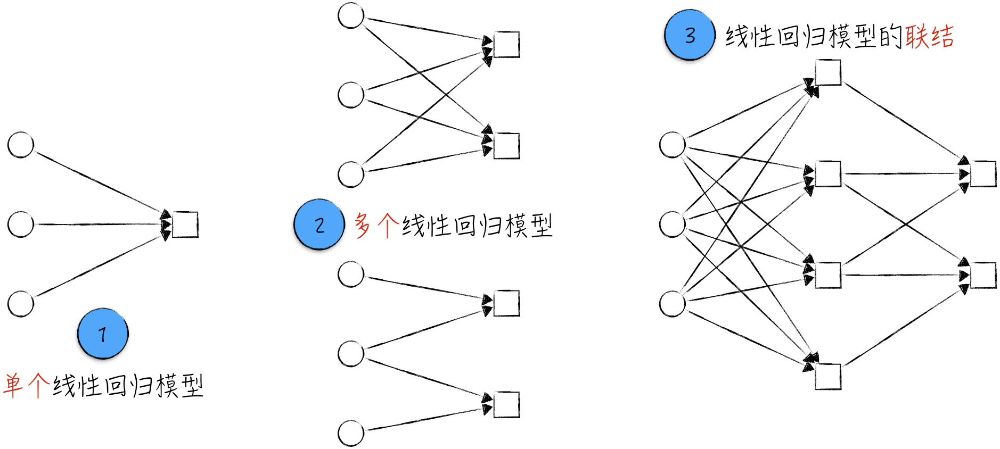
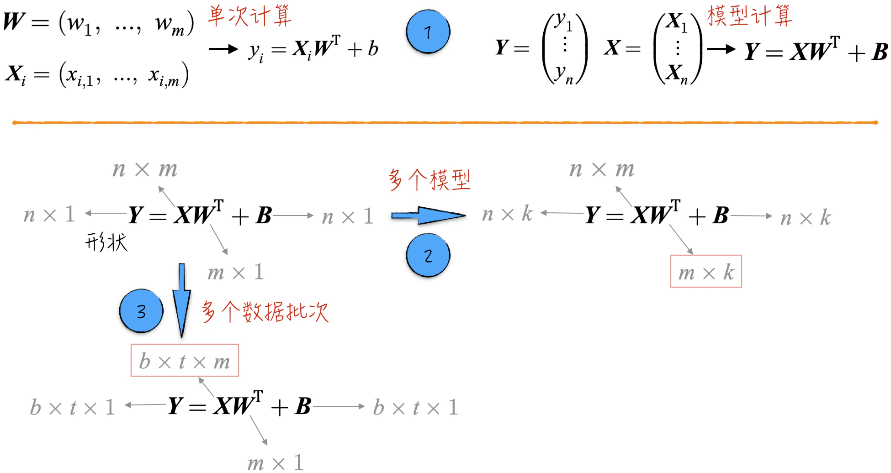
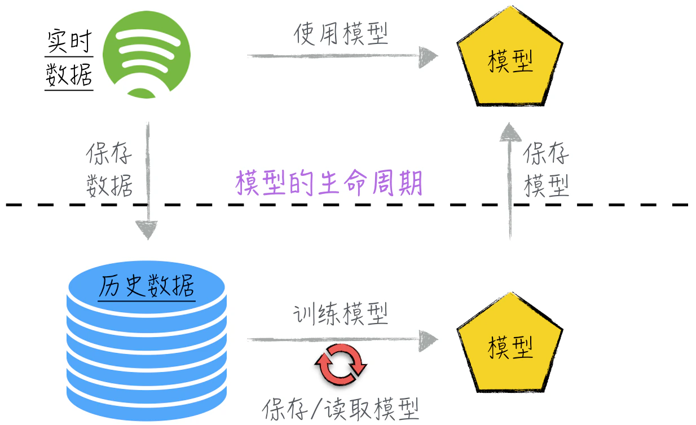

## 3.4 面向未来的准备

在人工智能领域，线性回归模型可以独立对数据建模，这也是前面章节讨论的重点。然而，更常见的应用方式是将线性回归模型作为“模型骨架”，搭建出更复杂的模型，例如深度神经网络。为了更好地理解复杂模型，我们需要高效且清晰地表达其中的线性部分。因此，本节将对此进行相关的准备工作，首先讨论线性回归模型的图示和数学表达。

正如前文所示，即使是简单的线性回归模型，其构建和训练过程也并不简单。接下来会涉及更复杂的模型，在构建和训练过程中耗时更多，需要大量的资源投入。因此，在模型训练完成后，我们希望能像保存普通程序一样，妥善保存训练好的模型，以备将来使用。这个过程涉及模型的持久化和生命周期管理，将是本节讨论的另一个话题。

### 3.4.1 图形表示与数学表达

之前的章节中一直使用像 $y=ax+b$ 这样的数学公式来描述线性回归模型。这种表达方式有助于初学者理解，能避免一开始就接触复杂的数学表达式，但即便对于最简单的单个线性回归模型，这种表达方式都显得有些烦琐和低效。当涉及复杂模型时，由于模型中可能包含数千个线性模型，高效的数学表达尤为重要。高效的数学表达不仅有助于深入理解模型结构，还为处理复杂问题提供了更便捷的分析工具。因此，接下来将介绍线性模型的图形化表示，以及如何使用矩阵运算，或更一般的张量运算，来表示大量的线性回归模型。

- 图 3-21 中的标记 1 展示了实践中常用的线性模型图示法：使用圆圈、箭头和方框来表达模型中的不同元素。其中，圆圈代表特征（自变量），箭头表示权重项和特征的乘积，方框代表加总和截距项。
- 当使用相同的一组变量构建多个线性回归模型时，相应的图示如标记 2 所示。若不同的线性模型使用了不同的变量，应该如何表示呢？其实非常简单，将所有使用的变量合并在一起即可。如果某个模型没有使用某个变量，则将相应的箭头去掉，如标记 2 的下半部分所示。
- 需要注意的是，图中的圆圈和方框实际上没有本质区别，因为线性回归模型的输入也可以是其他模型的输出。如标记 3 所示，可以将线性模型联结起来使用。然而，细心的读者可能立即就会注意到这种联结方式的作用不是很大，因为多个线性回归模型的联结结果仍然是一个线性回归模型[^linear-composition]。

图形化的表达方法实际上是从逻辑角度来理解线性模型，因为这些图示展示了特征的数量，却没有呈现数据的数量。接下来将探讨如何利用张量运算，从计算的角度来描述模型。当线性模型应用于单个数据点时，使用行向量来表示特征和模型参数。这样，模型的计算被表示为向量的乘法，行向量的形状为 $(1,m)$。将这种表示方法推广到 $n$ 个数据点时，使用形状为 $(n,m)$ 的张量来表示数据。如图 3-22 中标记 1 所示，多个数据的模型计算被简明地表示为一次张量乘法运算。

在涉及 $k$ 个模型的情况下，可以将模型参数张量表示为形状为 $(k,m)$ 的张量。这样就能清晰地表示多个模型在多个数据点上的运算，如图 3-22 中标记 2 所示。此外，根据需求，还可以增加张量的维度。以图 3-22 中标记 3 为例，若模型的输入分为多个批次，可以将数据表示为形状为 $(b,t,m)$ 的张量。在这个张量中，第一个维度的大小 $b$ 代表批次的数量，第二个维度的大小 $t$ 表示每个批次所含的数据量。对模型参数，也可以采取类似的操作。

线性模型和张量的矩阵乘法是相互对应的，如果在复杂模型的数学表达中看到了张量的矩阵乘法，我们需要理解：在模型的这一部分，实际上是在使用线性回归模型。

### 3.4.2 模型的生命周期与持久化

在模型的生命周期中，可以明显区分出两个关键阶段：模型训练和模型使用。首先，在一个数据建模项目中，历史数据通常被存储在离线数据系统中。基于这些历史数据，我们将搭建并训练模型，并保存训练好的模型[^checkpoint]。当新数据出现时，例如实时从系统收集的数据，保存的模型被用于对新数据进行预测或分析。这些新数据本身也会被存储为新的历史数据，并被纳入离线数据系统。随着时间的推移和数据的积累，会再次启动模型的训练，并根据需求替换线上系统的模型。

模型的生命周期是一个不断循环、持续更新的过程，正如图 3-23 所示。在这个过程中，模型的保存和读取是极为关键的步骤。

在保存模型时，需要考虑两个关键部分：保留模型的结构和保存对应的参数估计值。模型的结构通常相当复杂，因此手动保存和读取模型是十分困难的。通常情况下，我们会依赖训练模型的第三方工具，这些工具大多都提供了保存模型的便捷方式。采用第三方工具的优势在于代码实现相对简单，但也导致很难将训练好的模型迁移到其他平台或工具上，从而限制了模型的通用性[^pmml]。

各种工具的模型保存方案各有不同，这里不会逐一介绍。建议读者查阅相关的官方文档以获取更多信息。

[^linear-composition]: 数学上很容易证明，线性模型和张量的矩阵乘法实际上是相互对应的。这是因为张量的矩阵乘法满足乘法结合律和分配律，因此，线性模型的联结仍然保持线性。
[^checkpoint]: 在实际的建模过程中，由于复杂模型的训练非常耗时，因此通常会在训练过程中保存模型。这样做可以避免在训练失败时重新开始整个训练过程。
[^pmml]: 预测模型标记语言（Predictive Model Markup Language，PMML）是一个专注于模型保存的开源项目。该项目与具体的编程语言无关，允许模型在不同语言之间进行保存和读取，例如，使用 Python 构建模型，然后使用 Java 读取该模型。需要注意的是，这个项目支持的模型种类并不是很多，所以它的实际应用并不广泛。
