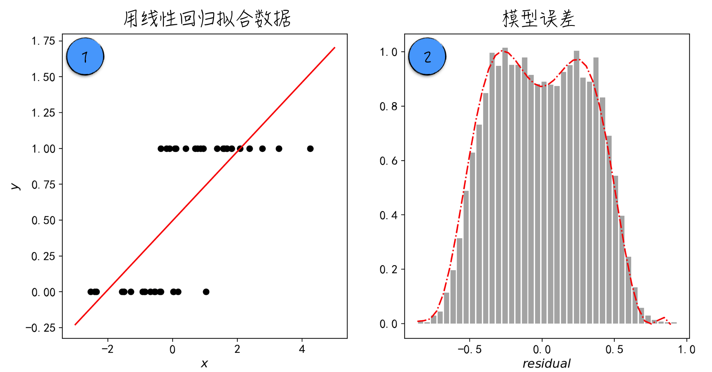
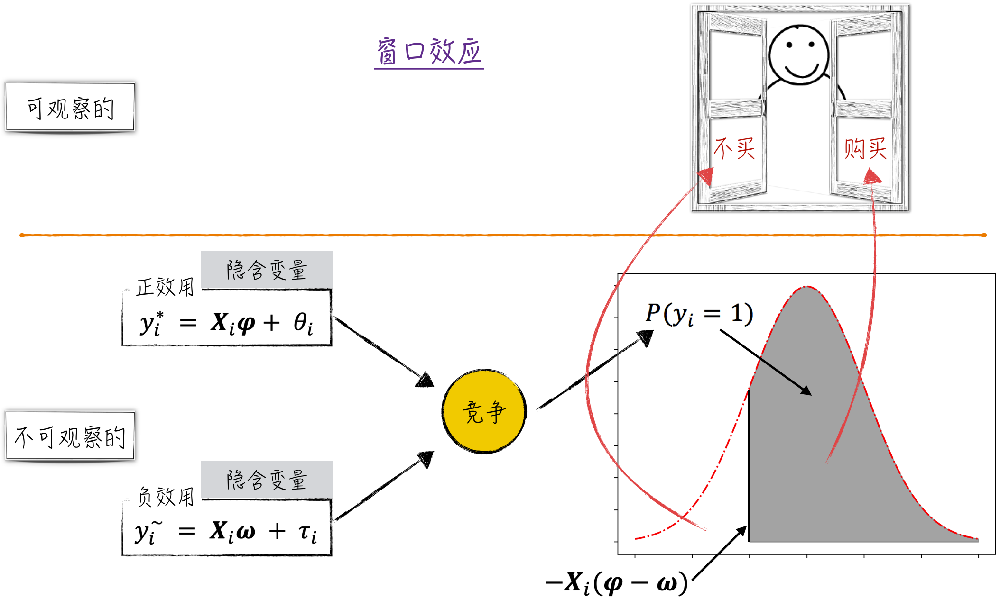
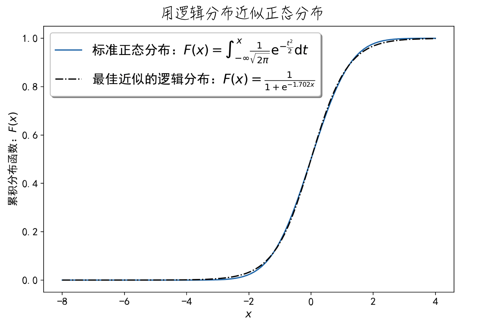
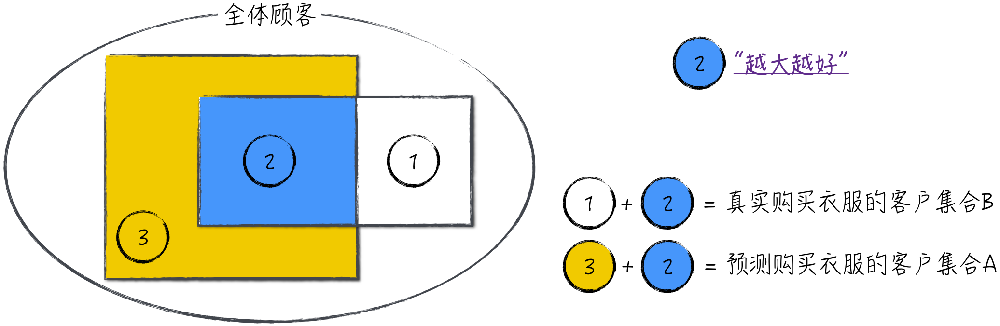
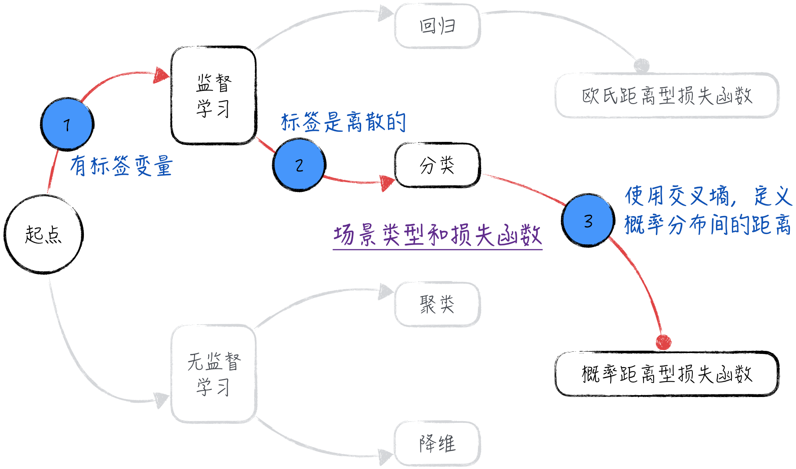

## 4.1 二元分类问题：是与否

在日常生活中，我们经常遇到各种二元选择的场景。例如，我们在购物时看到一件衣服，决定是否购买便是一个二元选择问题。分析二元选择的情景具有极高的价值。想象一下，假如一家电商平台能够通过搭建模型，较准确地预测客户购买某件衣服的可能性，那么该平台就可以根据模型结果，主动向可能感兴趣的客户推荐相关产品。这项技术不仅提升了用户体验，也直接增加了电商平台的销售额。这种精准推荐的能力是许多互联网公司的核心竞争力，对其商业模式也具有极其重要的意义。

对于二元选择问题，应该如何搭建模型呢？第 3 章中介绍的线性回归模型是否能够解决这些问题呢？很遗憾，答案是否定的。从模型的角度来看，二元选择问题属于分类问题（例如将客户分为购买和不购买两类），与第 3 章中讨论的回归问题明显不同，线性回归模型并不能有效解决这些分类问题。为了更清晰地说明这一点，下面继续讨论购买衣服这个简单的例子。

### 4.1.1 线性回归：为何失效

为购买衣服的场景设计一个数据集，包含两个变量：一个是自变量 $\{x_i\}$，另一个是因变量 $\{y_i\}$。其中，$\{x_i\}$ 表示收入，$\{y_i\}$ 表示是否购买。购买与否只有两种可能性，因此使用 0 表示不购买，1 表示购买。这意味着 $y_i$ 不是连续的数值，而是离散的数值。将数据绘制在坐标系中，得到的图像如图 4-1 中的标记 1 所示（[完整代码](https://github.com/GenTang/regression2chatgpt/blob/zh/ch04_logit/logit_example.ipynb)）。从图 4-1 中可以直观地发现，数据并不能很好地被拟合成一条直线。

如果用线性回归对这些数据建模，得到的模型如下：

$$
y_i=ax_i+b+\varepsilon_i
\tag{4-1}
$$

其中，$\varepsilon_i$ 是一个随机变量，它服从期望为 0、方差为 $\sigma^2$ 的正态分布，记为 $\varepsilon_i\sim N(0,\sigma^2)$。这是线性回归模型中一个重要但常常被人忽视的假设。

如果用公式（4-1）所示的线性回归模型去学习这些数据，得到的模型如图 4-1 中的实线所示。然而，模型预测值与真实值之间存在较大误差，表现并不理想。此外，模型的预测结果似乎有些令人难以理解：根据设定，$y_i$ 的值表示一种选择，因此只能是 0 或 1 两个值。然而，模型的预测值覆盖整个实数集，这会令人困惑。例如，对某个 $y_i$ 的预测值为 0.73，这表示什么意思呢？

更重要的是，如果绘制模型误差（$\varepsilon_i$ 的观测值）的分布图，会发现其并不呈现正态分布。模型误差的分布如图 4-1 中的标记 2 所示。模型误差看起来似乎呈现双峰分布，而正态分布却是单峰分布。更严谨的数学推导可以证明，这里得到的模型误差的分布确实不符合正态分布[^linear-assumptions]。

这是一个严重的问题，因为使用线性回归模型时，实际上做了以下 3 个假设（尽管实际上还有更多的假设，但这里只讨论最基本的 3 个）。

1. 因变量 $\{y_i\}$ 和自变量 $\{x_i\}$ 之间满足线性关系。
2. 自变量 $\{x_i\}$ 与干扰项 $\varepsilon_i$ 相互独立。
3. 未被线性模型捕捉到的随机因素 $\varepsilon_i$ 服从正态分布。

然而，模型误差的分布情况却表明第 3 个假设并不成立。换言之，数据不符合模型的假设，从而导致模型的预测效果不佳。

验证数据是否符合模型的假设是搭建模型时至关重要的一步。通常情况下，模型计算对数据的要求并不苛刻：几乎任何数据都可以对模型进行训练，而经过训练的模型就可以进行预测[^random-parameters]。那如何确保模型的预测效果呢？有效的方法是不断验证数据是否符合模型的假设。如果数据符合这些假设，那么模型的效果通常会很好；反之，就无法保证模型的效果。就像在本例中，若忽视模型的假设而强行建模，往往会得到一个“错误且无用”的模型。

既然线性模型不适用于分类场景，那应该如何搭建模型呢？

### 4.1.2 窗口效应：看不见的才是关键

在分析二元选择时，常常会遭遇“窗口效应”。这是因为作为外部观察者，我们只能看到最终的选择结果，却难以洞察结果背后的一系列隐藏因素，而这些隐藏因素决定了最终的选择。下面以客户购买衣服为例，详细分析这一效应。

对客户来说，购买衣服一方面能带来快乐，因为新衣能满足客户的某些需求，比如改善形象或保暖等；另一方面，购买衣服也会带来一定程度的困扰，比如需要支付一笔开销。客户在选购衣物时，会综合考虑这两方面的因素，最终决定是否购买。例如，当客户认为所获得的满足感多于因价格而带来的困扰时，就会选择购买。从经济学的角度来看，购买行为会产生正效用和负效用两种影响。当正效用大于负效用时（购买带来的整体效用为正），客户会选择购买；反之则不会。

将上述描述转化为模型的语言。假设自变量 $\mathbf X_i=(x_{i,1},x_{i,2},\cdots,x_{i,k},1)$ 决定了客户 $i$ 购买衣服的效用[^intercept]，包括使客户快乐的正效用 $y_i^*$ 和使客户烦恼的负效用 $\tilde y_i$。将客户的购买行为记为 $y_i$，其中，$y_i=1$ 表示客户 $i$ 购买了衣服；$y_i=0$，则表示客户 $i$ 没有购买衣服。因此有如下的公式：

$$
\begin{aligned}
y_i^*&=f(\mathbf X_i),\qquad \tilde y_i=g(\mathbf X_i)\\
y_i&=
\begin{cases}
1,&y_i^*>\tilde y_i\\
0,&y_i^*\leq \tilde y_i
\end{cases}
\end{aligned}
\tag{4-2}
$$

进一步假设，正效用和负效用都与自变量是线性关系。具体地，假设 $\boldsymbol\varphi=(\varphi_1,\varphi_2,\cdots,\varphi_k,\varphi_{k+1})^{\mathrm T}$、$\boldsymbol\omega=(\omega_1,\omega_2,\cdots,\omega_k,\omega_{k+1})^{\mathrm T}$ 为模型参数，则有：

$$
\begin{aligned}
y_i^*&=\mathbf X_i\boldsymbol\varphi+\theta_i\\
\tilde y_i&=\mathbf X_i\boldsymbol\omega+\tau_i
\end{aligned}
\tag{4-3}
$$

其中，$\theta_i,\tau_i$ 是相互独立的随机变量，且都服从正态分布。令 $z_i=y_i^*-\tilde y_i$、$\boldsymbol\gamma=\boldsymbol\varphi-\boldsymbol\omega$ 以及 $\varepsilon_i=\theta_i-\tau_i$（注意：$\varepsilon_i$ 也服从正态分布，因为 $\theta_i,\tau_i$ 相互独立），得到：

$$
\begin{aligned}
z_i&=\mathbf X_i\boldsymbol\gamma+\varepsilon_i\\
y_i&=
\begin{cases}
1,&\mathbf X_i\boldsymbol\gamma+\varepsilon_i>0\\
0,&\text{其他}
\end{cases}
\end{aligned}
\tag{4-4}
$$

进一步可以得到：

$$
\begin{aligned}
P(y_i=1)&=P(z_i>0)=P(\varepsilon_i>-\mathbf X_i\boldsymbol\gamma)\\
P(y_i=1)&=1-P(\varepsilon_i\leq-\mathbf X_i\boldsymbol\gamma)=1-F_\varepsilon(-\mathbf X_i\boldsymbol\gamma)
\end{aligned}
\tag{4-5}
$$

其中，$F_\varepsilon$ 是随机变量 $\varepsilon$ 的累积分布函数，而 $P(y_i=1)$ 表示客户购买的概率。公式（4-5）对应的模型在学术上被称为 Probit 回归（注意：虽然这个模型的名称中包含“回归”两个字，但它解决的是分类问题）。整个过程可以近似表示为图 4-2。

在搭建模型的过程中，我们假设了一些无法直接观测的变量：$y_i^*$ 和 $\tilde y_i$。因此，这类模型被称为隐含变量模型（Latent Variable Model），而 $y_i^*$ 和 $\tilde y_i$ 被称为隐含变量（Latent Variable）。

尽管 Probit 回归在数学上非常优雅，但遗憾的是，由于正态分布的累积分布函数没有解析表达式[^normal-cdf]，导致 Probit 回归模型的参数估计相对困难，限制了它的应用。为了使该模型更易于使用，需要做一些近似处理，以使其在数学上更加简洁。

### 4.1.3 逻辑分布

根据公式（4-5），Probit 回归近似处理的关键是对正态分布的累积分布函数 $F_\varepsilon(x)$ 做近似。为此，假设随机变量 $\varepsilon$ 的期望为 $\mu$、方差为 $\sigma^2$，并定义函数 $\phi(x)$ 为标准正态分布的累积分布函数。数学上不难证明：

$$
F_\varepsilon(x)=\phi\left(\frac{x-\mu}{\sigma}\right)
\tag{4-6}
$$

这说明正态分布在线性变换下保持稳定，所以只需对标准正态分布进行近似即可。研究人员发现逻辑分布可以很好地近似正态分布，具体效果如图 4-3 所示[^normal-logit]。可以看到，正态分布的累积分布函数与逻辑分布的累积分布函数几乎相同。

标准逻辑分布的概率密度函数是 $f(x)=e^{-x}/(1+e^{-x})^2$，对应的累积分布函数如下：

$$
S(x)=\frac{1}{1+e^{-x}}
\tag{4-7}
$$

公式（4-7）所示的函数在学术上通常称为 Sigmoid 函数，被广泛应用在人工智能领域。Sigmoid 函数的图像呈 S 形状，因此也被称为 S 函数。基于以上分析可得，当两种不同的效用相互竞争时（假定它们都满足线性回归模型的假设），某一方获胜的概率分布在数学上可以近似为 Sigmoid 函数，近似形式如公式（4-8）所示。换言之，Sigmoid 函数描述了某一方在竞争中获胜的概率。

$$
F_\varepsilon(\sigma x+\mu)=\phi(x)\approx S(-1.702x)
\tag{4-8}
$$

由公式（4-5）和公式（4-8）推导可得公式（4-9）[^logistic-assumption]，其中的两个式子实际上是等价的。与 3.4.1 节中的讨论类似，第一个式子表示客户 $i$ 的购买概率，而第二个式子以矩阵的形式展示了所有客户的购买概率。其中，$\mathbf X_i=(x_{i,1},x_{i,2},\cdots,x_{i,k},1)$ 表示客户 $i$ 的特征，$\boldsymbol\beta=(\beta_1,\beta_2,\cdots,\beta_k,\beta_{k+1})^{\mathrm T}$ 为模型参数。

$$
\begin{aligned}
P(y_i=1)&=\frac{1}{1+e^{-\mathbf X_i\boldsymbol\beta}}\\
P(\mathbf Y=1)&=\frac{1}{1+e^{-\mathbf X\boldsymbol\beta}}
\end{aligned}
\tag{4-9}
$$

公式（4-9）呈现的是逻辑回归（Logit Regression）模型。它与 Probit 回归类似，虽然名字中包含“回归”，但实际上是一种分类模型[^model-name]。对公式（4-9）进行变换，可以得到更加有趣的公式：

$$
\ln\frac{P(y_i=1)}{1-P(y_i=1)}=\mathbf X_i\boldsymbol\beta
\tag{4-10}
$$

在统计学中，$P/(1-P)$ 被称为发生比（Odds），它表示事件发生与不发生的比值。因此，根据公式（4-10），逻辑回归模型假设：事件发生比的对数是线性模型。这也是逻辑回归模型的一种简化解释。

### 4.1.4 似然函数：统计分析的参数估计

站在统计学的角度，为了估计模型参数，需要定义一个合理的参数似然函数，然后根据这个函数推导出模型参数估计值的表达式。这一过程与处理线性回归模型相似。

由于被预测值 $y_i$ 是离散的，取值是 1 或者 0，根据模型假设，$y_i$ 的概率分布函数可以写为

$$
\begin{aligned}
P(y_i)&=P(y_i=1)^{y_i}P(y_i=0)^{1-y_i}\\
\ln P(y_i)&=y_i\ln P(y_i=1)+(1-y_i)\ln[1-P(y_i=1)]
\end{aligned}
\tag{4-11}
$$

由于 $y_i$ 之间相互独立，所以 $P(\mathbf Y)=\prod_iP(y_i)$。再根据公式（4-9）中的第一个式子，可以推导出参数 $\boldsymbol\beta$ 的似然函数 $L$：

$$
\begin{aligned}
h(\mathbf X_i)&=\frac{1}{1+e^{-\mathbf X_i\boldsymbol\beta}}\\
L=P(\mathbf Y\mid\boldsymbol\beta)&=\prod_i h(\mathbf X_i)^{y_i}[1-h(\mathbf X_i)]^{1-y_i}
\end{aligned}
\tag{4-12}
$$

为了运算方便，通常对公式（4-12）中定义的似然函数取对数。这样，根据最大似然估计法，可以得到参数估计值的表达式：

$$
\begin{aligned}
\hat{\boldsymbol\beta}
&=\underset{\boldsymbol\beta}{\operatorname{argmax}}\,L
=\underset{\boldsymbol\beta}{\operatorname{argmax}}\,\ln L
=\underset{\boldsymbol\beta}{\operatorname{argmax}}\,\ln P(\mathbf Y\mid\boldsymbol\beta)\\
\hat{\boldsymbol\beta}
&=\underset{\boldsymbol\beta}{\operatorname{argmax}}
\sum_i\left\{y_i\ln h(\mathbf X_i)+(1-y_i)\ln[1-h(\mathbf X_i)]\right\}
\end{aligned}
\tag{4-13}
$$

### 4.1.5 损失函数：机器学习的参数估计

站在机器学习的角度，针对二元选择问题，我们期望模型所预测的标签（是/否）与真实值越接近越好。以购买衣服为例，用数学语言描述为：假定模型预测将购买衣服的客户集合定义为 $A$，而实际购买衣服的客户集合为 $B$，我们期望 $A$ 与 $B$ 的交集“越大越好”（但是真的越大越好吗？4.3.1 节将深入讨论此问题），如图 4-4 所示。

基于这种思路，直接定义一个数学上易处理的损失函数并不容易（不难看出，直接定义的损失函数不可导）。因此，借鉴统计学中的方法，定义如下形式的损失函数：

$$
LL=-\frac{1}{n}\sum_{i=1}^{n}\left[y_i\ln h(\mathbf X_i)+(1-y_i)\ln(1-h(\mathbf X_i))\right]
\tag{4-14}
$$

在学术界，公式（4-14）被称为交叉熵（Cross Entropy），它可以被理解为两个概率分布之间的距离[^kl-divergence]（交叉熵越小，表示两个概率分布越相似）。至此，我们完成了机器学习中的场景分析和损失函数的定义，具体的结果如图 4-5 所示。

通过最小化损失函数，就可以得到模型参数的估计值。具体的结果与公式（4-13）非常相似，相关细节在此不再赘述。

在实际应用中，为了防止过拟合，通常会在逻辑回归的损失函数（公式（4-14））中添加惩罚项。这些常见的惩罚项包括 L1 范数，即模型参数的绝对值之和；以及 L2 范数，即模型参数的平方和。具体细节类似于线性回归模型，可以参考 3.3.3 节。

### 4.1.6 最终预测：从概率到类别

根据公式（4-13），可以得到模型参数的估计值 $\hat{\boldsymbol\beta}$。将这个估计值代入公式（4-9），就可以得到客户购买衣服的概率（模型预测概率），即

$$
\hat P(y_i=1)=\frac{1}{1+e^{-\mathbf X_i\hat{\boldsymbol\beta}}}
\tag{4-15}
$$

然而，这只是对概率的预测，而我们最感兴趣的是对客户行为的预测，因此这两者之间还有最后一步。考虑到这是一个二元选择问题，一般情况下，当 $\hat P(y_i=1)>\hat P(y_i=0)$ 时，$\hat P(y_i=1)>0.5$，预测客户会购买衣服是合情合理的。因此，最终的模型结果可以表达为

$$
\hat y_i=
\begin{cases}
1,&\dfrac{1}{1+e^{-\mathbf X_i\hat{\boldsymbol\beta}}}>0.5\\
0,&\text{其他}
\end{cases}
\tag{4-16}
$$

当然，在某些特定情况下，可能需要手动设定一个阈值 $\alpha$，只有当 $\hat P(y_i=1)>\alpha$ 时，才能预测客户会购买衣服。这一部分的详细讨论见 4.3 节。

[^linear-assumptions]: 这里给出严谨的数学推导。为了书写方便，用矩阵的形式表示模型。假设模型中有 $k$ 个自变量分别为 $x_1,x_2,\cdots,x_k$；因变量为 $y$；随机扰动项为 $\varepsilon$。令 $\mathbf X_i=(x_{i,1},x_{i,2},\cdots,x_{i,k},1)$，$\boldsymbol\beta=(a_1,a_2,\cdots,a_k,b)^{\mathrm T}$，其中，$i$ 表示第 $i$ 组数据。模型可以表示为 $y_i=\mathbf X_i\boldsymbol\beta+\varepsilon_i$。根据假设，$\mathbf X_i$ 与 $\varepsilon_i$ 相互独立，则 $P(\varepsilon_i\mid\mathbf X_i)=P(\varepsilon_i)$。也就是说，给定一个 $\mathbf X_i$，$\varepsilon_i$ 也是服从正态分布的。但根据模型公式：$\varepsilon_i=y_i-\mathbf X_i\boldsymbol\beta$，即 $\varepsilon_i=0-\mathbf X_i\boldsymbol\beta$ 或者 $\varepsilon_i=1-\mathbf X_i\boldsymbol\beta$。这表示给定一个 $\mathbf X_i$ 后，$\varepsilon_i$ 只可能取两个值。这显然不符合正态分布。
[^random-parameters]: 实际上，只要模型的参数被赋予数值，哪怕是随机生成的，该模型也能进行预测。然而在这种情况下，我们无法保证预测结果的准确性。
[^intercept]: 在自变量中添加常量 1 的目的是省去截距项，简化线性回归模型的数学表达式，使数学推导过程更简洁。
[^normal-cdf]: 假设随机变量 $\varepsilon$ 服从期望为 $\mu$、方差为 $\sigma^2$ 的正态分布，则累积分布函数为 $F_\varepsilon(x)=\frac{1}{\sqrt{2\pi\sigma^2}}\int_{-\infty}^{x}e^{-\frac{(t-\mu)^2}{2\sigma^2}}\,\mathrm dt$。这个函数没有解析表达式。
[^normal-logit]: 图像的具体实现请参考[完整代码](https://github.com/GenTang/regression2chatgpt/blob/zh/ch04_logit/normal_logit_approx.ipynb)。图中公式来自 Bowling, S. R., etc. 2009. *A logistic approximation to the cumulative normal distribution*. *Journal of Industrial Engineering and Management*, 2(1), 114–127。
[^logistic-assumption]: 如果在公式（4-4）中直接假设随机变量 $\varepsilon$ 服从逻辑分布，也可以得到公式（4-9）。但是在笔者看来，这样假设显得很随意，理论基础不牢，而且还漏掉了两种效用的竞争过程和对 Sigmoid 函数的理解。这并不是很好的建模方式。
[^model-name]: 这两种模型的命名在历史上具有一些特殊原因。生物学家 Chester Ittner Bliss 在 1934 年首次提出 Probit 模型时，将其命名为 Probits Regression；而作为 Probit 模型改良版本的 Logit 模型，由统计学家 David Cox 于 1958 年提出，延续了回归的命名，称之为 Logit Regression。这两种模型在参数置信区间等处理细节上大量使用了线性回归的方法，因此将其称为“回归”并不是毫无道理。读者需要注意不被它们的名字迷惑。
[^kl-divergence]: 在人工智能领域，当需要度量两个概率之间的差异时，常常会用到 KL 散度（Kullback-Leibler Divergence）。假设针对同一离散的随机变量 $x$，有两个概率分布 $P$ 和 $Q$，$P$ 相对于 $Q$ 的散度定义为 $D_{KL}(P\parallel Q)=\sum_iP(i)\ln\frac{P(i)}{Q(i)}$。如果 $x$ 是连续的，定义类似。数学上可以证明，当 $P=Q$ 时，两者之间的 KL 散度等于 0；而且它们的差异越大，对应的散度就越大。另外，经过数学推导可以得到 $D_{KL}(P\parallel Q)=H(P,Q)-H(P)$，其中，$H(P,Q)$ 为两者的交叉熵；$H(P)$ 为一常数，称为 $P$ 的熵。因此，交叉熵可以被看作两个分布之间的距离。
