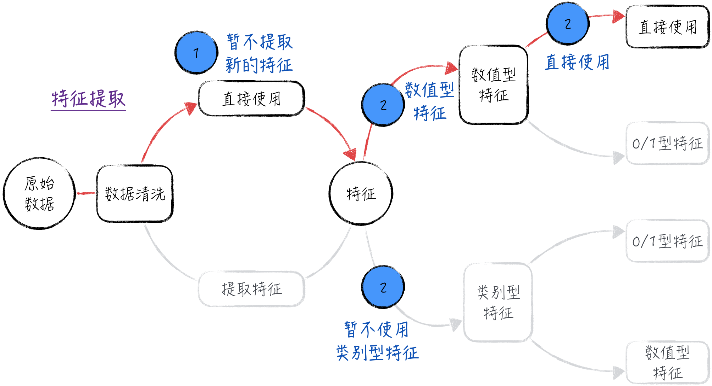
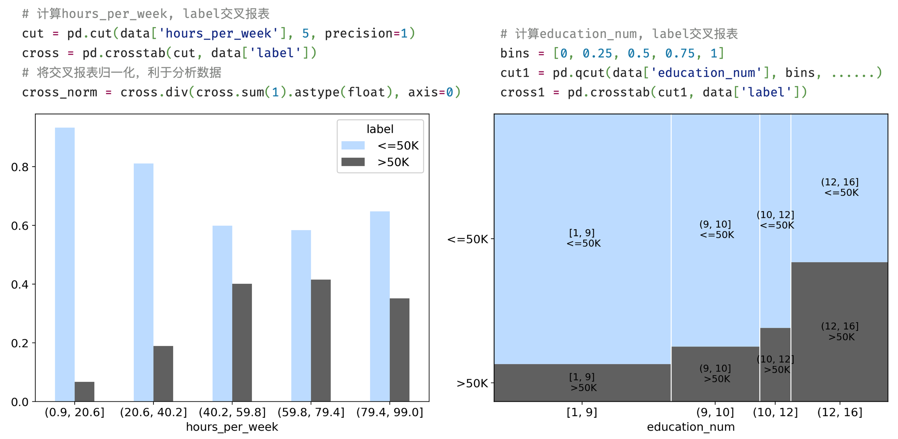
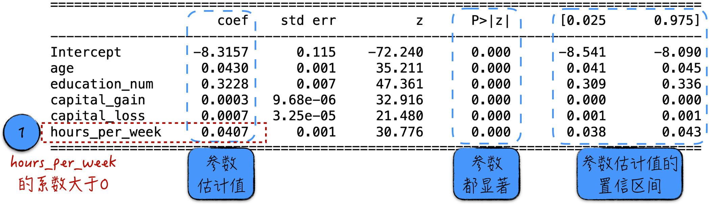
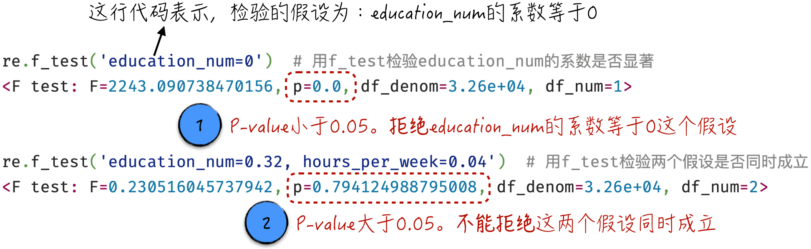
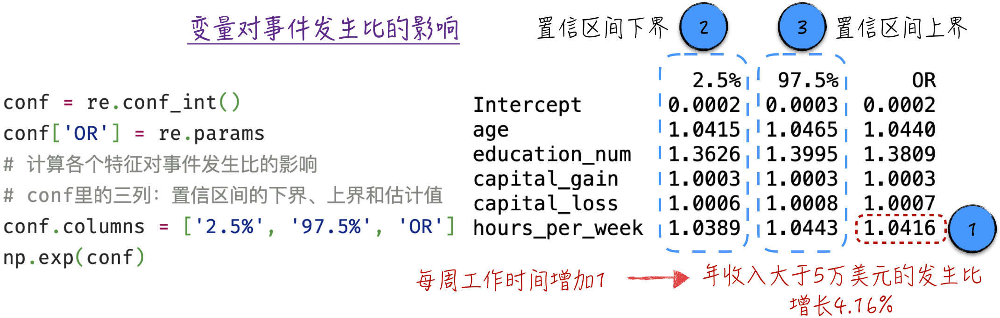
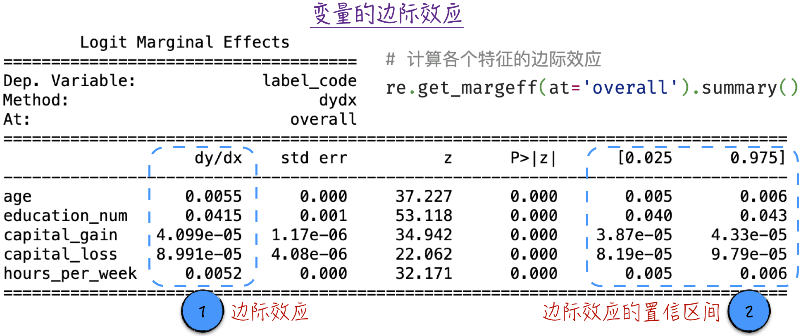

## 4.2 模型实现

本节将以美国加州大学欧文分校提供的个人收入普查数据为例，讨论如何搭建逻辑回归模型。该数据集中包含多个变量（如表 4-1 所示），要预测的标签是 `label`（年收入分类），它是一个二元变量，只有两种可能的取值。

表 4-1

| 变量名 | 变量类型 | 说明 |
| --- | --- | --- |
| `age` | 数值型变量 | 年龄 |
| `workclass` | 类别型变量 | 工作类型，如公务员、私企职工等 |
| `fnlwgt` | 数值型变量 | 抽样权重（普查时使用的变量，与建模分析无关） |
| `education` | 类别型变量 | 学历，如本科、研究生等 |
| `education_num` | 数值型变量 | 受教育年限 |
| `martial-status` | 类别型变量 | 婚姻状况 |
| `occupation` | 类别型变量 | 所在行业 |
| `relationship` | 类别型变量 | 家庭角色，比如丈夫、妻子等 |
| `race` | 类别型变量 | 种族 |
| `sex` | 类别型变量 | 性别 |
| `capital_gain` | 数值型变量 | 该年度投资收益 |
| `capital_loss` | 数值型变量 | 该年度投资损失 |
| `hours_per_week` | 数值型变量 | 每周工作时间 |
| `native_country` | 类别型变量 | 出生国家 |
| `label` | 类别型变量 | 年收入分类，分为两类：“>50K”和“<=50K” |

### 4.2.1 初步分析数据：直观印象

在数据集中，变量包括两种类型：数值型变量和类别型变量。数值型变量代表具体数值，例如年龄；类别型变量表示类别或类型，比如学历。这两者之间存在以下区别。

- 数值型变量可以直接进行数学运算。例如，53 岁加 2 岁等于 55 岁，这种数学运算具有实际意义。
- 类别型变量不能直接进行数学运算。比如，高中学历和本科学历无法进行数学运算。即使将类别型变量映射为数字（例如，用 1 表示高中学历，2 表示本科学历，3 表示研究生学历），其数学计算结果也是毫无实际意义的。例如，数学运算 $1+2=3$，但高中学历加上本科学历并不等同于研究生学历。

显而易见，数值型变量与类别型变量在本质上存在显著差异，因此在特征提取阶段需要分别处理。为了专注于逻辑回归模型本身，我们暂时只利用数值型变量（关于类别型变量的使用细节，请参考 [5.2 节](/books/deconstructing_LLM/chapter-5/5-2)），包括年龄、受教育年限、年度投资收益、年度投资损失和每周工作时间。特征处理的完整过程如图 4-6 所示。

模型的预测标签 `label` 仍属于类别型变量，因此需要创建一个新的数值变量来代表它。具体来说，在原始数据的基础上，生成一个名为 `label_code` 的新变量。这个变量有两个可能取值：0 代表“<=50K”（收入小于或等于 5 万美元），1 代表“>50K”（收入大于 5 万美元）。



在建立模型之前，我们需要对数据有基本的了解，包括两个方面：一是各个变量本身的分布情况；二是变量之间的相关关系，特别是自变量与预测标签之间的关联。

为了更清晰地了解各个变量的分布情况，可以通过直方图进行可视化。直方图的横轴表示变量的取值范围，纵轴表示样本在每个取值范围内的频数，如图 4-7 所示（[完整代码](https://github.com/GenTang/regression2chatgpt/blob/zh/ch04_logit/logit_regression.ipynb)）。通过直方图能直观地观察数据的分布情况，发现数据的集中趋势、离散程度，以及可能存在的异常值或特殊模式。


若要分析变量之间的相关关系，交叉报表（Crosstab）是一种直观且有效的方法。以每周工作时间（`hours_per_week`）和年收入分类（`label`）为例，可将工作时间按大小均匀分为 5 个区间，然后分别计算每个区间内标签的分布情况。分析结果如图 4-8 左侧所示，可以看出，年收入超过 5 万美元的比例并不总与每周工作时间成正比：当工作时间少于 80 小时时，年收入超过 5 万美元的比例随工作时间增加而增加；然而，工作时间超过 80 小时后，年收入超过 5 万美元的比例反而下降了。

我们也可以通过更复杂的图表展示交叉报表的结果。图 4-8 右侧所示为受教育年限（`education_num`）和预测标签的分析结果。图中方块面积的大小与对应区间内的数值成正比。通过这个图表，可以轻松得出结论：随着受教育年限的增加，年收入超过 5 万美元的比例也随之增加。



这些基础分析有助于我们理解各个变量的情况及其之间的关系，为模型的构建和特征选择提供了重要的参考依据。

### 4.2.2 搭建模型

经过上述的准备和分析，下面开始搭建逻辑回归模型。具体的代码实现并不复杂，可以参考程序清单 4-1。

1. 参考 [3.3.1 节](/books/deconstructing_LLM/chapter-3/3-3#section-3-3-1)中的讨论，为了避免过拟合问题，需要将数据分成互不相交的两个部分：一部分用于训练模型，剩余部分用于评估模型效果。如第 5 行代码所示，将数据分为训练集和测试集，其中测试集占比 20%。
2. 第 7 行和第 8 行代码展示了 statsmodels 使用字符串搭建模型的方式[^formula-syntax]。为了更好地理解这种定义的语法，下面通过一个更简单的例子来解释。假设模型的字符串是 `label_code ~ age + age * education_num`，它代表着模型的预测标签是 `label_code`；模型的特征有两个，分别是原始变量 `age` 和新生成的特征 `age * education_num`（年龄乘以受教育年限）。

#### 程序清单 4-1 逻辑回归模型（[完整代码](https://github.com/GenTang/regression2chatgpt/blob/zh/ch04_logit/logit_regression.ipynb)）

```python
from sklearn.model_selection import train_test_split
import statsmodels.api as sm

# 将数据分为训练集和测试集
train_set, test_set = train_test_split(data, test_size=0.2, random_state=2310)
# 训练模型并分析模型效果
formula = 'label_code ~ age + education_num + capital_gain + capital_loss + hours_per_week'
model = sm.Logit.from_formula(formula, data=data)
re = model.fit()
print(re.summary())
```

在模型训练完成（见程序清单 4-1 中的第 9 行代码）后，可以获得如图 4-9 所示的结果。

1. 与线性回归模型相似，结果中包含了参数的估计值和对应的置信区间。图中的结果显示，模型中的每个参数都具有显著性，这意味着没有变量需要被排除出模型。
2. 特别需要注意的是，变量 `hours_per_week` 对应的系数为 0.0407（图 4-9 中的标记 1）。这表明，随着每周工作时间的增加，年收入超过 5 万美元的可能性也随之增加（详细分析见 [4.2.3 节](/books/deconstructing_LLM/chapter-4/4-2#section-4-2-3)）。这一结论与图 4-8 所示的情况并不一致，年收入超过 5 万美元的比例并非一直与每周工作时间成正比。这种差异源自数值型变量本身的特性，相关的细节和解决方法请参考 [5.3 节](/books/deconstructing_LLM/chapter-5/5-3)。



此外，还可以通过 `f_test` 函数进行假设检验，具体的结果如图 4-10 所示。



### 4.2.3 理解模型结果

借助模型的具体形式和参数估计值，我们可以分析变量（特征）的变化对预测结果的影响，从而更好地理解数据之间的关系。在线性回归模型中，变量变化对结果的影响是直观且简单的。但是在逻辑回归中，情况略微复杂。本节将探讨两个常用的分析思路：一是变量变化对事件发生比的影响，二是变量的边际效应。

为了理解上述问题，可以从两个层面展开讨论：理论层面的数学推导和实践层面的代码实现。为了简化数学推导并突出重点，下面以一个更简单的逻辑回归模型为例，如公式（4-17）所示。其中，$P$ 表示事件发生的概率，而 $x$ 和 $z$ 为变量。

$$
\ln\frac{P}{1-P}=ax+bz+c
\tag{4-17}
$$

首先讨论事件的发生比如何受变量影响。在公式（4-17）中，假设变量 $z$ 不变，随着变量 $x$ 从 $k$ 增加到 $k+1$，可以得到：

$$
\begin{aligned}
\ln\operatorname{odds}(x=k)&=\ln\frac{P}{1-P}=ak+bz+c\\
\ln\operatorname{odds}(x=k+1)&=\ln\frac{P}{1-P}=a(k+1)+bz+c\\
\ln\frac{\operatorname{odds}(x=k+1)}{\operatorname{odds}(x=k)}&=a
\end{aligned}
\tag{4-18}
$$

回顾一下，$P/(1-P)$ 被称为发生比，表示某个事件发生与不发生的比值。稍微调整公式（4-18）可以得到 $\operatorname{odds}(x=k+1)/\operatorname{odds}(x=k)=e^a$。这表示：在其他变量不变的情况下，当变量 $x$ 增加 1 时，对应的发生比变为之前的 $e^a$ 倍[^odds-ratio]。

将这个分析结果应用到 [4.2 节](/books/deconstructing_LLM/chapter-4/4-2)的示例中，可以得到如图 4-11 所示的结果。值得再次强调的是，根据模型结果，年收入超过 5 万美元的发生比始终与每周工作时间成正比：每增加 1 小时的工作时间，年收入超过 5 万美元的发生比增长 4.07%。然而，这与图 4-8 所示的实际情况不相符，需要相应地修改模型。有关这一问题的详细解释和解决方法，请参考 [5.3 节](/books/deconstructing_LLM/chapter-5/5-3)。



接下来讨论变量变化的边际效应。与事件发生比这种中间结果相比，我们更感兴趣的是变量对最终结果的影响：当某个变量增加 1 时，事件发生的概率会如何变化？这在学术中称为变量的边际效应。从数学角度来看，某个变量的边际效应等于被预测量相对于这个变量的导数。对公式（4-17）两边求关于 $x$ 的导数，得到公式（4-19）。

$$
\begin{aligned}
\frac{1}{P}\frac{\partial P}{\partial x}+\frac{1}{1-P}\frac{\partial P}{\partial x}&=a\\
\frac{\partial P}{\partial x}&=aP(1-P)
\end{aligned}
\tag{4-19}
$$

公式（4-19）可以简单理解为：当 $x$ 增加 1 时，事件发生的概率将增加 $aP(1-P)$。由于 $P$ 表示事件发生的概率，对于不同数据点，参数 $a$ 是恒定的，而 $P$ 通常是不同的。这导致某一变量在不同数据点上的边际效应是不同的[^marginal-effect]。这与线性回归模型不同，后者的边际效应是恒定的。因为变量的边际效应不恒定，所以在实际应用中，通常先计算所有数据点上该变量的边际效应，然后求这些边际效应的平均值。这个平均值将被视为该变量的边际效应。

将这一分析结果应用到 [4.2.2 节](/books/deconstructing_LLM/chapter-4/4-2#section-4-2-2)的模型中，得到如图 4-12 所示的结果。结果中包含变量的边际效应和相应的置信区间。例如，根据图中的结果，当受教育年限（`education_num`）增加 1 时，年收入超过 5 万美元的概率将增加 0.0415；而且这个概率的增加在 95% 的情况下将位于 $[0.040,0.043]$ 区间内。



[^formula-syntax]: 如果读者对另一种常用的统计编程语言——R 语言比较熟悉，会发现 statsmodels 中定义模型的语法和 R 语言中的几乎一模一样。
[^odds-ratio]: 在统计上，$\operatorname{odds}(x=k+1)/\operatorname{odds}(x=k)$ 被称为机会比（Odds Ratio）。它常被用来度量：在不同的组别间，某个事件的发生比是否存在明显差异。
[^marginal-effect]: 对于更一般的情况，对逻辑回归公式的两边分别求 $\mathbf X$ 的导数，可以得到 $\frac{\partial P}{\partial\mathbf X}=P(1-P)\boldsymbol\beta$。其中，$\boldsymbol\beta$ 是恒定的，而 $P$ 是变动的。所以同样可得，在逻辑回归模型中，变量的边际效应不恒定。
