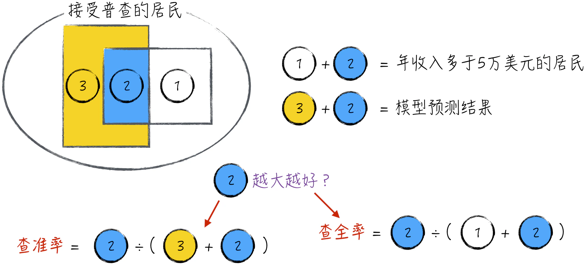
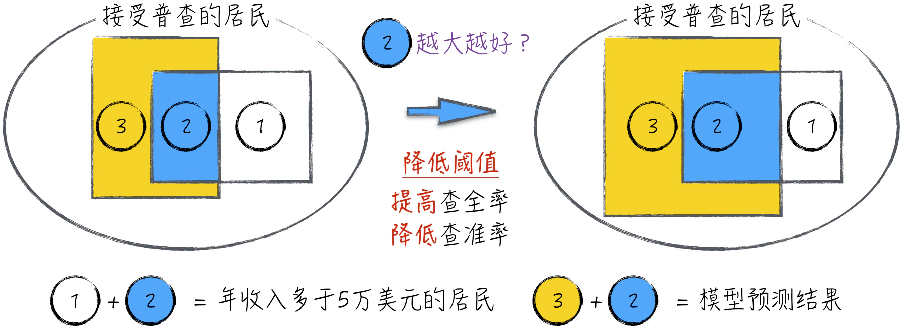
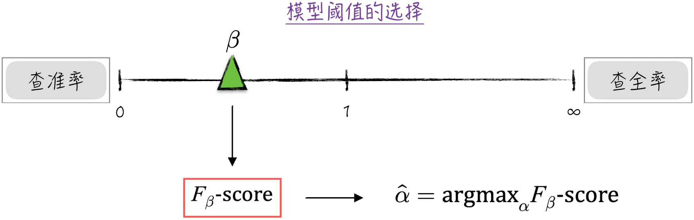
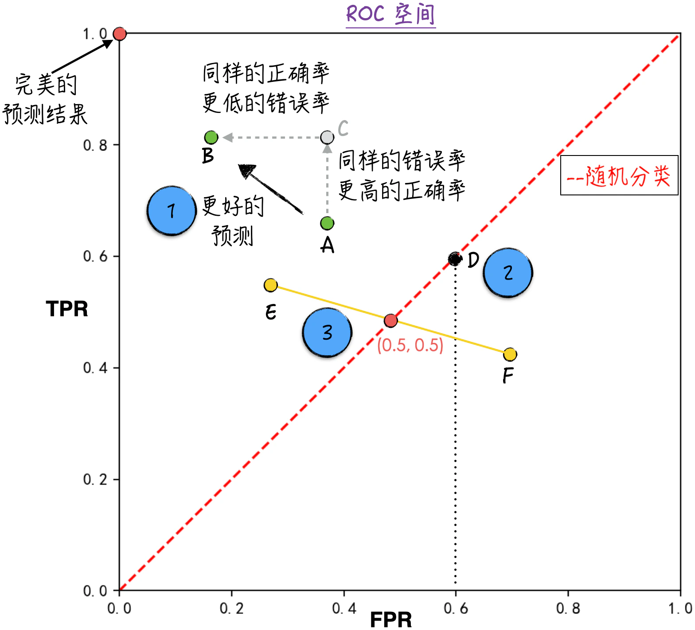
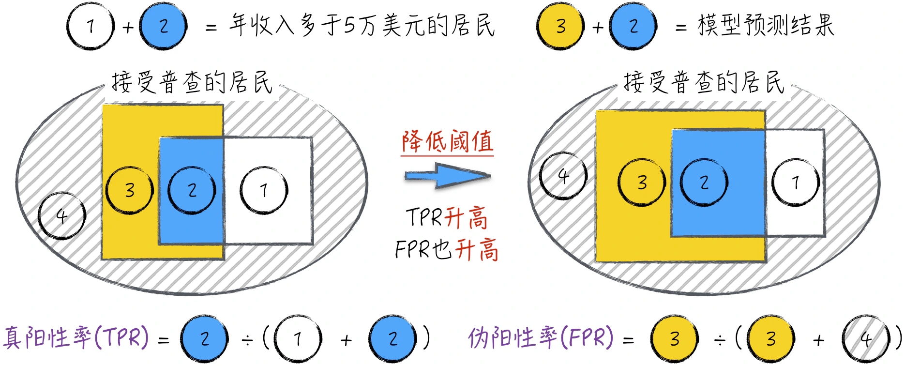
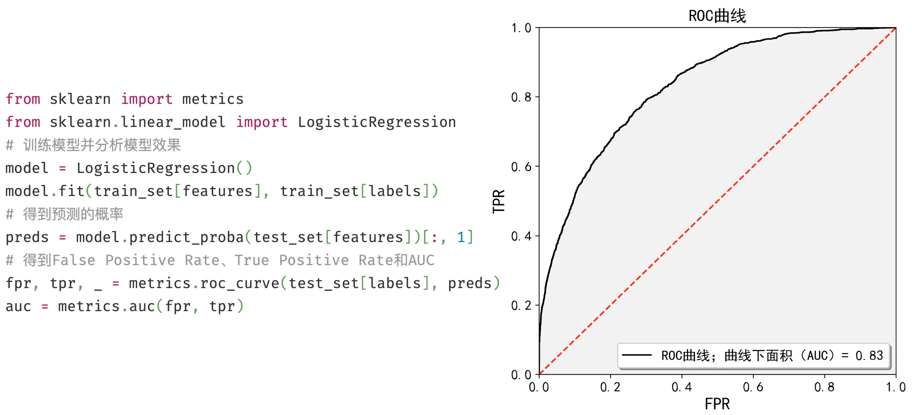
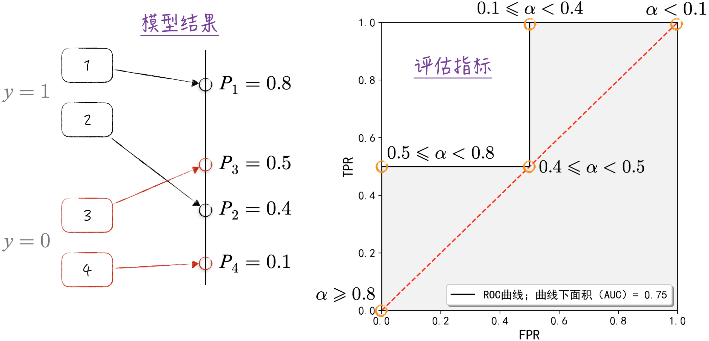

## 4.3 评估模型效果

经过训练的逻辑回归模型可以用来预测未知数据。回顾 [4.1.6 节](/books/deconstructing_LLM/chapter-4/4-1#section-4-1-6)，逻辑回归模型的预测结果不是事件是否发生，而是事件发生的概率。换句话说，逻辑回归的输出并非最终结果，而是需要进一步处理的中间值。具体的处理方式如公式（4-20）所示。

$$
\hat y_i=
\begin{cases}
1,&\hat P(y_i=1)>\alpha\\
0,&\hat P(y_i=1)\leq\alpha
\end{cases}
\tag{4-20}
$$

公式中的符号含义如下。

- $y_i=1$ 表示居民 $i$ 的年收入多于 5 万美元；$y_i=0$ 表示居民 $i$ 的年收入不多于 5 万美元；而 $\hat y_i$ 是 $y_i$ 的预测值。
- $\hat P(y_i=1)$ 表示模型返回的预测概率值，即年收入多于 5 万美元的预测概率。
- $\alpha$ 表示事件发生的阈值，通常取值为 $\alpha=0.5$。

代码实现如程序清单 4-2 所示。

#### 程序清单 4-2 预测结果（[完整代码](https://github.com/GenTang/regression2chatgpt/blob/zh/ch04_logit/logit_regression.ipynb)）

```python
# 使用训练好的模型对测试数据做预测
# 计算事件发生的概率
test_set['prob'] = re.predict(test_set)
print('事件发生概率（预测概率）大于 0.6 的数据个数：')
print(test_set[test_set['prob'] > 0.6].shape[0]) # 584
print('事件发生概率（预测概率）大于 0.5 的数据个数：')
print(test_set[test_set['prob'] > 0.5].shape[0]) # 846
```

显然，改变阈值 $\alpha$ 的取值会导致不同的预测结果。例如，降低阈值将产生更多 $\hat y_i=1$ 的预测，如第 5～7 行代码所示。虽然阈值 $\alpha$ 在很大程度上决定了最终的预测结果，但它并不是模型的一部分。类似于 [3.3.3 节](/books/deconstructing_LLM/chapter-3/3-3#section-3-3-3)中介绍的超参数，$\alpha$ 的选择取决于业务场景和数据科学家的经验。接下来将探讨如何根据实际情况选择合适的阈值。

### 4.3.1 查准率与查全率

在讨论如何选择阈值 $\alpha$ 之前，首先探讨针对二元分类问题如何正确评估一份预测结果的效果，这也是选择阈值 $\alpha$ 的基础。

使用公式（4-20）中的数学记号，如图 4-13 所示，标记 1 的方块表示 $\hat y_i=0,y_i=1$ 的数据；标记 3 的凹形方块表示 $\hat y_i=1,y_i=0$ 的数据；标记 2 的方块表示 $\hat y_i=1,y_i=1$ 的数据[^positive-class]。这些图形的面积与相应数据的数量成正比，例如，$\hat y_i=1$ 且 $y_i=1$ 的数据个数越多，标记 2 的面积越大。

显然，图 4-13 中标记 2 的部分代表模型预测结果正确，而标记 1 和标记 3 的部分表示模型预测结果错误。

- 一方面，我们希望预测结果具有精确性：当 $\hat y_i=1$ 时，真实值 $y_i$ 很可能也等于 1。在图中的表现是，标记 2 的面积很大，而标记 3 的面积很小。
- 另一方面，我们希望预测结果具备全面性：对于几乎所有的 $y_i=1$，对应的预测值 $\hat y_i$ 也等于 1。在图中的表现是，标记 2 的面积很大，而标记 1 的面积很小。

根据上面的讨论，定义两个量化评估的指标：查准率（Precision）和查全率（Recall）[^precision-translation]。这两个指标的直观解释如图 4-13 所示。



下面从数学的角度严格定义这两个指标。将数据根据预测值和真实值分成 4 类，具体如表 4-2 所示[^classification-errors]。表中的术语可能有些拗口，例如真阳性、伪阴性等，读者需要理解这些术语背后的内涵，而不只是生硬地记名词。

表 4-2

| 预测值 | 真实值为 1 | 真实值为 0 |
| --- | --- | --- |
| 1 | 真阳性（True Positive，TP），图 4-13 中的标记 2 | 伪阳性（False Positive，FP），图 4-13 中的标记 3 |
| 0 | 伪阴性（False Negative，FN），图 4-13 中的标记 1 | 真阴性（True Negative，TN） |

根据表中的定义，可以得到查准率和查全率的数学定义为

$$
\begin{aligned}
\operatorname{Precision}&=\frac{TP}{TP+FP}\\
\operatorname{Recall}&=\frac{TP}{TP+FN}
\end{aligned}
\tag{4-21}
$$

进一步推导可得到这两个指标的概率定义：

$$
\begin{aligned}
\operatorname{Precision}&=P(y_i=1\mid\hat y_i=1)\\
\operatorname{Recall}&=P(\hat y_i=1\mid y_i=1)
\end{aligned}
\tag{4-22}
$$

### 4.3.2 F-score

一份“完美”的预测结果应该在查准率和查全率上都表现优异。但实际情况是残酷的，这两个指标通常呈现一种“此消彼长”的趋势。举一个极端的例子来说明，假设模型预测所有居民的年收入都多于 5 万美元，这将导致查全率为 100%，但相应的查准率会相当低，而且这样的预测结果显然缺乏实际意义。



尽管在数学上很难严格地证明，但通常情况下，降低模型的阈值 $\alpha$（见公式（4-20））往往会提高其查全率，但同时会降低其查准率；反之亦然。这个过程可以用图 4-14 直观地展示出来。

由于存在这种“此消彼长”的趋势，在评估模型性能时需要综合考虑查准率和查全率，因此引入了 $F_1$-score。具体定义见公式（4-23），这个指标其实是查准率和查全率的调和平均数，它综合考虑了模型预测结果的准确性和覆盖率，能够更全面地评估模型性能。

$$
F_1=\frac{2}{\dfrac{1}{\mathrm{precision}}+\dfrac{1}{\mathrm{recall}}}
=2\frac{\mathrm{precision}\times\mathrm{recall}}{\mathrm{precision}+\mathrm{recall}}
\tag{4-23}
$$

引入了 $F_1$-score 后，在实践中可以利用它来选择最优的阈值 $\hat\alpha$，即 $\hat\alpha=\operatorname*{argmax}_{\alpha}F_1$。但如果仔细思考就会发现，这个指标对查准率和查全率的权重是一样的。然而，在某些情况下，我们可能更偏向于优化其中一个指标，比如查准率。为此，进一步定义了 $F_\beta$-score：

$$
F_\beta=(1+\beta^2)\frac{\mathrm{precision}\times\mathrm{recall}}{\beta^2\times\mathrm{precision}+\mathrm{recall}}
\tag{4-24}
$$

当 $\beta$ 趋近于 0 时，$F_\beta$-score 更倾向于优化查准率，而当 $\beta$ 很大时，则更侧重于优化查全率，整个过程如图 4-15 所示。



查准率、查全率以及 $F_\beta$-score 是二元分类问题常用的评估指标。具体的代码实现可参考程序清单 4-3。其中，查准率的计算在第 6 行，查全率的计算在第 7 行，而 $F_1$-score 在第 8 行。

#### 程序清单 4-3 评估指标（[完整代码](https://github.com/GenTang/regression2chatgpt/blob/zh/ch04_logit/logit_regression.ipynb)）

```python
# 计算预测结果的查准查全率以及 f1
bins = np.array([0, 0.5, 1])
label = test_set['label_code']
pred = test_set['pred']
tn, fp, fn, tp = np.histogram2d(label, pred, bins=bins)[0].flatten()
precision = tp / (tp + fp) # 0.702
recall = tp / (tp + fn) # 0.377
f1 = 2 * precision * recall / (precision + recall) # 0.491
```

### 4.3.3 ROC 空间

在考察查准率、查全率以及 $F_\beta$-score 的定义时，会发现这些指标都依赖于阈值 $\alpha$ 的选择。换句话说，需要首先确定 $\alpha$ 的取值，才能计算这些评估指标。那么是否存在一种不依赖于 $\alpha$ 的评估指标呢？这是本节要讨论的内容。

深入思考查全率的定义 $\operatorname{Recall}=TP/(TP+FN)$，其中，分母表示数据中实际年收入多于 5 万美元的居民数量，即 $y_i=1$ 的个数。这个数值是固定的，与模型无关；当然，查全率的分子也受模型影响。相比之下，查准率的定义是 $\operatorname{Precision}=TP/(TP+FP)$，它的分母表示模型预测为年收入多于 5 万美元的居民数，即 $\hat y_i=1$ 的个数。也就是说，在查准率中，分子和分母都受模型的影响。因此，当查准率发生变化时，很难明确判断变化中有多少来源于分子，有多少来源于分母。这限制了查准率对模型效果进行深入分析的能力。

为了解决这个问题，可以借鉴查全率的思路：固定分母，仅让模型预测影响评估指标的分子。基于这一思路，引入真阳性率（True Positive Rate，TPR）和伪阳性率（False Positive Rate，FPR）这两个指标。使用表 4-2 中定义的记号，这两个指标的具体定义如公式（4-25）所示，相应的直观例子可参考 [4.3.4 节](/books/deconstructing_LLM/chapter-4/4-3#section-4-3-4)中的图 4-17。

$$
\begin{aligned}
TPR&=\frac{TP}{TP+FN}\\
FPR&=\frac{FP}{FP+TN}
\end{aligned}
\tag{4-25}
$$

根据公式可知，真阳性率实际上就是查全率。它衡量了模型对年收入多于 5 万美元的居民的预测准确度，即模型正确识别这部分人的能力。而伪阳性率则表示模型错误地将年收入少于 5 万美元的居民预测为年收入多于 5 万美元的比例，是衡量模型错误程度的指标。对于任何预测结果，我们期望真阳性率越高越好，伪阳性率越低越好。

一旦定义了真伪阳性率这两个评估指标，就可以考虑以图形的方式呈现它们：以伪阳性率（FPR）为横轴、真阳性率（TPR）为纵轴绘制一个边长等于 1 的正方形，这就构成了 ROC 空间[^roc-name]（Receiver Operating Characteristic Space）。因此，对于任何预测结果，可以根据其真伪阳性率在 ROC 空间中标示出一个点，具体如图 4-16 所示。



在 ROC 空间方面，有几个比较重要的注意点。

1. 在 ROC 空间中，距离左上角越近的点代表具有越高的预测准确率。以图 4-16 中的 $A$、$B$ 两点为例，$B$ 点位于 $A$ 点的左上方，具有更高的正确率和更低的错误率，因此是更优异的预测结果。图中正方形左上角的点表示预测结果与真实情况完全一致，是一份完美的预测结果。
2. 假设针对每个数据点 $i$ 采用以下的预测策略：60% 的概率预测 $\hat y_i=1$；40% 的概率预测 $\hat y_i=0$。这是完全随机的分类结果。在 ROC 空间中，其真阳性率和伪阳性率均为 60%，对应图中的点 $D$。以此类推，图中的虚线（正方形的对角线）代表所有随机分类的预测结果。
3. 显然，随机分类只是依据一定的概率进行猜测，没有真正的预测功能，因此在理论上是最差的预测方式。然而，需要特别注意图中的点 $F$，它位于对角线的右下方，代表着比随机分类更糟糕的预测效果，这是绝对不能被接受的。事实上，通过完全反转 $F$ 点的结论，就能得到一个更优的预测结果：点 $E$。因此，如果一份预测结果出现在对角线右下方，这提示我们要检查可能存在的计算错误（这为模型调试提供了一个可参考的标准）。

### 4.3.4 ROC 曲线与 AUC

在实践中，查准率和查全率通常呈现“此消彼长”的关系。真伪阳性率则不同，它们是正相关的。以逻辑回归模型为例，当降低阈值时，真伪阳性率都会随之上升。这是因为这两个指标的分母是固定的，而随着阈值的降低，两个指标的分子都会增大（模型预测为 1 的数量会增加），整个过程如图 4-17 所示。可以更形象地理解为：真阳性率代表预测的回报，而伪阳性率是所需付出的代价。和生活中的某些情境一样，更高的回报通常伴随着更高的代价。



从 0 到 1 逐渐增加模型的阈值，并记录每个阈值对应的预测结果[^roc-direction]，就能得到模型的 ROC 曲线，也称作接收者操作特征曲线（Receiver Operating Characteristic Curve）。以 [4.2 节](/books/deconstructing_LLM/chapter-4/4-2)中讨论的模型为例，其 ROC 曲线如图 4-18 右侧所示。同时，具体的实现代码可参考图 4-18 左侧（[完整代码](https://github.com/GenTang/regression2chatgpt/blob/zh/ch04_logit/roc_curve.ipynb)），使用 scikit-learn 来完成这一任务并不困难。

参考 [4.3.3 节](/books/deconstructing_LLM/chapter-4/4-3#section-4-3-3)中对 ROC 空间的讨论（在空间中，左上的点表示更好的预测结果），会发现 ROC 曲线越靠近空间的上沿和左侧，模型的预测效果越好。为了量化这一观点，引入 AUC（曲线下面积，Area Under the Curve）指标。AUC 指标等于 ROC 曲线下方的面积，即图 4-18 中灰色部分的面积。AUC 面积越大，表明模型的预测效果越好。这个指标并不依赖于模型阈值的设定，它完全基于模型本身，能有效地评估其预测性能。因此，AUC 被认为是更全面、更可靠的评估指标。



### 4.3.5 AUC 的概率解释

实际上，AUC 具有非常明确的数学意义，本节将深入讨论这一指标。在进行抽象的数学探讨之前，来看一个直观的例子：假设数据集中有 4 个数据，分别编号为 1、2、3、4。

- 这些数据基于 $y_i$ 的取值被分为两组：第一组的取值等于 1，包含数据 1、2，即 $y_1=y_2=1$；第二组的取值等于 0，包含数据 3、4，即 $y_3=y_4=0$。
- 假设模型对这些数据的预测结果表示 $y_i=1$ 的概率（不妨称之为数据的得分）。其中，数据 1 和 2 的得分为 $P_1=0.8,P_2=0.4$；而数据 3 和 4 的得分为 $P_3=0.5,P_4=0.1$，如图 4-19 左侧所示。

通过计算可知，在两组数据中分别随机选择一个数据，第一组得分高于第二组得分的概率为 0.75。如果将模型结果绘制在 ROC 空间中，可以得到图 4-19 右侧所示的 ROC 曲线，相应的 AUC 正好也等于 0.75。这一现象是巧合吗？

这当然不是巧合。回到更一般的情况，假设逻辑回归模型的预测结果是 $\hat P(y_i=1)$（模型预测 $y_i=1$ 的概率）。现在随机选择两个数据，记为 $k$ 和 $l$。其中，$k$ 的真实标签是 $y_k=1$，$l$ 的标签是 $y_l=0$。若模型对这两个数据的预测结果是 $\hat P(y_k=1)>\hat P(y_l=1)$，则意味着模型的直接预测结果是正确的（当然，由于模型阈值的原因，最终的预测结果不一定正确）。数学上可以证明，AUC 正是这种情况发生的概率，即 $k$ 的得分高于 $l$ 得分的概率。换句话说，AUC 可以被视为模型正确预测的概率。这种关系可以用数学公式表示为

$$
AUC=P\left(\hat P(y_k=1)>\hat P(y_l=1)\right)
\tag{4-26}
$$



虽然传统的 AUC 常用于二元分类问题，但从概率的角度理解它，有助于将这一指标推广至更广泛的应用场景，例如基于偏好的大规模推荐系统。本书篇幅有限，无法深入介绍相关细节，有兴趣的读者可以参考其他资料进一步了解[^auc-reference]。

[^positive-class]: 在实际应用中，对于一个二元分类问题，我们通常更关注其中的某一类。比如在这个例子中，年收入多于 5 万美元是关注的焦点。在建模前的数据转换时，常常将更关注的类别转换成 1。因此对预测结果进行评估时，关注点通常会聚焦于真实值或预测值等于 1 的情况。
[^precision-translation]: 在有的文献中，将查准率翻译为精确率，将查全率翻译为召回率。
[^classification-errors]: 在统计学中，伪阳性（False Positive）又被称为第一型错误（Type I Error），而伪阴性（False Negative）被称为第二型错误（Type II Error）。因此，查准率通常被认为是衡量第一型错误的指标，而查全率是衡量第二型错误的指标。
[^roc-name]: 这个术语的中文翻译是接收者操作特征空间。这个名称非常奇怪拗口，这是因为 ROC 空间及其上的 ROC 曲线最初由二战中的电子工程师和雷达工程师发明，用于根据接收的信号侦测战场上的敌军载具，例如飞机和船舰。
[^roc-direction]: 预测结果从 ROC 空间的 $(1,1)$ 这个点移动到 $(0,0)$ 这个点。
[^auc-reference]: 有兴趣的读者可参考 *Advanced Analytics with Spark* 一书中的[第 3 章](/books/deconstructing_LLM/chapter-3)。
